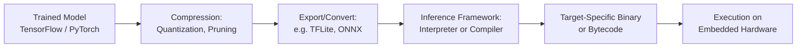
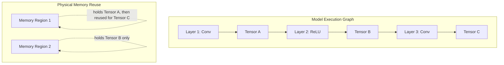
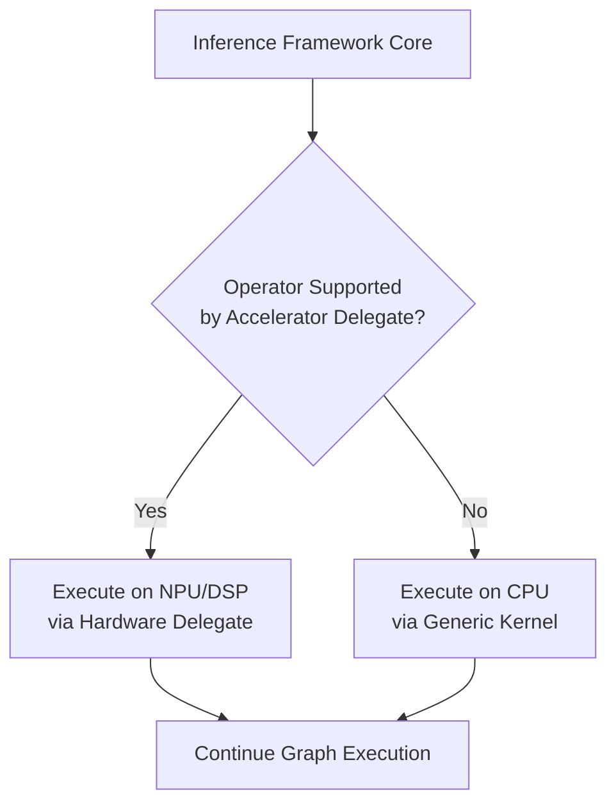

## Embedded Inference Frameworks

### Overview

Embedded inference frameworks are the software runtimes and toolchains responsible for loading a trained (and typically compressed) machine learning model and executing it efficiently on resource-constrained hardware — microcontrollers, DSPs, NPUs, and low-power application processors. They bridge the gap between a model exported from a training framework (TensorFlow, PyTorch, etc.) and actual execution on embedded silicon, handling memory planning, operator execution, and often hardware-specific kernel acceleration.

### Role of an Inference Framework in the Deployment Pipeline

An inference framework's core responsibilities typically include: parsing the model file format, planning memory allocation for weights and activations, executing (or compiling ahead-of-time) the sequence of operators, and optionally invoking hardware-accelerated kernels for supported operations.

### Interpreter-Based vs. Compiler-Based Execution

**Interpreter-Based Frameworks**

Load a model graph representation at runtime and execute it operator-by-operator via an interpreter loop, similar in spirit to how a scripting language interpreter executes bytecode.

- **Pros**: Flexible — the same firmware binary can load different models without recompilation; simpler deployment workflow for iterating on models.
- **Cons**: Interpreter dispatch overhead adds latency per operation compared to statically compiled code; the interpreter itself consumes flash/RAM footprint independent of the model.

**Compiler-Based (Ahead-of-Time) Frameworks**

Analyze the model graph at build time and generate target-specific machine code (or a highly specialized execution plan) that directly implements the model's computation, with no generic interpreter loop at runtime.

- **Pros**: Lower runtime overhead, smaller runtime footprint (no interpreter machinery needed), often better latency and code size for the specific deployed model.
- **Cons**: Changing the model typically requires recompiling and reflashing firmware; less runtime flexibility; build pipeline complexity is higher.

[Inference] The choice between interpreter- and compiler-based execution is generally understood as a flexibility-versus-efficiency trade-off in embedded ML deployment discussions, with compiler-based approaches typically favored when the model is fixed at deployment time and maximum efficiency matters most, though the actual overhead difference depends heavily on the specific framework implementation and target hardware.

### Major Embedded Inference Frameworks

**TensorFlow Lite for Microcontrollers (TFLite Micro)**

An interpreter-based runtime derived from TensorFlow Lite, specifically adapted to run without dynamic memory allocation, without an operating system dependency, and without standard C library assumptions that may not hold on bare-metal targets.

- Loads models in the **FlatBuffer**-based `.tflite` format.
- Uses a pre-allocated, fixed-size **tensor arena** for all activation/intermediate buffers, with no further heap allocation during inference — a deliberate design choice for memory determinism.
- Supports a defined subset of operators ("kernels"); models must be checked for operator compatibility with the microcontroller-targeted operator set, which is narrower than full TensorFlow Lite's mobile/desktop operator set.
- Commonly paired with **CMSIS-NN** on ARM Cortex-M targets for hardware-optimized kernel implementations of common operations (convolution, depthwise convolution, fully connected, pooling).

**CMSIS-NN**

Not a full inference framework on its own, but ARM's library of hand-optimized neural network kernel implementations for Cortex-M processors, providing SIMD-accelerated (on cores with DSP extensions) implementations of common layer operations. Typically used underneath a higher-level framework like TFLite Micro rather than invoked directly by application code.

**microTVM (Apache TVM)**

Part of the Apache TVM deep learning compiler stack, targeting bare-metal and RTOS-based microcontrollers through an ahead-of-time compilation flow.

- Uses TVM's compiler infrastructure to generate optimized, target-specific code from a model graph, rather than interpreting a generic bytecode format at runtime.
- Supports automated kernel tuning (auto-tuning search over implementation variants) to find efficient code for a specific target's instruction set and memory hierarchy.
- Generally positioned toward users wanting maximum control over the compilation pipeline and cross-framework model support (it can ingest models from multiple training frameworks via TVM's broader import capabilities).

**ONNX Runtime (Mobile/Edge variants)**

Microsoft's ONNX Runtime has mobile- and edge-oriented builds that reduce binary size and support quantized model execution, positioned more toward higher-tier edge devices (mobile phones, edge servers with OS support) than the most constrained microcontroller tier, though the boundary is not sharply fixed and lighter-weight configurations exist.

**Edge Impulse**

A commercial/hosted end-to-end platform covering data collection, model training, optimization, and deployment code generation targeting a range of MCU and edge hardware. Abstracts much of the manual pipeline construction (calibration, quantization, export) behind a guided workflow, trading some low-level control for faster iteration, particularly valued for rapid prototyping and for teams without deep in-house ML deployment expertise.

**Vendor-Specific Frameworks**

Many silicon vendors provide proprietary or semi-proprietary inference SDKs optimized for their own NPU/DSP accelerator hardware (examples include vendor neural processing SDKs bundled with specific SoC families). These typically offer the best performance on that specific hardware but at the cost of portability — a model pipeline built around one vendor's SDK generally does not transfer directly to another vendor's silicon without reconversion.

[Unverified] Specific vendor SDK names, feature sets, and supported hardware change frequently as silicon vendors update their product lines; current vendor documentation should be consulted for any specific hardware selection decision rather than relying on potentially outdated framework comparisons.

### Framework Comparison

| Framework | Execution Model | Primary Target Tier | Dynamic Memory Allocation | Typical Use Case |
|---|---|---|---|---|
| TFLite Micro | Interpreter | Microcontrollers (Cortex-M and similar) | No (fixed arena) | General-purpose MCU inference, wide ecosystem support |
| CMSIS-NN | Kernel library (not standalone) | Cortex-M with DSP/SIMD extensions | N/A (library, not runtime) | Accelerating TFLite Micro or custom runtimes on ARM MCUs |
| microTVM | Ahead-of-time compiler | Bare-metal / RTOS microcontrollers | No (compiled, static) | Maximum efficiency, auto-tuned kernels, cross-framework input |
| ONNX Runtime (edge builds) | Interpreter/graph executor | Higher-tier edge (mobile, OS-capable) | Often yes | Edge devices above the most constrained MCU tier |
| Edge Impulse | Hosted pipeline, generates embedded code | MCU to edge tier, broad hardware support | Depends on generated backend | Rapid prototyping, guided end-to-end workflow |
| Vendor NPU SDKs | Varies (often compiler-based) | Vendor-specific accelerator hardware | Varies | Maximum performance on specific silicon, less portable |

### Memory Planning in Embedded Inference

A central function of any embedded inference framework is **static memory planning** — determining, ahead of execution, how much RAM is needed for all intermediate activation buffers and how those buffers can be reused across the model's execution graph.

- **Tensor arena sizing**: Frameworks like TFLite Micro require the application to specify a fixed-size memory arena at startup; if the model's actual buffer requirements exceed this, initialization fails at runtime rather than at compile time, making arena sizing a common source of late-discovered deployment issues.
- **Buffer reuse analysis**: Since a model's computation graph typically has a much smaller "live set" of tensors at any single point in execution than the total number of tensors across all layers, frameworks analyze tensor lifetimes to reuse the same physical memory region for multiple logical tensors that are never live simultaneously — this significantly reduces peak RAM usage versus naively allocating separate memory for every tensor.

**Buffer Reuse Illustration**

### Operator Support and Portability

A recurring practical constraint across embedded inference frameworks is **operator coverage**: not every operation available in a full training-framework model (custom layers, certain activation functions, advanced attention mechanisms) is necessarily implemented in a given embedded runtime's operator set.

- Model architects targeting embedded deployment generally need to constrain architecture choices to operators known to be supported by the target inference framework, or implement custom operator kernels themselves — a non-trivial undertaking requiring familiarity with the framework's kernel interface.
- Conversion tools (e.g., the TensorFlow Lite converter) typically report unsupported operators at conversion time, but catching this early in the model design process avoids costly late-stage redesign.

### Hardware Acceleration Integration

Many embedded inference frameworks are designed with a pluggable backend/delegate mechanism, allowing specific operators to be offloaded to specialized hardware (NPU, DSP, dedicated ML accelerator) when available, while falling back to generic CPU kernels for unsupported operators on that hardware.

This delegate pattern allows partial hardware acceleration even when an accelerator doesn't support the full model's operator set, though frequent switching between accelerator and CPU execution within a single model can introduce data transfer/synchronization overhead that partially offsets the acceleration benefit.

### Design Trade-offs

- **Interpreter flexibility vs. compiled efficiency**: Interpreter-based frameworks (TFLite Micro) support swapping models without firmware recompilation; compiler-based frameworks (microTVM) generally achieve lower latency and smaller runtime footprint for a fixed, known model.
- **Portability vs. peak performance**: Cross-platform frameworks with broad hardware support trade some peak performance for portability across silicon vendors; vendor-specific SDKs achieve better performance on their target hardware at the cost of lock-in.
- **Guided platforms vs. manual pipelines**: Hosted end-to-end platforms (Edge Impulse) accelerate iteration and lower the expertise barrier but provide less fine-grained control than manually constructing the quantization/conversion/deployment pipeline.
- **Static arena sizing vs. runtime flexibility**: Fixed memory arenas provide deterministic RAM usage (valuable for real-time and safety-relevant systems) but require accurate upfront sizing and don't gracefully accommodate models with highly input-dependent memory requirements.

### Common Pitfalls

- Designing a model architecture using operators not supported by the target embedded framework, discovered only at conversion or deployment time rather than during model design.
- Under-sizing the tensor arena based on an estimate rather than the framework's actual computed requirement, causing runtime initialization failures.
- Assuming a hardware accelerator delegate covers the entire model, when in practice partial CPU fallback for unsupported operators can erode much of the expected performance gain due to data movement overhead between CPU and accelerator memory spaces.
- Treating a vendor-specific SDK's benchmark numbers as representative of a different (even similar-seeming) target device without validating on the actual deployment hardware.
- Neglecting to account for the inference framework's own flash/RAM footprint (interpreter code, runtime library) as part of the total resource budget, not just the model's own weight and activation memory.

**Related Topics**
- TensorFlow Lite Micro operator kernel implementation and custom operator development
- Hardware delegate/accelerator integration patterns for embedded ML runtimes
- Static memory planning and tensor lifetime analysis algorithms
- Cross-framework model conversion (ONNX, TensorFlow, PyTorch interoperability)
- Vendor NPU/DSP accelerator SDK evaluation criteria
- Benchmarking methodology for embedded inference latency and power
- Build system integration for compiled (ahead-of-time) inference pipelines