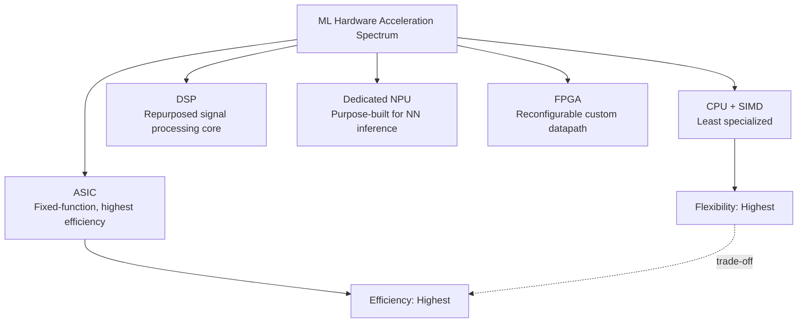
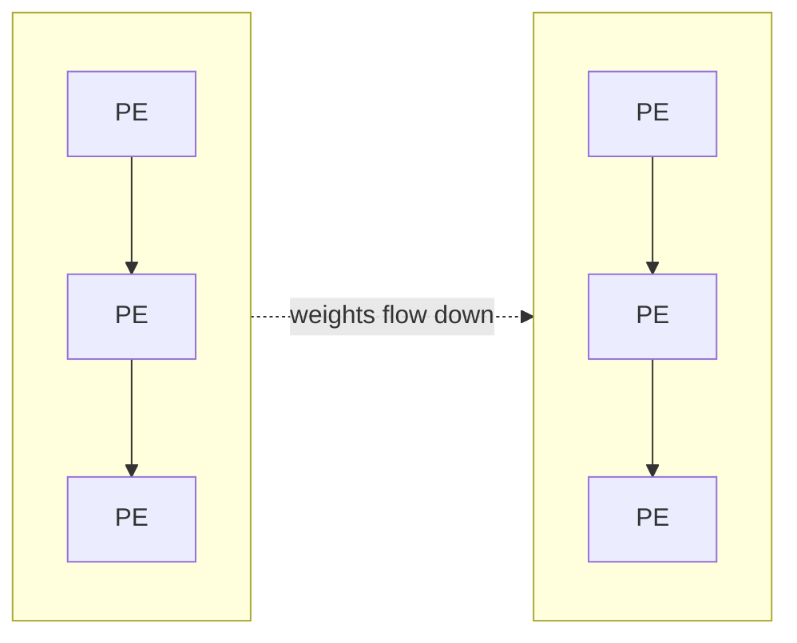
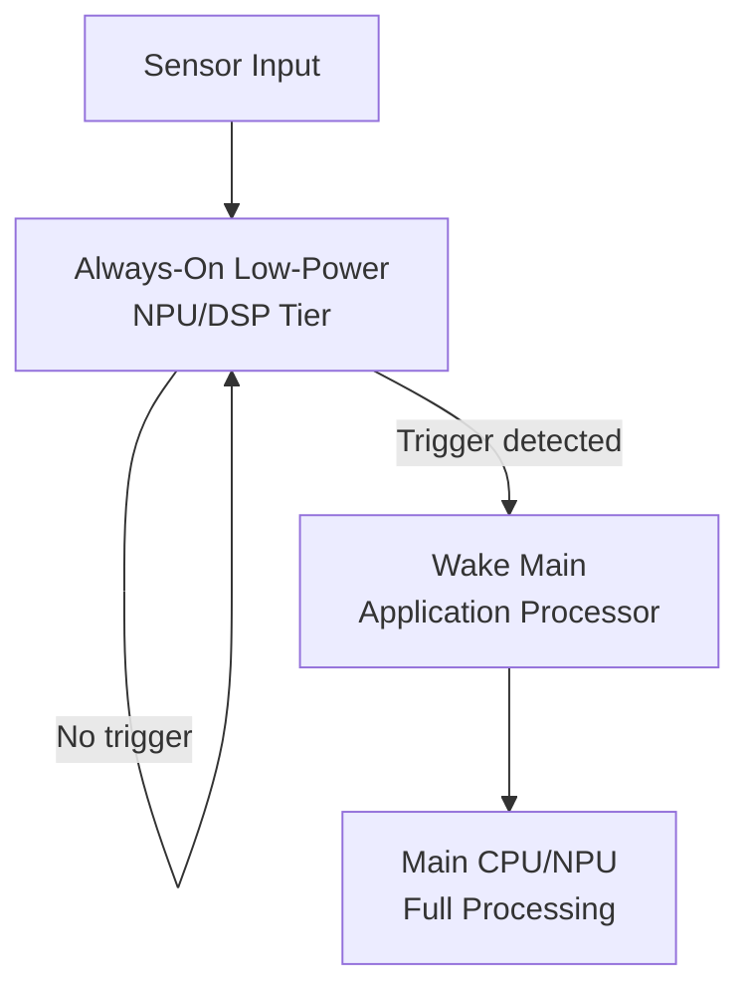

## Hardware Accelerators for ML Workloads

### Overview

Hardware accelerators for ML workloads are specialized processing units designed to execute the specific computational patterns of neural network inference (and sometimes training) far more efficiently than general-purpose CPUs. In embedded contexts, these range from small always-on microcontroller co-processors to dedicated NPU silicon blocks in application processors, all aimed at delivering higher throughput per watt than software execution on a general-purpose core.

### Why Specialized Hardware Is Needed

Neural network inference is dominated by a narrow set of operations — primarily **multiply-accumulate (MAC)** operations arranged in dense matrix/tensor multiplications and convolutions — executed repeatedly at massive scale. General-purpose CPUs execute these via generic instruction pipelines with overhead (instruction fetch/decode, branch handling, general-purpose register file management) that is not optimized for this narrow, highly regular workload pattern.

$$y_j = \sum_{i} w_{ij} \cdot x_i + b_j$$

This single equation, replicated across millions of weight-activation pairs, represents the overwhelming majority of compute in most neural network layers. Hardware accelerators are built around executing this MAC pattern with maximum parallelism and minimum per-operation overhead.

### Categories of ML Hardware Acceleration

**CPU with SIMD Extensions**

The least specialized tier — general-purpose CPU cores extended with Single Instruction, Multiple Data (SIMD) instructions that operate on multiple data elements per cycle.

- Examples relevant to embedded: ARM's DSP extensions and MVE (M-Profile Vector Extension, "Helium") on certain Cortex-M cores; NEON on Cortex-A cores.
- Requires no dedicated silicon block beyond instruction set extensions to an otherwise general-purpose core, keeping die area and design complexity lower than a separate accelerator.
- Libraries like CMSIS-NN are specifically written to exploit these SIMD extensions where present on the target core.

**Dedicated Neural Processing Units (NPUs)**

Purpose-built silicon blocks, separate from the CPU, specifically architected for neural network computation — typically featuring large arrays of MAC units, specialized on-chip memory hierarchies tuned for weight/activation reuse patterns, and reduced-precision integer arithmetic support.

- Found in a growing range of embedded/edge SoCs, from microcontroller-class chips with small always-on NPU blocks to higher-tier edge application processors with substantial NPU compute.
- Generally accessed through a vendor-provided SDK and inference framework delegate rather than direct low-level programming, per the delegate pattern common in embedded inference frameworks.

**Digital Signal Processors (DSPs)**

Originally designed for signal processing workloads (audio, communications), many embedded DSPs have been extended or repurposed to accelerate ML inference, given the mathematical overlap between signal processing and neural network computation (both are dominated by MAC-heavy operations).

- Often present in SoCs alongside a CPU and sometimes a separate NPU, providing another compute tier with its own trade-offs in flexibility versus specialization.
- Some architectures blur the line between "DSP" and "NPU" as vendors add increasingly ML-specific instructions to traditional DSP cores.

**FPGA-Based Acceleration**

Field-Programmable Gate Arrays allow custom hardware datapaths to be defined for a specific model or operator set, offering a middle ground between fixed-function ASIC efficiency and general-purpose flexibility.

- Enables highly customized dataflow architectures tuned to a specific model's structure, potentially achieving efficiency closer to a dedicated ASIC than a general-purpose accelerator.
- Requires hardware design expertise (HDL or high-level synthesis tooling) distinct from typical embedded software development, raising the engineering barrier to entry.
- Reconfigurability is a distinguishing advantage — the same FPGA fabric can be reprogrammed for a different model or even a different application domain entirely, unlike fixed-function NPU silicon.

**ASIC/Custom Silicon**

Application-Specific Integrated Circuits designed from the ground up for a fixed ML workload (or narrow family of workloads), offering the highest possible efficiency for that specific target at the cost of zero post-fabrication flexibility and high non-recurring engineering (NRE) cost.

- Justified primarily for extremely high-volume products where per-unit power/cost savings at scale outweigh the substantial upfront design and fabrication investment.
- [Inference] ASIC development is generally understood to make economic sense primarily at high production volumes given substantial NRE costs, though the exact volume threshold varies significantly by process node, design complexity, and business context, and is not a fixed, universal figure.

### Accelerator Landscape Overview

### Architectural Building Blocks of NPUs

**Systolic Arrays**

A common architectural pattern for MAC-heavy workloads: a grid of processing elements (PEs) where data flows rhythmically between neighboring PEs in a synchronized ("systolic") pattern, each PE performing a MAC operation and passing data onward, minimizing the need to repeatedly fetch data from memory.

This architecture (popularized in ML accelerator design broadly, including in some embedded-tier NPUs) reduces the memory bandwidth bottleneck by maximizing data reuse as it passes through the PE array, rather than re-reading operands from memory for every MAC operation.

**On-Chip Memory Hierarchy**

Because off-chip (or even on-chip but distant) memory access consumes far more energy than the MAC operation itself, NPU designs place heavy emphasis on local, small, fast memory (register files, local buffers) close to the compute units, minimizing data movement distance.

[Inference] The general principle that data movement (particularly to off-chip memory) dominates energy consumption relative to the arithmetic operation itself is well-established in computer architecture literature broadly; the specific energy ratios cited in various sources vary by process node and memory technology, so exact figures should be sourced from architecture-specific references rather than treated as universal constants.

**Reduced-Precision Arithmetic Units**

Most NPU designs natively support int8 (and increasingly int4 or mixed-precision) MAC operations rather than only floating-point, since integer arithmetic units are smaller, faster, and lower-power than floating-point units of equivalent throughput — directly complementing the quantization techniques used to prepare models for embedded deployment.

### Accelerator Integration Patterns in Embedded SoCs

**Tightly Coupled Accelerators**

The accelerator shares low-latency access to the same memory subsystem as the CPU (potentially even within the same coherency domain, depending on SoC design), minimizing data transfer overhead between CPU-orchestrated preprocessing and accelerator-executed inference.

**Loosely Coupled Accelerators**

The accelerator operates more independently, often with its own dedicated local memory, requiring explicit data transfer (DMA or similar) between CPU-accessible memory and accelerator memory before and after inference — introducing transfer latency and complexity that must be weighed against the accelerator's raw compute advantage.

**Always-On Low-Power Accelerator Tiers**

Some embedded SoCs include a very small, extremely low-power NPU or DSP tier specifically for always-on tasks (e.g., wake-word detection) that can operate independently of the main application processor, which remains in a deep sleep state until the always-on tier signals an event worth waking the main processor for — a pattern directly supporting the TinyML always-on sensing use case.

### Accelerator Comparison

| Accelerator Type | Flexibility | Efficiency (perf/watt) | Design/NRE Cost | Typical Embedded Use |
|---|---|---|---|---|
| CPU + SIMD | Highest | Lowest of the specialized tiers | None (existing core) | Low-volume, simple models, general-purpose fallback |
| DSP | High | Moderate | Low (existing IP, reused) | Signal-processing-adjacent ML, mixed workloads |
| Dedicated NPU | Moderate (fixed op set) | High | Moderate (often licensed IP) | Mainstream embedded/edge inference acceleration |
| FPGA | High (reconfigurable) | High (workload-tuned) | High (design expertise, tooling) | Custom/evolving workloads, prototyping custom accelerators |
| ASIC | None (fixed post-fab) | Highest | Very high (fabrication NRE) | Extremely high-volume, fixed, stable workloads |

[Unverified] Relative efficiency and cost rankings above reflect general architectural trade-off principles widely discussed in computer architecture and ML systems literature; precise quantitative comparisons depend heavily on specific process node, design generation, and workload, and should be validated against current datasheets/benchmarks for any specific hardware selection.

### Software Integration: The Delegate Pattern

As covered in the context of embedded inference frameworks, hardware accelerators are typically exposed to the inference framework through a **delegate** or **backend plugin** mechanism: the framework's core execution engine checks whether a given operator in the model graph has an available accelerator implementation, dispatching to the accelerator when possible and falling back to CPU execution otherwise. This keeps the accelerator-specific code isolated from the framework core, allowing the same model/framework combination to target different accelerator hardware by swapping the delegate implementation.

### Design Trade-offs

- **Specialization vs. flexibility**: More specialized hardware (ASIC, fixed-function NPU) achieves higher efficiency for its target workload but cannot adapt to architecturally different future models without hardware redesign or being limited to a fixed supported operator set; general-purpose CPU+SIMD adapts to any workload but at lower peak efficiency.
- **Always-on power budget vs. capability**: Always-on accelerator tiers must operate within extremely tight power budgets, which constrains the model complexity they can support — necessitating the TinyML-style compression techniques even at the hardware acceleration layer.
- **Tight vs. loose coupling**: Tightly coupled accelerators minimize data transfer overhead but constrain SoC design flexibility; loosely coupled accelerators are more modular but incur transfer latency that can offset compute gains for smaller models or frequent CPU-accelerator handoffs.
- **NRE investment vs. per-unit efficiency**: FPGA and ASIC routes trade higher upfront design cost and complexity for potentially much better per-unit power/performance at sufficient production volume — a decision that depends heavily on product volume projections and how fixed the target workload is expected to remain over the product's lifetime.

### Common Pitfalls

- Selecting accelerator hardware based on peak theoretical throughput (TOPS) figures without accounting for actual achievable utilization on the specific target model, which is often substantially lower than peak due to memory bandwidth limits, operator support gaps, and data movement overhead.
- Assuming full model coverage by an accelerator's delegate, when partial CPU fallback for unsupported operators can significantly erode expected performance and power benefits.
- Underestimating the data transfer overhead between loosely coupled accelerator memory and CPU-accessible memory, especially for smaller models where transfer time can dominate over actual compute time.
- Committing to FPGA or ASIC development without sufficiently validating that the target model architecture is stable, since hardware redesign cost/timeline for architectural changes is far higher than for a software-only inference framework update.
- Overlooking the always-on accelerator's power budget constraints when selecting or designing models for that tier, applying full-application-processor-tier model complexity to a hardware context designed for extreme low power.

**Related Topics**
- Systolic array architecture and dataflow design for MAC-heavy workloads
- Quantization and reduced-precision arithmetic as accelerator co-design considerations
- Embedded inference framework delegate/backend integration mechanisms
- Always-on sensing architectures and power-gated wake-up hierarchies
- FPGA-based custom accelerator design workflows (HDL vs. high-level synthesis)
- Memory hierarchy and data movement energy cost in accelerator design
- TOPS/watt benchmarking methodology and its limitations for real-world model performance