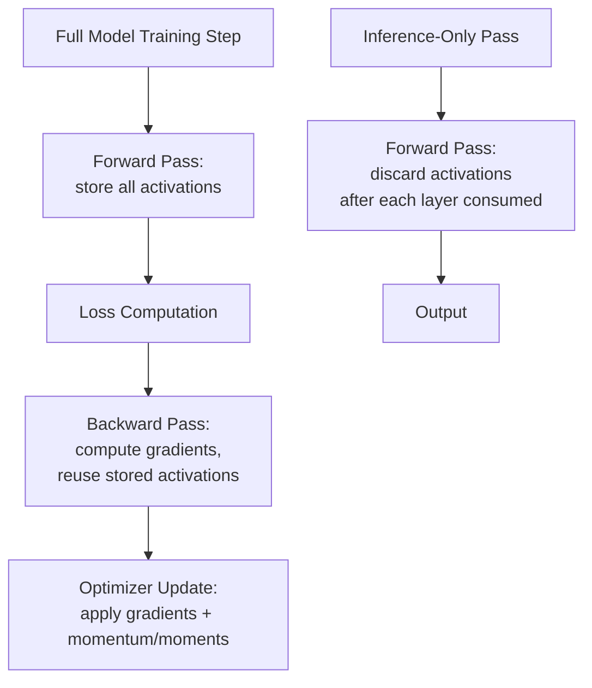
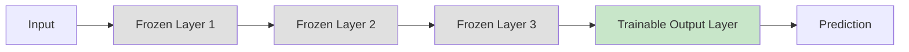

## On-Device Training Limitations and Approaches

### Overview

On-device training refers to updating a machine learning model's parameters directly on embedded hardware, rather than training entirely offline on server/desktop hardware and deploying a frozen model for inference-only use. This is substantially harder than on-device inference because training requires backpropagation, gradient storage, optimizer state, and often multiple passes over data — all under the same severe memory, compute, and power constraints that already make inference challenging on embedded targets.

### Why On-Device Training Is Fundamentally Harder Than Inference

**Memory Overhead of Backpropagation**

Standard backpropagation requires storing intermediate activations from the forward pass to compute gradients during the backward pass, roughly doubling (or more) the memory footprint compared to inference-only execution, which can discard each layer's activations once the next layer has consumed them.

$$\frac{\partial L}{\partial w_{ij}} = \frac{\partial L}{\partial y_j} \cdot \frac{\partial y_j}{\partial w_{ij}} = \delta_j \cdot x_i$$

Computing $\delta_j \cdot x_i$ for every weight requires the forward-pass activation $x_i$ to still be available when the backward pass reaches that layer — this is the core reason training memory exceeds inference memory, since inference can discard $x_i$ immediately after layer $j$ consumes it.

**Optimizer State Overhead**

Beyond gradients themselves, common optimizers require additional per-parameter state:

- **SGD with momentum**: One additional value per parameter (the momentum term).
- **Adam**: Two additional values per parameter (first and second moment estimates), effectively tripling the memory needed for the optimizer state alone relative to the parameter count.

For a model with $N$ parameters, naive full-model training with Adam requires storing roughly $N$ (weights) + $N$ (gradients) + $2N$ (Adam moments) = $4N$ values, versus just $N$ for inference-only weight storage — a substantial multiplier that is often prohibitive on MCU-class RAM budgets.

**Compute Overhead**

The backward pass through a layer typically costs roughly comparable or greater compute than the forward pass through that same layer (computing gradients with respect to both weights and inputs), meaning a full training step can cost several times the compute of a single inference pass — a significant burden on cores already compute-constrained for inference alone.

### Training vs. Inference Memory/Compute Comparison

### Why On-Device Training Is Still Pursued Despite These Costs

- **Personalization**: Adapting a base model to an individual user's specific data (voice characteristics for keyword spotting, gesture patterns for a specific wearer) without transmitting raw personal data off-device.
- **Privacy preservation**: Keeping sensitive raw data (biometric signals, personal audio/images) entirely on-device, never transmitted to a server for training, which can be a regulatory or product requirement in some domains.
- **Domain adaptation**: Adjusting to local environmental conditions (specific sensor noise characteristics, local acoustic environment, deployment-specific data distribution) that differ from the original training data.
- **Reduced connectivity dependence**: Enabling model improvement in deployments with intermittent, expensive, or absent network connectivity, where sending data to a server for retraining is impractical.
- **Continual/lifelong adaptation**: Allowing a deployed model to adapt over the product's operational lifetime as data patterns drift, rather than remaining permanently frozen at deployment.

### Approaches to Reducing Training Cost

**Transfer Learning with Frozen Backbone**

Rather than training the entire network, freeze most layers (typically the earlier, more general feature-extraction layers) and only update a small subset of parameters, usually the final classification/output layer(s).

This dramatically reduces both the memory needed for gradient/optimizer state (only the unfrozen layers need it) and the compute required for the backward pass (frozen layers still need a forward pass but skip backward computation for their own weights, and depending on where freezing starts, backward propagation through frozen layers to earlier layers can sometimes be skipped entirely if no unfrozen layer precedes them).

**On-Device Fine-Tuning of Final Layers Only**

A specific, common case of frozen-backbone transfer learning: keep a full pretrained feature extractor frozen and only train a small final classifier (sometimes even just a linear layer) on top, which can be small enough to train with standard SGD on quite constrained hardware since the parameter count being updated is a small fraction of the full model.

**Quantized/Low-Precision Training**

Applying reduced-precision arithmetic not just to inference but to the training computation itself, though this is considerably harder than inference-only quantization because gradient computation and accumulation are more sensitive to precision loss than forward-pass inference.

[Inference] Low-precision training is generally regarded as significantly more technically challenging than low-precision inference in the ML systems literature, since accumulated gradient errors during training can compound over many update steps in ways that don't have a direct analog in single-pass inference quantization, though specific techniques (mixed-precision training, careful loss scaling) exist to mitigate this.

**Rehearsal-Free / Memory-Efficient Continual Learning Techniques**

Specialized algorithms designed to update a model incrementally on new data without needing to store and replay large amounts of past training data (which itself would require memory the device may not have), while attempting to avoid **catastrophic forgetting** — the tendency of neural networks to lose previously learned capability when trained on new data without any mechanism to preserve old knowledge.

**Gradient Checkpointing**

A technique (more commonly discussed in larger-scale training contexts but conceptually applicable at the edge) that trades compute for memory: instead of storing all forward-pass activations for the backward pass, only a subset of "checkpoint" activations are stored, and the remaining activations are recomputed on-the-fly during the backward pass when needed. This reduces peak memory at the cost of additional forward-pass compute during backpropagation.

**Federated Learning (as a Related but Distinct Approach)**

Rather than training a complete model entirely on a single device, federated learning has many devices each compute local model updates (gradients) on their own local data, sending only the updates (not raw data) to a central server that aggregates them into an improved global model, which is then redistributed to devices.

- This still requires each device to perform local training computation (subject to all the constraints above), but avoids each device needing to independently converge a full model from scratch, and avoids raw data leaving the device.
- Distinct from pure on-device personalization in that the goal is typically to improve a shared global model collaboratively, rather than (or in addition to) adapting a purely local, device-specific model.

### On-Device Training Approach Comparison

| Approach | Memory Savings | Compute Savings | Preserves Full Model Adaptability | Typical Use Case |
|---|---|---|---|---|
| Full model training | None (baseline) | None (baseline) | Yes | Rarely feasible on MCU-class hardware |
| Frozen backbone + trainable head | High (only head needs grad/optimizer state) | Moderate to high | No (only head adapts) | Personalization to new classes/users on top of general features |
| Quantized/low-precision training | Moderate (smaller stored values) | Moderate (faster low-precision math, where supported) | Yes (in principle) | Research-stage; hardware support still maturing |
| Gradient checkpointing | High (fewer stored activations) | Negative (recomputation adds compute) | Yes | Memory-bound scenarios willing to trade compute time |
| Federated learning (per-device) | Same as chosen local training method | Same as chosen local training method | Depends on local method | Collaborative model improvement across a device fleet |

[Unverified] The qualitative memory/compute savings characterizations above reflect general algorithmic trade-off principles; actual savings magnitudes are highly implementation- and model-specific and should be measured on the target hardware/model combination rather than assumed.

### Hardware Considerations for On-Device Training

- **Floating-point support**: Training is traditionally more reliant on floating-point arithmetic than inference (which quantizes readily to int8), since gradient computation and accumulation are more sensitive to the reduced dynamic range of integer formats — making the presence or absence of an FPU a more significant factor for on-device training than for inference-only deployment.
- **Flash write endurance**: If on-device training involves periodically persisting updated weights to flash memory, flash's limited write-cycle endurance becomes a relevant constraint, particularly for frequent incremental updates over a long product lifetime.
- **RAM as the typical binding constraint**: Given the activation-storage overhead of backpropagation described above, RAM (rather than flash or raw compute throughput) is frequently the first constraint hit when attempting on-device training on MCU-class hardware.

### Design Trade-offs

- **Full adaptability vs. feasibility**: Full-model on-device training offers maximum adaptability but is frequently infeasible on the most constrained embedded targets; frozen-backbone approaches sacrifice some adaptability for dramatically improved feasibility.
- **Personalization benefit vs. engineering complexity**: On-device training/fine-tuning adds meaningful product capability (personalization, privacy-preserving adaptation) but at substantially higher engineering and validation complexity than a fixed inference-only deployment, including new failure modes (catastrophic forgetting, training instability) that inference-only systems don't face.
- **Local training vs. federated collaboration**: Pure local on-device training adapts only to that specific device's data; federated approaches enable collaborative improvement across a device fleet but add system-level complexity (communication protocols, aggregation infrastructure, update scheduling).
- **Compute-memory trade-offs (checkpointing)**: Techniques like gradient checkpointing explicitly trade increased compute time for reduced peak memory, appropriate when memory is the binding constraint and some additional latency/energy cost per training step is acceptable.

### Common Pitfalls

- Attempting full-model on-device training without first establishing that a frozen-backbone or otherwise reduced-scope training approach wouldn't meet the actual product adaptation requirement at far lower resource cost.
- Underestimating the memory overhead of optimizer state (particularly Adam's per-parameter moment estimates) when planning RAM budgets for on-device training.
- Neglecting catastrophic forgetting risk when implementing incremental/continual on-device adaptation, potentially degrading previously working model capability without realizing it until deployed behavior regresses.
- Applying aggressive low-precision arithmetic to training without validating gradient computation stability, given that training is generally more precision-sensitive than inference.
- Overlooking flash write-cycle endurance limits when designing frequent on-device weight persistence for long-lifetime deployed products.

**Related Topics**
- Catastrophic forgetting mitigation techniques in continual learning
- Federated learning system architecture and communication-efficient aggregation
- Mixed-precision and low-precision training algorithm design
- Transfer learning and feature-extractor freezing strategies
- Flash memory wear leveling for frequent on-device weight updates
- Privacy-preserving ML techniques (differential privacy, secure aggregation) relevant to federated/on-device training
- RAM budgeting methodology for training versus inference workloads on MCU targets