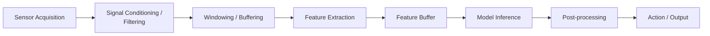
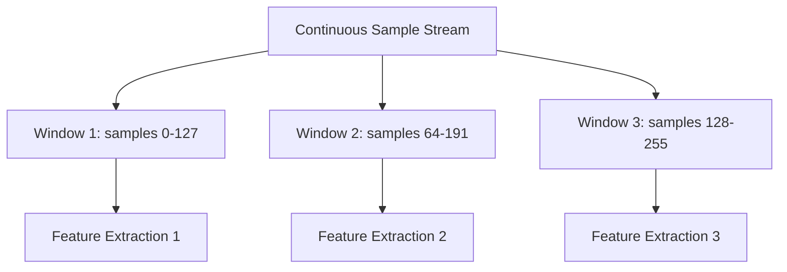
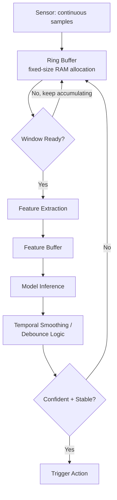

## Data Pipeline Design for Edge ML

### Overview

Data pipeline design for edge ML covers the end-to-end flow of data from raw sensor acquisition through preprocessing, feature extraction, model inference, and downstream action — all engineered to operate within the memory, compute, power, and latency constraints of embedded hardware. Unlike server-side ML pipelines that can rely on abundant compute and staged batch processing, edge pipelines typically must operate in a streaming, resource-constrained, often real-time context.

### Why Edge Data Pipelines Differ from Server-Side Pipelines

- **Streaming vs. batch**: Server-side pipelines commonly process data in batches with generous buffering; edge pipelines typically process continuous sensor streams with tight, often fixed-size buffers.
- **No elastic compute**: A server pipeline can scale processing resources on demand; an edge device has fixed compute and memory budgets that the entire pipeline (acquisition, preprocessing, inference, action) must share.
- **Latency and real-time constraints**: Many edge applications (gesture control, anomaly detection triggering an immediate actuation) have hard or soft real-time deadlines that shape every pipeline stage's design, not just the inference step.
- **Power as a first-class constraint**: Every pipeline stage — not just inference — consumes energy; preprocessing, buffering, and even memory access patterns all factor into the total power budget, particularly for battery- or harvested-energy-powered devices.

### End-to-End Edge ML Pipeline Stages

### Sensor Acquisition

The pipeline's entry point, converting a physical phenomenon (sound, motion, light, temperature) into digital samples via an ADC or dedicated sensor interface.

- **Sampling rate selection**: Must satisfy the Nyquist criterion for the frequencies of interest in the target signal while avoiding unnecessarily high rates that waste compute, memory, and power on data that carries no useful additional information for the task.
- **Bit depth**: Higher ADC resolution captures finer signal detail but increases memory footprint per sample and, depending on the ADC hardware, potentially power draw — a trade-off that should be matched to what the downstream model actually needs rather than defaulting to maximum available resolution.
- **Multi-sensor synchronization**: When a pipeline fuses data from multiple sensors (e.g., accelerometer plus gyroscope for activity recognition), timestamp alignment or synchronized sampling becomes necessary to avoid feeding temporally misaligned data into feature extraction.

### Signal Conditioning and Filtering

Raw sensor data frequently contains noise, DC offset, or out-of-band frequency content that should be removed before feature extraction, since these can otherwise dominate learned features with signal characteristics irrelevant to the task.

- **Digital filtering**: Low-pass, high-pass, or band-pass filters (commonly implemented as simple IIR or FIR filters given embedded compute constraints) to isolate the frequency range relevant to the target signal.
- **DC offset removal / normalization**: Centering and scaling raw sensor readings to a consistent range, both to improve downstream feature quality and to match the input distribution the model was trained on.
- **Outlier/glitch rejection**: Simple thresholding or median-filtering approaches to reject transient sensor glitches that could otherwise trigger spurious inference results.

[Inference] The specific filter types and parameters appropriate for a given sensor and task are generally determined empirically against the actual sensor and target signal characteristics rather than chosen from a universal default, since noise characteristics vary substantially across sensor types, physical mounting, and application environment.

### Windowing and Buffering

Since most embedded ML models operate on fixed-size input tensors, continuous streaming sensor data must be segmented into discrete windows before feature extraction or inference.

- **Fixed-size sliding windows**: A window of $N$ samples is processed, then the window advances by a **hop size** $H \leq N$; when $H < N$, consecutive windows overlap, which can improve responsiveness (more frequent inference updates) at the cost of redundant computation across overlapping windows.
- **Window size trade-off**: Larger windows capture more temporal context (useful for distinguishing patterns that unfold over longer time spans) but increase both memory footprint and inference latency (since a full window must be collected before processing can begin), directly affecting how quickly the system can respond to a new event.
- **Circular/ring buffers**: A common embedded implementation pattern for maintaining a fixed-size window of recent samples in RAM without the overhead of shifting all buffer contents on every new sample — new samples overwrite the oldest position, with a wrap-around index rather than physically moving data.

**Sliding Window with Overlap**

### Feature Extraction

Transforming windowed raw samples into a representation more directly useful to the model than raw time-domain samples, though the necessity and type of feature extraction depends heavily on the model architecture and task.

**Common Embedded Feature Extraction Techniques**

- **Fast Fourier Transform (FFT)**: Converts time-domain signal windows into frequency-domain representation, widely used for audio (keyword spotting) and vibration-based (industrial anomaly detection) applications where frequency content carries the discriminative signal.
- **Mel-Frequency Cepstral Coefficients (MFCCs)**: A feature representation derived from FFT output, specifically designed to approximate human auditory perception characteristics, commonly used in embedded audio/speech applications including keyword spotting.
- **Statistical features**: Simple computed statistics (mean, variance, min/max, zero-crossing rate) over a window, computationally cheap and sometimes sufficient for simpler classification tasks, particularly in accelerometer-based activity recognition.
- **Raw/minimal preprocessing**: Some model architectures (particularly certain convolutional architectures applied directly to raw or lightly normalized time-series data) are designed to learn useful features directly from minimally processed input, shifting feature extraction burden into the model itself rather than a separate explicit pipeline stage.

$$X[k] = \sum_{n=0}^{N-1} x[n] \cdot e^{-i 2\pi kn/N}$$

The discrete Fourier transform, computed efficiently via the FFT algorithm ($O(N \log N)$ versus the $O(N^2)$ of a naive DFT computation), is frequently a compute-significant pipeline stage in its own right on MCU-class hardware and should be budgeted accordingly in both compute-cycle and memory-footprint terms.

**Feature Extraction Trade-off Table**

| Technique | Compute Cost | Memory Cost | Typical Domain | Notes |
|---|---|---|---|---|
| Raw/minimal preprocessing | Lowest | Lowest | General, model-dependent | Shifts feature learning burden to model architecture |
| Statistical features | Low | Low | Accelerometer, simple sensor patterns | Cheap but limited discriminative power for complex signals |
| FFT | Moderate | Moderate (requires buffer for transform) | Audio, vibration | Foundational for many frequency-domain features |
| MFCC | Moderate to high (FFT plus additional stages) | Moderate | Audio/speech, keyword spotting | Higher compute than raw FFT but often improves accuracy for speech-like signals |

[Unverified] Relative compute/memory cost rankings are general architectural characterizations; exact cycle counts and memory footprints depend on window size, implementation (library-optimized versus naive), and target hardware, and should be profiled on the actual deployment target.

### Feature Buffer and Inference Handoff

The extracted feature representation is placed into a buffer sized to match the inference framework's expected input tensor shape, at which point the pipeline hands off to the model inference stage (covered in depth under embedded inference frameworks). Pipeline design at this boundary must ensure feature buffer layout, data type, and any expected pre-inference normalization exactly match what the model was trained and quantized to expect — mismatches here are a common source of silent accuracy degradation, since the pipeline will execute without error but feed the model out-of-distribution input.

### Post-Processing

Raw model output (e.g., class probabilities or a regression value) is often not directly actionable without additional processing:

- **Thresholding**: Converting a continuous confidence score into a binary or categorical decision based on an application-appropriate threshold, tuned against the specific false-positive/false-negative cost trade-off for the application.
- **Temporal smoothing / debouncing**: Requiring multiple consecutive consistent inference results before triggering a downstream action, reducing spurious single-frame misclassifications from causing unwanted actions — particularly relevant for continuous streaming inference where a single noisy window shouldn't override an otherwise stable classification trend.
- **Non-maximum suppression**: For detection-style tasks producing multiple overlapping candidate outputs, suppressing redundant lower-confidence detections in favor of the highest-confidence overlapping candidate.

### Streaming Pipeline Data Flow with Buffering

### Memory Budgeting Across Pipeline Stages

<svg xmlns="http://www.w3.org/2000/svg" viewBox="0 0 700 340">
  <text x="350" y="30" text-anchor="middle" font-size="18" font-weight="bold" fill="#1a1a1a">Illustrative RAM Allocation Across Pipeline Stages (svg_diagram)</text>

  <rect x="60" y="70" width="580" height="50" fill="#c8e6c9" stroke="#2e7d32" stroke-width="1.5" />
  <text x="350" y="100" text-anchor="middle" font-size="13" fill="#1b5e20">Ring Buffer (raw samples) — window size dependent</text>

  <rect x="60" y="130" width="580" height="50" fill="#bbdefb" stroke="#1565c0" stroke-width="1.5" />
  <text x="350" y="160" text-anchor="middle" font-size="13" fill="#0d47a1">Feature Extraction Working Memory (e.g. FFT scratch buffer)</text>

  <rect x="60" y="190" width="580" height="50" fill="#f8bbd0" stroke="#ad1457" stroke-width="1.5" />
  <text x="350" y="220" text-anchor="middle" font-size="13" fill="#880e4f">Model Tensor Arena (activations)</text>

  <rect x="60" y="250" width="580" height="50" fill="#fff9c4" stroke="#f9a825" stroke-width="1.5" />
  <text x="350" y="280" text-anchor="middle" font-size="13" fill="#7a5c00">Output/Smoothing State + Application Overhead</text>

  <text x="350" y="320" text-anchor="middle" font-size="11" fill="#555555">Illustrative relative proportions — actual sizing is task- and model-specific (svg_diagram)</text>
</svg>

### Design Trade-offs

- **Window size vs. responsiveness**: Larger analysis windows generally improve classification accuracy for patterns with longer temporal structure but delay the earliest possible inference response, a direct latency-versus-accuracy trade-off relevant to real-time interactive applications.
- **Overlap ratio vs. compute cost**: Higher window overlap improves inference update frequency and responsiveness but proportionally increases redundant feature extraction and inference compute across overlapping windows.
- **On-device feature extraction vs. raw model input**: Explicit feature extraction (FFT, MFCC) reduces the burden on the model architecture and can improve accuracy for well-understood signal domains, but adds a separate pipeline stage with its own compute/memory budget that must be justified against models capable of learning directly from less-processed input.
- **Aggressive post-processing smoothing vs. latency**: Requiring more consecutive consistent predictions before triggering an action reduces false positives but adds response latency, a trade-off that should be tuned to the specific cost asymmetry between false triggers and delayed response for the application.

### Common Pitfalls

- Mismatched feature extraction between training-time data preparation and on-device pipeline implementation (e.g., different FFT windowing function, different normalization constants), causing silent accuracy degradation despite no runtime errors.
- Under-provisioning ring buffer size relative to the actual required window size plus overlap, causing either data loss or subtle off-by-one windowing errors.
- Neglecting to budget feature extraction working memory (e.g., FFT scratch buffers) as a distinct RAM consumer alongside the model's own tensor arena, leading to underestimated total RAM requirements.
- Choosing sampling rate or bit depth based on sensor hardware maximums rather than actual task requirements, wasting memory, compute, and power on unnecessary data fidelity.
- Omitting temporal smoothing/debouncing for continuous streaming inference, resulting in a system that technically works per-window but produces an unstable, flickering downstream action due to per-frame classification noise.

**Related Topics**
- FFT and MFCC implementation optimization for embedded targets
- Ring buffer and circular buffer implementation patterns in embedded C
- Sensor fusion and multi-sensor timestamp synchronization techniques
- TinyML deployment constraints and memory budgeting (tensor arena sizing)
- Real-time scheduling of pipeline stages under RTOS task models
- Post-processing and temporal smoothing algorithm design for streaming classification
- Power profiling across individual pipeline stages, not just model inference