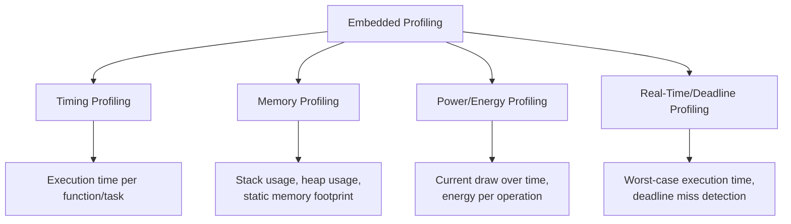
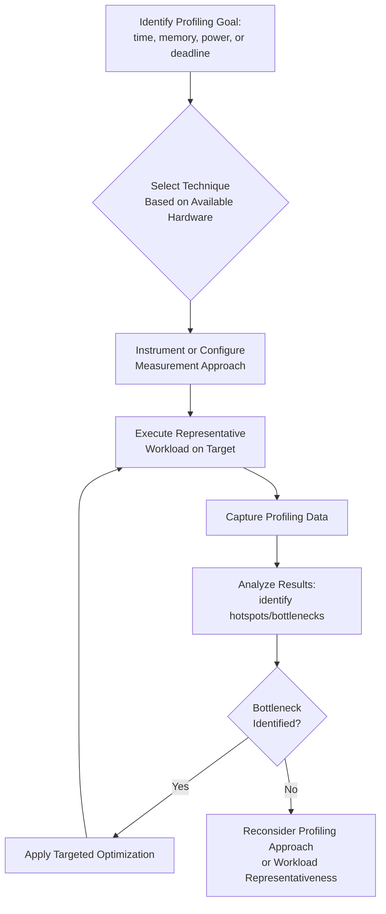

## Profiling Embedded Code

### Overview

Profiling embedded code is the practice of measuring where a program spends its time, memory, energy, and other resources during execution on target hardware, in order to identify bottlenecks and guide optimization. Embedded profiling differs substantially from desktop/server profiling because the target hardware often lacks the operating system services, abundant memory, and rich tooling that desktop profilers rely on, and because embedded constraints (real-time deadlines, tight memory, power budgets) make certain resource dimensions — not just raw execution time — critical to measure.

### Why Embedded Profiling Differs from Desktop Profiling

- **No OS-level profiling infrastructure (often)**: Desktop profilers frequently rely on OS sampling interrupts, performance counters exposed through kernel interfaces, or dynamic instrumentation frameworks; bare-metal or RTOS-based embedded targets often lack this infrastructure entirely, requiring more manual or hardware-assisted approaches.
- **Intrusiveness matters more**: Adding instrumentation (timestamp logging, function wrapping) on a resource-constrained MCU can itself measurably perturb timing and memory usage — the classic **probe effect** — more so than on a desktop system with abundant spare cycles and memory to absorb instrumentation overhead.
- **Multiple resource dimensions beyond time**: Embedded profiling frequently must account for memory (stack, heap, static allocation), power/energy, and real-time deadline compliance, not just wall-clock execution time.
- **Cross-development toolchain**: Profiling often happens via a host development machine connected to the target through a debug probe (JTAG/SWD), rather than the profiling tool running natively on the target itself as it might on desktop systems.

### Categories of Embedded Profiling

### Timing Profiling Techniques

**Instrumentation-Based Profiling**

Inserting explicit timestamp-capture code at function entry/exit points, using a hardware timer or cycle counter to measure elapsed time for each instrumented region.

- **Cycle counters**: Many embedded cores provide a free-running cycle counter accessible to software (e.g., ARM Cortex-M's DWT cycle counter on cores that include the Data Watchpoint and Trace unit), offering high-resolution timing without requiring a separate timer peripheral to be configured.
- **GPIO toggling**: A simple, low-overhead technique where a spare GPIO pin is toggled at the start/end of a code region of interest, then observed on an external oscilloscope or logic analyzer — useful when on-chip profiling infrastructure is unavailable or when correlating software execution with external hardware signals.
- **Overhead consideration**: Instrumentation itself consumes cycles; for very short code regions, the instrumentation overhead can become comparable to or larger than the measured region's actual execution time, requiring either overhead subtraction/calibration or acceptance that very fine-grained instrumentation has practical resolution limits.

**Sampling-Based Profiling**

Periodically capturing the program counter (via a timer interrupt or hardware debug feature) to build a statistical picture of where execution time is concentrated, without instrumenting every function.

- Lower intrusiveness than full instrumentation since it doesn't require modifying the code under measurement, though it requires either a periodic interrupt (which itself has some overhead) or hardware trace support.
- Statistical rather than exact — accuracy improves with more samples but requires the profiled workload to run long enough to accumulate a representative sample distribution.

**Hardware Trace-Based Profiling**

Using dedicated on-chip debug/trace hardware (e.g., ARM's Embedded Trace Macrocell (ETM) or Instrumentation Trace Macrocell (ITM), where present on the target core) to capture detailed execution trace with minimal or zero software instrumentation overhead, streamed off-chip to a host-side trace capture tool for analysis.

- Offers the least intrusive profiling option when available, since the trace hardware operates largely independently of the software under test.
- Requires the target silicon to actually include the relevant trace hardware block and requires a compatible debug probe/trace capture tool on the host side — not universally available across all embedded targets, particularly lower-cost microcontrollers.

### Timing Profiling Approach Comparison

| Technique | Intrusiveness | Resolution | Hardware Requirements | Typical Use Case |
|---|---|---|---|---|
| Instrumentation (timestamps) | Moderate to high | High (cycle-accurate possible) | Timer or cycle counter peripheral | Targeted measurement of specific known regions |
| GPIO toggling | Low (in software), needs external capture | High (oscilloscope-limited) | Spare GPIO + external scope/logic analyzer | Correlating software with external events, no on-chip trace |
| Sampling (PC capture) | Low to moderate | Statistical, improves with sample count | Periodic timer interrupt | Whole-program hotspot identification |
| Hardware trace (ETM/ITM) | Very low | Very high | On-chip trace hardware + capable debug probe | Detailed, minimally-perturbing profiling where hardware supports it |

[Unverified] Availability of specific trace hardware (ETM, ITM, or equivalent) varies significantly by specific microcontroller/core selection and price tier; the presence and capability of such features should be confirmed against the specific target device's reference manual rather than assumed.

### Memory Profiling

**Stack Usage Analysis**

Embedded systems, particularly those without an MMU-backed virtual memory system, are vulnerable to stack overflow silently corrupting adjacent memory (heap, static data, or another task's stack in a multi-tasking RTOS context) rather than triggering a clean fault in all cases.

- **Stack painting/watermarking**: Filling stack memory with a known pattern (e.g., a fixed byte value) before execution, then later inspecting how much of the pattern remains unmodified to estimate peak stack usage — a common technique for empirically measuring worst-case stack depth actually reached during execution.
- **Static stack analysis tools**: Some toolchains offer static analysis (examining the call graph and per-function stack frame sizes) to compute worst-case theoretical stack depth without needing to execute the code, though this can be complicated by recursive functions, function pointers, or interrupt nesting where the tool cannot always statically determine the full call graph.

**Heap Usage Analysis**

For embedded systems that do use dynamic allocation (as opposed to the fully static allocation approach favored in some real-time and TinyML contexts), tracking heap usage over time helps detect fragmentation or leaks.

- **Allocation tracking wrappers**: Instrumenting `malloc`/`free` (or RTOS-specific allocation APIs) to log allocation size, count, and outstanding (unfreed) allocations over the program's execution.
- **Fragmentation visibility**: Beyond total allocated bytes, tracking the pattern of allocation/deallocation over time can reveal fragmentation issues where total free memory is sufficient but no single contiguous block is large enough for a new allocation request.

**Static Memory Footprint Analysis**

Examining the compiled binary's linker map output to break down flash (code, read-only data) and RAM (initialized data, zero-initialized data, stack/heap reservation) usage by source file, function, or symbol — useful for identifying unexpectedly large contributors to the static footprint before the code even runs.

### Power/Energy Profiling

**External Current Measurement**

Using a precision current-sense resistor and measurement instrument (dedicated power profiler tools, or an oscilloscope with a current probe) placed in the device's power supply path to capture current draw over time, which can then be correlated with specific code execution phases (often via GPIO toggling to mark region boundaries, as in timing profiling).

- Provides ground-truth power measurement independent of any software-based estimation, at the cost of requiring physical hardware setup and, for meaningful correlation with code regions, some synchronization mechanism (like the GPIO-toggle correlation technique).

**Energy-Per-Operation Characterization**

Combining timing profiling (how long an operation takes) with power profiling (how much current is drawn during that operation) to compute total energy consumed per operation — often more directly relevant than either time or power alone for battery-life-constrained applications, since a slower but lower-power operation might consume less total energy than a faster but higher-power alternative.

$$E = \int_{t_0}^{t_1} P(t) \, dt \approx \sum_{i} I_i \cdot V \cdot \Delta t_i$$

where the integral of instantaneous power over the operation's duration gives total energy, commonly approximated in practice as a sum over discrete current measurement samples multiplied by supply voltage and sample interval.

**Sleep Mode and Duty Cycle Profiling**

For applications relying heavily on low-power sleep states between active processing bursts (common in battery-powered sensing applications), profiling must capture both active-mode energy and the often much lower but non-zero sleep-mode current draw, since total battery life depends on the duty-cycle-weighted average across both states.

### Real-Time and Deadline Profiling

**Worst-Case Execution Time (WCET) Measurement**

Distinct from average-case timing profiling, WCET analysis specifically seeks the maximum possible execution time a code path could take across all possible inputs and execution conditions, since real-time systems must be designed against worst-case, not average-case, timing.

- **Measurement-based WCET estimation**: Running the code under many varied input conditions and taking the observed maximum as an estimate — inherently only an estimate, since it cannot guarantee the true worst case was actually exercised during testing unless combined with careful test case design targeting known worst-case-triggering conditions.
- **Static WCET analysis tools**: Analyze code structure and target hardware timing characteristics (including cache and, where relevant, coherency effects as discussed in embedded multicore contexts) to compute a provable upper bound, though such tools can be complex to configure correctly and may produce conservative (higher than practically observed) bounds.

**Deadline Miss Detection**

In an RTOS context, instrumenting task execution to detect and log cases where a task's actual completion time exceeds its assigned deadline, providing empirical evidence of real-time constraint violations during testing rather than relying solely on theoretical WCET analysis.

### Profiling Workflow

### Design Trade-offs

- **Intrusiveness vs. availability**: The least intrusive profiling methods (hardware trace) require specific on-chip hardware support not present on all targets; more universally available methods (software instrumentation) risk perturbing the very timing/memory behavior being measured.
- **Average-case vs. worst-case focus**: General performance optimization often benefits from average-case profiling (where does typical execution spend time), while real-time system validation specifically requires worst-case-focused analysis, and these can point toward different optimization priorities.
- **Measurement-based vs. static WCET estimation**: Measurement-based approaches are simpler to set up but only as good as the representativeness of test conditions; static analysis tools can provide provable bounds but may be complex to configure and can produce overly conservative results.
- **Profiling depth vs. development time**: Comprehensive profiling across all resource dimensions (time, memory, power, deadlines) for every code path is rarely practical; profiling effort is typically prioritized toward code paths suspected or known to be resource-critical.

### Common Pitfalls

- Profiling on non-representative hardware (e.g., a development board with different clock speed, memory configuration, or power characteristics than the final production target), producing measurements that don't transfer to actual deployment conditions.
- Ignoring the probe effect from instrumentation-based profiling, particularly for very short code regions where instrumentation overhead is comparable to the measured execution time itself.
- Relying solely on average-case timing measurements for code paths with hard real-time deadlines, missing worst-case scenarios that only manifest under specific, possibly rare, input or system-state conditions.
- Overlooking sleep/idle-mode power consumption when profiling energy usage, focusing only on active-mode power and thereby mis-projecting total battery life for duty-cycled applications.
- Measuring stack usage under typical execution paths without accounting for worst-case call depth scenarios, including interrupt nesting, which can push actual peak stack usage well beyond what typical-path measurement reveals.

**Related Topics**
- Worst-case execution time (WCET) static analysis tooling and methodology
- Cache coherency effects on multicore timing determinism and profiling
- RTOS task scheduling analysis and deadline monitoring instrumentation
- Power profiling instrumentation and duty-cycle design for battery-powered devices
- Linker map file analysis for static memory footprint optimization
- Hardware debug probe and trace tooling selection (JTAG/SWD, ETM/ITM support)
- Stack overflow detection and prevention techniques in RTOS environments