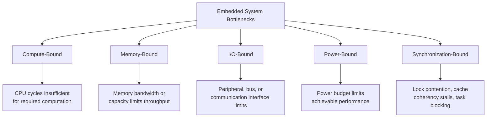
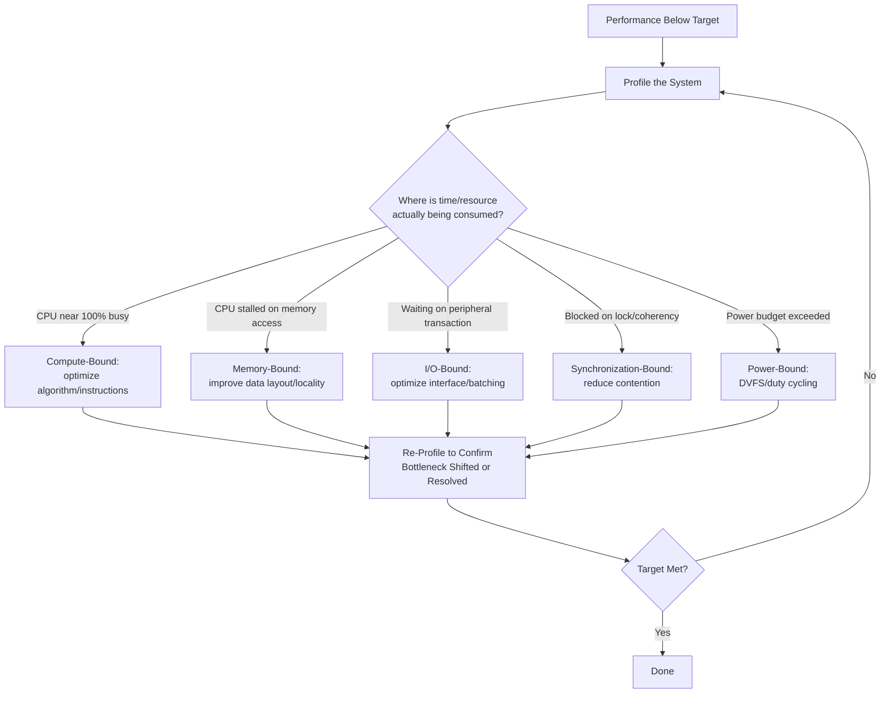

## Identifying and Eliminating Bottlenecks

### Overview

Identifying and eliminating bottlenecks is the practice of locating the specific resource constraint — execution time, memory, power, I/O bandwidth, or a real-time deadline — that limits overall system performance, and then applying targeted optimization to relieve that constraint. In embedded systems, bottleneck elimination is distinct from general optimization because the fix must respect the system's other fixed constraints (memory budget, power envelope, real-time deadlines) rather than simply trading one unconstrained resource for another as might be acceptable on desktop/server systems.

### The Bottleneck Principle

A system's overall throughput or latency is limited by its single most constrained resource in the critical execution path, not by the average behavior across all resources. Optimizing a non-bottleneck resource yields little or no overall improvement, since the bottleneck resource continues to gate total performance regardless of how much other resources are improved.

$$T_{total} = \max(T_{stage_1}, T_{stage_2}, \ldots, T_{stage_n}) \quad \text{(for a pipeline bound by its slowest stage)}$$

This is the core reason profiling (covered separately) must precede optimization: without first identifying which resource or code region is actually the limiting factor, optimization effort risks being spent on code that isn't the true constraint, yielding negligible overall system improvement despite the effort invested.

### Categories of Embedded Bottlenecks

### Compute-Bound Bottlenecks

The processor's raw instruction throughput is the limiting factor — the code is executing efficiently relative to the algorithm chosen, but the algorithm itself requires more computation than the available clock cycles can deliver within the required time budget.

**Identification**

- Profiling shows CPU utilization near 100% during the bottlenecked operation, with execution time scaling roughly linearly with algorithmic complexity as input size grows.
- Hotspot profiling (sampling-based or instrumentation-based, as covered under embedded profiling) identifies specific functions consuming disproportionate execution time.

**Elimination Strategies**

- **Algorithmic complexity reduction**: Replacing an $O(n^2)$ approach with an $O(n \log n)$ or $O(n)$ alternative where applicable often yields far larger gains than micro-optimizing the existing algorithm's implementation.
- **Fixed-point instead of floating-point arithmetic**: On cores lacking an FPU, floating-point operations are emulated in software at substantial cycle cost; converting hot-path floating-point computation to fixed-point arithmetic can yield large speedups on such targets.
- **SIMD/vectorization**: Exploiting available SIMD instruction extensions (where present on the target core) to process multiple data elements per instruction, directly increasing throughput for data-parallel operations.
- **Loop unrolling and compiler optimization flags**: Reducing loop overhead (branch and counter update cost relative to loop body work) and ensuring the compiler is configured to optimize for speed (versus size) where the bottleneck is compute rather than flash footprint.
- **Offloading to hardware accelerators**: Moving compute-heavy operations (DSP-style signal processing, ML inference) to dedicated hardware acceleration where available, rather than executing on the general-purpose CPU core.

### Memory-Bound Bottlenecks

Performance is limited by memory access — either bandwidth (rate of data transfer to/from memory) or latency (time per individual memory access) — rather than by the arithmetic computation itself, common when an algorithm's data access pattern doesn't align well with the memory hierarchy's characteristics.

**Identification**

- Profiling shows the CPU frequently stalled waiting for memory access completion rather than actively executing arithmetic instructions.
- Performance scales with data size/memory traffic rather than with computational complexity, suggesting data movement — not computation — is the limiting factor.

**Elimination Strategies**

- **Cache-friendly data layout**: Structuring data to maximize spatial locality (sequential access patterns) and minimize cache-line-crossing accesses, reducing cache miss rate on cores with cache hierarchies.
- **Reducing redundant memory access**: Restructuring algorithms to reuse data already present in registers or cache rather than re-reading from memory, directly reducing memory traffic.
- **Appropriate use of tightly-coupled memory (TCM)**: On cores that provide TCM (zero-wait-state local memory distinct from the main cache-backed memory system), placing performance-critical code or data in TCM can eliminate cache-miss variability entirely for that code/data.
- **DMA offloading of bulk transfers**: Using DMA to move large data blocks between memory and peripherals without CPU involvement in the transfer itself, freeing the CPU to perform other work concurrently with the transfer (subject to the DMA-cache coherency considerations covered under multicore cache coherency).
- **Reducing false sharing (multicore contexts)**: As covered under cache coherency, restructuring shared data layout to avoid unrelated variables sharing a cache line can eliminate unnecessary cross-core coherency traffic that manifests as a memory-system bottleneck.

### I/O-Bound Bottlenecks

The rate of data transfer through a communication interface (UART, SPI, I2C, network interface, sensor bus) limits overall system throughput, independent of how fast the CPU could otherwise process that data.

**Identification**

- CPU utilization during the bottlenecked operation is comparatively low, with execution time dominated by waiting for peripheral transaction completion.
- Throughput closely tracks the theoretical bandwidth limit of the specific interface and configuration in use (baud rate, clock speed, protocol overhead).

**Elimination Strategies**

- **Interface configuration optimization**: Increasing clock speed/baud rate where the physical link and connected peripheral support it, or switching to a higher-bandwidth interface where flexible.
- **Batching and reducing transaction overhead**: Combining multiple small transfers into fewer, larger transactions where protocol overhead (addressing, start/stop conditions, acknowledgment cycles) is significant relative to payload size.
- **Asynchronous/non-blocking I/O with interrupts or DMA**: Avoiding CPU busy-waiting on I/O completion, instead allowing the CPU to perform other work while a peripheral transaction completes in the background, then handling completion via interrupt.
- **Protocol-level optimization**: Reducing unnecessary protocol overhead (redundant status polling, inefficient framing) at the application/protocol layer, distinct from physical-layer interface speed.

### Power-Bound Bottlenecks

The system's power/energy budget, rather than raw compute or memory capability, limits what performance level is sustainably achievable — a distinctly embedded concern less commonly framed as a "bottleneck" in desktop contexts.

**Identification**

- Power profiling (as covered under embedded profiling) reveals that achieving higher performance (faster clock speed, more frequent processing) would exceed the available power budget (battery life target, thermal limit, energy-harvesting supply capacity).
- The system meets timing/throughput requirements only by operating at a performance level constrained below the hardware's raw capability, specifically to remain within power limits.

**Elimination Strategies**

- **Dynamic voltage and frequency scaling (DVFS)**: Running at the minimum clock speed/voltage that still meets timing requirements for the current workload, rather than a fixed maximum, reducing average power without sacrificing peak capability when needed.
- **Aggressive duty cycling**: Maximizing time spent in low-power sleep states between necessary active processing bursts, directly reducing average power draw.
- **Algorithmic energy efficiency, not just speed**: Recognizing that the fastest algorithm is not always the lowest-energy algorithm (a technique executing more instructions at lower voltage/frequency, or one better matched to a low-power accelerator, may consume less total energy despite not being the fastest at full power).
- **Peripheral and clock gating**: Disabling clocks or power to unused peripherals and subsystems, since even idle (but clocked/powered) hardware blocks typically consume some non-zero power.

### Synchronization-Bound Bottlenecks

In multicore or multi-tasking (RTOS) contexts, performance is limited not by any single core's compute/memory/IO capability but by contention for shared resources — locks, coherency traffic, or task scheduling dependencies.

**Identification**

- Profiling reveals cores or tasks spending significant time blocked/waiting rather than actively executing, despite apparently sufficient raw compute capacity.
- Performance does not scale as expected with additional cores, suggesting contention rather than raw compute capability is the limiting factor.

**Elimination Strategies**

- **Reducing critical section size and lock contention**: Minimizing the code executed while holding a shared lock, and reducing the frequency of lock acquisition where possible, directly reduces the time other cores/tasks spend blocked waiting.
- **Lock-free or reduced-synchronization data structures**: Where applicable, using atomic operations or carefully designed lock-free patterns to avoid blocking synchronization entirely for certain access patterns.
- **Reducing cache coherency traffic**: As covered under multicore cache coherency, minimizing false sharing and unnecessary cross-core shared-memory access reduces coherency-protocol-induced stalls.
- **Task priority and scheduling adjustment**: In an RTOS context, ensuring task priorities correctly reflect actual urgency, and that priority inversion (a lower-priority task blocking a higher-priority one via a shared resource) is addressed through mechanisms like priority inheritance where supported.

### Bottleneck Identification Decision Flow

### Bottleneck Type Comparison

| Bottleneck Type | Key Identification Signal | Primary Fix Direction | Common Embedded Context |
|---|---|---|---|
| Compute-bound | High CPU utilization, time scales with algorithmic complexity | Algorithm/instruction-level optimization | Signal processing, ML inference on CPU |
| Memory-bound | CPU stalled on memory access, time scales with data volume | Data layout, caching, DMA offload | Large buffer processing, image/audio pipelines |
| I/O-bound | Low CPU utilization, time tracks interface bandwidth limit | Interface configuration, batching, async I/O | Sensor polling, communication interfaces |
| Power-bound | Performance capped below hardware max to meet power budget | DVFS, duty cycling, algorithmic energy efficiency | Battery-powered always-on sensing |
| Synchronization-bound | Cores/tasks blocked despite available compute capacity | Reduced contention, lock-free structures | Multicore shared-memory workloads |

### The Iterative Nature of Bottleneck Elimination

Eliminating one bottleneck frequently reveals a new, previously secondary bottleneck that now becomes the limiting factor — a compute-bound system that gets algorithmically optimized may become memory-bound once compute is no longer the constraint, requiring the profiling-optimization cycle to repeat rather than being treated as a single one-time pass.

[Inference] This iterative "the next bottleneck emerges after fixing the current one" pattern is a widely recognized general principle in performance engineering discussions across computing broadly, not specific to any single embedded platform, though the specific sequence of which bottleneck emerges next is entirely system- and workload-dependent.

### Design Trade-offs

- **Optimization effort vs. actual impact**: Effort spent optimizing a non-bottleneck resource yields little overall system improvement; correctly identifying the true bottleneck before optimizing is essential to avoid wasted engineering effort.
- **Fixing one bottleneck vs. shifting constraints elsewhere**: Some fixes for one bottleneck type can worsen another (e.g., aggressive loop unrolling reduces compute-bound bottlenecks but increases flash footprint, potentially creating a new constraint if flash was tightly budgeted).
- **General-purpose fix vs. workload-specific tuning**: Broadly applicable optimizations (algorithmic complexity reduction) tend to generalize well across changing workloads; highly specific tuning (manual loop unrolling for a particular data size) may need revisiting if the workload characteristics change.
- **Power-performance-memory triangle**: In embedded systems, addressing one bottleneck often involves trading against one of the other two constrained resources (power, memory, or performance), unlike less-constrained desktop contexts where such trade-offs are less immediately binding.

### Common Pitfalls

- Optimizing based on intuition or assumption about where time/resources are being spent rather than actual profiling data, frequently targeting code that isn't the true bottleneck.
- Declaring victory after fixing one identified bottleneck without re-profiling to check whether a new bottleneck has emerged as the new limiting factor.
- Applying a compute-oriented optimization (e.g., aggressive vectorization) to a problem that is actually memory- or I/O-bound, yielding negligible real-world improvement despite the optimization being technically correct.
- Ignoring power as a bottleneck dimension in performance tuning, optimizing purely for speed in a way that pushes power draw beyond the actual product's sustainable budget.
- Treating synchronization/contention bottlenecks in multicore systems as if they were pure compute bottlenecks, applying single-core optimization techniques that don't address the underlying contention causing the stalls.

**Related Topics**
- Profiling embedded code: timing, memory, and power measurement techniques
- Cache coherency effects on multicore synchronization bottlenecks
- DMA-based I/O offloading and coherent DMA considerations
- Dynamic voltage and frequency scaling (DVFS) implementation strategies
- Fixed-point arithmetic techniques for compute-bound FPU-less targets
- Lock-free data structure design for embedded multicore/multitasking systems
- Algorithmic complexity analysis applied to embedded resource constraints