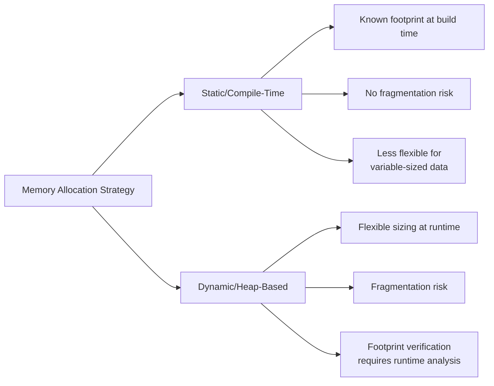
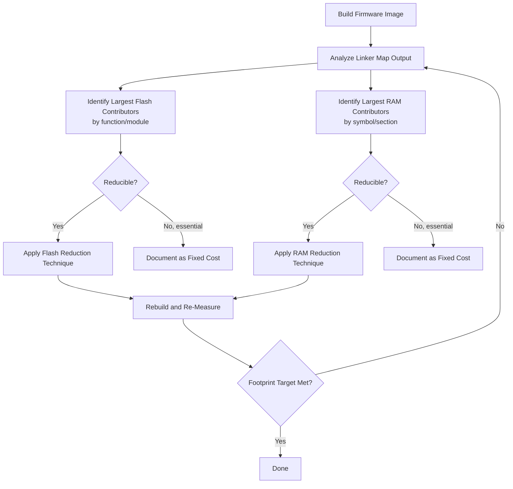

## Memory Footprint Reduction Techniques

### Overview

Memory footprint reduction techniques encompass the strategies used to minimize a program's flash (code, read-only data) and RAM (stack, heap, static data, buffers) consumption on embedded targets where memory is a hard, often severely limited, resource. Unlike desktop systems where memory pressure typically manifests as a performance degradation, embedded memory overruns frequently cause outright failure — a linker error at build time, or a runtime crash/corruption when a fixed allocation is exceeded.

### Why Memory Footprint Matters Distinctly in Embedded Systems

- **Fixed, non-expandable memory**: Unlike systems with virtual memory and swap, most embedded targets have a fixed physical RAM and flash size determined at hardware selection time, with no runtime mechanism to expand capacity if the footprint grows.
- **Cost scaling with memory**: Microcontroller unit price frequently scales with flash/RAM capacity; reducing footprint can enable selection of a lower-cost part, directly affecting per-unit product cost at volume.
- **No OS-level memory protection (often)**: Many embedded targets lack an MMU, meaning a memory overrun (stack overflow into heap, buffer overrun into adjacent data) can silently corrupt unrelated memory rather than triggering a clean fault, making footprint discipline a correctness concern, not just an efficiency one.
- **Static allocation preference**: Many embedded and real-time design patterns favor static (compile-time) memory allocation over dynamic allocation specifically to guarantee footprint is known and bounded ahead of runtime, making footprint reduction an upfront design concern rather than something addressed reactively.

### Flash (Code/Read-Only Data) Footprint Reduction

**Compiler Optimization for Size**

Most embedded toolchains offer a size-optimization flag (commonly `-Os` in GCC-family compilers) distinct from speed-optimization flags, instructing the compiler to prefer smaller generated code even where this may cost some execution speed — directly relevant when flash footprint, not raw speed, is the binding constraint.

**Link-Time Optimization and Dead Code Elimination**

- **Function/data sections with garbage collection**: Compiling with each function and data object in its own linker section (`-ffunction-sections`, `-fdata-sections` in GCC), then instructing the linker to discard unreferenced sections (`--gc-sections`), removes unused code and data that would otherwise be included in the final binary even if never called.
- **Link-Time Optimization (LTO)**: Performing optimization across translation unit boundaries at link time rather than only within each individually compiled file, enabling more thorough dead code elimination and cross-file inlining decisions than per-file compilation alone can achieve.

**Reducing Library Dependencies**

- **Avoiding full C standard library where a minimal subset suffices**: Standard library functions (particularly formatted I/O like `printf`/`sprintf` with full format specifier support) can pull in substantial code size; many embedded toolchains offer reduced-footprint library variants (e.g., "nano" C library variants) or allow selectively avoiding heavyweight functions in favor of minimal custom implementations.
- **Avoiding C++ features with hidden footprint cost**: Where C++ is used, features like exceptions, RTTI (Run-Time Type Information), and certain forms of templates/virtual dispatch can add meaningful code size overhead; many embedded C++ projects deliberately disable exceptions and RTTI at the toolchain level.

**Code Structure Choices**

- **Avoiding excessive function inlining in size-constrained contexts**: While inlining can improve speed, it duplicates code at each call site, increasing flash footprint — a direct tension with the compute-bound optimization strategies covered under bottleneck elimination, illustrating that speed and size optimization can pull in opposite directions.
- **Table-driven logic instead of large branch/switch chains**: Replacing extensive conditional logic with lookup tables can reduce code size for certain patterns, though this trades code footprint for data footprint (the table itself consumes flash or RAM), so it is a genuine trade-off rather than a pure win.
- **Reducing code duplication via shared helper functions**: Consolidating near-duplicate code paths into shared functions reduces flash footprint at the potential cost of a small amount of call overhead, generally a favorable trade-off when flash is the binding constraint.

### RAM Footprint Reduction

**Static vs. Dynamic Allocation Trade-offs**

Favoring static (compile-time, fixed-address) allocation over dynamic (`malloc`/heap-based) allocation provides two footprint-relevant benefits: the total memory requirement is known and verifiable at compile/link time, and there is no heap fragmentation overhead (fragmentation can cause total free memory to be sufficient while no single allocation request can be satisfied due to non-contiguous free space).

**Buffer and Data Structure Sizing**

- **Right-sizing buffers to actual requirements**: Avoiding buffers sized to a generous round number "just in case" when the actual maximum required size can be determined from the application's real constraints, particularly relevant for the tensor arenas, ring buffers, and feature buffers discussed under TinyML and data pipeline design.
- **Struct packing and alignment awareness**: Default struct member alignment (padding inserted by the compiler to satisfy alignment requirements) can inflate struct size beyond the sum of member sizes; reordering struct members from largest to smallest alignment requirement, or using packed attributes where the resulting unaligned access performance/compatibility cost is acceptable, can reduce per-instance struct footprint — particularly impactful when many instances of a struct are allocated.
- **Union usage for mutually exclusive data**: Where multiple data representations are never needed simultaneously, a union can allow them to share the same memory region rather than each requiring separate allocation, directly reducing footprint at the cost of the programmer manually tracking which representation is currently valid.

**Stack Footprint Reduction**

- **Avoiding large local (stack-allocated) arrays/structures**: Large local variables consume stack space for the duration of their scope; moving large buffers to static or heap allocation (with appropriate lifetime management) reduces peak stack usage, particularly important given that stack overflow often corrupts adjacent memory silently rather than failing cleanly on MMU-less targets.
- **Minimizing call depth and per-call stack frame size**: Deeply nested function calls, especially combined with large per-function local variables, compound to increase worst-case stack depth; flattening call hierarchies or reducing per-function local variable footprint directly reduces this.
- **Awareness of interrupt handler stack usage**: On many embedded architectures, interrupt handlers execute on the same stack as the interrupted code (unless a separate interrupt stack is configured), meaning worst-case stack depth calculations must account for interrupt nesting on top of the deepest normal call path, not just the deepest call path considered in isolation.

**Overlaying and Memory Reuse**

- **Activation buffer reuse (as in ML inference)**: As covered under embedded inference frameworks, tensor arena buffer reuse analysis exploits the fact that not all intermediate values are live simultaneously, allowing the same physical memory to serve multiple logical purposes at different points in execution — a general pattern applicable beyond ML inference to any pipeline with distinct sequential phases.
- **Overlay techniques for code (flash-constrained systems)**: In extremely flash-constrained scenarios, code overlays (loading different code segments into the same RAM/flash region at different times, common historically and in some highly constrained modern contexts) can allow a total codebase larger than available memory to execute, at the cost of load-time overhead when switching overlays and added system complexity.

### Memory-Efficient Data Representation

**Bit-Field Packing**

Storing multiple small-range values (flags, small enumerations) within individual bits or small bit-groups of a larger integer rather than each occupying a full byte or word, directly reducing storage for data with a large number of small-range fields.

**Reduced-Precision Data Types**

Using the smallest data type that can correctly represent the required value range (e.g., `uint8_t` instead of `int` for a value known to stay within 0–255) rather than defaulting to larger types, both reducing per-instance storage and, for arrays of such values, improving cache/memory bandwidth efficiency as a secondary benefit.

**Compression for Static/Read-Only Data**

For substantial read-only data (lookup tables, constant string data, embedded assets), compression algorithms suited to constrained decompression-time compute/memory (since the constrained device, not a powerful host, must decompress) can trade some flash-read/decompression compute overhead for reduced stored footprint — a technique with clear conceptual overlap with the model compression techniques discussed for ML deployment, applied here to general application data.

### Footprint Reduction Technique Summary

| Technique | Targets | Typical Trade-off |
|---|---|---|
| Size-optimized compilation (`-Os`) | Flash | Some execution speed cost |
| Dead code elimination / `--gc-sections` | Flash | Requires function/data section compilation |
| Minimal C/C++ library variants | Flash | Reduced standard library feature availability |
| Static over dynamic allocation | RAM | Less runtime flexibility for variable-sized data |
| Struct packing/reordering | RAM (per-instance) | Potential unaligned access cost if packed |
| Right-sized buffers | RAM | Requires accurate upfront sizing analysis |
| Bit-field packing | RAM/Flash (constant data) | Slightly more complex access code |
| Reduced-precision data types | RAM/Flash | Must verify value range never exceeds type capacity |
| Buffer/arena reuse analysis | RAM | Requires careful lifetime/liveness analysis |
| Data compression (static assets) | Flash | Decompression compute/RAM cost at access time |

### Footprint Analysis Workflow

### Design Trade-offs

- **Flash size vs. execution speed**: Size-optimized compilation and reduced inlining shrink flash footprint but can measurably reduce execution speed, a direct tension with compute-bound bottleneck elimination strategies covered separately — the appropriate balance depends on which constraint (flash capacity or execution speed) is actually binding for the specific target.
- **Static allocation determinism vs. flexibility**: Static allocation provides footprint predictability and eliminates fragmentation risk but requires accurate upfront sizing and is less adaptable to genuinely variable-sized runtime data than dynamic allocation.
- **Data compression vs. decompression overhead**: Compressing static assets reduces flash footprint but adds runtime decompression compute and, depending on the algorithm, potentially additional RAM for decompression working memory — only favorable when flash is the more binding constraint than compute/RAM.
- **Packed data structures vs. access performance/portability**: Bit-field and packed-struct techniques reduce memory footprint but can introduce unaligned memory access (with performance or, on some architectures, correctness implications) and reduce code portability across different compiler/architecture combinations, given that exact bit-field layout behavior is not always fully specified by language standards.

### Common Pitfalls

- Optimizing flash footprint through aggressive inlining reduction or size flags without checking whether the resulting speed reduction violates a real-time deadline or throughput requirement elsewhere in the system.
- Right-sizing buffers based on typical-case rather than actual worst-case data requirements, leading to runtime overruns under conditions not covered by the sizing analysis.
- Using packed/bit-field data structures without verifying the target compiler and architecture's specific behavior for unaligned access and bit-field layout, given that these aspects are not always fully standardized across toolchains.
- Neglecting worst-case stack depth analysis (including interrupt nesting) when reducing stack footprint through smaller local buffers, potentially leaving the true worst-case scenario still under-provisioned despite typical-case measurements looking acceptable.
- Applying data compression to static assets without accounting for the decompression working memory and compute cost, potentially shifting rather than genuinely resolving a constrained-resource bottleneck.

**Related Topics**
- Linker map file analysis for identifying footprint contributors
- Stack overflow detection and worst-case stack depth analysis techniques
- Compiler optimization flag selection (size versus speed trade-offs)
- Buffer and tensor arena sizing methodology for ML and data pipelines
- Bit-field and packed struct portability considerations across toolchains
- Static versus dynamic memory allocation strategies in real-time systems
- Data compression algorithm selection for constrained decompression environments