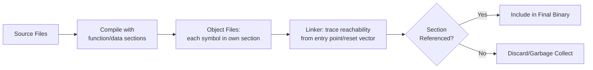
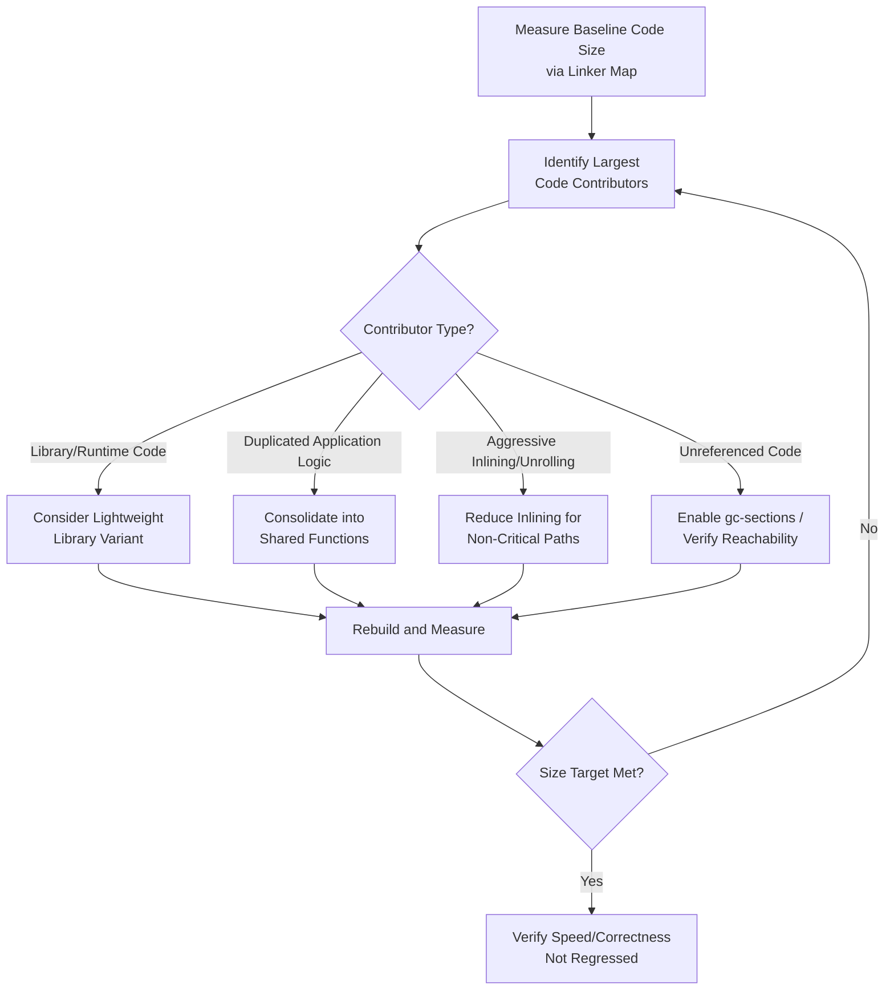

## Code Size Optimization

### Overview

Code size optimization is the discipline of minimizing the flash/ROM footprint of compiled program instructions, distinct from optimizing execution speed or RAM usage, though the three often interact and trade off against each other. On embedded targets where flash capacity directly bounds what firmware can be deployed — and where flash size frequently drives per-unit silicon cost — code size is treated as a first-class optimization target in its own right, not merely a byproduct of other optimization work.

### Code Size as a Distinct Optimization Target

Code size optimization differs from the broader memory footprint reduction and bottleneck elimination concerns already covered in that it specifically targets the instruction stream (`.text` section) rather than data (`.data`/`.bss`) or execution time. A program can be simultaneously fast and large, or slow and small — the two are correlated but not equivalent, since techniques like inlining and loop unrolling improve speed by duplicating code, directly growing size while improving execution time.

$$\text{Total Flash} = \text{Code Size (.text)} + \text{Read-Only Data (.rodata)} + \text{Initialized Data Image (.data init values)}$$

### Compiler-Level Size Optimization

**Optimization Level Selection**

Most toolchains (GCC, Clang/LLVM-based embedded compilers) offer a size-specific optimization level, commonly `-Os`, which instructs the compiler's optimization passes to prefer size-reducing transformations even when a speed-oriented alternative exists, and some toolchains additionally offer a more aggressive size level (e.g., `-Oz` in some Clang-based toolchains) that pushes further toward minimal size at potentially greater speed cost.

- `-Os` generally applies most `-O2`-level optimizations except those specifically identified as likely to increase code size (such as certain aggressive inlining or loop unrolling decisions).
- The actual size/speed outcome of any optimization level is compiler-, version-, and code-specific; empirical measurement on the actual target and codebase is necessary to confirm expected results rather than assuming a universal outcome from the flag alone.

**Selective Function-Level Optimization**

Many compilers support per-function optimization attributes/pragmas, allowing a codebase to apply `-Os` globally while selectively marking specific known-hot functions for speed optimization (or vice versa), enabling a more targeted balance than an all-or-nothing global flag.

**Inlining Control**

Since inlining duplicates a function's body at each call site, aggressive inlining directly increases code size in exchange for eliminating call/return overhead and enabling further cross-boundary optimization at each call site.

- Compilers typically apply heuristics to inline only where the estimated benefit outweighs the size cost, but these heuristics can be tuned via specific flags or per-function attributes (`always_inline`, `noinline` in GCC-family compilers) where the developer has more precise knowledge than the compiler's general heuristic.
- Small, frequently-called functions (accessor-style functions, simple wrappers) are typically favorable inlining candidates since the call overhead relative to function body size is proportionally large; large, infrequently-called functions are typically poor inlining candidates.

### Linker-Level Size Optimization

**Dead Code and Data Elimination**

Compiling with each function and global variable placed in its own linker section (`-ffunction-sections -fdata-sections` in GCC-family toolchains), then invoking the linker with garbage collection of unreferenced sections (`--gc-sections`), removes code and data that is compiled into object files but never actually referenced by the program's reachable call/reference graph.

**Link-Time Optimization (LTO)**

Performs optimization analysis across the whole program (or whole library) at link time rather than being limited to the scope of a single translation unit during compilation, enabling the compiler to identify dead code, redundant computation, and inlining opportunities that span file boundaries — opportunities invisible to per-file compilation alone.

[Inference] LTO is generally reported in compiler documentation and embedded engineering literature to provide additional size reduction beyond function/data-section garbage collection alone, since it can identify cross-file redundancy and unreachability that section-level garbage collection cannot detect on its own; the magnitude of additional benefit is codebase-dependent and not a fixed guaranteed percentage.

**Identical Code Folding**

Some linkers support merging multiple functions that compile to byte-for-byte (or functionally) identical machine code into a single shared copy, which can meaningfully reduce size in codebases with templated or generated code that produces multiple near-identical function instantiations.

### Library and Runtime Footprint Reduction

**Standard Library Selection**

Full-featured C standard library implementations (particularly formatted I/O functions like `printf` with complete format specifier and floating-point support) can consume substantial flash even when a program uses only a small fraction of that functionality.

- Many embedded toolchains provide reduced-footprint standard library variants (sometimes termed "nano" or similarly named lightweight variants) that drop rarely-needed features (e.g., floating-point format specifier support in `printf`) in exchange for meaningfully smaller code size.
- Custom minimal implementations of specific needed functions (a stripped-down integer-only `printf` replacement, for example) can further reduce footprint when even the lightweight standard library variant includes unneeded functionality.

**C++-Specific Size Considerations**

Where C++ is used on size-constrained embedded targets, several language features carry size costs beyond their C equivalents:

- **Exceptions**: Exception handling machinery (unwind tables, landing pads) adds code size overhead even in code paths that never actually throw, leading many embedded C++ projects to disable exceptions entirely at the toolchain level (`-fno-exceptions` in GCC/Clang-family compilers).
- **RTTI (Run-Time Type Information)**: Supports `dynamic_cast` and `typeid`, but adds per-class metadata and supporting code; commonly disabled (`-fno-rtti`) in embedded contexts that don't require these specific features.
- **Templates**: Each distinct template instantiation generates its own compiled code, so heavy template use with many different type parameters can produce significant code duplication (sometimes termed template bloat) compared to an equivalent non-templated or type-erased design.
- **Virtual function tables and dispatch**: Virtual functions require per-class vtable storage and indirect call overhead; while usually a modest cost individually, extensive use of polymorphism across many classes/methods can accumulate meaningfully in a tightly constrained flash budget.

### Code Structure Techniques for Size Reduction

**Consolidating Duplicate Logic**

Near-identical code paths (common in generated code, copy-pasted variants, or unrolled special cases) can often be consolidated into a single parameterized function, trading a small amount of call overhead and parameter-passing code for eliminating the duplicated body — favorable when flash is the binding constraint and the call overhead is not itself performance-critical.

**Table-Driven Design**

Replacing extensive `if`/`else if` or `switch` chains with lookup tables (arrays of function pointers, or data tables driving generic logic) can reduce code size for patterns with many similar branches, though the table itself consumes flash (as read-only data) or RAM, meaning this technique trades code size for data size rather than being a pure reduction — genuinely beneficial only when the branching logic's code size exceeds the table's data size.

**Avoiding Unnecessary Loop Unrolling**

While manual or compiler-driven loop unrolling can improve execution speed (covered under bottleneck elimination for compute-bound cases), it does so by duplicating loop body code across iterations, directly increasing code size — a technique to apply selectively to genuinely hot, size-tolerant loops rather than uniformly across a codebase where flash is tightly constrained.

**Minimizing Preprocessor Macro Expansion Duplication**

Complex function-like macros expand inline at every use site, similar in effect to forced inlining; converting macros with substantial logic into actual functions (allowing the compiler to make its own inlining decision, or simply sharing one compiled copy) can reduce size where macro-driven duplication has accumulated across many call sites.

### Code Size Optimization Technique Comparison

| Technique | Size Impact | Speed Impact | Applicability |
|---|---|---|---|
| `-Os`/`-Oz` compilation | Reduces | Typically reduces some vs. `-O2`/`-O3` | Broad, whole-program or per-function |
| `--gc-sections` + function/data sections | Reduces (removes unreferenced code) | Neutral | Broad, requires specific compile flags |
| Link-Time Optimization (LTO) | Reduces (cross-file analysis) | Neutral to positive | Broad, whole-program |
| Reduced-footprint standard library | Reduces (often substantially for I/O-heavy code) | Neutral | Where full library features are unused |
| Disabling C++ exceptions/RTTI | Reduces | Neutral | C++ codebases not requiring these features |
| Reducing inlining/unrolling | Reduces | Typically increases execution time | Cold or non-critical code paths |
| Table-driven logic (vs. large branch chains) | Reduces if table smaller than branch code | Variable | Patterns with many similar branches |
| Consolidating duplicate logic | Reduces | Small call-overhead increase | Copy-pasted or generated duplicate code |

### Size Optimization Workflow

### Design Trade-offs

- **Size vs. speed**: The central tension throughout code size optimization — inlining, unrolling, and speed-oriented optimization levels generally grow code size, while size-oriented flags and reduced inlining generally cost some execution speed; the appropriate balance depends on which constraint (flash capacity or timing/throughput requirement) is actually binding.
- **Global vs. per-function optimization strategy**: Applying a single global optimization level is simpler to maintain but less precise than selectively tuning specific hot or size-critical functions individually, which requires more careful profiling and maintenance overhead but can achieve a better overall balance.
- **Library feature completeness vs. footprint**: Full-featured standard libraries offer broader functionality and better standards compliance but at higher footprint cost; lightweight variants or custom implementations reduce footprint but may lack edge-case functionality or standards conformance that the application might unexpectedly rely on.
- **C++ expressiveness vs. size discipline**: Language features like exceptions, RTTI, and heavy template use offer genuine software engineering benefits (safety, flexibility, type safety) but carry size costs that may not be acceptable on the most constrained targets, pushing some embedded C++ codebases toward a deliberately restricted feature subset.

### Common Pitfalls

- Applying `-Os` globally without verifying that resulting speed changes don't violate a real-time deadline in a critical code path, given that size and speed optimization can directly conflict.
- Assuming `--gc-sections` alone removes all dead code without also compiling with `-ffunction-sections`/`-fdata-sections`, since section-level garbage collection requires per-symbol sections to operate on in the first place.
- Enabling C++ exceptions or RTTI by toolchain default without evaluating whether the application actually requires them, incurring their size cost unnecessarily.
- Using table-driven design as a blanket size-reduction technique without verifying the table's actual data footprint is smaller than the branching code it replaces, since this trade-off is not universally favorable.
- Over-consolidating genuinely distinct logic into a single parameterized function for size reasons, at a cost to code clarity or correctness that outweighs the modest size savings achieved.

**Related Topics**
- Memory footprint reduction techniques (RAM-focused, complementary discipline)
- Linker map file analysis and symbol-level size attribution
- Compiler optimization flag selection and profile-guided optimization
- C++ language feature footprint costs on embedded targets
- Identifying and eliminating compute-bound bottlenecks (speed-size trade-off counterpart)
- Static analysis tooling for detecting dead or duplicated code
- Build system configuration for per-module optimization level control