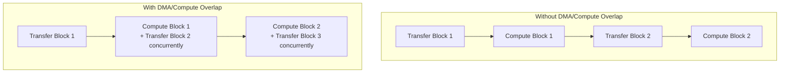
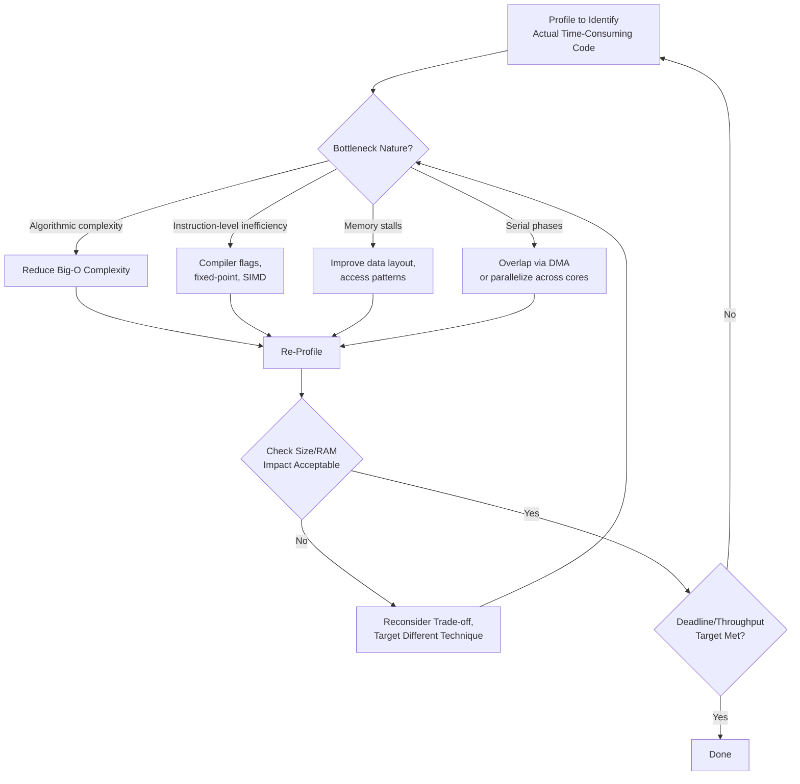

## Execution Speed Optimization

### Overview

Execution speed optimization is the discipline of reducing the wall-clock time a program takes to complete a given task on embedded hardware, distinct from (and often in tension with) code size and RAM optimization. On embedded targets, speed optimization is frequently driven by hard requirements — meeting a real-time deadline, sustaining a required sensor sampling/processing rate, or minimizing active time to reduce energy consumption — rather than speed being pursued as an unconstrained general goal.

### Speed Optimization as a Distinct, Interacting Concern

Execution speed optimization overlaps substantially with the compute-bound and memory-bound bottleneck elimination strategies already covered, but is treated here as its own discipline because many techniques that improve speed have direct, often opposing, costs in code size (covered separately) or RAM usage — meaning speed optimization decisions cannot be made in isolation from the system's other resource constraints.

$$T_{execution} = N_{instructions} \times \text{CPI} \times T_{clock}$$

Execution time is a function of instruction count, average cycles-per-instruction (CPI, affected by pipeline stalls, memory wait states, and branch behavior), and clock period — meaning speed optimization can target any of these three factors independently, though they frequently interact (e.g., an optimization reducing instruction count might increase branch complexity, affecting CPI).

### Algorithmic-Level Optimization

**Algorithmic Complexity Reduction**

The highest-leverage speed optimization is almost always reducing the fundamental algorithmic complexity of the approach used, since improvements here scale with input size in ways that constant-factor optimizations (covered below) cannot match at larger scales.

- Replacing an $O(n^2)$ approach (e.g., nested-loop search) with an $O(n \log n)$ or $O(n)$ alternative (sorted search, hash-based lookup) yields improvement that grows with problem size, whereas micro-optimizing the existing $O(n^2)$ implementation's constant factor yields only a fixed proportional improvement regardless of input size.
- In embedded contexts, algorithmic choice must additionally weigh memory footprint (many faster algorithms trade memory for speed, e.g., a hash table versus linear search) against the available RAM/flash budget, not purely against time complexity in isolation.

**Precomputation and Lookup Tables**

Replacing runtime computation (particularly expensive operations like trigonometric functions, division, or complex transcendental functions) with a precomputed lookup table indexed by input value, trading increased flash/RAM footprint (the table itself) for reduced runtime compute.

- Particularly valuable on cores without hardware support for the operation being replaced (e.g., no hardware floating-point division or transcendental function unit), where software emulation of such operations can be substantially more expensive than a table lookup plus interpolation.
- The size/speed trade-off must be evaluated against the code size optimization concerns covered separately — a very large lookup table trades one constrained resource (flash) directly against another (execution time), and is only favorable when flash headroom genuinely exists.

### Instruction and Compiler-Level Optimization

**Compiler Optimization Level Selection**

Speed-oriented optimization levels (`-O2`, `-O3` in GCC-family compilers) enable more aggressive transformations — inlining, loop unrolling, vectorization where applicable — than size-oriented levels, directly trading code size (covered separately) for execution speed.

- `-O3` typically applies more aggressive optimizations than `-O2`, including more willingness to unroll loops and vectorize, but can occasionally produce larger or, in rare cases, not-meaningfully-faster code depending on the specific codebase and target, making empirical verification on the actual target important rather than assuming higher optimization numbers are strictly better in every case.

**Fixed-Point Arithmetic on FPU-Less Targets**

On cores lacking a hardware floating-point unit, floating-point operations are emulated in software at a substantial cycle cost per operation relative to native integer arithmetic; converting performance-critical floating-point computation to fixed-point representation (encoding fractional values as scaled integers) can yield large speedups on such targets specifically.

$$x_{fixed} = \text{round}(x_{float} \times 2^{f})$$

where $f$ is the number of fractional bits chosen for the fixed-point format, with arithmetic operations (particularly multiplication and division) requiring corresponding scale adjustments to maintain correct fixed-point semantics.

[Inference] The magnitude of speedup from fixed-point conversion on FPU-less targets is generally reported as substantial in embedded systems literature and vendor application notes, since software floating-point emulation typically requires many more instructions per operation than native integer arithmetic, though the exact speedup factor is highly target- and operation-specific and should be measured rather than assumed for a specific application.

**SIMD/Vectorization**

Exploiting SIMD instruction set extensions (where present on the target core, such as ARM's DSP extensions or MVE/Helium on certain Cortex-M cores, or NEON on Cortex-A cores) to process multiple data elements per instruction, directly increasing throughput for data-parallel operations common in signal processing and ML inference workloads.

- Compilers can sometimes auto-vectorize suitable loops at higher optimization levels, but auto-vectorization is not guaranteed for all vectorizable patterns; manual intrinsic-based vectorization offers more reliable results at the cost of reduced code portability across different target architectures.

**Loop Optimization**

- **Loop unrolling**: Reduces per-iteration loop overhead (branch and counter increment/comparison cost relative to loop body work) by replicating the loop body multiple times per iteration of the outer control structure, at a direct code size cost (covered under code size optimization) — a clear illustration of the size-speed trade-off central to this topic.
- **Loop-invariant code motion**: Moving computation that doesn't change across loop iterations outside the loop body, so it executes once rather than redundantly on every iteration; often performed automatically by the compiler at moderate optimization levels but can sometimes be more reliably ensured through manual restructuring in performance-critical code.
- **Strength reduction**: Replacing expensive operations with cheaper equivalents where mathematically valid for the specific context (e.g., replacing multiplication by a power of two with a bit shift), commonly performed automatically by modern compilers but occasionally beneficial to apply manually in cases the compiler's analysis cannot verify as safe.

### Memory Access Pattern Optimization

**Cache-Friendly Access Patterns**

On cores with cache hierarchies, structuring data access to maximize spatial locality (sequential, predictable access patterns) and temporal locality (reusing recently accessed data while still cache-resident) reduces cache miss rate, directly reducing the memory-access-stall component of execution time — closely related to the memory-bound bottleneck elimination strategies covered separately.

**Data Structure Layout for Access Pattern**

Structuring data (e.g., "structure of arrays" versus "array of structures" layout choices) to match the actual access pattern of hot code paths can significantly affect cache efficiency and, on multicore targets, coherency traffic (as covered under cache coherency), since accessing only the specific fields actually needed in a tight loop — rather than pulling in an entire larger structure per access — reduces effective memory traffic.

**Reducing Redundant Memory Access**

Restructuring algorithms to hold frequently-reused values in registers or local variables rather than repeatedly re-reading the same memory location, reducing memory traffic directly, particularly impactful for values accessed within tight, frequently-executed loops.

### Concurrency and Parallelism Optimization

**Multicore Workload Distribution**

On multicore embedded targets, distributing independent portions of a workload across available cores can directly reduce wall-clock completion time, subject to the synchronization-bound bottleneck considerations (lock contention, cache coherency traffic) covered separately — parallelization only yields net speed benefit when inter-core coordination overhead doesn't erode the parallelism gained.

**DMA-Based Compute/Transfer Overlap**

Using DMA to perform data movement concurrently with CPU computation on previously-transferred data (a pipelined producer-consumer pattern), rather than the CPU blocking on each transfer's completion before proceeding, can substantially improve effective throughput for data-movement-heavy workloads by overlapping otherwise-serial phases.

### Speed Optimization Technique Comparison

| Technique | Speed Benefit Source | Primary Trade-off Cost |
|---|---|---|
| Algorithmic complexity reduction | Reduces fundamental operation count, scales with input size | May require additional memory (e.g., hash tables) |
| Lookup tables / precomputation | Trades runtime compute for memory read | Flash/RAM footprint of the table |
| `-O2`/`-O3` compilation | Aggressive compiler-driven transformations | Increased code size |
| Fixed-point arithmetic (FPU-less targets) | Avoids software floating-point emulation cost | Reduced precision, more complex scaling logic |
| SIMD/vectorization | Multiple data elements per instruction | Reduced portability (architecture-specific intrinsics) |
| Loop unrolling | Reduces per-iteration control overhead | Increased code size |
| Cache-friendly data layout | Reduces memory stall time | May require data structure redesign |
| Multicore workload distribution | Parallel execution across cores | Synchronization/coherency overhead |
| DMA/compute overlap | Overlaps otherwise-serial phases | Increased pipeline/buffering complexity |

### Speed Optimization Workflow

### Design Trade-offs

- **Speed vs. code size**: The dominant recurring tension throughout this topic — inlining, unrolling, and aggressive optimization levels improve speed at direct code size cost, requiring the same balance-finding process covered from the opposite direction under code size optimization.
- **Speed vs. precision**: Fixed-point arithmetic and reduced-precision computation can substantially improve speed on appropriate targets but require careful validation that the resulting precision loss remains acceptable for the application's correctness requirements.
- **Speed vs. portability**: Architecture-specific techniques (SIMD intrinsics, hand-tuned assembly for critical sections) achieve better performance than portable generic code but tie the implementation to specific target hardware, complicating future hardware migration.
- **Parallelism gain vs. coordination overhead**: Distributing work across multicore targets only yields net benefit when synchronization and coherency overhead (covered under cache coherency and bottleneck elimination) doesn't consume more time than the parallelism saves — a real risk for fine-grained or frequently-communicating parallel workloads.

### Common Pitfalls

- Applying constant-factor micro-optimizations to an algorithm with poor fundamental complexity, missing far larger gains available from algorithmic redesign.
- Increasing optimization aggressiveness (`-O3`, aggressive unrolling) without checking the resulting code size impact against the target's flash budget, potentially trading a speed problem for a size problem.
- Converting to fixed-point arithmetic without adequately validating precision/overflow behavior across the actual range of values the application will encounter in practice.
- Parallelizing workloads across multicore targets without accounting for synchronization and cache coherency overhead, sometimes resulting in effectively negligible or even negative net speed improvement despite additional cores being utilized.
- Optimizing based on assumed rather than profiled bottleneck location, applying speed techniques to code that isn't actually the limiting factor in overall execution time.

**Related Topics**
- Identifying and eliminating compute-bound and memory-bound bottlenecks
- Code size optimization techniques (the direct counterpart trade-off discipline)
- Cache coherency effects on multicore parallel workload speed
- Fixed-point arithmetic design and precision/overflow validation techniques
- DMA-based data transfer and compute overlap patterns
- Profiling embedded code for accurate bottleneck identification before optimization
- SIMD instruction set extensions available on common embedded core families