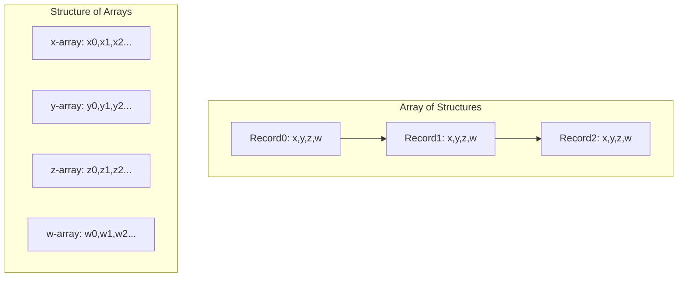
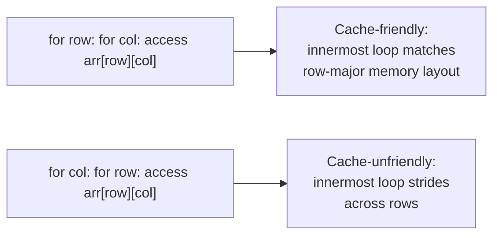

## Cache-Aware Programming

### Overview

Cache-aware programming is the practice of writing code with explicit awareness of the target processor's cache hierarchy, structuring data layout, access patterns, and algorithms to maximize cache hit rate and minimize costly memory-hierarchy stalls. On embedded cores that include cache (a growing but not universal subset of embedded processors — many smaller microcontrollers have no cache at all, relying instead on flat-latency flash/SRAM access), cache behavior can dominate real-world execution time in ways that raw instruction-count analysis alone misses entirely.

### Why Cache Awareness Matters in Embedded Contexts

- **Not universal**: Unlike desktop/server processors where cache hierarchies are a given, many embedded microcontrollers (particularly smaller Cortex-M0/M0+/M3-class parts) have no cache at all, making this topic specifically relevant to higher-tier embedded cores (Cortex-A, Cortex-R, higher-end Cortex-M7/M33/M55 with cache, and comparable RISC-V implementations) rather than universally applicable.
- **Latency gap**: Even where present, embedded cache hierarchies exist because main memory (flash or off-chip DRAM) access latency is substantially higher than core clock cycle time; a cache miss can stall the pipeline for many cycles compared to a cache hit's typically single-digit-cycle cost.
- **Determinism tension**: Cache behavior introduces execution-time variability based on prior access history, which directly complicates the worst-case execution time (WCET) analysis central to real-time embedded system design — a concern largely absent in cache-less embedded targets where memory access latency is uniform and predictable.
- **Multicore coherency interaction**: On multicore embedded targets with hardware cache coherency, cache-aware programming must additionally consider coherency traffic (covered under cache coherency in embedded multicore systems), since poor data layout can trigger unnecessary cross-core invalidation even when single-core cache behavior would otherwise be favorable.

### Cache Fundamentals Relevant to Programming Decisions

**Cache Lines**

Caches transfer and store data in fixed-size blocks called cache lines (commonly 32 or 64 bytes on embedded cores that include cache), meaning a single access to any byte within a line typically brings the entire line into cache — subsequent accesses to nearby bytes within that same line are then cache hits at effectively no additional memory-fetch cost.

**Spatial Locality**

Accessing memory addresses that are close together in the address space (ideally within the same or adjacent cache lines) exploits the fact that an entire cache line is fetched on a miss, meaning sequential or tightly-clustered access patterns benefit from data already resident in cache from a nearby prior access.

**Temporal Locality**

Reusing the same memory location multiple times within a short time window benefits from that location remaining cache-resident between accesses, provided intervening accesses to other addresses haven't evicted it (a function of cache size, associativity, and the specific replacement policy).

**Cache Associativity and Replacement**

Most embedded caches use set-associative organization (a given memory address can map to one of a small number of possible cache line slots, or "ways," within a set) with a replacement policy (commonly some approximation of least-recently-used) determining which existing line is evicted when a new line must be brought in and all ways in the relevant set are occupied.

### Cache Hierarchy and Access Pattern Illustration

<svg xmlns="http://www.w3.org/2000/svg" viewBox="0 0 700 380">
  <text x="350" y="30" text-anchor="middle" font-size="18" font-weight="bold" fill="#1a1a1a">Sequential vs. Strided Access Pattern Cache Behavior (svg_diagram)</text>

  <text x="175" y="60" text-anchor="middle" font-size="13" font-weight="bold" fill="#333333">Sequential Access (cache-friendly)</text>
  <rect x="60" y="75" width="230" height="40" fill="#c8e6c9" stroke="#2e7d32" stroke-width="1.5" />
  <text x="175" y="100" text-anchor="middle" font-size="11" fill="#1b5e20">Cache Line A: elements 0-15 (1 miss, then hits)</text>
  <rect x="60" y="125" width="230" height="40" fill="#c8e6c9" stroke="#2e7d32" stroke-width="1.5" />
  <text x="175" y="150" text-anchor="middle" font-size="11" fill="#1b5e20">Cache Line B: elements 16-31 (1 miss, then hits)</text>
  <text x="175" y="185" text-anchor="middle" font-size="11" fill="#333333">Access order: 0,1,2,3...31 → high hit rate</text>

  <text x="525" y="60" text-anchor="middle" font-size="13" font-weight="bold" fill="#333333">Strided Access (cache-unfriendly)</text>
  <rect x="410" y="75" width="230" height="40" fill="#ffccbc" stroke="#d84315" stroke-width="1.5" />
  <text x="525" y="100" text-anchor="middle" font-size="11" fill="#8a2e00">Cache Line A: only element 0 used</text>
  <rect x="410" y="125" width="230" height="40" fill="#ffccbc" stroke="#d84315" stroke-width="1.5" />
  <text x="525" y="150" text-anchor="middle" font-size="11" fill="#8a2e00">Cache Line B: only element 16 used</text>
  <text x="525" y="185" text-anchor="middle" font-size="11" fill="#333333">Access order: 0,16,32,48... → miss per access</text>

  <text x="350" y="230" text-anchor="middle" font-size="12" fill="#555555">Same data volume accessed; strided pattern discards most of each fetched line (svg_diagram)</text>

  <text x="350" y="270" text-anchor="middle" font-size="11" fill="#777777">Illustrative pattern only — actual line size and hit rates are target-hardware-specific</text>
</svg>

### Data Structure Layout for Cache Efficiency

**Array of Structures (AoS) vs. Structure of Arrays (SoA)**

A frequently significant cache-related design decision: whether to store a collection of multi-field records as an array of structs (each element holds all fields contiguously) or as separate arrays per field (structure of arrays, where each field's values across all elements are stored contiguously).

- **AoS favors code that accesses all fields of a given record together**, since a single cache line fetch brings in multiple complete records' worth of related data when record size is small relative to line size, or at least the full fields of a currently-processed record.
- **SoA favors code that accesses one specific field across many records** (a very common pattern in data-parallel and SIMD-oriented processing), since each cache line fetch in this layout is entirely filled with the one field's values needed for the current operation, rather than partially wasted on other fields not currently being processed — directly complementing SIMD/vectorization speed optimization strategies.
- Neither layout is universally superior; the correct choice depends on the dominant access pattern of the hot code path operating on that data, and a single codebase may benefit from different layouts for different data structures based on how each is actually used.

**Struct Field Ordering and Padding Awareness**

Beyond the AoS/SoA choice, field ordering within a single struct affects both size (as covered under memory footprint reduction) and, relevant here, whether frequently-co-accessed fields end up within the same cache line or are split across a line boundary — placing fields that are typically accessed together adjacently in the struct definition increases the likelihood they share a cache line.

**Cache-Line Alignment and Padding to Avoid False Sharing**

On multicore targets with hardware cache coherency, explicitly padding shared data structures so that independently-modified fields used by different cores fall into separate cache lines prevents false sharing — a direct application of cache-aware programming to the coherency concerns covered separately, where the issue isn't single-core cache efficiency but unnecessary cross-core invalidation traffic caused by unrelated data sharing a line.

### Algorithm and Loop Structuring for Cache Efficiency

**Loop Order for Multi-Dimensional Array Access**

For nested loops iterating over multi-dimensional arrays, the loop order should match the array's actual memory layout (row-major in C/C++) to ensure innermost-loop iteration accesses contiguous memory, rather than striding through memory in a pattern that defeats spatial locality.

**Loop Tiling/Blocking**

For algorithms operating on data too large to fit entirely in cache (common in larger matrix operations even on embedded targets with meaningful data sizes), restructuring nested loops to process the data in smaller "tiles" that do fit within cache capacity, completing all work on one tile before moving to the next, maximizes data reuse from cache before eviction rather than repeatedly re-fetching the same data across passes over the full dataset.

**Prefetching Awareness**

Some embedded cores support hardware or software-directed prefetching (bringing data into cache ahead of when it's actually needed, based on a predicted access pattern), which can hide memory latency behind ongoing computation when access patterns are sufficiently predictable — availability and specific mechanism vary significantly by target core, so this should be confirmed against the specific target's capabilities rather than assumed present.

[Unverified] Specific prefetch instruction availability, configurability, and effectiveness vary substantially across embedded core families and even between different implementations of nominally the same architecture; details should be confirmed against the specific target's technical reference manual.

### Tightly-Coupled Memory as a Cache-Adjacent Consideration

Some embedded cores provide Tightly-Coupled Memory (TCM) — a fast, zero-wait-state local memory region distinct from the cache-backed main memory system, giving the programmer explicit, deterministic control over what resides in fast local memory rather than relying on the cache's automatic (and less predictable) placement decisions.

- Placing performance-critical, frequently-accessed code or data explicitly in TCM (via linker script placement) eliminates cache-miss variability entirely for that code/data, directly benefiting the WCET determinism concerns that make pure cache reliance problematic for hard real-time code.
- This represents a design choice between relying on cache's automatic, pattern-dependent behavior versus TCM's explicit, deterministic but manually-managed placement — not mutually exclusive, since a system can use both for different code/data categories based on their determinism requirements.

### Cache-Aware Technique Summary

| Technique | Cache Benefit Mechanism | Primary Applicability |
|---|---|---|
| Sequential/contiguous access patterns | Maximizes spatial locality per cache line fetch | General, most impactful for large data traversal |
| Structure of Arrays (SoA) layout | Avoids fetching unused fields within a cache line | Data-parallel/SIMD processing of one field across records |
| Loop order matching memory layout | Innermost loop iterates contiguous memory | Multi-dimensional array processing |
| Loop tiling/blocking | Maximizes reuse of cache-resident data before eviction | Large data operations exceeding cache capacity |
| Cache-line-aligned padding | Prevents false sharing between cores | Multicore shared data structures |
| Tightly-coupled memory (TCM) placement | Deterministic, cache-miss-free access | Hard real-time critical code/data |

### Design Trade-offs

- **Cache-optimized layout vs. code clarity/generality**: SoA layouts and cache-line-aware padding can improve performance but often make code less intuitive to read/maintain than a straightforward AoS layout matching the natural conceptual grouping of a record's fields, requiring justification against measured benefit rather than blanket application.
- **Cache reliance vs. deterministic TCM placement**: Relying on automatic cache behavior adapts naturally to varying access patterns but introduces execution-time variability; explicit TCM placement provides determinism but requires manual identification of which code/data genuinely warrants this treatment, and TCM capacity is typically much smaller than total addressable memory.
- **Loop tiling complexity vs. cache efficiency gain**: Tiling improves cache reuse for large-data algorithms but adds implementation complexity (tile size selection, boundary handling) that may not be justified for data small enough to already fit within cache without tiling.
- **Portability vs. cache-specific tuning**: Cache-line size and cache capacity vary across different target cores; code cache-tuned for one specific target's cache parameters (line size, associativity, capacity) may not transfer optimally to a different target without re-tuning, creating a portability cost for highly cache-specific optimization.

### Common Pitfalls

- Applying cache-aware optimization techniques to a target that has no cache at all, where such techniques yield no benefit and may add unnecessary code complexity for a cache-less core.
- Choosing AoS or SoA layout based on general preference or convention rather than the actual dominant access pattern of the specific hot code path operating on that data.
- Overlooking false sharing in multicore cache-coherent contexts, where single-core cache-friendly layout choices can still cause significant cross-core coherency overhead if shared, independently-modified fields aren't cache-line-separated.
- Assuming prefetch or cache configuration behavior is identical across different implementations of nominally the same core architecture, without confirming against the specific target's actual documented capabilities.
- Tiling loops or restructuring data layout for cache efficiency without first profiling to confirm memory access is actually the binding bottleneck, potentially adding complexity for a resource dimension that isn't the true constraint (per the bottleneck identification principles covered separately).

**Related Topics**
- Cache coherency in embedded multicore systems and false sharing prevention
- Identifying and eliminating memory-bound bottlenecks
- Tightly-coupled memory (TCM) configuration and linker script placement
- Worst-case execution time (WCET) analysis under cache-induced timing variability
- SIMD/vectorization techniques benefiting from structure-of-arrays layout
- Struct field ordering for combined size and cache-line efficiency
- Loop tiling/blocking algorithm design for large data operations