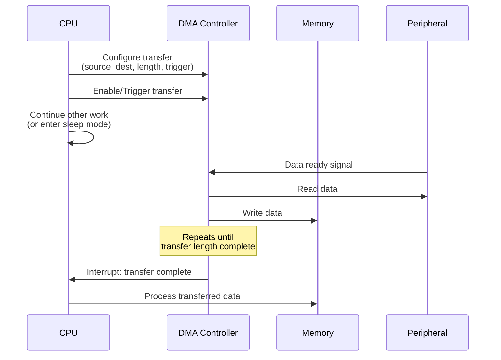
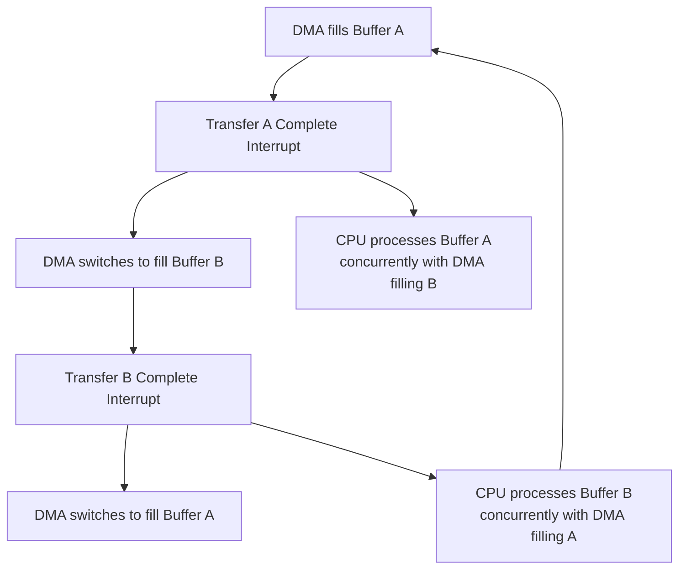
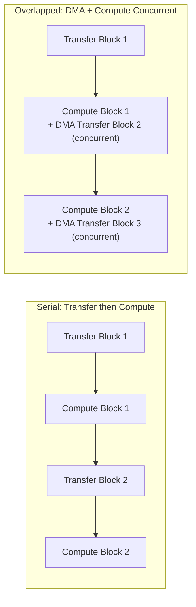

## DMA-Driven Data Movement Optimization

### Overview

DMA-driven data movement optimization is the practice of offloading memory-to-memory, memory-to-peripheral, and peripheral-to-memory transfers to a Direct Memory Access controller rather than having the CPU perform the transfer via explicit load/store instructions, freeing the CPU to perform other work concurrently and typically achieving higher raw transfer throughput than CPU-driven copying. This is a recurring theme touched on across bottleneck elimination, speed optimization, and cache coherency, and is treated here as its own focused discipline covering DMA-specific design patterns and pitfalls.

### Why DMA Offloading Matters in Embedded Systems

- **CPU-free transfer**: Once configured and triggered, a DMA transfer proceeds independently of CPU instruction execution, allowing the CPU to perform other computation, enter a low-power sleep state, or service other tasks while the transfer completes in the background.
- **Higher raw transfer throughput**: DMA controllers are typically purpose-built for bulk data movement and can often achieve higher sustained transfer rates than a CPU executing a software copy loop, particularly for large transfers where per-instruction loop overhead in a CPU-driven copy becomes proportionally significant.
- **Reduced CPU compute-bound contention**: Since DMA offloads the transfer from the CPU's instruction stream entirely, CPU cycles that would otherwise be consumed by a copy loop become available for other work, directly relieving compute-bound bottlenecks when data movement was itself competing for CPU cycles as the dominant workload.
- **Power efficiency**: Allowing the CPU to enter a low-power sleep mode during a DMA transfer (rather than actively spinning in a copy loop) can reduce total energy consumption for data-movement-heavy workloads, directly relevant to the power-bound bottleneck considerations covered separately.

### DMA Transfer Types

**Memory-to-Memory**

Transferring data between two memory locations without CPU involvement, useful for bulk buffer copies, particularly for large buffers where the constant-overhead-per-instruction cost of a CPU copy loop becomes proportionally less efficient than a purpose-built DMA transfer.

**Peripheral-to-Memory**

Moving data from a peripheral's data register (ADC conversion results, UART/SPI/I2C receive buffers) directly into memory as it becomes available, without requiring the CPU to poll the peripheral or service an interrupt for every individual data unit — particularly valuable for high-rate peripherals like ADCs sampling continuously or high-speed communication interfaces.

**Memory-to-Peripheral**

The inverse pattern: streaming data from a memory buffer out to a peripheral (DAC output, SPI/UART transmit) without CPU involvement in feeding each individual data unit to the peripheral's transmit register.

### Basic DMA Transfer Flow

### Double Buffering and Ping-Pong Patterns

A common pattern for continuous streaming data acquisition: two buffers are used alternately, with DMA filling one buffer while the CPU processes the previously-filled buffer, then swapping roles when the current DMA transfer completes — enabling continuous data capture without gaps while still allowing the CPU time to process each buffer's worth of data.

- **Circular/ring DMA modes**: Many DMA controllers support a circular buffer mode natively, automatically wrapping back to the buffer start upon reaching the end without requiring CPU intervention to reconfigure the transfer, directly supporting continuous streaming acquisition patterns like the sliding-window sensor pipelines covered under data pipeline design.
- **Half-transfer and full-transfer interrupts**: Some DMA controllers can additionally signal at the halfway point of a buffer fill, enabling a single buffer to be processed in two halves as it's being filled — a variation on the double-buffering pattern using one physical buffer split logically rather than two separate buffers.

### DMA Scatter-Gather and Chained Transfers

For more complex data movement patterns than a single contiguous source-to-destination transfer, some DMA controllers support scatter-gather or linked-descriptor modes, where a sequence of transfer descriptors (each specifying its own source, destination, and length) is processed automatically in sequence without CPU intervention between each individual transfer segment.

- Useful for gathering non-contiguous data into a contiguous buffer (or the reverse), such as assembling a packet from a header stored separately from payload data, without requiring the CPU to orchestrate each segment's transfer individually.
- Adds configuration complexity relative to a single simple transfer, and introduces a chain of descriptors that itself consumes memory and must be correctly constructed, representing a genuine complexity-versus-capability trade-off for applications with sufficiently complex data movement needs to justify it.

### Cache Coherency Considerations for DMA

As covered in depth under multicore cache coherency, DMA is a major coherency hazard specifically because it moves data directly to/from memory, bypassing CPU caches on targets where the DMA controller is not itself a coherency-aware participant.

- **Non-coherent DMA (common on many microcontrollers)**: Software must explicitly clean (write-back) the CPU cache before a DMA read from memory, ensuring the DMA controller reads the most recent CPU-written values rather than stale main-memory content; software must explicitly invalidate the CPU cache after a DMA write to memory, ensuring subsequent CPU reads fetch the DMA-written data rather than a stale cached copy.
- **Coherent DMA (via ACE-Lite or similar, on higher-tier targets)**: The DMA controller participates in the coherency protocol directly, automatically triggering appropriate snoop/invalidation without requiring explicit software cache maintenance calls around each transfer.
- This cache-DMA interaction is one of the most common sources of intermittent, hard-to-reproduce embedded bugs — data appearing correct via a debugger (which may use a cache-bypassing access path) while the actual running application code reads stale or garbage values due to a missing cache maintenance call.

### DMA Channel Priority and Arbitration

On systems with multiple concurrent DMA channels (or DMA competing with CPU access for shared memory bus bandwidth), channel priority configuration determines which transfer is favored when bus contention occurs.

- **Fixed priority**: Channels are assigned a static priority ranking, with higher-priority channels always winning arbitration over lower-priority ones during contention — simple to reason about but can lead to lower-priority channel starvation under sustained high-priority channel activity.
- **Round-robin arbitration**: Channels take turns accessing the bus, providing more balanced access across channels at the potential cost of less predictable worst-case latency for any individual channel compared to a channel with guaranteed top fixed priority.
- **Bandwidth/burst limiting**: Some DMA controllers allow limiting how much of the available bus bandwidth a given transfer can consume per arbitration cycle, preventing a single large DMA transfer from starving CPU memory access or other DMA channels for extended periods.

[Inference] The specific arbitration schemes, priority levels, and configurability available are highly dependent on the specific DMA controller implementation in a given microcontroller/SoC; the general priority/round-robin/bandwidth-limiting categories described are common patterns across embedded DMA controllers broadly, but exact configuration options should be confirmed against the specific target's reference manual.

### DMA Transfer Overhead Considerations

While DMA generally outperforms CPU-driven copying for substantial transfers, DMA configuration itself carries non-zero overhead (register setup, in some cases descriptor construction), meaning very small transfers may not benefit from DMA offloading and could, in some cases, complete faster via a simple direct CPU copy loop given the fixed configuration overhead relative to the small transfer's own duration.

$$T_{DMA} = T_{config} + T_{transfer}, \quad T_{CPU\_copy} = T_{loop\_overhead} \times N_{iterations}$$

For sufficiently small $N$, $T_{CPU\_copy}$ can be less than $T_{DMA}$ purely due to the fixed configuration overhead term dominating; the crossover point is target- and transfer-size-specific and, where the distinction matters for a specific application, is best determined empirically via profiling (per the embedded profiling techniques covered separately) rather than assumed universally.

### DMA-CPU Compute Overlap Pattern

Beyond simple background transfer, a further optimization overlaps DMA transfer of the *next* data block with CPU *computation* on the *current* already-transferred block, maximizing effective throughput by hiding transfer latency behind useful computation rather than either phase idling while the other completes.

This pattern directly extends the double-buffering concept, requiring careful buffer management (ensuring the CPU never reads from a buffer the DMA is currently writing to, and vice versa) to avoid data races between the two concurrently-operating agents.

### DMA Optimization Technique Summary

| Technique | Primary Benefit | Key Consideration |
|---|---|---|
| Basic DMA offload (vs. CPU copy loop) | Frees CPU cycles, often higher raw throughput | Fixed configuration overhead may not suit very small transfers |
| Double buffering / ping-pong | Continuous streaming without acquisition gaps | Requires sufficient CPU processing time within one buffer-fill period |
| Circular/ring DMA mode | Automatic wrap-around without CPU reconfiguration | Buffer sizing must match actual streaming window needs |
| Scatter-gather / chained descriptors | Complex, non-contiguous transfer patterns without CPU orchestration | Added configuration complexity, descriptor memory overhead |
| Cache maintenance around DMA (non-coherent targets) | Correctness — avoids stale cache/memory data | Missing this is a common source of intermittent bugs |
| Channel priority/arbitration tuning | Manages contention across multiple concurrent transfers | Fixed priority risks starvation; round-robin trades worst-case latency |
| DMA/compute overlap | Hides transfer latency behind useful computation | Requires careful buffer synchronization to avoid races |

### Design Trade-offs

- **DMA offload vs. configuration overhead**: DMA offloading benefits large transfers substantially but carries fixed setup overhead that can make it net-unfavorable for very small, infrequent transfers — a decision best validated empirically for transfers near the likely crossover point rather than assumed.
- **Buffering complexity vs. streaming continuity**: Double-buffering and overlap patterns eliminate acquisition gaps and hide transfer latency but add implementation complexity (buffer state tracking, synchronization) compared to simpler blocking transfer-then-process sequential patterns.
- **Fixed vs. round-robin channel priority**: Fixed priority offers predictable, analyzable worst-case behavior for the highest-priority channel but risks starving lower-priority channels; round-robin balances access more fairly but complicates precise worst-case latency analysis for any single channel.
- **Coherent vs. non-coherent DMA reliance**: Coherent DMA (where available) eliminates manual cache maintenance burden and its associated bug risk, but is not universally available across embedded targets, meaning many designs must still correctly implement the non-coherent cache maintenance pattern regardless of its added correctness burden.

### Common Pitfalls

- Omitting cache clean/invalidate operations around DMA transfers on non-coherent targets, producing intermittent stale-data bugs that may not manifest consistently or may be masked during debugger-based inspection.
- Using DMA for transfers small enough that configuration overhead exceeds any throughput benefit versus a simple CPU copy loop, without having profiled to confirm DMA is actually net-beneficial at that specific transfer size on the target hardware.
- Implementing double buffering without ensuring the CPU's processing time for one buffer reliably completes before the DMA finishes filling the other, risking the CPU reading from a buffer still being written by DMA.
- Configuring multiple DMA channels with equal or poorly-considered priority such that a high-bandwidth channel starves a latency-sensitive lower-priority channel, discovered only under specific concurrent-load conditions rather than in isolated testing.
- Assuming DMA transfer completion timing is fully deterministic without accounting for bus arbitration contention from other concurrent DMA channels or CPU memory access, which can introduce variability relevant to real-time deadline analysis.

**Related Topics**
- Cache coherency in embedded multicore systems and non-coherent DMA cache maintenance
- Identifying and eliminating I/O-bound and memory-bound bottlenecks
- Data pipeline design for edge ML (ring buffer and windowing patterns using DMA)
- Power-bound bottleneck elimination via CPU sleep during DMA transfers
- Real-time scheduling and worst-case latency analysis under DMA bus contention
- Peripheral interface configuration for high-rate ADC/communication DMA triggering
- Profiling embedded code to empirically determine DMA-vs-CPU-copy crossover points