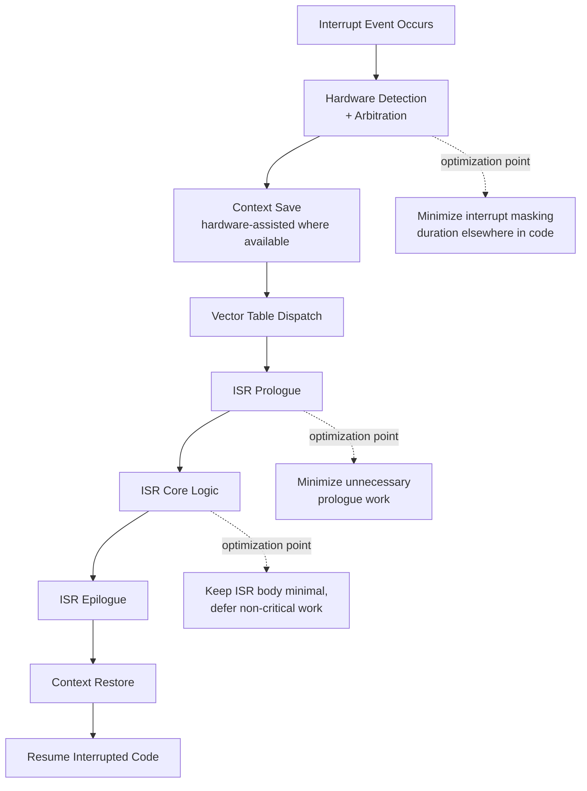
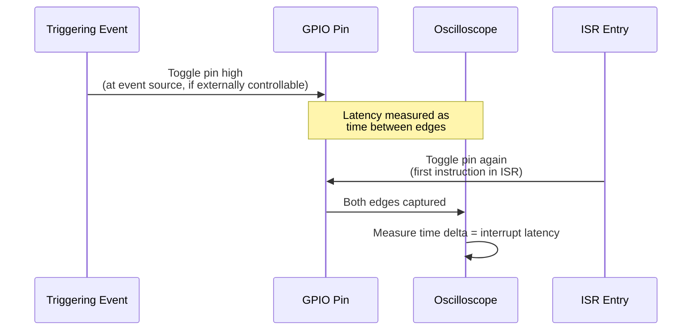

## Interrupt Latency Minimization

### Overview

Interrupt latency minimization is the practice of reducing the time between an interrupt-triggering event occurring and the corresponding interrupt service routine (ISR) beginning meaningful execution, a critical concern for embedded systems where timely response to external events (sensor readings, communication events, safety-critical conditions) directly determines system correctness and real-time compliance. Interrupt latency is distinct from, but closely related to, the broader real-time deadline and WCET concerns covered under profiling and bottleneck elimination.

### Defining Interrupt Latency

Interrupt latency is typically decomposed into several sequential components, each contributing to total response time:

$$T_{latency} = T_{detect} + T_{arbitrate} + T_{context\_save} + T_{dispatch} + T_{ISR\_prologue}$$

- **Detection time**: Time for the interrupt controller to recognize the triggering event and signal the core.
- **Arbitration time**: If multiple interrupts are pending simultaneously, time for the interrupt controller to determine which has priority and should be serviced first.
- **Context save time**: Time for the core to save sufficient execution state (program counter, key registers) to safely suspend the interrupted code and later resume it correctly.
- **Dispatch time**: Time to fetch the correct ISR's address (via vector table lookup or similar mechanism) and begin executing it.
- **ISR prologue overhead**: Any additional setup code at the start of the ISR itself before the interrupt's actual intended handling logic begins.

### Why Interrupt Latency Matters

- **Real-time correctness**: Many embedded applications have hard deadlines on how quickly an event must be handled (a safety interlock, a precisely-timed communication protocol edge, a sensor sample that must be read before the next sample overwrites it in a peripheral register) — excessive interrupt latency can directly cause missed data or unsafe conditions.
- **Jitter and determinism**: Beyond average latency, the variability (jitter) in interrupt response time matters for applications requiring consistent timing, since a system that is usually fast but occasionally slow can be worse for certain real-time applications than one that is consistently moderate.
- **Compounding with other real-time constraints**: Interrupt latency adds to, and interacts with, the broader WCET and deadline analysis covered under profiling — a task's overall worst-case completion time must account for potential interrupt latency and preemption, not just its own execution time in isolation.

### Hardware-Level Latency Factors

**Interrupt Controller Architecture**

Modern embedded cores (such as ARM Cortex-M with its Nested Vectored Interrupt Controller, NVIC) are specifically architected to minimize fixed interrupt-handling overhead, including automatic hardware-driven context saving for a defined register subset and direct vector table dispatch, reducing software-managed overhead compared to less specialized interrupt handling schemes.

**Interrupt Priority Levels and Preemption**

Most embedded interrupt controllers support multiple priority levels, allowing a higher-priority interrupt to preempt an already-executing lower-priority ISR — critical for ensuring the most time-critical events are never blocked behind the handling of less urgent ones, but requiring careful priority assignment to avoid unintended interaction effects.

**Tail-Chaining and Late-Arrival Optimization**

Some interrupt controllers (again, NVIC is a commonly cited example in ARM Cortex-M contexts) support optimizations such as tail-chaining, where the controller detects that one ISR is completing just as another interrupt is pending, and skips the redundant context restore/save pair between the two, directly reducing back-to-back interrupt handling overhead compared to fully independent entry/exit sequences for each.

[Inference] Specific hardware optimizations like tail-chaining are architecture- and implementation-specific features rather than universal across all embedded interrupt controllers; their presence and exact behavior should be confirmed against the specific target core's technical reference manual rather than assumed present on an arbitrary embedded target.

### Interrupt Latency Sources and Optimization Points

### Software-Level Latency Minimization Strategies

**Minimizing Interrupt-Disabled (Masked) Duration**

Any code that disables interrupts (to protect a critical section, for example) directly adds to worst-case interrupt latency for any interrupt that would otherwise have fired during that masked window, since the interrupt cannot be serviced until unmasking occurs regardless of the interrupt's own priority.

- **Minimizing critical section length**: Keeping interrupt-disabled regions as short as possible directly bounds the maximum latency contribution from this source, a design discipline that becomes increasingly important as real-time deadline tightness increases.
- **Avoiding global interrupt disabling where selective masking suffices**: Disabling only the specific lower-priority interrupts that must be protected against, rather than globally masking all interrupts, allows higher-priority time-critical interrupts to still be serviced promptly during the critical section — directly leveraging the priority-based preemption capability of the interrupt controller rather than defeating it with an overly broad mask.

**Keeping ISRs Short**

A widely-followed embedded design principle: ISR bodies should perform only the minimal work genuinely required to be handled with interrupt-level urgency (typically: capturing time-critical data, clearing the interrupt flag, and signaling that further processing is needed), deferring non-time-critical processing to a lower-priority context.

- **Deferred processing patterns**: Common mechanisms include setting a flag or posting to a queue/semaphore that a main-loop or lower-priority RTOS task subsequently checks/waits on, moving substantial processing logic out of the interrupt context entirely.
- **Rationale**: Since a currently-executing ISR (depending on priority configuration) can block lower- or equal-priority interrupts from being serviced, an unnecessarily long ISR directly increases the worst-case latency experienced by other interrupt sources, not just delaying return to the originally-interrupted main-line code.

**Avoiding Blocking Operations Within ISRs**

Operations that could block or take highly variable time (waiting on a peripheral status flag in a busy-loop, performing complex computation, calling functions with unpredictable execution time) are generally avoided within ISR context specifically because they directly and unpredictably extend the time other pending interrupts must wait.

**ISR Code Placement for Cache/Memory Access Speed**

On cores with cache or tightly-coupled memory (as covered under cache-aware programming), placing frequently-triggered or highly latency-sensitive ISR code in fast, deterministic memory (TCM where available) rather than relying on cache behavior can reduce both average latency and, more importantly for real-time purposes, latency variability, since a cache miss on ISR entry would otherwise add unpredictable delay precisely when predictability matters most.

### Priority Assignment and Priority Inversion

**Priority Assignment Strategy**

Assigning interrupt priorities according to actual deadline urgency (rather than, for example, arbitrary assignment order or perceived general importance) ensures the interrupt controller's preemption behavior actually serves the system's real-time requirements — a mismatch between assigned priority and true deadline urgency can result in a technically-lower-priority but actually-more-urgent event being delayed behind a higher-priority but less time-critical one.

**Priority Inversion in Interrupt/RTOS Contexts**

A scenario where a lower-priority task or interrupt handler holds a resource (lock, shared data structure) needed by a higher-priority interrupt or task, effectively causing the higher-priority entity to wait on the lower-priority one — directly undermining the intended priority-based responsiveness guarantee.

- **Priority inheritance**: A mitigation technique (more commonly discussed at the RTOS task level than pure interrupt level, though the underlying principle applies wherever shared resources cross priority boundaries) where a lower-priority holder of a contested resource is temporarily boosted to the priority of the highest-priority entity waiting on that resource, bounding the maximum inversion duration.
- **Minimizing shared resource contention between ISR and main-line/task code**: Where feasible, structuring data sharing between ISR and non-ISR contexts to minimize the situations where either must wait on the other reduces the opportunity for inversion-related latency to occur in the first place.

### Measuring Interrupt Latency

As covered under embedded profiling, interrupt latency is commonly measured via GPIO toggling (toggling a pin at the triggering event and again at ISR entry, observed on an oscilloscope) or hardware trace facilities where available, since software instrumentation within the latency-critical path itself risks perturbing the very measurement being taken.

### Interrupt Latency Optimization Technique Summary

| Technique | Latency Impact | Key Consideration |
|---|---|---|
| Hardware-assisted context save (NVIC-style) | Reduces fixed dispatch overhead | Availability is core/architecture-specific |
| Minimizing interrupt-masked critical sections | Bounds worst-case added latency from masking | Requires disciplined critical section scoping |
| Selective vs. global interrupt masking | Preserves higher-priority interrupt responsiveness | More complex to reason about than global masking |
| Keeping ISR bodies minimal, deferring processing | Reduces blocking of other pending interrupts | Requires a deferred-processing mechanism (flag, queue) |
| Avoiding blocking operations in ISR context | Prevents unpredictable latency extension | May require restructuring peripheral interaction logic |
| Priority assignment matching true urgency | Ensures preemption serves actual deadline needs | Requires accurate per-source urgency analysis |
| Priority inheritance for shared resources | Bounds priority inversion duration | Adds RTOS/synchronization primitive complexity |
| TCM placement for critical ISR code | Reduces latency variability from cache misses | Limited TCM capacity constrains how much code qualifies |

### Design Trade-offs

- **Minimal ISR logic vs. deferred processing complexity**: Keeping ISRs minimal and deferring work improves overall interrupt responsiveness system-wide but requires additional synchronization infrastructure (flags, queues, semaphores) and careful design to ensure deferred processing itself meets any applicable timing requirements in its own lower-priority context.
- **Selective masking granularity vs. code complexity**: Fine-grained, selective interrupt masking better preserves high-priority responsiveness than coarse global masking, but is more complex to implement correctly and reason about, particularly as the number of distinct interrupt sources and priority levels grows.
- **Priority inheritance overhead vs. inversion risk**: Implementing priority inheritance mechanisms adds runtime overhead and RTOS/synchronization primitive complexity but bounds an otherwise potentially unbounded priority inversion latency risk — a trade-off generally favoring inheritance for systems with genuine hard real-time requirements where unbounded inversion risk is unacceptable.
- **TCM allocation for ISR code vs. other latency-sensitive uses**: Since TCM capacity is limited, allocating it to ISR code improves interrupt latency determinism but competes with other candidates for the same fast-memory resource (as covered under cache-aware programming), requiring prioritization across the system's various determinism-sensitive code/data.

### Common Pitfalls

- Performing substantial computation or blocking operations directly within an ISR, unnecessarily extending the time other pending interrupts must wait regardless of the originally-interrupted code's own priority.
- Using broad global interrupt masking for critical sections where selective masking of only the genuinely-conflicting lower-priority interrupts would have preserved higher-priority interrupt responsiveness.
- Assigning interrupt priorities based on subjective importance rather than actual deadline/timing urgency analysis, causing a real-time-critical event to be serviced later than a less time-critical but higher-assigned-priority one.
- Overlooking priority inversion risk when ISR and lower-priority task code share resources (data structures, peripherals) without an inheritance or equivalent mitigation mechanism, potentially causing unbounded or difficult-to-bound worst-case latency.
- Measuring interrupt latency using software instrumentation timestamps taken from within the latency-critical path itself, introducing probe-effect distortion into the very measurement intended to characterize true hardware-level latency.

**Related Topics**
- Profiling embedded code: timing measurement and worst-case execution time analysis
- RTOS task scheduling, priority assignment, and priority inheritance mechanisms
- Cache-aware programming and tightly-coupled memory placement for deterministic access
- Identifying and eliminating synchronization-bound bottlenecks
- DMA-driven data movement as an alternative to interrupt-per-sample handling
- Real-time deadline analysis incorporating interrupt latency and preemption
- Nested Vectored Interrupt Controller (NVIC) architecture and configuration on ARM Cortex-M