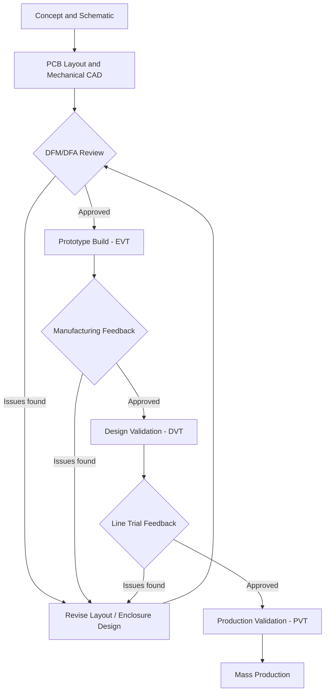

## Design for Manufacturing and Assembly

### Overview

Design for Manufacturing and Assembly (DFMA) is a design discipline that optimizes a product's physical design to minimize production cost, assembly time, and defect rates while preserving functional requirements. For embedded devices, DFMA spans two tightly coupled domains: the printed circuit board assembly (PCBA) and the mechanical enclosure/product housing. A design that is electrically correct but ignores DFMA principles often becomes expensive, slow, or impossible to manufacture at volume.

DFMA is typically split into two complementary sub-disciplines:

- **Design for Manufacturing (DFM):** Ensures individual components (PCBs, molded parts, sheet metal) can be fabricated reliably and cheaply.
- **Design for Assembly (DFA):** Ensures the fabricated components can be combined into a finished product efficiently, ideally with minimal manual labor, fasteners, and orientation ambiguity.

### Why DFMA Matters for Embedded Products

**Key Points**
- Design changes are cheapest early (schematic/CAD stage) and become exponentially more expensive after tooling is cut. [Inference] — the exact cost multiplier varies by industry and process, but the directional relationship is widely documented in manufacturing literature.
- A single DFM violation (e.g., a via placed under a component pad without proper tenting) can cause field failures across an entire production run, not just one unit.
- DFA reduces labor cost, which matters disproportionately for embedded devices produced in the thousands-to-millions range, where even seconds of assembly time compound into significant cost.
- Poor DFMA increases first-pass yield loss, rework labor, and warranty returns — all of which erode margin faster than component cost overruns.

### PCB-Level DFM

#### Panelization and Fabrication Constraints

PCBs are rarely fabricated as single units; they are arrayed ("panelized") to improve throughput on fabrication and assembly lines.

- **Panel utilization**: Board outlines should tile efficiently on a standard panel size (commonly 18" × 24" or fab-specific dimensions) to minimize wasted substrate.
- **Tab-routing vs. V-scoring**: Boards are separated from the panel either by perforated tabs (routed with small mouse-bite connections) or V-grooves cut partway through the board. V-scoring is cheaper and faster but only works for straight-line separations; irregular board shapes require tab-routing.
- **Fiducial markers**: Global fiducials (panel-level) and local fiducials (per-component, for fine-pitch parts) must be included so pick-and-place machines can optically align the board.
- **Rail/border clearance**: Components should not be placed too close to the panel edge or breakout tabs, since depaneling stress can crack nearby joints.

#### Component Placement Rules

- Maintain consistent component orientation where possible (e.g., all polarized capacitors facing the same direction) so operators and automated optical inspection (AOI) can visually verify correctness at a glance.
- Avoid placing tall components adjacent to short ones if a stencil or selective wave solder step is required, since this affects paste application and thermal profiles.
- Keep a minimum keep-out zone around mounting holes, connectors, and panel edges (commonly a few millimeters, exact values are fab-dependent) to avoid interference with tooling and fixtures.
- Group components by soldering process (SMT top side, SMT bottom side, through-hole) to minimize the number of reflow/wave passes.

#### Land Pattern and Footprint Design

- Follow IPC-7351 (or equivalent) footprint standards rather than hand-drawn pads; standardized footprints have known solder paste volumes and thermal behavior.
- Avoid mixing 0201 and 01005 passives with large connectors in the same reflow zone without justified thermal profiling, since small and large thermal masses heat unevenly.
- For BGAs and fine-pitch QFNs, ensure via-in-pad designs use filled and capped vias to prevent solder wicking during reflow.

#### Testability (Design for Test, DFT)

DFT overlaps heavily with DFM and is often treated as a subset of it.

- Include a bed-of-nails test point on every net requiring in-circuit test (ICT), spaced to standard test probe pitch (commonly 100 mil / 2.54 mm, though finer pitches exist).
- Reserve boundary-scan (JTAG) access headers even on production boards, since firmware flashing and functional test frequently depend on them.
- Avoid burying critical test nets under BGAs or components where physical probe access is impossible; use via-stitched test points instead.

### Enclosure and Mechanical DFM

#### Injection Molding Constraints

Most embedded device enclosures use injection-molded plastic, which imposes specific geometric rules:

- **Draft angles**: Vertical walls need a slight taper (commonly around 1–2 degrees, mold- and material-dependent) so the part releases from the mold without scarring.
- **Wall thickness uniformity**: Sudden thickness changes cause sink marks, warping, and internal stress. Ribs and bosses should be thinner than the nominal wall (a common guideline is roughly 50–60% of wall thickness) to avoid visible sink on the opposite face.
- **Undercuts**: Features that prevent straight-line mold release require side-action sliders or lifters, which add tooling cost. Minimizing undercuts reduces both tooling complexity and cycle time.
- **Radii on internal corners**: Sharp internal corners concentrate stress and can cause cracking; generous fillets improve both moldability and part strength.

#### Sheet Metal Constraints

For devices using metal enclosures or shielding cans:

- Bend radii should meet or exceed the material's minimum bend radius (material- and thickness-dependent) to avoid cracking at the bend line.
- Holes and cutouts should maintain a minimum distance from bend lines to prevent distortion.
- Standardize sheet thickness across parts where possible to reduce the number of unique tooling setups.

#### Enclosure-to-PCB Fit

- Include adequate clearance between the PCB and enclosure bosses/standoffs, accounting for solder mask thickness, silkscreen, and component height tolerances.
- Specify keep-out zones on the PCB layout that mirror the mechanical CAD, ideally maintained as a shared mechanical-electrical co-design file (e.g., IDF/IDX or STEP-based ECAD-MCAD exchange) to prevent last-minute interference discoveries.

### Design for Assembly Principles

**Key Points**
- **Minimize part count**: Every additional discrete part (screw, bracket, gasket) adds assembly time and a potential failure point. Combining functions into a single molded or stamped part (e.g., integrating a snap-fit clip into the main housing) reduces total parts.
- **Self-locating features**: Use physical features like alignment pins, chamfered guides, or asymmetric keying so parts can only be assembled correctly, and preferably fit together without operator judgment.
- **Reduce fastener variety**: Standardize on one or two screw types/sizes across the product rather than five, which reduces tool changes and picking errors on the assembly line.
- **Favor snap-fits over screws** where the product's serviceability requirements allow it, since snap-fits eliminate a fastening step and a captive-fastener risk.
- **One-directional assembly**: Design so the product can be assembled largely from one direction (commonly top-down), avoiding the need to flip the sub-assembly mid-process, which slows manual and automated lines alike.
- **Avoid fragile handling states**: A sub-assembly that is easily damaged before final enclosure closure (e.g., an exposed flex cable) increases handling-induced defects.

### Connector and Cable DFA

- Prefer board-to-board connectors over discrete wiring harnesses where flex and space allow, since harnesses require manual routing and are a common source of assembly-line variability.
- When flex cables or wire harnesses are unavoidable, specify keyed connectors (physically distinct or color-coded) to prevent reversed or cross-connected cables.
- Route cable lengths with intentional slack allowances documented in the assembly drawing, rather than leaving length to operator judgment.

### DFMA Review Process

A formal DFMA review is typically conducted at each major design milestone (EVT, DVT, PVT — Engineering/Design/Production Validation Test) and involves cross-functional input.

**Example**
A typical DFMA review checklist walkthrough for an embedded sensor node:
1. Mechanical engineer confirms enclosure draft angles and wall thickness against the selected molding process.
2. PCB layout engineer confirms component keep-outs match the enclosure step file.
3. Manufacturing engineer confirms test point access for ICT and JTAG.
4. Assembly line engineer confirms fastener count and reviews whether any step requires the sub-assembly to be re-oriented.
5. Quality engineer confirms fiducials and AOI coverage for all critical components.

### DFMA Trade-off Diagram

<svg xmlns="http://www.w3.org/2000/svg" viewBox="0 0 760 420">
  \<style\>
    .title { font: bold 16px sans-serif; fill: #1a1a1a; }
    .axis-label { font: 12px sans-serif; fill: #333; }
    .curve-label { font: 12px sans-serif; fill: #333; }
    .grid { stroke: #ddd; stroke-width: 1; }
  \</style\>
  <text x="380" y="24" text-anchor="middle" class="title">Cost of Design Change vs. Product Lifecycle Stage (svg_diagram)</text>

  <line x1="80" y1="360" x2="700" y2="360" stroke="#333" stroke-width="2" />
  <line x1="80" y1="360" x2="80" y2="50" stroke="#333" stroke-width="2" />

  <text x="390" y="395" text-anchor="middle" class="axis-label">Product Lifecycle Stage</text>
  <text x="30" y="205" text-anchor="middle" class="axis-label" transform="rotate(-90 30 205)">Cost to Implement Change</text>

  <line x1="150" y1="360" x2="150" y2="60" class="grid" stroke-dasharray="3,3" />
  <line x1="300" y1="360" x2="300" y2="60" class="grid" stroke-dasharray="3,3" />
  <line x1="450" y1="360" x2="450" y2="60" class="grid" stroke-dasharray="3,3" />
  <line x1="600" y1="360" x2="600" y2="60" class="grid" stroke-dasharray="3,3" />

  <text x="150" y="378" text-anchor="middle" class="axis-label">Schematic</text>
  <text x="300" y="378" text-anchor="middle" class="axis-label">Layout / CAD</text>
  <text x="450" y="378" text-anchor="middle" class="axis-label">Tooling Cut</text>
  <text x="600" y="378" text-anchor="middle" class="axis-label">Mass Production</text>

  <path d="M 100 350 Q 300 340 450 260 Q 550 180 690 70" fill="none" stroke="#c0392b" stroke-width="3" />
  <text x="500" y="140" class="curve-label" fill="#c0392b">Cost of change</text>

  <circle cx="150" cy="345" r="5" fill="#2980b9" />
  <circle cx="300" cy="330" r="5" fill="#2980b9" />
  <circle cx="450" cy="260" r="5" fill="#2980b9" />
  <circle cx="600" cy="150" r="5" fill="#2980b9" />

  <text x="150" y="330" text-anchor="middle" class="curve-label" fill="#2980b9">Low</text>
  <text x="330" y="315" text-anchor="middle" class="curve-label" fill="#2980b9">Low-Med</text>
  <text x="470" y="245" text-anchor="middle" class="curve-label" fill="#2980b9">High</text>
  <text x="620" y="135" text-anchor="middle" class="curve-label" fill="#2980b9">Very High</text>
</svg>

### DFMA Review Workflow

### Common DFMA Pitfalls in Embedded Devices

- Placing test points or debug headers inside the sealed enclosure with no external access, forcing enclosure disassembly for every unit tested in the field.
- Using press-fit or friction-fit connectors that rely on tight mechanical tolerances not achievable at the enclosure's molding tolerance grade.
- Specifying components with long lead times or single-source availability discovered only after tooling is committed, creating a mismatch between electrical BOM readiness and mechanical tooling schedules.
- Ignoring thermal expansion mismatch between the PCB substrate and enclosure material, which can cause connector misalignment or cracked solder joints after multiple thermal cycles. [Inference] — the specific failure mode and severity depend on the materials, coefficient of thermal expansion mismatch, and duty cycle involved.

### Metrics Used to Evaluate DFMA Success

- **First-pass yield (FPY)**: Percentage of units passing all tests without rework.
- **Assembly time per unit**: Measured in seconds/minutes on the line; a core DFA target.
- **Part count**: Total unique and total physical parts; both are tracked, since reducing unique part count also reduces inventory complexity.
- **Defects per million opportunities (DPMO)**: A standard manufacturing quality metric applicable to solder joints, mechanical fits, and fastening operations.

### Related Topics

- Design for Test (DFT) and boundary-scan strategy
- IPC standards for PCB fabrication and assembly (IPC-2221, IPC-7351, IPC-A-610)
- ECAD-MCAD co-design workflows and file interchange formats
- Engineering/Design/Production Validation Test (EVT/DVT/PVT) milestones
- Tolerance stack-up analysis for enclosure and PCB fit
- Supply chain and component lifecycle management (obsolescence planning)
- Thermal management in enclosure design
- Environmental sealing (IP ratings) and its interaction with DFA