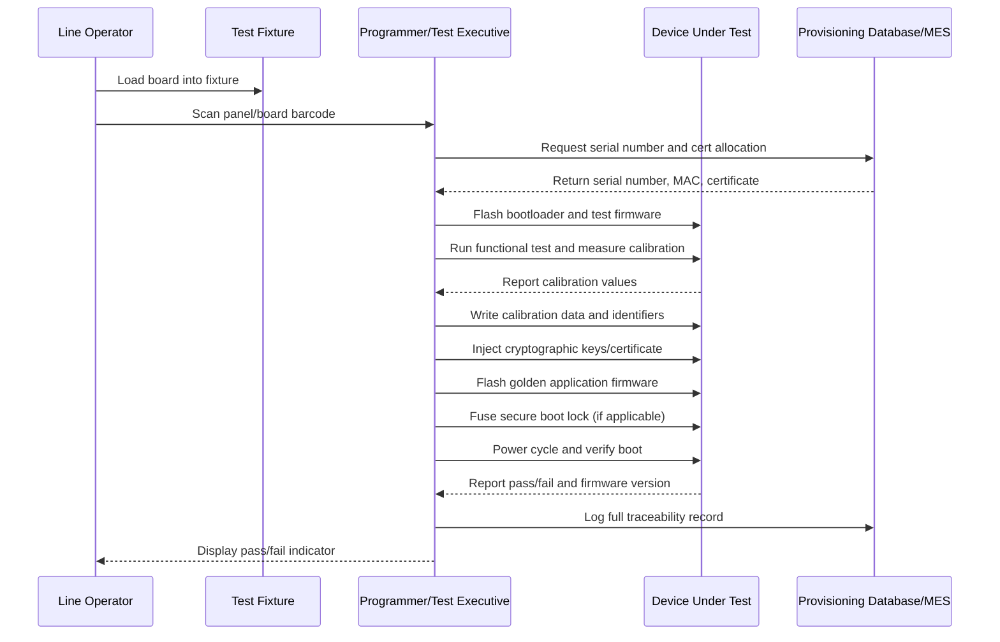

## Firmware Provisioning at Manufacturing

### Overview

Firmware provisioning is the process of loading initial firmware images, calibration data, cryptographic keys, and device-unique identifiers onto embedded devices during the manufacturing flow, before the product reaches an end user. Unlike a developer flashing firmware over a debugger during bring-up, production provisioning must be fast, repeatable, auditable, and tolerant of operators who may have no embedded systems expertise. It is one of the last technical gates before a unit is boxed and shipped, and errors here are expensive because they surface as returned or bricked units rather than caught defects.

### Why Provisioning Differs from Development Flashing

**Key Points**
- Development flashing prioritizes iteration speed for one engineer on one board; provisioning prioritizes throughput across many stations and many units per hour.
- Provisioning must be executable by production line operators with minimal training, typically triggered by a barcode scan or a single button press rather than IDE commands.
- Every provisioned unit needs a durable, traceable record (serial number, firmware version, timestamp, station ID) tying that specific unit to its provisioning event, which development flashing does not require.
- Security-sensitive operations (key injection, secure boot fusing) are one-time, irreversible actions on most silicon, so provisioning logic must be more conservative and failure-aware than a developer's flash script.

### Components of a Provisioning Payload

A typical provisioning step writes more than just the application firmware image:

- **Bootloader**: Often pre-programmed by the chip vendor or programmed once early in the line and rarely rewritten afterward.
- **Application firmware**: The main product firmware image, frequently the same golden image across all units of a given hardware revision.
- **Calibration data**: Per-unit measured values (e.g., ADC offset/gain, RF power trim, sensor compensation coefficients) that differ from unit to unit and must be measured and written during test, not baked into the golden image.
- **Unique identifiers**: Serial numbers, MAC addresses (for networked devices), and other per-unit identifiers, often pulled from a pre-allocated pool managed by a back-end provisioning database.
- **Cryptographic material**: Device certificates, private keys, or symmetric keys used for secure boot, secure communication (TLS/DTLS), or cloud device identity (e.g., AWS IoT, Azure IoT device certificates).
- **Configuration/feature flags**: SKU-dependent settings that differentiate otherwise-identical hardware into different product variants (e.g., enabling/disabling a feature by license tier).

### Provisioning Architecture Patterns

#### In-Circuit Programming via Debug Interfaces

The most common low-level method uses the chip's native debug/programming interface:

- **SWD (Serial Wire Debug)** for ARM Cortex-M/A parts.
- **JTAG** for many other architectures and some ARM parts.
- **UART bootloader mode** on parts with a ROM-resident serial bootloader (common on ESP32, many STM32 parts in bootloader mode, etc.).

These interfaces are exposed via a bed-of-nails fixture or a pogo-pin test jig that mates with test points on the PCB, controlled by a programming tool (e.g., a J-Link, ST-Link, vendor-specific programmer, or a custom production programmer) driven by a script or production test executive.

#### Gang Programming

For very high volumes, some manufacturers use gang programmers that flash multiple boards or bare chips simultaneously before the boards are even placed in the enclosure, trading per-unit flexibility for throughput. This works best when calibration and unique IDs are not required at this stage and can be layered in later.

#### Programming-in-Socket (Pre-Assembly)

ICs can be pre-programmed in a socket/tray-based programmer before SMT placement, useful when board-level test access is difficult (e.g., BGA packages with no exposed debug pads) or when the supplier offers pre-programming as a value-added service. This shifts risk earlier: a pre-programmed part that turns out to need a firmware fix cannot be easily reflashed after assembly if debug access is unavailable.

#### Wireless/OTA-Assisted Initial Provisioning

Some devices receive only a minimal factory image at manufacturing and complete provisioning over a wireless link (Wi-Fi, BLE, or cellular) during a later test/burn-in stage or even after leaving the factory, deferring some data (e.g., final calibration, cloud credentials) to a connected step. This reduces fixture complexity but requires network infrastructure on the line and depends on connectivity being reliable at scale.

### The Production Test and Provisioning Sequence

Provisioning is rarely an isolated step; it is embedded within a broader production test flow.

**Example**
A representative sequence for a connected sensor device:
1. **Bare-board test**: Verify power rails, shorts, and basic continuity before any firmware is loaded.
2. **Bootloader/initial firmware flash**: Load a minimal test firmware or the bootloader via SWD/JTAG.
3. **Functional test**: Exercise sensors, radios, and peripherals under test-firmware control; measure calibration values.
4. **Calibration write-back**: Write measured calibration coefficients into a reserved non-volatile memory region (dedicated flash sector, EEPROM, or a fuse/OTP area).
5. **Identity and key provisioning**: Assign a serial number and MAC address from the allocation pool; generate or inject a device certificate/private key, often into a secure element or the MCU's protected key storage.
6. **Golden application firmware flash**: Overwrite the test firmware with the final production application image.
7. **Secure boot lock (if applicable)**: Fuse secure-boot enforcement bits so no further unsigned firmware can be loaded, a one-time irreversible operation on most platforms.
8. **Final functional verification**: Power-cycle and confirm the unit boots the production firmware and reports correct identity to the test station.
9. **Data logging**: Record the full result set (pass/fail, firmware version, calibration values, serial number, timestamp, station ID) to a manufacturing execution system (MES) or traceability database.

### Firmware Provisioning Sequence Diagram

### Key Injection and Secure Provisioning

Cryptographic key handling deserves separate attention because it introduces both security and logistics constraints beyond ordinary firmware flashing.

- **Key generation location matters**: Keys generated on a secure back-end server and injected onto the device avoid ever exposing the private key to the manufacturing floor's general network, whereas keys generated on-device (inside a secure element) and only the public key/certificate exported outward is generally considered the stronger pattern, since the private key never leaves the chip. [Inference] — the relative strength depends on the specific threat model and the trustworthiness of the contract manufacturer's environment.
- **Secure elements and TPM-like components** (e.g., a discrete crypto-authentication IC) can generate and store keys internally, exposing only a provisioning API that never reveals the private key, which reduces the blast radius if the manufacturing network itself were compromised.
- **HSM-mediated provisioning**: A hardware security module (HSM) at the factory or at a trusted third-party facility often mediates certificate signing, so the contract manufacturer's programming station never holds a root signing key, only a scoped, revocable provisioning credential.
- **Key/serial pool exhaustion**: The provisioning database must track allocation of a finite pool (e.g., MAC address ranges, certificate serial ranges) and alert well before exhaustion, since running out mid-production-run stalls the line.

### Traceability and Manufacturing Execution Systems (MES)

**Key Points**
- Every provisioned unit's serial number, firmware/calibration version, test results, and station/operator metadata are typically logged to an MES or equivalent traceability database.
- Traceability enables targeted recalls or field-update campaigns limited to affected serial ranges rather than the entire fleet, if a defect is later discovered in one firmware version or one component lot.
- Statistical process control on provisioning data (e.g., yield trends per station, per shift, per firmware version) helps detect line degradation, such as a failing programmer fixture, before it causes a large defective batch.
- Provisioning logs are frequently retained for the product's warranty period or longer, per regulatory or contractual requirements. [Inference] — exact retention requirements vary substantially by industry (e.g., medical, automotive) and jurisdiction.

### Firmware Versioning and Golden Image Management

- A "golden image" is the exact, version-controlled firmware binary approved for a given production run; it should be cryptographically hashed and that hash recorded alongside the build so any deployed unit's firmware can be verified against a known-good reference.
- Firmware used in production should be explicitly tagged/released in version control, distinct from development branches, to prevent an unintended pre-release build from being flashed to shipping units.
- Multiple product SKUs sharing the same hardware often use a single golden image with runtime configuration flags rather than maintaining multiple near-identical firmware builds, reducing the chance of flashing the wrong variant.

### Handling Provisioning Failures on the Line

- **Retry limits**: Most lines allow a bounded number of automatic retries on a failed flash/verify step before routing the unit to a manual rework/diagnostic station, since indefinite retries mask a systemic fixture or programmer problem.
- **Bricked unit recovery**: Devices should ideally retain a recovery path (e.g., a ROM bootloader that cannot be overwritten, or a secondary boot bank) so a failed application flash does not require hardware rework to recover, though this depends on the specific silicon's bootloader architecture.
- **Fixture wear monitoring**: Pogo-pin fixtures degrade with repeated cycles; tracking per-fixture failure rates helps schedule preventive maintenance before yield drops noticeably.

### Provisioning Data Flow Overview

<svg xmlns="http://www.w3.org/2000/svg" viewBox="0 0 760 460">
  \<style\>
    .title { font: bold 16px sans-serif; fill: #1a1a1a; }
    .box-label { font: 13px sans-serif; fill: #1a1a1a; }
    .box { fill: #eef3fb; stroke: #2c3e50; stroke-width: 1.5; }
    .db-box { fill: #fdf3e3; stroke: #c0392b; stroke-width: 1.5; }
    .arrow-label { font: 11px sans-serif; fill: #444; }
  \</style\>
  <text x="380" y="28" text-anchor="middle" class="title">Firmware and Data Flow into a Provisioned Unit (svg_diagram)</text>

  <rect x="40" y="70" width="150" height="60" rx="6" class="db-box" />
  <text x="115" y="95" text-anchor="middle" class="box-label">Provisioning</text>
  <text x="115" y="112" text-anchor="middle" class="box-label">Database / MES</text>

  <rect x="40" y="180" width="150" height="60" rx="6" class="db-box" />
  <text x="115" y="205" text-anchor="middle" class="box-label">HSM / Key</text>
  <text x="115" y="222" text-anchor="middle" class="box-label">Signing Service</text>

  <rect x="40" y="290" width="150" height="60" rx="6" class="box" />
  <text x="115" y="315" text-anchor="middle" class="box-label">Golden Firmware</text>
  <text x="115" y="332" text-anchor="middle" class="box-label">Image Repository</text>

  <rect x="300" y="180" width="160" height="70" rx="6" class="box" />
  <text x="380" y="205" text-anchor="middle" class="box-label">Programmer /</text>
  <text x="380" y="222" text-anchor="middle" class="box-label">Test Executive</text>
  <text x="380" y="239" text-anchor="middle" class="box-label">(Station Software)</text>

  <rect x="560" y="180" width="160" height="70" rx="6" class="box" />
  <text x="640" y="210" text-anchor="middle" class="box-label">Device Under Test</text>
  <text x="640" y="227" text-anchor="middle" class="box-label">(DUT)</text>

  <line x1="190" y1="100" x2="300" y2="200" stroke="#2c3e50" stroke-width="1.5" marker-end="url(#arrow)" />
  <text x="220" y="150" class="arrow-label">Serial#, MAC</text>

  <line x1="190" y1="210" x2="300" y2="210" stroke="#2c3e50" stroke-width="1.5" marker-end="url(#arrow)" />
  <text x="205" y="203" class="arrow-label">Certificate, keys</text>

  <line x1="190" y1="320" x2="300" y2="235" stroke="#2c3e50" stroke-width="1.5" marker-end="url(#arrow)" />
  <text x="200" y="290" class="arrow-label">Golden image + hash</text>

  <line x1="460" y1="215" x2="560" y2="215" stroke="#2c3e50" stroke-width="2" marker-end="url(#arrow)" />
  <text x="465" y="205" class="arrow-label">Flash + fuse</text>

  <line x1="640" y1="250" x2="640" y2="330" stroke="#2c3e50" stroke-width="1.5" marker-end="url(#arrow)" />
  <rect x="560" y="330" width="160" height="60" rx="6" class="box" />
  <text x="640" y="355" text-anchor="middle" class="box-label">Result + calibration</text>
  <text x="640" y="372" text-anchor="middle" class="box-label">data</text>

  <line x1="560" y1="360" x2="115" y2="130" stroke="#c0392b" stroke-width="1.5" stroke-dasharray="4,3" marker-end="url(#arrow)" />
  <text x="330" y="410" class="arrow-label" fill="#c0392b">Traceability record logged back to MES</text>

  </svg>

### Regional and Compliance Considerations

- Devices sold across multiple regulatory regions (e.g., different RF certification regions) may require region-specific firmware or configuration flags set at provisioning time, tied to the SKU/serial allocation rather than left to the end user to configure.
- Export control regulations can restrict which cryptographic capabilities may be provisioned into units destined for certain countries, requiring the provisioning system to gate feature/key sets by shipping destination. [Inference] — specific restrictions depend on current export control law in the manufacturer's and destination's jurisdictions and should be verified against current legal guidance rather than assumed from general practice.

### Common Pitfalls

- Treating calibration data as static and baking it into the golden image instead of measuring and writing it per-unit, which silently degrades sensor accuracy across the run.
- Allowing test/debug firmware with relaxed security settings (e.g., open debug ports, default credentials) to remain on units that ship to customers because the "flash golden image" step was skipped or failed silently.
- Insufficient logging granularity, making it impossible to isolate a defect to a specific firmware version, station, or component lot after the fact.
- Underestimating serial number or certificate pool sizing, leading to mid-run exhaustion and unplanned line stoppage.
- Fusing secure boot lock bits before the golden image is fully validated, permanently preventing recovery if the golden image itself contains a critical bug.

### Related Topics

- Secure boot and chain-of-trust implementation
- Over-the-air (OTA) firmware update infrastructure
- Manufacturing execution systems (MES) and traceability databases
- Hardware security modules (HSMs) and PKI for device identity
- Design for Test (DFT) and bed-of-nails/pogo-pin fixture design
- RF calibration and regulatory certification (FCC/CE/etc.)
- Bricked-device recovery and field firmware recovery strategies
- Supply chain security for contract manufacturing