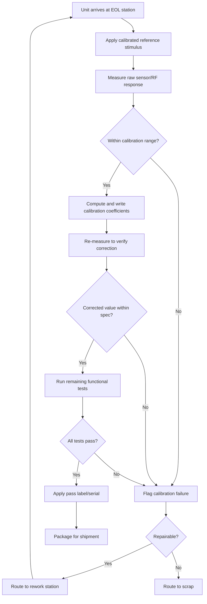

## Calibration and End-of-Line Testing

### Overview

Calibration and end-of-line (EOL) testing are the final quality gates in embedded device manufacturing, occurring after assembly and firmware provisioning but before a unit is packaged for shipment. Calibration corrects for unit-to-unit variation in analog components, sensors, and RF circuits, while EOL testing verifies that the fully assembled product meets its functional specification as a complete system, not just at the board level. Together they determine whether an individual unit is fit to ship, and they generate the data that feeds yield analysis and continuous line improvement.

### Distinguishing Calibration from Testing

**Key Points**
- **Calibration** adjusts or characterizes a unit's behavior against a known reference, storing correction coefficients so the unit's output matches the true physical value within a specified tolerance.
- **Testing** verifies pass/fail against a specification, without necessarily correcting anything; a test can fail without triggering any calibration action.
- The two are frequently interleaved in one station: measure raw value → derive calibration constant → write constant to non-volatile memory → re-measure to confirm the constant was applied correctly (a verification test).
- Not all embedded devices require calibration; a device with no analog sensing or RF transmission (e.g., a purely digital logic board) may need only functional testing.

### Why Component-Level Tolerances Force Calibration

Passive and active components carry manufacturing tolerances (resistor tolerance, capacitor tolerance, ADC reference voltage tolerance, oscillator frequency tolerance, sensor sensitivity variation) that are individually small but compound across a signal chain.

- A temperature sensor's raw ADC reading depends on the sensor's own accuracy, the reference voltage's accuracy, and the ADC's own linearity — each contributing error that, uncorrected, can exceed the product's stated accuracy specification.
- RF transmit power varies unit-to-unit due to power amplifier gain variation and passive component tolerances in the matching network, which is why RF devices are almost universally calibrated at end of line rather than relying on nominal component values.
- Calibration effectively trades a manufacturing cost (test time, reference equipment) for a design cost (using cheaper, looser-tolerance components and correcting for the resulting variation in software).

### Types of Calibration Commonly Performed

#### Analog/Sensor Calibration

- **Offset and gain (two-point) calibration**: Measure the sensor's output at two known reference points (e.g., 0°C and a known elevated temperature, or zero-force and full-scale-force) and derive a linear correction (offset and slope) applied at runtime.
- **Multi-point/curve calibration**: For sensors with non-linear response across their range, more than two reference points are captured and a lookup table or polynomial fit is stored instead of a simple linear correction.
- **Cross-axis/cross-sensitivity calibration**: Relevant for multi-axis sensors (e.g., accelerometers, magnetometers), where a single axis's reading can be influenced by forces on other axes; calibration corrects for this coupling.

#### RF Calibration

- **Transmit power calibration**: Measure actual output power at one or more frequency channels using a calibrated power meter or spectrum analyzer, then write a per-channel power trim table so the radio's commanded power matches its actual emitted power.
- **Frequency/crystal trim**: Some radios allow fine adjustment of the reference oscillator's trim capacitor value to correct for crystal frequency tolerance, improving frequency accuracy for channel selection and reducing symbol-timing error.
- **Receiver sensitivity/gain calibration**: Less common at EOL than transmit calibration, but present in some designs to normalize receive chain gain variation.

#### Timing and Clock Calibration

- Real-time clock (RTC) crystal aging/trim calibration, particularly for devices with long-duration timekeeping requirements where accumulated drift matters.
- Calibration of internal oscillators used for timing-critical peripherals when an external crystal is not used, trading cost for reduced accuracy that calibration partially recovers.

#### Battery and Power Calibration

- **Fuel gauge calibration**: Coulomb-counting or voltage-based fuel gauge ICs often require a calibration step against a known battery capacity/voltage curve to report accurate state-of-charge later in the field.
- **Charge current/voltage trim**: Verifying that charging circuitry delivers current and voltage within specification, particularly important for lithium battery safety margins.

### End-of-Line Functional Test Coverage

**Example**
A representative EOL test sequence for a battery-powered environmental sensor with Wi-Fi connectivity:
1. **Power-on self-test**: Confirm boot completes, firmware version matches golden image, no fault flags set.
2. **Sensor functional check**: Expose the unit to a known reference condition (e.g., a temperature-controlled chamber, known light source, or calibrated pressure source) and confirm the reading falls within tolerance after calibration is applied.
3. **Wireless connectivity test**: Confirm the unit associates with a test access point, verify RSSI is within an expected range (not just "connects," since abnormally low RSSI can indicate an antenna or RF front-end defect).
4. **User interface check**: Verify buttons, LEDs, or displays respond correctly, often via an automated fixture with optical sensors or a vision system rather than a human visually confirming each unit.
5. **Battery/power path check**: Confirm charging behavior and battery voltage reporting accuracy.
6. **Enclosure/mechanical check**: Confirm buttons actuate with correct force feel, seams are within tolerance, and (for sealed products) an ingress protection leak test passes if applicable.
7. **Final pass/fail determination and label/serial application.**

### End-of-Line Test Station Layout

<svg xmlns="http://www.w3.org/2000/svg" viewBox="0 0 760 420">
  \<style\>
    .title { font: bold 16px sans-serif; fill: #1a1a1a; }
    .box-label { font: 12.5px sans-serif; fill: #1a1a1a; }
    .box { fill: #eef3fb; stroke: #2c3e50; stroke-width: 1.5; }
    .ref-box { fill: #eafaf1; stroke: #1e8449; stroke-width: 1.5; }
    .flow-label { font: 11px sans-serif; fill: #444; }
  \</style\>
  <text x="380" y="26" text-anchor="middle" class="title">Calibration and EOL Test Station Layout (svg_diagram)</text>

  <rect x="40" y="80" width="140" height="60" rx="6" class="box" />
  <text x="110" y="105" text-anchor="middle" class="box-label">Incoming DUT</text>
  <text x="110" y="122" text-anchor="middle" class="box-label">(from provisioning)</text>

  <rect x="240" y="80" width="150" height="60" rx="6" class="box" />
  <text x="315" y="105" text-anchor="middle" class="box-label">Test Fixture /</text>
  <text x="315" y="122" text-anchor="middle" class="box-label">Chamber</text>

  <rect x="240" y="200" width="150" height="60" rx="6" class="ref-box" />
  <text x="315" y="225" text-anchor="middle" class="box-label">Calibrated Reference</text>
  <text x="315" y="242" text-anchor="middle" class="box-label">(source/meter)</text>

  <rect x="460" y="80" width="150" height="60" rx="6" class="box" />
  <text x="535" y="105" text-anchor="middle" class="box-label">Test Executive /</text>
  <text x="535" y="122" text-anchor="middle" class="box-label">Data Acquisition</text>

  <rect x="460" y="200" width="150" height="60" rx="6" class="box" />
  <text x="535" y="225" text-anchor="middle" class="box-label">Pass/Fail</text>
  <text x="535" y="242" text-anchor="middle" class="box-label">Decision Logic</text>

  <rect x="640" y="200" width="100" height="60" rx="6" class="box" />
  <text x="690" y="230" text-anchor="middle" class="box-label">MES / Log</text>

  <rect x="240" y="320" width="150" height="60" rx="6" class="box" />
  <text x="315" y="345" text-anchor="middle" class="box-label">Reject / Rework</text>
  <text x="315" y="362" text-anchor="middle" class="box-label">Bin</text>

  <line x1="180" y1="110" x2="240" y2="110" stroke="#2c3e50" stroke-width="1.5" marker-end="url(#a2)" />
  <line x1="315" y1="140" x2="315" y2="200" stroke="#1e8449" stroke-width="1.5" marker-end="url(#a2)" />
  <text x="330" y="175" class="flow-label" fill="#1e8449">Applies known stimulus</text>
  <line x1="390" y1="110" x2="460" y2="110" stroke="#2c3e50" stroke-width="1.5" marker-end="url(#a2)" />
  <line x1="535" y1="140" x2="535" y2="200" stroke="#2c3e50" stroke-width="1.5" marker-end="url(#a2)" />
  <line x1="610" y1="230" x2="640" y2="230" stroke="#2c3e50" stroke-width="1.5" marker-end="url(#a2)" />
  <line x1="460" y1="230" x2="390" y2="350" stroke="#c0392b" stroke-width="1.5" stroke-dasharray="4,3" marker-end="url(#a2)" />
  <text x="400" y="300" class="flow-label" fill="#c0392b">On fail</text>

  </svg>

### Reference Standards and Traceability

- Calibration references used on the line (power meters, temperature chambers, voltage sources) must themselves be periodically calibrated against a traceable standard, typically traceable back to a national metrology institute (e.g., NIST in the US), forming an unbroken calibration chain.
- Reference equipment recalibration intervals are commonly defined by the equipment manufacturer and internal quality procedures; exceeding the interval invalidates confidence in any calibration performed with that equipment during the overdue period.
- Calibration certificates for line reference equipment are typically retained as part of the quality management system (e.g., under an ISO 9001 or industry-specific quality framework) and may be subject to audit.

### Statistical Process Control (SPC) for Calibration Data

**Key Points**
- Recording every unit's raw (pre-calibration) measurement, not just the pass/fail result, allows control charts to detect gradual process drift (e.g., a sensor supplier's lot-to-lot variation increasing) before it causes outright failures.
- Sudden shifts in the mean or spread of raw measurements across a shift or lot often indicate a fixture problem, a reference equipment drift, or an incoming component lot change, rather than a genuine widening of unit-to-unit product variation.
- Cpk (process capability index) is commonly tracked for calibrated parameters to quantify how comfortably the process stays within specification limits, informing whether tightened process control or design margin changes are needed.

### Calibration Data Formula Example

For a simple two-point linear sensor calibration, the corrected reading $y_{corrected}$ is derived from the raw ADC reading $x_{raw}$ using a gain $m$ and offset $b$ computed from two reference points $(x_1, y_1)$ and $(x_2, y_2)$:

$$m = \frac{y_2 - y_1}{x_2 - x_1}$$

$$b = y_1 - m \cdot x_1$$

$$y_{corrected} = m \cdot x_{raw} + b$$

These coefficients ($m$ and $b$) are what get written to the unit's non-volatile memory during calibration, and the runtime firmware applies this correction to every subsequent raw reading.

### Environmental and Stress-Related Testing at EOL

- **Burn-in testing**: Powering units for an extended duration (ranging from minutes to many hours depending on product risk profile) to catch infant-mortality failures before shipment, based on the classic "bathtub curve" failure-rate model. [Inference] — appropriate burn-in duration is highly product- and risk-dependent and is typically determined through reliability engineering analysis rather than a universal fixed value.
- **Thermal cycling spot checks**: A sample (not necessarily every unit) may be cycled through temperature extremes to catch solder joint or component defects sensitive to thermal stress, often used as an ongoing process audit rather than a 100%-of-units test.
- **Vibration/drop spot checks**: Similarly sampled rather than applied to every unit, used to validate that the assembly process continues to meet mechanical robustness requirements over time.

### Handling Failures at End of Line

- **Failure bucketing**: Failures are typically categorized (e.g., calibration-out-of-range, connectivity failure, mechanical defect) so failure-mode trends are visible in aggregate, not just as an overall yield number.
- **Root cause feedback loop**: A rising failure rate in one category should route back to the responsible process step (e.g., rising RF calibration failures might implicate an antenna placement issue introduced in a recent assembly change) rather than being treated purely as a sorting problem.
- **Repair and re-test**: Units that fail often go through a defined repair process (e.g., rework a solder joint, replace a component) and must be re-tested through the full sequence, not just the step that originally failed, since repair actions can introduce new defects.
- **Scrap criteria**: Some failure modes are not economical to repair (e.g., certain enclosure cracks or deep board damage), and clear scrap criteria prevent excessive rework cost chasing marginal units.

### EOL Testing Decision Flow

### Throughput and Cost Considerations

- Calibration and EOL test time per unit directly determines the number of test stations needed to meet a given production rate, making test-time reduction a recurring engineering focus once a product ramps to volume.
- Parallelizing test stations (multiple fixtures running concurrently) is often more practical than trying to speed up a single station's test sequence beyond a certain point, since some steps (e.g., thermal soak time) have physical lower bounds.
- The cost of reference/calibration equipment (e.g., a calibrated RF chamber or precision temperature chamber) is a capital cost that must be amortized across the expected production volume, influencing decisions about how much calibration to perform in-house versus outsource to a contract manufacturer with existing equipment.

### Common Pitfalls

- Applying calibration once at a single temperature/condition when the sensor's error varies non-linearly across the product's full operating range, leaving significant residual error at range extremes.
- Failing to re-verify calibration after writing coefficients, missing cases where the write itself failed or was corrupted.
- Treating EOL testing as purely a pass/fail gate without retaining raw measurement data, losing the ability to perform SPC or root-cause analysis later.
- Using uncalibrated or overdue reference equipment on the line, which invalidates the calibration being performed even if the station reports a pass.
- Setting burn-in duration arbitrarily without reliability data to justify it, either wasting line time or failing to catch genuine infant-mortality defects.

### Related Topics

- Statistical process control and Cpk analysis in manufacturing
- Reliability engineering and the bathtub curve failure model
- RF certification and regulatory compliance testing (FCC/CE/etc.)
- Firmware provisioning at manufacturing
- Manufacturing execution systems (MES) and traceability
- Ingress protection (IP rating) leak testing methods
- Battery fuel gauge design and coulomb counting
- Design for Test (DFT) and bed-of-nails fixture design