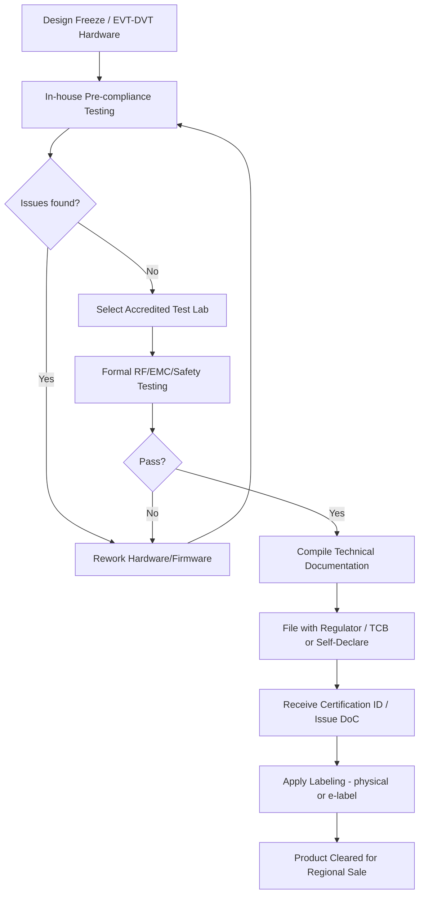

## Certification Processes: FCC, CE, and Regional Equivalents

### Overview

Regulatory certification is the process by which an embedded device is tested and formally approved to demonstrate it meets a target market's legal requirements for radio emissions, electromagnetic compatibility, electrical safety, and (increasingly) other concerns like environmental compliance. No embedded product with a radio, a switching power supply, or a fast digital clock can legally be sold in most markets without passing through some form of this process. Certification is a scheduling-critical, cost-significant, and often underestimated part of the product lifecycle, frequently sitting on the critical path to a product launch.

### Why Certification Exists

**Key Points**
- Every electronic device radiates some unintentional electromagnetic energy and, if it contains a radio, intentional energy; certification exists to ensure this radiated and conducted energy does not interfere with other licensed or unlicensed spectrum users.
- Electrical safety certification exists to reduce risk of shock, fire, or injury from a device's power supply, battery, or user-accessible parts.
- Regulatory bodies generally do not perform testing themselves; they define requirements and accredit test labs (or accept manufacturer self-declaration under specific frameworks) to perform the actual testing.
- Certification requirements and the specific standards invoked change over time, so a design that was compliant at one point may need re-verification against updated standards for a new production run. [Inference] — the frequency and materiality of such standard updates vary by region and technology, and current requirements should always be checked against the regulator's current published standards rather than assumed from prior projects.

### Major Regulatory Frameworks by Region

#### United States — FCC

The Federal Communications Commission regulates RF emissions (intentional and unintentional radiators) under Title 47 of the Code of Federal Regulations (CFR).

- **Part 15**: Governs unlicensed intentional radiators (Wi-Fi, Bluetooth, proprietary sub-GHz radios) and unintentional radiators (digital devices generating clock harmonics as a byproduct of operation).
- **Part 18**: Governs industrial, scientific, and medical (ISM) equipment.
- **Part 22/24/27/etc.**: Govern licensed cellular and other licensed-spectrum radios, relevant for devices with cellular modems.
- Certification routes under FCC rules include **Verification** (lowest-risk unintentional radiators, self-tested and documented, no filing required), **Declaration of Conformity (DoC)** (self-declared but requires testing at an accredited lab), and **Certification** (formal filing with the FCC via a Telecommunication Certification Body, or TCB, required for most intentional radiators).
- Devices requiring FCC Certification receive an FCC ID, which must be displayed on the device (physically or, for very small devices, electronically via an e-label) per current labeling rules.

#### European Union — CE Marking

CE marking indicates conformity with applicable EU directives, not a single test but an umbrella covering multiple directives depending on the product's characteristics.

- **Radio Equipment Directive (RED, 2014/53/EU)**: Applies to any device with a radio transmitter, covering RF spectrum use, EMC, and, notably, includes essential requirements around cybersecurity for certain connected devices under more recent delegated acts. [Unverified] — the specific cybersecurity delegated act requirements and their applicability dates should be confirmed against the current official EU RED documentation, since these provisions have been introduced and refined over time.
- **EMC Directive (2014/30/EU)**: Applies to devices without a radio but that still need electromagnetic compatibility compliance (emissions and immunity).
- **Low Voltage Directive (LVD, 2014/35/EU)**: Applies to electrical safety for equipment operating within defined voltage ranges.
- **RoHS Directive (2011/65/EU)**: Restricts hazardous substances (lead, mercury, cadmium, certain flame retardants, etc.) in electronic equipment; compliance here is a materials/BOM concern as much as a test-lab concern.
- Unlike the FCC's TCB-mediated certification, CE marking for most consumer embedded devices is a **self-declaration** by the manufacturer based on testing (either self-performed or via a notified body, depending on the risk class of the product and chosen conformity assessment route), accompanied by a Declaration of Conformity document and accompanying technical file.

#### Other Major Regional Schemes

- **Canada — ISED (Innovation, Science and Economic Development Canada)**: Broadly parallels FCC requirements for RF devices; many products are tested concurrently for FCC and ISED given similar (though not identical) technical requirements.
- **United Kingdom — UKCA marking**: Post-Brexit UK-specific marking that parallels CE marking's structure but is a distinct legal requirement from the EU's CE marking. [Unverified] — the UK's transition timeline and any continued acceptance of CE marking alongside UKCA has been subject to policy changes and should be checked against current UK government guidance.
- **China — SRRC, CCC**: The State Radio Regulation of China (SRRC) certifies radio-emitting devices for the Chinese market; China Compulsory Certification (CCC) covers a broader set of product safety requirements for many electronic goods sold in China.
- **Japan — MIC/Technical Conformity (Giteki)**: Japan's Ministry of Internal Affairs and Communications requires technical conformity certification (commonly referred to as Giteki marking) for radio equipment.
- **Australia/New Zealand — RCM (Regulatory Compliance Mark)**: A single mark covering both EMC/telecommunications and electrical safety requirements for the ANZ market.
- **South Korea — KC marking**: Covers safety and EMC requirements, with radio equipment typically requiring separate registration through Korea's radio research agency.

Because each region maintains its own frequency allocation table, permitted unlicensed bands, power limits, and duty cycle rules can differ meaningfully even for the same underlying wireless technology (e.g., sub-GHz ISM bands are not globally harmonized), which is why a single hardware SKU intended for global sale often needs region-specific RF configuration, not just a paperwork exercise.

### Certification Category Breakdown

<svg xmlns="http://www.w3.org/2000/svg" viewBox="0 0 760 440">
  \<style\>
    .title { font: bold 16px sans-serif; fill: #1a1a1a; }
    .cat-title { font: bold 13px sans-serif; fill: #1a1a1a; }
    .item { font: 12px sans-serif; fill: #333; }
    .cat-box { fill: #eef3fb; stroke: #2c3e50; stroke-width: 1.5; }
  \</style\>
  <text x="380" y="26" text-anchor="middle" class="title">Certification Categories for a Connected Embedded Device (svg_diagram)</text>

  <rect x="30" y="60" width="220" height="150" rx="8" class="cat-box" />
  <text x="140" y="85" text-anchor="middle" class="cat-title">RF / Spectrum</text>
  <text x="45" y="110" class="item">- Intentional radiator emissions</text>
  <text x="45" y="130" class="item">- Power limits per band</text>
  <text x="45" y="150" class="item">- Duty cycle rules (region-specific)</text>
  <text x="45" y="170" class="item">- Antenna requirements</text>
  <text x="45" y="190" class="item">- SAR (if body-worn/handheld)</text>

  <rect x="270" y="60" width="220" height="150" rx="8" class="cat-box" />
  <text x="380" y="85" text-anchor="middle" class="cat-title">EMC</text>
  <text x="285" y="110" class="item">- Radiated emissions</text>
  <text x="285" y="130" class="item">- Conducted emissions</text>
  <text x="285" y="150" class="item">- Immunity (ESD, surge, RF)</text>
  <text x="285" y="170" class="item">- Harmonics/flicker (mains-powered)</text>

  <rect x="510" y="60" width="220" height="150" rx="8" class="cat-box" />
  <text x="620" y="85" text-anchor="middle" class="cat-title">Electrical Safety</text>
  <text x="525" y="110" class="item">- Insulation/creepage/clearance</text>
  <text x="525" y="130" class="item">- Battery safety (e.g., UL 2054)</text>
  <text x="525" y="150" class="item">- Thermal/fire risk</text>
  <text x="525" y="170" class="item">- Enclosure/mechanical safety</text>

  <rect x="30" y="240" width="220" height="130" rx="8" class="cat-box" />
  <text x="140" y="265" text-anchor="middle" class="cat-title">Materials/Environmental</text>
  <text x="45" y="290" class="item">- RoHS (restricted substances)</text>
  <text x="45" y="310" class="item">- REACH (chemical substances)</text>
  <text x="45" y="330" class="item">- WEEE (end-of-life handling)</text>

  <rect x="270" y="240" width="220" height="130" rx="8" class="cat-box" />
  <text x="380" y="265" text-anchor="middle" class="cat-title">Cybersecurity (emerging)</text>
  <text x="285" y="290" class="item">- Baseline security requirements</text>
  <text x="285" y="310" class="item">- Applicable under some RED</text>
  <text x="285" y="330" class="item">  delegated acts / regional rules</text>

  <rect x="510" y="240" width="220" height="130" rx="8" class="cat-box" />
  <text x="620" y="265" text-anchor="middle" class="cat-title">Labeling/Documentation</text>
  <text x="525" y="290" class="item">- FCC ID / e-label</text>
  <text x="525" y="310" class="item">- Declaration of Conformity</text>
  <text x="525" y="330" class="item">- Technical file/user manual</text>
</svg>

### The Pre-Compliance to Certification Workflow

Most well-run embedded programs perform informal pre-compliance testing well before the formal, accredited-lab certification run, since fixing an EMC or RF issue discovered at pre-compliance is far cheaper than discovering it during a paid formal test slot.

### Pre-Compliance Testing

- **In-house or informal-lab EMC scans**: Using a spectrum analyzer and near-field probes (or a semi-anechoic chamber if available) to identify emissions peaks before committing to a paid formal test session.
- **RF power and spectral mask checks**: Verifying transmit power and out-of-band emissions against the target region's limits using lab equipment, prior to formal certification.
- **ESD and basic immunity checks**: Using an ESD gun to test connector and enclosure robustness against the levels specified in the target immunity standard, catching gross design issues early.

Pre-compliance testing does not replace formal certification (results from non-accredited equipment/labs are not accepted for regulatory filing) but substantially de-risks the formal test slot's outcome and timeline.

### Documentation Required for Certification Filing

**Example**
A typical technical file/certification package includes:
1. Schematic and PCB layout (sometimes required to be submitted confidentially to the test lab/regulator).
2. Block diagram of the RF chain, including antenna specifications and gain.
3. Firmware/software description relevant to RF operation (e.g., channel selection logic, power control algorithm).
4. Photographs of internal and external construction.
5. User manual, including required regulatory statements (e.g., FCC Part 15 disclosure language).
6. Test reports from the accredited lab covering each applicable standard.
7. Label artwork and, where applicable, e-label screen mockups.
8. Declaration of Conformity (for self-declared regimes like most CE pathways).

### Modular Certification and Pre-Certified Radio Modules

- Many embedded designs use a pre-certified radio module (e.g., a Wi-Fi/BLE combo module already carrying its own FCC/CE certification) rather than a custom RF design, which can significantly reduce the scope of the host device's own RF certification.
- **Modular approval conditions** typically require the host design to meet specific integration rules set by the module's certification (e.g., minimum antenna-to-enclosure clearance, no modification of the module's RF shielding, specific host processor limitations) — violating these conditions can invalidate the module's certification for the end product.
- Even with a certified module, the host product usually still requires its own EMC and safety certification, since those are evaluated at the full-product level, not the module level.
- Using an uncertified custom RF front-end instead of a module shifts significantly more certification cost, schedule risk, and technical complexity onto the product team, but may be justified by cost-at-volume or form-factor constraints. [Inference] — the actual cost/schedule trade-off depends heavily on production volume, target markets, and internal RF expertise.

### Timeline and Cost Considerations

**Key Points**
- Formal certification lab testing typically takes on the order of days to a few weeks per region depending on lab scheduling and the number of standards invoked, and should be budgeted as a fixed milestone in the program schedule rather than an afterthought. [Inference] — exact durations vary significantly by lab, region, product complexity, and whether retesting is needed after a failure.
- Retesting after a failed test (requiring hardware or firmware rework) is one of the most common sources of schedule slip in hardware programs, reinforcing the value of pre-compliance testing.
- Certification costs scale with the number of target regions and the number of standards invoked (e.g., adding cellular connectivity typically adds substantial cost and lead time versus a Wi-Fi/BLE-only design, due to carrier-specific certification requirements layered on top of regulatory RF certification). [Inference] — specific cost figures vary too widely across labs, regions, and product categories to state a general number reliably.
- Annual or periodic lab accreditation renewal, and potential regulatory standard revisions, mean a product certified once may need re-evaluation if manufactured for many years without a hardware change, depending on the region's specific rules about standard version validity.

### Carrier Certification for Cellular Devices

Devices with a cellular modem intended for a specific carrier's network often require an additional, separate certification layer beyond regulatory RF certification.

- **PTCRB** (for GSM/LTE technologies, primarily used by North American carriers) and **GCF (Global Certification Forum)** are industry certification bodies whose approval is frequently a prerequisite for a specific carrier to accept a device onto its network.
- Individual carriers may layer their own additional certification requirements (carrier-specific IOT — interoperability testing — beyond PTCRB/GCF baseline), particularly for devices intended for direct sale through that carrier's channel.
- This carrier layer is distinct from, and in addition to, the underlying FCC/CE-type regulatory certification the device also requires.

### Change Management and Re-Certification Triggers

Certain post-certification changes can require re-testing or re-filing, depending on the region's specific rules regarding permissive changes:

- **Class I/II/III change classifications (FCC context)**: Minor changes may be permitted without new filing (Class I), moderate changes may require notification (Class II), and major changes (e.g., antenna change, power increase, frequency band change) typically require a new certification application (Class III). [Unverified] — the exact boundaries of these classes and current FCC guidance should be verified against current FCC rules, since permissive-change policy has been updated over time.
- Firmware changes that alter RF behavior (transmit power, channel selection, duty cycle) can trigger re-certification obligations even without any hardware change, which is a frequently underestimated risk in products that receive OTA firmware updates after certification.
- Enclosure or antenna placement changes, even seemingly cosmetic ones, can shift RF performance and EMC behavior enough to require re-testing.

### Common Pitfalls

- Treating certification as a final-stage formality rather than budgeting pre-compliance testing and schedule buffer early in the program, leading to late-stage schedule slip when a formal test fails.
- Assuming a certified radio module fully certifies the end product, without meeting the module's specific host integration conditions (antenna clearance, shielding, host limitations).
- Shipping an OTA firmware update that changes RF transmit behavior without evaluating whether it triggers a re-certification obligation in one or more target regions.
- Underestimating that RF band plans and power limits are not globally harmonized, requiring region-specific hardware/firmware configuration rather than a single global RF configuration.
- Neglecting carrier-level certification (PTCRB/GCF/carrier IOT) for cellular-equipped devices, assuming regulatory RF certification alone is sufficient for carrier network acceptance.

### Related Topics

- Pre-compliance EMC and RF test methodology
- Antenna design and placement constraints for certified radio modules
- RoHS/REACH materials compliance and BOM management
- Firmware provisioning at manufacturing
- Calibration and end-of-line testing
- OTA firmware update infrastructure and its regulatory implications
- Battery safety certification (e.g., UL 2054, IEC 62133)
- Product labeling requirements and e-label implementation