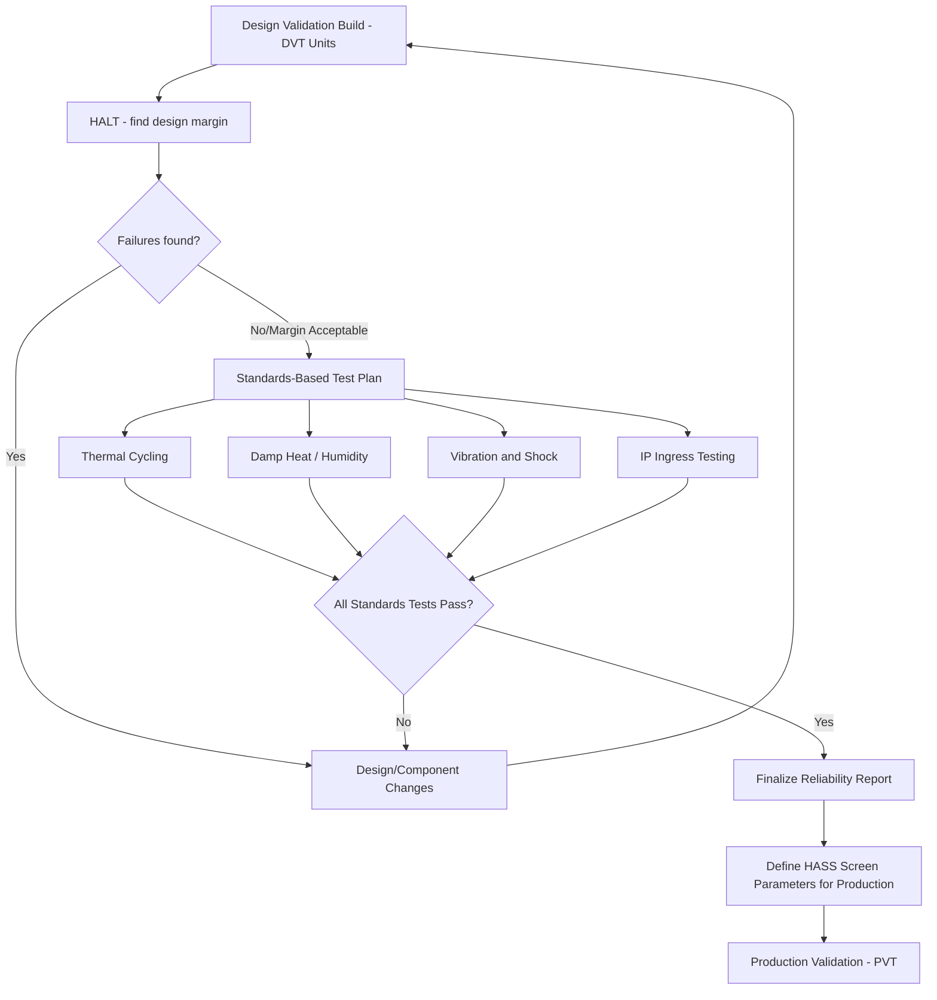

## Environmental and Reliability Testing

### Overview

Environmental and reliability testing subjects embedded devices to controlled stresses — temperature, humidity, vibration, mechanical shock, ingress of dust and water, and accelerated aging — to verify the product will survive its intended operating conditions and service life. Unlike end-of-line testing, which checks that each manufactured unit meets specification at the moment of production, environmental and reliability testing is typically performed on a sample of units during design validation to predict how the population of units will behave over months or years in the field. These tests are destructive or degrading by nature in many cases, so they are sampling exercises rather than 100%-of-units screens.

### Distinguishing Reliability Testing from End-of-Line Testing

**Key Points**
- End-of-line testing asks "does this specific unit work right now"; reliability testing asks "will units like this one still work after a year of vibration, heat cycling, or humidity exposure."
- Reliability tests are usually performed on a statistically justified sample size during EVT/DVT/PVT, not on every production unit, because many of these tests are destructive or take far too long to apply at line-rate.
- Reliability testing informs design margin decisions (component derating, enclosure sealing, mechanical mounting) before tooling is finalized, whereas EOL testing enforces the specification that reliability testing helped establish.
- A product can pass 100% of EOL tests and still fail in the field if reliability testing was skipped or under-scoped, since EOL tests do not simulate long-term environmental stress.

### Standards Bodies and Common Test Standards

Environmental and reliability testing draws on a body of internationally recognized standards rather than ad hoc test methods, which allows results to be compared across suppliers and industries.

- **IEC 60068 series**: A broad family covering environmental testing methods (cold, dry heat, damp heat, vibration, shock, and more), widely referenced across consumer and industrial electronics.
- **MIL-STD-810**: A US military standard covering environmental engineering considerations, frequently adopted by non-military embedded products (industrial, rugged consumer devices) as a recognized benchmark for ruggedness claims.
- **JEDEC standards (e.g., JESD22 series)**: Widely used for semiconductor-level reliability testing (temperature cycling, moisture sensitivity, ESD) rather than full-product testing.
- **IEC 60529**: Defines the Ingress Protection (IP) rating system for dust and water resistance.
- **ISO 16750**: Common in automotive-adjacent embedded electronics for environmental conditions specific to vehicle applications.

### Thermal Testing

#### Temperature Cycling

Thermal cycling repeatedly transitions a unit between a low and high temperature extreme to induce and reveal fatigue-related failures, particularly at solder joints where different materials (PCB substrate, component packages, solder) expand and contract at different rates.

- Cycle count, dwell time at each extreme, and ramp rate are defined per the applicable standard or a product-specific test plan; more cycles or a wider temperature delta generally accelerates fatigue failure discovery. [Inference] — the specific relationship between cycle parameters and field-life prediction depends on the acceleration model used and is a specialized reliability engineering discipline.
- Solder joint cracking from thermal cycling is one of the most common root causes discovered during this test, particularly on large or thermally-mismatched components (large QFN/BGA packages, connectors with metal shells).

#### Thermal Shock

Distinct from gradual cycling, thermal shock moves a unit between two temperature extremes almost instantaneously (typically via a dual-chamber system that physically transfers the unit rather than ramping a single chamber), producing more severe thermally-induced stress than cycling within a single chamber.

#### High/Low Temperature Operating and Storage Tests

- **Operating limits**: Confirms the device functions correctly at its specified minimum and maximum operating temperatures, not just survives them.
- **Storage/non-operating limits**: Confirms the device survives (without permanent damage) temperature extremes it might experience in transport or storage, even if it is not required to operate at those extremes.
- **Derating verification**: Confirms that components are operated within their derated limits (typically below the datasheet absolute maximum, per an internal derating guideline) across the full specified temperature range, not just at room temperature.

### Humidity and Moisture Testing

- **Damp heat (steady-state)**: Exposes the unit to elevated temperature and high relative humidity for an extended duration to reveal corrosion, electrochemical migration, or moisture ingress issues.
- **Damp heat (cyclic)**: Combines humidity exposure with temperature cycling, which can be more revealing than steady-state humidity alone since condensation forming and evaporating during cycles stresses seals and coatings differently than constant humidity.
- **Highly Accelerated Stress Test / Highly Accelerated Life Test (HAST/HALT)**: Uses elevated pressure alongside temperature and humidity to accelerate moisture-related failure mechanisms in a shorter test duration; primarily used at the component/package level in semiconductor reliability but sometimes applied at higher assembly levels. [Inference] — applicability to full-product testing versus component-level testing depends on the specific failure mechanism being investigated.

### Ingress Protection (IP) Rating Testing

The IP rating system (IEC 60529) uses a two-digit code describing protection against solid particle ingress (first digit) and liquid ingress (second digit).

**Example**
Common IP rating interpretations relevant to embedded consumer/industrial devices:
- **IP54**: Protected against dust ingress sufficient to not interfere with operation, and protected against water splashed from any direction.
- **IP65**: Fully dust-tight, protected against low-pressure water jets from any direction.
- **IP67**: Fully dust-tight, protected against temporary immersion in water (commonly up to 1 meter for up to 30 minutes, exact parameters per the standard's test method).
- **IP68**: Fully dust-tight, protected against continuous immersion under conditions agreed upon between manufacturer and user (deeper/longer than IP67, and notably not a single universally fixed depth/duration — manufacturers specify the actual tested condition).

IP testing is typically performed by an accredited lab using standardized test rigs (dust chambers, water jet nozzles, immersion tanks) rather than informal methods, since the rating is a specific, verifiable claim often referenced in marketing and warranty terms.

### Mechanical Testing: Vibration and Shock

#### Vibration Testing

- **Sinusoidal (swept-sine) vibration**: Sweeps through a frequency range at controlled amplitude to identify resonant frequencies where the product structure or PCB may amplify vibration to damaging levels.
- **Random vibration**: Applies a broadband random vibration profile (defined by a power spectral density curve) intended to more realistically simulate real-world transport or operational vibration than a pure sine sweep.
- Resonance identified during vibration testing often drives design changes such as additional PCB mounting points, stiffening ribs in the enclosure, or component-level staking/underfill for large or heavy components prone to solder joint fatigue under vibration.

#### Mechanical Shock Testing

- **Drop testing**: Drops the unit from a specified height onto a specified surface (commonly concrete or a defined hard surface) in multiple orientations (face, edge, corner) to simulate accidental drops during handling or use.
- **Shock pulse testing**: Uses a shock table to apply a defined acceleration pulse (e.g., a half-sine pulse of specified peak g-force and duration) for more controlled and repeatable shock characterization than a free-fall drop test.
- Both are commonly sampled tests (a subset of units) rather than 100% screens, given their potentially destructive nature.

### Reliability Test Coverage Diagram

<svg xmlns="http://www.w3.org/2000/svg" viewBox="0 0 760 440">
  \<style\>
    .title { font: bold 16px sans-serif; fill: #1a1a1a; }
    .cat-title { font: bold 13px sans-serif; fill: #1a1a1a; }
    .item { font: 12px sans-serif; fill: #333; }
    .cat-box { fill: #eef3fb; stroke: #2c3e50; stroke-width: 1.5; }
  \</style\>
  <text x="380" y="26" text-anchor="middle" class="title">Environmental and Reliability Test Categories (svg_diagram)</text>

  <rect x="30" y="60" width="220" height="150" rx="8" class="cat-box" />
  <text x="140" y="85" text-anchor="middle" class="cat-title">Thermal</text>
  <text x="45" y="110" class="item">- Temperature cycling</text>
  <text x="45" y="130" class="item">- Thermal shock</text>
  <text x="45" y="150" class="item">- High/low temp operating</text>
  <text x="45" y="170" class="item">- High/low temp storage</text>
  <text x="45" y="190" class="item">- Component derating checks</text>

  <rect x="270" y="60" width="220" height="150" rx="8" class="cat-box" />
  <text x="380" y="85" text-anchor="middle" class="cat-title">Moisture</text>
  <text x="285" y="110" class="item">- Steady-state damp heat</text>
  <text x="285" y="130" class="item">- Cyclic damp heat</text>
  <text x="285" y="150" class="item">- HAST/HALT (component-level)</text>
  <text x="285" y="170" class="item">- IP ingress rating tests</text>

  <rect x="510" y="60" width="220" height="150" rx="8" class="cat-box" />
  <text x="620" y="85" text-anchor="middle" class="cat-title">Mechanical</text>
  <text x="525" y="110" class="item">- Swept-sine vibration</text>
  <text x="525" y="130" class="item">- Random vibration</text>
  <text x="525" y="150" class="item">- Drop testing</text>
  <text x="525" y="170" class="item">- Shock pulse testing</text>
  <text x="525" y="190" class="item">- Fatigue/flex testing</text>

  <rect x="150" y="240" width="220" height="130" rx="8" class="cat-box" />
  <text x="260" y="265" text-anchor="middle" class="cat-title">Chemical/Corrosion</text>
  <text x="165" y="290" class="item">- Salt fog/spray</text>
  <text x="165" y="310" class="item">- Mixed flowing gas</text>
  <text x="165" y="330" class="item">- UV/material aging</text>

  <rect x="390" y="240" width="220" height="130" rx="8" class="cat-box" />
  <text x="500" y="265" text-anchor="middle" class="cat-title">Accelerated Life</text>
  <text x="405" y="290" class="item">- HALT (design margin discovery)</text>
  <text x="405" y="310" class="item">- HASS (production screening)</text>
  <text x="405" y="330" class="item">- Burn-in / infant mortality</text>
</svg>

### Corrosion and Chemical Exposure Testing

- **Salt fog/salt spray testing**: Exposes the unit to a saline mist environment to accelerate corrosion of exposed metal (connectors, fasteners, shielding), relevant for products intended for coastal, marine, or road-salt-exposed environments.
- **Mixed flowing gas testing**: Exposes units to a mixture of corrosive gases (commonly including sulfur- and chlorine-based compounds) to simulate industrial or harsh atmospheric environments, particularly relevant for connectors and exposed contacts.
- **UV and material aging testing**: Exposes enclosure materials (plastics, seals, coatings) to UV and thermal cycling to predict discoloration, embrittlement, or seal degradation for outdoor-rated products.

### HALT and HASS: Accelerated Reliability Methodologies

- **Highly Accelerated Life Testing (HALT)**: Applied during design validation, HALT deliberately pushes a product beyond its specified operating limits (extreme temperature, extreme vibration, rapid thermal transitions, often combined) to find the actual design margin and failure modes, not to predict a specific field-failure rate. The goal is discovering weak points quickly, not simulating a "typical" environment.
- **Highly Accelerated Stress Screening (HASS)**: A derivative applied during production (on a sample basis) using stress levels informed by HALT results, intended to precipitate latent manufacturing defects without damaging good units, functioning as an ongoing production quality screen rather than a one-time design validation exercise.
- HALT is explicitly not a pass/fail test against a customer specification; it's a margin-discovery exercise, which distinguishes it philosophically from standards-based tests like IEC 60068 series testing. [Inference] — practices around HALT scope and interpretation vary across organizations and reliability engineering teams.

### Reliability Prediction and Statistical Concepts

**Key Points**
- **Mean Time Between Failures (MTBF)** and **Mean Time To Failure (MTTF)** are commonly cited reliability metrics, though they describe average behavior across a population and do not predict any individual unit's actual failure time.
- The **bathtub curve** describes a common failure-rate pattern over a product's life: a higher infant-mortality failure rate early on, a lower relatively constant failure rate during useful life, and a rising failure rate during wear-out, though not every failure mechanism follows this exact shape. [Inference] — the applicability of the classic bathtub curve shape varies by failure mechanism and product type, and some modern reliability engineering treats it as a simplified heuristic rather than a universal law.
- **Weibull analysis** is commonly used to model time-to-failure data from accelerated life tests and extrapolate an expected field failure rate under normal use conditions, using an acceleration factor derived from the relationship between test stress levels and use-condition stress levels.
- Reliability predictions from accelerated testing carry statistical uncertainty that widens with smaller sample sizes, so a stated MTBF or failure rate should always be considered alongside its confidence interval and the model assumptions used to derive it.

### Test Sequencing and Combined Environmental Stress

### Sample Size and Test Planning Considerations

- Sample sizes for reliability tests are typically chosen based on the statistical confidence level and reliability target required, balanced against the cost of building and destroying additional prototype units, often guided by standard sampling plans (e.g., those referenced in quality standards) rather than arbitrary small numbers.
- Testing too few units risks missing a real failure mode due to sampling variance; testing exhaustively is often cost-prohibitive at the prototype stage, making sample size selection a deliberate risk-cost trade-off rather than a fixed universal number.
- Combining multiple stresses (e.g., vibration during thermal cycling) can reveal interaction failure modes that sequential single-stress testing misses, though combined testing requires more specialized chamber equipment and is not always practical for every program. [Inference] — the value versus cost of combined-stress testing depends on the specific product's likely field environment and failure risk profile.

### Common Pitfalls

- Relying solely on component datasheet ratings without derating margin, then discovering during thermal testing that a component operates near its absolute maximum rating under realistic worst-case conditions.
- Treating IP rating claims as permanent regardless of the enclosure's seal/gasket aging, when repeated thermal cycling or UV exposure can degrade gaskets over the product's service life, quietly reducing real-world ingress protection below the originally tested rating. [Inference] — the rate and extent of seal degradation depends heavily on the specific gasket material, environment, and duty cycle.
- Running HALT and interpreting a found failure mode as a customer-relevant defect without considering that HALT deliberately exceeds specified operating limits by design.
- Skipping vibration/shock testing for a product perceived as "stationary," overlooking transport and shipping vibration exposure that occurs before the product ever reaches its stationary end use.
- Using a single accelerated test result to make strong field-life claims without accounting for the statistical confidence interval and acceleration model assumptions behind the extrapolation.

### Related Topics

- Certification processes (FCC, CE, and regional equivalents)
- Design for manufacturing and assembly
- Calibration and end-of-line testing
- Weibull analysis and accelerated life test modeling
- Enclosure sealing and gasket material selection
- Solder joint fatigue mechanisms and thermal cycling failure analysis
- HALT/HASS program design for embedded hardware
- Component derating guidelines and worst-case design analysis