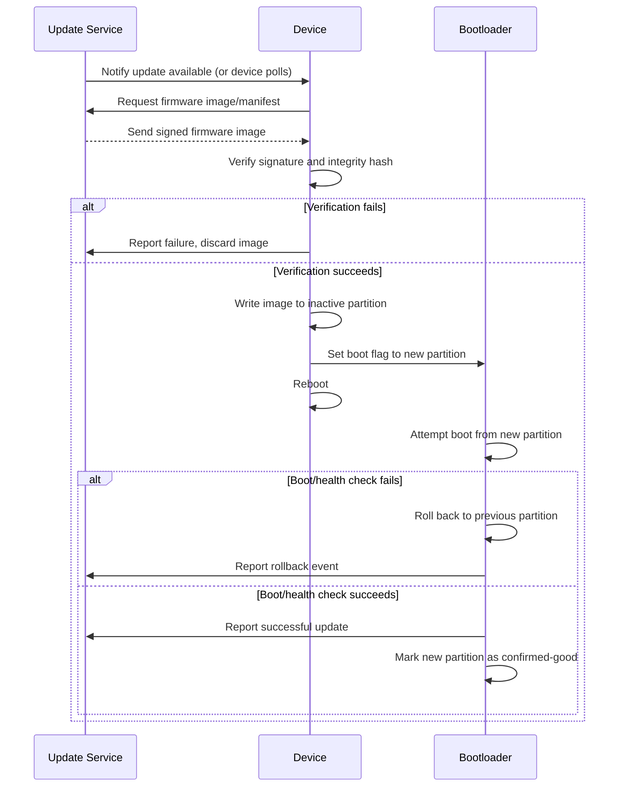
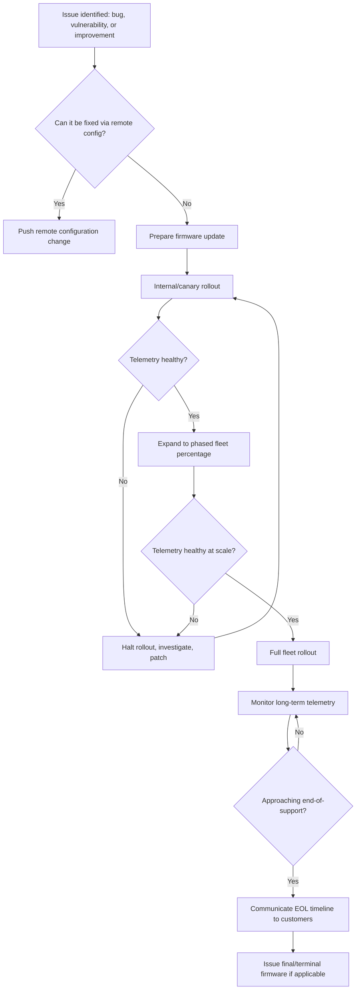

## Field Update and Maintenance Strategy

### Overview

Field update and maintenance strategy covers how an embedded device is kept functional, secure, and improved after it has left the factory and is deployed in the field. This spans firmware update mechanisms, versioning and rollback policy, remote diagnostics, hardware serviceability, and end-of-life/decommissioning planning. Unlike manufacturing-stage concerns, field maintenance decisions are constrained by devices already being deployed, often in large numbers, in locations that may be physically inaccessible, unattended, or owned by end customers who cannot be relied upon to perform manual intervention.

### Why Field Maintenance Planning Matters

**Key Points**
- A device shipped without a robust update path is effectively frozen at whatever firmware version it left the factory with, which becomes a growing liability as security vulnerabilities are discovered over the product's service life.
- Field maintenance strategy must be designed into the product from early development, not retrofitted after deployment, because update mechanisms (bootloader partitioning, secure boot chains, connectivity for OTA) are architectural decisions.
- The cost of a failed field update (a bricked device requiring physical recovery or replacement) scales with fleet size, making update robustness disproportionately important for high-volume deployments.
- Regulatory and contractual pressure increasingly requires vendors to support security updates for a defined minimum period, making maintenance strategy a compliance concern in some markets, not merely an engineering nicety. [Inference] — specific mandated support durations vary by jurisdiction, product category, and evolving regulation, and should be checked against current applicable law rather than assumed.

### Update Delivery Mechanisms

#### Over-the-Air (OTA) Updates

The dominant mechanism for connected embedded devices, delivering firmware images over Wi-Fi, cellular, or a low-power wireless protocol.

- **Direct-to-cloud OTA**: The device connects directly to a cloud update service (vendor-run or a platform like AWS IoT Device Management, Azure Device Update, or similar) and downloads the new image itself.
- **Gateway-mediated OTA**: For resource-constrained or non-IP devices (e.g., BLE or Zigbee end nodes), a local gateway or hub downloads the update from the cloud and relays it to the end device over the local wireless link, often in smaller chunks appropriate to the constrained link's throughput and reliability.
- **Delta/differential updates**: Transmitting only the binary difference between the currently running firmware and the new version rather than the full image, reducing bandwidth and update time — particularly valuable for cellular-connected or bandwidth-constrained devices where full-image transfer would be slow or costly.

#### Wired/Local Updates

- **USB or serial-based updates**: Common for devices that are not persistently connected, or as a fallback recovery mechanism when OTA is unavailable or has failed.
- **Local network updates**: Updates pushed over a local network (e.g., during a technician site visit) without requiring internet connectivity, relevant for industrial or air-gapped deployments.
- **Physical media updates**: Rare in modern designs but still used in some industrial or legacy contexts (e.g., an SD card inserted by a technician).

### Update Architecture Patterns

#### A/B (Dual-Bank) Partitioning

The device maintains two complete firmware partitions (banks A and B). An update is written entirely to the inactive bank while the active bank continues running, and only after the new image is verified does the bootloader switch to booting from the updated bank.

- This pattern allows the device to remain fully operational during the download/write phase, since the currently running firmware is untouched until the switch.
- If the new firmware fails to boot or fails a post-update health check, the bootloader can roll back to the previous known-good bank, providing a robust recovery path without requiring physical access.
- The primary cost is doubled flash/storage requirement for firmware, which may be a meaningful constraint on cost-sensitive, storage-limited microcontrollers.

#### Single-Bank Updates with Recovery Bootloader

On more storage-constrained devices, a single application partition is updated in place, but a separate, smaller, rarely-changed recovery bootloader remains untouched and can restore a known-good image (often from a fallback location or by re-downloading) if the primary update fails.

- This trades some of A/B's seamlessness (the device may be non-functional during the update write) for reduced flash requirements.
- The recovery bootloader itself must be extremely reliable and rarely modified, since it is the last line of defense against a bricked device.

#### Staged/Phased Rollout

**Key Points**
- Rolling out an update to 100% of a fleet simultaneously risks a fleet-wide outage if the update contains an undiscovered defect; staged rollout mitigates this by exposing the update to a small percentage of devices first.
- A typical staged approach releases to an internal/canary group, then a small percentage of the production fleet, monitoring telemetry (crash rates, connectivity success, reported errors) before expanding to the full fleet.
- Rollback or halt criteria (e.g., an automatic pause if failure telemetry exceeds a threshold) should be defined before rollout begins, not improvised after problems are observed.
- Geographic, hardware-revision, or firmware-version segmentation of the rollout allows a defect specific to one hardware batch or region to be caught before affecting the whole fleet.

### OTA Update Sequence

### Security Considerations for Field Updates

- **Signed firmware images**: Every update image should be cryptographically signed by the vendor, with the device verifying the signature against a trusted public key (often stored in secure/protected memory) before accepting the image, preventing installation of unauthorized or tampered firmware.
- **Encrypted transport and/or encrypted images**: Transport encryption (TLS/DTLS) protects the update in transit; some architectures additionally encrypt the firmware image itself so it cannot be extracted and reverse-engineered even if intercepted.
- **Anti-rollback protection**: Prevents an attacker from forcing a device back to an older, known-vulnerable firmware version, typically enforced via a monotonic version counter checked by the bootloader, though this must be balanced carefully against legitimate rollback needs during a bad-update recovery.
- **Update authentication tied to device identity**: Ensuring the update request/delivery is scoped to the correct device (avoiding a scenario where firmware intended for one hardware variant or region is accepted by an incompatible device) reduces the risk of both accidental and malicious misdelivery.

### Update Package Structure

<svg xmlns="http://www.w3.org/2000/svg" viewBox="0 0 760 380">
  \<style\>
    .title { font: bold 16px sans-serif; fill: #1a1a1a; }
    .box-label { font: 12.5px sans-serif; fill: #1a1a1a; }
    .box { fill: #eef3fb; stroke: #2c3e50; stroke-width: 1.5; }
    .sec-box { fill: #fdf3e3; stroke: #c0392b; stroke-width: 1.5; }
  \</style\>
  <text x="380" y="26" text-anchor="middle" class="title">Typical Signed Firmware Update Package (svg_diagram)</text>

  <rect x="180" y="60" width="400" height="280" rx="8" fill="none" stroke="#333" stroke-width="1.5" stroke-dasharray="5,3" />
  <text x="380" y="50" text-anchor="middle" class="box-label">Update Package</text>

  <rect x="210" y="90" width="340" height="50" rx="6" class="box" />
  <text x="380" y="120" text-anchor="middle" class="box-label">Manifest (version, target HW ID, size)</text>

  <rect x="210" y="155" width="340" height="50" rx="6" class="box" />
  <text x="380" y="185" text-anchor="middle" class="box-label">Firmware Binary (full or delta)</text>

  <rect x="210" y="220" width="340" height="50" rx="6" class="sec-box" />
  <text x="380" y="250" text-anchor="middle" class="box-label">Integrity Hash (SHA-256 or similar)</text>

  <rect x="210" y="285" width="340" height="50" rx="6" class="sec-box" />
  <text x="380" y="315" text-anchor="middle" class="box-label">Digital Signature (vendor private key)</text>
</svg>

### Version Compatibility and Migration Handling

- **Persistent data/configuration migration**: When a new firmware version changes a stored data structure's format (settings, calibration data, logs), the update process must include migration logic to convert existing data rather than assuming a fresh, empty state.
- **Backward and forward compatibility windows**: In fleets with staged rollout, multiple firmware versions coexist simultaneously across the fleet for a period, so cloud-side APIs and protocols the device communicates with must remain compatible with the range of versions still in the field, not just the newest one.
- **Deprecation policy**: A defined policy for how long an older firmware version (and the server-side APIs it depends on) will continue to be supported helps set expectations and avoids stranding devices that fail to update for any reason.

### Remote Diagnostics and Monitoring

**Key Points**
- Telemetry reporting (uptime, error codes, connectivity quality, resource utilization) gives visibility into fleet health without requiring physical access to any individual unit.
- Remote log retrieval (on-demand or periodic upload of device logs) supports root-causing field issues that cannot be reproduced in a lab environment.
- Remote configuration changes (adjusting behavior via a server-side flag rather than a firmware update) allow faster response to some field issues than a full update cycle would permit.
- Health-check reporting after an update (confirming the device came back online and passed basic self-tests) is what enables automated rollback decisions and staged rollout monitoring described above.

### Hardware Serviceability and Physical Maintenance

Not all field maintenance is firmware-based; some products are designed for physical service actions.

- **Field-replaceable units (FRUs)**: Designing specific components (batteries, sensors, connectors) to be replaceable by a technician without full product replacement, which requires accessible fasteners, connectors, and often a service manual/procedure.
- **Diagnostic LEDs/interfaces for field technicians**: Simple status indicators or a diagnostic port that a technician can use on-site without needing to connect the device to a full development toolchain.
- **Spare parts and repair logistics**: A serviceable product design implies a supporting logistics function (spare parts inventory, repair center or trained field technicians), which should be planned alongside the hardware design decision to make something field-replaceable at all.

### End-of-Life and Decommissioning Planning

- **Support lifetime communication**: Clearly communicating to customers how long firmware updates (particularly security updates) will be provided, avoiding ambiguity about when a device transitions from supported to legacy status.
- **Secure decommissioning**: Providing a mechanism to securely erase credentials, keys, and user data when a device is retired, sold, or returned, preventing data exposure after the device leaves its original owner's control.
- **Final/terminal firmware considerations**: Some vendors issue a final firmware update at end-of-support that disables update-checking network calls or hardens the device's last-known configuration, rather than leaving an increasingly outdated device silently polling a service that may eventually be decommissioned.
- **Certificate/service expiration planning**: If devices rely on a cloud service, an embedded certificate, or a subscription-based connectivity plan (e.g., embedded SIM data plans) with a defined expiration, decommissioning planning should account for what happens to device functionality once that dependency lapses.

### Field Maintenance Decision Flow

### Common Pitfalls

- Shipping a product with no rollback mechanism, so a single bad OTA update can brick a large portion of the fleet with no remote recovery path.
- Failing to plan for persistent data migration across firmware versions, causing settings or calibration data corruption after an update.
- Rolling out updates to the entire fleet simultaneously without a canary/staged approach, turning a small defect into a fleet-wide incident.
- Underestimating bandwidth and connectivity constraints for large fleets on constrained networks (cellular data caps, low-power wireless throughput), leading to update campaigns that take far longer than planned or incur unexpected costs.
- Neglecting anti-rollback protection, leaving deployed devices vulnerable to being forced back to an older firmware version with known security flaws.
- Failing to communicate or plan an end-of-support date, leaving customers with devices that quietly stop receiving security updates without their knowledge.

### Related Topics

- Secure boot and firmware signing infrastructure
- Firmware provisioning at manufacturing
- Cloud device management platforms (AWS IoT, Azure IoT/Device Update)
- Telemetry and remote diagnostics architecture
- Certification processes (FCC, CE, and regional equivalents) and re-certification triggers for OTA-changed RF behavior
- Cryptographic key management and rotation for deployed fleets
- Product end-of-life and decommissioning planning
- Environmental and reliability testing