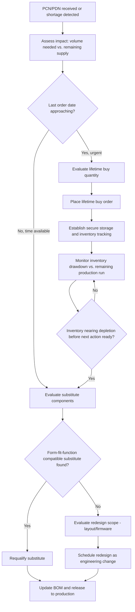

## End-of-Life and Obsolescence Management

### Overview

End-of-life (EOL) and obsolescence management addresses two related but distinct challenges in embedded product development: the eventual retirement of the product itself (product EOL) and the disappearance of components used to build it while the product is still active in the market (component obsolescence). Because embedded devices often have multi-year production runs and even longer field service lives, a design that is buildable and supportable today can face component unavailability, security exposure, or regulatory drift years into its lifecycle. Obsolescence management is the discipline of anticipating and mitigating this risk rather than reacting to it after a critical part disappears.

### Distinguishing Component Obsolescence from Product End-of-Life

**Key Points**
- **Component obsolescence** occurs when a part used in an active product's bill of materials (BOM) is discontinued by its manufacturer while the product is still being built or supported.
- **Product end-of-life** occurs when the vendor formally stops selling, supporting, or updating a given product, regardless of whether any individual component is obsolete.
- A product can reach its planned end-of-life with no component obsolescence ever having been an issue; conversely, component obsolescence can force an unplanned redesign or premature product EOL if not managed proactively.
- Both require distinct but overlapping processes: obsolescence management is largely a supply-chain and design discipline, while product EOL is largely a customer communication, support, and decommissioning discipline (the latter overlapping with field maintenance strategy).

### Sources of Component Obsolescence

#### Manufacturer-Driven Discontinuation

- **Product line rationalization**: Semiconductor and passive component manufacturers periodically discontinue lower-volume or older-process parts to focus manufacturing capacity on higher-volume or newer products.
- **Process node migration**: As a manufacturer moves to a newer fabrication process, older-process parts may become uneconomical to continue producing at low volumes, leading to discontinuation notices even when there is no functional replacement at the same process node.
- **Mergers and acquisitions**: Company acquisitions in the component supply chain frequently result in portfolio consolidation, discontinuing overlapping product lines from the acquired company.

#### Market and Allocation-Driven Scarcity

- **Allocation during demand surges**: Even without formal discontinuation, industry-wide demand surges (as seen in various semiconductor shortage periods) can make a part effectively unobtainable for extended periods, functioning as a de facto (if temporary) obsolescence event from a program schedule perspective.
- **Single-source dependency risk**: Parts available from only one manufacturer or one distributor carry higher obsolescence and shortage risk than multi-sourced equivalents, since there is no alternate supply to fall back on if the sole source has an issue.

#### Regulatory and Compliance-Driven Obsolescence

- Changes to environmental regulations (e.g., RoHS substance restrictions) can force a component out of production if it cannot be reformulated to comply, distinct from a purely commercial discontinuation decision.
- Export control or trade regulation changes can restrict availability of certain components from specific suppliers into certain markets, creating a regulatory-driven form of obsolescence risk. [Inference] — the scope and pace of such regulatory changes vary by jurisdiction and geopolitical conditions and should be monitored on an ongoing basis rather than assumed static.

### Manufacturer Notification Mechanisms

- **Product Change Notification (PCN)**: A formal notice issued by a component manufacturer describing any change to a part (die shrink, fab change, packaging change, material change) that could affect form, fit, or function, distinct from a discontinuation notice but often a leading indicator of eventual EOL.
- **Product Discontinuation Notice (PDN) / End-of-Life Notice**: A formal notice that a part is being discontinued, typically specifying a **last order date** and a **last shipment date**, giving customers a defined window to place final orders.
- Subscribing to PCN/PDN alerts (directly from manufacturers, through distributors, or via third-party component lifecycle monitoring services) is the primary proactive mechanism for catching obsolescence early rather than discovering it when an order fails to fulfill.

### Obsolescence Risk Assessment Framework

**Example**
A typical BOM risk-scoring approach considers multiple factors per component:
1. **Number of active sources**: Single-sourced parts score higher risk than multi-sourced/second-sourced parts.
2. **Manufacturer lifecycle stage**: Whether the manufacturer's own product-status flag indicates "active," "not recommended for new designs (NRND)," or "obsolete."
3. **Years in production**: Older process-node parts generally carry higher long-term risk of discontinuation than recently introduced parts, though this is not an absolute rule.
4. **Volume/market significance**: Parts used in very high-volume applications elsewhere in the industry are generally lower risk than niche, low-volume parts, since manufacturers are less likely to discontinue a part with broad market demand. [Inference] — this is a general tendency rather than a guarantee, and can be affected by broader manufacturer portfolio decisions.
5. **Criticality to function**: A part with no acceptable substitute (e.g., a specific RF front-end IC tuned to a certification-critical parameter) carries higher impact if obsoleted than a generic passive with many drop-in equivalents.

### BOM Risk Classification Diagram

<svg xmlns="http://www.w3.org/2000/svg" viewBox="0 0 700 420">
  \<style\>
    .title { font: bold 16px sans-serif; fill: #1a1a1a; }
    .axis-label { font: 12px sans-serif; fill: #333; }
    .quad-label { font: bold 13px sans-serif; }
    .quad-desc { font: 11px sans-serif; fill: #333; }
  \</style\>
  <text x="350" y="26" text-anchor="middle" class="title">Component Obsolescence Risk vs. Impact Matrix (svg_diagram)</text>

  <line x1="90" y1="360" x2="640" y2="360" stroke="#333" stroke-width="2" />
  <line x1="90" y1="360" x2="90" y2="50" stroke="#333" stroke-width="2" />
  <text x="365" y="395" text-anchor="middle" class="axis-label">Impact if Obsoleted (Low to High)</text>
  <text x="40" y="205" text-anchor="middle" class="axis-label" transform="rotate(-90 40 205)">Obsolescence Risk (Low to High)</text>

  <line x1="365" y1="360" x2="365" y2="50" stroke="#ccc" stroke-dasharray="3,3" />
  <line x1="90" y1="205" x2="640" y2="205" stroke="#ccc" stroke-dasharray="3,3" />

  <rect x="90" y="205" width="275" height="155" fill="#eafaf1" opacity="0.6" />
  <rect x="365" y="205" width="275" height="155" fill="#fdf3e3" opacity="0.6" />
  <rect x="90" y="50" width="275" height="155" fill="#fdf3e3" opacity="0.6" />
  <rect x="365" y="50" width="275" height="155" fill="#fbe3e3" opacity="0.6" />

  <text x="225" y="290" text-anchor="middle" class="quad-label" fill="#1e8449">Low Priority</text>
  <text x="225" y="308" text-anchor="middle" class="quad-desc">Monitor periodically</text>

  <text x="500" y="290" text-anchor="middle" class="quad-label" fill="#b9770e">Watch List</text>
  <text x="500" y="308" text-anchor="middle" class="quad-desc">Plan substitute, low urgency</text>

  <text x="225" y="140" text-anchor="middle" class="quad-label" fill="#b9770e">Contain Risk</text>
  <text x="225" y="158" text-anchor="middle" class="quad-desc">Second-source qualification</text>

  <text x="500" y="140" text-anchor="middle" class="quad-label" fill="#c0392b">Critical Priority</text>
  <text x="500" y="158" text-anchor="middle" class="quad-desc">Lifetime buy or redesign now</text>
</svg>

### Mitigation Strategies

#### Design-Stage Mitigation

- **Multi-sourcing at design time**: Selecting components with confirmed, pin-compatible second sources where possible, rather than discovering a substitute is needed only after the primary source is discontinued.
- **Preferring active, high-volume parts**: All else equal, favoring components with broad industry adoption over niche parts reduces long-term obsolescence exposure. [Inference] — broad adoption correlates with but does not guarantee longevity, since manufacturer business decisions can still discontinue widely-used parts.
- **Abstraction layers in firmware**: Structuring firmware with a hardware abstraction layer (HAL) around key peripherals (sensors, radios, storage) so that a substitute component with a different register interface can be swapped in with contained firmware changes rather than a full rewrite.
- **Avoiding NRND (Not Recommended for New Designs) parts**: Checking a manufacturer's lifecycle status flag before finalizing a new design, since starting a new design on an NRND part front-loads obsolescence risk before the product has even launched.

#### Reactive Mitigation Once Notified

- **Lifetime/last-time buy**: Placing a single large order for the remaining supply of a part before its last order date, sized to cover projected production needs through the product's planned EOL, which requires reasonably accurate demand forecasting and sufficient capital/storage commitment.
- **Component substitution and requalification**: Identifying a form-fit-function compatible (or near-compatible, requiring layout/firmware changes) replacement part, followed by a requalification process (functional testing, and depending on the change's scope, potentially a subset of the environmental/reliability tests) before releasing it into production.
- **Authorized aftermarket/reclaimed sourcing**: In some cases, sourcing remaining stock through authorized distributor channels or, more cautiously, through the broker/aftermarket, which carries higher counterfeit risk and generally warrants additional incoming inspection. [Inference] — the acceptability of aftermarket sourcing varies significantly by industry, program risk tolerance, and quality requirements.
- **Emulation/bridge components**: In some cases, a small adapter circuit (an interposer board or a bridging IC) can allow a replacement part to sit in the same footprint as the original, avoiding a full PCB redesign at the cost of added BOM complexity.

### Obsolescence Response Workflow

### Long-Lifecycle and Industrial Component Programs

- Some semiconductor manufacturers offer **longevity programs** for industrial, automotive, or medical customers, committing to extended production runs (often significantly longer than standard consumer-grade product cycles) for an additional cost or under specific supply agreements. [Inference] — specific program terms, durations, and availability vary by manufacturer and are commercial agreements that should be verified directly with the supplier rather than assumed.
- Choosing automotive-grade or industrial-grade component variants over consumer-grade equivalents, where cost allows, can reduce obsolescence risk for products with long expected field service lives, since these grades are often produced under longer-term supply commitments. [Inference] — this is a general industry tendency rather than a guaranteed outcome for any specific part.

### Product End-of-Life Planning

**Key Points**
- A defined product EOL policy specifies when the vendor will stop selling the product, stop providing firmware/security updates, and stop offering repair/replacement parts — ideally communicated to customers well in advance rather than announced abruptly.
- EOL planning should be coordinated with component obsolescence status: if key components are already becoming scarce, that scarcity may itself become a driver for setting or adjusting the product's planned EOL date rather than committing to an open-ended support window.
- Data and credential decommissioning (covered in more depth under field maintenance strategy) intersects with product EOL planning, since a defined EOL date creates a natural trigger point for final security update issuance and eventual service shutdown.
- Spare parts availability commitments (how long repair parts remain available after EOL) should be set deliberately rather than left undefined, since customers with long-lived deployed units may need repair support well past the product's active sales window.

### Documentation and Change Traceability

- Maintaining a BOM changelog that records every component substitution, the reason (obsolescence, cost, performance), the qualification evidence, and the effective date/serial range is essential for field failure investigation, since a defect discovered later may correlate with a specific substitution rather than being a universal design flaw.
- Engineering change orders (ECOs) triggered by obsolescence should follow the same formal review and validation process as any other design change, resisting the temptation to treat an urgent obsolescence-driven substitution as exempt from normal qualification rigor. [Inference] — the appropriate level of requalification rigor for a given substitution depends on how electrically and mechanically similar the replacement part is to the original.

### Common Pitfalls

- Discovering a critical single-sourced component's discontinuation only when a purchase order fails, rather than through proactive PCN/PDN monitoring, leaving no time for an orderly lifetime buy or substitution.
- Sizing a lifetime buy based on overly optimistic demand forecasts, resulting in either a costly excess inventory write-off or running out before a substitute is qualified.
- Substituting a component without full requalification under schedule pressure, introducing a latent field failure mode that surfaces only after volume shipment.
- Treating obsolescence management as a one-time BOM review at design freeze rather than an ongoing monitoring activity throughout the product's entire production lifecycle.
- Announcing product end-of-life abruptly without prior communication, damaging customer trust and leaving deployed fleets without adequate transition time for security or replacement planning.

### Related Topics

- Field update and maintenance strategy
- Design for manufacturing and assembly
- Component derating and reliability engineering
- Supply chain risk management for contract manufacturing
- Engineering change order (ECO) processes
- Long-term component sourcing agreements and longevity programs
- Product decommissioning and secure data erasure
- Environmental and reliability testing