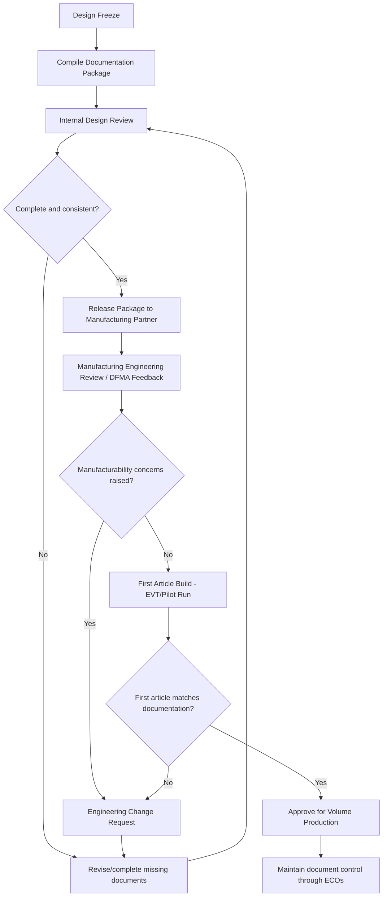

## Documentation for Production Handoff

### Overview

Production handoff documentation is the complete set of artifacts an engineering team transfers to manufacturing (whether an in-house line, a contract manufacturer, or an overseas EMS partner) so that a product can be built, tested, and shipped repeatably without requiring the original design engineers present on the line. This documentation package is what turns a working prototype into something a manufacturing partner who has never seen the product before can actually produce at volume with predictable yield. Gaps or ambiguities in this handoff are one of the most common sources of early production delays, quality escapes, and costly back-and-forth between engineering and the factory.

### Why Handoff Documentation Quality Matters

**Key Points**
- A prototype built by the design team with tribal knowledge and hands-on adjustment is not the same deliverable as a producible design; handoff documentation is what encodes that tribal knowledge into something transferable.
- Ambiguous or incomplete documentation forces manufacturing engineers to make assumptions, and those assumptions are a common root cause of first-article build defects that could have been avoided.
- Documentation quality directly affects how quickly a contract manufacturer can quote and ramp a new product, since incomplete packages typically trigger clarification cycles that delay both quoting and the actual production start date.
- Good documentation remains the working reference throughout the product's production life, not just at launch, since revisions, re-sourcing, and rework all depend on accurate as-built documentation existing and being kept current.

### Core Documentation Categories

#### Electrical Design Package

- **Schematic (final, released revision)**: The authoritative electrical design reference, released under formal revision control rather than an in-progress working file.
- **PCB fabrication drawing**: Specifies layer stack-up, material (e.g., FR-4 grade), copper weight, surface finish (e.g., ENIG, HASL), solder mask and silkscreen color, board thickness, and any special requirements (impedance control, controlled dielectric).
- **Gerber/ODB++ files**: The manufacturing data files defining every copper layer, drill file, solder mask, and silkscreen layer needed to fabricate the bare board.
- **Bill of Materials (BOM)**: A structured list of every component with manufacturer part number, approved alternates, reference designators, package/footprint, and quantity per assembly — this is one of the most consequential documents in the entire package, since ambiguity here directly causes wrong-part builds.
- **Assembly drawing**: Shows component placement, reference designator silkscreen correlation, polarity markings, and any assembly notes (e.g., "install after reflow," "hand-solder only").
- **Pick-and-place (centroid) file**: Machine-readable component X/Y coordinates and rotation data required for automated SMT placement equipment.

#### Mechanical Design Package

- **3D CAD models (native and neutral formats)**: Native CAD files for the design team's own use, plus neutral-format exports (STEP, IGES) so manufacturing partners using different CAD tools can still work with accurate geometry.
- **2D mechanical drawings with GD&T**: Dimensioned drawings using Geometric Dimensioning and Tolerancing to specify which dimensions are critical and what tolerance is acceptable, rather than relying on the 3D model's nominal geometry alone.
- **Material and finish specifications**: Exact resin grade/color for molded parts, surface finish (texture, gloss level), and any secondary processes (painting, plating, laser etching).
- **Tooling and mold flow considerations documentation**: Notes on gate locations, parting lines, and ejector pin placement where these were co-developed with a mold maker, so intent is preserved if tooling needs rework or duplication later.

#### Firmware and Software Package

- **Released firmware binary and source reference**: The exact, version-controlled and hash-verified binary approved for production, distinct from any development or pre-release build.
- **Provisioning/flashing procedure**: Step-by-step instructions (or a reference to the automated test executive script) describing exactly what gets flashed, in what order, and what identifiers/keys are injected, tying directly into the firmware provisioning process.
- **Configuration and feature-flag reference**: Documentation of any SKU-differentiating configuration flags so manufacturing or a configuration station applies the correct settings per product variant.

### Test and Quality Documentation

**Example**
A representative test documentation subset within a handoff package:
1. **In-circuit test (ICT) specification**: Defines expected values, tolerances, and pass/fail criteria for every tested net.
2. **Functional test procedure**: Step-by-step description of what the functional test station does, what stimulus it applies, and what response is expected — sufficiently detailed that a test engineer unfamiliar with the product's internals could implement or debug the fixture.
3. **Calibration procedure**: Documents the exact reference equipment, calibration points, and coefficient storage method used during EOL calibration.
4. **Inspection criteria/AQL tables**: Acceptable Quality Level tables defining sampling plans and defect classifications (critical, major, minor) for visual and dimensional inspection.
5. **Workmanship standards reference**: Typically a reference to an industry standard (e.g., IPC-A-610 for electronic assembly acceptability) rather than a bespoke document, so inspectors have an externally recognized basis for acceptance criteria.

### Handoff Package Structure

<svg xmlns="http://www.w3.org/2000/svg" viewBox="0 0 760 460">
  \<style\>
    .title { font: bold 16px sans-serif; fill: #1a1a1a; }
    .cat-title { font: bold 13px sans-serif; fill: #1a1a1a; }
    .item { font: 11.5px sans-serif; fill: #333; }
    .cat-box { fill: #eef3fb; stroke: #2c3e50; stroke-width: 1.5; }
  \</style\>
  <text x="380" y="26" text-anchor="middle" class="title">Production Handoff Documentation Package (svg_diagram)</text>

  <rect x="30" y="60" width="220" height="170" rx="8" class="cat-box" />
  <text x="140" y="85" text-anchor="middle" class="cat-title">Electrical</text>
  <text x="45" y="110" class="item">- Schematic (released)</text>
  <text x="45" y="130" class="item">- Fab drawing</text>
  <text x="45" y="150" class="item">- Gerber/ODB++</text>
  <text x="45" y="170" class="item">- BOM with alternates</text>
  <text x="45" y="190" class="item">- Assembly drawing</text>
  <text x="45" y="210" class="item">- Centroid/pick-place file</text>

  <rect x="270" y="60" width="220" height="170" rx="8" class="cat-box" />
  <text x="380" y="85" text-anchor="middle" class="cat-title">Mechanical</text>
  <text x="285" y="110" class="item">- 3D CAD (native + STEP)</text>
  <text x="285" y="130" class="item">- 2D drawings w/ GD&amp;T</text>
  <text x="285" y="150" class="item">- Material/finish spec</text>
  <text x="285" y="170" class="item">- Tooling notes</text>
  <text x="285" y="190" class="item">- Fastener/hardware spec</text>

  <rect x="510" y="60" width="220" height="170" rx="8" class="cat-box" />
  <text x="620" y="85" text-anchor="middle" class="cat-title">Firmware/Software</text>
  <text x="525" y="110" class="item">- Released binary + hash</text>
  <text x="525" y="130" class="item">- Provisioning procedure</text>
  <text x="525" y="150" class="item">- Config/feature flags</text>
  <text x="525" y="170" class="item">- Key/cert allocation spec</text>

  <rect x="150" y="260" width="220" height="170" rx="8" class="cat-box" />
  <text x="260" y="285" text-anchor="middle" class="cat-title">Test/Quality</text>
  <text x="165" y="310" class="item">- ICT specification</text>
  <text x="165" y="330" class="item">- Functional test procedure</text>
  <text x="165" y="350" class="item">- Calibration procedure</text>
  <text x="165" y="370" class="item">- AQL/inspection criteria</text>
  <text x="165" y="390" class="item">- Workmanship standard ref</text>

  <rect x="390" y="260" width="220" height="170" rx="8" class="cat-box" />
  <text x="500" y="285" text-anchor="middle" class="cat-title">Compliance/Admin</text>
  <text x="405" y="310" class="item">- Certification reports</text>
  <text x="405" y="330" class="item">- DoC / labeling artwork</text>
  <text x="405" y="350" class="item">- Packaging spec</text>
  <text x="405" y="370" class="item">- Revision/change log</text>
</svg>

### Packaging and Logistics Documentation

- **Packaging specification**: Defines box dimensions, cushioning/protective materials, unit-per-carton and carton-per-pallet counts, and any electrostatic discharge (ESD) protective packaging requirements for sensitive assemblies.
- **Label artwork and placement specification**: Specifies exact placement, content, and format for regulatory labels (certification marks), serial number/barcode labels, and any customer-facing branding labels, since inconsistent label placement across units is a common visual quality complaint.
- **Shipping and export documentation templates**: Country-of-origin marking requirements, harmonized tariff codes, and any product-specific export documentation needed for customs clearance, particularly relevant when the manufacturing location differs from the primary sales markets.

### Compliance and Certification Documentation

- **Certification test reports**: Copies of the accredited lab reports for FCC/CE/regional certifications, which the manufacturing partner or its customs brokers may need to reference for import/export clearance.
- **Declaration of Conformity and technical file**: For CE-marked products, the DoC and supporting technical file should be included or at least referenced so it can be produced if requested by a regulatory authority or customer.
- **RoHS/REACH compliance declarations**: Documentation confirming BOM-level compliance with restricted-substance regulations, often required by the contract manufacturer's own quality system as well as by end customers.

### Revision Control and Change Management

**Key Points**
- Every document in the handoff package should be under formal revision control (a defined version number, approval date, and approver), not passed as an informally-named file like "schematic_final_v3_USE_THIS_ONE."
- A single authoritative source of truth (a PLM system, a version-controlled repository, or at minimum a clearly maintained shared drive with strict naming conventions) prevents the common failure mode where the factory builds from an outdated document version that a designer forgot to update everywhere.
- Engineering Change Orders (ECOs) issued after initial handoff must specify exactly which documents changed, the effective date or serial number range, and whether existing WIP (work in progress) or finished inventory is affected.
- A revision history table showing what changed and why, maintained across the product's life, is invaluable when diagnosing whether a field issue correlates with a specific design or documentation change.

### Handoff Workflow and Review Gates

### Knowledge Transfer Beyond Written Documents

- **Design intent narratives**: Written documentation captures what to build, but a short design-intent summary (why certain tolerances are tight, why a particular component was chosen despite a cheaper alternative existing) helps a manufacturing partner make better judgment calls on ambiguous edge cases.
- **Live handoff sessions/factory visits**: A period of direct engineer-to-factory-engineer interaction (in person or via video) during first-article builds surfaces questions that static documents alone often fail to anticipate.
- **Known-issues and workaround log**: An explicit list of known quirks discovered during prototype builds (e.g., "this connector requires slight extra insertion force, this is expected and within spec") prevents a manufacturing partner from treating a known, accepted behavior as a defect to investigate independently.

### Documentation for Contract Manufacturer Transitions

- When a product transitions between contract manufacturers (e.g., moving from a prototyping-focused shop to a high-volume EMS partner, or re-sourcing to a different region), the same full documentation package is needed again, and gaps that were informally bridged with the original manufacturer's tribal knowledge become visible.
- A documentation package that was allowed to drift out of sync with as-built reality at the original manufacturer creates significant risk during a CM transition, since the new partner has no informal knowledge to fall back on and will build exactly to what is written.
- Maintaining accurate documentation continuously, rather than only at the initial handoff, is what makes a future CM transition (whether planned for cost reasons or forced by an obsolescence/business event) tractable rather than a de facto re-engineering effort.

### Common Pitfalls

- Handing off a BOM without approved alternate part numbers, forcing the manufacturing partner to either halt sourcing on a shortage or make an unauthorized substitution.
- Relying on informal file-naming conventions instead of formal revision control, resulting in a factory building from an outdated or incorrect document version.
- Omitting the "why" behind tight tolerances or unusual component choices, causing a well-intentioned manufacturing engineer to "improve" something that was deliberately specified that way.
- Treating documentation as a one-time deliverable at launch rather than a living package updated through every ECO, causing the package to silently diverge from as-built reality over the product's production life.
- Underestimating the value of first-article build review sessions, missing an opportunity to catch documentation gaps before they cause a larger production run defect.

### Related Topics

- Design for manufacturing and assembly
- Firmware provisioning at manufacturing
- Calibration and end-of-line testing
- Certification processes (FCC, CE, and regional equivalents)
- Engineering change order (ECO) processes
- End-of-life and obsolescence management
- Contract manufacturer selection and transition planning
- Product lifecycle management (PLM) systems