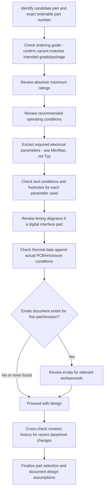

## Reading and Interpreting Component Datasheets

### Overview

A component datasheet is the authoritative technical reference a manufacturer publishes for a specific part, and the ability to read one accurately is a foundational skill for embedded hardware design. Datasheets are dense, semi-standardized documents packed with electrical parameters, timing diagrams, and application guidance, but they are also written by many different manufacturers with varying conventions, occasional ambiguity, and sometimes outright errors. Misreading a datasheet — confusing a typical value for a guaranteed one, missing a footnote qualifying a test condition, or overlooking an errata document — is a common root cause of design issues that only appear once a product reaches volume and encounters the full spread of real-world component variation.

### General Datasheet Structure

Most datasheets, regardless of manufacturer, follow a broadly similar organization, though section names and ordering vary.

- **Features and general description**: A high-level marketing-adjacent summary of what the part does and its headline capabilities; useful for initial part selection but not for detailed design decisions.
- **Ordering information/part numbering guide**: Decodes the part number suffix system, showing how package type, temperature grade, and packaging (tape-and-reel vs. tray) are encoded into the exact orderable part number.
- **Pin configuration and description**: Pinout diagrams and a table describing each pin's function, direction, and any special notes (e.g., "must be tied to ground if unused").
- **Absolute maximum ratings**: The hard electrical and thermal limits beyond which the device is not guaranteed to survive, distinct from the recommended operating conditions.
- **Recommended operating conditions**: The intended operating envelope (supply voltage range, temperature range) under which the specified electrical characteristics apply.
- **Electrical characteristics tables**: The detailed parametric specifications (voltages, currents, timing, thresholds) under specified test conditions.
- **Timing diagrams and waveforms**: Visual representations of signal timing relationships, critical for digital interface parts.
- **Application information**: Reference circuits, layout guidance, and typical application notes.
- **Package information/mechanical data**: Physical dimensions, land pattern recommendations, and thermal package characteristics.
- **Revision history**: A table of changes across datasheet revisions, often overlooked but important for understanding what has changed about a part's specification or characterization over time.

### Absolute Maximum Ratings vs. Recommended Operating Conditions

**Key Points**
- **Absolute maximum ratings** define the boundary beyond which the device may be permanently damaged; operating even briefly beyond these values is not a "worse performance" scenario but a reliability/damage risk.
- **Recommended operating conditions** define the envelope within which the datasheet's specified electrical characteristics are guaranteed to be valid; operating within absolute maximums but outside recommended conditions may mean the device still functions but its specified parameters (accuracy, timing, output levels) are no longer guaranteed.
- A common design error is treating the absolute maximum rating as a target design point rather than a boundary never to be approached without margin — proper design practice derates components well below absolute maximums, typically per an internal engineering guideline, to account for manufacturing tolerance, aging, and environmental variation.
- Some datasheets include a note that exceeding absolute maximums even momentarily (e.g., a transient overvoltage spike) can cause latent damage that may not manifest as an immediate failure but shortens the part's field life. [Inference] — the specific mechanisms and severity of latent damage from transient overstress vary by device type and stress duration/magnitude, and are a specialized reliability engineering topic.

### Interpreting Electrical Characteristics Tables

Electrical characteristics tables list parameters with associated minimum, typical, and maximum values, and this distinction is one of the most commonly misread aspects of a datasheet.

- **Minimum (Min)**: The guaranteed floor for that parameter across the specified test conditions and manufacturing distribution; design should not assume better performance than this value if the parameter matters for meeting your product's specification.
- **Typical (Typ)**: A representative value observed during characterization, generally not guaranteed by the manufacturer's test program and not something a design should rely on for meeting a hard requirement.
- **Maximum (Max)**: The guaranteed ceiling for that parameter; similarly, a design that requires a parameter to stay below a certain value must design against the Max column, not the Typ column.
- Many parameters are listed with only one of Min/Typ/Max populated (e.g., a leakage current might only have a Max specified, since there is no meaningful minimum to guarantee), and the absence of a value in a column is itself informative, not an oversight to question.

**Example**
A hypothetical electrical characteristics row illustrating this distinction:

| Parameter | Symbol | Min | Typ | Max | Unit | Condition |
|---|---|---|---|---|---|---|
| Output high voltage | $V_{OH}$ | 2.4 | 3.1 | — | V | $I_{OH} = -2\text{ mA}$ |
| Supply current | $I_{DD}$ | — | 1.2 | 2.5 | mA | $V_{DD} = 3.3\text{ V}$, no load |

A design relying on this part must assume $V_{OH}$ could be as low as 2.4 V (not the 3.1 V typical) when checking logic-high compatibility with a downstream device, and must budget for $I_{DD}$ up to 2.5 mA (not 1.2 mA) when sizing a power supply or estimating battery life.

### Test Conditions and Footnotes

**Key Points**
- Every parameter in an electrical characteristics table is measured under specific stated conditions (supply voltage, temperature, load, frequency), and a parameter's value is only valid under those exact conditions — extrapolating a value to different conditions without supporting data is a common source of design error.
- Footnotes frequently qualify a parameter with information critical to correct interpretation (e.g., "guaranteed by design, not tested in production," "characterized at initial qualification only," or "value applies only over the industrial temperature range variant").
- The phrase "guaranteed by design" or "guaranteed by characterization" (rather than "tested") indicates the manufacturer is not verifying that specific parameter on every production unit, which carries different reliability implications than a parameter that is 100%-tested at final test.
- Temperature-dependent parameters are often specified across multiple temperature points or ranges (e.g., separate rows or footnotes for -40°C, +25°C, +85°C), and a design intended for the full industrial temperature range must check the value at the relevant temperature extreme, not just at room temperature.

### Timing Diagrams and AC Characteristics

For digital interface parts (memory, communication interfaces, logic devices), timing diagrams and their associated AC characteristics tables define the precise sequencing and duration requirements a design must satisfy.

- **Setup and hold times**: The minimum duration a signal must be stable before ($t_{su}$) and after ($t_h$) a clock edge for correct data capture; violating these can cause intermittent, hard-to-diagnose data corruption rather than an obvious hard failure.
- **Propagation delay**: The time between an input change and the corresponding output change, relevant for timing budget analysis across a signal chain with multiple devices.
- **Rise/fall time specifications**: Particularly important at higher frequencies, where a signal that does not meet its specified rise/fall time can violate setup/hold requirements at the receiving device even if voltage levels look correct on a slower oscilloscope measurement.
- Timing diagrams typically define reference voltage levels (e.g., the voltage at which a transition is considered to have "occurred") that must be understood to correctly interpret the associated numeric timing values.

### Timing Relationship Diagram

<svg xmlns="http://www.w3.org/2000/svg" viewBox="0 0 720 320">
  \<style\>
    .title { font: bold 15px sans-serif; fill: #1a1a1a; }
    .sig-label { font: 12px sans-serif; fill: #1a1a1a; }
    .dim-label { font: 11px sans-serif; fill: #c0392b; }
    .sig { stroke: #2c3e50; stroke-width: 2; fill: none; }
  \</style\>
  <text x="360" y="24" text-anchor="middle" class="title">Setup and Hold Time Relationship (svg_diagram)</text>

  <text x="30" y="90" class="sig-label">CLK</text>
  <path class="sig" d="M50,100 L150,100 L150,60 L280,60 L280,100 L400,100 L400,60 L530,60 L530,100 L620,100" />

  <text x="30" y="180" class="sig-label">DATA</text>
  <path class="sig" d="M50,190 L230,190 L230,150 L620,150" />

  <line x1="280" y1="50" x2="280" y2="210" stroke="#999" stroke-dasharray="3,3" />

  <line x1="230" y1="230" x2="280" y2="230" stroke="#c0392b" stroke-width="1.5" />
  <line x1="230" y1="225" x2="230" y2="235" stroke="#c0392b" stroke-width="1.5" />
  <line x1="280" y1="225" x2="280" y2="235" stroke="#c0392b" stroke-width="1.5" />
  <text x="255" y="248" text-anchor="middle" class="dim-label">t_su</text>

  <line x1="280" y1="260" x2="330" y2="260" stroke="#c0392b" stroke-width="1.5" />
  <line x1="280" y1="255" x2="280" y2="265" stroke="#c0392b" stroke-width="1.5" />
  <line x1="330" y1="255" x2="330" y2="265" stroke="#c0392b" stroke-width="1.5" />
  <text x="305" y="278" text-anchor="middle" class="dim-label">t_h</text>

  <text x="285" y="40" class="sig-label">Clock edge (data must be stable)</text>
</svg>

### Package and Thermal Data

- **Thermal resistance ($\theta_{JA}$, $\theta_{JC}$)**: Junction-to-ambient and junction-to-case thermal resistance values used to estimate die temperature under a given power dissipation and ambient/case temperature, essential for verifying a part will not exceed its maximum junction temperature in the actual product enclosure.
- $\theta_{JA}$ values are typically measured on a manufacturer-defined standard test board (often specified per JEDEC standards), which may not match the actual product's PCB copper area, layer count, or airflow — meaning the datasheet's $\theta_{JA}$ can significantly overstate or understate real-world thermal performance in a specific design. [Inference] — the degree of divergence between datasheet $\theta_{JA}$ and actual application thermal performance depends heavily on how closely the real PCB matches the JEDEC standard test board conditions.
- **Power derating curves**: Graphs showing the maximum allowable power dissipation as a function of ambient temperature, used to determine safe operating power at the design's actual worst-case ambient condition.
- **Package outline drawings and recommended land patterns**: Physical dimensions and manufacturer-suggested PCB footprint, which should be cross-checked against standardized footprint libraries (e.g., IPC-7351) since manufacturer-suggested patterns occasionally differ from industry-standard footprints.

### Errata Documents and Silicon Revisions

**Key Points**
- An errata document lists known deviations between a specific silicon revision's actual behavior and its datasheet-specified behavior, and is a separate document from the datasheet itself that must be checked independently.
- A design that appears to violate a fundamental principle of the part's operation, despite careful datasheet reading, sometimes traces back to an undocumented-in-the-main-datasheet erratum that only appears in the errata sheet for that specific silicon revision.
- Silicon revision markings (often a date code or revision letter on the physical package, or a readable revision register in the device itself) determine which errata apply to a specific manufactured unit, meaning two units of the "same" part number can have different applicable errata if their silicon revisions differ.
- Checking for an errata document should be a standard step in component evaluation, not something consulted only after encountering unexplained behavior, since a known erratum can sometimes be designed around proactively (e.g., via a firmware workaround) before it ever causes a field issue.

### Common Terminology and Symbols Reference

**Example**
Frequently encountered datasheet symbols and their general meaning:
- $V_{DD}$, $V_{CC}$: Positive supply voltage (naming convention varies by manufacturer and logic family history).
- $V_{SS}$, $GND$: Ground/reference voltage.
- $I_{OL}$, $I_{OH}$: Output current, low and high logic state respectively.
- $T_A$, $T_J$, $T_C$: Ambient, junction, and case temperature respectively.
- $f_{MAX}$: Maximum specified operating frequency.
- ESD ratings (e.g., HBM, CDM): Electrostatic discharge withstand ratings under specific standardized test models (Human Body Model, Charged Device Model), relevant to handling and board-level ESD protection design, not a guarantee of in-system ESD immunity under all conditions.

### Datasheet Interpretation Workflow

### Common Pitfalls

- Designing against the Typical column instead of the guaranteed Min/Max columns, resulting in units at the far end of the manufacturing distribution failing to meet the product's specification.
- Overlooking footnotes that qualify a parameter's validity to a specific temperature range, supply voltage, or test condition different from the actual application's conditions.
- Assuming the datasheet's $\theta_{JA}$ thermal resistance value directly applies to the actual product PCB without accounting for the standardized test board it was measured on.
- Failing to check for an errata document, particularly for complex parts like microcontrollers and communication ICs where silicon-revision-specific quirks are common.
- Treating absolute maximum ratings as usable design targets rather than boundaries to be approached only with substantial margin.
- Not verifying which exact ordering code variant (temperature grade, package option) the BOM specifies matches the electrical characteristics actually reviewed, since a datasheet often covers multiple variants with different specifications in the same document.

### Related Topics

- Component derating guidelines and worst-case design analysis
- Thermal management in enclosure design
- Signal integrity and timing budget analysis
- Design for manufacturing and assembly
- End-of-life and obsolescence management
- Electrostatic discharge (ESD) protection design
- Environmental and reliability testing