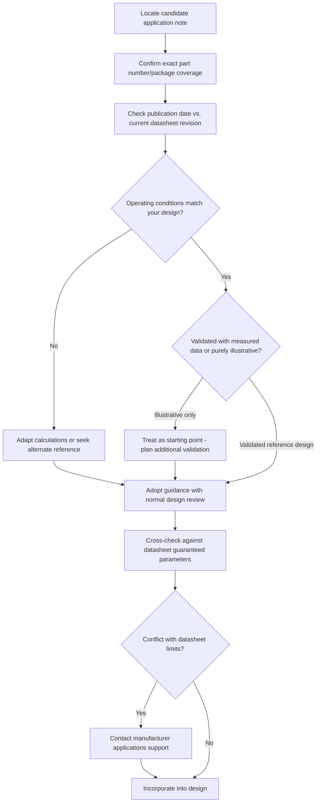

## Engaging with Vendor Application Notes

### Overview

An application note (often abbreviated "app note") is a manufacturer-published document that goes beyond the datasheet to explain how to use a specific component effectively in a real design, typically addressing a particular use case, reference circuit, or common design challenge. Where a datasheet defines what a part is and its guaranteed parameters, an application note explains how to apply it correctly, often including worked examples, recommended external component values, layout guidance, and troubleshooting advice drawn from the manufacturer's own applications engineering experience. Application notes are a valuable but secondary source: they carry less formal guarantee status than the datasheet itself and must be read with an understanding of their scope, age, and applicability to a specific design.

### What Application Notes Typically Cover

**Key Points**
- **Reference designs and typical application circuits**: Complete or near-complete circuit examples showing recommended external component values (compensation networks, filter components, pull-up resistors) for common use cases.
- **Design procedure walkthroughs**: Step-by-step calculations for sizing external components (e.g., selecting an inductor value for a switching regulator, or computing a feedback resistor divider for a target output voltage).
- **Layout guidance specific to the part**: Recommendations on component placement, trace routing, ground plane treatment, and via placement that are more detailed than what a general datasheet package drawing provides.
- **Troubleshooting and common issues**: Guidance addressing frequently encountered problems (e.g., oscillation in a feedback loop, noise coupling, thermal issues) and their typical root causes.
- **Software/firmware integration examples**: For parts with a digital interface, example initialization sequences, register configuration walkthroughs, or driver code snippets.

### Application Notes vs. Datasheets: Different Authority Levels

- A datasheet's electrical characteristics table represents a formal, typically production-tested or characterization-verified specification; an application note's recommended component values are typically design guidance based on the manufacturer's own reference testing, not a guaranteed specification the manufacturer will support to the same rigor.
- If a datasheet and an application note appear to conflict (e.g., the app note suggests an operating condition at the edge of or slightly beyond what the datasheet's recommended operating conditions specify), the datasheet's guaranteed parameters should generally take precedence, and the discrepancy is worth resolving with the manufacturer's applications engineering support before proceeding. [Inference] — the correct resolution in any specific conflict depends on the exact nature of the discrepancy and is best confirmed directly with the manufacturer rather than assumed from general principle.
- Application notes are sometimes written for a specific silicon revision, package option, or an earlier product generation, and may not be automatically updated when the underlying part receives a later revision — checking the application note's own revision date and applicability scope is necessary before trusting its guidance for a current design.

### Evaluating an Application Note's Applicability

**Example**
A practical checklist when reviewing an application note before applying its guidance:
1. Confirm the exact part number(s) the note covers, including package variant, since guidance for one package may not transfer to another with different pinout or thermal characteristics.
2. Check the publication or revision date, and cross-reference against the part's own datasheet revision history to see if anything relevant has changed since.
3. Identify the specific operating conditions (supply voltage, temperature range, load conditions) the reference design was validated under, and compare against your own design's actual operating envelope.
4. Determine whether the note presents a fully validated reference design (often indicated by measured performance data, plots, or test results) versus a purely theoretical or illustrative example.
5. Check whether the note references other application notes, errata, or design tools (e.g., a manufacturer's online component calculator) that should be consulted alongside it.

### Types of Application Notes Commonly Encountered

#### Circuit Design and Component Selection Notes

Focused on helping a designer correctly size external passive components around an active device, common for power management ICs, amplifiers, and analog front-ends.

- Switching regulator application notes typically walk through inductor, output capacitor, and compensation network selection with worked formulas and sometimes an accompanying spreadsheet or online design tool.
- Amplifier application notes often address gain-bandwidth trade-offs, stability considerations, and recommended compensation for specific feedback configurations.

#### Layout and Signal Integrity Notes

- High-speed interface parts (USB, high-speed differential pairs, RF) frequently have dedicated layout application notes covering trace impedance targets, via stitching, and recommended stackup considerations specific to that interface.
- Power supply layout notes commonly address grounding strategy, current loop minimization, and thermal via placement beneath power components.

#### Firmware/Software Integration Notes

- Sensor and communication IC vendors often publish notes covering initialization sequences, common register configuration mistakes, and interrupt handling patterns specific to that device family.
- Some notes include reference driver source code, which should be treated as a starting point requiring the same code review rigor as any other third-party code integrated into a product, not as pre-validated production-ready firmware. [Inference] — the actual quality and production-readiness of vendor-supplied reference code varies significantly by manufacturer and specific note, and should be evaluated on its own merits rather than assumed reliable.

#### Application-Specific Solution Notes

- Some notes are framed around an entire system-level application (e.g., "battery fuel gauge design for a two-cell Li-ion pack") rather than a single component, useful when a design's use case closely matches the note's assumed scenario but potentially misleading if the actual application differs in ways the note does not address.

### Application Note Evaluation Flow

### Using Manufacturer Design Tools Alongside Application Notes

- Many manufacturers provide companion calculators, spreadsheets, or simulation models (e.g., a switching regulator design tool, a filter design calculator) referenced within or alongside application notes, which can reduce manual calculation error but should still be sanity-checked against the underlying formulas presented in the note itself.
- Simulation models (SPICE models) provided by a manufacturer are useful for behavioral verification but represent the manufacturer's modeled approximation of the part, not a guarantee that silicon will behave identically under every simulated condition. [Inference] — the fidelity of a vendor SPICE model to actual silicon behavior varies by manufacturer, model complexity, and how far the simulated conditions are from the model's validated range.
- Where a design tool and a written application note give differing recommended values for the same design point, this discrepancy is worth resolving before finalizing a design, since it may indicate the note or tool has not been updated in sync with the other.

### Contacting Manufacturer Applications Engineering Support

**Key Points**
- Most component manufacturers offer a channel (forum, direct applications engineering contact, distributor-mediated support) for design-specific questions that fall outside what published application notes cover.
- Applications engineering support is generally most effective when the question is specific and includes concrete details (exact part number/revision, schematic excerpt, operating conditions, observed versus expected behavior) rather than an open-ended request.
- For a design-critical decision (e.g., resolving an apparent conflict between an app note and the datasheet, or confirming an edge-case operating condition not explicitly covered), direct engagement with the manufacturer is often more reliable than extrapolating from published materials alone, particularly for parts with known errata or complex analog behavior.
- Community forums (either manufacturer-hosted or independent) can surface useful real-world experience but should be weighted as informal, unverified input rather than authoritative guidance, distinct from an official manufacturer response.

### Community and Third-Party Resources

- Independent design communities, forums, and reference designs from other engineers can supplement official application notes, particularly for parts with a large user base, but carry no manufacturer accountability if the guidance is wrong.
- Reference designs published by module/board vendors that incorporate the component (e.g., a development board's own schematic and layout) can serve as an informal secondary validation of a manufacturer's own application note guidance, since the module vendor has presumably built and tested the circuit at least once.
- Cross-referencing multiple independent sources (the datasheet, the official app note, and at least one independently-built reference design) before committing to a critical design decision reduces the risk of propagating a single source's error or omission. [Inference] — the practical value of this cross-referencing approach depends on the criticality of the specific design decision and the time available in the design schedule.

### Common Pitfalls

- Treating an application note's recommended component values as guaranteed specifications with the same authority as the datasheet's electrical characteristics table.
- Applying an application note's guidance without checking whether its stated operating conditions and part/package coverage actually match the current design's requirements.
- Using vendor-supplied reference firmware/driver code in a shipping product without the same code review, testing, and security scrutiny applied to any other third-party code source.
- Failing to notice an application note is outdated relative to a newer silicon revision or datasheet update, missing a relevant change in recommended usage.
- Relying solely on informal community forum guidance for a design-critical decision instead of verifying against official manufacturer documentation or direct applications engineering support.

### Related Topics

- Reading and interpreting component datasheets
- Component derating guidelines and worst-case design analysis
- SPICE simulation and model validation practices
- Design for manufacturing and assembly
- Signal integrity and PCB layout for high-speed interfaces
- Errata documents and silicon revision management
- End-of-life and obsolescence management