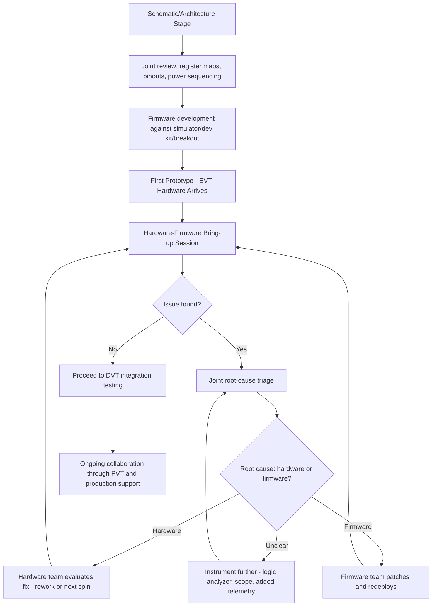

## Collaborating with Hardware and Firmware Teams

### Overview

Embedded product development is inherently cross-disciplinary, requiring sustained collaboration between hardware engineers (schematic/PCB design, power, analog), firmware/software engineers (drivers, application logic, protocols), and often mechanical and manufacturing engineers as well. The quality of this collaboration directly determines whether integration happens smoothly at the point hardware and firmware first meet, or whether it becomes a prolonged, frustrating debugging process where neither side is certain if a problem is a hardware defect, a firmware bug, or a misunderstanding between the two. Effective collaboration is as much about shared documentation and interface contracts as it is about interpersonal communication.

### Why This Collaboration Is Uniquely Challenging

**Key Points**
- Hardware changes are expensive and slow to iterate (fabrication lead time, assembly, potentially re-certification), while firmware can often be changed and redeployed in minutes, creating an inherent asymmetry in how each team can respond to a discovered problem.
- A bug's true root cause is not always obvious from its symptom: a sensor reading garbage data could stem from a firmware initialization sequence error, an incorrect pull-up resistor value, a marginal power supply rail, or a PCB layout signal integrity issue — diagnosing correctly requires both perspectives working together rather than each team assuming the fault lies with the other.
- Firmware engineers often need to work against hardware that does not yet exist (schematic-stage) or exists only as an early, potentially buggy prototype, requiring communication mechanisms that do not depend on a finished board being in hand.
- Hardware engineers often lack full visibility into how firmware actually exercises the hardware in practice (timing, sequencing, edge cases), meaning firmware behavior can reveal hardware corner cases the original hardware design review did not anticipate.

### Establishing Interface Contracts Early

#### Register Maps and Memory-Mapped Interfaces

- For custom digital logic (FPGA/ASIC) or any hardware exposing a register-based interface to firmware, a clearly documented register map (address, bit fields, reset values, read/write access, and side effects of writing) is the primary contract between hardware and firmware teams.
- Register maps should be version-controlled and treated as a shared source of truth, ideally machine-readable (e.g., a structured format that can generate both firmware header files and hardware description language definitions) to eliminate manual transcription errors between hardware's intended design and firmware's implementation.
- Changes to a register map after firmware development has begun should be communicated as deliberately as any other interface change, since firmware built against an outdated register map can produce results that look like a hardware bug but are actually a stale-assumption bug.

#### Pin Assignments and Electrical Interface Definitions

- A shared, authoritative pinout/interface document (which pins map to which peripherals, what voltage levels and logic families are in use, which pins have pull-ups/pull-downs and their values) prevents firmware from making incorrect assumptions about electrical behavior.
- Timing-critical interfaces (SPI, I2C, custom parallel buses) benefit from an explicit, mutually reviewed timing budget, since firmware-side software delays or interrupt latency can violate hardware-assumed timing margins in ways that are difficult to diagnose without both sides examining the interaction together.
- Power sequencing requirements (which rails must come up in what order, with what timing relationship) are a frequent source of subtle bugs if not explicitly documented and enforced in firmware's boot/power-up sequence.

### Hardware-Firmware Collaboration Workflow Across Development Stages

### Bring-Up and Debugging Collaboration

**Example**
A representative joint bring-up session workflow when a new sensor peripheral is not behaving as expected:
1. Firmware engineer reports the observed symptom precisely (e.g., "register read returns 0x00 instead of expected device ID") rather than a vague description like "the sensor doesn't work."
2. Hardware engineer checks power rail voltage and sequencing at the sensor's supply pins using a multimeter or oscilloscope, ruling out a power-related cause first since it is often quick to check.
3. Both engineers jointly review a logic analyzer or oscilloscope capture of the communication bus (I2C/SPI) during the failing transaction, checking for correct addressing, ACK/NACK behavior, and signal integrity (clean edges, correct voltage levels).
4. If the bus capture looks electrically correct but the response is wrong, firmware engineer re-examines the initialization sequence against the datasheet, since a missed reset delay or incorrect register write order is a common firmware-side cause that can look identical to a hardware fault from the symptom alone.
5. If the bus capture shows electrical anomalies (missing ACK, corrupted data), hardware engineer investigates further: pull-up resistor values, trace length/routing, or a potential PCB layout error.
6. Root cause and resolution are documented in a shared bring-up log, since the same class of issue often recurs across board revisions or similar future designs.

### Shared Tooling and Communication Practices

**Key Points**
- A shared logic analyzer/oscilloscope capture repository (with clear labeling of what each capture represents and under what firmware/hardware revision it was taken) helps both teams reference the same evidence rather than re-explaining observations from memory in a later conversation.
- Joint bring-up sessions, especially early in a new board revision's life, are more efficient than serial handoffs (hardware hands board to firmware, firmware reports back issues, hardware investigates alone) because many issues are fastest to diagnose with both perspectives present simultaneously.
- A shared issue tracker with fields capturing which subsystem, board revision, and firmware version an issue was observed under helps both teams see patterns (e.g., an issue that appears only on one board revision strongly implicates hardware; one that appears across all hardware but only certain firmware versions implicates firmware).
- Written hardware design notes explaining non-obvious design decisions (why a certain pull-up value was chosen, why a specific power sequencing order is required) prevent firmware engineers from unknowingly working around a constraint whose reasoning they were never told.

### Firmware Development Before Final Hardware Exists

- **Development kits and evaluation boards**: Using a manufacturer's evaluation board for a key component allows firmware development on the actual silicon to begin before the custom PCB is fabricated, decoupling firmware progress from hardware fabrication lead time.
- **Hardware abstraction layers (HALs)**: Structuring firmware with a clear abstraction between hardware-specific driver code and application logic allows the application logic to be developed and tested against a simulator or a different reference platform, then retargeted to the actual custom hardware once available.
- **Simulation and emulation**: For some peripherals or entire microcontroller cores, simulation environments allow firmware logic testing without physical hardware at all, though simulation fidelity to actual silicon behavior varies and does not replace hardware validation. [Inference] — the practical value of simulation-based pre-validation depends heavily on how accurately the specific simulator models the target hardware's real-world behavior, including timing and peripheral quirks.
- **Breakout/dead-bug prototyping**: For a single new component not yet on any development board, hardware engineers sometimes provide firmware engineers with a simple breakout board of just that component, allowing early driver development without waiting for the full custom board.

### Handling Disagreements Between Hardware and Firmware Perspectives

- When a symptom's root cause is ambiguous, resisting the instinct to default to "it's probably the other team's issue" and instead jointly gathering more evidence (additional instrumentation, a controlled test that isolates variables) tends to resolve ambiguity faster than parallel, uncoordinated investigation by each team separately.
- Disagreements over whether a given behavior constitutes a "bug" versus "working as designed but firmware needs to account for it" are common and benefit from referencing the datasheet or the original interface contract documentation rather than relying on memory or assumption from either side.
- Escalation paths for disagreements that cannot be resolved at the engineer level (e.g., involving a technical lead or architect to make a final call on a design trade-off) should exist and be used without it being perceived as a failure of the individual engineers involved.

### Cross-Functional Design Reviews

**Key Points**
- Schematic and PCB layout reviews that include firmware engineers as reviewers (not just other hardware engineers) surface interface concerns — such as an inconvenient pin assignment for interrupt handling, or a missing test point needed for firmware debugging — before the board is fabricated rather than after.
- Firmware architecture reviews that include hardware engineers help surface cases where firmware's assumptions about timing, power state transitions, or peripheral behavior may not match actual hardware characteristics or datasheet-specified limits.
- Including manufacturing/test engineering perspective in these reviews (even informally) connects back to design-for-test concerns, since firmware often needs to expose specific test hooks or diagnostic modes that only make sense if manufacturing test requirements are known during firmware architecture design, not discovered afterward.

### Common Pitfalls

- Treating hardware and firmware as fully separable workstreams that only need to "integrate" at the end, rather than maintaining continuous shared interface documentation throughout development.
- Allowing a register map, pinout document, or timing budget to exist only in one team's head or in an outdated document, causing firmware to be built against incorrect assumptions.
- Defaulting to blame-shifting ("it's a hardware problem" / "it's a firmware problem") during ambiguous bring-up issues instead of collaborative, evidence-based triage.
- Failing to involve firmware engineers in schematic/layout review, missing an opportunity to catch a pin assignment or missing test point issue before fabrication.
- Not documenting resolved bring-up issues and their root causes, causing the same class of problem to be rediscovered from scratch on a future board revision or similar product.
- Underestimating the value of joint physical bring-up sessions, defaulting instead to slow, serial handoff communication that extends debugging time unnecessarily.

### Related Topics

- Reading and interpreting component datasheets
- Design for Test (DFT) and testability requirements
- Firmware provisioning at manufacturing
- Hardware abstraction layer (HAL) design patterns
- Documentation for production handoff
- Engaging with vendor application notes
- Signal integrity and timing budget analysis
- Bring-up and debugging methodology for new hardware revisions