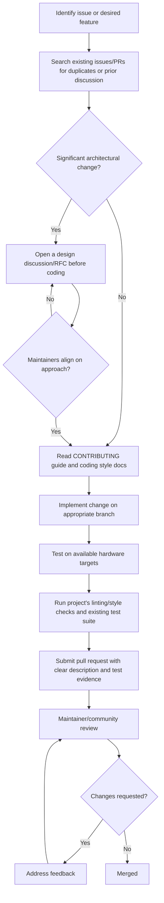

## Contributing to Open-Source Embedded Projects

### Overview

Open-source embedded projects — RTOSes, hardware abstraction layers, board support packages, driver libraries, and full frameworks like Zephyr, FreeRTOS, PlatformIO, or MicroPython — form much of the foundation embedded developers build on. Contributing to these projects differs meaningfully from general open-source software contribution because embedded code interacts directly with physical hardware, carries hard real-time and resource constraints, and often requires access to specific target hardware to properly validate a change. Understanding both the general open-source contribution process and the embedded-specific technical and community expectations is necessary to contribute effectively rather than having submissions repeatedly rejected or ignored.

### Why Embedded Open-Source Contribution Has Distinct Challenges

**Key Points**
- A patch that compiles and passes on one target microcontroller may fail silently or behave incorrectly on another target the maintainers support, since embedded projects typically support many different hardware targets with genuinely different peripheral behavior, memory layouts, and timing characteristics.
- Resource constraints (flash size, RAM, real-time deadlines) mean a contribution's code size and execution time overhead are often scrutinized as heavily as its correctness, unlike many general-purpose software projects where these concerns are secondary.
- Hardware-in-the-loop testing is frequently required to validate a change, but many potential contributors do not own every target board a project supports, creating a structural barrier to broad multi-target validation that pure-software projects do not face.
- Embedded projects often carry stricter backward compatibility and stability expectations for released versions, since a regression can mean a shipped product silently breaks in the field with no easy end-user recovery path, unlike a desktop application that can simply be updated.

### Understanding a Project's Structure and Governance

- **Maintainer/reviewer structure**: Most sizable embedded open-source projects have designated maintainers per subsystem (a specific chip family's HAL, a particular driver category, core scheduler code), and understanding who owns the relevant area before submitting helps target the right reviewers and set appropriate expectations for review turnaround.
- **Contribution guidelines documents**: Nearly all well-run projects publish a CONTRIBUTING file or equivalent describing coding style, commit message conventions, testing expectations, and the review/merge process — reading this before submitting anything is a baseline expectation, not an optional step.
- **Governance model**: Some projects (e.g., those under a foundation like the Linux Foundation, which hosts several embedded RTOS projects) have formal technical steering committees and working groups, while others remain more informally maintainer-led; understanding which model applies affects how architectural decisions get made and who can approve them.
- **Release cadence and branching strategy**: Understanding whether a project uses long-term support (LTS) branches, how feature work targets a development branch versus a stable branch, and where a specific contribution should be targeted avoids submitting work against the wrong branch.

### Types of Contributions Beyond Code

**Example**
Common non-code (or lighter-weight code) contribution paths that are often more approachable for a new contributor than a core architectural change:
1. **Documentation improvements**: Clarifying setup instructions, fixing outdated build steps, or improving API documentation, which is genuinely valued and carries lower review risk than functional code changes.
2. **New board support packages**: Adding support for a specific development board or chip variant not yet supported, which is often a well-defined, additive contribution that doesn't require modifying shared core logic.
3. **Bug reports with minimal reproduction cases**: A well-documented, minimal reproduction of a bug (exact hardware, exact steps, exact observed versus expected behavior) is a valuable contribution even without an accompanying fix.
4. **Example/sample application contributions**: Demonstrating a peripheral or feature's correct usage pattern, which helps other users and is typically lower-risk to review than changes to shared driver code.
5. **Test coverage additions**: Adding unit tests, hardware-in-the-loop test cases, or CI configuration for a target that lacks automated coverage.

### Technical Expectations for Embedded Code Contributions

#### Coding Standards and Style

- Most embedded C/C++ projects enforce a specific coding style (often via an automated linter/formatter configuration included in the repository) and reviewers will typically request style compliance before reviewing functional correctness.
- Naming conventions, especially around hardware register access and peripheral abstraction, often follow project-specific patterns that may differ from a contributor's own habitual style; matching the existing codebase's conventions is expected rather than optional stylistic preference.

#### Portability and Hardware Abstraction

- Contributions touching shared/core code are generally expected to preserve portability across all currently supported targets, not just the target the contributor personally tested on, meaning platform-specific code should be properly isolated behind the project's existing hardware abstraction boundaries rather than introduced as inline conditionals scattered through shared logic.
- Reviewers commonly flag contributions that work correctly on the contributor's specific target but make assumptions (endianness, register width, peripheral timing behavior) that would break on other supported architectures.

#### Resource Footprint Awareness

- Many embedded projects run automated or manual checks on code size (flash/RAM footprint) impact for a proposed change, since even a modest increase can be significant for resource-constrained targets at the low end of the project's supported hardware range.
- Contributors are often expected to report or allow measurement of the footprint delta their change introduces, particularly for changes to code paths compiled into most or all configurations.

#### Real-Time and Concurrency Correctness

- Changes touching interrupt service routines, scheduler code, or shared data structures accessed from multiple execution contexts require careful attention to atomicity and locking, since a race condition introduced here can be intermittent and extremely difficult to diagnose after merge.
- Reviewers in mature embedded projects often scrutinize timing-sensitive code changes more heavily than equivalent-looking changes in non-timing-critical application logic, and contributors should expect and prepare for this level of scrutiny rather than treating it as excessive.

### Contribution Workflow

### Testing and Validation Before Submission

**Key Points**
- Testing on real hardware, not just in a simulator or QEMU-based environment, is often expected for hardware-facing changes, since simulators frequently do not model every peripheral timing quirk or errata-driven behavior accurately.
- When a contributor cannot personally test on every affected target, being transparent about exactly which targets were tested (and which were not) in the pull request description allows maintainers and other community members with access to untested hardware to help validate rather than assuming full coverage was achieved.
- Continuous integration (CI) systems in mature embedded projects sometimes include actual hardware-in-the-loop test farms that automatically run a submitted change against real target boards; understanding whether a project has this capability shapes how much manual multi-target testing a contributor needs to do themselves before submission.
- Including specific test evidence in a pull request (console output, measured timing, a description of the exact test performed) is generally received better by maintainers than an unsubstantiated claim that "this works."

### Communication Norms in Embedded Open-Source Communities

- **Mailing lists, chat platforms, and issue trackers**: Different projects favor different primary communication channels (some still rely heavily on mailing lists, particularly older or Linux-kernel-adjacent embedded projects, while others use GitHub issues/discussions or a chat platform); using the project's actual preferred channel rather than defaulting to a personal preference improves the chance of engagement.
- **Patch review culture**: Some communities (again, particularly those with roots in kernel-style development) have a direct, technically blunt review culture that is not intended as personal criticism, while others maintain a more explicitly softened tone; understanding the specific community's norms before participating avoids misreading feedback tone.
- **Licensing awareness**: Understanding the project's license (and any contributor license agreement or developer certificate of origin requirement) before contributing is a baseline responsibility, since license incompatibility between a contributor's code and the project's license can block a contribution entirely regardless of its technical quality.
- **Patience with review timelines**: Embedded project maintainers are frequently volunteers or engineers with limited bandwidth for open-source review alongside their primary job, so review turnaround can be considerably slower than for well-resourced commercial software projects, and following up politely after a reasonable interval is more effective than repeated immediate pings.

### Building Long-Term Contributor Relationships

- Starting with smaller, well-scoped contributions (a documentation fix, a new board support package, a narrowly-scoped bug fix) before attempting a large architectural change tends to build the reviewer trust and familiarity with a contributor's work that makes larger contributions go more smoothly later. [Inference] — this is a general pattern observed across many open-source communities rather than a formal requirement of any specific project.
- Engaging in design discussions and issue triage (not just submitting code) helps a contributor understand the project's priorities and constraints, which in turn improves the likelihood that future code contributions align with what maintainers actually want.
- Some projects have a formal path from occasional contributor to committer/maintainer status, typically based on a sustained track record of quality contributions and community engagement over time, though the specific criteria and process vary significantly by project governance model.

### Common Pitfalls

- Submitting a large, unscoped pull request without first discussing the approach with maintainers, resulting in significant rework or outright rejection after substantial effort has already been invested.
- Testing a change only on the contributor's own target hardware and presenting it as broadly validated, when the change touches shared code affecting other supported targets.
- Ignoring the project's established coding style and conventions, causing reviewers to spend review effort on style issues rather than substantive technical feedback.
- Introducing platform-specific assumptions into shared/core code instead of properly using the project's existing hardware abstraction layer.
- Underestimating the real-time/concurrency review scrutiny that changes to interrupt or scheduler-adjacent code will receive, and being unprepared to address detailed feedback on atomicity or locking correctness.
- Disappearing after submitting a pull request instead of responsively addressing reviewer feedback, which frequently causes a contribution to stall and eventually be closed as abandoned.

### Related Topics

- Collaborating with hardware and firmware teams
- Hardware abstraction layer (HAL) design patterns
- Real-time operating system (RTOS) scheduling and concurrency
- Reading and interpreting component datasheets
- Board support package (BSP) development
- Continuous integration for embedded hardware-in-the-loop testing
- Documentation for production handoff
- Version control and branching strategies for embedded firmware