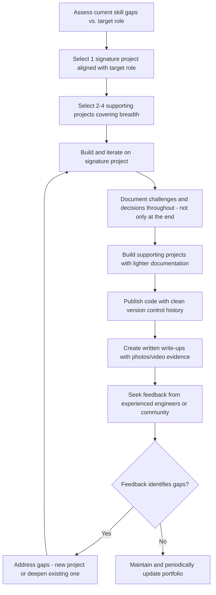

## Building a Personal Project Portfolio

### Overview

A personal project portfolio for embedded devices is a curated collection of hands-on work that demonstrates practical competency across the hardware-firmware-software stack, serving as tangible evidence of skill for job applications, freelance opportunities, or personal skill tracking. Unlike a resume's list of claimed skills, a portfolio provides verifiable, inspectable proof: working code, documented design decisions, and often physical or video evidence that a project genuinely functions as described. Building an effective portfolio requires deliberate project selection, thorough documentation, and honest representation of what was actually accomplished versus what remains aspirational.

### Why a Portfolio Matters for Embedded Careers

**Key Points**
- Embedded systems roles often require demonstrable experience across multiple layers (schematic design, firmware, debugging with lab equipment) that is difficult to convey through a resume bullet point alone, making a portfolio disproportionately valuable compared to some purely software-focused fields.
- Hiring managers and technical interviewers frequently use portfolio projects as a starting point for technical discussion, probing design decisions and trade-offs rather than treating the portfolio as a simple checklist of completed items.
- A well-documented portfolio project can substitute, to some degree, for formal work experience when a candidate is early-career or transitioning from an adjacent field, since it demonstrates initiative and genuine hands-on capability rather than only theoretical knowledge.
- An honest portfolio (clearly distinguishing completed, working functionality from planned or partially-implemented features) builds more credibility in technical interviews than an inflated one, since experienced interviewers routinely probe for exactly this distinction.

### Selecting Projects That Demonstrate Range

#### Breadth Across the Embedded Stack

A portfolio that only shows one type of project (e.g., only Arduino sketches controlling LEDs) demonstrates far less than a set of projects collectively covering:

- **Custom PCB design**: At least one project involving schematic capture and PCB layout (even a simple board) demonstrates hardware design capability beyond using pre-built development boards.
- **Firmware from bare metal or a lightweight RTOS**: A project written without relying entirely on a high-level framework (e.g., direct register manipulation or interrupt-driven code rather than only Arduino's abstracted API) demonstrates lower-level understanding.
- **Communication protocols and peripheral interfacing**: Projects exercising I2C, SPI, UART, or wireless protocols with real sensors or external devices show interfacing competency beyond blinking an onboard LED.
- **Power-conscious or resource-constrained design**: A project explicitly addressing power consumption (battery-powered, sleep modes) or working within a tightly constrained memory budget demonstrates awareness of real embedded constraints, not just functional correctness on an unconstrained development board.
- **End-to-end system integration**: At least one project that ties hardware, firmware, and some form of higher-level software (a mobile app, a cloud dashboard, a local GUI) together demonstrates the ability to work across a full system, which is often closer to what a professional role actually requires than an isolated firmware exercise.

#### Depth on at Least One Signature Project

**Key Points**
- A single project taken further than a weekend prototype — through multiple design iterations, real debugging challenges, and polished documentation — often demonstrates more to a reviewer than five shallow projects that each stopped at "it blinks."
- A signature project benefits from including evidence of iteration: what didn't work initially, what was changed, and why, since this narrative demonstrates genuine problem-solving rather than a single successful attempt presented without context.
- Choosing a signature project aligned with the type of role being pursued (e.g., a battery-powered sensor node for an IoT-focused role, a motor control project for a robotics-focused role) helps a reviewer immediately see relevance rather than requiring them to infer transferability.

### Portfolio Project Category Map

<svg xmlns="http://www.w3.org/2000/svg" viewBox="0 0 740 400">
  \<style\>
    .title { font: bold 16px sans-serif; fill: #1a1a1a; }
    .cat-title { font: bold 13px sans-serif; fill: #1a1a1a; }
    .item { font: 12px sans-serif; fill: #333; }
    .cat-box { fill: #eef3fb; stroke: #2c3e50; stroke-width: 1.5; }
  \</style\>
  <text x="370" y="26" text-anchor="middle" class="title">Portfolio Coverage Areas (svg_diagram)</text>

  <rect x="30" y="60" width="220" height="140" rx="8" class="cat-box" />
  <text x="140" y="85" text-anchor="middle" class="cat-title">Hardware Design</text>
  <text x="45" y="110" class="item">- Custom PCB (schematic + layout)</text>
  <text x="45" y="130" class="item">- Power supply design</text>
  <text x="45" y="150" class="item">- Sensor/analog front-end</text>
  <text x="45" y="170" class="item">- Enclosure/mechanical integration</text>

  <rect x="270" y="60" width="220" height="140" rx="8" class="cat-box" />
  <text x="380" y="85" text-anchor="middle" class="cat-title">Firmware</text>
  <text x="285" y="110" class="item">- Bare-metal/register-level code</text>
  <text x="285" y="130" class="item">- RTOS-based application</text>
  <text x="285" y="150" class="item">- Low-power/sleep mode design</text>
  <text x="285" y="170" class="item">- Bootloader/OTA update logic</text>

  <rect x="510" y="60" width="220" height="140" rx="8" class="cat-box" />
  <text x="620" y="85" text-anchor="middle" class="cat-title">Connectivity</text>
  <text x="525" y="110" class="item">- I2C/SPI/UART peripherals</text>
  <text x="525" y="130" class="item">- Wireless protocol (BLE/Wi-Fi/LoRa)</text>
  <text x="525" y="150" class="item">- Cloud/backend integration</text>
  <text x="525" y="170" class="item">- Mobile/web companion app</text>

  <rect x="150" y="230" width="220" height="130" rx="8" class="cat-box" />
  <text x="260" y="255" text-anchor="middle" class="cat-title">Testing/Rigor</text>
  <text x="165" y="280" class="item">- Automated unit/HIL tests</text>
  <text x="165" y="300" class="item">- Documented debugging process</text>
  <text x="165" y="320" class="item">- Version control history</text>

  <rect x="390" y="230" width="220" height="130" rx="8" class="cat-box" />
  <text x="500" y="255" text-anchor="middle" class="cat-title">Communication</text>
  <text x="405" y="280" class="item">- Written build documentation</text>
  <text x="405" y="300" class="item">- Photos/video demonstration</text>
  <text x="405" y="320" class="item">- Design decision rationale</text>
</svg>

### Documentation Standards for Portfolio Projects

**Example**
A representative documentation structure for a single portfolio project (e.g., a README or project write-up):
1. **Problem statement/motivation**: Why the project was built, what need or curiosity it addresses.
2. **System overview**: A block diagram or short description of the overall architecture (hardware blocks, firmware structure, any connected software).
3. **Hardware design details**: Schematic/PCB screenshots or files, component selection rationale for any non-obvious choices.
4. **Firmware architecture**: Structure of the code, key design decisions (e.g., interrupt-driven vs. polling, RTOS task structure if applicable).
5. **Challenges and debugging narrative**: Specific problems encountered and how they were diagnosed and resolved — this section is often what most differentiates a genuinely instructive portfolio entry from a bare project listing.
6. **Results and demonstration**: Photos, video, or captured data showing the project actually working, ideally with enough specificity (measured values, a demo video) that a skeptical reviewer can verify the claim.
7. **Known limitations and future work**: Honest acknowledgment of what does not yet work or what would be improved with more time, which paradoxically increases credibility rather than undermining it.

### Version Control and Code Presentation

- Hosting project code in a public version control repository (with a real, incremental commit history rather than a single "initial commit" dump) allows a reviewer to see actual development process, not just a final state.
- Commit messages that describe what changed and why, even in a personal project, demonstrate professional habits that transfer directly to how a reviewer expects the candidate to work on a team.
- Organizing repository structure clearly (separating hardware design files, firmware source, and documentation into sensible directories) makes a project easier for an unfamiliar reviewer to navigate quickly, which matters given how little time a reviewer typically spends per portfolio entry.
- Including a build/setup guide (what toolchain, what hardware is needed, how to reproduce the build) allows a sufficiently motivated reviewer to actually attempt to replicate the project, which is a stronger validation signal than a description alone.

### Video and Physical Demonstration Evidence

**Key Points**
- A short video demonstrating a project actually functioning (not just static photos) is often more convincing than any amount of written description, particularly for projects involving physical motion, real-time response, or sensor interaction.
- Showing, rather than only describing, a debugging moment (e.g., an oscilloscope capture referenced in the write-up, or briefly showing a logic analyzer trace in a video) reinforces that genuine hands-on lab work occurred.
- For projects involving a custom PCB, photos of the actual assembled, populated board (not just the CAD rendering) demonstrate that the design was carried through to physical realization, not left as an unbuilt design exercise.

### Portfolio Development Timeline Approach

### Presenting the Portfolio Effectively

- A simple, fast-loading personal website or a well-organized version control profile page listing projects with brief summaries and links tends to be more effective than requiring a reviewer to dig through an unstructured collection of repositories to understand what exists.
- Leading with the signature/deepest project rather than burying it among lighter ones ensures a time-constrained reviewer sees the strongest evidence first.
- Tailoring which projects are emphasized (without fabricating anything) for a specific application — highlighting the wireless sensor project when applying to an IoT-focused role, for instance — is a reasonable and common practice, distinct from misrepresenting what was built.
- Being prepared to discuss any listed project in technical depth during an interview is essential, since a project that cannot withstand follow-up questioning about its actual implementation undermines credibility more than not listing it at all.

### Common Pitfalls

- Filling a portfolio with many shallow, near-identical projects (e.g., multiple simple LED/sensor demos) instead of demonstrating range and at least one project with real depth.
- Presenting a tutorial-followed project as original work without acknowledging its source or explaining what was learned or modified beyond the tutorial's exact steps.
- Omitting the debugging/challenges narrative, which is often the most technically informative and differentiating part of a project write-up.
- Publishing code with no commit history, no documentation, and no build instructions, making it effectively unreviewable by anyone who was not already present during development.
- Overstating a project's completeness or functionality in a way that does not survive detailed technical questioning in an interview setting.
- Neglecting to update or maintain a portfolio over time, leaving it to reflect only early-career skill level well after significant further growth has occurred.

### Related Topics

- Contributing to open-source embedded projects
- Collaborating with hardware and firmware teams
- Design for manufacturing and assembly
- Reading and interpreting component datasheets
- Version control and branching strategies for embedded firmware
- Technical interview preparation for embedded roles
- Documentation for production handoff