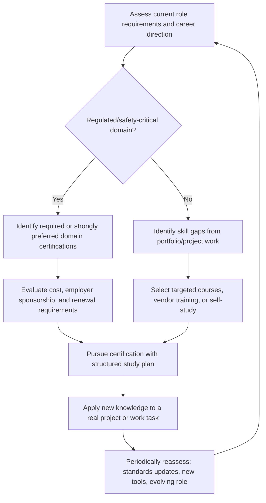

## Industry Certifications and Continuing Education

### Overview

Industry certifications and continuing education encompass the formal and semi-formal credentials, courses, and ongoing learning activities embedded engineers pursue to validate skills, meet employer or regulatory requirements, and keep pace with a field where tools, standards, and best practices evolve continuously. Unlike some software domains where a portfolio and interview performance dominate hiring decisions, certain embedded sub-fields (functional safety, automotive, aerospace, medical devices) place meaningful weight on formal certifications, since these domains carry regulatory and liability requirements that a portfolio project alone cannot satisfy. Understanding which credentials carry real weight, which are primarily vendor marketing, and how to structure ongoing learning is important for career development in this field.

### Distinguishing Certification Types by Purpose

**Key Points**
- **Vendor/product-specific certifications** validate proficiency with a specific company's tools or platforms (e.g., a specific RTOS vendor's certification program) and are most valuable when targeting roles that specifically use that vendor's ecosystem.
- **Domain/standards-based certifications** validate knowledge of a body of engineering practice tied to a formal standard (e.g., functional safety standards) and often carry weight specifically because they are tied to regulatory or contractual requirements in safety-critical industries.
- **General professional engineering credentials** (such as a Professional Engineer license, where applicable) are broader engineering credentials not specific to embedded systems but relevant in some jurisdictions and industries for engineers who stamp/approve certain classes of work.
- **Academic continuing education** (university extension courses, online degree-adjacent programs) sits between informal learning and formal certification, sometimes carrying academic credit and sometimes not, depending on the specific program.

### Functional Safety Certifications

Functional safety is one of the areas where formal certification carries substantial, sometimes legally significant, weight in embedded careers.

- **IEC 61508**: The base functional safety standard for electrical/electronic/programmable electronic safety-related systems, underlying many industry-specific derivative standards.
- **ISO 26262**: The automotive-specific functional safety standard, and one of the most commonly pursued functional safety certifications for embedded engineers targeting automotive roles, given how deeply automotive suppliers have integrated this standard into their development processes.
- **IEC 62304**: Governs software lifecycle processes for medical device software, relevant for embedded engineers working in medical device companies.
- **DO-178C**: Governs software considerations in airborne systems certification, relevant for embedded engineers in aerospace applications.
- Training and certification for these standards is typically offered by specialized third-party training organizations (e.g., TÜV-affiliated bodies for several of these standards) rather than being purely academic; completing such training and obtaining a recognized certificate (e.g., becoming a "TÜV-certified functional safety engineer" for a specific standard) is often either required or strongly preferred by employers in these regulated industries. [Inference] — the exact certification providers, requirements, and their weight in hiring decisions vary by employer, region, and the specific standard, and should be researched against current industry practice for the target sector.

### Real-Time Operating System and Vendor-Specific Certifications

- Several RTOS and embedded software vendors (and some silicon vendors) offer their own certification or training completion programs tied to their specific platform, which can be a reasonable investment when a target role or industry has a strong dependency on that specific vendor's ecosystem.
- The value of a vendor-specific certification is generally scoped narrowly to roles actually using that vendor's platform, and should not be treated as broadly transferable evidence of general embedded competency in the way a portfolio project or a standards-based safety certification might be. [Inference] — the relative hiring value of vendor certifications versus demonstrated project experience varies significantly by employer and role, and is a matter of ongoing debate within the field rather than settled consensus.
- Some certifications are tied to specific processor architecture vendors (covering architecture-specific optimization, debugging, or security features), which can be particularly relevant for roles doing deep, architecture-specific low-level work.

### Certification Landscape by Domain

<svg xmlns="http://www.w3.org/2000/svg" viewBox="0 0 740 400">
  \<style\>
    .title { font: bold 16px sans-serif; fill: #1a1a1a; }
    .cat-title { font: bold 13px sans-serif; fill: #1a1a1a; }
    .item { font: 12px sans-serif; fill: #333; }
    .cat-box { fill: #eef3fb; stroke: #2c3e50; stroke-width: 1.5; }
  \</style\>
  <text x="370" y="26" text-anchor="middle" class="title">Certification and Credential Landscape (svg_diagram)</text>

  <rect x="30" y="60" width="220" height="150" rx="8" class="cat-box" />
  <text x="140" y="85" text-anchor="middle" class="cat-title">Functional Safety</text>
  <text x="45" y="110" class="item">- IEC 61508 (base standard)</text>
  <text x="45" y="130" class="item">- ISO 26262 (automotive)</text>
  <text x="45" y="150" class="item">- IEC 62304 (medical software)</text>
  <text x="45" y="170" class="item">- DO-178C (aerospace)</text>
  <text x="45" y="190" class="item">- Often TÜV-administered training</text>

  <rect x="270" y="60" width="220" height="150" rx="8" class="cat-box" />
  <text x="380" y="85" text-anchor="middle" class="cat-title">Vendor/Platform</text>
  <text x="285" y="110" class="item">- RTOS vendor certifications</text>
  <text x="285" y="130" class="item">- Silicon vendor architecture</text>
  <text x="285" y="150" class="item">  certifications</text>
  <text x="285" y="170" class="item">- Cloud IoT platform badges</text>
  <text x="285" y="190" class="item">- Narrowly scoped relevance</text>

  <rect x="510" y="60" width="220" height="150" rx="8" class="cat-box" />
  <text x="620" y="85" text-anchor="middle" class="cat-title">General Engineering</text>
  <text x="525" y="110" class="item">- Professional Engineer (PE)</text>
  <text x="525" y="130" class="item">  license, where applicable</text>
  <text x="525" y="150" class="item">- Six Sigma/quality credentials</text>
  <text x="525" y="170" class="item">- Project management (PMP)</text>

  <rect x="150" y="240" width="220" height="130" rx="8" class="cat-box" />
  <text x="260" y="265" text-anchor="middle" class="cat-title">Security-Adjacent</text>
  <text x="165" y="290" class="item">- Embedded security training</text>
  <text x="165" y="310" class="item">- General security certifications</text>
  <text x="165" y="330" class="item">  (e.g., relevant to IoT security)</text>

  <rect x="390" y="240" width="220" height="130" rx="8" class="cat-box" />
  <text x="500" y="265" text-anchor="middle" class="cat-title">Continuing Education</text>
  <text x="405" y="290" class="item">- University extension courses</text>
  <text x="405" y="310" class="item">- Online specialized courses</text>
  <text x="405" y="330" class="item">- Conference workshops</text>
</svg>

### Evaluating Whether a Certification Is Worth Pursuing

**Example**
A practical evaluation checklist before committing time and (often significant) cost to a certification:
1. Does the target industry or role explicitly list this certification as required or strongly preferred in job postings, or is its value assumed rather than confirmed?
2. Is the certifying body recognized and respected within the specific target industry (e.g., TÜV recognition for functional safety), or is it a lesser-known credential of uncertain standing?
3. What is the cost in both money and time, and does the employer offer to sponsor or reimburse it, which is common for domain-specific safety certifications given their direct relevance to regulated employer obligations?
4. Does pursuing the certification also build genuinely useful, transferable knowledge (as functional safety training typically does), or is the primary value the credential itself with comparatively little transferable substance?
5. Is there a renewal or continuing-education requirement to maintain the certification, and is that ongoing commitment sustainable given other priorities?

### Continuing Education Beyond Formal Certification

**Key Points**
- **Conference attendance and workshops**: Embedded-focused conferences often include hands-on workshops covering emerging tools, standards updates, or specific technical deep-dives not readily available elsewhere, and provide networking value alongside direct technical content.
- **Vendor webinars and documentation updates**: Component and tool vendors frequently publish webinars covering new product lines or updated best practices; following relevant vendors' technical content is a low-cost way to stay current on tools directly used in one's work.
- **Standards body updates**: Following updates to relevant standards (new revisions of IEC 61508-derivative standards, updated RoHS substance lists, evolving cybersecurity regulations for connected devices) is necessary ongoing diligence for engineers in regulated domains, since standards are revised periodically and design/process compliance must track those revisions. [Inference] — the frequency and materiality of standards revisions varies by specific standard and domain.
- **Reading source material directly**: For core embedded skills, reading primary sources (chip datasheets, reference manuals, RTOS documentation, relevant academic or industry papers) remains a foundational continuing education activity that no certification substitutes for.

### Structuring an Ongoing Learning Practice

### Employer-Sponsored vs. Self-Directed Learning

- Many employers, particularly in regulated industries, sponsor or fully fund functional safety and domain-specific certifications directly, since the certification benefits the employer's own regulatory compliance posture, not only the individual engineer's career.
- Self-directed continuing education (online courses, personal projects, independent reading) remains valuable even when not tied to a formal credential, particularly for staying current on rapidly evolving areas (wireless protocols, security practices, new microcontroller architectures) where formal certification programs may lag behind the pace of actual industry change.
- Balancing employer-sponsored certification pursuit against self-directed learning aligned with personal career interests is a individual decision that depends on current role requirements, career goals, and available time/energy outside primary work responsibilities.

### Certification Renewal and Currency

**Key Points**
- Many domain-specific certifications (particularly functional safety certifications) require periodic renewal, sometimes involving continuing education credits, re-examination, or demonstrated ongoing practice in the field, rather than being a one-time credential valid indefinitely.
- Allowing a safety-critical certification to lapse can have direct professional consequences in regulated industries where the certification is a stated job requirement, making renewal tracking a genuine professional responsibility rather than an optional administrative task.
- Vendor-specific certifications may become less relevant if the underlying platform is deprecated, superseded, or if a career shifts away from that specific vendor's ecosystem, meaning their long-term value is more contingent on continued platform relevance than a standards-based certification's value typically is.

### Common Pitfalls

- Pursuing a vendor-specific certification primarily because it appears on a general "top embedded certifications" list, without confirming it is actually valued by target employers or roles.
- Treating a functional safety certification as purely a credential to obtain rather than engaging with the substantial genuinely useful process and engineering discipline knowledge the training conveys.
- Allowing a required certification to lapse due to missed renewal deadlines or unmet continuing education requirements, creating an avoidable professional gap.
- Neglecting informal continuing education (datasheets, reference manuals, standards updates) under the assumption that formal certifications alone are sufficient to stay current.
- Overestimating the broad transferability of a narrow, vendor-specific certification when discussing qualifications for roles outside that vendor's specific ecosystem.
- Investing significant time or cost into a certification without first confirming employer sponsorship availability or genuine market demand for that specific credential in the target field.

### Related Topics

- Functional safety standards and development processes (IEC 61508, ISO 26262)
- Building a personal project portfolio
- Contributing to open-source embedded projects
- Certification processes for products (FCC, CE, and regional equivalents)
- Documentation for production handoff
- Collaborating with hardware and firmware teams
- Reading and interpreting component datasheets