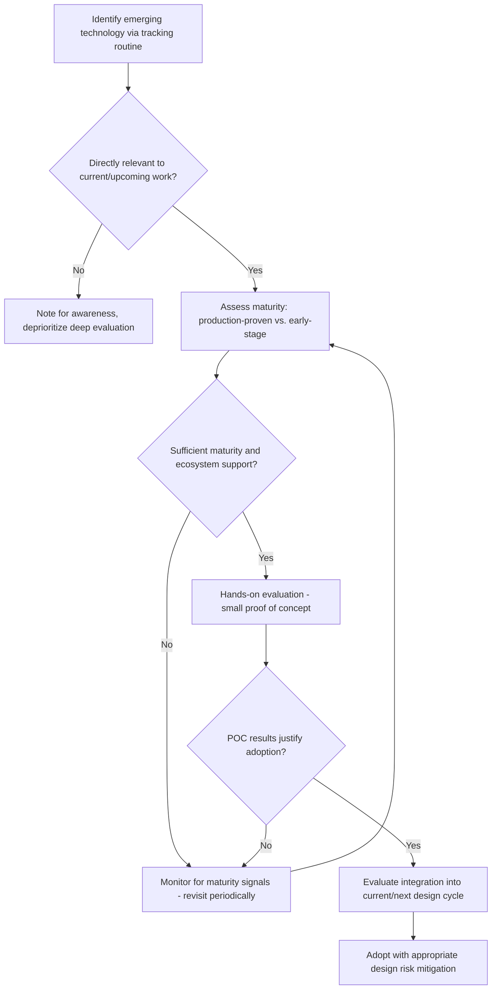

## Staying Current with Emerging Embedded Technologies

### Overview

Staying current with emerging embedded technologies is the ongoing practice of tracking new microcontroller architectures, wireless protocols, development tools, silicon capabilities, and industry trends so an engineer's skills and design decisions remain relevant rather than anchored to what was standard practice years earlier. Embedded systems evolve on multiple timescales simultaneously: silicon and process nodes shift over multi-year cycles, wireless standards and protocol stacks update more frequently, and tooling/software ecosystems can shift within a year or two. A deliberate, structured approach to tracking these changes is more effective than passive exposure, since the volume of information available (vendor marketing, technical papers, community discussion, standards documents) far exceeds what can be absorbed without some filtering strategy.

### Why Deliberate Tracking Matters in Embedded Specifically

**Key Points**
- Embedded design decisions (microcontroller family selection, wireless protocol choice, RTOS selection) tend to lock a product into a technology stack for years, making it costly to discover after the fact that a better-suited option existed but was unknown at design time.
- Security-relevant developments (newly disclosed vulnerability classes, updated cryptographic guidance, protocol-level flaws in widely-used wireless stacks) require faster awareness than general feature-tracking, since a delay in awareness directly extends a product's exposure window.
- Unlike some software fields where frameworks change primarily at the application layer, embedded changes can occur at the silicon level (new core architectures, new peripheral IP blocks) that require lower-level understanding to evaluate properly, not just awareness that "something new exists."
- The specific technologies worth tracking closely differ meaningfully by an individual's sub-specialization (a low-power IoT engineer and a high-performance edge AI engineer have substantially different "must track" lists), making a personally curated tracking approach more valuable than a generic one.

### Categories of Change Worth Monitoring

#### Silicon and Architecture Trends

- New microcontroller core architectures or significant revisions (e.g., new instruction set extensions, new core generations from major architecture licensors) periodically shift the performance/power/cost trade-off landscape available to designers.
- Increasing integration of specialized hardware blocks (dedicated AI/ML acceleration units, hardware security modules, advanced power management blocks) directly on general-purpose microcontrollers changes what used to require a discrete companion chip.
- Advances in ultra-low-power design (new low-power modes, improved sleep current figures, energy-harvesting-compatible power architectures) are particularly relevant for battery-powered and energy-harvested IoT applications.

#### Wireless and Connectivity Protocol Evolution

- Wireless standards bodies periodically release new protocol versions (e.g., successive Bluetooth Low Energy revisions, Wi-Fi generational updates, evolving LPWAN standards) that can introduce meaningful new capabilities (extended range, improved power efficiency, mesh networking features) relevant to product design decisions.
- Newer low-power wide-area network (LPWAN) technologies and evolving cellular IoT standards (e.g., ongoing evolution of NB-IoT and LTE-M category devices) shift the trade-off landscape for long-range, low-power connectivity design choices.
- Matter and other cross-ecosystem smart-home interoperability standards represent an evolving area where protocol maturity and ecosystem adoption both matter to a design decision, not just the technical specification alone. [Inference] — the pace and extent of real-world ecosystem adoption for interoperability standards is inherently harder to predict than the publication of the technical specification itself, and should be evaluated against current market adoption data rather than specification publication alone.

#### Software Tooling and Development Practices

- Evolution in embedded-focused programming language adoption (for example, growing interest in memory-safe systems languages for embedded contexts) represents an ongoing area of debate and gradual practice shift rather than a settled transition, and awareness of this trend is useful even without immediate adoption. [Inference] — the actual pace and extent of adoption of newer languages in mainstream embedded development remains an evolving and debated topic within the field rather than a completed transition.
- Continuous integration and hardware-in-the-loop testing tooling for embedded has matured significantly, and staying aware of improved testing infrastructure options can meaningfully improve a team's development practice even without a hardware or protocol-level change driving it.
- Cloud-based device management, OTA update platforms, and IoT backend services continue to evolve, affecting field maintenance strategy decisions made at design time.

### Emerging Technology Tracking Landscape

<svg xmlns="http://www.w3.org/2000/svg" viewBox="0 0 740 400">
  \<style\>
    .title { font: bold 16px sans-serif; fill: #1a1a1a; }
    .cat-title { font: bold 13px sans-serif; fill: #1a1a1a; }
    .item { font: 12px sans-serif; fill: #333; }
    .cat-box { fill: #eef3fb; stroke: #2c3e50; stroke-width: 1.5; }
  \</style\>
  <text x="370" y="26" text-anchor="middle" class="title">Areas of Ongoing Embedded Technology Change (svg_diagram)</text>

  <rect x="30" y="60" width="220" height="150" rx="8" class="cat-box" />
  <text x="140" y="85" text-anchor="middle" class="cat-title">Silicon/Architecture</text>
  <text x="45" y="110" class="item">- New core generations/ISA extensions</text>
  <text x="45" y="130" class="item">- On-chip AI/ML acceleration</text>
  <text x="45" y="150" class="item">- Integrated security blocks</text>
  <text x="45" y="170" class="item">- Ultra-low-power advances</text>
  <text x="45" y="190" class="item">- Energy harvesting compatibility</text>

  <rect x="270" y="60" width="220" height="150" rx="8" class="cat-box" />
  <text x="380" y="85" text-anchor="middle" class="cat-title">Connectivity</text>
  <text x="285" y="110" class="item">- BLE/Wi-Fi generational updates</text>
  <text x="285" y="130" class="item">- LPWAN evolution</text>
  <text x="285" y="150" class="item">- Cellular IoT categories</text>
  <text x="285" y="170" class="item">- Interoperability standards</text>
  <text x="285" y="190" class="item">  (e.g., Matter)</text>

  <rect x="510" y="60" width="220" height="150" rx="8" class="cat-box" />
  <text x="620" y="85" text-anchor="middle" class="cat-title">Tooling/Practices</text>
  <text x="525" y="110" class="item">- Memory-safe language adoption</text>
  <text x="525" y="130" class="item">- HIL/CI testing infrastructure</text>
  <text x="525" y="150" class="item">- Cloud device management platforms</text>
  <text x="525" y="170" class="item">- OTA update frameworks</text>

  <rect x="150" y="240" width="220" height="130" rx="8" class="cat-box" />
  <text x="260" y="265" text-anchor="middle" class="cat-title">Security</text>
  <text x="165" y="290" class="item">- Vulnerability disclosures</text>
  <text x="165" y="310" class="item">- Cryptographic guidance updates</text>
  <text x="165" y="330" class="item">- Regulatory security mandates</text>

  <rect x="390" y="240" width="220" height="130" rx="8" class="cat-box" />
  <text x="500" y="265" text-anchor="middle" class="cat-title">Standards/Regulation</text>
  <text x="405" y="290" class="item">- Certification requirement changes</text>
  <text x="405" y="310" class="item">- Environmental/materials regulation</text>
  <text x="405" y="330" class="item">- Cybersecurity mandates (e.g., RED)</text>
</svg>

### Information Sources and How to Filter Them

**Key Points**
- **Silicon vendor announcements and datasheets**: Direct from the source and generally reliable for factual capability claims, though naturally presented with a marketing framing that should be weighed against independent evaluation before treating a new part as a design decision driver.
- **Standards body publications**: The most authoritative source for protocol and regulatory changes, though often dense and slower-paced to read than summarized secondary coverage; worth monitoring directly for anything that could trigger a re-certification or compliance obligation.
- **Independent technical press and analysis**: Can provide useful synthesis and critical perspective vendor marketing does not, though quality varies significantly across outlets and should be cross-referenced against primary sources for anything design-decision-critical.
- **Community forums, conference talks, and open-source project activity**: Often surface practical, real-world experience with emerging technology faster than formal publications, though this input should be weighted as informal and unverified rather than authoritative, consistent with how community input is treated when evaluating vendor application notes.
- **Academic and industry research papers**: Particularly relevant for genuinely emerging areas (e.g., novel low-power techniques, new security research affecting embedded systems) that have not yet reached mainstream commercial tooling or documentation.

### A Structured Approach to Ongoing Tracking

**Example**
A representative structured tracking routine an embedded engineer might adopt:
1. **Weekly**: Skim a curated set of newsletters, subscribed vendor announcement feeds, or relevant subreddit/forum activity for the specific sub-specialization area, spending limited time (e.g., 30–60 minutes) rather than open-ended browsing.
2. **Monthly**: Read one or two deeper technical articles, application notes, or conference talk recordings on a specific emerging topic relevant to current or upcoming work.
3. **Quarterly**: Review whether any tracked development (a new part, protocol revision, security disclosure) is significant enough to warrant deeper evaluation or a proof-of-concept experiment.
4. **Annually**: Attend at least one relevant conference or equivalent virtual event, and review whether current toolchain/platform choices remain well-justified against the current landscape or whether it's time to evaluate an alternative.

### Balancing Depth vs. Breadth in Tracking

- Attempting to track every emerging development across all embedded sub-fields is generally impractical and leads to shallow, unretained exposure; focusing primarily on developments directly relevant to current work and secondarily on a smaller set of broader-interest areas tends to be a more sustainable approach. [Inference] — the ideal balance between depth and breadth in technology tracking is a personal and role-dependent judgment rather than a universally correct ratio.
- Deep-diving into a new technology through a small hands-on project (rather than only reading about it) often produces more durable, applicable understanding than passive reading alone, echoing the broader value of hands-on portfolio-building work.
- Recognizing when a tracked trend is genuinely reaching practical maturity versus still primarily aspirational or early-stage prevents premature adoption of an immature technology into a production design, a distinction that requires ongoing critical evaluation rather than reflexive early adoption.

### Technology Evaluation and Adoption Decision Flow

### Community Engagement as a Tracking Mechanism

- Participating in open-source embedded projects, as covered in dedicated contribution practices, is itself an effective way to stay current, since active projects often incorporate emerging techniques and technologies before they reach mainstream commercial tooling.
- Engaging in technical discussion (forums, conference hallway conversations, internal company tech talks) surfaces practical adoption experiences and pitfalls that formal documentation alone often does not convey.
- Presenting or writing about a technology oneself (an internal tech talk, a blog post, a conference submission) is a well-established way to deepen and solidify understanding beyond passive consumption of others' content. [Inference] — this reflects a commonly cited learning principle rather than a claim specific to embedded systems.

### Common Pitfalls

- Attempting to track everything across all embedded sub-fields without prioritization, leading to shallow awareness that does not translate into applicable design decision-making.
- Adopting an immature or unproven technology into a production design based primarily on vendor marketing enthusiasm rather than independent, hands-on evaluation.
- Relying exclusively on informal community sources for security-relevant or compliance-relevant developments, where authoritative primary sources should take precedence.
- Neglecting to revisit foundational toolchain and platform choices periodically, continuing to use an increasingly outdated stack purely out of inertia rather than a deliberate, informed decision to stay with it.
- Passively consuming information without ever applying it through a hands-on project, resulting in shallow, poorly-retained awareness rather than genuinely usable skill.
- Overreacting to every emerging trend with immediate adoption pressure, rather than applying a measured maturity assessment before committing design decisions to something unproven.

### Related Topics

- Industry certifications and continuing education
- Contributing to open-source embedded projects
- Building a personal project portfolio
- Field update and maintenance strategy
- Certification processes (FCC, CE, and regional equivalents)
- End-of-life and obsolescence management
- Engaging with vendor application notes