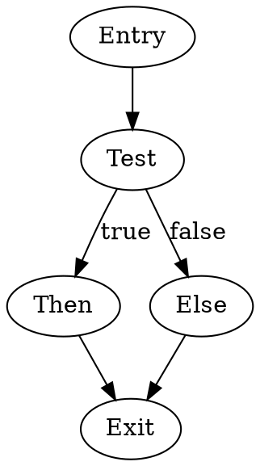

## Overview

afl-fuzz -i input_dir -o output_dir ./program @@
```

**libFuzzer**: In-process coverage-guided fuzzer:

```cpp
extern "C" int LLVMFuzzerTestOneInput(const uint8_t *data, size_t size) {
    // Test function with fuzz input
    parse_input(data, size);
    return 0;
}
```

[Inference] Coverage-guided fuzzing uses instrumentation to track which code paths are exercised, generating inputs that maximize coverage and discover edge cases and vulnerabilities.

**Dynamic Taint Analysis with Fuzzing**: Track how input influences execution and crashes:

```
Input byte 0x42 at offset 5 influences:
- Conditional branch at 0x401234
- Memory access at 0x401567
- Function argument at 0x401890
```

[Inference] Taint tracking during fuzzing identifies which input bytes control program behavior, enabling targeted mutation to trigger specific code paths or vulnerabilities.

## Control Flow Graphs

Control Flow Graphs (CFGs) visualize program structure by representing execution paths as directed graphs. CFGs are fundamental to both static and dynamic analysis.

### CFG Components

**Nodes**: Represent basic blocks - maximal sequences of instructions with:

- Single entry point (first instruction)
- Single exit point (last instruction)
- No internal branches (except at exit)

**Example Basic Block**:

```nasm
; Basic Block ID: BB_1
00401000: mov rax, [rdi]       ; Entry point
00401003: test rax, rax
00401006: add rax, 5
00401009: je 0x401020           ; Exit point (conditional jump)
```

**Edges**: Represent possible control flow transfers:

- **Fall-through edge**: Sequential execution to next block
- **Jump edge**: Unconditional jump to target
- **Conditional branch edges**: True and false branches
- **Call edge**: Function invocation
- **Return edge**: Return from function

**Edge Types**:

```nasm
; BB_1
mov eax, [rdi]
test eax, eax
jz .zero                ; Conditional edge to BB_3
                        ; Fall-through edge to BB_2

; BB_2
add eax, 10
ret                     ; Return edge

; BB_3 (.zero label)
xor eax, eax
ret                     ; Return edge
```

**Entry Node**: The first basic block executed (function entry point)

**Exit Nodes**: Basic blocks that end function execution (return, exit, infinite loop)

### Intraprocedural CFG

CFG for a single function showing all paths through that function.

**Example Function**:

```c
int abs_value(int x) {
    if (x < 0) {
        return -x;
    }
    return x;
}
```

**Assembly**:

```nasm
abs_value:
    ; BB_1 (Entry)
    test edi, edi           ; x < 0?
    jns .positive           ; Jump if not signed (x >= 0)
    
    ; BB_2 (Negative path)
    mov eax, edi
    neg eax                 ; return -x
    ret
    
.positive:
    ; BB_3 (Positive path)
    mov eax, edi            ; return x
    ret
```

**CFG Representation**:

```
         [BB_1: Entry]
         test edi, edi
         jns .positive
           /        \
          /          \
    [BB_2]            [BB_3]
    neg eax           mov eax, edi
    ret               ret
```

[Inference] The CFG shows two possible paths: one for negative values (BB_1 → BB_2) and one for non-negative values (BB_1 → BB_3). Both paths lead to return nodes.

### Interprocedural CFG

CFG spanning multiple functions, showing call relationships.

**Example**:

```c
int square(int x) {
    return x * x;
}

int sum_squares(int a, int b) {
    return square(a) + square(b);
}
```

**Interprocedural CFG**:

```
    [sum_squares: Entry]
           |
           v
    [Call square(a)]
           |
           v
    [square: Entry]
           |
           v
    [square: Body]
           |
           v
    [square: Return]
           |
           v
    [sum_squares: After call 1]
           |
           v
    [Call square(b)]
           |
           v
    [square: Entry]
           |
           v
    [square: Body]
           |
           v
    [square: Return]
           |
           v
    [sum_squares: Final computation]
           |
           v
    [sum_squares: Return]
```

[Inference] Interprocedural CFGs reveal function call patterns, recursive structures, and cross-function data flow, but are more complex due to context sensitivity and indirect calls.

### CFG Construction Algorithms

**Linear Sweep**: Process instructions sequentially, identifying basic block boundaries:

1. Identify leader instructions (block entry points):
    
    - Program entry point
    - Jump/branch targets
    - Instructions following jumps/branches/calls
2. Create basic blocks from each leader to next leader
    
3. Add edges based on control flow instructions
    

[Inference] Linear sweep is simple but may incorrectly handle data interleaved with code or miss indirect jumps.

**Recursive Traversal**: Follow control flow from entry points:

1. Start at known entry point (function start)
2. Disassemble instructions sequentially
3. When encountering control flow instruction:
    - Add successor edges
    - Recursively process targets
4. Continue until all reachable code processed

[Inference] Recursive traversal is more accurate for reachable code but may miss code accessed only through indirect jumps or dynamically computed addresses.

**Hybrid Approach**: Combine linear sweep for coverage with recursive traversal for accuracy:

1. Use recursive traversal from known entry points
2. Apply linear sweep to identify potential missed code
3. Verify with heuristics (function prologue patterns, padding)
4. Resolve indirect jumps using data flow analysis

### CFG Analysis Techniques

**Dominators**: A node D dominates node N if every path from entry to N passes through D:

```
      [Entry]
         |
      [Node A]  ← Dominates B, C, D, E
       /    \
   [Node B] [Node C]  ← B dominates D, C dominates E
      |        |
   [Node D] [Node E]
```

[Inference] Dominator analysis identifies control dependencies - Node A controls whether B and C execute. Used in optimization and understanding program structure.

**Post-Dominators**: Node P post-dominates N if every path from N to exit passes through P:

[Inference] Post-dominators identify where control paths must converge, useful for identifying loop exits and structural elements.

**Immediate Dominator**: The closest dominator of a node. Forms dominator tree showing hierarchical control structure.

**Loops**: Identified through back edges (edges to dominating nodes):

```nasm
; Loop structure
.loop:              ; BB_1 - Loop header
    mov eax, [rsi]
    test eax, eax
    jz .done        ; Exit edge
    
    inc rsi         ; BB_2 - Loop body
    jmp .loop       ; Back edge to BB_1
    
.done:              ; BB_3 - Exit block
    ret
```

**Loop Identification**:

- Find back edges (target dominates source)
- Back edge target is loop header
- Compute loop body (nodes reaching header via back edge)

[Inference] Loop detection enables understanding iteration patterns, identifying optimization opportunities, and analyzing algorithm complexity.

**Reducible vs Irreducible Graphs**:

**Reducible CFG**: Can be reduced to single node by repeatedly removing self-loops and merging nodes. Corresponds to structured control flow (if/while/for). [Inference] Most compiler-generated code produces reducible CFGs.

**Irreducible CFG**: Cannot be reduced, typically from goto statements or computed jumps to multiple loop headers:

```c
// Produces irreducible CFG
if (x) goto L1;
while (cond1) {
L1:
    while (cond2) {
        if (y) goto L1;
    }
}
```

[Inference] Irreducible CFGs complicate analysis and decompilation, as they don't map to standard control structures.

### CFG Visualization

**Graphical Representation**:

**Simple CFG**:

```
         ┌────────┐
         │  Entry │
         └───┬────┘
             │
             v
         ┌────────┐
         │  Test  │
         └──┬─┬───┘
            │ │
        ┌───┘ └────┐
        v          v
    ┌──────┐  ┌──────┐
    │ Then │  │ Else │
    └───┬──┘  └───┬──┘
        │         │
        └────┬────┘
             v
         ┌────────┐
         │  Exit  │
         └────────┘
```

**Loop CFG**:

```
         ┌────────┐
         │  Entry │
         └───┬────┘
             │
             v
      ┌─────────────┐
      │ Loop Header │◄────┐
      └──────┬──────┘     │
             │             │
             v             │
      ┌─────────────┐     │
      │  Loop Body  │     │
      └──────┬──────┘     │
             │             │
        ┌────┴────┐        │
        │         │        │
     Continue   Break     │
        │         │        │
        └─────────┴────────┘
                  │
                  v
              ┌────────┐
              │  Exit  │
              └────────┘
```

**Tools for CFG Visualization**:

**IDA Pro**: Generates CFG automatically, interactive navigation:

```
Space key: Toggle between text and graph view
Graph view shows colored blocks with edges
```

**Ghidra**: Function Graph view with customizable layout:

```
Window → Function Graph
Different layout algorithms (hierarchical, radial, etc.)
```

**Binary Ninja**: Clean graph visualization with multiple zoom levels

**Graphviz**: Generate static graphs from DOT format:



### CFG-Based Analyses

**Reachability Analysis**: Determine which nodes are reachable from entry:

[Inference] Unreachable code may indicate dead code, obfuscation, or code that's only executed through indirect means.

**Path Enumeration**: List all possible execution paths:

```
Paths through abs_value:
1. Entry → Test → Negative → Return
2. Entry → Test → Positive → Return
```

[Inference] Path enumeration helps understand program behavior but suffers from path explosion in complex programs with loops (infinite paths).

**Cyclomatic Complexity**: Metric measuring code complexity:

```
M = E - N + 2P
where:
E = number of edges
N = number of nodes
P = number of connected components (usually 1)
```

Higher complexity indicates more decision points, harder testing, and potential maintainability issues.

**Structural Analysis**: Identify high-level structures (if-then-else, loops, switch):

[Inference] Structural analysis enables decompilation by mapping CFG patterns to source-level constructs. Pattern matching identifies common structures:

- If-then: Single entry, two exits
- If-then-else: Single entry, two branches merging at common exit
- While loop: Back edge from within loop to header
- Do-while: Back edge from end of loop to beginning

**Slicing**: Extract subset of program affecting specific variable or location:

**Backward Slice**: All statements that might affect target:

```c
x = input();        // Affects z
y = input();        // Affects z  
z = x + y;          // Target
output(z);
```

**Forward Slice**: All statements affected by source:

```c
x = input();        // Source
y = x * 2;          // Affected
z = y + 5;          // Affected
w = 10;             // Not affected
```

[Inference] Slicing focuses analysis on relevant code, reducing complexity when investigating specific behaviors or vulnerabilities.

### CFG Manipulation

**Control Flow Flattening**: Obfuscation technique that transforms CFG into flat structure:

**Original**:

```c
if (x > 0) {
    a();
} else {
    b();
}
c();
```

**Flattened**:

```c
int state = 0;
while (1) {
    switch (state) {
        case 0:
            if (x > 0) state = 1;
            else state = 2;
            break;
        case 1:
            a();
            state = 3;
            break;
        case 2:
            b();
            state = 3;
            break;
        case 3:
            c();
            return;
    }
}
```

[Inference] Flattening obscures control flow by centralizing all branches through a dispatcher, making CFG reconstruction more difficult. However, patterns can still be detected through analysis.

**Opaque Predicates**: Conditions whose outcome is known to obfuscator but obscure to analyst:

```nasm
; Opaque predicate: (x^2 >= 0) is always true
imul eax, eax
test eax, eax
js impossible_branch    ; Never taken
; Continue real code
```

[Inference] Opaque predicates add fake branches to CFG, complicating analysis. Detection requires mathematical analysis or symbolic execution.

**CFG Simplification**: Remove redundant nodes and edges:

**Dead Code Elimination**: Remove unreachable nodes

**Node Merging**: Combine sequential nodes with single predecessor/successor

**Edge Simplification**: Remove redundant edges (e.g., unconditional jump to next instruction)

### CFG in Modern Tools

**IDA Pro**:

- Automatic CFG generation
- Interactive graph navigation
- Proximity browser shows local CFG context
- Graph export to various formats

**Ghidra**:

- Multiple graph views (function graph, call graph, data flow graph)
- Automatic structure recovery using CFG
- Graph export and scripting API

**Binary Ninja**:

- Multiple intermediate representations (LLIL, MLIL, HLIL) each with CFGs
- Clean, customizable graph visualization
- Graph API for custom analysis

**angr**:

- CFG construction as foundation for symbolic execution
- CFGFast for quick analysis, CFGEmulated for accuracy
- Programmatic CFG access for custom analysis

**radare2**:

- Command-line and GUI CFG visualization
- Graph export to various formats
- Integration with analysis commands

### Advanced CFG Applications

**Malware Analysis**: CFG reveals malicious logic:

- Identify decryption/unpacking routines (loops with data writes)
- Locate payload execution (branches after unpacking)
- Understand anti-analysis checks (branches to exit on detection)
- Map command-and-control communication flow

**Vulnerability Discovery**: CFG guides security analysis:

- Trace path from input to vulnerable operation
- Identify missing bounds checks (no comparison before buffer access)
- Find authentication bypasses (paths to sensitive code without checks)
- Analyze race condition windows (concurrent access patterns)

**Binary Diffing**: Compare CFGs of different versions:

- Identify changed functions (different CFG structure)
- Locate security patches (added checks, modified branches)
- Understand bug fixes (altered control flow)

**Code Coverage**: Map CFG to coverage data:

- Visualize executed vs unexecuted blocks
- Identify untested paths
- Guide fuzzing toward unexplored branches

**Decompilation**: CFG is foundation for reconstructing source:

- Identify loop structures from back edges
- Recognize conditionals from branch patterns
- Determine variable scope from dominator analysis
- Generate structured code from CFG patterns

---

**Related topics for deeper understanding**: Data flow analysis (reaching definitions, live variable analysis, available expressions), Abstract interpretation for static analysis, Symbolic execution path exploration strategies, Binary instrumentation frameworks, Intermediate representations (LLIL, MLIL, VEX IR, BAP IR), Program slicing algorithms, Points-to analysis and alias analysis, Malware unpacking and deobfuscation techniques, Automated exploit generation, Binary rewriting and patching.

---

## Data Flow Analysis

Data flow analysis tracks how data moves through a program by following registers, memory locations, and stack operations throughout execution. This technique reveals the transformation and usage of variables, function parameters, and return values.

### Register Tracking

Monitor how values move between registers across instruction sequences. Common patterns include:

- **EAX/RAX** - Primary accumulator, function return values
- **ECX/RCX** - Counter register in loops, fourth function argument (x64)
- **EDX/RDX** - Data register, third function argument (x64), high-order bits in multiplication
- **EBX/RBX** - Base register, often preserved across calls
- **ESP/RSP** - Stack pointer, critical for stack frame analysis
- **EBP/RBP** - Base pointer, traditional stack frame reference

```nasm
mov eax, [ebp+8]      ; Load first parameter
add eax, [ebp+12]     ; Add second parameter
mov [ebp-4], eax      ; Store to local variable
```

### Stack Analysis

The stack serves multiple purposes: local variable storage, function parameters, return addresses, and saved registers. Understanding stack layout is fundamental to reverse engineering.

**Stack Frame Structure:**

```
High addresses
+-----------------+
| Parameters      |
+-----------------+
| Return address  |
+-----------------+
| Saved EBP       | <- Current EBP points here
+-----------------+
| Local variables |
+-----------------+
| Saved registers |
+-----------------+ <- ESP points here
Low addresses
```

Track stack operations to identify:

- Function prologue: `push ebp; mov ebp, esp; sub esp, N`
- Local variable allocation and access: `[ebp-offset]`
- Parameter access: `[ebp+offset]`
- Function epilogue: `mov esp, ebp; pop ebp; ret`

### Memory Access Patterns

Analyzing memory operations reveals data structures, array accesses, and pointer operations:

```nasm
mov eax, [ebx]           ; Simple dereference
mov ecx, [ebx+eax*4]     ; Array access: base + index*size
mov edx, [ebx+8]         ; Structure member access
```

Array iteration pattern:

```nasm
xor ecx, ecx             ; Initialize counter
loop_start:
    mov eax, [esi+ecx*4] ; Access array[i]
    ; ... process element
    inc ecx
    cmp ecx, [array_size]
    jl loop_start
```

### Def-Use Chains

Def-use chains connect where variables are defined (written) to where they are used (read). This helps identify variable scope and dependencies.

```nasm
mov eax, 10        ; Definition of eax
add eax, 5         ; Use and redefine eax
mov [result], eax  ; Final use of eax
```

## Pattern Recognition

Pattern recognition involves identifying common code constructs, compiler idioms, and standard library functions by their assembly signatures.

### Control Flow Patterns

**If-Then-Else:**

```nasm
cmp eax, ebx
jle else_branch
    ; then block
    mov ecx, 1
    jmp end_if
else_branch:
    ; else block
    mov ecx, 0
end_if:
```

**Switch Statement (Jump Table):**

```nasm
cmp eax, 5              ; Range check
ja default_case
mov eax, [jump_table+eax*4]
jmp eax

jump_table:
    dd case_0, case_1, case_2, case_3, case_4, case_5
```

**For Loop:**

```nasm
mov ecx, 0              ; i = 0
for_loop:
    cmp ecx, 100        ; i < 100
    jge loop_end
    ; loop body
    inc ecx             ; i++
    jmp for_loop
loop_end:
```

**While Loop:**

```nasm
while_start:
    cmp [condition], 0
    je while_end
    ; loop body
    jmp while_start
while_end:
```

**Do-While Loop:**

```nasm
do_start:
    ; loop body
    cmp [condition], 0
    jne do_start
```

### Arithmetic Patterns

**Multiplication by Constants:**

```nasm
; x * 3 optimized
lea eax, [eax+eax*2]

; x * 5 optimized
lea eax, [eax+eax*4]

; x * 10 optimized
lea eax, [eax+eax*4]
add eax, eax
```

**Division by Power of Two:**

```nasm
; x / 8 optimized
sar eax, 3

; Unsigned division
shr eax, 3
```

**Modulo Operations:**

```nasm
; x % 8 for positive numbers
and eax, 7

; Power-of-two modulo pattern
and eax, (n-1)
```

### Function Call Conventions

**cdecl (C Declaration):**

- Arguments pushed right-to-left
- Caller cleans stack
- Return value in EAX

```nasm
push arg3
push arg2
push arg1
call function
add esp, 12        ; Caller cleanup
```

**stdcall (Standard Call):**

- Arguments pushed right-to-left
- Callee cleans stack
- Return value in EAX

```nasm
push arg3
push arg2
push arg1
call function      ; Callee cleans with ret N
```

**fastcall:**

- First two arguments in ECX, EDX
- Remaining arguments on stack
- Callee cleans stack

```nasm
mov ecx, arg1
mov edx, arg2
push arg3
call function
```

**x64 Microsoft (Windows):**

- RCX, RDX, R8, R9 for first four integer arguments
- XMM0-XMM3 for floating point
- 32-byte shadow space on stack
- Caller cleanup

**x64 System V (Linux/Unix):**

- RDI, RSI, RDX, RCX, R8, R9 for first six integer arguments
- XMM0-XMM7 for floating point
- No shadow space

### Compiler-Generated Patterns

**String Operations:**

```nasm
; strcpy pattern
cld
rep movsb

; memset pattern
cld
rep stosb

; memcpy pattern
cld
rep movsb
```

**Zero Initialization:**

```nasm
xor eax, eax       ; Faster than mov eax, 0
```

**Stack Canary (Security Cookie):**

```nasm
mov eax, dword ptr [__security_cookie]
mov [ebp-4], eax   ; Place canary on stack
; ... function body
mov ecx, [ebp-4]
cmp ecx, [__security_cookie]
jne __security_check_failure
```

**Virtual Function Calls:**

```nasm
mov eax, [ecx]           ; Load vtable pointer
call dword ptr [eax+8]   ; Call virtual function at offset 8
```

### Standard Library Functions

Recognize common library function signatures:

**strlen:**

```nasm
push esi
mov esi, [esp+8]    ; String pointer
or ecx, -1
xor eax, eax
repne scasb         ; Scan for null byte
not ecx
dec ecx             ; Length
mov eax, ecx
pop esi
ret
```

**strcmp pattern:**

```nasm
mov esi, [str1]
mov edi, [str2]
loop_cmp:
    lodsb
    scasb
    jne not_equal
    test al, al
    jnz loop_cmp
```

## Anti-Disassembly Techniques

Anti-disassembly techniques deliberately obfuscate code to hinder static analysis tools and reverse engineers. These methods exploit weaknesses in disassemblers or create ambiguous instruction streams.

### Opaque Predicates

Opaque predicates are conditional branches where the outcome is known at obfuscation time but difficult for analysis tools to determine.

```nasm
; Always true predicate
xor eax, eax
jz always_taken     ; Will always jump
db 0E8h            ; Fake call opcode (junk byte)
always_taken:
; Real code continues
```

```nasm
; Mathematical invariant
mov eax, [x]
imul eax, eax
and eax, 1
jz always_taken     ; x² is always even, so x² & 1 == 0
db 0xFF, 0xFF      ; Junk bytes
always_taken:
```

### Junk Instructions

Insert instructions that execute but have no effect on program logic:

```nasm
nop                    ; Standard padding
xchg eax, eax         ; Equivalent to nop
mov eax, eax          ; Self-assignment
push eax
pop eax               ; Redundant push/pop
add eax, 0            ; Meaningless arithmetic
```

### Instruction Overlapping

Exploit x86's variable-length instruction encoding to create overlapping instructions:

```nasm
    jmp short target+1
    db 0E8h           ; Disassembler sees 'call' here
target:
    db 12h, 34h, 56h  ; Junk bytes
    ; Real instruction starts at target+1
    mov eax, ebx      ; Actual code
```

[Inference] This causes linear sweep disassemblers to misinterpret the instruction stream because they decode sequentially from the junk byte position.

### Fake Conditional Jumps

Create branches that appear conditional but always execute one path:

```nasm
push eax
xor eax, eax
test eax, eax
pop eax
jnz never_taken    ; Will never jump since eax was zeroed
db 90h, 90h        ; Junk bytes appear as code path
; Real execution continues here
```

### Call/Return Mismatching

Break the call/return pairing to confuse stack analysis:

```nasm
call get_address
junk_bytes:
    db 0E8h, 0, 0, 0, 0
get_address:
    add dword ptr [esp], 5  ; Modify return address
    ret                      ; Returns past junk bytes
```

### Dynamic Code Resolution

Compute target addresses or decode instructions at runtime:

```nasm
mov eax, offset encrypted_code
mov ecx, code_length
decrypt_loop:
    xor byte ptr [eax], 55h  ; Simple XOR decryption
    inc eax
    loop decrypt_loop
jmp encrypted_code           ; Execute decrypted code
```

### Stack Address Manipulation

Abuse return address manipulation to create non-standard control flow:

```nasm
call next
next:
    pop eax              ; Get current address
    add eax, 10          ; Calculate jump target
    push eax
    ret                  ; Jump to calculated address
```

### Interrupt-Based Control Flow

Use software interrupts for control flow instead of standard jumps:

```nasm
; Set custom interrupt handler
mov eax, custom_handler
mov [int_vector], eax

; Trigger interrupt instead of call
int 3h               ; Or other interrupt number

custom_handler:
    ; Handler code
    iret
```

### False Disassembly

Insert bytes that look like different instructions depending on interpretation:

```nasm
    jmp short skip_junk
    db 0EBh          ; This byte is both end of previous jmp
                     ; and start of another jmp if misaligned
skip_junk:
    mov eax, 1
```

### Constant Blinding

Hide immediate values through computation:

```nasm
; Instead of: mov eax, 12345678h
mov eax, 0ABCD1234h
xor eax, 0B97864ECh  ; Results in 12345678h
```

### Control Flow Flattening

Transform structured control flow into a state machine:

```nasm
mov ebx, 0           ; Initial state
dispatch_loop:
    cmp ebx, 0
    je state_0
    cmp ebx, 1
    je state_1
    cmp ebx, 2
    je state_2
    jmp exit

state_0:
    ; Block A code
    mov ebx, 1
    jmp dispatch_loop

state_1:
    ; Block B code
    mov ebx, 2
    jmp dispatch_loop

state_2:
    ; Block C code
    jmp exit

exit:
```

### Return Address Encryption

Encrypt return addresses on the stack:

```nasm
push ebp
mov ebp, esp
mov eax, [esp]       ; Get return address
xor eax, [xor_key]   ; Encrypt it
mov [esp], eax       ; Store encrypted version
; ... function body
mov eax, [esp]       ; Retrieve encrypted return
xor eax, [xor_key]   ; Decrypt it
mov [esp], eax       ; Restore for ret
pop ebp
ret
```

### Self-Modifying Code

Code that modifies its own instructions during execution:

```nasm
mov byte ptr [modify_target], 0B8h  ; Change to 'mov eax, ...'
mov dword ptr [modify_target+1], 12345678h
modify_target:
    nop                              ; Gets modified at runtime
    nop
    nop
    nop
    nop
```

**Key Points:**

- Data flow analysis requires tracking registers, stack operations, and memory accesses systematically across instruction sequences
- Stack frame analysis reveals function boundaries, local variables, and parameter passing conventions
- Pattern recognition relies on identifying compiler-generated code constructs, calling conventions, and common algorithmic implementations
- Control flow patterns (if/else, loops, switches) have distinctive assembly signatures that aid in reconstructing high-level logic
- Anti-disassembly techniques exploit disassembler assumptions, variable-length encoding, and runtime behavior to obscure static analysis
- Opaque predicates create conditional branches with predetermined outcomes that appear uncertain to analysis tools
- Instruction overlapping leverages x86 variable-length encoding to create multiple valid interpretation paths through the same bytes
- Dynamic code techniques (encryption, self-modification) defer code revelation until runtime, defeating static analysis

**Example** of comprehensive analysis combining these techniques:

```nasm
; Obfuscated function with multiple anti-RE techniques
mystery_function:
    push ebp
    mov ebp, esp
    
    ; Stack canary
    mov eax, [__security_cookie]
    mov [ebp-4], eax
    
    ; Opaque predicate
    mov ecx, [ebp+8]
    imul ecx, ecx
    and ecx, 1
    jnz fake_path        ; Never taken (x² is even)
    db 0E8h, 0, 0, 0     ; Junk bytes
    
fake_path:
    ; Constant blinding
    mov eax, 0A5A5A5A5h
    xor eax, 0A5A5A5A0h  ; Results in 5
    
    ; Overlapping instructions
    jmp short real_code+1
    db 0EBh
real_code:
    db 05h               ; Part of 'add eax, imm32'
    
    ; Actual computation: multiply parameter by 5
    mov ebx, [ebp+8]
    lea eax, [ebx+ebx*4]
    
    ; Check stack canary
    mov ecx, [ebp-4]
    cmp ecx, [__security_cookie]
    jne __stack_corrupt
    
    pop ebp
    ret
```

---

# Debugging Techniques

Debugging x86 assembly code requires understanding how debuggers interact with the processor and memory at the lowest level. These techniques allow you to pause execution, examine state, and trace program behavior instruction by instruction.

## Software Breakpoints

Software breakpoints work by temporarily replacing an instruction with a special interrupt instruction that transfers control to the debugger.

**Mechanism:** The debugger replaces the first byte of the target instruction with the INT 3 instruction (opcode 0xCC). When the processor encounters this byte, it generates a debug exception (interrupt vector 3), causing the operating system to notify the debugger. The debugger then restores the original instruction byte and allows you to inspect the program state.

**Key Points:**

- The INT 3 instruction is a single-byte opcode, making it ideal for breakpoints
- The debugger must save the original byte to restore it later
- Multiple software breakpoints can be set simultaneously, limited only by memory
- Software breakpoints modify code in memory, which may affect self-modifying code or checksumming routines
- In protected environments, the debugger needs appropriate permissions to modify code pages

**Example:**

```nasm
; Original code at address 0x401000:
mov eax, [ebx]
add eax, 5

; After setting software breakpoint at 0x401000:
; Memory at 0x401000: 0xCC (INT 3)
; Original byte 0x8B saved by debugger

; When hit:
; 1. CPU executes INT 3
; 2. Exception handler invoked
; 3. Debugger gains control
; 4. EIP points to 0x401000
; 5. Debugger restores original byte
```

**Limitations:**

- Cannot be set on ROM or write-protected memory
- May interfere with code that performs integrity checks
- Requires memory modification, which may be detected by anti-debugging techniques

## Hardware Breakpoints

Hardware breakpoints use dedicated debug registers built into the x86 processor (DR0-DR7) to monitor memory addresses without modifying code.

**Debug Registers:**

- **DR0-DR3**: Store four breakpoint addresses (linear addresses)
- **DR4-DR5**: Reserved (aliased to DR6-DR7 on older processors)
- **DR6**: Debug status register (reports which condition triggered)
- **DR7**: Debug control register (enables/configures breakpoints)

**DR7 Configuration:** Each breakpoint can be configured with:

- **Condition type**: Execution, write, read/write, I/O access
- **Size**: 1, 2, 4, or 8 bytes (size depends on processor mode)
- **Local vs Global**: Local breakpoints clear on task switch, global persist

**Key Points:**

- Limited to four simultaneous hardware breakpoints
- Do not modify code, making them invisible to integrity checks
- Can break on memory access (read/write), not just execution
- Faster than software breakpoints since no instruction replacement occurs
- Persist across memory remapping if addresses remain valid
- Accessible only from privilege level 0 (ring 0) in protected mode

**Example:**

```nasm
; Setting hardware breakpoint on execution at 0x401000:
mov eax, 0x401000
mov dr0, eax          ; Set address in DR0

mov eax, dr7
or eax, 0x00000001    ; Enable L0 (local enable for DR0)
or eax, 0x00000000    ; Condition: 00 = execution (bits 16-17)
and eax, 0xFFF0FFFF   ; Clear R/W0 bits
or eax, 0x00000000    ; Size: 00 = 1 byte (bits 18-19)
mov dr7, eax          ; Activate breakpoint
```

**DR7 Bit Layout (simplified):**

```
Bits 0-7: L0-L3, G0-G3 (Local/Global enable for DR0-DR3)
Bits 16-31: Condition and size for each breakpoint
  - R/W (2 bits): 00=Execute, 01=Write, 10=I/O, 11=Read/Write
  - LEN (2 bits): 00=1 byte, 01=2 bytes, 10=8 bytes, 11=4 bytes
```

## Watchpoints

Watchpoints are a specialized form of hardware breakpoint that monitors memory locations for data access rather than code execution.

**Types:**

- **Write watchpoints**: Break when data is written to an address
- **Read watchpoints**: Break when data is read (requires read/write mode)
- **Read/Write watchpoints**: Break on any access to the memory location

**Key Points:**

- Implemented using hardware breakpoints (DR0-DR3 with appropriate DR7 configuration)
- Essential for tracking when and where variables are modified
- Can monitor up to 8 bytes at a single address (in 64-bit mode)
- The watched address must be aligned based on the size being monitored
- Useful for debugging memory corruption, race conditions, and unexpected mutations

**Example:**

```nasm
; Watching a 4-byte variable at 0x403000 for writes:
mov eax, 0x403000
mov dr1, eax          ; Use DR1 for this watchpoint

mov eax, dr7
or eax, 0x00000004    ; Enable L1 (local enable for DR1)
and eax, 0xFF0FFFFF   ; Clear R/W1 bits
or eax, 0x00010000    ; R/W1 = 01 (write only)
and eax, 0xF0FFFFFF   ; Clear LEN1 bits
or eax, 0x03000000    ; LEN1 = 11 (4 bytes)
mov dr7, eax
```

**Common Use Cases:**

- Tracking modifications to global variables
- Detecting buffer overflows by watching buffer boundaries
- Finding where corrupted data originates
- Monitoring critical data structures in multithreaded code

**Alignment Requirements:** Memory watchpoints must respect natural alignment boundaries. [Inference: Based on x86 architecture documentation, but specific behavior may vary by processor generation]:

- 2-byte watches must be 2-byte aligned
- 4-byte watches must be 4-byte aligned
- 8-byte watches must be 8-byte aligned
- Unaligned watchpoints may not trigger or may cause unpredictable behavior

## Single-Stepping

Single-stepping allows you to execute one instruction at a time, examining processor state after each instruction.

**Trap Flag (TF):** The x86 processor implements single-stepping through bit 8 of the EFLAGS register, called the Trap Flag. When set, the processor generates a debug exception (INT 1) after executing each instruction.

**Mechanism:**

```
1. Debugger sets TF bit in EFLAGS
2. Processor executes one instruction
3. Processor generates INT 1 exception
4. Exception handler transfers control to debugger
5. Debugger displays state, waits for user input
6. Process repeats
```

**Key Points:**

- Provides complete visibility into instruction-by-instruction execution
- Automatically disabled during exception handling to prevent recursive traps
- Can be combined with breakpoints for selective single-stepping
- Performance intensive - unsuitable for stepping through large loops
- Some instructions (like REP-prefixed string operations) may behave specially

**Example:**

```nasm
; Setting trap flag to enable single-stepping:
pushfd                ; Push EFLAGS onto stack
or dword [esp], 0x100 ; Set bit 8 (TF)
popfd                 ; Pop modified EFLAGS back

; After this sequence, each subsequent instruction
; will trigger a debug exception

; Clearing trap flag:
pushfd
and dword [esp], 0xFFFFFEFF ; Clear bit 8
popfd
```

**Step Over vs Step Into:** Debuggers typically provide two single-stepping modes:

- **Step Into**: Executes one instruction, entering function calls
    - Uses trap flag directly
    - Debugger regains control after CALL instruction executes
- **Step Over**: Executes entire function calls as one step
    - Debugger sets temporary breakpoint after CALL instruction
    - Allows function to run at full speed
    - Resumes single-stepping after function returns

**Special Cases:**

- **Interrupt instructions**: Single-stepping continues into interrupt handlers unless masked
- **REP prefix**: [Unverified - behavior varies by processor] Some processors may break after each iteration, others only at completion
- **String operations**: MOVS, STOS, etc. with REP prefix behavior depends on implementation
- **Hardware interrupts**: May occur between single-step exceptions

## Memory Inspection

Memory inspection allows examination of raw memory contents, stack frames, heap allocations, and data structures during debugging.

**Access Methods:** Debuggers provide several ways to inspect memory in x86 assembly programs:

**Direct Address Reading:**

```nasm
; Examining memory at specific address:
; Command in debugger: x/4xw 0x401000
; Displays 4 words (4 bytes each) in hexadecimal

; Example memory layout:
0x401000: 0x12345678  0xABCDEF00  0x00000001  0xFFFFFFFF
```

**Register-Relative Access:**

```nasm
; Inspecting stack frame:
; If EBP = 0x0012FF40
; Command: x/8xw $ebp-0x20
; Shows local variables in current stack frame

; Example stack:
EBP-0x20: 0x00000005  ; Local variable 1
EBP-0x1C: 0x00000000  ; Local variable 2
EBP-0x18: 0x12345678  ; Local variable 3
```

**Key Points:**

- Memory can be viewed in various formats: hex, decimal, ASCII, disassembly, floating-point
- Segment:offset notation used in real mode; linear addresses in protected mode
- Virtual memory means addresses may not correspond to physical locations
- Page protections can prevent reading certain memory regions
- Cache coherency: displayed memory may not reflect very recent writes in multi-core systems

**Common Inspection Formats:**

**Hexadecimal bytes:**

```
0x401000: 55 8B EC 83 EC 20 53 56  57 8B 7D 08 85 FF 74 12
0x401010: 8B 45 0C 85 C0 74 0B 8B  CF E8 45 23 01 00 EB 05
```

**Disassembly:**

```nasm
0x401000: push ebp
0x401001: mov ebp, esp
0x401003: sub esp, 0x20
0x401006: push ebx
0x401007: push esi
0x401008: push edi
```

**ASCII with hex:**

```
0x401000: 48 65 6C 6C 6F 20 57 6F  72 6C 64 21 00 00 00 00  |Hello World!....|
```

**Stack Inspection:** The stack is critical in x86 debugging for understanding function calls, parameters, and local variables.

**Stack Frame Layout:**

```
Higher addresses
+------------------+
| Return address   | [EBP+4]
+------------------+
| Saved EBP        | [EBP] ← Current EBP points here
+------------------+
| Local var 1      | [EBP-4]
+------------------+
| Local var 2      | [EBP-8]
+------------------+
| ...              |
+------------------+ ← ESP points here
Lower addresses
```

**Backtrace/Call Stack:** Following saved EBP values reveals the chain of function calls:

```
Frame 0: function3 at 0x401234, EBP=0x0012FF20
Frame 1: function2 at 0x401100, EBP=0x0012FF50
Frame 2: function1 at 0x401050, EBP=0x0012FF80
Frame 3: main at 0x401000, EBP=0x0012FFB0
```

**Heap Inspection:** Dynamic memory allocated via malloc/HeapAlloc can be inspected by:

- Following pointers stored in registers or stack
- Using memory range commands to scan allocated regions
- Examining heap metadata structures (implementation-specific)

**Segment Registers:** In protected mode, segment registers contain selectors that index descriptor tables:

```nasm
; Inspecting segment:
CS: 0x001B (selector)
  Base: 0x00000000, Limit: 0xFFFFFFFF
  Type: Code, Execute/Read, Ring 3

DS: 0x0023 (selector)
  Base: 0x00000000, Limit: 0xFFFFFFFF
  Type: Data, Read/Write, Ring 3
```

**Memory Search:** Debuggers can search memory for specific byte patterns:

```
; Finding all references to address 0x401000:
search 0x00401000

; Finding ASCII strings:
search "password"

; Pattern matching with wildcards:
search \x55\x8B\xEC\x??
```

**Memory Modification:** During debugging, memory can be modified to test different execution paths:

```nasm
; Changing a conditional jump:
; Original: jz 0x401050 (74 08)
; Modified: jnz 0x401050 (75 08)
; Effect: Inverts branch condition for testing

; Modifying variables:
; Original: [0x403000] = 0x00000005
; Modified: [0x403000] = 0x00000000
; Effect: Tests behavior with different values
```

**Key Points:**

- Memory modification is temporary (unless explicitly saved)
- Changing code requires write access to code pages
- Modified memory returns to original values on program restart
- Some debuggers support conditional memory breakpoints (break when memory equals specific value)

**Conclusion:**

These debugging techniques form the foundation of x86 assembly debugging. Software breakpoints provide unlimited breakpoints with code modification, hardware breakpoints offer non-invasive monitoring with quantity limits, watchpoints track data mutations, single-stepping enables instruction-level tracing, and memory inspection reveals program state. Effective debugging typically combines multiple techniques: setting breakpoints at suspicious locations, using watchpoints to track data corruption, single-stepping through critical sections, and inspecting memory to verify assumptions.

---

## Register Examination

Register examination forms the foundation of assembly debugging by providing immediate visibility into processor state during program execution.

### General Purpose Registers

The general purpose registers hold operands, addresses, and intermediate computation results. During debugging, examining these registers reveals:

**RAX/EAX/AX/AL**: Accumulator register typically holds return values from functions, arithmetic results, and system call numbers. When a function returns unexpectedly wrong values, examining RAX immediately after the `ret` instruction identifies whether the problem originates in the function's computation or calling convention violation.

**RBX/EBX/BX/BL**: Base register often serves as a pointer to data structures or loop invariants. In position-independent code, EBX frequently holds the Global Offset Table (GOT) base address. Corruption of this register causes addressing errors that appear as segmentation faults or incorrect data access.

**RCX/ECX/CX/CL**: Counter register used in loop operations and shift/rotate instructions. String operations like `rep movsb` use RCX as a counter. When loops execute incorrect iterations, examining RCX at loop entry and during iteration reveals off-by-one errors or incorrect initialization.

**RDX/EDX/DX/DL**: Data register extends RAX in multiplication and division operations. The `mul` instruction places the high-order bits in RDX and low-order bits in RAX. Division operations expect the dividend in RDX:RAX. Examining RDX during arithmetic operations identifies overflow conditions or sign-extension problems.

**RSI/ESI/SI/SIL**: Source index register points to source operands in string operations. Memory copy operations that produce corrupted data often involve incorrect RSI values, either from wrong initialization or unintended modification during execution.

**RDI/EDI/DI/DIL**: Destination index register points to destination operands in string operations. Additionally, RDI holds the first integer argument in the System V AMD64 calling convention. Examining RDI when functions receive incorrect parameters immediately identifies calling convention violations.

**RBP/EBP/BP/BPL**: Base pointer register conventionally points to the base of the current stack frame, enabling access to local variables and function parameters through fixed offsets. When local variables contain unexpected values, examining `[rbp-offset]` addresses verifies correct stack frame setup and identifies stack corruption.

**RSP/ESP/SP/SPL**: Stack pointer register points to the top of the stack. Incorrect RSP values cause catastrophic failures including segmentation faults, return address corruption, and buffer overflows. Monitoring RSP throughout function execution identifies stack imbalance from mismatched `push`/`pop` operations or incorrect stack frame allocation.

### Segment Registers

Modern x86-64 systems operate in long mode where segment registers have limited functionality compared to legacy protected mode:

**CS (Code Segment)**: Defines the privilege level and execution mode. In 64-bit mode, CS determines whether the processor executes in compatibility mode (32-bit) or long mode (64-bit). Unexpected privilege level changes indicate exploitation attempts or kernel-mode transitions.

**SS (Stack Segment)**: Points to the stack segment. In 64-bit mode, SS base is ignored but the register still enforces privilege levels. Stack segment violations during debugging typically indicate stack pointer corruption rather than segment issues.

**DS, ES, FS, GS (Data Segments)**: In 64-bit mode, DS and ES bases are forced to zero. FS and GS retain functionality for thread-local storage and operating system data structures. Linux uses FS for thread-local storage in user space and GS for per-CPU data in kernel space. Examining FS base address identifies thread-local variable corruption or threading issues.

### Special Purpose Registers

**RIP/EIP/IP**: Instruction pointer register contains the address of the next instruction to execute. Examining RIP during debugging identifies:

- Execution flow divergence from expected paths
- Jump target errors from incorrect offset calculations
- Return address corruption manifesting as jumps to invalid addresses
- Code injection attacks redirecting execution flow

**RFLAGS/EFLAGS**: Status flags register contains condition codes and processor state flags:

- **CF (Carry Flag)**: Set by unsigned arithmetic overflow or borrow. When unsigned comparisons produce incorrect results, examining CF after `cmp` instructions identifies whether the comparison properly set the flag.
- **PF (Parity Flag)**: Set when the low byte of the result contains an even number of set bits. Rarely used in modern code but checked by legacy routines.
- **AF (Auxiliary Carry Flag)**: Set by carry from bit 3 to bit 4 in BCD arithmetic. Relevant when debugging BCD operations.
- **ZF (Zero Flag)**: Set when arithmetic or logical operations produce zero results. Conditional jumps like `je` (jump if equal) depend on ZF. When branches take unexpected paths, examining ZF after the comparison identifies incorrect comparison operands or logic errors.
- **SF (Sign Flag)**: Set to the most significant bit of the result, indicating negative results in two's complement representation. Signed comparisons rely on SF. Examining SF after arithmetic operations identifies sign errors or overflow conditions.
- **OF (Overflow Flag)**: Set when signed arithmetic produces results outside the representable range. The combination of CF and OF distinguishes signed from unsigned overflow. When arithmetic produces incorrect results despite correct operands, examining OF identifies overflow that the code fails to handle.
- **DF (Direction Flag)**: Controls string operation direction. When set, string operations decrement index registers; when clear, they increment. String operations producing corrupted data despite correct addresses often involve incorrect DF state.
- **IF (Interrupt Flag)**: Controls maskable interrupt handling. In kernel debugging, examining IF identifies whether code sections properly disable interrupts during critical operations.
- **TF (Trap Flag)**: Enables single-step debugging. Debuggers set TF to generate debug exceptions after each instruction, implementing single-stepping functionality.

### Debugging Registers

x86 processors provide hardware debugging registers DR0-DR7:

**DR0-DR3**: Breakpoint address registers hold linear addresses for hardware breakpoints. Hardware breakpoints trigger without modifying code, enabling debugging of read-only code sections, self-modifying code, and ROM-based firmware.

**DR6**: Debug status register indicates which debug condition triggered. After a debug exception, examining DR6 identifies:

- Which breakpoint register matched (B0-B3 flags)
- Single-step execution (BS flag)
- Task switch debug trap (BT flag)

**DR7**: Debug control register configures breakpoint conditions:

- L0-L3 and G0-G3 flags enable local and global breakpoints
- R/W0-R/W3 fields specify breakpoint types: instruction execution, data write, I/O access, or data read/write
- LEN0-LEN3 fields specify breakpoint size: 1, 2, 4, or 8 bytes

Hardware breakpoints enable sophisticated debugging scenarios like detecting writes to specific memory locations without performance overhead from software breakpoints.

### Floating-Point and SIMD Registers

**x87 FPU Registers (ST0-ST7)**: The x87 floating-point unit uses a register stack. ST0 holds the top of stack, ST1 the next element, etc. Examining the FPU stack identifies:

- Stack overflow from excessive pushes without pops
- Stack underflow from pops without corresponding pushes
- Incorrect results from operand ordering errors in non-commutative operations
- Precision loss from improper rounding mode configuration

**x87 Control Word**: Configures precision, rounding mode, and exception masking. When floating-point calculations produce unexpected results, examining the control word identifies configuration issues.

**x87 Status Word**: Contains condition codes (C0-C3), exception flags, and stack top pointer. The condition codes enable floating-point comparisons through `fcom` instructions. Examining the status word after floating-point operations identifies exceptions that the code silently ignores through masking.

**MMX Registers (MM0-MM7)**: Alias the x87 FPU registers for 64-bit SIMD operations. MMX usage requires careful state management because MMX and x87 instructions share registers. Mixing MMX and x87 code without proper `emms` instructions causes state corruption.

**SSE/AVX Registers (XMM0-XMM15/YMM0-YMM15/ZMM0-ZMM31)**: SIMD registers for packed integer and floating-point operations. Examining these registers during debugging reveals:

- Lane-wise operation results in vector computations
- Data alignment issues causing performance degradation or exceptions
- Incorrect shuffle/blend operations producing wrong element ordering
- NaN propagation in floating-point vector operations

### Register Examination Techniques

**Breakpoint-Based Examination**: Set breakpoints at strategic locations and examine registers when execution stops:

```
(gdb) break function_name
(gdb) run
(gdb) info registers        # Display all general purpose registers
(gdb) info all-registers    # Display all registers including FPU/SIMD
(gdb) print/x $rax          # Display RAX in hexadecimal
(gdb) print/d $rcx          # Display RCX in decimal
```

**Conditional Breakpoints**: Break only when registers contain specific values:

```
(gdb) break *0x401234 if $rax == 0
(gdb) break loop_start if $rcx < 10
```

**Watchpoints on Registers**: [Inference] Some debuggers support breaking when register values change, though this functionality varies by debugger and platform.

**Register Diff**: Compare register states across execution points to identify unexpected modifications:

```
(gdb) break function_entry
(gdb) commands
> silent
> set $entry_rax = $rax
> continue
> end
(gdb) break function_exit
(gdb) commands
> silent
> print $rax - $entry_rax
> continue
> end
```

**Batch Register Logging**: Script debuggers to log register contents at multiple points for post-execution analysis. This technique identifies patterns in register usage and modification across complex execution flows.

## Stack Traces

Stack traces reconstruct the sequence of function calls leading to the current execution point, providing essential context for understanding program state.

### Stack Frame Structure

Each function call creates a stack frame containing:

**Return Address**: The instruction address where execution continues after the function returns. Pushed by the `call` instruction and consumed by `ret`. Examining return addresses in the stack identifies the call chain.

**Saved Frame Pointer**: The caller's RBP value, saved by the `push rbp` instruction in the function prologue. This creates a chain of frame pointers traversing the stack, enabling stack unwinding without debug symbols.

**Local Variables**: Function-local data allocated by subtracting from RSP in the function prologue. Variables appear at negative offsets from RBP: `[rbp-8]`, `[rbp-16]`, etc.

**Function Parameters**: In calling conventions that pass parameters on the stack, parameters appear at positive offsets from RBP: `[rbp+16]`, `[rbp+24]`, etc. The System V AMD64 calling convention passes the first six integer parameters in registers, placing additional parameters on the stack.

**Saved Registers**: Callee-saved registers (RBX, RBP, R12-R15 in System V AMD64) that the function must preserve for the caller.

**Red Zone**: AMD64 System V ABI defines a 128-byte red zone below RSP that leaf functions may use without adjusting RSP. Signal handlers must not corrupt this zone. When debugging stack corruption in leaf functions, examining the red zone identifies whether signal delivery destroyed temporary data.

### Stack Frame Walking

Manual stack unwinding follows frame pointer chains:

**Key Points:**

- Current frame base: value in RBP
- Previous frame base: `[rbp]`
- Return address: `[rbp+8]`
- Caller's caller frame: `[[rbp]]`

Walking the stack manually:

```
Current RBP: 0x7fffffffe410
Saved RBP:   [0x7fffffffe410] = 0x7fffffffe430
Return addr: [0x7fffffffe418] = 0x401234
Caller RBP:  [0x7fffffffe430] = 0x7fffffffe460
Caller ret:  [0x7fffffffe438] = 0x401567
```

This process continues until reaching the bottom of the stack (typically the entry point function) or encountering an invalid frame pointer indicating stack corruption.

### Stack Unwinding Without Frame Pointers

Modern optimizations often omit frame pointers (`-fomit-frame-pointer`), using RBP as a general purpose register. Stack unwinding then requires:

**DWARF Unwind Information**: Debug information describing stack frame layout at each instruction. `.eh_frame` and `.debug_frame` sections contain frame description entries (FDEs) specifying:

- Canonical Frame Address (CFA) calculation: typically `RSP + offset`
- Register save locations relative to CFA
- Return address location

Debuggers parse DWARF information to unwind stacks without frame pointers. When debugging optimized code produces incomplete or incorrect stack traces, missing or corrupted DWARF information is the likely cause.

**Return Address Heuristics**: [Inference] Without frame pointers or DWARF information, debuggers may attempt heuristic stack scanning: searching the stack for values pointing to executable code regions preceded by `call` instructions. This technique produces unreliable results with false positives from function pointers or code pointers in data structures.

### Stack Trace Anomalies

**Corrupted Return Addresses**: Buffer overflows, stack smashing attacks, or memory corruption overwrite return addresses. Symptoms include:

- Stack traces showing impossible call sequences
- Return addresses pointing to data regions or unmapped memory
- Abrupt stack trace termination without reaching main()
- Return addresses pointing to unexpected code locations

Examining the stack memory around corrupted return addresses often reveals overwritten data patterns identifying the corruption source.

**Broken Frame Pointer Chains**: Frame pointer corruption produces truncated stack traces. Common causes:

- Assembly code manipulating RBP without preserving the frame chain
- Stack buffer overflows overwriting saved RBP
- Incorrect function prologues or epilogues
- Mixing frame-pointer and frame-pointer-less code without proper handling

**Tail Call Optimization**: Compilers optimize tail calls by replacing `call`/`ret` sequences with `jmp` instructions, eliminating stack frames. Stack traces then skip tail-called functions, making call sequences appear incorrect. Disabling tail call optimization (`-fno-optimize-sibling-calls`) during debugging restores complete stack traces.

**Stack Pivoting**: Exploits or intentional stack switching change RSP to point to attacker-controlled or alternate stacks. Stack traces show discontinuity with frame pointers pointing outside the normal stack region. Examining RSP range identifies stack pivoting:

- Normal stack typically near high addresses (0x7fff... on Linux)
- Pivoted stacks in unexpected regions (heap, data segment, mmap regions)

### Stack Trace Generation

**GDB Stack Traces**:

```
(gdb) backtrace          # Full stack trace
(gdb) bt                 # Abbreviated form
(gdb) bt full            # Include local variables
(gdb) bt 10              # Limit to 10 frames
(gdb) frame 3            # Switch to frame 3
(gdb) info frame         # Detailed frame information
(gdb) info args          # Function arguments
(gdb) info locals        # Local variables
```

**Manual Stack Walking**:

```
(gdb) x/20xg $rsp        # Examine stack contents
(gdb) x/i *($rbp+8)      # Disassemble return address
(gdb) print/x *($rbp)    # Previous frame pointer
```

**Validating Stack Traces**: Verify stack trace accuracy:

1. Confirm return addresses point to locations immediately after `call` instructions
2. Verify frame pointer chain contains plausible stack addresses
3. Check that parameter values at each level match expected types and ranges
4. Examine source code to confirm the call sequence makes sense

### Stack Traces in Signal Handlers

Signal delivery interrupts normal execution, creating a special stack frame. The kernel pushes a signal frame containing:

- Interrupted context (register values at signal delivery time)
- Signal number and associated information
- Return trampoline address for resuming execution

Stack traces from signal handlers show:

1. Signal handler frames
2. Kernel signal delivery trampoline (may appear as `__restore_rt` or similar)
3. Interrupted function's frame
4. Normal call chain continuing downward

The interrupted context stored in the signal frame enables examining the program state at interruption time:

```
(gdb) frame N             # Switch to interrupted frame
(gdb) info frame          # Shows signal frame markers
(gdb) print $_siginfo     # Signal information structure
```

### Stack Traces in Multithreaded Programs

Each thread maintains its own stack. Debugging multithreaded programs requires examining all thread stacks:

```
(gdb) info threads        # List all threads
(gdb) thread 3            # Switch to thread 3
(gdb) bt                  # Stack trace for current thread
(gdb) thread apply all bt # Stack traces for all threads
```

Race conditions and deadlocks become apparent from analyzing multiple thread stacks simultaneously:

- Deadlocks show threads waiting on mutexes held by other threads
- Race conditions reveal multiple threads executing in critical sections
- Thread synchronization errors appear as unexpected execution states across threads

## Core Dumps and Crash Analysis

Core dumps capture complete process state at crash time, enabling post-mortem debugging without live process access.

### Core Dump Contents

A core dump contains:

**Memory Mappings**: All mapped memory regions including:

- Code segments (.text sections from executable and shared libraries)
- Data segments (.data, .bss, .rodata sections)
- Heap allocations
- Stack regions for all threads
- Memory-mapped files
- Shared memory segments

The core dump includes actual memory contents, not just addresses. Examining memory maps identifies:

- Address space layout for ASLR analysis
- Unexpected mappings from exploits or corruption
- Memory leaks visible as excessive heap allocations
- Shared library versions through examining loaded library paths

**Register State**: Complete register contents for all threads at crash time, including:

- General purpose registers
- Instruction pointer (showing crash location)
- Flags register (identifying condition at crash)
- Segment registers
- Debug registers
- Floating-point and SIMD registers

The crashed thread's register state proves especially valuable, pinpointing the exact instruction that caused the fault.

**Process Information**: Metadata including:

- Process ID and parent process ID
- User and group IDs
- Signal that caused core dump
- Working directory
- Command-line arguments
- Environment variables
- Resource limits

**Thread Information**: State for all threads:

- Thread IDs
- Register state per thread
- Stack contents per thread
- Thread-local storage

### Generating Core Dumps

**Enabling Core Dumps**: Operating systems often disable core dumps by default or limit their size:

```bash
ulimit -c unlimited          # Remove core dump size limit
echo "/tmp/core.%e.%p" > /proc/sys/kernel/core_pattern  # Core dump location pattern
```

**Triggering Core Dumps**: Various conditions generate core dumps:

- **Segmentation Faults (SIGSEGV)**: Invalid memory access
- **Bus Errors (SIGBUS)**: Misaligned memory access or accessing unmapped physical memory
- **Illegal Instructions (SIGILL)**: Executing invalid opcodes
- **Floating-Point Exceptions (SIGFPE)**: Division by zero, invalid floating-point operations
- **Abort Signals (SIGABRT)**: Triggered by `abort()` function, assertion failures
- **Quit Signals (SIGQUIT)**: User-triggered (Ctrl-)

**Manual Core Dump Generation**: Generate core dumps from running processes:

```bash
gcore <pid>                  # Generate core dump of process
kill -ABRT <pid>             # Send SIGABRT to trigger core dump
```

This enables capturing process state without terminating the process permanently, useful for analyzing hangs or intermittent issues.

### Core Dump Analysis

**Loading Core Dumps**:

```
gdb /path/to/executable /path/to/core
gdb -c /path/to/core /path/to/executable
```

The executable must match the binary that produced the core dump, including the same build and compilation options. Mismatched executables produce incorrect symbol resolution and memory interpretation.

**Initial Analysis**:

```
(gdb) info program           # Shows signal that caused core dump
(gdb) info threads           # Lists all threads
(gdb) thread apply all bt    # Stack traces for all threads
(gdb) info registers         # Crashed thread's registers
(gdb) disassemble $rip       # Disassemble around crash location
```

**Crash Location Identification**: The instruction pointer (RIP) shows where the fault occurred:

```
(gdb) x/i $rip               # Instruction at crash
(gdb) x/10i $rip-20          # Context before crash
(gdb) list *$rip             # Source code at crash (if available)
```

Common crash patterns:

**Null Pointer Dereferences**: RIP points to instruction accessing memory near address 0:

```
mov rax, [rbx]              # RBX contains 0x0 or small offset
```

Examine the base register to confirm null or near-null value.

**Invalid Pointer Dereferences**: RIP points to instruction accessing unmapped memory:

```
mov rcx, [rax]              # RAX contains 0xdeadbeef or garbage
```

Examining the pointer register reveals freed memory patterns (0xdeadbeef), uninitialized values (varies), or corrupted pointers.

**Stack Overflow**: RSP points outside the stack region, typically below the stack guard page. Stack overflow appears as:

- Segmentation fault in function prologue when allocating stack space
- Extremely deep stack traces showing excessive recursion
- RSP value far below the normal stack region

**Heap Corruption**: Crashes in memory allocator code (`malloc`, `free`) with corrupted heap metadata. Examining memory around heap structures reveals:

- Overwritten size fields in allocation headers
- Corrupted free list pointers
- Double-free patterns with freed chunks already in free lists

**Use-After-Free**: Accessing freed memory causes crashes when the allocator reuses the memory:

```
mov rax, [rbx]              # RBX points to freed memory
```

Examining the memory at [RBX] shows allocator patterns or new allocation data inconsistent with the pointer's expected type.

### Memory Examination

Core dumps enable unlimited memory inspection:

**Examining Variables**:

```
(gdb) print variable_name    # Print variable value
(gdb) print *pointer         # Dereference pointer
(gdb) print array[5]         # Array element access
(gdb) print sizeof(struct)   # Structure size
(gdb) ptype variable         # Show variable type
```

**Memory Dumps**:

```
(gdb) x/20xb address         # 20 bytes in hexadecimal
(gdb) x/10xw address         # 10 words (32-bit)
(gdb) x/10xg address         # 10 giant words (64-bit)
(gdb) x/s address            # Null-terminated string
(gdb) x/i address            # Disassemble instruction
```

**Structure Inspection**:

```
(gdb) print *((struct name *)address)     # Cast and dereference
(gdb) print structure.field               # Access structure member
(gdb) print structure->field              # Pointer to structure
```

**Searching Memory**:

```
(gdb) find start_addr, end_addr, byte_pattern
(gdb) find /b 0x401000, 0x402000, 0x41, 0x42, 0x43    # Find "ABC"
```

### Stack Analysis in Core Dumps

Stack contents in core dumps reveal:

**Local Variable Values**: Examining stack memory shows local variable states at crash time, including variables not in source-level debugger scope due to optimization.

**Function Call History**: Beyond symbolic stack traces, raw stack contents show:

- Return addresses identifying function calls not visible in optimized stack traces
- Pushed register values showing register state at function call time
- Parameter values for functions using stack-based parameter passing

**Stack Corruption Evidence**: Examining stack memory identifies corruption patterns:

- Buffer overflow overwrite patterns (repeated characters, format strings)
- Canary values (stack protection) showing corruption detection
- Overwritten return addresses showing control flow hijacking attempts

### Heap Analysis in Core Dumps

**Heap Layout**: Examining heap memory regions identifies:

- Active allocations and their contents
- Freed memory blocks and allocator state
- Heap fragmentation patterns
- Memory leak evidence through unexpected allocation patterns

**Allocation Patterns**: Search heap memory for specific data patterns to find allocations:

```
(gdb) find /g heap_start, heap_end, magic_value
(gdb) x/20xg found_address-16      # Examine allocation header
```

Many allocators prepend metadata to allocations:

- Size fields indicating allocation size
- Status flags (allocated/freed)
- Checksums for corruption detection
- Free list pointers in freed blocks

**Memory Corruption Detection**: Heap corruption manifests as:

- Overwritten allocation headers
- Invalid size fields (too large, misaligned)
- Corrupted free list pointers
- Data structures with invalid pointers or inconsistent internal state

### Comparing Core Dumps

Comparing multiple core dumps identifies patterns in intermittent crashes:

**Automated Comparison**: Scripts comparing stack traces across core dumps identify:

- Common crash locations indicating systematic bugs
- Variable crash locations suggesting race conditions or memory corruption
- Correlation between program state and crash location

**Memory Comparison**: Comparing memory contents across dumps reveals:

- Data structures that consistently corrupt in specific ways
- Memory regions that change unexpectedly between crashes
- Patterns in corrupted data identifying corruption sources

### Core Dump Analysis Strategies

**Systematic Approach**:

1. **Identify Crash Cause**: Examine signal, instruction pointer, and instruction at crash
2. **Analyze Register State**: Identify operand values and their sources
3. **Trace Data Flow**: Follow pointers backward to identify incorrect values' origins
4. **Examine Call Chain**: Verify function call sequence makes sense
5. **Inspect Memory State**: Check data structure integrity around crash location
6. **Correlate Thread States**: In multithreaded crashes, examine all thread activities
7. **Review Recent Code Changes**: Compare crash location with recent modifications

**Backwards Analysis**: Start from crash location and work backward:

- Identify immediate cause (invalid pointer, wrong operand)
- Find where the bad value originated (function parameter, global variable)
- Trace through calling functions to find the root cause
- Examine data flow through structures and memory

**Pattern Recognition**: Experienced debugging identifies common patterns:

- Off-by-one errors producing crashes at buffer boundaries
- Endianness issues in data serialization/deserialization
- Type confusion accessing memory as wrong data type
- Integer overflow producing unexpected pointer arithmetic results

### Debug Symbols

Debug symbols dramatically improve core dump analysis:

**Symbol Information Types**:

- Function names and addresses
- Variable names and locations
- Source file names and line numbers
- Data structure definitions and member layouts
- Type information for variables and parameters

**Symbol Formats**:

- **DWARF**: Standard debug format on Linux, comprehensive
- **STABS**: Legacy format, less common
- **Symbol Tables**: Minimal information (function/variable names and addresses)

**Separate Debug Information**: Debug symbols often reside in separate files:

```
/usr/lib/debug/.build-id/XX/YYYYYYYY.debug
```

GDB automatically searches standard debug information locations. When symbols are missing:

```
(gdb) symbol-file /path/to/debug/symbols
(gdb) add-symbol-file /path/to/library/symbols address
```

**Debugging Without Symbols**: Analysis remains possible without debug symbols:

- Disassemble code to understand functionality
- Identify calling conventions and parameter locations
- Recognize common patterns (function prologues, error handling)
- Use instruction patterns to identify compiler-generated code
- Cross-reference with stripped binary disassembly

**Key Points:**

- Register examination provides immediate processor state visibility
- Stack traces reconstruct execution history through frame pointer chains or DWARF information
- Core dumps capture complete process state for post-mortem analysis
- Systematic analysis from crash location backward to root cause identifies bugs
- Debug symbols dramatically improve analysis but are not strictly required

---

# Security Considerations

Security vulnerabilities at the assembly level represent some of the most critical threats in software systems. Understanding these attack vectors and their mitigations is essential for writing secure low-level code and comprehending how modern protection mechanisms function.

## Buffer Overflows

Buffer overflows occur when data written to a buffer exceeds its allocated boundary, overwriting adjacent memory locations. In x86 assembly, this typically happens with stack-based buffers where no bounds checking validates input size.

### Mechanism

When a function allocates a local buffer on the stack, it reserves a specific amount of space. If data written to this buffer exceeds the allocated size, it overwrites other stack data including saved frame pointers, return addresses, and other local variables.

```nasm
; Vulnerable function example
vulnerable_function:
    push ebp
    mov ebp, esp
    sub esp, 64          ; Allocate 64 bytes for buffer
    
    lea eax, [ebp-64]    ; Address of buffer
    push eax
    call gets            ; No bounds checking - VULNERABLE
    add esp, 4
    
    mov esp, ebp
    pop ebp
    ret                  ; Returns to potentially overwritten address
```

### Stack Layout During Overflow

```
Higher addresses
+------------------+
| Function args    |
+------------------+
| Return address   | <-- Target for overwrite
+------------------+
| Saved EBP        |
+------------------+
| Local buffer[64] | <-- Overflow starts here
+------------------+
| Other locals     |
+------------------+
Lower addresses
```

When excessive data is written to the buffer, it flows upward through the stack, eventually overwriting the return address. An attacker can craft input to replace the return address with an address pointing to malicious code.

### Exploitation Strategy

```nasm
; Attacker's payload structure
; [64 bytes padding][4 bytes saved EBP][4 bytes return address][shellcode]

; Example: Overwrite return address to point to shellcode
; Input: "A" * 64 + "BBBB" + "\x10\xf0\xff\xbf" + shellcode
; Where 0xbffff010 points to shellcode location
```

### Safe Alternative

```nasm
safe_function:
    push ebp
    mov ebp, esp
    sub esp, 64
    
    lea eax, [ebp-64]
    push 64              ; Maximum size
    push eax
    call fgets           ; Bounds-checked input
    add esp, 8
    
    mov esp, ebp
    pop ebp
    ret
```

## Stack Smashing

Stack smashing is a broader category encompassing buffer overflows and other techniques that corrupt the stack's integrity. The term emphasizes the destruction of stack metadata and control flow information.

### Types of Stack Corruption

**Return Address Overwrite**: The most common form where the return address is replaced with an attacker-controlled value.

```nasm
; Before overflow
[buffer][saved EBP][return address: 0x08048450]

; After overflow
[AAAA...AAAA][BBBB][0xdeadbeef] <-- Attacker's address
```

**Frame Pointer Overwrite**: Corrupting the saved EBP affects subsequent frame operations.

```nasm
; Vulnerable code using frame pointer
function:
    push ebp
    mov ebp, esp
    sub esp, 100
    ; ... overflow occurs ...
    mov esp, ebp     ; ESP now points to corrupted value
    pop ebp          ; EBP restored to attacker's value
    ret              ; Potential for further exploitation
```

**Function Pointer Overwrite**: Local function pointers stored on the stack become targets.

```nasm
function_with_callback:
    push ebp
    mov ebp, esp
    sub esp, 72              ; 64-byte buffer + 8-byte function pointer
    
    mov dword [ebp-68], callback_func  ; Store function pointer
    
    lea eax, [ebp-64]
    push eax
    call gets                ; Overflow overwrites function pointer
    
    call [ebp-68]            ; Calls attacker's address
```

### Off-by-One Errors

Subtle boundary errors that overwrite only a single byte, often the least significant byte of the saved frame pointer or return address.

```nasm
; Off-by-one vulnerability
copy_loop:
    mov ecx, 64
    xor esi, esi
copy:
    mov al, [input + esi]
    mov [ebp-64 + esi], al
    inc esi
    cmp esi, ecx
    jle copy             ; Should be 'jl' - copies 65 bytes instead of 64
```

## Return-Oriented Programming (ROP)

ROP is an advanced exploitation technique that bypasses code execution prevention by chaining together existing code sequences ending in `ret` instructions, called "gadgets." Instead of injecting new code, attackers reuse code already present in the executable or loaded libraries.

### ROP Gadgets

A gadget is a short instruction sequence ending in `ret`. Gadgets are found throughout legitimate code and can be chained to perform arbitrary operations.

```nasm
; Example gadgets from legitimate code

; Gadget 1: Pop value into EAX
0x08048123: pop eax
0x08048124: ret

; Gadget 2: Pop value into EBX  
0x080482a7: pop ebx
0x080482a8: ret

; Gadget 3: Move EAX to memory pointed by EBX
0x08048334: mov [ebx], eax
0x08048336: ret

; Gadget 4: System call
0x080484f1: int 0x80
0x080484f3: ret
```

### ROP Chain Construction

A ROP chain manipulates the stack to execute gadgets in sequence. Each `ret` instruction pops the next gadget address from the stack.

```nasm
; Constructing a ROP chain to call execve("/bin/sh", NULL, NULL)
; Stack layout after buffer overflow:

+------------------+
| 0x08048123       | <-- ret jumps here: pop eax; ret
+------------------+
| 0xbffff800       | <-- Value popped into EAX (address of "/bin/sh")
+------------------+
| 0x080482a7       | <-- Next ret: pop ebx; ret
+------------------+
| 0x00000000       | <-- Value popped into EBX (NULL for argv)
+------------------+
| 0x08048567       | <-- pop ecx; ret
+------------------+
| 0x00000000       | <-- Value popped into ECX (NULL for envp)
+------------------+
| 0x08048891       | <-- pop edx; ret
+------------------+
| 0x0000000b       | <-- Value for EDX (execve syscall number)
+------------------+
| 0x080484f1       | <-- int 0x80; ret (execute syscall)
+------------------+
```

### ROP Execution Flow

```nasm
; Original vulnerable function returns
ret                  ; Pops 0x08048123, jumps to first gadget

; First gadget executes
0x08048123: pop eax  ; EAX = 0xbffff800
0x08048124: ret      ; Pops 0x080482a7

; Second gadget executes  
0x080482a7: pop ebx  ; EBX = 0x00000000
0x080482a8: ret      ; Pops next gadget address

; Chain continues until int 0x80 executes system call
```

### Complex ROP Techniques

**Conditional Gadgets**: Using gadgets with conditional jumps to create logic.

```nasm
; Conditional gadget
0x08048a12: cmp eax, ebx
0x08048a14: je 0x08048a20
0x08048a16: pop ecx
0x08048a17: ret
0x08048a20: pop edx
0x08048a21: ret
```

**Arithmetic Gadgets**: Performing calculations to construct values not directly available.

```nasm
; Building values through arithmetic
0x08048b45: add eax, ebx  ; EAX = EAX + EBX
0x08048b47: ret

0x08048c12: xor eax, eax  ; Zero out EAX
0x08048c14: ret

0x08048d78: inc eax       ; Increment EAX
0x08048d79: ret
```

## Stack Canaries

Stack canaries (also called stack cookies or guard values) are a defense mechanism that detects stack buffer overflows before they can compromise control flow. A random or fixed value is placed between local buffers and control data on the stack.

### Canary Placement

```nasm
; Function prologue with stack canary
function_with_canary:
    push ebp
    mov ebp, esp
    sub esp, 72              ; Allocate space for locals + canary
    
    mov eax, gs:[0x14]       ; Load canary from TLS (Thread Local Storage)
    mov [ebp-8], eax         ; Place canary on stack
    xor eax, eax             ; Clear EAX (security practice)
    
    ; Stack layout:
    ; [ebp-72 to ebp-9]: local buffer (64 bytes)
    ; [ebp-8 to ebp-5]: canary (4 bytes)
    ; [ebp-4]: saved EBP
    ; [ebp]: return address
    
    ; Function body here
    ; ...
    
    ; Function epilogue with canary check
    mov eax, [ebp-8]         ; Load canary from stack
    xor eax, gs:[0x14]       ; Compare with original canary
    jne stack_chk_fail       ; Jump to handler if mismatch
    
    mov esp, ebp
    pop ebp
    ret
    
stack_chk_fail:
    call __stack_chk_fail    ; Terminate program
```

### Canary Types

**Random Canary (StackGuard)**: Generated randomly at program startup, stored in Thread Local Storage.

```nasm
; Random canary initialization (simplified)
_start:
    call get_random_bytes
    mov gs:[0x14], eax       ; Store in TLS at offset 0x14
    ; Continue with main program
```

**Terminator Canary**: Contains bytes that commonly terminate string operations (0x00, 0x0A, 0x0D, 0xFF).

```nasm
; Terminator canary example
terminator_canary: dd 0x000aff0d  ; Contains NULL, LF, CR, 0xFF
; Makes it difficult for string-based overflows to preserve canary
```

**Null Canary**: Simply uses 0x00000000 as the canary value.

```nasm
; Null canary (weak protection)
mov dword [ebp-8], 0x00000000
```

**Random XOR Canary**: XORed with control data for additional protection.

```nasm
; XOR canary with return address
function_with_xor_canary:
    push ebp
    mov ebp, esp
    sub esp, 72
    
    mov eax, gs:[0x14]       ; Load random canary
    xor eax, [ebp+4]         ; XOR with return address
    mov [ebp-8], eax         ; Store XORed value
    
    ; Before return:
    mov eax, [ebp-8]
    xor eax, [ebp+4]         ; Reverse XOR with return address
    xor eax, gs:[0x14]       ; Should result in 0 if unchanged
    jne stack_chk_fail
```

### Canary Bypass Techniques

**Canary Leak**: Reading the canary value through a separate vulnerability (format string, information disclosure).

```nasm
; If an attacker can read stack memory:
; 1. Leak the canary value at [ebp-8]
; 2. Include correct canary in overflow payload
; Payload: [64 bytes buffer][correct canary][saved EBP][malicious address]
```

**Overwriting with Leaked Value**: Maintaining the canary during overflow.

```nasm
; Attacker's payload structure
; [buffer data][leaked canary value][saved EBP][return address][shellcode]
; Example: "A"*64 + "\x9a\x7c\x3f\x12" + "BBBB" + "\x10\xf0\xff\xbf" + shellcode
```

**Brute Force**: On 32-bit systems with fork-based servers, attempting to guess the canary byte-by-byte.

```nasm
; Each byte guessed separately (fork preserves canary)
; Attempt 1: [overflow][0x00][...] - crash
; Attempt 2: [overflow][0x01][...] - crash
; ...
; Attempt 157: [overflow][0x9a][...] - no crash, first byte found
; Continue for remaining 3 bytes (256^4 attempts worst case, 4*256 average)
```

### Limitations

Stack canaries only detect corruption immediately before returning from a function. They do not protect against:

- Overwriting function pointers called before return
- Heap-based overflows
- Integer overflows
- Format string vulnerabilities
- Overwrites of other local variables used for control flow

```nasm
; Canary cannot prevent this attack
vulnerable_with_canary:
    push ebp
    mov ebp, esp
    sub esp, 72
    
    mov eax, gs:[0x14]
    mov [ebp-8], eax         ; Canary placed
    
    mov dword [ebp-12], callback_default  ; Function pointer
    
    lea eax, [ebp-72]
    push eax
    call gets                ; Overflow can overwrite [ebp-12]
    
    call [ebp-12]            ; Calls overwritten address BEFORE canary check
    
    mov eax, [ebp-8]
    xor eax, gs:[0x14]       ; Canary check happens too late
    jne stack_chk_fail
```

**Key Points:**

- Buffer overflows exploit the absence of bounds checking to overwrite stack memory, with return addresses being prime targets for control flow hijacking
- Stack smashing encompasses multiple stack corruption techniques including return addresses, frame pointers, and function pointers, with off-by-one errors being particularly subtle
- ROP chains existing code fragments (gadgets) ending in `ret` instructions to achieve arbitrary computation without injecting executable code, bypassing DEP/NX protections
- Stack canaries detect stack corruption by placing verification values between buffers and control data, but can be bypassed through information leaks, brute force, or by exploiting vulnerabilities that trigger before the canary check

---

## ASLR (Address Space Layout Randomization)

ASLR randomizes the memory addresses used by system and application components, making it difficult for attackers to predict target addresses for exploitation. Without ASLR, memory layouts are deterministic and consistent across executions, allowing attackers to hardcode addresses in exploits.

### Memory Regions Randomized

**Stack**: The stack base address varies between executions.

```nasm
; Without ASLR - stack always at predictable location
; First execution:  ESP starts at 0xbffff000
; Second execution: ESP starts at 0xbffff000
; Third execution:  ESP starts at 0xbffff000

; With ASLR - stack location randomized
; First execution:  ESP starts at 0xbf8a3000
; Second execution: ESP starts at 0xbfdc7000
; Third execution:  ESP starts at 0xbf5f2000
```

**Heap**: Dynamic memory allocation base addresses are randomized.

```nasm
; malloc() return addresses vary
; Without ASLR:
call malloc          ; Returns 0x0804a000
call malloc          ; Returns 0x0804a010

; With ASLR:
call malloc          ; Returns 0xb7e45000 (execution 1)
call malloc          ; Returns 0xb7c91000 (execution 2)
```

**Libraries (Shared Objects)**: Loaded library base addresses change per execution.

```nasm
; libc.so.6 loading addresses
; Without ASLR:
; libc always loaded at: 0xb7e00000
; system() always at:    0xb7e42da0
; execve() always at:    0xb7e98e50

; With ASLR:
; Execution 1 - libc at: 0xb7d12000, system() at: 0xb7d54da0
; Execution 2 - libc at: 0xb7c45000, system() at: 0xb7c87da0
; Execution 3 - libc at: 0xb7f23000, system() at: 0xb7f65da0
```

**Executable (PIE - Position Independent Executable)**: When compiled as PIE, the main executable itself is randomized.

```nasm
; Non-PIE executable (fixed base)
; _start always at:     0x08048000
; main always at:       0x080484a0
; vulnerable_func at:   0x08048550

; PIE executable (randomized base)
; Execution 1 - base:   0x56555000
;   _start at:          0x56555000
;   main at:            0x565554a0
; Execution 2 - base:   0x565aa000
;   _start at:          0x565aa000
;   main at:            0x565aa4a0
```

### ASLR Entropy and Granularity

ASLR randomness is limited by available address space bits. On 32-bit systems, entropy is significantly constrained.

```nasm
; 32-bit Linux ASLR entropy (typical values)
; Stack:     19 bits (524,288 possible locations)
; Heap:      13 bits (8,192 possible locations)
; Libraries: 16 bits (65,536 possible locations)
; PIE:       16 bits (65,536 possible locations)

; Randomization occurs at page granularity (4KB = 0x1000)
; Addresses always aligned to page boundaries

; Example stack addresses with ASLR:
0xbf800000, 0xbf801000, 0xbf802000, ... , 0xbffff000
; Not possible: 0xbf800123, 0xbf800500 (not page-aligned)

; 64-bit Linux ASLR entropy (much stronger)
; Stack:     28 bits
; Heap:      28 bits  
; Libraries: 28 bits
; PIE:       28 bits
```

### Position Independent Code

PIE executables use relative addressing rather than absolute addresses to support relocation.

```nasm
; Non-PIE code (absolute addressing)
mov eax, [0x0804a020]        ; Direct address to global variable
call 0x080484f0              ; Direct call to function

; PIE code (relative addressing)
; Using EIP-relative addressing (x86-64)
mov eax, [rip + 0x200d]      ; Load relative to instruction pointer
call func@PLT                ; Call through PLT (Procedure Linkage Table)

; x86 PIE code (requires getting EIP)
call __x86.get_pc_thunk.ax   ; Get current EIP into EAX
add eax, offset _GLOBAL_OFFSET_TABLE_
mov ebx, [eax + global_var@GOT]  ; Load through GOT
```

### Global Offset Table (GOT) and Procedure Linkage Table (PLT)

PIE and shared libraries use GOT and PLT for dynamic symbol resolution.

```nasm
; PLT stub for printf
printf@plt:
    jmp [printf@GOT]         ; Jump to address in GOT
    push 0                   ; Relocation index
    jmp PLT0                 ; Jump to resolver

; First call to printf:
; 1. Jumps to [printf@GOT] - initially points to next instruction
; 2. Pushes relocation index
; 3. Calls dynamic linker resolver
; 4. Resolver updates printf@GOT with actual address
; 5. Subsequent calls jump directly to resolved address

; Example GOT structure at runtime
_GLOBAL_OFFSET_TABLE_:
0xb7ffd000: dd 0xb7ffdef0    ; Dynamic section address
0xb7ffd004: dd 0xb7fe8000    ; Link map address  
0xb7ffd008: dd 0xb7fe8950    ; Resolver function
0xb7ffd00c: dd 0xb7e42da0    ; printf address (after resolution)
0xb7ffd010: dd 0xb7e51830    ; malloc address
0xb7ffd014: dd 0xb7e63f20    ; free address
```

### ASLR Bypass Techniques

**Information Leak**: Exploiting memory disclosure vulnerabilities to learn randomized addresses.

```nasm
; Format string vulnerability leaks stack address
vulnerable_function:
    push ebp
    mov ebp, esp
    sub esp, 64
    
    lea eax, [ebp-64]
    push eax
    call gets
    
    lea eax, [ebp-64]
    push eax
    call printf              ; User input as format string
    ; Input: "%p %p %p %p" leaks stack addresses
    ; Output: "0xbf9a3f40 0xbf9a3f80 0xb7e42da0 0x08048520"
    ;         stack addr    stack addr  libc addr   code addr
```

**Partial Overwrite**: Exploiting page-aligned randomization to overwrite only non-randomized bytes.

```nasm
; Original return address: 0xbf9a3480
; Attacker overwrites only low 2 bytes: 0xbf9a????
; Since code locations within a module maintain relative offsets,
; attacker can redirect to different function in same module

; Example: redirect to existing "win" function
; Original return:  0x080484f0 (normal return)
; Target function:  0x08048550 (win function)
; Overflow payload: [buffer][canary][saved ebp][0x8550]
; Only overwrites 2 bytes, maintains 0x0804 prefix
```

**Brute Force**: On 32-bit systems with limited entropy, repeatedly attempting exploitation.

```nasm
; Stack has 19 bits entropy = 524,288 possibilities
; For a network service that forks (preserves ASLR layout):
; Average attempts to guess stack address: 262,144

; Example brute force against forking service
attempt_exploit:
    ; Send payload with guessed return address
    ; Payload: [overflow][0xbf800000 + (attempt * 0x1000)]
    ; If guess wrong: connection closes, try next
    ; If guess correct: shellcode executes

; Against non-forking service (ASLR re-randomizes):
; Each crash re-randomizes layout
; Brute force becomes impractical
```

**NOP Sled**: Increasing probability of successful jumps by prepending shellcode with NOPs.

```nasm
; Without NOP sled
; Must guess exact shellcode address: 0xbf9a3500
; Probability: 1 / 524,288

; With 4KB NOP sled
; Can land anywhere in: 0xbf9a3000 - 0xbf9a3fff
; Probability: 4096 / 524,288 = 1 / 128

nop_sled:
    nop                      ; 0x90
    nop
    nop
    ; ... thousands of NOPs ...
    nop
shellcode:
    xor eax, eax
    push eax
    push 0x68732f2f          ; "//sh"
    push 0x6e69622f          ; "/bin"
    ; ... shellcode continues ...
```

**Return-to-PLT**: Using PLT entries which have fixed offsets within the executable.

```nasm
; Even with ASLR, PLT entries maintain fixed offsets from executable base
; Non-PIE executable PLT always at same addresses
system@plt:   0x08048390
printf@plt:   0x080483b0
execve@plt:   0x080483d0

; ROP chain using PLT
rop_chain:
    dd 0x08048390            ; system@plt
    dd 0x41414141            ; Fake return address
    dd 0x0804a020            ; Address of "/bin/sh" string in .data
```

**Heap Feng Shui**: Manipulating heap layout through controlled allocations to increase exploit reliability.

```nasm
; Exploit heap metadata structures with predictable relative positions
; Even though heap base is randomized, internal structure is controllable

; Controlled allocations
call malloc              ; Allocate chunk 1
call malloc              ; Allocate chunk 2  
call malloc              ; Allocate chunk 3
call free                ; Free chunk 2
; Chunk 2 now in free list with known offset from chunk 1
; Overflow from chunk 1 can overwrite freed chunk's metadata
```

## DEP/NX (Data Execution Prevention)

DEP (Windows) and NX (Linux/Unix) prevent code execution from memory regions marked as data. This mitigation blocks traditional shellcode injection by making stack and heap memory non-executable.

### Page Permission Bits

Memory pages have permission flags that control access and execution.

```nasm
; x86 Page Table Entry (PTE) permission bits
; Bit 0: Present (P)
; Bit 1: Read/Write (R/W)
; Bit 2: User/Supervisor (U/S)
; Bit 63: Execute Disable (XD/NX) - on processors supporting NX

; Without NX/DEP:
; Stack: Present | R/W | User | Executable
; Heap:  Present | R/W | User | Executable
; .text: Present | R   | User | Executable

; With NX/DEP:
; Stack: Present | R/W | User | Non-Executable
; Heap:  Present | R/W | User | Non-Executable
; .text: Present | R   | User | Executable
```

### Memory Region Protections

```nasm
; Typical memory layout with NX enabled (Linux)
; Address Range        Permissions  Region
; 0x08048000-0x08049000  r-xp       .text (code)
; 0x08049000-0x0804a000  r--p       .rodata (read-only data)
; 0x0804a000-0x0804b000  rw-p       .data (initialized data)
; 0x0804b000-0x0804c000  rw-p       .bss (uninitialized data)
; 0x0804c000-0x0806c000  rw-p       heap
; 0xb7e00000-0xb7fb0000  r-xp       libc.so (code)
; 0xb7fb0000-0xb7fb2000  r--p       libc.so (read-only)
; 0xb7fb2000-0xb7fb4000  rw-p       libc.so (data)
; 0xbffdf000-0xc0000000  rw-p       stack (NX enabled)

; Attempting to execute shellcode on stack:
vulnerable_function:
    push ebp
    mov ebp, esp
    sub esp, 100
    
    lea eax, [ebp-100]
    push eax
    call gets                ; Buffer overflow occurs
    
    mov esp, ebp
    pop ebp
    ret                      ; Returns to shellcode on stack
    
    ; CPU attempts to execute from stack address 0xbffff100
    ; NX bit is set for stack pages
    ; Result: SIGSEGV (Segmentation Fault)
    ; Kernel log: "attempted to execute NX-protected page"
```

### Hardware Support

NX requires processor support through the NX/XD bit in page table entries.

```nasm
; Checking for NX support
check_nx_support:
    mov eax, 0x80000001      ; Extended CPUID function
    cpuid
    test edx, (1 << 20)      ; Test NX bit (bit 20)
    jz no_nx_support
    ; NX is supported
    ret

no_nx_support:
    ; Processor lacks NX bit support
    ret

; Enabling NX in page tables (kernel mode)
enable_nx_for_page:
    mov eax, page_table_entry
    mov edx, [eax]           ; Read PTE
    bts edx, 63              ; Set bit 63 (NX bit)
    mov [eax], edx           ; Write modified PTE
    
    ; Flush TLB entry for this page
    invlpg [page_address]
    ret
```

### W^X (Write XOR Execute)

W^X policy enforces that memory pages are either writable or executable, never both simultaneously.

```nasm
; Valid combinations under W^X:
; r-x: Read and Execute (code sections)
; rw-: Read and Write (data sections, stack, heap)
; r--: Read-only (constants, read-only data)

; Invalid combination:
; rwx: Read, Write, AND Execute (violates W^X)

; Example: JIT compilation must use two-step process
jit_compiler:
    ; Step 1: Allocate writable memory
    push 0x1000              ; Size
    push PROT_READ | PROT_WRITE
    push MAP_PRIVATE | MAP_ANONYMOUS
    push -1                  ; No file descriptor
    push 0                   ; Offset
    call mmap                ; Returns writable memory
    mov edi, eax             ; Save address
    
    ; Step 2: Write generated code
    mov byte [edi], 0x55     ; push ebp
    mov byte [edi+1], 0x89   ; mov ebp, esp
    ; ... generate more code ...
    
    ; Step 3: Change protection to executable
    push 0x1000              ; Size
    push PROT_READ | PROT_EXEC
    push edi                 ; Address
    call mprotect            ; Now executable, no longer writable
    
    ; Step 4: Execute generated code
    call edi
```

### DEP/NX Bypass Techniques

**Return-to-libc**: Redirecting execution to existing executable code in libc.

```nasm
; Classic return-to-libc attack
; Goal: Execute system("/bin/sh")

; Stack layout after buffer overflow:
; [buffer overflow padding]
; [address of system()]        <- Return address overwritten
; [address of exit()]          <- Fake return address for system()
; [address of "/bin/sh" string] <- Argument to system()

vulnerable:
    push ebp
    mov ebp, esp
    sub esp, 100
    
    lea eax, [ebp-100]
    push eax
    call gets                ; Overflow here
    
    mov esp, ebp
    pop ebp
    ret                      ; Returns to system()

; Execution flow:
; 1. ret pops system() address (e.g., 0xb7e42da0)
; 2. Jumps to system() in libc
; 3. system() reads argument from stack: "/bin/sh"
; 4. system() spawns shell
; 5. When system() returns, executes exit() to clean up
```

**Return-Oriented Programming (ROP)**: Chaining gadgets from executable memory (detailed in previous section).

```nasm
; ROP chain calling mprotect to make stack executable
; mprotect(stack_addr, size, PROT_READ|PROT_WRITE|PROT_EXEC)

rop_chain:
    dd pop_eax_ret           ; Load syscall number
    dd 125                   ; mprotect syscall number
    dd pop_ebx_ret           ; Load stack address
    dd 0xbffdf000            ; Page-aligned stack address
    dd pop_ecx_ret           ; Load size
    dd 0x21000               ; Size of region
    dd pop_edx_ret           ; Load protection flags
    dd 7                     ; PROT_READ|PROT_WRITE|PROT_EXEC
    dd int_0x80_ret          ; Execute syscall
    dd shellcode_addr        ; Now stack is executable, jump to shellcode
```

**ret2plt**: Using PLT entries to call library functions indirectly.

```nasm
; ret2plt technique
; Goal: Call mprotect() via PLT to make memory executable

; Stack layout:
rop_chain:
    dd mprotect@plt          ; 0x08048380
    dd pop3_ret              ; Clean up 3 arguments
    dd stack_page            ; Address to make executable
    dd 0x1000                ; Size
    dd 7                     ; PROT_READ|PROT_WRITE|PROT_EXEC
    dd shellcode_addr        ; Jump here after mprotect succeeds

mprotect@plt:
    jmp [mprotect@GOT]       ; Resolves to actual mprotect()
    push 8
    jmp resolve_stub
```

**ret2dl-resolve**: Exploiting the dynamic linker to resolve arbitrary functions.

```nasm
; Advanced technique: Force dynamic linker to resolve chosen function
; Manipulates relocation structures (Elf32_Rel, Elf32_Sym)

forged_structures:
    ; Forged Elf32_Rel structure
    dd fake_got_entry        ; r_offset: where to write resolved address
    dd (fake_sym_idx << 8) | 7  ; r_info: symbol index + relocation type
    
    ; Forged Elf32_Sym structure  
    dd fake_string_offset    ; st_name: offset to symbol name in strtab
    dd 0                     ; st_value
    dd 0                     ; st_size
    db 0x12                  ; st_info: STB_GLOBAL, STT_FUNC
    db 0                     ; st_other
    dw 0                     ; st_shndx
    
    ; Forged string table entry
fake_string: db "mprotect", 0

; ROP chain to trigger dl-resolve
    dd dl_resolve_gadget
    dd forged_rel_offset
    ; dl-resolve executes, resolves "mprotect"
    dd fake_got_entry        ; Call resolved mprotect
```

**JIT Spraying**: For environments with JIT compilation, spraying predictable instruction patterns.

```nasm
; JIT compilers generate executable code at runtime
; Attacker provides input that results in desired opcodes in JIT'd code

; Example: ActionScript number constant 0x3c909090
; Compiles to: mov eax, 0x3c909090
; Machine code: b8 90 90 90 3c
; If jumped into middle: 90 90 90 (nop nop nop)

; Spray memory with JIT'd code containing NOP sleds
jit_spray_pattern:
    ; Input multiple constants that encode to useful instructions
    0x3c909090, 0x3c909090, 0x3c909090, ...
    ; Followed by shellcode encoded as numeric constants
```

## Control-Flow Integrity

Control-Flow Integrity (CFI) restricts program execution to a predetermined control-flow graph, preventing arbitrary control-flow hijacking even when attackers can corrupt memory. CFI validates that indirect control transfers (indirect calls, returns) target only legitimate destinations.

### Control-Flow Graph

A CFI system constructs a control-flow graph at compile time, identifying all legitimate control-flow transfers.

```nasm
; Example program with control-flow graph

main:
    push ebp
    mov ebp, esp
    call function_a          ; Direct call: allowed target
    call function_b          ; Direct call: allowed target
    mov esp, ebp
    pop ebp
    ret                      ; Return: allowed target is caller

function_a:
    push ebp
    mov ebp, esp
    ; ... code ...
    call [ebp+8]             ; Indirect call: validated against allowed targets
    mov esp, ebp
    pop ebp
    ret

function_b:
    push ebp
    mov ebp, esp
    ; ... code ...
    mov esp, ebp
    pop ebp
    ret

callback_1:
    ; Legal indirect call target
    push ebp
    mov ebp, esp
    ; ... code ...
    ret

callback_2:
    ; Legal indirect call target
    push ebp
    mov ebp, esp
    ; ... code ...
    ret

; Control-Flow Graph:
; main -> function_a, function_b
; function_a -> callback_1, callback_2, return to main
; function_b -> return to main
; callback_1 -> return to function_a
; callback_2 -> return to function_a
```

### CFI Labels and Checks

CFI implementations add labels to valid indirect branch targets and insert runtime checks before indirect transfers.

```nasm
; Coarse-grained CFI with labels

; Label types (example scheme):
; 0xCFI0: Function entry points
; 0xCFI1: Return sites
; 0xCFI2: Indirect call targets

function_entry:
    dd 0xCFI0                ; CFI label
    push ebp
    mov ebp, esp
    ; ... function code ...

; Indirect call with CFI check
indirect_call_site:
    mov eax, [ebp+8]         ; Load function pointer
    cmp dword [eax], 0xCFI0  ; Check for valid label
    jne cfi_violation        ; Abort if invalid
    call eax                 ; Safe to call

cfi_violation:
    ; CFI violation handler
    push msg_cfi_violation
    call abort

; Return address validation
function_with_cfi:
    push ebp
    mov ebp, esp
    
    ; Shadow stack operations (conceptual)
    call shadow_push         ; Push return address to shadow stack
    
    ; ... function body ...
    
    ; Before returning
    call shadow_check        ; Verify return address matches shadow stack
    jne cfi_violation
    
    mov esp, ebp
    pop ebp
    ret
```

### Shadow Stack

Shadow stack maintains a separate copy of return addresses in protected memory, preventing return address overwrites.

```nasm
; Shadow stack implementation concepts

; Shadow stack stored in protected memory region
SHADOW_STACK_BASE equ 0x70000000
shadow_stack_ptr: dd SHADOW_STACK_BASE

; Function prologue with shadow stack
function_with_shadow_stack:
    ; Save return address to shadow stack
    mov eax, [shadow_stack_ptr]
    mov ebx, [esp]           ; Get return address from normal stack
    mov [eax], ebx           ; Store to shadow stack
    add dword [shadow_stack_ptr], 4
    
    push ebp
    mov ebp, esp
    ; ... function body ...
    
    ; Function epilogue with shadow stack validation
    mov eax, [shadow_stack_ptr]
    sub eax, 4
    mov [shadow_stack_ptr], eax
    mov ebx, [eax]           ; Load return address from shadow stack
    cmp ebx, [esp]           ; Compare with normal stack return address
    jne shadow_stack_violation
    
    mov esp, ebp
    pop ebp
    ret

shadow_stack_violation:
    call abort               ; Terminate on mismatch
```

### Forward-Edge CFI

Forward-edge CFI protects indirect calls and jumps by validating targets before transfer.

```nasm
; Forward-edge CFI using target sets

; Define equivalence classes for indirect call targets
FUNC_CLASS_CALLBACKS equ 1
FUNC_CLASS_HANDLERS  equ 2

; Annotate functions with their class
callback_func_1:
    dd FUNC_CLASS_CALLBACKS  ; Class identifier
actual_callback_1:
    push ebp
    mov ebp, esp
    ; ... code ...
    ret

event_handler_1:
    dd FUNC_CLASS_HANDLERS
actual_handler_1:
    push ebp
    mov ebp, esp
    ; ... code ...
    ret

; Indirect call with class validation
call_callback:
    mov eax, [callback_ptr]  ; Load function pointer
    cmp dword [eax], FUNC_CLASS_CALLBACKS
    jne cfi_violation
    add eax, 4               ; Skip past class ID
    call eax                 ; Safe to call

; Indirect jump with target validation
dispatch_handler:
    mov eax, [handler_table + ebx*4]
    cmp dword [eax], FUNC_CLASS_HANDLERS
    jne cfi_violation
    add eax, 4
    jmp eax                  ; Safe to jump
```

### Backward-Edge CFI

Backward-edge CFI protects return instructions, typically using shadow stacks or return address encoding.

```nasm
; Return address encryption (simplified)

; XOR key stored in protected memory
RETURN_ADDR_KEY: dd 0x5a5a5a5a

function_with_encrypted_return:
    push ebp
    mov ebp, esp
    
    ; Encrypt return address on stack
    mov eax, [esp+4]         ; Load return address
    xor eax, [RETURN_ADDR_KEY]
    mov [esp+4], eax         ; Store encrypted return address
    
    ; ... function body ...
    
    ; Decrypt return address before returning
    mov eax, [esp+4]
    xor eax, [RETURN_ADDR_KEY]
    mov [esp+4], eax
    
    mov esp, ebp
    pop ebp
    ret                      ; Returns to decrypted address

; If attacker overwrites return address without knowing key:
; Encrypted overwritten value XOR key = wrong address
; Program crashes or jumps to invalid location
```

### Hardware-Assisted CFI

Modern processors provide hardware support for CFI through features like Intel CET (Control-flow Enforcement Technology).

```nasm
; Intel CET - Shadow Stack (SSP = Shadow Stack Pointer)

; Function entry with shadow stack push (automatic)
function_with_cet:
    ; CPU automatically pushes return address to shadow stack
    ; Shadow stack pointer (SSP) incremented
    endbr64                  ; Indirect branch target marker
    push rbp
    mov rbp, rsp
    ; ... function code ...
    
    ; Return with shadow stack validation (automatic)
    mov rsp, rbp
    pop rbp
    ret                      ; CPU validates return address against shadow stack
    ; If mismatch: #CP exception (Control Protection)

; Intel CET - Indirect Branch Tracking (IBT)
; Valid indirect branch targets marked with ENDBR instruction

valid_indirect_target:
    endbr32                  ; Mark as valid indirect branch target
    push ebp
    mov ebp, esp
    ; ... code ...
    ret

; Indirect call to unmarked location causes #CP exception
call_indirect:
    mov eax, [function_ptr]
    call eax                 ; CPU checks for endbr at target
    ; If no endbr: #CP exception

; Enabling CET (kernel sets up during process creation)
; CR4.CET bit enables Control-flow Enforcement Technology
; MSR IA32_U_CET controls user-mode CET features
```

### CFI Bypass Techniques

**Gadget Reuse within CFI**: Finding gadgets that pass CFI checks but perform malicious operations.

```nasm
; Even with CFI, if function pointer table contains useful functions:
function_table:
    dd system                ; Allowed indirect call target
    dd execve                ; Allowed indirect call target
    dd unlink                ; Allowed indirect call target
    dd chmod                 ; Allowed indirect call target

; Attacker overwrites callback index instead of function pointer
callback_index: dd 0         ; Originally points to safe callback
; Overflow changes to: dd 1  (now points to execve)

; CFI check passes because execve is in allowed target set
call_callback:
    mov eax, [callback_index]
    mov ebx, [function_table + eax*4]
    ; CFI check verifies ebx is valid function entry
    cmp dword [ebx], CFI_LABEL_FUNCTION
    jne cfi_violation
    call ebx                 ; Calls execve - CFI is satisfied but attacker wins
```

**Counterfeit Object-Oriented Programming (COOP)**: Chaining virtual function calls to perform computation.

```nasm
; C++ object with virtual functions
; vtable contains pointers to allowed indirect call targets

class_vtable:
    dd method_1              ; All are valid CFI targets
    dd method_2
    dd method_3

; Attacker creates fake objects with crafted vtables
fake_object_1:
    dd gadget_vtable_1       ; Points to carefully selected methods

gadget_vtable_1:
    dd method_that_moves_eax ; First "method" call
    dd method_that_calls_ebx ; Second "method" call
    dd method_that_sys_call  ; Third "method" call

; Each virtual function call passes CFI but chains to perform attack
; Similar to ROP but using virtual function calls instead of returns
```

**Data-Only Attacks**: Manipulating data rather than control flow.

```nasm
; Function that uses corrupted data for decisions
authenticate:
    push ebp
    mov ebp, esp
    sub esp, 100
    
    mov dword [ebp-4], 0     ; is_admin = false
    
    ; Check password (vulnerable to overflow)
    lea eax, [ebp-100]
    push eax
    call gets                ; Overflow can overwrite [ebp-4]
    
    ; No control flow corruption, just data
    cmp dword [ebp-4], 0
    je not_admin
    
    ; Grant admin access
    call spawn_root_shell    ; CFI allows this call
    
not_admin:
    call regular_user_shell

; Attacker overflows to set [ebp-4] = 1
; Control flow stays on valid CFI path
; But data corruption changes program behavior
```

**Shadow Stack Bypass**: Exploiting shadow stack implementation weaknesses.

```nasm
; If shadow stack protection is incomplete:

; Function that doesn't use shadow stack
legacy_function:
    ; Compiled without shadow stack support
    push ebp
    mov ebp, esp
    ; ... vulnerable code ...
    call gets                ; Can overflow return address
    mov esp, ebp
    pop ebp
    ret                      ; No shadow stack validation

; Or exploiting shadow stack with info leak
leak_shadow_stack:
    ; If attacker learns shadow stack address via leak:
    ; 1. Overflow to corrupt both normal and shadow stack
    ; 2. Requires overwriting protected memory region
    ; 3. Usually requires separate vulnerability
```

**Key Points:**

- ASLR randomizes memory layout to prevent hardcoded addresses in exploits, with entropy varying significantly between 32-bit (16-19 bits) and 64-bit (28 bits) systems, and can be bypassed through information leaks, partial overwrites, or brute force on low-entropy systems

## Additional Security Mechanisms and Attack Vectors

### Stack Protector Variations

Beyond basic canaries, multiple stack protection schemes exist with varying strengths and performance characteristics.

**ProPolice/SSP (Stack Smashing Protector)**: GCC's implementation that reorders local variables and adds canaries.

```nasm
; ProPolice variable reordering
; Original source code order:
; char buffer[64];
; int admin = 0;
; char *ptr;

; ProPolice reordered stack layout:
function_with_ssp:
    push ebp
    mov ebp, esp
    sub esp, 80
    
    ; Stack layout (low to high addresses):
    ; [ebp-80]: char *ptr (pointer variable - moved below arrays)
    ; [ebp-76]: int admin (non-array variable - moved below arrays)
    ; [ebp-72]: padding for alignment
    ; [ebp-68 to ebp-5]: char buffer[64] (arrays placed highest)
    ; [ebp-4]: stack canary
    ; [ebp]: saved EBP
    ; [ebp+4]: return address
    
    mov eax, gs:[0x14]
    mov [ebp-4], eax
    
    ; Even if buffer overflows, it cannot reach admin or ptr
    ; Canary protects return address and saved EBP
```

**StackGuard Terminator Canary**: Uses values that terminate common string operations.

```nasm
; Terminator canary composition
TERMINATOR_CANARY equ 0x000aff0d
; 0x00 = NULL terminator (strcpy, strlen stop here)
; 0x0a = Line Feed (gets, scanf stop here)  
; 0x0d = Carriage Return (some input functions stop)
; 0xff = EOF value (many functions treat as terminator)

function_with_terminator_canary:
    push ebp
    mov ebp, esp
    sub esp, 72
    
    mov dword [ebp-8], TERMINATOR_CANARY
    
    ; String-based overflow attempts stop at terminator bytes
    lea eax, [ebp-64]
    push eax
    call strcpy              ; Stops at 0x00 in source
    ; Cannot overwrite canary containing 0x00
    
    ; Validation still required for non-string attacks
    cmp dword [ebp-8], TERMINATOR_CANARY
    jne stack_chk_fail
```

**Random XOR Canary**: Additional layer combining randomness with XOR encoding.

```nasm
function_with_xor_canary:
    push ebp
    mov ebp, esp
    sub esp, 72
    
    ; Generate canary: random_value XOR frame_pointer XOR return_address
    mov eax, gs:[0x14]       ; Random base canary
    xor eax, ebp             ; XOR with frame pointer
    xor eax, [ebp+4]         ; XOR with return address
    mov [ebp-8], eax         ; Store encoded canary
    
    ; Function body
    ; ...
    
    ; Validation reconstructs original value
    mov eax, [ebp-8]
    xor eax, ebp
    xor eax, [ebp+4]
    xor eax, gs:[0x14]
    test eax, eax            ; Should be zero if unchanged
    jnz stack_chk_fail
    
    mov esp, ebp
    pop ebp
    ret

; This makes canary dependent on frame structure
; Corrupting return address or EBP invalidates canary
```

### RELRO (Relocation Read-Only)

RELRO hardens the Global Offset Table and other dynamic linking structures against modification.

**Partial RELRO**: Makes some sections read-only after dynamic linking.

```nasm
; Without RELRO - GOT is writable
.got.plt section permissions: rw-p

; Vulnerable: attacker can overwrite GOT entries
exploit_got_overwrite:
    ; Overflow corrupts GOT entry
    mov dword [printf@GOT], malicious_address
    
    ; Later printf call jumps to attacker's code
    push format_string
    call printf@plt          ; Redirected through corrupted GOT
    
; With Partial RELRO - .got section becomes read-only
.got section permissions: r--p
.got.plt section permissions: rw-p (still writable for lazy binding)

; Reduces attack surface but .got.plt still vulnerable
```

**Full RELRO**: All dynamic relocations resolved at load time, entire GOT made read-only.

```nasm
; Full RELRO process:
; 1. Dynamic linker resolves ALL symbols at program startup
; 2. GOT fully populated before main() executes
; 3. Entire GOT marked read-only

_start:
    ; Before jumping to main, dynamic linker:
    ; - Resolves all PLT entries
    ; - Populates all GOT entries
    ; - Calls mprotect() to make GOT read-only
    
    push 0x1000              ; Size of GOT region
    push PROT_READ           ; Read-only, NOT writable
    push got_address
    call mprotect
    
    ; Now GOT cannot be modified
    call main

; Attempting to write GOT triggers segfault
exploit_attempt:
    mov dword [printf@GOT], 0x41414141
    ; Result: Segmentation fault (attempting to write read-only memory)

; Trade-off: Longer startup time due to eager resolution
; Benefit: Complete GOT protection
```

### FORTIFY_SOURCE

Compile-time and runtime checks for buffer operations, replacing unsafe functions with checked variants.

```nasm
; Without FORTIFY_SOURCE
; Direct call to strcpy (no bounds checking)
call strcpy

; With FORTIFY_SOURCE
; Calls __strcpy_chk with size information

; Original code: strcpy(dest, src)
; Transformed to:
push src
push dest
push dest_size              ; Known at compile time
call __strcpy_chk

; Runtime checking implementation
__strcpy_chk:
    push ebp
    mov ebp, esp
    
    mov edi, [ebp+8]        ; dest
    mov esi, [ebp+12]       ; src
    mov edx, [ebp+16]       ; dest_size
    
    ; Calculate source length
    push esi
    call strlen
    add esp, 4
    
    ; Check if copy would overflow
    cmp eax, edx            ; strlen(src) vs dest_size
    jae buffer_overflow_detected
    
    ; Safe to copy
    push esi
    push edi
    call strcpy
    add esp, 8
    
    mov esp, ebp
    pop ebp
    ret

buffer_overflow_detected:
    push error_message
    call __chk_fail         ; Abort program
```

**Checked Function Variants**:

```nasm
; Multiple levels of protection

; memcpy replacement
__memcpy_chk:
    ; __memcpy_chk(dest, src, n, dest_size)
    mov eax, [ebp+8]        ; dest
    mov ecx, [ebp+16]       ; n (bytes to copy)
    mov edx, [ebp+20]       ; dest_size
    
    cmp ecx, edx            ; n > dest_size?
    ja __chk_fail
    
    ; Proceed with normal memcpy
    
; sprintf replacement  
__sprintf_chk:
    ; __sprintf_chk(dest, flag, dest_size, format, ...)
    push ebp
    mov ebp, esp
    
    mov edi, [ebp+8]        ; dest
    mov eax, [ebp+16]       ; dest_size
    
    ; Calculate required buffer size from format
    lea ecx, [ebp+20]       ; Point to format and args
    push ecx
    call calculate_format_size
    
    cmp eax, [ebp+16]       ; Required size > dest_size?
    ja __chk_fail
    
    ; Safe to format
    
; gets replacement (completely removed)
; gets() -> compile error: "gets() is unsafe, use fgets()"
```

### SafeSEH (Safe Structured Exception Handling)

Windows-specific protection validating exception handler addresses.

```nasm
; Windows SEH structure on stack
seh_frame:
    dd next_seh_frame       ; Pointer to next frame (or 0xFFFFFFFF)
    dd exception_handler    ; Address of handler function
    ; ... local variables ...

; Without SafeSEH - attacker can overwrite exception handler
vulnerable_seh:
    push ebp
    mov ebp, esp
    
    ; Establish SEH frame
    push offset exception_handler
    push dword ptr fs:[0]   ; Previous SEH frame
    mov fs:[0], esp         ; Register new frame
    
    ; Buffer overflow overwrites exception_handler address
    sub esp, 64
    lea eax, [ebp-64]
    push eax
    call gets
    
    ; Trigger exception (e.g., divide by zero)
    xor edx, edx
    div edx                 ; Causes exception
    
    ; Corrupted handler called
    ; Jumps to attacker-controlled address

; With SafeSEH - handler address validated
seh_validation:
    ; When exception occurs, kernel validates handler:
    ; 1. Check if handler address is in SafeSEH table
    ; 2. Table built at compile/link time contains all valid handlers
    ; 3. Handler not in table = access violation
    
    cmp exception_handler, [SafeSEH_table]
    jb invalid_handler
    cmp exception_handler, [SafeSEH_table_end]
    jae invalid_handler
    
    ; Binary search in sorted SafeSEH table
    ; If match found, handler is valid
    ; If not found, terminate process

; SafeSEH table structure (in PE header)
SafeSEH_table:
    dd 0x00401234          ; Valid handler address 1
    dd 0x00401890          ; Valid handler address 2
    dd 0x00402100          ; Valid handler address 3
    ; ... all registered handlers ...
```

### SEHOP (Structured Exception Handler Overwrite Protection)

Enhanced SEH validation checking frame chain integrity.

```nasm
; SEHOP validates entire SEH chain before exception dispatch

seh_chain_validation:
    mov eax, fs:[0]         ; Start of SEH chain
    
validate_chain:
    ; Check 1: Frame pointer in valid stack range
    cmp eax, fs:[4]         ; Stack base
    jb invalid_seh_chain
    cmp eax, fs:[8]         ; Stack limit
    ja invalid_seh_chain
    
    ; Check 2: Handler address in executable memory
    mov ebx, [eax+4]        ; Handler address
    push ebx
    call is_executable_address
    test eax, eax
    jz invalid_seh_chain
    
    ; Check 3: Next frame pointer points forward
    mov ecx, [eax]          ; Next frame pointer
    cmp ecx, eax
    jbe invalid_seh_chain   ; Should point to higher address
    
    ; Check 4: Frame properly aligned
    test eax, 3             ; Must be 4-byte aligned
    jnz invalid_seh_chain
    
    ; Move to next frame
    mov eax, ecx
    cmp eax, 0xFFFFFFFF     ; End of chain marker
    jne validate_chain
    
    ; Chain is valid
    ret

invalid_seh_chain:
    call terminate_process
```

### Vtable Pointer Protection

Protecting C++ virtual function tables from corruption.

```nasm
; C++ object layout
cpp_object:
    dd vtable_pointer       ; First member: vtable pointer
    dd member_data_1
    dd member_data_2
    ; ...

; Virtual function call
call_virtual_method:
    mov eax, [object_ptr]   ; Load object address
    mov ebx, [eax]          ; Load vtable pointer
    call [ebx + 8]          ; Call third virtual function

; Vtable corruption attack
vtable_exploit:
    ; Overflow overwrites vtable pointer
    mov dword [object_ptr], fake_vtable
    
fake_vtable:
    dd malicious_func_1
    dd malicious_func_2
    dd malicious_func_3
    
    ; Next virtual call goes to attacker's code

; Protection: Vtable pointer validation
checked_virtual_call:
    mov eax, [object_ptr]
    mov ebx, [eax]          ; Load vtable pointer
    
    ; Check if vtable in valid read-only data section
    cmp ebx, __VTABLES_START__
    jb invalid_vtable
    cmp ebx, __VTABLES_END__
    jae invalid_vtable
    
    ; Check vtable alignment (usually 4 or 8 byte aligned)
    test ebx, 3
    jnz invalid_vtable
    
    call [ebx + 8]          ; Safe to call
    
invalid_vtable:
    call __vtable_violation_handler
```

**VTable Verification (VTV)**: GCC's mechanism to verify vtable integrity.

```nasm
; VTV registration at program initialization
__vtv_init:
    ; Register all valid vtables
    push vtable_class_A
    call __vtv_register_vtable
    
    push vtable_class_B  
    call __vtv_register_vtable
    
    ; Build verification data structures

; Virtual call with VTV
vtv_checked_call:
    mov eax, [object_ptr]
    mov ebx, [eax]          ; Load vtable pointer
    
    ; Verify vtable is registered for this call site
    push call_site_id       ; Unique ID for this call location
    push ebx                ; Vtable pointer
    call __vtv_verify
    test eax, eax
    jz vtable_verification_failed
    
    ; Verified safe
    call [ebx + offset]

vtable_verification_failed:
    call abort
```

### Integer Overflow Protection

Detecting arithmetic operations that overflow, potentially leading to buffer overflows.

```nasm
; Vulnerable allocation based on user input
vulnerable_alloc:
    mov eax, [num_elements] ; User-controlled
    mov ebx, 4              ; Element size
    mul ebx                 ; EAX = num_elements * 4
    ; If overflow occurs, EAX wraps to small value
    
    push eax
    call malloc             ; Allocates too-small buffer
    
    ; Later: writes num_elements * 4 bytes to small buffer
    ; Result: heap overflow

; Protected version checking for overflow
safe_alloc:
    mov eax, [num_elements]
    mov ebx, 4
    
    ; Check for multiplication overflow
    ; If (num_elements > UINT_MAX / 4), overflow will occur
    cmp eax, 0x3FFFFFFF     ; UINT_MAX / 4
    ja allocation_overflow
    
    mul ebx
    jc allocation_overflow  ; Carry flag set = overflow
    
    push eax
    call malloc
    ; ... proceed safely ...
    
allocation_overflow:
    ; Handle error appropriately
    xor eax, eax
    ret

; Compiler intrinsic for overflow checking
__builtin_mul_overflow_implementation:
    ; __builtin_mul_overflow(a, b, &result)
    push ebp
    mov ebp, esp
    
    mov eax, [ebp+8]        ; a
    mov ecx, [ebp+12]       ; b
    mul ecx                 ; EDX:EAX = a * b
    
    mov ebx, [ebp+16]       ; &result
    mov [ebx], eax          ; Store low 32 bits
    
    ; Check if high 32 bits (EDX) contain anything
    test edx, edx
    setnz al                ; Set AL to 1 if overflow occurred
    movzx eax, al
    
    mov esp, ebp
    pop ebp
    ret
```

**Signed Integer Overflow Detection**:

```nasm
; Signed addition overflow check
; Overflow if: (a > 0 && b > 0 && result < 0) or (a < 0 && b < 0 && result > 0)

safe_signed_add:
    mov eax, [operand_a]
    mov ebx, [operand_b]
    
    add eax, ebx
    jo signed_overflow      ; Overflow flag set
    
    ; Store result
    mov [result], eax
    xor eax, eax            ; Return 0 (success)
    ret

signed_overflow:
    mov eax, 1              ; Return 1 (overflow)
    ret

; Alternative manual check
manual_signed_add_check:
    mov eax, [operand_a]
    mov ebx, [operand_b]
    mov ecx, eax            ; Save original a
    
    add eax, ebx            ; Perform addition
    
    ; Check if signs of operands match
    xor ecx, ebx            ; ECX negative if operands have different signs
    js no_overflow          ; Different signs cannot cause overflow
    
    ; Same signs - check if result sign differs
    xor ecx, eax            ; Compare result sign with operand sign
    js signed_overflow      ; Sign changed = overflow
    
no_overflow:
    mov [result], eax
    ret
```

### Heap Metadata Protection

Modern heap implementations include integrity checks on management structures.

```nasm
; Heap chunk structure (typical implementation)
heap_chunk:
    dd prev_size            ; Size of previous chunk (if free)
    dd size_and_flags       ; Size of this chunk + metadata flags
    ; Bit 0: PREV_INUSE (previous chunk is in use)
    ; Bit 1: IS_MMAPPED (chunk from mmap, not heap)
    ; Bit 2: NON_MAIN_ARENA (chunk from non-main arena)
    dd user_data            ; User data starts here
    ; ...

; Heap exploitation: overwrite next chunk's metadata
heap_overflow_exploit:
    ; Allocate two chunks
    push 64
    call malloc
    mov edi, eax            ; First chunk
    
    push 64
    call malloc
    mov esi, eax            ; Second chunk
    
    ; Overflow from first chunk
    mov ecx, 80             ; Write beyond boundary
    lea edi, [edi]
    rep stosb               ; Overwrites second chunk's metadata
    
    ; Free second chunk - corrupted metadata exploited
    push esi
    call free               ; Triggers malicious unlink or consolidation

; Heap protection: integrity checks
protected_free:
    push ebp
    mov ebp, esp
    
    mov eax, [ebp+8]        ; Chunk to free
    sub eax, 8              ; Point to chunk header
    
    ; Check 1: Size consistency
    mov ebx, [eax+4]        ; size_and_flags
    and ebx, ~7             ; Mask off flag bits
    mov ecx, [eax + ebx]    ; Next chunk's prev_size
    cmp ecx, ebx
    jne heap_corruption_detected
    
    ; Check 2: Alignment
    test eax, 7             ; Should be 8-byte aligned
    jnz heap_corruption_detected
    
    ; Check 3: PREV_INUSE flag consistency
    mov edx, [eax+4]
    test edx, 1             ; PREV_INUSE bit
    jz prev_should_be_inuse ; Inconsistency
    
    ; Proceed with free
    ; ...
    
heap_corruption_detected:
    call abort
```

**Safe Unlinking**:

```nasm
; Traditional unsafe unlink (doubly-linked free list)
unsafe_unlink:
    ; Remove chunk from free list
    ; P = chunk to unlink
    ; FD = P->fd (forward pointer)
    ; BK = P->bk (backward pointer)
    
    mov eax, [P + 8]        ; FD
    mov ebx, [P + 12]       ; BK
    
    mov [ebx + 8], eax      ; BK->fd = FD
    mov [eax + 12], ebx     ; FD->bk = BK
    
    ; Exploit: if attacker controls FD and BK:
    ; Write-what-where primitive
    ; [BK + 8] = FD (arbitrary write)

; Safe unlinking with validation
safe_unlink:
    mov P, [chunk_to_unlink]
    mov FD, [P + 8]
    mov BK, [P + 12]
    
    ; Validation 1: FD->bk should point back to P
    mov eax, [FD + 12]      ; FD->bk
    cmp eax, P
    jne heap_corruption
    
    ; Validation 2: BK->fd should point back to P
    mov eax, [BK + 8]       ; BK->fd
    cmp eax, P
    jne heap_corruption
    
    ; Size consistency check
    mov eax, [P + 4]        ; Chunk size
    and eax, ~7
    lea ebx, [P + eax]      ; Next chunk
    mov ecx, [ebx]          ; Next chunk's prev_size
    cmp ecx, eax
    jne heap_corruption
    
    ; Safe to unlink
    mov [BK + 8], FD
    mov [FD + 12], BK
    ret

heap_corruption:
    call abort
```

### Memory Tagging

Hardware-assisted memory safety using tagged pointers (ARM MTE, SPARC ADI).

```nasm
; ARM Memory Tagging Extension (MTE) concepts
; Each 16-byte granule has 4-bit tag
; Pointers contain 4-bit tag in upper bits

; Allocation with tagging (conceptual x86 equivalent)
tagged_malloc:
    push ebp
    mov ebp, esp
    
    ; Allocate memory
    push [ebp+8]            ; Size
    call malloc
    mov edi, eax            ; Raw pointer
    
    ; Generate random tag (4 bits)
    rdrand ecx
    and ecx, 0xF            ; Tag value 0-15
    
    ; Store tag in pointer's upper bits (conceptual)
    shl ecx, 28             ; Shift to upper nibble
    or eax, ecx             ; Tagged pointer
    
    ; Store tag in memory granule metadata
    mov ebx, edi
    shr ebx, 4              ; Granule index (16-byte aligned)
    mov [granule_tags + ebx], cl
    
    mov esp, ebp
    pop ebp
    ret                     ; Return tagged pointer

; Memory access with tag checking
tagged_load:
    ; EAX = tagged pointer
    push ebp
    mov ebp, esp
    
    ; Extract pointer tag
    mov ecx, eax
    shr ecx, 28             ; Tag in ECX
    
    ; Extract physical address
    mov ebx, eax
    and ebx, 0x0FFFFFFF     ; Clear tag bits
    
    ; Load memory granule tag
    mov edx, ebx
    shr edx, 4              ; Granule index
    movzx edx, byte [granule_tags + edx]
    
    ; Compare tags
    cmp cl, dl
    jne tag_mismatch        ; Fault on mismatch
    
    ; Tags match - safe to access
    mov eax, [ebx]          ; Load value
    
    mov esp, ebp
    pop ebp
    ret

tag_mismatch:
    ; Tag check failure - memory safety violation
    call __tag_mismatch_handler
```

**Key Points:**

- DEP/NX prevents code execution from data pages by leveraging hardware NX bits, but can be bypassed through return-to-libc, ROP, or by calling mprotect to change page permissions
- CFI restricts indirect control transfers to valid targets defined in a control-flow graph, using techniques like shadow stacks for backward-edge protection and target validation for forward-edge protection, though coarse-grained implementations remain vulnerable to gadget reuse and COOP attacks
- Additional protections include RELRO (making GOT read-only), FORTIFY_SOURCE (bounds-checked libc functions), vtable verification (preventing virtual function hijacking), and heap metadata integrity checks (preventing exploitation of allocator structures)
- Modern protections often layer multiple mechanisms - ASLR with DEP with stack canaries with CFI - because each individual protection has bypass techniques, and defense-in-depth significantly increases exploitation difficulty

---

# Obfuscation Techniques

Obfuscation transforms code to make it difficult to understand while preserving its functional behavior. In x86 assembly, obfuscation techniques manipulate instruction sequences, control flow structures, and data representations to impede reverse engineering efforts. These methods increase analysis time and complexity without changing program semantics.

## Code Obfuscation Methods

Code obfuscation encompasses various strategies to obscure program logic, data, and structure at the assembly level.

### Instruction Virtualization

Instruction virtualization translates native x86 instructions into a custom bytecode interpreted by an embedded virtual machine. This creates an additional abstraction layer that must be reverse engineered.

```nasm
; Original code
mov eax, [ebp+8]
add eax, 5
ret

; Virtualized representation
vm_start:
    mov esi, bytecode_start
    mov edi, vm_context
    
vm_loop:
    lodsb                    ; Load opcode
    cmp al, VM_MOV
    je vm_mov
    cmp al, VM_ADD
    je vm_add
    cmp al, VM_RET
    je vm_ret
    
vm_mov:
    lodsb                    ; Destination register
    lodsd                    ; Source address
    ; Interpret MOV operation
    jmp vm_loop
    
vm_add:
    lodsb                    ; Destination register
    lodsd                    ; Immediate value
    ; Interpret ADD operation
    jmp vm_loop
    
vm_ret:
    ; Restore context and return
    ret

bytecode_start:
    db VM_MOV, REG_EAX, 8, 0, 0, 0
    db VM_ADD, REG_EAX, 5, 0, 0, 0
    db VM_RET
```

### Metamorphic Engines

Metamorphic code generates functionally equivalent instruction sequences with different binary representations on each execution or compilation.

```nasm
; Original
add eax, 5

; Metamorphic variants
; Variant 1
push 5
pop ebx
add eax, ebx

; Variant 2
sub eax, -5

; Variant 3
lea eax, [eax+5]

; Variant 4
push eax
mov eax, 5
add [esp], eax
pop eax

; Variant 5
inc eax
inc eax
inc eax
inc eax
inc eax
```

### Code Encryption

Encrypt code blocks and decrypt them at runtime, optionally re-encrypting after execution:

```nasm
encrypted_section_start:
    db 9Ah, 3Ch, 7Fh, ...    ; Encrypted bytes

decrypt_and_execute:
    push esi
    push ecx
    push eax
    
    mov esi, encrypted_section_start
    mov ecx, encrypted_section_length
    mov eax, [decryption_key]
    
decrypt_loop:
    xor [esi], al            ; Simple XOR decryption
    rol eax, 3               ; Rotate key
    inc esi
    loop decrypt_loop
    
    pop eax
    pop ecx
    pop esi
    
    call encrypted_section_start
    
    ; Re-encrypt after execution
    push esi
    push ecx
    push eax
    
    mov esi, encrypted_section_start
    mov ecx, encrypted_section_length
    mov eax, [decryption_key]
    
reencrypt_loop:
    xor [esi], al
    rol eax, 3
    inc esi
    loop reencrypt_loop
    
    pop eax
    pop ecx
    pop esi
    ret
```

### Polymorphic Code

Generate functionally equivalent code with variable structure through dead code insertion and register reassignment:

```nasm
; Template engine generates variations
generate_polymorphic:
    ; Random junk instruction insertion
    call get_random
    test eax, 1
    jz skip_junk1
    push ebx
    pop ebx
skip_junk1:
    
    ; Core functionality (always present)
    mov eax, [data_ptr]
    
    ; More random junk
    call get_random
    test eax, 1
    jz skip_junk2
    xor ecx, ecx
    or ecx, ecx
skip_junk2:
    
    ; Continue core functionality
    add eax, 10
    ret
```

### Dead Code Insertion

Inject instructions that execute but don't affect program output:

```nasm
mov eax, [ebp+8]         ; Real instruction
push ebx                 ; Dead code start
mov ebx, 12345h
xor ebx, ebx
pop ebx                  ; Dead code end
add eax, [ebp+12]        ; Real instruction
push ecx                 ; Dead code start
lea ecx, [ecx+ecx*2]
sub ecx, ecx
pop ecx                  ; Dead code end
mov [ebp-4], eax         ; Real instruction
```

### Register Reassignment

Use different registers for the same logical operations across equivalent code paths:

```nasm
; Version 1
mov eax, [input]
add eax, 10
mov [output], eax

; Version 2 (functionally identical)
mov ebx, [input]
add ebx, 10
mov [output], ebx

; Version 3
mov ecx, [input]
lea ecx, [ecx+10]
mov [output], ecx
```

### Arithmetic Substitution

Replace arithmetic operations with equivalent complex expressions:

```nasm
; Original: x + y
mov eax, [x]
add eax, [y]

; Substituted: x - (-y)
mov eax, [x]
mov ebx, [y]
neg ebx
sub eax, ebx

; Substituted: (x XOR y) + 2 * (x AND y)
mov eax, [x]
mov ebx, [y]
mov ecx, eax
xor eax, ebx
and ecx, ebx
shl ecx, 1
add eax, ecx
```

### Array Index Computation Obfuscation

Obscure array access patterns through complex address calculations:

```nasm
; Original: array[i]
mov eax, [i]
mov ebx, [array + eax*4]

; Obfuscated
mov eax, [i]
mov ecx, eax
shl eax, 2               ; i * 4
mov edx, array
xor ebx, ebx
add edx, eax
xor edx, ebx
mov ebx, [edx]
```

### String Encryption

Store strings encrypted and decrypt on-demand:

```nasm
encrypted_string:
    db 7Ah, 9Fh, 2Dh, 8Ch, 0  ; "Test" encrypted with XOR 0x3F

decrypt_string:
    push esi
    push edi
    push eax
    
    mov esi, encrypted_string
    lea edi, [temp_buffer]
    mov al, 3Fh              ; Decryption key
    
decrypt_str_loop:
    lodsb
    test al, al
    jz decrypt_str_done
    xor al, 3Fh
    stosb
    jmp decrypt_str_loop
    
decrypt_str_done:
    stosb                    ; Null terminator
    pop eax
    pop edi
    pop esi
    ret
```

### MBA (Mixed Boolean-Arithmetic) Obfuscation

Combine boolean and arithmetic operations to create complex equivalent expressions:

```nasm
; Original: x + y
mov eax, [x]
add eax, [y]

; MBA obfuscated: (x XOR y) + 2 * (x AND y)
mov eax, [x]
mov ebx, [y]
mov ecx, eax
mov edx, eax
xor ecx, ebx             ; x XOR y
and edx, ebx             ; x AND y
shl edx, 1               ; 2 * (x AND y)
add ecx, edx             ; Final result
mov eax, ecx

; Original: x * 2
mov eax, [x]
shl eax, 1

; MBA obfuscated: (x OR y) + (x AND y) where y = x
mov eax, [x]
mov ebx, eax
mov ecx, eax
or ebx, ecx              ; x OR x = x
and ecx, eax             ; x AND x = x
add ebx, ecx             ; x + x = 2x
mov eax, ebx
```

## Control Flow Flattening

Control flow flattening transforms structured control flow (if-else, loops, sequential blocks) into a dispatcher-based state machine. This obscures the original program structure and makes static analysis significantly more difficult.

### Basic Dispatcher Pattern

```nasm
; Original structured code
block_A:
    mov eax, [input]
    add eax, 5
    ; goto block_B

block_B:
    mul eax, 2
    ; goto block_C

block_C:
    mov [output], eax
    ret

; Flattened version
mov ebx, 0               ; Initial state

dispatcher:
    cmp ebx, 0
    je state_A
    cmp ebx, 1
    je state_B
    cmp ebx, 2
    je state_C
    cmp ebx, 3
    je state_exit
    jmp error_handler

state_A:
    mov eax, [input]
    add eax, 5
    mov ebx, 1           ; Next state
    jmp dispatcher

state_B:
    imul eax, 2
    mov ebx, 2           ; Next state
    jmp dispatcher

state_C:
    mov [output], eax
    mov ebx, 3           ; Next state
    jmp dispatcher

state_exit:
    ret
```

### Switch-Based Dispatcher

Use a jump table for more efficient state dispatching:

```nasm
mov ebx, 0               ; Initial state

dispatcher:
    cmp ebx, MAX_STATES
    jae error_handler
    mov eax, [dispatch_table + ebx*4]
    jmp eax

dispatch_table:
    dd state_0, state_1, state_2, state_3, state_exit

state_0:
    ; Block code
    mov ebx, 2           ; Non-sequential next state
    jmp dispatcher

state_1:
    ; Block code
    mov ebx, 4
    jmp dispatcher

state_2:
    ; Block code
    mov ebx, 1
    jmp dispatcher
```

### Conditional State Transitions

Flatten conditional branches into state transitions:

```nasm
; Original
cmp eax, 10
jg then_branch
    ; else code
    mov ecx, 0
    jmp end_if
then_branch:
    ; then code
    mov ecx, 1
end_if:

; Flattened
state_condition:
    cmp eax, 10
    jg set_state_then
    mov ebx, STATE_ELSE
    jmp dispatcher
set_state_then:
    mov ebx, STATE_THEN
    jmp dispatcher

state_then:
    mov ecx, 1
    mov ebx, STATE_END_IF
    jmp dispatcher

state_else:
    mov ecx, 0
    mov ebx, STATE_END_IF
    jmp dispatcher

state_end_if:
    ; Continue execution
```

### Loop Flattening

Transform loops into state machine iterations:

```nasm
; Original loop
mov ecx, 0
loop_start:
    cmp ecx, 10
    jge loop_end
    ; loop body
    mov eax, [array + ecx*4]
    add [sum], eax
    inc ecx
    jmp loop_start
loop_end:

; Flattened loop
mov ecx, 0

state_loop_check:
    cmp ecx, 10
    jge set_state_loop_end
    mov ebx, STATE_LOOP_BODY
    jmp dispatcher
set_state_loop_end:
    mov ebx, STATE_LOOP_END
    jmp dispatcher

state_loop_body:
    mov eax, [array + ecx*4]
    add [sum], eax
    inc ecx
    mov ebx, STATE_LOOP_CHECK
    jmp dispatcher

state_loop_end:
    ; Continue after loop
```

### Nested Structure Flattening

Flatten deeply nested control structures:

```nasm
; Original nested structure
if_outer:
    cmp eax, 5
    jl outer_else
    ; outer then
    cmp ebx, 10
    jl inner_else
    ; inner then
    mov ecx, 1
    jmp inner_end
inner_else:
    ; inner else
    mov ecx, 2
inner_end:
    jmp outer_end
outer_else:
    ; outer else
    mov ecx, 3
outer_end:

; Flattened
state_outer_check:
    cmp eax, 5
    jl set_outer_else
    mov ebx, STATE_INNER_CHECK
    jmp dispatcher
set_outer_else:
    mov ebx, STATE_OUTER_ELSE
    jmp dispatcher

state_inner_check:
    push eax                 ; Save for later states
    mov eax, ebx
    pop ebx
    cmp ebx, 10
    jl set_inner_else
    mov ebx, STATE_INNER_THEN
    push eax
    jmp dispatcher
set_inner_else:
    mov ebx, STATE_INNER_ELSE
    push eax
    jmp dispatcher

state_inner_then:
    pop eax
    mov ecx, 1
    mov ebx, STATE_OUTER_END
    jmp dispatcher

state_inner_else:
    pop eax
    mov ecx, 2
    mov ebx, STATE_OUTER_END
    jmp dispatcher

state_outer_else:
    mov ecx, 3
    mov ebx, STATE_OUTER_END
    jmp dispatcher

state_outer_end:
    ; Continue
```

### Randomized State Numbers

Assign non-sequential, randomized state identifiers:

```nasm
STATE_A equ 0x47A3
STATE_B equ 0x92E1
STATE_C equ 0x15BC
STATE_D equ 0xC834

mov ebx, STATE_A

dispatcher:
    cmp ebx, STATE_A
    je state_A
    cmp ebx, STATE_B
    je state_B
    cmp ebx, STATE_C
    je state_C
    cmp ebx, STATE_D
    je state_D
    jmp error

state_A:
    ; code
    mov ebx, STATE_C     ; Skip STATE_B
    jmp dispatcher

state_B:
    ; code
    mov ebx, STATE_D
    jmp dispatcher
```

### Encrypted State Variables

Encrypt state values to hide control flow:

```nasm
STATE_KEY equ 0xDEADBEEF

; Encrypted state values
STATE_A_ENC equ (0x1000 XOR STATE_KEY)
STATE_B_ENC equ (0x2000 XOR STATE_KEY)

mov ebx, STATE_A_ENC

dispatcher:
    mov eax, ebx
    xor eax, STATE_KEY       ; Decrypt state
    
    cmp eax, 0x1000
    je state_A
    cmp eax, 0x2000
    je state_B
    jmp error

state_A:
    ; code
    mov ebx, STATE_B_ENC     ; Set encrypted next state
    jmp dispatcher
```

## Opaque Predicates

Opaque predicates are conditional expressions whose outcome is known to the obfuscator but difficult for analysis tools to determine statically. They create bogus control flow paths that never execute.

### Algebraic Invariants

Exploit mathematical properties that always hold:

```nasm
; x² mod 2 == 0 (squares are always even)
mov eax, [some_value]
imul eax, eax
and eax, 1
jz always_taken          ; Always jumps
    ; Dead code path
    int 3
    db 90h, 90h
always_taken:
    ; Real code

; (x² + x) is always even
mov eax, [value]
mov ebx, eax
imul eax, eax
add eax, ebx
and eax, 1
jnz never_taken          ; Never jumps
    ; Real code
    jmp continue
never_taken:
    ; Dead code
    db 0CCh, 0CCh
continue:

; 2x is always even
mov eax, [value]
shl eax, 1
test eax, 1
jnz never_taken2         ; Never jumps
    ; Real code
```

### Pointer Aliasing

Use pointer comparison properties:

```nasm
lea eax, [global_var1]
lea ebx, [global_var2]
cmp eax, ebx
je never_equal           ; Different globals never equal
    ; Real code path
    jmp continue
never_equal:
    ; Dead code
    int 3
continue:

; Stack vs heap comparison
lea eax, [ebp-4]         ; Stack address
mov ebx, [heap_ptr]      ; Heap address
cmp eax, ebx
je never_equal2          ; Stack/heap never equal
    ; Real code
```

### Context-Based Predicates

Predicates that depend on execution context:

```nasm
; Time-based
rdtsc                    ; Read time stamp counter
mov ecx, eax
call some_function
rdtsc
sub eax, ecx
cmp eax, 1000000         ; Always true in normal execution
jg always_taken
    ; Dead path (would require impossibly fast execution)
    db 0CCh
always_taken:
    ; Real code

; Environment-based
mov eax, [process_id]
test eax, eax
jnz always_nonzero       ; PID always non-zero
    ; Dead path
    int 3
always_nonzero:
    ; Real code
```

### Composite Predicates

Combine multiple conditions:

```nasm
; (x² mod 2 == 0) AND (y+1 > y)
mov eax, [x]
imul eax, eax
and eax, 1               ; Always 0

mov ebx, [y]
inc ebx
cmp ebx, [y]             ; Always greater

; Both conditions always true
jnz never_jump
test eax, eax
jnz never_jump
    ; Real code
    jmp continue
never_jump:
    ; Dead code
    db 90h, 90h
continue:
```

### Loop-Based Predicates

Predicates involving loop invariants:

```nasm
xor ecx, ecx
mov edx, 0

loop_build:
    inc ecx
    add edx, ecx
    cmp ecx, 100
    jl loop_build

; Now edx = sum(1..100) = 5050 (known at obfuscation time)
cmp edx, 5050
je always_equal          ; Always jumps
    ; Dead path
    int 3
always_equal:
    ; Real code
```

### Bitwise Property Predicates

Exploit bitwise operation properties:

```nasm
; (x | y) >= x always true
mov eax, [x]
mov ebx, [y]
or ebx, eax
cmp ebx, eax
jge always_true          ; Always jumps
    ; Dead code
always_true:
    ; Real code

; (x & x) == x always true
mov eax, [value]
mov ebx, eax
and ebx, eax
cmp ebx, eax
je always_equal2         ; Always jumps
    ; Dead code
always_equal2:
    ; Real code
```

### Object-Oriented Predicates

Use object layout properties:

```nasm
; vtable pointer is always in first member
mov eax, [object_ptr]
mov ebx, [eax]           ; vtable pointer
test ebx, ebx
jnz always_nonzero2      ; vtable pointer never null
    ; Dead path
    int 3
always_nonzero2:
    ; Real code
```

### String Property Predicates

Exploit string characteristics:

```nasm
; strlen(str) >= 0 always true
push offset some_string
call strlen
add esp, 4
test eax, eax
jns always_positive      ; Always jumps (sign flag)
    ; Dead code
always_positive:
    ; Real code
```

## Instruction Substitution

Instruction substitution replaces standard instructions with functionally equivalent but less obvious sequences. This increases code size and analysis complexity.

### Arithmetic Substitution

```nasm
; ADD substitutions
; Original: add eax, 5
sub eax, -5
lea eax, [eax+5]
push 5
pop ebx
add eax, ebx
mov ebx, 5
xor ecx, ecx
add ecx, ebx
add eax, ecx

; SUB substitutions
; Original: sub eax, 3
add eax, -3
neg ebx
mov ebx, 3
neg ebx
add eax, ebx
lea eax, [eax-3]

; MUL substitutions
; Original: imul eax, 3
lea eax, [eax+eax*2]
mov ebx, eax
shl eax, 1
add eax, ebx
push eax
add eax, eax
pop ebx
add eax, ebx

; Original: imul eax, 7
lea eax, [eax+eax*2]
lea eax, [eax+eax*4]
mov ebx, eax
shl ebx, 3
sub ebx, eax

; DIV substitutions (power of 2)
; Original: shr eax, 2
sar eax, 2
mov ecx, 2
shr eax, cl
push 4
pop ecx
div ecx             ; Less efficient but obfuscated
```

### Logical Operation Substitution

```nasm
; XOR substitutions
; Original: xor eax, ebx
push eax
push ebx
pop ecx
pop edx
or ecx, edx
and eax, ebx
not eax
and eax, ecx

; Using De Morgan: A XOR B = (A OR B) AND NOT(A AND B)
mov ecx, eax
or eax, ebx
and ecx, ebx
not ecx
and eax, ecx

; AND substitutions
; Original: and eax, ebx
not eax
not ebx
or eax, ebx
not eax             ; Double negation: NOT(NOT A OR NOT B) = A AND B

; OR substitutions
; Original: or eax, ebx
not eax
not ebx
and eax, ebx
not eax             ; NOT(NOT A AND NOT B) = A OR B

; NOT substitutions
; Original: not eax
xor eax, 0FFFFFFFFh
neg eax
dec eax
```

### Move Substitution

```nasm
; Original: mov eax, ebx

; Using stack
push ebx
pop eax

; Using arithmetic
xor eax, eax
add eax, ebx

; Using lea
lea eax, [ebx]

; Using exchange
xchg eax, ebx
xchg eax, ebx
mov eax, ebx

; Complex sequence
sub eax, eax
or eax, ebx
```

### Comparison Substitution

```nasm
; Original: cmp eax, ebx

; Using subtraction
sub eax, ebx        ; Sets flags, destroys eax
push eax
mov eax, [original_eax]

; Using xor for equality
xor eax, ebx
test eax, eax
; Restore eax
xor eax, ebx

; Test for zero
; Original: test eax, eax
or eax, eax
and eax, eax
cmp eax, 0
```

### Branch Substitution

```nasm
; Original: jz target

; Using condition code
lahf                ; Load flags into AH
test ah, 40h        ; Test zero flag
jnz target

; Using conditional move
mov ecx, offset target
mov edx, offset fallthrough
test eax, eax
cmovz ecx, edx
jmp ecx

; Using arithmetic
setz al
movzx eax, al
neg eax             ; 0 -> 0, 1 -> -1
and eax, (target - fallthrough)
add eax, offset fallthrough
jmp eax
```

### Zero/One Initialization

```nasm
; Original: mov eax, 0

xor eax, eax
sub eax, eax
and eax, 0
imul eax, 0
mov eax, ebx
sub eax, ebx

; Original: mov eax, 1

xor eax, eax
inc eax
push 1
pop eax
mov eax, 2
shr eax, 1
cdq
neg edx
```

### NOP Substitution

```nasm
; Original: nop

; Multi-byte nops
mov eax, eax
lea eax, [eax+0]
xchg eax, eax

; Stack-based
push eax
pop eax
push ecx
pop ecx

; Arithmetic nops
add eax, 0
sub eax, 0
imul eax, 1
or eax, eax
and eax, 0FFFFFFFFh
xor eax, 0

; Complex nop
push eax
xor eax, eax
add eax, 0
pop eax
```

### Function Call Substitution

```nasm
; Original: call function

; Using push/ret
push offset return_addr
jmp function
return_addr:

; Using computed jump
mov eax, offset function
call eax

; Stack manipulation
push offset return_addr
push offset function
ret                 ; Jumps to function
return_addr:

; Indirect call
mov [temp_addr], offset function
call [temp_addr]
```

### Return Substitution

```nasm
; Original: ret

; Using stack manipulation
pop eax
jmp eax

; Using computed jump
mov eax, [esp]
add esp, 4
jmp eax

; Complex return
push ecx
mov ecx, [esp+4]
mov [esp+4], ecx
pop ecx
pop eax
jmp eax
```

### Conditional Move Substitution

```nasm
; Original: cmovz eax, ebx

; Using branch
jnz skip_move
mov eax, ebx
skip_move:

; Using arithmetic
setz cl
movzx ecx, cl
dec ecx             ; 0->-1, 1->0
mov edx, eax
xor edx, ebx
and edx, ecx
xor eax, edx

; Using stack
push eax
push ebx
test [condition], [condition]
jnz keep_eax
add esp, 4
pop eax
jmp done_cmov
keep_eax:
pop ebx
pop eax
done_cmov:
```

### LEA Substitution

```nasm
; Original: lea eax, [ebx+ecx*4+8]

; Expanded to multiple operations
mov eax, ecx
shl eax, 2
add eax, ebx
add eax, 8

; Using intermediate registers
mov eax, ecx
imul eax, 4
mov edx, ebx
add edx, 8
add eax, edx
```

### Shift Substitution

```nasm
; Original: shl eax, 2

; Using multiplication
imul eax, 4
lea eax, [eax*4]

; Using repeated addition
add eax, eax
add eax, eax

; Using rotate and mask
rol eax, 2
and eax, 0FFFFFFFCh

; Original: shr eax, 1

; Using division
mov edx, 0
mov ecx, 2
div ecx
```

**Key Points:**

- Instruction virtualization creates a custom VM layer that interprets bytecode, requiring reverse engineers to understand both the VM and the virtualized code
- Metamorphic engines generate unlimited functionally equivalent variants of the same code through instruction substitution and register reassignment
- Code encryption requires runtime decryption, with re-encryption possible after execution to maintain obfuscation throughout program lifetime
- Control flow flattening destroys original program structure by converting all control flow into a dispatcher-based state machine with non-sequential state transitions
- Randomized and encrypted state variables in flattened code make it difficult to reconstruct original control flow even after identifying the dispatcher pattern
- Opaque predicates exploit mathematical invariants, pointer properties, and execution context to create conditional branches with predetermined outcomes that appear uncertain to static analysis
- Instruction substitution replaces simple operations with complex equivalent sequences, expanding code size and making pattern recognition more difficult
- Mixed Boolean-Arithmetic (MBA) expressions combine bitwise and arithmetic operations to create mathematically equivalent but syntactically complex expressions
- Dead code insertion and polymorphic variations create multiple code paths where only some execute, forcing dynamic analysis to distinguish real from fake execution paths
- Combining multiple obfuscation techniques (virtualization + flattening + opaque predicates) creates layered defense requiring sequential deobfuscation of each layer

**Example** combining multiple obfuscation techniques:

```nasm
; Heavily obfuscated function combining multiple techniques
; Original: return (a + b) * 2;

obfuscated_function:
    push ebp
    mov ebp, esp
    
    ; Initial state (flattened control flow)
    mov esi, STATE_DECRYPT XOR STATE_KEY
    
dispatcher:
    ; Decrypt state
    mov eax, esi
    xor eax, STATE_KEY
    
    ; Dead code - opaque predicate
    mov ebx, eax
    imul ebx, ebx
    and ebx, 1
    jnz fake_path        ; Never taken (ebx² is even)
    db 0E8h, 0, 0, 0     ; Junk bytes
    
fake_path:
    cmp eax, STATE_DECRYPT
    je state_decrypt
    cmp eax, STATE_LOAD
    je state_load
    cmp eax, STATE_ADD
    je state_add
    cmp eax, STATE_MULTIPLY
    je state_multiply
    cmp eax, STATE_RETURN
    je state_return
    jmp error_exit

state_decrypt:
    ; Decrypt next code block (self-modifying)
    push ecx
    push edi
    mov edi, encrypted_add_code
    mov ecx, 20
    mov al, 0x5A
decrypt_loop:
    xor [edi], al
    rol al, 3
    inc edi
    loop decrypt_loop
    pop edi
    pop ecx
    
    mov esi, STATE_LOAD XOR STATE_KEY
    jmp dispatcher

state_load:
    ; Load parameters with instruction substitution
    ; Instead of: mov eax, [ebp+8]
    push ebx
    lea ebx, [ebp+8]
    mov eax, [ebx]
    pop ebx
    
    ; Instead of: mov ebx, [ebp+12]
    push ecx
    mov ecx, 12
    lea ecx, [ebp+ecx]
    mov ebx, [ecx]
    pop ecx
    
    ; Opaque predicate for next state
    mov ecx, eax
    or ecx, ebx
    cmp ecx, ecx         ; Always equal
    jne fake_state       ; Never taken
    
    mov esi, STATE_ADD XOR STATE_KEY
    jmp dispatcher

fake_state:
    int 3                ; Junk code

state_add:
    ; Jump to encrypted code section
    call encrypted_add_code
    mov esi, STATE_MULTIPLY XOR STATE_KEY
    jmp dispatcher

encrypted_add_code:
    ; This section gets decrypted at runtime
    ; After decryption, contains obfuscated: add eax, ebx
    db 5Ah, 3Ch, 7Fh, 2Bh, 8Dh, 9Eh, 4Fh, 6Ch
    db 1Ah, 0BCh, 77h, 23h, 0C3h, 0, 0, 0
    ; Decrypts to complex add operation
    
state_multiply:
    ; MBA obfuscation for: eax = eax * 2
    ; Using: x*2 = (x OR x) + (x AND x)
    mov ebx, eax
    mov ecx, eax
    or ebx, ecx          ; x OR x = x
    and ecx, eax         ; x AND x = x
    add ebx, ecx         ; x + x = 2x
    mov eax, ebx
    
    ; Dead code with opaque predicate
    rdtsc                ; Time-based predicate
    and eax, 0
    jnz impossible_path  ; Never taken (eax is 0)
    db 90h, 90h, 90h
    
impossible_path:
    int 3
    
    ; Polymorphic junk insertion
    push edx
    xor edx, edx
    or edx, edx
    pop edx
    
    mov esi, STATE_RETURN XOR STATE_KEY
    jmp dispatcher

state_return:
    ; Re-encrypt the add code section before returning
    push ecx
    push edi
    mov edi, encrypted_add_code
    mov ecx, 20
    mov al, 0x5A
reencrypt_loop:
    xor [edi], al
    rol al, 3
    inc edi
    loop reencrypt_loop
    pop edi
    pop ecx
    
    ; Obfuscated epilogue
    ; Instead of: mov esp, ebp; pop ebp; ret
    push eax             ; Save return value
    mov ecx, ebp
    mov esp, ecx
    pop ebp
    pop eax              ; Restore return value
    
    ; Return address manipulation
    mov ebx, [esp]
    push ebx
    ret
    
error_exit:
    xor eax, eax
    dec eax              ; Return -1
    pop ebp
    ret

; State constants (encrypted)
STATE_KEY equ 0xDEADBEEF
STATE_DECRYPT equ 1
STATE_LOAD equ 2
STATE_ADD equ 3
STATE_MULTIPLY equ 4
STATE_RETURN equ 5
```

### Register Allocation Obfuscation

Randomly assign registers and frequently spill to stack:

```nasm
; Original: simple register usage
mov eax, [x]
add eax, [y]
mov [result], eax

; Obfuscated: chaotic register allocation with stack spills
mov ecx, [x]
push ecx                 ; Spill to stack
mov edx, [y]
push edx                 ; Spill to stack
pop eax                  ; Reload in different register
pop ebx                  ; Reload in different register
add ebx, eax
push ebx                 ; Spill result
mov esi, [result]
pop edi                  ; Reload result
mov [esi], edi
```

### Indirect Branching

Replace direct jumps with indirect jumps through registers or memory:

```nasm
; Original: jmp target
jmp target

; Obfuscated: indirect via register
mov eax, offset target
jmp eax

; Obfuscated: indirect via memory
mov [jump_target], offset target
jmp [jump_target]

; Obfuscated: computed target
lea eax, [base_addr]
add eax, (target - base_addr)
jmp eax

; Obfuscated: table-based
mov ecx, 3
jmp [jump_table + ecx*4]

jump_table:
    dd dummy1, dummy2, dummy3, target
```

### Exception-Based Control Flow

Use structured exception handling for control flow:

```nasm
; Set up exception handler
push offset exception_handler
push dword ptr fs:[0]
mov fs:[0], esp

; Intentionally trigger exception
mov eax, 0
mov ebx, [eax]           ; Access violation

continue_normal:
    ; Code after exception
    
exception_handler:
    ; Exception handler becomes part of normal flow
    mov eax, [esp+12]    ; Get context record
    mov dword ptr [eax+0B0h], offset continue_after
    xor eax, eax
    ret

continue_after:
    ; Resume execution here
```

### API Hashing

Replace direct API calls with hash-based resolution:

```nasm
; Original: call GetProcAddress
call GetProcAddress

; Obfuscated: hash-based lookup
push hash_GetProcAddress
call resolve_api_by_hash

resolve_api_by_hash:
    push ebp
    mov ebp, esp
    push esi
    push edi
    
    ; Get PEB
    mov eax, fs:[30h]
    ; Walk module list
    mov eax, [eax+0Ch]
    mov eax, [eax+1Ch]
    
walk_modules:
    mov esi, [eax+8]     ; Module base
    mov edi, [eax]       ; Next module
    
    ; Parse PE exports
    mov ebx, [esi+3Ch]   ; e_lfanew
    add ebx, esi
    mov ebx, [ebx+78h]   ; Export directory RVA
    add ebx, esi
    
    ; Walk exports and hash names
    mov ecx, [ebx+18h]   ; Number of names
    mov edx, [ebx+20h]   ; Name pointer table RVA
    add edx, esi
    
hash_loop:
    push ecx
    mov ecx, [edx]
    add ecx, esi         ; Function name pointer
    
    ; Calculate hash
    xor eax, eax
hash_name:
    lodsb
    test al, al
    jz check_hash
    rol eax, 7
    add eax, eax
    jmp hash_name
    
check_hash:
    cmp eax, [ebp+8]     ; Compare with target hash
    je found_function
    
    add edx, 4
    pop ecx
    loop hash_loop
    
    ; Try next module
    mov eax, edi
    jmp walk_modules
    
found_function:
    ; Resolve ordinal to address
    ; ... ordinal lookup code ...
    pop edi
    pop esi
    pop ebp
    ret

hash_GetProcAddress equ 0x7C0DFCAA  ; Pre-calculated hash
```

### String Obfuscation with Stack Construction

Build strings on stack at runtime:

```nasm
; Original: push offset "Hello"
push offset hello_str

; Obfuscated: stack string construction
sub esp, 8
mov dword ptr [esp], 'lleH'    ; "Hell" reversed
mov dword ptr [esp+4], 'o' + (0 << 8)  ; "o\0"
push esp
call target_function
add esp, 8
```

### Constant Unfolding

Replace constant values with computed expressions:

```nasm
; Original: mov eax, 100
mov eax, 100

; Obfuscated variants
mov eax, 50
shl eax, 1

mov eax, 25
lea eax, [eax*4]

mov eax, 101
dec eax

mov eax, 0x64        ; 100 in hex
xor eax, 0
add eax, 0

; Complex expression
push 150
pop eax
sub eax, 50

; Time-based variation
rdtsc
and eax, 0
add eax, 100

; MBA expression for 100
mov eax, 0x12345678
mov ebx, 0x12345614
xor eax, ebx         ; Results in 0x6C = 108
sub eax, 8           ; 108 - 8 = 100
```

### Pattern Breaking

Break recognizable patterns in standard library functions:

```nasm
; Standard strlen pattern
strlen_standard:
    mov edi, [esp+4]
    or ecx, -1
    xor eax, eax
    repne scasb
    not ecx
    dec ecx
    mov eax, ecx
    ret

; Obfuscated strlen
strlen_obfuscated:
    push ebp
    mov ebp, esp
    push esi
    push edi
    
    ; State machine for character counting
    mov esi, [ebp+8]     ; String pointer
    xor edi, edi         ; Counter
    mov ebx, STATE_COUNT XOR STRLEN_KEY
    
strlen_dispatch:
    mov eax, ebx
    xor eax, STRLEN_KEY
    
    cmp eax, STATE_COUNT
    je strlen_count
    cmp eax, STATE_CHECK
    je strlen_check
    cmp eax, STATE_DONE
    je strlen_done
    
strlen_count:
    lodsb
    push eax
    ; Opaque predicate
    mov ecx, edi
    imul ecx, ecx
    and ecx, 1
    jnz strlen_fake      ; Never taken
strlen_fake:
    db 90h, 90h
    
    pop eax
    mov ebx, STATE_CHECK XOR STRLEN_KEY
    jmp strlen_dispatch
    
strlen_check:
    test al, al
    jz strlen_set_done
    inc edi
    mov ebx, STATE_COUNT XOR STRLEN_KEY
    jmp strlen_dispatch
    
strlen_set_done:
    mov ebx, STATE_DONE XOR STRLEN_KEY
    jmp strlen_dispatch
    
strlen_done:
    mov eax, edi
    pop edi
    pop esi
    pop ebp
    ret
    
STRLEN_KEY equ 0x87654321
STATE_COUNT equ 1
STATE_CHECK equ 2
STATE_DONE equ 3
```

### Interprocedural Obfuscation

Split single functions across multiple procedures:

```nasm
; Original single function
calculate_sum:
    mov eax, [ebp+8]
    add eax, [ebp+12]
    imul eax, 2
    ret

; Obfuscated: split across procedures
calculate_sum_part1:
    push ebp
    mov ebp, esp
    
    ; Part 1: load values
    mov eax, [ebp+8]
    mov ebx, [ebp+12]
    
    ; Jump to part 2 (in different location)
    push ebx
    push eax
    call calculate_sum_part2
    
    pop ebp
    ret

calculate_sum_part2:
    push ebp
    mov ebp, esp
    
    ; Part 2: add values
    mov eax, [ebp+8]
    add eax, [ebp+12]
    
    ; Jump to part 3
    push eax
    call calculate_sum_part3
    
    pop ebp
    ret 8

calculate_sum_part3:
    push ebp
    mov ebp, esp
    
    ; Part 3: multiply
    mov eax, [ebp+8]
    shl eax, 1           ; Multiply by 2
    
    pop ebp
    ret 4
```

### Context-Sensitive Decryption

Decrypt code based on execution context:

```nasm
context_decrypt:
    ; Use call stack depth as decryption key component
    mov eax, esp
    shr eax, 8
    and eax, 0FFh
    
    ; Combine with time
    push eax
    rdtsc
    pop ebx
    xor eax, ebx
    
    ; Use as decryption key
    mov ecx, encrypted_block_len
    mov edi, encrypted_block
    
decrypt_context:
    xor [edi], al
    ror eax, 3
    inc edi
    loop decrypt_context
    
    call encrypted_block
    
    ; Re-encrypt
    mov eax, esp
    shr eax, 8
    and eax, 0FFh
    push eax
    rdtsc
    pop ebx
    xor eax, ebx
    
    mov ecx, encrypted_block_len
    mov edi, encrypted_block
    
reencrypt_context:
    xor [edi], al
    ror eax, 3
    inc edi
    loop reencrypt_context
    ret

encrypted_block:
    db 90h, 90h, 90h  ; Encrypted code
    ; ...
```

### Overlapping Code Sections

Create code that has multiple entry points with different behavior:

```nasm
multi_entry_function:
    ; Entry point 1: full function
    push ebp
    mov ebp, esp
    mov eax, [ebp+8]
    add eax, 5
    jmp common_exit

    ; Entry point 2: starts mid-instruction
entry_point_2:
    db 0BDh              ; Part of previous 'mov ebp, esp' becomes 'mov ebp, imm32'
    ; Execution continues differently
    mov eax, [ebp+12]
    sub eax, 3
    
common_exit:
    pop ebp
    ret
```

### Bogus Exception Handlers

Register exception handlers that never trigger:

```nasm
setup_bogus_handlers:
    ; Install handler that looks important
    push offset fake_handler
    push dword ptr fs:[0]
    mov fs:[0], esp
    
    ; Normal code (no exception occurs)
    mov eax, [valid_pointer]
    add eax, 10
    
    ; Remove handler
    pop dword ptr fs:[0]
    add esp, 4
    ret

fake_handler:
    ; This code never executes but adds analysis complexity
    mov eax, [esp+12]
    mov dword ptr [eax+0B0h], offset complex_routine
    xor eax, eax
    ret
    
complex_routine:
    ; More fake code
    db 90h, 90h, 90h
```

### Inline Assembly Fragments

Mix instruction sets or use unusual encoding:

```nasm
mixed_encoding:
    ; Use different prefix combinations for same operation
    mov eax, ebx         ; Standard encoding
    
    db 66h, 89h, 0D8h    ; Operand-size prefix + mov eax, ebx (redundant)
    
    db 67h, 8Bh, 03h     ; Address-size prefix + mov eax, [ebx]
    
    ; Use long-form encodings
    db 8Bh, 0C3h         ; mov eax, ebx (2 bytes)
    db 89h, 0D8h         ; mov eax, ebx (alternate encoding)
```

### Thread-Local Storage Manipulation

Use TLS for obfuscated state storage:

```nasm
tls_obfuscated_state:
    ; Allocate TLS index
    call TlsAlloc
    mov [tls_index], eax
    
    ; Store obfuscated state in TLS
    push STATE_VALUE XOR TLS_KEY
    push dword ptr [tls_index]
    call TlsSetValue
    
    ; Later retrieve and use
    push dword ptr [tls_index]
    call TlsGetValue
    xor eax, TLS_KEY     ; Decrypt state
    
    ; Use state for control flow
    cmp eax, STATE_VALUE
    je correct_path
    
TLS_KEY equ 0x12345678
STATE_VALUE equ 0xABCDEF00
```

### Floating-Point Obfuscation

Use FPU for integer operations:

```nasm
; Original: add eax, ebx
add eax, ebx

; Obfuscated with FPU
fild dword ptr [temp_eax]    ; Load eax as float
fild dword ptr [temp_ebx]    ; Load ebx as float
faddp st(1), st(0)           ; Add
fistp dword ptr [temp_result]  ; Store as integer
mov eax, [temp_result]

; Constant obfuscation with FPU
; Load 100 in obfuscated way
fldpi                        ; Load π
fld st(0)
fmulp                        ; π²
fimul dword ptr [ten]        ; π² * 10
fistp dword ptr [result]     ; ≈ 98.696 rounds to 99
inc dword ptr [result]       ; Adjust to 100
```

### MMX/SSE Obfuscation

Use SIMD instructions for scalar operations:

```nasm
; Original: xor eax, ebx
xor eax, ebx

; Obfuscated with MMX
movd mm0, eax
movd mm1, ebx
pxor mm0, mm1
movd eax, mm0
emms

; Parallel operation obfuscation
movdqu xmm0, [data]
pxor xmm0, [key]           ; XOR 16 bytes at once
movdqu [data], xmm0
```

### Conditional Compilation Simulation

Simulate different code paths:

```nasm
dynamic_version_select:
    ; Check runtime condition
    rdtsc
    and eax, 1
    
    ; Select code version dynamically
    test eax, eax
    jz version_1
    
version_2:
    ; Functionally identical but different encoding
    mov eax, [value]
    lea eax, [eax+10]
    jmp version_done
    
version_1:
    mov ebx, [value]
    add ebx, 10
    mov eax, ebx
    
version_done:
    ret
```

### Watermarking and Fingerprinting

Embed unique identifiers in obfuscated code:

```nasm
; Embed customer ID in junk code
customer_marker:
    push eax
    mov eax, 0x12345678      ; Customer ID
    xor eax, eax             ; Neutralize (becomes junk)
    pop eax
    
; Embed in opaque predicate
    mov ebx, 0xABCDEF00      ; Another marker
    imul ebx, ebx
    and ebx, 1
    jz continue              ; Always taken
    ; Marker embedded in dead code
    dd 0x11223344           ; Unique identifier
continue:
```

**Key Points:**

- Register allocation obfuscation randomizes register usage and forces frequent stack spills to break standard calling convention patterns
- Indirect branching through registers or memory eliminates static jump target identification in disassemblers
- Exception-based control flow uses structured exception handling as normal execution paths, not just error handling
- API hashing resolves function addresses by hash values instead of names, hiding API dependencies from static import tables
- Stack string construction builds strings at runtime to avoid plaintext strings in the binary
- Constant unfolding replaces immediate values with runtime computations, hiding magic numbers and configuration values
- Pattern breaking modifies standard library function implementations to prevent signature-based identification
- Interprocedural obfuscation splits single functions across multiple procedures with unconventional calling sequences
- Context-sensitive decryption uses execution environment (stack depth, timing, thread context) as decryption keys
- Overlapping code sections create multiple valid entry points in the same byte sequence through careful instruction boundary manipulation
- Floating-point and SIMD instruction abuse performs integer operations through FPU/MMX/SSE units to disguise arithmetic
- Thread-local storage provides per-thread obfuscated state that's harder to track than global variables
- Watermarking embeds unique identifiers in junk code or dead paths for binary fingerprinting and piracy tracking

**Example** of multi-layered obfuscation combining instruction substitution with control flow techniques:

```nasm
; Extremely obfuscated: compute (x * 3 + 7) / 2
; Combines MBA, instruction substitution, flattening, and opaque predicates

ultra_obfuscated_calc:
    push ebp
    mov ebp, esp
    push esi
    push edi
    push ebx
    
    ; Initialize encrypted state
    mov esi, 0xDEADBEEF
    xor esi, STATE_LOAD    ; Encrypted initial state
    
main_dispatcher:
    ; Decrypt current state
    mov eax, esi
    xor eax, 0xDEADBEEF
    
    ; Junk code with FPU
    fld1
    fld1
    faddp
    fstp qword ptr [esp-8]
    
    ; Dispatch based on state
    lea ebx, [dispatch_table]
    cmp eax, 5
    jae error_state
    mov ecx, [ebx + eax*4]
    
    ; Opaque predicate before dispatch
    mov edx, eax
    imul edx, edx
    test edx, 1
    jnz fake_dispatch      ; Never taken
    
    jmp ecx

fake_dispatch:
    int 3
    db 90h, 90h, 90h

dispatch_table:
    dd state_load, state_mul3, state_add7, state_div2, state_exit

state_load:
    ; Load with instruction substitution
    ; Instead of: mov eax, [ebp+8]
    push ecx
    lea ecx, [ebp+8]
    push ecx
    pop ecx
    mov eax, [ecx]
    pop ecx
    
    ; Next state with indirection
    mov edi, offset next_state_1
    mov ebx, [edi]
    mov esi, ebx
    jmp main_dispatcher
    
next_state_1:
    dd (STATE_MUL3 XOR 0xDEADBEEF)

state_mul3:
    ; MBA obfuscation for x * 3
    ; x * 3 = (x << 1) + x = (x OR x<<1) + (x AND x<<1)
    mov ebx, eax
    mov ecx, eax
    shl ecx, 1
    
    ; OR component
    mov edx, ebx
    or edx, ecx
    
    ; AND component  
    and ebx, ecx
    
    ; Combine with substituted add
    ; Instead of: add edx, ebx
    sub edx, 0
    neg ebx
    sub edx, ebx
    
    mov eax, edx
    
    ; Context-based state transition
    rdtsc
    and eax, 0         ; Clear but keep instruction
    mov eax, edx       ; Restore value
    
    mov esi, STATE_ADD7 XOR 0xDEADBEEF
    
    ; Thread through fake exception setup
    push offset fake_handler
    push dword ptr fs:[0]
    mov fs:[0], esp
    jmp main_dispatcher

fake_handler:
    ; Never executed
    xor eax, eax
    ret

state_add7:
    ; Remove fake exception
    pop dword ptr fs:[0]
    add esp, 4
    
    ; Obfuscated add 7
    ; Build 7 from computation
    push eax           ; Save current value
    xor eax, eax
    inc eax
    lea eax, [eax + eax*2]  ; 3
    add eax, eax       ; 6
    inc eax            ; 7
    mov ebx, eax
    pop eax            ; Restore
    
    ; Add using LEA substitution
    lea eax, [eax + ebx]
    
    ; Polymorphic junk
    movd mm0, eax
    movd eax, mm0
    emms
    
    mov esi, STATE_DIV2 XOR 0xDEADBEEF
    jmp main_dispatcher

state_div2:
    ; Division by 2 with multiple encodings
    push eax
    and eax, 1         ; Check if odd
    pop eax
    
    ; Shift right (divide by 2)
    ; But use complex substitution
    push ecx
    mov ecx, 1
    sar eax, cl
    pop ecx
    
    mov esi, STATE_EXIT XOR 0xDEADBEEF
    jmp main_dispatcher

state_exit:
    ; Result in eax
    pop ebx
    pop edi
    pop esi
    pop ebp
    ret

error_state:
    xor eax, eax
    dec eax
    pop ebx
    pop edi
    pop esi
    pop ebp
    ret

; State constants
STATE_LOAD equ 0
STATE_MUL3 equ 1
STATE_ADD7 equ 2
STATE_DIV2 equ 3
STATE_EXIT equ 4
```

---

## Junk Code Insertion

Junk code insertion involves adding instructions that have no meaningful effect on program execution but increase the difficulty of static analysis and pattern matching.

**Dead Code Insertion:** Instructions that execute but produce no observable effect on program state.

**Example:**

```nasm
; Original code:
mov eax, [ebx]
add eax, 5
mov [ecx], eax

; With junk code:
mov eax, [ebx]
push edx          ; Junk: save register
xor edx, edx      ; Junk: zero register
pop edx           ; Junk: restore (no net effect)
add eax, 5
nop               ; Junk: explicit no-operation
mov [ecx], eax
```

**Key Points:**

- Junk instructions execute but do not affect the program's final output
- Increases code size, making pattern-based signature detection more difficult
- Can break disassemblers that rely on linear sweep algorithms
- Performance impact depends on frequency and complexity of junk code
- Modern optimizing compilers may remove obvious junk code patterns

**Arithmetic Identity Operations:** Operations that mathematically cancel each other out.

**Example:**

```nasm
; Identity operations:
add eax, 0        ; Adding zero
sub eax, 0        ; Subtracting zero
xor ebx, ebx      
xor ebx, ebx      ; Double XOR returns to original
imul eax, 1       ; Multiply by one
or eax, eax       ; OR with self (sets flags, doesn't change value)

; More complex:
add eax, 100
sub eax, 100      ; Net effect: zero

rol eax, 8
ror eax, 8        ; Rotate left then right
```

**Redundant Stack Operations:** Push and pop sequences that appear to do work but restore original state.

**Example:**

```nasm
push eax
push ebx
push ecx
pop ecx
pop ebx
pop eax           ; All registers restored to original values

; More subtle:
push eax
xchg eax, [esp]   ; Swap EAX with top of stack
pop eax           ; Net effect: nothing
```

**Opaque Predicates:** Conditional branches where the outcome is predetermined but not immediately obvious to static analysis.

**Example:**

```nasm
; Always true predicate:
mov eax, 5
mov ebx, 3
add eax, ebx      ; EAX = 8
test eax, 1       ; Test if odd
jz never_taken    ; Will never jump (8 is even)

; Real code here
jmp continue

never_taken:
; Junk code that never executes
int 3
int 3
db 0xFF, 0xFF, 0xFF  ; Random bytes to confuse disassembler

continue:
; Execution continues
```

**Key Points:**

- Static analyzers cannot easily determine that branches are never taken
- Can hide real code paths among fake ones
- May use mathematical invariants (e.g., (x² - x) is always even)
- Detection requires symbolic execution or mathematical analysis

**Instruction Substitution:** Replacing instructions with equivalent but less common sequences.

**Example:**

```nasm
; Original:
mov eax, 0

; Obfuscated alternatives:
xor eax, eax      ; Common alternative
sub eax, eax      ; Less common
and eax, 0        ; Even less common
imul eax, 0       ; Unusual

; Original:
inc eax

; Obfuscated:
add eax, 1
sub eax, -1
lea eax, [eax+1]
neg eax
dec eax
neg eax           ; Complex multi-step equivalent

; Original:
mov eax, ebx

; Obfuscated:
push ebx
pop eax

; Or:
lea eax, [ebx]
```

**Control Flow Flattening:** Transforming structured control flow into a dispatcher-based state machine.

**Example:**

```nasm
; Original structured code:
function_start:
    call part1
    call part2
    call part3
    ret

; Flattened version:
function_start:
    mov esi, 0        ; State = 0
    
dispatcher:
    cmp esi, 0
    je state_0
    cmp esi, 1
    je state_1
    cmp esi, 2
    je state_2
    cmp esi, 3
    je state_3
    ret

state_0:
    ; Code from part1
    mov esi, 1        ; Next state
    jmp dispatcher

state_1:
    ; Code from part2
    mov esi, 2
    jmp dispatcher

state_2:
    ; Code from part3
    mov esi, 3
    jmp dispatcher

state_3:
    ret
```

**Key Points:**

- Destroys natural control flow structure
- Makes it difficult to recognize high-level constructs (loops, if-statements)
- Complicates decompilation significantly
- The state variable can be obfuscated further with encoding

**Overlapping Instructions:** Using the fact that x86 is variable-length to create instructions that decode differently depending on entry point.

**Example:**

```nasm
; Address 0x401000:
entry_point:
    jmp short skip + 1    ; Jump to middle of next instruction
    db 0xE9               ; Looks like start of JMP instruction

skip:
    db 0x90, 0x90         ; When read from entry_point+3
    mov eax, ebx          ; Actual code continues here

; Disassembly from 0x401000:
;   jmp 0x401004
;   jmp 0x909090??        ; Bogus disassembly
;   ...

; Disassembly from 0x401004:
;   nop
;   nop
;   mov eax, ebx
```

**Key Points:**

- Requires precise control over instruction bytes
- Can completely break linear disassemblers
- Recursive descent disassemblers handle this better but may still be confused
- [Inference: Based on documented disassembler behavior] Most modern disassemblers use flow-following algorithms that can handle this

## Anti-Debugging Techniques

Anti-debugging techniques detect or interfere with debuggers to prevent dynamic analysis.

**Timing Checks:** Comparing execution time to detect single-stepping or breakpoint delays.

**Example:**

```nasm
; Using RDTSC (Read Time-Stamp Counter):
rdtsc
mov esi, eax      ; Save low 32 bits of timestamp

; Code to protect
mov eax, [ebx]
add eax, ecx

rdtsc
sub eax, esi      ; Calculate elapsed cycles
cmp eax, 1000     ; Threshold value
ja debugger_detected

; RDTSC with CPUID serialization:
xor eax, eax
cpuid             ; Serialize execution
rdtsc
mov esi, eax

; Protected code

xor eax, eax
cpuid
rdtsc
sub eax, esi
cmp eax, 5000
ja debugger_detected
```

**Key Points:**

- RDTSC counts CPU cycles since reset
- Single-stepping adds significant overhead (thousands of cycles per instruction)
- Debuggers running in VM may show timing anomalies
- CPUID instruction can serialize to prevent out-of-order execution affecting timing
- [Unverified] Threshold values depend on CPU speed and may produce false positives

**Alternative Timing Methods:**

```nasm
; Using GetTickCount (Windows):
call GetTickCount
mov esi, eax

; Protected code

call GetTickCount
sub eax, esi
cmp eax, 100      ; 100 milliseconds threshold
ja debugger_detected

; Using QueryPerformanceCounter (more precise):
lea eax, [esp-8]
push eax
call QueryPerformanceCounter
mov esi, [esp-8]
; ... protected code ...
lea eax, [esp-8]
push eax
call QueryPerformanceCounter
mov eax, [esp-8]
sub eax, esi
```

**Debug Register Detection:** Checking if hardware breakpoints are active by reading debug registers.

**Example:**

```nasm
; Attempting to read DR0 (requires ring 0 in protected mode):
mov eax, dr0      ; Will cause exception if in ring 3

; Exception handler approach:
; Set up structured exception handler
push offset exception_handler
push dword ptr fs:[0]
mov fs:[0], esp

; Try to read debug register
mov eax, dr0

; If we get here, no exception = debug register accessible
jmp debugger_detected

exception_handler:
; Clean up exception
mov esp, [esp+8]
add esp, 4
pop dword ptr fs:[0]
add esp, 4
; Continue normal execution
```

**Key Points:**

- In user mode (ring 3), reading debug registers causes an exception
- Debuggers may intercept these exceptions
- Some debuggers clear debug registers when queried to hide themselves
- [Inference: Based on privilege level restrictions] This technique effectiveness varies by operating system and debugger

**PEB (Process Environment Block) Checks (Windows):** The PEB contains flags that indicate debugging status.

**Example:**

```nasm
; Checking BeingDebugged flag:
mov eax, fs:[0x30]    ; Get PEB pointer from TEB
cmp byte ptr [eax+2], 0  ; Check BeingDebugged flag at offset 0x02
jne debugger_detected

; Checking NtGlobalFlag:
mov eax, fs:[0x30]    ; Get PEB
mov eax, [eax+0x68]   ; NtGlobalFlag at offset 0x68
and eax, 0x70         ; Check debug heap flags
jnz debugger_detected ; FLG_HEAP_ENABLE_TAIL_CHECK | 
                      ; FLG_HEAP_ENABLE_FREE_CHECK | 
                      ; FLG_HEAP_VALIDATE_PARAMETERS

; Checking heap flags:
mov eax, fs:[0x30]
mov eax, [eax+0x18]   ; Get ProcessHeap
mov ebx, [eax+0x0C]   ; Heap flags
and ebx, 0xEFFFFFFF   ; Mask expected flags
jnz debugger_detected

mov ebx, [eax+0x10]   ; ForceFlags
test ebx, ebx
jnz debugger_detected
```

**Key Points:**

- BeingDebugged is the most basic check, easily defeated by debuggers
- NtGlobalFlag changes when process is debugged due to debug heap
- Heap flags differ between normal and debug heaps
- Offsets vary between Windows versions (32-bit vs 64-bit, OS version)
- Advanced debuggers can patch these values

**INT 2D Detection:** Using undocumented interrupt behavior to detect debuggers.

**Example:**

```nasm
; INT 2D behavior:
xor eax, eax
int 0x2D          ; Kernel debugger check
cmp al, 0         ; If debugger present, AL may be modified
jne debugger_detected

; Alternative check:
lea eax, [label + 3]
push eax
int 0x2D
label:
pop eax
; Without debugger: continues normally
; With debugger: EIP may be adjusted
```

**Key Points:**

- INT 2D has special behavior in Windows kernel debugging
- [Unverified: Behavior is undocumented] May skip bytes after interrupt or modify registers
- Effectiveness depends on specific debugger and OS version
- Not well-documented, behavior may change

**IsDebuggerPresent API:**

```nasm
call IsDebuggerPresent
test eax, eax
jnz debugger_detected
```

**Remote Debugger Detection:**

```nasm
; CheckRemoteDebuggerPresent (Windows):
lea eax, [esp-4]
push eax              ; Pointer to BOOL
push -1               ; Current process handle
call CheckRemoteDebuggerPresent
cmp dword ptr [esp-4], 0
jne debugger_detected

; NtQueryInformationProcess:
push 0                ; ReturnLength
lea eax, [esp-4]
push 4                ; ProcessInformationLength
push eax              ; ProcessInformation
push 7                ; ProcessDebugPort
push -1               ; ProcessHandle
call NtQueryInformationProcess
cmp dword ptr [esp-4], 0
jne debugger_detected
```

**Breakpoint Detection:** Scanning code sections for INT 3 (0xCC) instructions.

**Example:**

```nasm
scan_for_breakpoints:
    mov edi, offset code_start
    mov ecx, code_length
    mov al, 0xCC          ; INT 3 opcode
    
scan_loop:
    repne scasb           ; Scan for 0xCC bytes
    jz breakpoint_found   ; Found INT 3
    
    ; No breakpoints found
    jmp continue_execution
    
breakpoint_found:
    ; Handle detection
    jmp anti_debug_response

; Checksum verification:
checksum_code:
    mov edi, offset code_start
    mov ecx, code_length
    xor eax, eax
    
checksum_loop:
    add al, [edi]
    inc edi
    loop checksum_loop
    
    cmp eax, expected_checksum
    jne code_modified
```

**Key Points:**

- Software breakpoints modify code by inserting 0xCC
- Scanning for 0xCC bytes can detect breakpoints
- Checksumming code detects any modifications
- Hardware breakpoints cannot be detected this way
- Debuggers may use memory protection to hide modifications

**Exception-Based Anti-Debugging:** Using exception handling behavior differences between debugged and non-debugged processes.

**Example:**

```nasm
; INT 3 handling:
push offset seh_handler
push dword ptr fs:[0]
mov fs:[0], esp

int 3                 ; Generate breakpoint exception

; If we get here, exception was handled
pop dword ptr fs:[0]
add esp, 4
jmp no_debugger

seh_handler:
; Exception occurred
; Check if debugger trapped it first
mov eax, [esp+4]      ; Exception record
mov eax, [eax]        ; Exception code
cmp eax, 0x80000003   ; EXCEPTION_BREAKPOINT
jne not_our_exception

; Modify EIP to skip INT 3
mov eax, [esp+12]     ; Context record
inc dword ptr [eax+0xB8]  ; EIP in context

; Return EXCEPTION_CONTINUE_EXECUTION
xor eax, eax
ret

not_our_exception:
; Chain to next handler
xor eax, eax
ret

no_debugger:
; Continue execution
```

**Key Points:**

- Debuggers may intercept exceptions before SEH handlers
- Different exception codes can be tested: INT 3, INT 1, privileged instructions
- Debugger presence changes exception dispatch order
- [Inference: Based on Windows exception handling architecture] This relies on undocumented exception dispatch behavior

**Single-Step Detection:**

```nasm
; Using trap flag:
pushfd
or dword ptr [esp], 0x100  ; Set TF
popfd                      ; Will trigger INT 1 after next instruction

; If debugger is stepping, it may handle INT 1 differently
; or the count of INT 1 exceptions may differ

int 3  ; Dummy instruction to trigger after TF set
; Set up exception handler to count INT 1 exceptions
```

**Parent Process Checking:**

```nasm
; Check if parent process is a known debugger:
; Get parent process ID from PEB
mov eax, fs:[0x30]
mov eax, [eax+0x14]       ; Get RTL_USER_PROCESS_PARAMETERS
mov eax, [eax+0x??]       ; Parent process (offset varies)

; Open parent process and check executable name
; Compare against known debugger names: ollydbg.exe, x64dbg.exe, etc.
```

**Thread Hiding:**

```nasm
; NtSetInformationThread with ThreadHideFromDebugger:
push 0                    ; ThreadInformationLength
push 0                    ; ThreadInformation
push 0x11                 ; ThreadHideFromDebugger (0x11)
push -2                   ; Current thread
call NtSetInformationThread

; After this, debugger won't receive debug events for this thread
```

**Key Points:**

- [Unverified: API behavior depends on OS version] This causes the thread to detach from debugger
- Debugger loses visibility into thread execution
- Not all debuggers handle this correctly
- Requires explicit Windows API call

## Packing and Unpacking

Packing compresses or encrypts executable code, which is then decompressed or decrypted at runtime. This technique is used for both legitimate purposes (reducing file size) and malicious purposes (evading signature-based detection).

**Basic Packing Structure:**

**Packed Executable Components:**

1. **Stub/Unpacker**: Small code section that executes first
2. **Packed Data**: Compressed or encrypted original code and data
3. **Import Table**: Minimal imports needed by stub, or encrypted original imports

**Execution Flow:**

```
1. Program starts → Stub executes
2. Stub allocates memory for unpacked code
3. Stub decompresses/decrypts packed data
4. Stub fixes imports and relocations
5. Stub transfers control to original entry point (OEP)
6. Original program executes
```

**Simple XOR Packing Example:**

**Packer (conceptual):**

```nasm
; Packing routine (runs at pack-time, not in final binary):
pack_code:
    mov esi, offset original_code
    mov edi, offset packed_data
    mov ecx, code_length
    mov bl, 0xAA              ; XOR key
    
pack_loop:
    lodsb                     ; Load byte from ESI
    xor al, bl                ; XOR with key
    stosb                     ; Store to EDI
    loop pack_loop
    ret
```

**Stub (in packed binary):**

```nasm
stub_entry:
    ; Allocate memory for unpacked code
    push 0x40                 ; PAGE_EXECUTE_READWRITE
    push 0x3000               ; MEM_COMMIT | MEM_RESERVE
    push code_length
    push 0
    call VirtualAlloc
    mov edi, eax              ; EDI = destination buffer
    
    ; Unpack the code
    mov esi, offset packed_data
    mov ecx, code_length
    mov bl, 0xAA              ; XOR key
    
unpack_loop:
    lodsb
    xor al, bl                ; Decrypt byte
    stosb
    loop unpack_loop
    
    ; Jump to original entry point
    mov eax, [original_oep]
    jmp eax

packed_data:
    db 0xFF, 0xAB, 0xCD, ...  ; XOR-encrypted original code

original_oep:
    dd 0x00401000             ; Address of original entry point
```

**Key Points:**

- Simple XOR encryption is easily reversible if key is found
- Key may be hardcoded in stub or derived algorithmically
- Unpacked code typically written to newly allocated memory
- Original entry point (OEP) must be preserved and called

**Multi-Layer Packing:**

```nasm
; Layer 1 stub unpacks Layer 2
layer1_stub:
    ; Unpack layer 2
    call unpack_routine
    jmp layer2_stub

; Layer 2 stub unpacks actual code
layer2_stub:
    ; Unpack actual code
    call unpack_routine_2
    jmp original_entry_point

; Each layer may use different encryption/compression
```

**Key Points:**

- Multiple layers increase analysis difficulty
- Each layer may use different algorithms
- Unpacking one layer reveals another packed layer
- Analysis must proceed through each layer sequentially

**Compression-Based Packing:**

**Using Standard Compression:**

```nasm
stub_with_compression:
    ; Allocate destination buffer
    push 0x40
    push 0x3000
    push uncompressed_size
    push 0
    call VirtualAlloc
    mov edi, eax
    
    ; Decompress using embedded decompressor
    ; (e.g., LZMA, aPLib, JCALG1)
    push uncompressed_size
    push edi                  ; Destination
    push compressed_size
    push offset compressed_data ; Source
    call decompress_function
    
    ; Fix imports
    call fix_imports
    
    ; Jump to OEP
    jmp dword ptr [oep_offset]

decompress_function:
    ; Decompression algorithm code
    ; (LZMA, aPLib, or custom algorithm)
    ret

compressed_data:
    db ...                    ; Compressed original code
```

**Key Points:**

- Compression provides better size reduction than simple encryption
- Popular algorithms: LZMA, aPLib, JCALG1, custom algorithms
- Decompressor code must be included in stub
- Some packers use custom compression for obfuscation

**Import Table Reconstruction:**

Packed executables often hide or encrypt their import tables.

**Import Rebuilding Process:**

```nasm
fix_imports:
    mov esi, offset import_data  ; Encrypted import information
    
load_libraries:
    ; Decrypt DLL name
    call decrypt_string
    
    ; Load library
    push eax                     ; Pointer to DLL name
    call LoadLibraryA
    mov ebx, eax                 ; EBX = DLL base
    
load_functions:
    ; Decrypt function name
    call decrypt_string
    
    ; Get function address
    push eax                     ; Pointer to function name
    push ebx                     ; DLL handle
    call GetProcAddress
    
    ; Store address in IAT
    mov edi, [iat_entry_offset]
    mov [edi], eax
    
    ; Continue with next import
    cmp byte ptr [esi], 0
    jne load_functions
    
    ret

import_data:
    ; Encrypted import information
    db 0x4B, 0x45, 0x52, ...  ; Encrypted "KERNEL32.DLL"
    db 0x47, 0x65, 0x74, ...  ; Encrypted "GetProcAddress"
    ; ...
```

**Key Points:**

- Import table may be completely removed from PE header
- Imports resolved dynamically at runtime
- LoadLibrary and GetProcAddress used to rebuild IAT
- Makes static analysis of dependencies impossible
- [Inference: Based on PE file format specifications] IAT entries point to stub until runtime resolution

**Entry Point Obfuscation:**

**False Entry Points:**

```nasm
; PE header points here:
fake_entry_point:
    ; Junk code
    push ebp
    mov ebp, esp
    
    ; Anti-debug checks
    call check_debugger
    test eax, eax
    jnz exit_process
    
    ; More junk
    xor eax, eax
    cpuid
    
    ; Hidden jump to real stub
    push 0x12345678          ; Encrypted offset
    call decrypt_offset
    jmp eax                  ; Jump to real unpacking stub

real_unpacking_stub:
    ; Actual unpacking happens here
    call unpack_code
    jmp original_entry_point
```

**Stolen Bytes Technique:**

```nasm
; Original code first bytes:
; push ebp
; mov ebp, esp
; sub esp, 0x20

; These bytes are moved to unpacking stub
stub_entry:
    call unpack_routine
    
    ; Execute stolen bytes
    push ebp
    mov ebp, esp
    sub esp, 0x20
    
    ; Jump to OEP + stolen_bytes_length
    jmp dword ptr [oep_offset + 5]
```

**Key Points:**

- First instructions of original code are "stolen" and placed in stub
- After unpacking, stolen bytes execute before jumping to OEP+offset
- Prevents simple breakpoint on OEP from working correctly
- Complicates automated unpacking

**Self-Modifying Unpacking:**

**Progressive Unpacking:**

```nasm
; Code unpacks in sections as needed
section_stub_1:
    call unpack_section_2     ; Unpack next section
    
    ; Execute section 1 code
    mov eax, [ebx]
    add eax, 5
    
    ; When section 2 is needed:
    call section_stub_2
    ret

unpack_section_2:
    ; Unpack only section 2
    mov esi, offset packed_section_2
    mov edi, offset section_stub_2
    mov ecx, section_2_length
    ; ... unpacking code ...
    ret

section_stub_2:
    call unpack_section_3
    ; Section 2 code
    ret
```

**Key Points:**

- Code unpacks incrementally rather than all at once
- Each section may unpack the next when called
- Complicates dumping of complete unpacked code
- Memory snapshots capture only partially unpacked code
- Increases analysis difficulty significantly

**Virtual Machine-Based Packing:**

Some advanced packers use a custom virtual machine to execute code.

**VM Structure:**

```nasm
vm_entry:
    ; Initialize VM context
    mov esi, offset vm_bytecode
    mov edi, offset vm_registers
    
vm_interpreter_loop:
    ; Fetch opcode
    lodsb
    movzx ebx, al
    
    ; Dispatch to handler
    jmp dword ptr [vm_handlers + ebx*4]

vm_handler_mov:
    ; Custom MOV implementation
    lodsb                     ; Get destination register
    movzx ecx, al
    lodsd                     ; Get source value
    mov [edi + ecx*4], eax   ; Store to VM register
    jmp vm_interpreter_loop

vm_handler_add:
    ; Custom ADD implementation
    lodsb
    movzx ecx, al            ; Dest register
    lodsb
    movzx edx, al            ; Source register
    mov eax, [edi + edx*4]
    add [edi + ecx*4], eax
    jmp vm_interpreter_loop

vm_bytecode:
    db 0x01, 0x00, 0x00, 0x00, 0x05, 0x00  ; MOV VM_REG_0, 5
    db 0x02, 0x00, 0x00                    ; ADD VM_REG_0, VM_REG_0
    ; ...

vm_handlers:
    dd offset vm_handler_mov
    dd offset vm_handler_add
    ; ...
```

**Key Points:**

- Original code converted to custom bytecode
- VM interpreter executes bytecode instructions
- Each VM instruction may correspond to multiple x86 instructions
- Makes disassembly nearly impossible without understanding VM architecture
- [Unverified: Effectiveness varies] Significant performance overhead due to interpretation

**Unpacking Detection and Analysis:**

**Manual Unpacking Steps:**

```
1. Set breakpoint on VirtualAlloc/VirtualProtect (memory allocation)
2. Run until breakpoint hit
3. Note allocated memory address
4. Set hardware breakpoint on execution at allocated address
5. Run until code writes and executes in new memory
6. Locate jump/call to OEP (usually JMP or PUSH/RET pattern)
7. Dump memory at OEP
8. Fix PE header and import table
```

**Common OEP Detection Patterns:**

```nasm
; Pattern 1: Direct jump
call unpack_routine
jmp dword ptr [oep_address]

; Pattern 2: PUSH/RET
call unpack_routine
push dword ptr [oep_address]
ret

; Pattern 3: Indirect through register
call unpack_routine
mov eax, [oep_address]
jmp eax

; Pattern 4: Hidden in exception handler
call unpack_routine
int 3                      ; Trigger exception
; Exception handler jumps to OEP
```

**Automated Unpacking Tools:** [Inference: Based on documented tool capabilities] Tools like OllyDumpEx, Scylla, and ImpRec can automatically:

- Detect common packer signatures
- Set appropriate breakpoints
- Locate OEP
- Dump unpacked code
- Rebuild import tables

However, these tools may fail against:

- Custom or unknown packers
- Heavily obfuscated unpackers
- VM-based protection
- Multi-layer packing with anti-dumping

**Anti-Dumping Techniques:**

**Memory Protection Manipulation:**

```nasm
; After unpacking, remove execute permissions
push oldprotect
push 0x04                  ; PAGE_READWRITE (no execute)
push code_length
push code_address
call VirtualProtect

; Code executes from a different location or is re-protected dynamically
```

**Import Table Destruction:**

```nasm
; After imports are resolved, destroy IAT
mov edi, offset iat_start
mov ecx, iat_size
xor eax, eax
rep stosb                  ; Zero out IAT

; Program continues using direct addresses stored in registers/memory
```

**Key Points:**

- Makes dumped code non-functional
- IAT must be reconstructed manually
- Memory protections can prevent dumping tools from reading code
- Code may exist in non-contiguous memory regions

**Conclusion:**

Obfuscation techniques significantly complicate reverse engineering and analysis of x86 assembly code. Junk code insertion increases code complexity without affecting functionality, anti-debugging techniques detect and respond to analysis attempts, and packing/unpacking conceals code until runtime. Understanding these techniques requires knowledge of x86 instruction encoding, operating system internals, debugger architecture, and PE file format structures. Effective analysis combines static analysis (examining packed code structure), dynamic analysis (running and observing unpacking), and pattern recognition (identifying known packer signatures). Modern malware frequently combines multiple techniques from each category to maximize analysis resistance.

---

# Bootloader Development

Bootloader development involves writing low-level code that executes when a computer powers on, before any operating system loads. This requires understanding firmware interfaces, hardware initialization, and the constraints of executing in the most primitive computing environment.

## BIOS vs UEFI

Two firmware standards exist for x86 systems: the legacy BIOS (Basic Input/Output System) and the modern UEFI (Unified Extensible Firmware Interface).

### BIOS (Basic Input/Output System)

BIOS is the traditional firmware interface used in x86 systems since the IBM PC in 1981.

**Architecture:**

- 16-bit real mode interface
- ROM-based firmware at physical address 0xFFFF0
- Provides interrupt-based services (INT 10h, 13h, 15h, etc.)
- Limited to 1MB addressable memory initially
- Uses Master Boot Record (MBR) partitioning scheme

**Memory Layout at Boot (BIOS):**

```
0x00000000 - 0x000003FF : Interrupt Vector Table (IVT)
0x00000400 - 0x000004FF : BIOS Data Area (BDA)
0x00000500 - 0x00007BFF : Free conventional memory
0x00007C00 - 0x00007DFF : Boot sector loaded here (512 bytes)
0x00007E00 - 0x0007FFFF : Free conventional memory
0x00080000 - 0x0009FFFF : Extended BIOS Data Area (EBDA)
0x000A0000 - 0x000BFFFF : Video memory
0x000C0000 - 0x000FFFFF : ROM BIOS
0x00100000+             : Extended memory (requires switching to protected mode)
```

**Key Points:**

- Boot code starts at physical address 0x7C00 in real mode
- CPU state at boot: CS=0x0000, IP=0x7C00 (or CS=0x07C0, IP=0x0000 depending on BIOS)
- All registers except CS:IP contain undefined values
- A20 gate initially disabled, limiting memory to ~1MB
- Segment registers use real mode addressing: physical = segment * 16 + offset
- Stack not initialized by BIOS

**BIOS Interrupt Services:**

**INT 10h - Video Services:**

```nasm
; Set video mode
mov ah, 0x00
mov al, 0x03          ; 80x25 text mode
int 0x10

; Write character with attribute
mov ah, 0x09
mov al, 'A'           ; Character
mov bh, 0x00          ; Page number
mov bl, 0x0F          ; White on black
mov cx, 1             ; Repeat count
int 0x10

; Teletype output (simpler)
mov ah, 0x0E
mov al, 'H'
int 0x10
```

**INT 13h - Disk Services:**

```nasm
; Read sectors (CHS addressing)
mov ah, 0x02          ; Read function
mov al, 1             ; Number of sectors
mov ch, 0             ; Cylinder (bits 0-7)
mov cl, 2             ; Sector (bits 0-5), cylinder bits 8-9
mov dh, 0             ; Head
mov dl, 0x80          ; Drive (0x00=floppy, 0x80=first HDD)
mov bx, 0x1000        
mov es, bx            ; ES:BX = buffer address
mov bx, 0x0000
int 0x13
jc disk_error         ; CF set on error

; Extended read (LBA addressing)
mov ah, 0x42
mov dl, 0x80
mov si, disk_address_packet
int 0x13

disk_address_packet:
    db 0x10           ; Packet size
    db 0              ; Reserved
    dw 1              ; Number of sectors
    dw 0x1000         ; Offset
    dw 0x0000         ; Segment
    dq 1              ; LBA starting sector
```

**INT 15h - Memory Services:**

```nasm
; Get memory map (E820 method)
xor ebx, ebx
mov edx, 0x534D4150   ; 'SMAP' signature
mov eax, 0xE820
mov ecx, 24           ; Buffer size
mov di, 0x8000        ; ES:DI = buffer
int 0x15
jc memory_error

; Continue enumeration
.loop:
    mov eax, 0xE820
    mov ecx, 24
    int 0x15
    jc .done
    test ebx, ebx
    jz .done
    add di, 24
    jmp .loop
.done:
```

**Key Points:**

- Interrupt services are the primary interface to hardware
- Services vary by BIOS vendor and version
- Error handling uses carry flag (CF) for most functions
- [Unverified: Exact behavior varies] Some BIOS implementations have bugs in interrupt handlers
- Modern systems maintain BIOS compatibility through Compatibility Support Module (CSM)

**BIOS Boot Process:**

```
1. Power on → CPU reset vector at 0xFFFF:0x0000 (physical 0xFFFF0)
2. BIOS POST (Power-On Self-Test)
3. Hardware initialization and detection
4. Boot device selection (BIOS setup order)
5. Load first sector (512 bytes) from boot device to 0x7C00
6. Verify boot signature (0x55AA at offset 510)
7. Jump to 0x0000:0x7C00 (CS=0, IP=0x7C00)
```

### UEFI (Unified Extensible Firmware Interface)

UEFI is the modern replacement for BIOS, developed initially by Intel as EFI for Itanium systems.

**Architecture:**

- Runs in 32-bit or 64-bit protected/long mode
- Written in C with defined APIs
- Uses GUID Partition Table (GPT) instead of MBR
- Provides comprehensive services: graphics, networking, file systems
- Secure Boot capability for cryptographic verification
- Backward compatible with BIOS through CSM (Compatibility Support Module)

**Memory Map at UEFI Boot:** UEFI provides a detailed memory map through boot services, categorizing memory regions:

```
- EfiConventionalMemory: Free RAM
- EfiLoaderCode: Bootloader code
- EfiLoaderData: Bootloader data
- EfiBootServicesCode: UEFI boot services code
- EfiBootServicesData: UEFI boot services data
- EfiRuntimeServicesCode: UEFI runtime services code (persists)
- EfiRuntimeServicesData: UEFI runtime services data (persists)
- EfiACPIReclaimMemory: ACPI tables
- EfiReservedMemoryType: Reserved regions
- etc.
```

**Key Points:**

- Bootloader is a PE32+ executable file (EFI application)
- Stored in FAT32 EFI System Partition (ESP)
- Default path: \EFI\BOOT\BOOTX64.EFI (x64) or BOOTIA32.EFI (x86)
- CPU already in protected or long mode at entry
- Stack and heap provided by firmware
- No direct hardware access initially (services abstracted)

**UEFI Boot Process:**

```
1. Power on → SEC (Security) phase
2. PEI (Pre-EFI Initialization) phase
3. DXE (Driver Execution Environment) phase - drivers load
4. BDS (Boot Device Selection) phase
5. Load bootloader from ESP (EFI System Partition)
6. Execute bootloader entry point
7. Bootloader calls ExitBootServices() before loading OS
```

**UEFI Entry Point:**

```c
// UEFI bootloader entry point (typically written in C)
EFI_STATUS EFIAPI EfiMain(
    EFI_HANDLE ImageHandle,
    EFI_SYSTEM_TABLE *SystemTable
) {
    // ImageHandle: Handle to this executable
    // SystemTable: Pointer to system table with all services
    
    // Access boot services
    EFI_BOOT_SERVICES *bs = SystemTable->BootServices;
    
    // Access runtime services
    EFI_RUNTIME_SERVICES *rs = SystemTable->RuntimeServices;
    
    // Example: Output text
    SystemTable->ConOut->OutputString(
        SystemTable->ConOut,
        L"Hello from UEFI bootloader\r\n"
    );
    
    return EFI_SUCCESS;
}
```

**Converting to Assembly:**

```nasm
; UEFI entry point in assembly (x64)
section .text
global EfiMain

EfiMain:
    ; RCX = ImageHandle
    ; RDX = SystemTable pointer
    
    push rbp
    mov rbp, rsp
    sub rsp, 32           ; Shadow space for Windows x64 ABI
    
    ; Save SystemTable
    mov [SystemTable], rdx
    
    ; Get ConOut pointer
    mov rax, rdx
    mov rax, [rax + 64]   ; SystemTable->ConOut
    
    ; Call OutputString
    mov rcx, rax          ; This pointer
    lea rdx, [HelloString]
    mov rax, [rax + 8]    ; ConOut->OutputString function pointer
    call rax
    
    xor rax, rax          ; Return EFI_SUCCESS
    leave
    ret

HelloString:
    dw 'H', 'e', 'l', 'l', 'o', ' ', 'U', 'E', 'F', 'I', 0x000D, 0x000A, 0
    
SystemTable:
    dq 0
```

**Key UEFI Services:**

**Boot Services (available before ExitBootServices):**

- AllocatePages / FreePages: Memory allocation
- LoadImage / StartImage: Load and execute EFI applications
- LocateProtocol: Find protocol interfaces
- HandleProtocol: Open protocol on handle
- ExitBootServices: Terminate boot services, transfer to OS

**Runtime Services (persist after boot):**

- GetTime / SetTime: RTC access
- GetVariable / SetVariable: NVRAM variable access
- ResetSystem: System reset/shutdown

**Protocols (interfaces to devices):**

- EFI_SIMPLE_FILE_SYSTEM_PROTOCOL: File access
- EFI_BLOCK_IO_PROTOCOL: Block device access
- EFI_GRAPHICS_OUTPUT_PROTOCOL: Graphics
- EFI_SIMPLE_TEXT_INPUT_PROTOCOL: Keyboard input

**Key Points:**

- Boot services become unavailable after ExitBootServices() call
- Runtime services remain available to the OS
- Must obtain memory map before calling ExitBootServices()
- Protocols provide object-oriented interface to hardware
- [Inference: Based on UEFI specification] Function pointers use platform calling convention (MS x64 ABI on Windows UEFI)

**BIOS vs UEFI Comparison:**

|Feature|BIOS|UEFI|
|---|---|---|
|CPU Mode|16-bit real mode|32/64-bit protected/long mode|
|Boot Code|Raw 512-byte sector|PE32+ executable|
|Partition|MBR (max 2TB)|GPT (max 9.4ZB)|
|Interface|Interrupts|Function pointers/protocols|
|File System|None (raw sectors)|FAT32 ESP|
|Security|None|Secure Boot|
|Graphics|VGA text/VESA|GOP (high resolution)|
|Networking|None|Built-in|
|Development|Assembly|C/C++ primarily|

**Key Points:**

- BIOS is simpler but more limited
- UEFI provides modern features but increased complexity
- Many systems support both through CSM
- BIOS being phased out on newer hardware
- Bootloader development differs significantly between the two

## Boot Process Stages

The x86 boot process consists of multiple stages, each with increasing capability and complexity.

### Stage 0: Firmware Initialization

**BIOS Power-On:**

```
1. CPU reset: CS=0xF000, IP=0xFFF0 (physical 0xFFFF0)
2. Execute reset vector (JMP to BIOS entry point)
3. POST (Power-On Self-Test):
   - Memory test
   - Hardware detection
   - Initialize chipset
   - PCI enumeration
4. Boot device selection
5. Load boot sector
```

**Key Points:**

- First instruction executed is at 0xFFFF0
- BIOS code typically in ROM/flash at high memory addresses
- POST failures indicated by beep codes or POST codes
- Boot device order configurable in BIOS setup
- Legacy vs UEFI boot mode affects behavior

**CPU State After POST (BIOS):**

```nasm
; CPU state when boot sector receives control:
; CS:IP = 0x0000:0x7C00 (or 0x07C0:0x0000)
; DL = boot drive number (0x00, 0x80, 0x81, etc.)
; Other registers undefined
; Interrupts enabled
; Real mode (16-bit)
; A20 gate disabled
```

### Stage 1: Boot Sector / MBR (BIOS) or Boot Manager (UEFI)

**BIOS Boot Sector:** The first sector (512 bytes) loaded from the boot device.

**Responsibilities:**

- Establish stack
- Initialize segment registers
- Load next stage
- Transfer control to next stage

**Example minimal boot sector:**

```nasm
[BITS 16]
[ORG 0x7C00]

start:
    ; Initialize segments
    xor ax, ax
    mov ds, ax
    mov es, ax
    mov ss, ax
    mov sp, 0x7C00        ; Stack grows downward from boot sector
    
    ; Clear direction flag
    cld
    
    ; Save boot drive
    mov [boot_drive], dl
    
    ; Print message
    mov si, msg
    call print_string
    
    ; Load second stage
    mov ah, 0x02          ; Read sectors
    mov al, 1             ; Number of sectors
    mov ch, 0             ; Cylinder 0
    mov cl, 2             ; Sector 2
    mov dh, 0             ; Head 0
    mov dl, [boot_drive]
    mov bx, 0x7E00        ; Load after boot sector
    int 0x13
    jc disk_error
    
    ; Jump to second stage
    jmp 0x0000:0x7E00

print_string:
    lodsb
    test al, al
    jz .done
    mov ah, 0x0E
    int 0x10
    jmp print_string
.done:
    ret

disk_error:
    mov si, error_msg
    call print_string
    cli
    hlt

boot_drive: db 0
msg: db 'Loading...', 0x0D, 0x0A, 0
error_msg: db 'Disk error!', 0x0D, 0x0A, 0

times 510-($-$$) db 0
dw 0xAA55                 ; Boot signature
```

**Key Points:**

- Must be exactly 512 bytes
- Last two bytes must be 0x55, 0xAA (boot signature)
- Loaded at 0x7C00 by BIOS
- Stack must be initialized (BIOS doesn't provide one)
- DL register contains boot drive number
- Only 446 bytes available for code in MBR (rest for partition table)

**UEFI Boot Manager:** UEFI loads bootloader from EFI System Partition:

```
1. UEFI firmware initializes
2. Boot manager reads boot configuration from NVRAM
3. Locates EFI application on ESP
4. Loads PE32+ executable into memory
5. Creates memory map
6. Calls entry point with ImageHandle and SystemTable
```

### Stage 2: Second Stage Bootloader

The second stage has more space and capability than the boot sector.

**Responsibilities:**

- Enable A20 gate (BIOS systems)
- Query memory map
- Load kernel from disk
- Set up protected mode or long mode
- Parse file system (if needed)
- Transfer control to kernel

**A20 Gate Enabling (BIOS):** The A20 line must be enabled to access memory above 1MB.

```nasm
; Method 1: BIOS function (safest)
enable_a20_bios:
    mov ax, 0x2401
    int 0x15
    jc .failed
    ret
.failed:
    ; Try alternative method

; Method 2: Keyboard controller
enable_a20_kbd:
    call wait_kbd
    mov al, 0xAD          ; Disable keyboard
    out 0x64, al
    
    call wait_kbd
    mov al, 0xD0          ; Read output port
    out 0x64, al
    
    call wait_kbd_data
    in al, 0x60           ; Read port
    push ax
    
    call wait_kbd
    mov al, 0xD1          ; Write output port
    out 0x64, al
    
    call wait_kbd
    pop ax
    or al, 2              ; Set A20 bit
    out 0x60, al
    
    call wait_kbd
    mov al, 0xAE          ; Enable keyboard
    out 0x64, al
    
    call wait_kbd
    ret

wait_kbd:
    in al, 0x64
    test al, 2
    jnz wait_kbd
    ret

wait_kbd_data:
    in al, 0x64
    test al, 1
    jz wait_kbd_data
    ret

; Method 3: Fast A20 (not supported on all systems)
enable_a20_fast:
    in al, 0x92
    or al, 2
    out 0x92, al
    ret
```

**Key Points:**

- A20 gate historically controlled by keyboard controller
- Multiple methods exist with varying compatibility
- Test A20 status before and after enabling
- Some systems boot with A20 already enabled
- [Inference: Based on hardware behavior] Fast A20 method may not work on older systems

**Protected Mode Transition:**

```nasm
[BITS 16]

switch_to_protected:
    cli                   ; Disable interrupts
    
    ; Load GDT
    lgdt [gdt_descriptor]
    
    ; Enable protected mode
    mov eax, cr0
    or eax, 1
    mov cr0, eax
    
    ; Far jump to reload CS
    jmp 0x08:protected_mode_entry

[BITS 32]
protected_mode_entry:
    ; Reload segment registers
    mov ax, 0x10          ; Data segment selector
    mov ds, ax
    mov es, ax
    mov fs, ax
    mov gs, ax
    mov ss, ax
    
    ; Set up stack
    mov esp, 0x90000
    
    ; Now in 32-bit protected mode
    ; Can access full 4GB address space
    
    ; Continue boot process...
    jmp continue_boot

; GDT (Global Descriptor Table)
gdt_start:
gdt_null:                 ; Null descriptor
    dq 0

gdt_code:                 ; Code segment descriptor
    dw 0xFFFF             ; Limit 0-15
    dw 0x0000             ; Base 0-15
    db 0x00               ; Base 16-23
    db 10011010b          ; Access byte
    db 11001111b          ; Flags and limit 16-19
    db 0x00               ; Base 24-31

gdt_data:                 ; Data segment descriptor
    dw 0xFFFF
    dw 0x0000
    db 0x00
    db 10010010b
    db 11001111b
    db 0x00

gdt_end:

gdt_descriptor:
    dw gdt_end - gdt_start - 1  ; Size
    dd gdt_start                ; Offset
```

**Key Points:**

- Protected mode enables 32-bit addressing
- Must set up GDT before switching
- CS cannot be loaded directly, requires far jump
- Interrupts should be disabled during transition
- Real mode BIOS interrupts no longer work after switch
- Minimum GDT needs null, code, and data segments

**Long Mode (64-bit) Transition:**

```nasm
[BITS 32]

switch_to_long_mode:
    ; Check for long mode support
    mov eax, 0x80000000
    cpuid
    cmp eax, 0x80000001
    jb .no_long_mode
    
    mov eax, 0x80000001
    cpuid
    test edx, 1 << 29     ; LM bit
    jz .no_long_mode
    
    ; Set up page tables (identity map first 2MB)
    mov edi, 0x1000       ; PML4 at 0x1000
    mov cr3, edi
    xor eax, eax
    mov ecx, 4096
    rep stosd
    mov edi, cr3
    
    ; PML4[0] → PDPT
    mov dword [edi], 0x2003
    add edi, 0x1000
    
    ; PDPT[0] → PD
    mov dword [edi], 0x3003
    add edi, 0x1000
    
    ; PD[0] → 2MB page
    mov dword [edi], 0x00000083
    
    ; Enable PAE
    mov eax, cr4
    or eax, 1 << 5
    mov cr4, eax
    
    ; Set LM bit in EFER
    mov ecx, 0xC0000080
    rdmsr
    or eax, 1 << 8
    wrmsr
    
    ; Enable paging
    mov eax, cr0
    or eax, 1 << 31
    mov cr0, eax
    
    ; Load 64-bit GDT
    lgdt [gdt64_descriptor]
    
    ; Far jump to 64-bit code
    jmp 0x08:long_mode_entry

[BITS 64]
long_mode_entry:
    ; Reload segments
    mov ax, 0x10
    mov ds, ax
    mov es, ax
    mov fs, ax
    mov gs, ax
    mov ss, ax
    
    ; Now in 64-bit long mode
    ; Can use 64-bit registers and addressing
    
    jmp continue_boot

.no_long_mode:
    ; Error: CPU doesn't support 64-bit mode
    jmp $

gdt64_descriptor:
    dw gdt64_end - gdt64_start - 1
    dq gdt64_start

gdt64_start:
    dq 0                  ; Null descriptor
    dq 0x00209A0000000000 ; 64-bit code segment
    dq 0x0000920000000000 ; 64-bit data segment
gdt64_end:
```

**Key Points:**

- Requires PAE (Physical Address Extension) and paging
- Must set up page tables (PML4 → PDPT → PD → PT)
- EFER MSR (Model Specific Register) contains LM enable bit
- GDT descriptors different from 32-bit protected mode
- Most segment features disabled in long mode
- Can address up to 256TB virtual memory (48-bit addresses)

### Stage 3: Kernel Loading

**Loading Kernel from Disk:**

```nasm
load_kernel:
    ; Kernel stored at sector 10, load to 0x100000 (1MB)
    mov edi, 0x100000     ; Destination
    mov ecx, 50           ; Number of sectors
    mov eax, 10           ; Starting LBA sector
    
.read_loop:
    ; Read one sector at a time
    push eax
    push ecx
    push edi
    
    call read_lba_sector  ; Read sector EAX to EDI
    jc .error
    
    pop edi
    pop ecx
    pop eax
    
    add edi, 512          ; Next destination
    inc eax               ; Next sector
    loop .read_loop
    
    ret

.error:
    ; Handle read error
    ret

; Read LBA sector (protected mode)
read_lba_sector:
    ; EAX = LBA sector, EDI = destination
    ; This is simplified; real implementation more complex
    
    ; Convert to CHS if needed, or use INT 13h extensions
    ; In protected mode, must use port I/O directly
    
    ; Example using ATA PIO mode
    pushad
    
    mov ebx, eax
    
    ; Select drive and head
    mov dx, 0x1F6
    mov al, 0xE0          ; LBA mode, master drive
    or al, [ebx + 3]      ; High 4 bits of LBA
    out dx, al
    
    ; Send sector count
    mov dx, 0x1F2
    mov al, 1
    out dx, al
    
    ; Send LBA low
    mov dx, 0x1F3
    mov al, bl
    out dx, al
    
    ; Send LBA mid
    mov dx, 0x1F4
    mov al, bh
    out dx, al
    
    ; Send LBA high
    shr ebx, 16
    mov dx, 0x1F5
    mov al, bl
    out dx, al
    
    ; Send read command
    mov dx, 0x1F7
    mov al, 0x20          ; READ SECTORS command
    out dx, al
    
    ; Wait for drive ready
.wait:
    in al, dx
    test al, 0x08         ; DRQ bit
    jz .wait
    
    ; Read sector data
    mov ecx, 256          ; 256 words = 512 bytes
    mov dx, 0x1F0
    rep insw              ; Read from port to ES:EDI
    
    popad
    clc                   ; Success
    ret
```

**Key Points:**

- Kernel typically loaded to 1MB or higher
- May require multiple reads for large kernels
- In protected mode, BIOS interrupts unavailable
- Must use direct hardware access (ATA PIO or AHCI)
- [Inference: Based on boot process requirements] Should verify kernel integrity (checksum/signature)

**File System Support:** Second stage bootloader may parse file systems:

**FAT12 (floppy disks):**

```nasm
; Find file in FAT12 root directory
find_file_fat12:
    ; Load root directory
    mov ax, 19            ; Root dir starts at sector 19 (typical)
    mov cx, 14            ; 14 sectors for root dir
    mov bx, 0x0200        ; Load to 0x0200
    
.load_root:
    call read_sector
    add bx, 512
    inc ax
    loop .load_root
    
    ; Search for filename
    mov di, 0x0200
    mov cx, 224           ; 224 entries max
    
.search:
    push cx
    mov cx, 11            ; Filename length
    mov si, filename
    push di
    rep cmpsb
    pop di
    je .found
    
    add di, 32            ; Next entry
    pop cx
    loop .search
    
    stc                   ; Not found
    ret
    
.found:
    ; DI points to directory entry
    ; Get starting cluster
    mov ax, [di + 26]     ; First cluster
    ; Load file...
    clc
    ret

filename: db "KERNEL  BIN"  ; 11 bytes, space-padded
```

**EXT2 (Linux file system):**

```nasm
; Load superblock
load_ext2_superblock:
    ; Superblock at byte 1024, sector 2
    mov eax, 2
    mov edi, 0x10000
    call read_lba_sector
    
    ; Verify magic
    cmp word [edi + 56], 0xEF53
    jne .not_ext2
    
    ; Get block size
    mov eax, [edi + 24]   ; log2(block_size) - 10
    mov ebx, 1024
    shl ebx, cl           ; Block size = 1024 << log2
    
    ret

.not_ext2:
    stc
    ret
```

**Key Points:**

- File system support increases bootloader complexity significantly
- FAT12/16/32 simpler than ext2/3/4, NTFS, or others
- May need to parse multiple directory levels
- Bootloader size constraints may limit file system features
- Some bootloaders (GRUB) have extensive file system support

## Master Boot Record (MBR)

The MBR is the first sector of a partitioned storage device in BIOS systems.

**MBR Structure (512 bytes):**

```
Offset    Size    Description
0x000     440     Bootstrap code (first stage bootloader)
0x1B8     4       Optional disk signature
0x1BC     2       Optional (usually 0x0000)
0x1BE     64      Partition table (4 entries × 16 bytes)
0x1FE     2       Boot signature (0x55AA)
```

**Partition Table Entry (16 bytes each):**

```
Offset    Size    Description
0x00      1       Status (0x80 = bootable, 0x00 = inactive)
0x01      3       CHS address of first sector
0x04      1       Partition type
0x05      3       CHS address of last sector
0x08      4       LBA of first sector
0x0C      4       Number of sectors
```

**Complete MBR Example:**

```nasm
[BITS 16]
[ORG 0x7C00]

mbr_start:
    ; Initialize
    xor ax, ax
    mov ds, ax
    mov es, ax
    mov ss, ax
    mov sp, 0x7C00
    
    ; Save boot drive
    mov [boot_drive], dl
    
    ; Relocate MBR to 0x0600
    mov si, 0x7C00
    mov di, 0x0600
    mov cx, 512
    rep movsb
    
    ; Jump to relocated code
    jmp 0x0000:relocated

relocated:
    ; Scan partition table for bootable partition
    mov si, partition_table
    mov cx, 4
    
.scan:
    mov al, [si]
    cmp al, 0x80          ; Check bootable flag
    je .found_bootable
    
    add si, 16            ; Next entry
    loop .scan
    
    ; No bootable partition
    mov si, no_boot_msg
    call print
    jmp halt

.found_bootable:
    ; SI points to bootable partition entry
    ; Load VBR (Volume Boot Record) from partition
    
    mov eax, [si + 8]     ; LBA of first sector
    mov dl, [boot_drive]
    mov bx, 0x7C00        ; Load VBR here
    
    call read_lba
    jc disk_error
    
    ; Verify VBR signature
    cmp word [0x7DFE], 0xAA55
    jne invalid_vbr
    
    ; Jump to VBR
    mov dl, [boot_drive]
    jmp 0x0000:0x7C00

read_lba:
    ; EAX = LBA sector, DL = drive, BX = buffer
    
    ; Build disk address packet
    mov [dap_lba], eax
    mov [dap_segment], bx
    
    mov ah, 0x42
    mov si, dap
    int 0x13
    ret

print:
    lodsb
    test al, al
    jz .done
    mov ah, 0x0E
    int 0x10
    jmp print
.done:
    ret

disk_error:
    mov si, disk_error_msg
    call print
    jmp halt

invalid_vbr:
    mov si, invalid_vbr_msg
    call print
    jmp halt

halt:
    cli
    hlt
    jmp halt

; Data
boot_drive: db 0

no_boot_msg: db 'No bootable partition', 0x0D, 0x0A, 0
disk_error_msg: db 'Disk read error', 0x0D, 0x0A, 0
invalid_vbr_msg: db 'Invalid VBR', 0x0D, 0x0A, 0

; Disk Address Packet for INT 13h extended read
dap:
    db 0x10               ; Size of packet
    db 0                  ; Reserved
    dw 1                  ; Number of sectors
dap_segment:
    dw 0                  ; Offset
    dw 0                  ; Segment
dap_lba:
    dq 0                  ; LBA sector

; Padding to partition table
times 440-($-$$) db 0

; Optional disk signature
disk_signature: dd 0x12345678

; Reserved
dw 0x0000

; Partition table (4 entries)
partition_table:
; Partition 1
    db 0x80               ; Bootable
    db 0x00, 0x02, 0x00   ; CHS start (head 0, sector 2, cylinder 0)
    db 0x83               ; Type (Linux)
    db 0xFF, 0xFF, 0xFF   ; CHS end
    dd 2048               ; LBA start
    dd 204800             ; Sector count (100MB)

; Partition 2
    db 0x00               ; Not bootable
    db 0x00, 0x00, 0x00
    db 0x82               ; Type (Linux swap)
    db 0x00, 0x00, 0x00
    dd 206848
    dd 2097152            ; 1GB swap

; Partition 3 (empty)
    times 16 db 0

; Partition 4 (empty)
    times 16 db 0

; Boot signature
dw 0xAA55
```

**Common Partition Types:**

```
0x00 : Empty
0x01 : FAT12
0x04 : FAT16 (< 32MB)
0x05 : Extended partition
0x06 : FAT16 (≥ 32MB)
0x07 : NTFS / exFAT
0x0B : FAT32 (CHS)
0x0C : FAT32 (LBA)
0x0E : FAT16 (LBA)
0x0F : Extended (LBA)
0x82 : Linux swap
0x83 : Linux filesystem
0x85 : Linux extended
0xEE : GPT protective MBR
```

**Key Points:**

- MBR contains both bootloader code and partition table
- Only 440 bytes available for code in standard MBR
- Bootloader code loads VBR from active partition
- Partition table limited to 4 primary partitions
- Extended partitions allow logical partitions beyond 4
- CHS addressing limited to ~8GB, LBA recommended
- MBR scheme cannot address disks larger than 2TB

**Extended Partitions:** Extended partitions allow more than 4 partitions through chaining:

```nasm
; Load extended partition table
load_extended:
    ; Extended partition entry in primary table
    mov eax, [extended_lba]   ; Start of extended partition
    mov [extended_base], eax
    
.read_next:
    mov dl, [boot_drive]
    mov bx, 0x7E00
    call read_lba
    
    ; Parse extended boot record (EBR)
    ; First entry: logical partition
    ; Second entry: next EBR in chain (or 0)
    
    mov si, 0x7E00 + 0x1BE
    
    ; Check first entry
    cmp byte [si + 4], 0      ; Partition type
    je .next_ebr
    
    ; Process logical partition
    mov eax, [si + 8]         ; Relative LBA
    add eax, [extended_base]  ; Absolute LBA
    ; ... load and process partition ...
    
.next_ebr:
    add si, 16                ; Second entry
    mov eax, [si + 8]         ; Relative LBA of next EBR
    test eax, eax
    jz .done                  ; End of chain
    
    add eax, [extended_base]
    jmp .read_next

.done:
    ret

extended_base: dd 0
```

**Key Points:**

- Extended partitions form a linked list of EBRs
- Each EBR describes one logical partition and points to next EBR
- LBA addresses in EBR are relative to extended partition start
- No limit on number of logical partitions (practical limit ~60-100)
- Chain traversal required to find specific logical partition

**GPT (GUID Partition Table):** GPT is the modern replacement for MBR, used with UEFI systems.

**GPT Structure:**

```
LBA 0    : Protective MBR (legacy compatibility)
LBA 1    : Primary GPT header
LBA 2-33 : Partition entries (128 bytes each, 128 entries typical)
LBA 34+  : First usable sector for partitions
...
Last-33  : Backup partition entries
Last-1   : Backup GPT header
```

**GPT Header (LBA 1):**

```
Offset    Size    Description
0x00      8       Signature "EFI PART"
0x08      4       Revision (0x00010000)
0x0C      4       Header size (92 bytes)
0x10      4       CRC32 of header
0x14      4       Reserved (must be zero)
0x18      8       Current LBA (1 for primary)
0x20      8       Backup LBA
0x28      8       First usable LBA
0x30      8       Last usable LBA
0x38      16      Disk GUID
0x48      8       Partition entries starting LBA
0x50      4       Number of partition entries
0x54      4       Size of partition entry (128)
0x58      4       CRC32 of partition array
0x5C      420     Reserved (must be zero)
```

**GPT Partition Entry (128 bytes):**

```
Offset    Size    Description
0x00      16      Partition type GUID
0x10      16      Unique partition GUID
0x20      8       First LBA
0x28      8       Last LBA
0x30      8       Attribute flags
0x38      72      Partition name (UTF-16LE)
```

**Reading GPT in Bootloader:**

```nasm
[BITS 32]

read_gpt:
    ; Read protective MBR
    mov eax, 0
    mov edi, 0x7C00
    call read_lba_sector
    
    ; Verify protective MBR
    cmp byte [0x7C00 + 0x1BE + 4], 0xEE  ; GPT protective type
    jne .not_gpt
    
    ; Read GPT header
    mov eax, 1                ; LBA 1
    mov edi, 0x8000
    call read_lba_sector
    
    ; Verify signature
    cmp dword [edi], 0x20494645   ; "EFI "
    jne .not_gpt
    cmp dword [edi+4], 0x54524150 ; "PART"
    jne .not_gpt
    
    ; Verify header CRC32
    mov esi, edi
    mov ecx, [esi + 0x0C]     ; Header size
    push dword [esi + 0x10]   ; Save original CRC
    mov dword [esi + 0x10], 0 ; Clear CRC field
    call calculate_crc32
    pop ebx
    cmp eax, ebx
    jne .corrupt_gpt
    
    ; Read partition entries
    mov eax, [edi + 0x48]     ; Partition entry LBA
    mov ecx, [edi + 0x50]     ; Number of entries
    mov ebx, [edi + 0x54]     ; Entry size
    
    ; Calculate sectors needed
    imul ecx, ebx
    add ecx, 511
    shr ecx, 9                ; Divide by 512
    
    mov edi, 0x9000           ; Load partition entries here
    
.read_entries:
    push eax
    push ecx
    push edi
    
    call read_lba_sector
    
    pop edi
    pop ecx
    pop eax
    
    add edi, 512
    inc eax
    loop .read_entries
    
    ; Parse entries
    mov esi, 0x9000
    mov ecx, [0x8000 + 0x50]  ; Number of entries
    
.parse_loop:
    ; Check if entry used (type GUID not all zeros)
    push ecx
    push esi
    
    mov ecx, 16
    xor eax, eax
    rep scasb
    pop esi
    jz .next_entry            ; Skip empty entry
    
    ; Entry is valid, process it
    ; Type GUID at ESI
    ; Unique GUID at ESI+16
    ; First LBA at ESI+32
    ; Last LBA at ESI+40
    ; Attributes at ESI+48
    ; Name at ESI+56 (UTF-16)
    
    ; Example: Find EFI System Partition
    ; Type GUID: C12A7328-F81F-11D2-BA4B-00A0C93EC93B
    
    mov edi, esi
    mov esi, esp_guid
    mov ecx, 16
    rep cmpsb
    je .found_esp
    
    mov esi, edi              ; Restore ESI
    
.next_entry:
    add esi, 128              ; Next entry
    pop ecx
    loop .parse_loop
    
    ; ESP not found
    stc
    ret

.found_esp:
    ; Found EFI System Partition
    mov eax, [esi + 32]       ; First LBA
    ; Load and process ESP...
    pop ecx
    clc
    ret

.not_gpt:
    stc
    ret

.corrupt_gpt:
    ; Try backup GPT header
    ; Located at last LBA of disk
    stc
    ret

esp_guid:
    ; EFI System Partition GUID
    db 0x28, 0x73, 0x2A, 0xC1, 0x1F, 0xF8, 0xD2, 0x11
    db 0xBA, 0x4B, 0x00, 0xA0, 0xC9, 0x3E, 0xC9, 0x3B

calculate_crc32:
    ; CRC32 calculation
    ; ESI = data, ECX = length
    ; Returns EAX = CRC32
    ; (Implementation omitted for brevity)
    ret
```

**Common GPT Partition Type GUIDs:**

```
EFI System Partition:
  C12A7328-F81F-11D2-BA4B-00A0C93EC93B

Linux filesystem:
  0FC63DAF-8483-4772-8E79-3D69D8477DE4

Linux swap:
  0657FD6D-A4AB-43C4-84E5-0933C84B4F4F

Windows Basic Data:
  EBD0A0A2-B9E5-4433-87C0-68B6B72699C7

BIOS Boot Partition (for GRUB):
  21686148-6449-6E6F-744E-656564454649
```

**Key Points:**

- GPT supports disks up to 9.4 ZB (512-byte sectors)
- Up to 128 partition entries by default (configurable)
- Partition entries identified by GUIDs, not type codes
- Includes backup header and partition table at disk end
- CRC32 checksums for integrity verification
- Supports partition names (72 characters, UTF-16)
- Required for UEFI boot, optional for BIOS with protective MBR

## Boot Sector Programming

Boot sector programming involves writing code that executes in the constrained environment of real mode with severe size limitations.

### Real Mode Addressing

**Segment:Offset Calculation:**

```nasm
; Physical address = (Segment << 4) + Offset
; Example: 0x07C0:0x0000
; Physical = 0x07C0 * 16 + 0x0000 = 0x7C00

; Multiple segment:offset pairs can refer to same address:
; 0x0000:0x7C00
; 0x07C0:0x0000
; 0x0600:0x1600
; All equal physical 0x7C00

; Setting up data access:
mov ax, 0x07C0
mov ds, ax
mov si, 0x0000
; DS:SI = 0x07C0:0x0000 = physical 0x7C00

; Alternatively:
mov ax, 0x0000
mov ds, ax
mov si, 0x7C00
; DS:SI = 0x0000:0x7C00 = same physical address
```

**Key Points:**

- Real mode limited to 1MB address space (20-bit addresses)
- Segments naturally aligned to 16-byte boundaries
- Same physical address accessible through multiple segment:offset combinations
- CS, DS, ES, SS can use different segments simultaneously
- Careful segment management necessary to avoid confusion

**Common Addressing Mistakes:**

```nasm
; WRONG: Assuming DS is 0
mov si, 0x7C00
mov al, [si]              ; If DS != 0, accesses wrong address

; CORRECT: Explicitly set DS
xor ax, ax
mov ds, ax
mov si, 0x7C00
mov al, [si]

; WRONG: Not accounting for CS
call function
; ...
function:
    mov al, [data]        ; CS:data, may not be intended segment
    ret
data: db 0x00

; CORRECT: Use data segment
call function
; ...
function:
    push ds
    push cs
    pop ds
    mov al, [data]
    pop ds
    ret
data: db 0x00
```

### Disk I/O in Real Mode

**CHS (Cylinder-Head-Sector) Addressing:**

```nasm
; CHS geometry: Cylinders, Heads, Sectors
; Sector numbering starts at 1 (not 0)
; Head and cylinder start at 0

read_chs:
    ; Read cylinder 0, head 0, sector 2
    mov ah, 0x02          ; Read function
    mov al, 1             ; Number of sectors
    mov ch, 0             ; Cylinder (bits 0-7)
    mov cl, 2             ; Sector (bits 0-5), cylinder bits 8-9 in bits 6-7
    mov dh, 0             ; Head
    mov dl, 0x80          ; Drive (0x80 = first HDD)
    
    ; Buffer at ES:BX
    mov bx, 0x8000
    mov es, bx
    xor bx, bx
    
    int 0x13
    jc .error
    
    ; AL contains number of sectors read
    cmp al, 1
    jne .partial_read
    
    clc
    ret

.error:
    ; AH contains error code
    ; Common codes:
    ; 0x01 : Invalid command
    ; 0x02 : Address mark not found
    ; 0x03 : Write protect
    ; 0x04 : Sector not found
    ; 0x10 : CRC error
    ; 0x20 : Controller failure
    ; 0x40 : Seek failure
    ; 0x80 : Timeout
    stc
    ret

.partial_read:
    stc
    ret
```

**LBA (Logical Block Addressing):**

```nasm
; LBA is simpler, linear addressing
; LBA 0 = first sector
; Requires INT 13h extensions (check with INT 13h AH=41h)

check_lba_support:
    mov ah, 0x41
    mov bx, 0x55AA
    mov dl, 0x80          ; Drive
    int 0x13
    jc .not_supported
    
    ; Check signature
    cmp bx, 0xAA55
    jne .not_supported
    
    ; Check support bits
    test cx, 1            ; Bit 0: device access using packet structure
    jz .not_supported
    
    clc
    ret

.not_supported:
    stc
    ret

read_lba:
    ; Read using LBA
    ; EAX = LBA sector number
    ; ES:BX = buffer
    
    ; Build disk address packet on stack
    push dword 0          ; Upper 32 bits of LBA
    push eax              ; Lower 32 bits of LBA
    push es               ; Segment
    push bx               ; Offset
    push word 1           ; Number of sectors
    push word 0x10        ; Packet size (16 bytes)
    
    mov ah, 0x42          ; Extended read
    mov dl, 0x80          ; Drive
    mov si, sp            ; DS:SI points to packet
    int 0x13
    
    ; Clean up stack
    add sp, 16
    
    jc .error
    clc
    ret

.error:
    stc
    ret
```

**Converting LBA to CHS:**

```nasm
; Needed when LBA not supported
; Requires knowing disk geometry

; LBA = (C × HPC + H) × SPT + (S - 1)
; Where: HPC = heads per cylinder
;        SPT = sectors per track
;
; Reverse:
; Temp = LBA / SPT
; S = (LBA mod SPT) + 1
; H = Temp mod HPC
; C = Temp / HPC

lba_to_chs:
    ; EAX = LBA sector
    ; Returns: CH = cylinder (low 8 bits)
    ;          CL = sector (bits 0-5) + cylinder high 2 bits (bits 6-7)
    ;          DH = head
    
    push ebx
    push eax
    
    ; Get geometry (this would come from INT 13h AH=08h)
    mov bx, [sectors_per_track]  ; Assume stored
    mov cx, [heads_per_cylinder]
    
    ; Temp = LBA / SPT
    xor edx, edx
    div ebx               ; EAX = quotient, EDX = remainder
    
    ; S = (LBA mod SPT) + 1
    inc dl
    mov cl, dl            ; CL = sector
    
    ; H = Temp mod HPC
    mov bx, cx
    xor dx, dx
    div bx                ; EAX = cylinder, EDX = head
    
    mov dh, dl            ; DH = head
    mov ch, al            ; CH = cylinder low 8 bits
    
    ; Cylinder high 2 bits into CL bits 6-7
    mov al, ah
    shl al, 6
    or cl, al
    
    pop eax
    pop ebx
    ret

sectors_per_track: dw 63
heads_per_cylinder: dw 255
```

**Key Points:**

- CHS limited by INT 13h to 1024 cylinders, 256 heads, 63 sectors
- Maximum capacity with CHS: ~8GB
- LBA extends this significantly (28-bit LBA = 137GB, 48-bit = 128PB)
- Always check for LBA support before using
- [Inference: Based on BIOS implementation patterns] Some BIOSes have buggy LBA implementations

### Size Optimization Techniques

Boot sectors have only 512 bytes, with some reserved for signatures and data.

**Code Size Reduction:**

```nasm
; LARGER: Explicit initialization
mov ax, 0
mov ds, ax
mov es, ax
; 6 bytes

; SMALLER: XOR trick
xor ax, ax
mov ds, ax
mov es, ax
; 5 bytes

; EVEN SMALLER: Chain move
xor ax, ax
mov ds, ax
mov es, ax
; Can also be:
xor ax, ax
mov ds, ax
push ax
pop es
; 5 bytes, alternative

; LARGER: Compare and jump
cmp ax, 0
je zero_label
; 5 bytes

; SMALLER: Test and jump
test ax, ax
jz zero_label
; 4 bytes

; LARGER: Clear register
mov ax, 0
; 3 bytes

; SMALLER: XOR with self
xor ax, ax
; 2 bytes

; SUB also works
sub ax, ax
; 2 bytes

; LARGER: Load immediate
mov ax, 1
; 3 bytes

; SMALLER: XOR then increment
xor ax, ax
inc ax
; 3 bytes (same, but can be useful in chains)

; LARGER: Multiple push
push ax
push bx
push cx
; 3 bytes

; SMALLER: PUSHA (pushes all general registers)
pusha
; 1 byte (but pushes AX, CX, DX, BX, original SP, BP, SI, DI)

; LARGER: Unconditional jump
jmp label
; 2-3 bytes

; SMALLER: If at end, just fall through
; (0 bytes!)
```

**Loop Optimization:**

```nasm
; LARGER: Counter-based loop
mov cx, 10
loop_start:
    ; ... code ...
    dec cx
    jnz loop_start
; 5+ bytes overhead

; SMALLER: Use LOOP instruction
mov cx, 10
loop_start:
    ; ... code ...
    loop loop_start
; 3+ bytes overhead

; SMALLER STILL: Count down from known value
mov cl, 10
loop_start:
    ; ... code ...
    dec cl
    jnz loop_start
; Can use CL/CH for smaller counter (8-bit)

; STRING OPERATIONS: Most efficient for data movement
; LARGER: Manual copy
mov cx, 512
copy_loop:
    mov al, [si]
    mov [di], al
    inc si
    inc di
    loop copy_loop
; Many bytes

; SMALLER: String instruction
mov cx, 512
rep movsb
; 3 bytes!
```

**Function Call Optimization:**

```nasm
; LARGER: Traditional call/ret
call function
; ...
function:
    ; ... code ...
    ret

; SMALLER: Inline code (if called once)
; ... code directly here ...

; FALL-THROUGH: If function at end
call function
; No code here
function:
    ; ... code ...
    ; Fall through to next section or halt

; TAIL CALL: Replace call+ret with jmp
call function1
ret
; Can become:
jmp function1
; Function1 will return to our caller
```

**Data Storage Optimization:**

```nasm
; LARGER: Separate strings
msg1: db 'Error', 0
msg2: db 'Loading', 0
msg3: db 'Done', 0

; SMALLER: Shared suffixes
msg1: db 'Error', 0
msg2: db 'Loading', 0
msg3: db 'Done', 0
; If "ng" appears in multiple, can overlap

; CREATIVE: Packed data
; Instead of:
value1: db 5
value2: db 10
value3: db 15
; Use:
values: db 5, 10, 15
; Access with offset

; NO ZERO TERMINATOR: Use length prefix
msg: db 5, 'Hello'
; First byte is length, saves terminator bytes

; REUSE CONSTANTS: 
; Boot signature 0xAA55 can be used in code if needed
; (Though modifying it breaks boot!)
```

**Padding and Alignment:**

```nasm
; Fill remaining space to reach 510 bytes
times 510-($-$$) db 0

; Boot signature
dw 0xAA55

; Calculation:
; $ = current address
; $$ = start of section
; $ - $$ = bytes used so far
; 510 - ($-$$) = bytes remaining to fill
```

### Advanced Boot Sector Techniques

**Loading Additional Sectors:**

```nasm
; Second stage loader (loaded by boot sector)
load_second_stage:
    mov ah, 0x02          ; Read function
    mov al, 10            ; Load 10 sectors (5KB)
    mov ch, 0             ; Cylinder 0
    mov cl, 2             ; Start from sector 2
    mov dh, 0             ; Head 0
    mov dl, [boot_drive]  
    
    ; Load to 0x7E00 (just after boot sector)
    mov bx, 0x07E0
    mov es, bx
    xor bx, bx
    
    int 0x13
    jc load_error
    
    ; Verify second stage (optional)
    ; Calculate checksum, compare signature, etc.
    
    ; Jump to second stage
    jmp 0x07E0:0x0000

load_error:
    mov si, error_msg
    call print
    cli
    hlt

print:
    lodsb
    test al, al
    jz .done
    mov ah, 0x0E
    int 0x10
    jmp print
.done:
    ret

boot_drive: db 0
error_msg: db 'Load error', 0x0D, 0x0A, 0
```

**Multi-Stage Loading Strategy:**

```
Stage 0 (Firmware):
  - BIOS/UEFI initialization
  
Stage 1 (Boot Sector, 512 bytes):
  - Minimal initialization
  - Load stage 2
  - Transfer control
  
Stage 2 (Several KB):
  - File system support
  - Memory detection
  - Load kernel
  - Enter protected/long mode
  - Transfer to kernel
  
Stage 3 (Kernel):
  - Full operating system
```

**Error Handling and Recovery:**

```nasm
; Retry on disk error
read_with_retry:
    mov byte [retry_count], 3
    
.retry:
    ; Reset disk system
    xor ah, ah
    mov dl, [boot_drive]
    int 0x13
    
    ; Attempt read
    mov ah, 0x02
    mov al, 1
    ; ... other parameters ...
    int 0x13
    jnc .success
    
    ; Failed, retry
    dec byte [retry_count]
    jnz .retry
    
    ; All retries failed
    stc
    ret

.success:
    clc
    ret

retry_count: db 0
```

**Screen Output Optimization:**

```nasm
; Fast screen clear (direct VGA memory write)
clear_screen:
    mov ax, 0xB800        ; VGA text mode segment
    mov es, ax
    xor di, di
    mov ax, 0x0720        ; Space with gray attribute
    mov cx, 80*25         ; 80x25 characters
    rep stosw
    ret

; Position cursor
set_cursor:
    ; DH = row, DL = column
    mov ah, 0x02
    xor bh, bh            ; Page 0
    int 0x10
    ret

; Print hex byte (useful for debugging)
print_hex_byte:
    ; AL = byte to print
    push ax
    shr al, 4
    call print_hex_digit
    pop ax
    and al, 0x0F
    call print_hex_digit
    ret

print_hex_digit:
    cmp al, 10
    jl .digit
    add al, 'A' - 10
    jmp .print
.digit:
    add al, '0'
.print:
    mov ah, 0x0E
    int 0x10
    ret
```

**Testing Boot Sector:**

```bash
