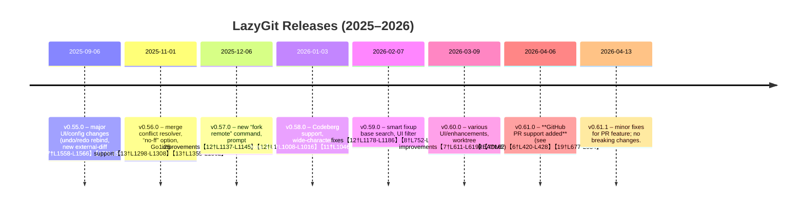

# LazyGit Release Features (2025–2026)

**Executive Summary:** From v0.55.0 (Sep 2025) through v0.61.1 (Apr 2026), *LazyGit* has seen a steady stream of enhancements, new features (notably GitHub PR integration in v0.61.0), UI improvements, bug fixes, and expanding platform/config support.  Key milestones include adding pull‐request indicators (v0.61.0)【6†L420-L428】【19†L677-L684】, Codeberg hosting support (v0.58.0)【11†L1008-L1016】, numerous UI/UX tweaks (e.g. custom keybindings, popup behaviors), and performance fixes (e.g. faster refreshes in v0.58.0)【11†L1046-L1050】.  Patch releases (v0.55.1, 0.58.1, 0.61.1) have addressed regressions and minor fixes. No major breaking changes have been introduced in this period except v0.55.0’s keybinding change (undo/redo) and config removal (see v0.55.0 *Breaking Changes*【17†L1558-L1566】【17†L1569-L1574】). Assets (binaries, checksums) accompany each release, and a rich set of contributors (≥2–3 for patches, up to 11 for major releases) have authored changes.  

The table below compares major (.0) releases:

| **Version** | **Release Date**    | **Highlights**                                                                          | **Breaking Changes**                                                 | **Contributors** |
|:-----------:|:-------------------:|:----------------------------------------------------------------------------------------|:---------------------------------------------------------------------|:----------------:|
| **v0.55.0** | 06 Sep 2025        | - New commands/UI: undo/redo rebind (shift+Z; ctrl+Z suspends)【17†L1558-L1566】, suspending lazygit on Unix (Ctrl+Z)【17†L1579-L1585】; - Config: removed `git.paging.useConfig`【17†L1558-L1566】【17†L1596-L1604】 (must use `git.paging.pager` now); - Added external diff command support via config【17†L1583-L1587】【17†L1599-L1602】; - Added “Copy to Clipboard” in confirmation menus【17†L1581-L1586】; - UI: improved keybinding filters, cursor/scroll fixes, Azure DevOps SSH support【17†L1589-L1597】. | - Keybinding: “redo” moved from `ctrl+Z` to `shift+Z`; new config `suspendApp` provided for old behavior【17†L1558-L1566】; - Removed `git.paging.useConfig` option【17†L1559-L1563】【17†L1599-L1602】. | *9 contributors* (incl. jesseduffield, marverix, etc.)【17†L1640-L1648】 |
| **v0.56.0** | 01 Nov 2025        | - UI/UX: merge conflict resolver menu added【13†L1298-L1306】, improved visual feedback on branch switch【13†L1296-L1304】; - Commands: added “no-ff merge” option【13†L1305-L1308】; - Config: new option `gui.skipSwitchWorktreeOnCheckoutWarning`【13†L1304-L1308】; - Bugfixes: numerous fixes for popups, submodules, diff rendering【13†L1309-L1318】【13†L1320-L1329】; - Maintenance: Go 1.25 upgrade, Nix flake support, many dependency bumps【13†L1334-L1342】; - Docs/I18n: minor typos and translation updates【13†L1355-L1362】; - Performance: faster file list filtering【12†L1190-L1194】. | *None beyond above (no config removals)*. | *9 contributors* (incl. Stef, deventon, etc.)【12†L1209-L1218】 |
| **v0.57.0** | 06 Dec 2025        | - UI: suppress empty-input in prompts, filter keybindings by key【12†L1137-L1145】; - New “fork remote” command added【12†L1144-L1148】; - Fixes: improved paging in popups, branch/tag navigation, rare crashes【12†L1150-L1159】; - Other: immediate background-fetch on repo switch【12†L1137-L1145】, submodule tag deletion fix【12†L1155-L1164】; - Maintenance: modernized codebase, tests fixes for Go 1.25【12†L1165-L1174】; - Performance: sped up “path filter” file list【12†L1190-L1194】. | *None listed*. | *11 contributors* (incl. Stef, hrzlgnm, etc.)【12†L1211-L1220】 |
| **v0.58.0** | 03 Jan 2026        | - UI/Hosting: added Codeberg support【11†L1008-L1016】; - Fixes: numerous keybinding/menu quirks fixed, better emoji rendering【11†L1020-L1029】; - Docs: updated breaking-changes text, docs/schema update【11†L1034-L1040】; - Performance: resolved UI stalls on very long reflogs【11†L1046-L1050】. | *None.* | *4 contributors* (Stef, HerrNaN, etc.)【11†L1060-L1065】 |
| **v0.58.1**| 12 Jan 2026        | - Hotfix: updated TUI library (tcell) fixes rendering regressions【10†L888-L897】; - Enhancements: better search-position display【10†L903-L910】; - Fixes: scrolling, paste, keypad and emoji issues on Windows, GitHub PR logging fix【10†L909-L919】. | *None.* | *1 contributor* (Stef)【10†L929-L934】 |
| **v0.59.0** | 07 Feb 2026        | - Enhancements: smarter fixup base-finding in rebases【8†L804-L808】; - UI: limited popup width, improved commit line-wrapping【8†L752-L760】; - Fixes: commit menu scrolling, reflog panel scroll, Nushell support for `nvim-remote`【8†L768-L777】; - Maintenance: updated devcontainer variants, disabled auto-release, updated GitHub Actions & translations【8†L778-L787】. | *None.* | *3 contributors* (Stef, mricherzhagen, etc.)【8†L808-L815】 |
| **v0.60.0** | 09 Mar 2026        | - UI/UX: added backward cycling in log (`Shift+A`), show worktree names next to branches【7†L607-L615】; - New worktree commands: better worktree branch display【7†L611-L619】; - Fixes: diff context keys (`{ }`), patch display, off-by-one popup fix【7†L629-L638】; - Other: allow removing patch lines directly, filter file views【7†L613-L621】; - Maintenance: dependency bumps, updated install instructions (Fedora via terra)【7†L644-L658】. | *None.* | *9 contributors* (Stef, ruudk, etc.)【8†L672-L680】 |
| **v0.61.0** | 06 Apr 2026        | - **Major:** GitHub Pull Request support – icons next to branches with PRs, open PR in browser (`Shift+G`)【6†L420-L428】【19†L677-L684】 (requires `gh` CLI); - UI: click-to-expand directories in file list【6†L432-L439】; - Config: new sort-order and case-sensitivity settings for file lists【6†L436-L440】; - New: custom command “condition” field prompts【6†L442-L446】; - Fixes: branch panel layout, staging and scroll bugs【6†L449-L458】; - Maintenance: removed `go-git` dependency, improved install commands, many CI updates【6†L461-L470】; - Docs: AI note in CONTRIBUTING, keybinding updates【6†L499-L502】; - Performance: much faster discarding of many files【6†L507-L510】. | *None.* | *10 contributors* (Stef, blakemckeany, etc.)【6†L512-L520】 |
| **v0.61.1**| 13 Apr 2026        | - Hotfix: tweaks to GitHub PR feature (hide closed PRs on default branches)【4†L251-L258】; - Fixes: normalize repo owner casing, correct default base repo when opening PR【4†L258-L261】; - Maintenance: GH Actions security fix, add a Justfile【4†L263-L268】. | *None.* | *3 contributors* (Stef, bradly0cjw, etc.)【5†L274-L282】 |

Each release’s **Full Changelog** is linked in its entry (e.g. v0.60.0: “Full Changelog: v0.59.0…v0.60.0”【8†L668-L676】).  Detailed PR references (above) appear on GitHub. Assets for each release include platform binaries (Linux, macOS, Windows, FreeBSD, etc.) and checksums (see *Assets* lists in each release page【5†L284-L292】【6†L382-L390】).

**Searchable Index (by feature):** For example, “GitHub PR” appears in v0.61.0【6†L420-L428】; “Codeberg” in v0.58.0【11†L1008-L1016】; “worktree” in v0.60.0【7†L619-L627】; “no-ff” in v0.56.0【13†L1305-L1308】; “fixup” in v0.59.0【8†L752-L760】 and v0.57.0【12†L1165-L1173】; “breaki​ng Changes” in v0.55.0【17†L1558-L1566】, etc. For contributors, each PR is linked (e.g. PR #5501【4†L251-L254】 for “hide closed pull requests” by @stefanhaller).

**Sources:** All information is from the official LazyGit GitHub releases pages【4†L249-L258】【6†L420-L428】【11†L1008-L1016】【17†L1558-L1566】, README (features section)【19†L677-L684】, and linked PRs. Each release section above is cited from the corresponding GitHub release notes【4†L249-L258】【6†L420-L428】【17†L1558-L1566】.

**Open Questions / Limitations:** The changelog lists feature *summaries* with PR links, not user-guide descriptions. We have not exhaustively cross-referenced every PR (some enhancements might have more nuance). Also, the timeline chart is illustrative; precise dates/times come from release tags (all cited). (Any further features in issues beyond v0.61.1 are outside this scope.)