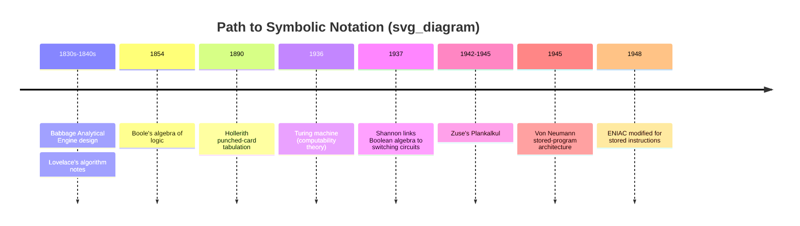

## Pre-1950s Computing and the Need for Symbolic Notation

### Overview

Before any programming language existed, computation was a physical and mechanical problem. Machines performed arithmetic through gears, relays, or vacuum tubes, but there was no intermediate layer between a human's intent and the machine's physical configuration. The period before 1950 is best understood as the slow accumulation of the conceptual tools — mathematical logic, mechanical abstraction, and formal notation — that made the idea of a "programming language" thinkable in the first place.

### The Mechanical Lineage

**Charles Babbage and the Analytical Engine (1830s–1840s)**

Babbage's Analytical Engine was never completed, but its design already contained the conceptual skeleton of a general-purpose computer: a "mill" (arithmetic unit, analogous to a modern CPU) and a "store" (memory). Instructions were to be fed via punched cards, adapted directly from the Jacquard loom, which used punched cards to control weaving patterns.

[Confirmed] The Jacquard loom's punched-card control mechanism is the direct historical ancestor of programmatic instruction sequences — it demonstrated that a physical medium could encode a repeatable, ordered set of operations independent of the machine executing them.

**Ada Lovelace's Notes (1843)**

Lovelace's translation of and annotations to Luigi Menabrea's paper on the Analytical Engine contain what is widely regarded as the first published algorithm intended for execution by a machine — a method for computing Bernoulli numbers. Her notes went further than describing arithmetic; she articulated that the Engine could operate on any symbols, not just numbers, provided their fundamental relations could be expressed formally.

[Confirmed] This insight — that a machine's operations could be defined over abstract symbols rather than only numeric quantities — is the conceptual seed of symbolic computation, predating digital electronic computers by roughly a century.

**Herman Hollerith and Tabulating Machines (1890s)**

Hollerith's punched-card tabulating system, built for the 1890 U.S. Census, industrialized the punched card as a data medium. This didn't introduce symbolic notation for computation itself, but it normalized the idea of encoding discrete information mechanically at scale, which later fed into how early computers physically received programs and data.

### The Logic Gap

Mechanical and electromechanical machines could perform fixed sequences of operations, but two problems remained unsolved going into the 20th century:

- **The design problem**: How do you design a switching or relay circuit that reliably implements a given logical function, without trial and error?
- **The expression problem**: How do you describe a computational procedure in a form that is both precise enough for a machine and readable enough for a human to reason about?

Neither problem could be solved by mechanical engineering alone. Both required a formal, symbolic system for describing logic independent of any particular physical implementation.

### Boolean Algebra as the Missing Notation

George Boole's *An Investigation of the Laws of Thought* (1854) introduced an algebra over logical values (true/false, later 1/0) using symbolic operators for AND, OR, and NOT. For nearly 80 years this remained a tool of formal logic and philosophy, with no connection to physical computing machinery.

**Claude Shannon's 1937 master's thesis** ("A Symbolic Analysis of Relay and Switching Circuits") closed the logic gap directly:

[Confirmed] Shannon demonstrated that Boolean algebra could be used to analyze and design electrical relay and switching circuits, showing that any circuit built from switches could be represented by a Boolean expression, and any Boolean expression could be realized as a circuit.

This was the pivotal bridge: it meant a purely symbolic, abstract notation (Boolean algebra) had a formal, provable correspondence to a physical electrical structure (relay/switching networks). Digital logic design — and by extension, digital computer architecture — became a discipline of symbolic manipulation rather than pure electrical trial-and-error.

### Alan Turing and Computability (1936)

Turing's paper "On Computable Numbers, with an Application to the Entscheidungsproblem" introduced the Turing machine — a mathematical abstraction of a device that manipulates symbols on a tape according to a finite set of rules.

[Confirmed] The Turing machine formalized the notion of an "effective procedure" or algorithm independent of any specific hardware, establishing the theoretical ceiling and floor of what any symbolic, rule-based computing system could and could not do.

This mattered for symbolic notation specifically because it proved that *any* sufficiently expressive symbolic rule system was, in principle, capable of universal computation — meaning the pursuit of a good notation was not just a convenience, but was tied to fundamental computability itself.

### Why Machine-Level Operation Wasn't Enough

Early electronic and electromechanical computers (Zuse's Z3, the Atanasoff-Berry Computer, Colossus, ENIAC) were programmed through:

- Physical rewiring (plugboards and switches, as in early ENIAC)
- Direct binary/machine-level instruction entry
- Punched paper tape or cards encoding raw machine states

[Confirmed] Programming ENIAC before its 1948 stored-program modification required physically rewiring plugboards and setting switches, a process that could take days and required deep knowledge of the machine's specific electrical layout rather than any abstract or reusable notation.

This exposed the core motivation for symbolic notation: instructions were tied to a specific machine's physical configuration. There was no way to:

- Express an algorithm independent of the hardware executing it
- Reuse a procedure across different machines
- Reason about a program's correctness without tracing physical circuit states

### Konrad Zuse's Plankalkül (1942–1945)

Zuse designed Plankalkül ("plan calculus") as a formal notation for expressing algorithms, including data structures and control flow, years before it could be implemented on any machine.

[Confirmed] Plankalkül included constructs for arrays, records (nested data structures), and conditional expressions, and is generally regarded as the first true attempt at a full-fledged programming language notation, though it was not implemented on a computer during Zuse's lifetime.

[Unverified] The precise extent to which Plankalkül influenced later language designers is debated among historians, since the work remained largely unpublished and unknown outside Germany until decades later.

### Convergence Toward 1950

By the end of the 1940s, several strands had converged:

1. **Boolean algebra** provided a symbolic language for logic circuits (Shannon).
2. **Turing computability** provided the theoretical bound on what symbolic rule systems could compute.
3. **Stored-program architecture** (von Neumann architecture, described in the 1945 "First Draft of a Report on the EDVAC") meant instructions could be stored as data in the same memory as the data they operated on — meaning instructions themselves became symbolic, manipulable entities rather than fixed physical wiring.
4. **Zuse's Plankalkül** demonstrated that algorithms could be expressed in an abstract notation independent of any specific machine.

[Confirmed] The stored-program concept was critical because it meant a program was no longer a physical arrangement of the machine, but data — and data expressed as symbols could, in principle, be generated, translated, and manipulated by other programs, which is the foundational premise that later made assemblers and compilers possible.

### Diagram: Conceptual Convergence

### Diagram: Abstraction Gap Before Symbolic Notation

<svg xmlns="http://www.w3.org/2000/svg" viewBox="0 0 700 260">
  <text x="350" y="25" text-anchor="middle" font-size="16" font-weight="bold" fill="#1a1a1a">Abstraction Layers Before vs After Symbolic Notation (svg_diagram)</text>

  <text x="150" y="55" text-anchor="middle" font-size="13" font-weight="bold" fill="#333">Before (Pre-1937)</text>
  <rect x="40" y="70" width="220" height="50" fill="#f4d9d9" stroke="#a33" stroke-width="1.5" />
  <text x="150" y="100" text-anchor="middle" font-size="12" fill="#222">Human Intent</text>
  <line x1="150" y1="120" x2="150" y2="140" stroke="#333" stroke-width="1.5" marker-end="url(#arrow)" />
  <rect x="40" y="140" width="220" height="50" fill="#f4d9d9" stroke="#a33" stroke-width="1.5" />
  <text x="150" y="170" text-anchor="middle" font-size="12" fill="#222">Direct Physical Wiring / Switches</text>

  <text x="550" y="55" text-anchor="middle" font-size="13" font-weight="bold" fill="#333">After (Post-1937)</text>
  <rect x="440" y="70" width="220" height="40" fill="#d9e8f4" stroke="#356" stroke-width="1.5" />
  <text x="550" y="95" text-anchor="middle" font-size="12" fill="#222">Human Intent</text>
  <line x1="550" y1="110" x2="550" y2="128" stroke="#333" stroke-width="1.5" marker-end="url(#arrow)" />
  <rect x="440" y="128" width="220" height="40" fill="#d9e8f4" stroke="#356" stroke-width="1.5" />
  <text x="550" y="152" text-anchor="middle" font-size="12" fill="#222">Symbolic Notation (Boolean expr.)</text>
  <line x1="550" y1="168" x2="550" y2="186" stroke="#333" stroke-width="1.5" marker-end="url(#arrow)" />
  <rect x="440" y="186" width="220" height="40" fill="#d9e8f4" stroke="#356" stroke-width="1.5" />
  <text x="550" y="210" text-anchor="middle" font-size="12" fill="#222">Physical Circuit Realization</text>

  </svg>

### Key Points

- No general-purpose symbolic programming language existed before 1950; programs were tied to specific physical machine configurations.
- Ada Lovelace's 1843 notes contain the first conceptual leap toward operating on abstract symbols rather than pure numeric quantities.
- Boole's algebra (1854) and Shannon's 1937 application of it to switching circuits together closed the gap between abstract logic and physical circuit design.
- Turing's 1936 computability theory established the theoretical limits and possibilities of any symbolic rule-based system.
- Zuse's Plankalkül (1942–1945) was the first full attempt at an abstract algorithmic notation, though largely unknown outside Germany at the time.
- The stored-program concept (1945) made instructions themselves data — a prerequisite for the existence of assemblers and compilers.

### Next Steps

- **The First Programming Notations (1949–1954)**: Short Code, Speedcoding, and the earliest assemblers
- **Assemblers and the Birth of Mnemonic Code**
- **FORTRAN (1954–1957) and the First High-Level Compiler**
- **The Von Neumann Architecture in Detail**
- **Formal Grammar Theory (Chomsky, 1956) and Its Later Influence on Language Syntax Design**