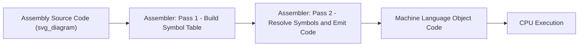

## Machine Language and Assembly Language as First-Generation Tools

### Overview

Machine language and assembly language represent the first true "programming languages" in the historical sense, sitting at the boundary between raw hardware configuration and human-readable notation. Machine language is the direct binary encoding a processor executes natively; assembly language is a thin symbolic layer over it, substituting mnemonics and labels for raw opcodes and addresses. Together they form what is retrospectively called the "first generation" of programming languages, preceding the high-level languages that began with FORTRAN in the mid-1950s.

### Machine Language

**Definition and structure**

Machine language consists of instructions expressed as sequences of binary digits (or their hexadecimal/octal shorthand) that a specific processor's control unit can decode and execute directly, with no translation step.

[Confirmed] Each machine language instruction typically encodes an operation code (opcode) specifying the action to perform, along with operand fields specifying registers, memory addresses, or immediate values the operation acts upon.

A generic instruction layout can be represented conceptually as:

$$\text{Instruction} = \langle \text{opcode} \rangle \, \| \, \langle \text{operand}_1 \rangle \, \| \, \langle \text{operand}_2 \rangle \, \| \, \ldots$$

where $\|$ denotes bit-field concatenation within the instruction word.

**Machine-specificity**

[Confirmed] Machine language is inherently tied to a specific processor's instruction set architecture (ISA); a binary instruction sequence valid on one machine's ISA is generally meaningless or invalid on a machine with a different ISA.

This is the defining limitation that later motivated every subsequent generation of programming languages: machine code has zero portability, and every program had to be authored, debugged, and maintained in terms of the target machine's exact physical instruction encoding.

**Early practice**

Before symbolic assemblers existed, programmers wrote and entered machine code directly, via:

- Toggle switches on a front panel (e.g., early relay and vacuum-tube machines)
- Punched paper tape or cards encoding binary or octal values
- Direct memory-address entry through console input

[Confirmed] Programming the earliest stored-program computers, such as the Manchester Baby (1948) and EDSAC (1949), required entering instructions as raw binary or octal values corresponding directly to the machine's opcode table, with no mnemonic abstraction available.

This process was slow and highly error-prone: a single mistyped bit could alter an opcode entirely, and there was no way to catch such errors before execution except by tracing machine behavior directly.

### The Motivation for Assembly Language

Three practical problems with raw machine coding drove the development of assembly language:

1. **Cognitive load**: Numeric opcodes (e.g., `0010` for "load") are arbitrary and must be memorized or constantly looked up.
2. **Address management**: Jump and branch targets require absolute memory addresses, which shift every time code is inserted or removed elsewhere in the program, forcing manual recalculation.
3. **Error proneness**: Binary/octal transcription errors were common and difficult to detect by inspection.

[Confirmed] Assembly language addresses these problems by substituting mnemonic symbols (such as `ADD`, `MOV`, `JMP`) for numeric opcodes, and by allowing symbolic labels to stand in for memory addresses, which are resolved to actual addresses by a translator program.

### Assembly Language

**Definition**

Assembly language is a symbolic, human-readable notation that maps in a largely one-to-one (or occasionally one-to-few) correspondence to a specific machine's instruction set. Unlike high-level languages, it does not abstract away the underlying architecture; it renames and organizes it.

[Confirmed] Because assembly language instructions correspond closely to machine instructions, assembly programs remain architecture-specific, but they are dramatically more readable and maintainable than raw machine code.

**Core constructs**

A typical assembly instruction has the general form:

```
[label:]  mnemonic  operand1, operand2   ; comment
```

- **Label**: an optional symbolic name for the current memory location, used as a jump/branch target
- **Mnemonic**: the symbolic name for an operation (e.g., `ADD`, `SUB`, `JMP`, `MOV`)
- **Operands**: registers, memory addresses (often symbolic), or immediate values
- **Comment**: human-readable annotation, ignored by the translator

**Example (illustrative, generic assembly-style syntax):**

```asm
        MOV   R1, #5        ; load immediate value 5 into register R1
        MOV   R2, #10       ; load immediate value 10 into register R2
        ADD   R3, R1, R2    ; R3 = R1 + R2
LOOP:   SUB   R3, R3, #1    ; decrement R3
        JNZ   R3, LOOP      ; jump to LOOP if R3 != 0
        HLT                 ; halt execution
```

[Unverified] The exact mnemonic set and addressing syntax shown above is illustrative rather than tied to any single historical architecture; real early assembly dialects (e.g., for EDSAC, IBM 701, or Whirlwind) had their own specific mnemonic vocabularies and syntactic conventions.

### The Assembler as the First Language Translator

**Definition and function**

An assembler is a program that translates assembly language source text into machine language object code. It is historically significant as the first example of a program that processes another program as its input data.

[Confirmed] The assembler performs symbol resolution (converting mnemonic and label references into their corresponding binary opcodes and numeric addresses) and typically operates in either one pass or two passes over the source code.

**One-pass vs. two-pass assembly**

- **One-pass assemblers** resolve symbols as they are encountered, which struggles with "forward references" (a jump to a label defined later in the program) unless patched after the fact.
- **Two-pass assemblers** first scan the entire source to build a symbol table (mapping every label to its resolved address), then perform a second pass to emit final machine code using that completed table.

[Confirmed] The two-pass approach became the standard technique for handling forward references cleanly, and the symbol-table technique it introduced became a foundational concept reused by every subsequent generation of compilers.

**Kathleen Booth and early assembler development**

[Confirmed] Kathleen Booth is credited with coining the term "assembler" and developing early assembly programs for machines including the ARC2 at Birkbeck College in the early 1950s.

### Historical First Examples

| System | Approx. Date | Notes |
|---|---|---|
| Manchester Baby / Mark 1 | 1948–1949 | Programmed directly in binary/machine code; no assembler |
| EDSAC | 1949 | Used "Initial Orders," a primitive symbolic loader/assembler-like mechanism written by Wilkes and colleagues |
| ARC assemblers (Booth) | Early 1950s | Among the earliest true symbolic assemblers |
| IBM 701 Symbolic Optimal Assembly Program (SOAP) | 1954 | Early production assembler for a commercial machine |

[Unverified] The precise classification of EDSAC's "Initial Orders" as a full assembler versus a more limited symbolic loader is debated among historians of computing, since it predates a standardized definition of what constitutes an assembler.

### Advantages Over Raw Machine Coding

- **Symbolic addressing**: labels eliminate manual address recalculation when code changes
- **Mnemonic clarity**: operation names are easier to read, write, and debug than numeric opcodes
- **Macro support** (in later assemblers): reusable named sequences of instructions, reducing repetition
- **Error detection**: assemblers can catch malformed instructions or undefined symbols before execution, unlike raw binary entry

### Persistent Limitations

Despite these advantages, assembly language retained fundamental first-generation limitations:

[Confirmed] Assembly language programs are not portable across different instruction set architectures, since mnemonics map directly to a specific machine's opcode set and register model.

- No abstraction over control structures (loops and conditionals must be manually constructed from jumps and comparisons)
- No abstraction over data types (all data is manipulated at the level of raw bits, bytes, or words)
- Programmer must manage registers and memory manually, with no automated allocation
- Verbosity: expressing even simple algorithms requires many individual instructions

These limitations are precisely what motivated the shift toward high-level languages, where a single statement could express what previously required dozens of assembly instructions, at the cost of an additional translation layer (a compiler) between source code and machine execution.

### Diagram: Translation Pipeline



### Key Points

- Machine language is the native binary instruction format a processor executes with no translation.
- Early stored-program computers (Manchester Baby, EDSAC) were programmed directly in binary/octal, with high error rates and no symbolic abstraction.
- Assembly language substitutes mnemonics for opcodes and symbolic labels for addresses, resolved by an assembler.
- The assembler introduced the symbol table technique and was the first instance of a program translating another program, a concept reused by all later compilers.
- Both machine and assembly language remain architecture-specific and offer no portability across differing instruction sets.
- These persistent limitations directly motivated the development of high-level, machine-independent programming languages.

### Next Steps

- **Early High-Level Language Precursors: Short Code and Speedcoding (1949–1953)**
- **FORTRAN (1954–1957): The First Widely Adopted High-Level Compiler**
- **Symbol Tables and Their Evolution into Modern Compiler Design**
- **Macro Assemblers and Reusable Instruction Templates**
- **Instruction Set Architectures: CISC vs. RISC Design Philosophy**