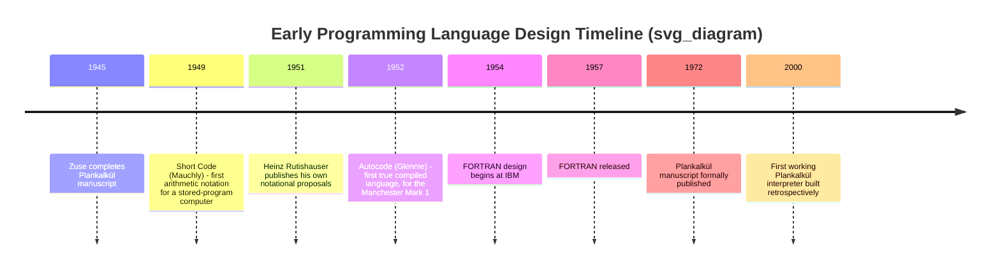

## Plankalkül and Early Language Design Attempts

### Historical Context

Konrad Zuse designed Plankalkül ("Plan Calculus" or "Calculus of Programs") between 1942 and 1945, largely in isolation from the Anglo-American computing community that would later produce FORTRAN and COBOL. Zuse worked on the language while completing his mechanical and electromechanical computers (the Z1 through Z4) in wartime and immediate postwar Germany. He documented the language fully in a 1945 manuscript, but it was not published in a widely accessible form until 1972, and no compiler existed until a team implemented one retrospectively in 2000 at the Free University of Berlin to verify Zuse's design.

This isolation matters for understanding the language's place in history. Plankalkül did not influence FORTRAN, ALGOL, or COBOL because almost no one in the field knew it existed until decades after those languages had already shaped programming practice. It is significant primarily as an intellectual artifact: evidence that the conceptual leap from wiring instructions to an abstract notation for algorithms could occur before electronic stored-program computers were even built.

### Design Goals

Zuse wanted a notation that could express algorithms independently of any specific machine, readable on paper without a computer present, similar in spirit to how mathematicians write proofs. He was explicitly trying to solve problems beyond arithmetic — his example programs include sorting, chess move legality checking, and floating-point operations, which was ambitious given that floating-point hardware barely existed at the time.

### Core Language Features

**Key Points**

- **Structured data types**: Plankalkül supported arrays and nested records (which Zuse called "structures"), decades before most contemporaries treated composite data as a first-class concern
- **Assignment notation**: Values were computed and assigned to variables identified by line number and subscript rather than by name, reflecting Zuse's attempt at a purely symbolic calculus
- **Boolean data type**: Zuse included a dedicated logical type for true/false values, which he used for conditionals
- **No explicit loop construct**: There was no `while` or `for` construct as later languages defined them; iteration was expressed through repetition schemes and conditional jumps, which [Inference] likely reflected both the calculus-style notation goal and the absence of any working implementation to pressure-test control-flow ergonomics
- **No goto in the later sense, but no subroutine calls either**: Plankalkül lacked reusable procedures with parameters in the modern sense, which limited how modular programs could be

The notation itself was two-dimensional: rather than writing a single line like `x = a + b`, Zuse wrote expressions across multiple stacked rows, with type and structure annotations occupying separate lines above the variable identifiers. This made the language visually closer to a mathematical derivation than to anything resembling modern source code.

### Example: Structure of a Plankalkül Statement

A simplified rendering of the notation's spirit (not exact original symbols, since Zuse's system used a specialized multi-row layout difficult to reproduce in linear text):

```
V0[:K]     -- variable V0, subscript K
+          -- addition operator
V1[:K]     -- variable V1, subscript K
=>         -- result assigned to
R1[:K]
```

Each line of an actual Plankalkül program carried several parallel rows: one for the operation, one for the variable identifiers, one for the structure ("subscript") information, and one for the data type. This vertical stacking is one of the reasons the language was difficult to typeset and one of the reasons it saw no practical implementation for over fifty years.

### Diagram: Plankalkül's Place Among Early Language Efforts



### Other Early Language Design Attempts

Plankalkül was not the only pre-FORTRAN attempt to formalize programming, though it is the earliest fully developed one.

**Short Code**, developed by John Mauchly and colleagues around 1949 for the BINAC and later UNIVAC I, allowed mathematical expressions to be written in a semi-symbolic form that was then translated (interpreted, not compiled) into machine instructions. It was slow because it was interpreted rather than compiled, but it demonstrated that programmers did not have to write raw machine or assembly code to get correct results.

**Heinz Rutishauser's notational work** in the early 1950s in Switzerland proposed formula-based notations for expressing computations and directly influenced the later design of ALGOL. Rutishauser is sometimes credited as one of the first people to describe, in print, the general concept of a compiler — a program that translates a higher-level notation into machine code.

**Autocode**, created by Alick Glennie in 1952 for the Manchester Mark 1, is often cited as the first programming language for which a compiler actually existed and ran. This distinguishes it from Plankalkül (designed but not compiled until 2000) and arguably makes Autocode, not Plankalkül, the practical starting point of the compiled-language lineage that leads to FORTRAN.

**Speedcoding**, developed by John Backus at IBM around 1953 for the IBM 701, was an interpreter that supported floating-point arithmetic on hardware that lacked it natively. Backus's experience building Speedcoding and observing its performance limitations directly informed his subsequent leadership of the FORTRAN project, where compiled (rather than interpreted) execution was treated as a hard requirement to achieve acceptable speed.

### Why Plankalkül Did Not Shape Mainstream Language History

Three factors explain the gap between Plankalkül's conceptual sophistication and its historical influence:

1. **Geographic and political isolation** — Zuse worked in wartime and postwar Germany, cut off from the American and British computing efforts at Bell Labs, IBM, Harvard, and Manchester.
2. **No implementation** — a language description with no compiler or interpreter cannot be tested, refined through use, or adopted by other programmers. Plankalkül remained theoretical for Zuse's contemporaries.
3. **Delayed publication** — the 1945 manuscript did not see full publication until 1972, by which point FORTRAN, LISP, ALGOL, and COBOL had already been in production use for over a decade and had already established the conventions (linear one-dimensional syntax, named subroutines, C-style or ALGOL-style control flow) that define mainstream language design to this day.

[Unverified] The precise extent to which any 1950s American or British language designer had informal awareness of Zuse's work before 1972 is not well documented and is generally treated by historians as negligible to nonexistent.

### Conclusion

Plankalkül represents an early, historically isolated demonstration that abstract algorithmic notation was conceivable before electronic stored-program computers matured. Its structured data types and boolean support were ahead of contemporary practice, but its lack of implementation and its delayed publication meant it functioned as a historical curiosity rather than a design ancestor of later languages. The practical lineage that leads to FORTRAN and its successors instead runs through Short Code, Rutishauser's notational work, and Autocode — languages that, whatever their limitations, were actually implemented and used.

### Related Topics

- Short Code and the earliest interpreted languages on stored-program computers
- Rutishauser's contributions and their direct line to ALGOL 58/60
- Autocode and the Manchester Mark 1 compiler
- Speedcoding and John Backus's path toward FORTRAN
- FORTRAN (1957) — the first widely adopted high-level compiled language
- The compiler concept: origins and early formalizations
- COBOL and the parallel development of business-oriented language design