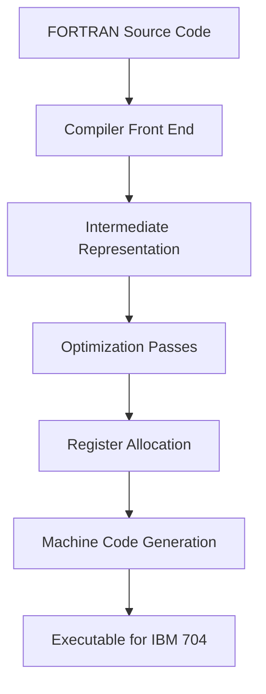

## FORTRAN and the Birth of High-Level Languages

### Historical Context

FORTRAN (FORmula TRANslation) originated at IBM starting in 1954, led by John Backus, with the first compiler released in 1957 for the IBM 704. It is generally credited as the first widely used high-level programming language and the first to demonstrate that compiled code could run efficiently enough to displace hand-written assembly language for serious numerical work.

Backus's team faced a credibility problem before they faced a technical one. In the mid-1950s, most programmers and managers believed that any translator sitting between a programmer's notation and machine code would produce code too slow to be worth using — assembly language was considered the only serious option for production software. Backus's prior experience with Speedcoding, an interpreted system he had built for the IBM 701, reinforced this concern directly: Speedcoding worked, but its interpreted execution was roughly ten to twenty times slower than hand-written assembly, which was unacceptable for the numerical workloads IBM customers actually ran. The central engineering bet behind FORTRAN was that a *compiled* language — one translated once into machine code rather than interpreted line-by-line at runtime — could approach the performance of hand-tuned assembly while sparing programmers from writing it directly.

### Design Goals and Constraints

FORTRAN's design priorities, in the order Backus's team generally weighted them:

1. **Execution speed close to hand-written assembly** — this was the non-negotiable constraint, since a slow compiled language would simply confirm the era's skepticism
2. **Reduced programmer effort for numerical and scientific computation** — the target audience was engineers and scientists writing formulas, not systems programmers
3. **A notation resembling ordinary algebraic formulas** — hence "Formula Translation," so that expressions like physics equations could be typed close to how they'd be written on paper
4. **Portability across IBM's own machine generations** — a weaker goal than the first two, and one FORTRAN only partially achieved even within IBM's own product line, let alone across vendors

The compiler's optimization techniques were aggressive for the time, including doing significant work to allocate registers efficiently and eliminate redundant computation, because Backus's team knew that if the very first compiled program ran noticeably slower than its assembly equivalent, the entire argument for high-level languages would lose credibility within the industry.

### Core Language Features

**Key Points**

- **Algebraic expression syntax**: statements like `X = A + B * C` closely mirrored standard mathematical notation, a major usability leap from the symbolic, machine-oriented notations of Short Code or Speedcoding
- **DO loops**: FORTRAN introduced explicit iteration constructs, letting programmers express repetition without manually managing jump instructions
- **Named subroutines and functions**: unlike Plankalkül, FORTRAN supported reusable, parameterized procedures, which enabled genuine code modularity
- **Fixed-column source format**: early FORTRAN required code in specific character columns (columns 7–72 for statements, column 6 for continuation, columns 1–5 for labels), a constraint driven directly by the punched-card hardware of the era rather than by any language-design preference
- **GOTO-based control flow**: FORTRAN's conditional branching relied heavily on `IF` combined with `GOTO` to numbered statement labels, since structured control constructs like `IF-THEN-ELSE` blocks did not yet exist in the language's early versions
- **Static memory allocation**: variables had fixed storage determined at compile time, with no dynamic memory management, reflecting both hardware limitations and the numerical-computation focus of the target audience

### Example: Basic FORTRAN Structure

The following illustrates early FORTRAN style (later standardized as FORTRAN IV/66 conventions, since the original 1957 dialect predates most surviving documentation of exact syntax):

```fortran
      PROGRAM AREA
      REAL R, A
      R = 5.0
      A = 3.14159 * R * R
      PRINT 10, A
   10 FORMAT(1X, F10.2)
      STOP
      END
```

Several things stand out relative to later languages: the `FORMAT` statement is a separate, numbered statement that the `PRINT` statement references by label — output formatting was not embedded inline the way it is in most modern languages. The `STOP` and `END` distinction (STOP halts execution, END marks the physical end of the program text) also reflects a machine-oriented mindset rather than a purely logical one.

### Diagram: FORTRAN Compilation Model



### Why "Compiled, Not Interpreted" Was the Central Bet

The distinction between compiling and interpreting is easy to take for granted now, but in 1954 it was an open engineering question whether a compiler could produce code fast enough to matter. Interpreted systems like Speedcoding re-examined and re-translated each instruction every time it executed, which meant the translation overhead was paid repeatedly during a program's run. A compiler pays that translation cost once, before execution, and then the resulting machine code runs at native hardware speed. Backus's team's early benchmarks reportedly showed FORTRAN-compiled code running at roughly half the speed of the best hand-written assembly for comparable tasks — [Speculation] a ratio contemporaries apparently regarded as remarkably close, though the fact that FORTRAN saw rapid adoption at IBM customer sites shortly after release is well documented and supports that this performance was judged acceptable by users of the era.

### FORTRAN's Influence on Subsequent Language Design

FORTRAN established several conventions that persisted well beyond its own use:

- **The compiler as standard infrastructure** — after FORTRAN's success, building a compiler (rather than an interpreter) became the default expectation for a serious general-purpose language
- **Numeric type distinctions** — FORTRAN's separation of `INTEGER` and `REAL` types influenced type systems in nearly every subsequent procedural language
- **Loop constructs as first-class syntax** — the `DO` loop's existence as dedicated syntax, rather than something built from conditionals and jumps as in Plankalkül, became the expected baseline for procedural languages going forward
- **Numerical computing as a legitimate domain for high-level languages** — FORTRAN's success proved that scientific and engineering computation, not just business data processing, could be handled by a compiled high-level language without unacceptable performance loss

### Limitations of Early FORTRAN

Early FORTRAN's constraints are worth naming plainly rather than glossing over:

- No structured control flow (`IF-THEN-ELSE` blocks, `WHILE` loops) — all non-sequential control ran through numbered-label `GOTO` targets, which later came to be seen as a significant source of hard-to-follow ("spaghetti") code
- No recursion in early versions, since the call stack model needed to support it was not part of the original design
- No dynamic data structures — arrays had fixed, compile-time-determined bounds
- Column-based source formatting tied directly to 80-column punched card hardware, a constraint that persisted in the language's conventions long after punched cards themselves became obsolete

[Inference] These limitations were less a failure of foresight than a direct consequence of targeting hardware (the IBM 704) with extremely limited memory and no operating system in the modern sense to provide services like dynamic memory allocation or stack-based function calls.

### Conclusion

FORTRAN's significance lies less in any single language feature and more in proving a contested engineering hypothesis: that a compiled high-level language could match assembly-level performance closely enough to justify abandoning direct machine-code programming for numerical computing. That single demonstration reshaped the industry's assumptions about what compilers could achieve and set the expectation — still in force in mainstream language design today — that a serious general-purpose language is compiled rather than interpreted, or at minimum offers a compiled execution path when performance matters.

### Related Topics

- FORTRAN II and the introduction of subroutines with parameter passing
- The IBM 704 architecture and its influence on early language constraints
- ALGOL 58/60 and the shift toward structured, block-based control flow
- COBOL and the parallel emergence of business-oriented high-level languages
- The compiler optimization techniques pioneered by Backus's team
- LISP (1958) and the divergence toward symbolic, non-numerical computation
- The transition from GOTO-based control flow to structured programming