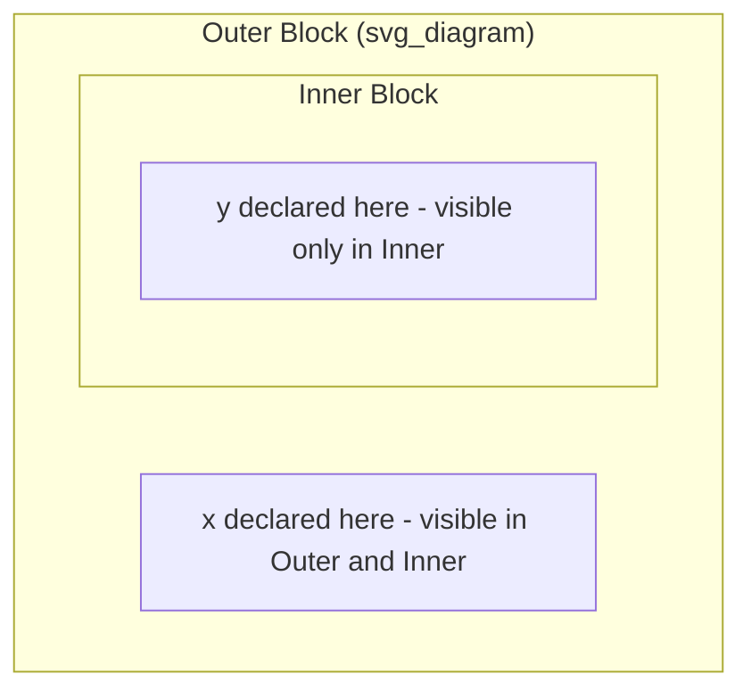

## ALGOL and Its Influence on Language Structure

### Historical Context

ALGOL (ALGOrithmic Language) emerged from a series of international committee efforts in the late 1950s, driven by a shared frustration among European and American computer scientists that FORTRAN was too tied to IBM hardware and too limited in its control-flow expressiveness to serve as a universal notation for describing algorithms. ALGOL 58 was the first published specification, produced by a joint European-American committee (including John Backus himself, alongside European researchers like Heinz Rutishauser and Friedrich Bauer), but it was ALGOL 60 — refined at a 1960 Paris conference — that became the version with lasting influence.

Unlike FORTRAN, which grew out of a specific vendor's need to sell compiler technology alongside hardware, ALGOL was explicitly designed as a language for publishing algorithms in academic papers, not primarily as a product to be implemented and shipped. This distinction shaped nearly everything about how the language turned out.

### Design Goals

ALGOL's committee pursued goals that were, in several respects, a direct reaction against FORTRAN's constraints:

1. **Machine independence** — the language should describe an algorithm without reference to any particular computer's architecture, unlike FORTRAN's punched-card column conventions and IBM 704-specific assumptions
2. **Precise, unambiguous specification** — ALGOL 60's report used a formal grammar notation (Backus-Naur Form, developed by Backus and refined by Peter Naur) to define syntax rigorously, rather than relying on prose description and worked examples the way FORTRAN's documentation had
3. **Structured control flow** — replacing FORTRAN's numbered-label `GOTO` style with block-structured constructs that could be nested and reasoned about hierarchically
4. **Recursive procedure support** — a capability FORTRAN's original design lacked entirely, requiring an explicit stack-based calling model

### Core Language Features

**Key Points**

- **Block structure**: ALGOL introduced the `begin ... end` block as a fundamental unit of scope, letting variables be declared local to a specific block rather than existing at global or subroutine-wide scope by default
- **Lexical scoping**: variable visibility was determined by the static nesting of blocks in the source text, a model that became the default assumption in nearly every subsequent procedural and many functional languages
- **Recursion**: ALGOL 60 explicitly supported recursive procedure calls, requiring compiler implementers to adopt a stack-based activation record model for managing function calls — a mechanism that remains the standard implementation strategy for procedure calls today
- **Structured conditionals and loops**: `if-then-else` and `for` constructs replaced reliance on `GOTO` and numbered statement labels for ordinary control flow, though ALGOL 60 retained `goto` as an available (if discouraged) statement
- **Call by value and call by name**: ALGOL 60 offered two distinct parameter-passing mechanisms; call by name, in particular, had subtle and sometimes surprising semantic effects (it re-evaluated the argument expression at each use inside the called procedure) that later languages largely abandoned in favor of simpler models
- **Formal grammar specification**: Backus-Naur Form gave the language a precise, machine-checkable syntax definition, establishing formal grammars as the expected standard for describing programming language syntax going forward

### Example: Block Structure and Scope

```algol
begin
    integer x;
    x := 5;
    begin
        integer y;
        y := x + 1;
        print(y)
    end;
    print(x)
end
```

In this fragment, `y` exists only within the inner block and is inaccessible outside it, while `x` remains visible throughout both the outer and inner blocks because the inner block is nested within the outer one. This nesting-determines-visibility rule is what "lexical scoping" means, and it is the scoping model used by the large majority of languages designed after ALGOL, including C, Pascal, and (with variations) most modern languages.

### Diagram: ALGOL's Block Nesting and Scope Visibility



### Backus-Naur Form: A Lasting Contribution

Perhaps ALGOL 60's single most durable technical contribution was not a language feature at all but a notation for describing language features: Backus-Naur Form (BNF). Before BNF, language syntax was typically described through prose and representative examples, an approach that left considerable room for ambiguity and disagreement about edge cases. BNF expressed grammar rules as a set of production rules, for instance:

$$\langle \text{if-statement} \rangle ::= \text{if } \langle \text{condition} \rangle \text{ then } \langle \text{statement} \rangle \mid \text{if } \langle \text{condition} \rangle \text{ then } \langle \text{statement} \rangle \text{ else } \langle \text{statement} \rangle$$

This formalism let language designers specify syntax with the same rigor mathematicians expect from a formal system, and it directly enabled the development of automated parser-generator tools in later decades, since a BNF grammar can, with the right extensions, be mechanically converted into parsing code. Virtually every programming language reference manual published since ALGOL 60 uses BNF or one of its direct descendants (Extended BNF, and others) to specify syntax.

### ALGOL's Influence on Later Languages

ALGOL's structural ideas propagated into subsequent language design through what is often informally called the "ALGOL family" or "ALGOL-like languages," a lineage that includes:

- **Pascal** (Niklaus Wirth, 1970) — retained ALGOL's block structure and added stronger static typing, largely as a teaching-oriented refinement of ALGOL's ideas
- **C** (Dennis Ritchie, early 1970s) — inherited block structure, `if-else`, and `for`-style looping conventions, though C diverged from ALGOL in its approach to typing and its closer relationship to underlying machine operations
- **Simula** (Ole-Johan Dahl and Kristen Nygaard, 1960s) — extended ALGOL's block concept toward object-oriented programming, introducing classes as an extension of the block idea, and is generally credited as the first object-oriented language
- **Ada, Modula-2, and most subsequent block-structured languages** — carried forward lexical scoping and structured control flow as unquestioned defaults rather than novel design choices

[Inference] The breadth of this influence is likely why ALGOL is sometimes described in retrospective accounts as a language that few people used directly for production software but that shaped how nearly every subsequent procedural and object-oriented language was structured.

### ALGOL's Practical Limitations

Despite ALGOL 60's substantial influence on language theory and structure, it saw limited commercial adoption compared to FORTRAN and COBOL, for several documented reasons:

- **No standardized input/output facilities** — the ALGOL 60 report deliberately left I/O unspecified, treating it as outside the scope of the algorithmic notation, which meant every implementation had to invent its own I/O conventions, undermining the portability the language was designed to achieve
- **Call-by-name semantics were difficult to implement efficiently** and produced behavior that some programmers found unintuitive, particularly when combined with side effects in argument expressions
- **Limited vendor and industry backing** compared to FORTRAN, which had IBM's commercial weight behind it, and COBOL, which had U.S. Department of Defense backing driving standardization and adoption

### Conclusion

ALGOL's historical role is somewhat paradoxical: a language with modest direct commercial deployment that nonetheless supplied the structural vocabulary — block scope, structured control flow, recursive procedures, and formal grammar specification via BNF — that essentially every subsequent procedural and object-oriented language adopted as baseline assumptions. Where FORTRAN proved that compiled high-level languages could be fast, ALGOL proved that they could also be structurally rigorous and theoretically well-founded, and that combination of lessons shaped the trajectory of language design for decades afterward.

### Related Topics

- Backus-Naur Form and its extensions (EBNF) in modern language specification
- Simula and the origins of object-oriented programming
- Pascal and structured programming pedagogy
- The GOTO controversy and Dijkstra's structured programming arguments
- Call-by-value, call-by-reference, and call-by-name parameter passing semantics
- COBOL and its contrasting design priorities for business computing
- The development of parser-generator tools from formal grammars