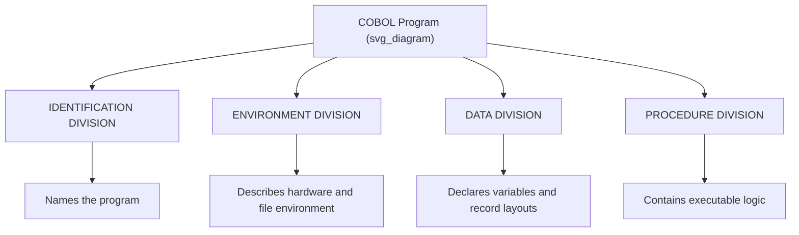

## COBOL and Business-Oriented Computing

### Historical Context

COBOL (COmmon Business-Oriented Language) originated from a 1959 meeting convened by the U.S. Department of Defense, which faced a practical problem: the DoD operated a large and growing number of incompatible computers, each typically requiring its own specialized programming approach for routine business tasks like payroll, inventory, and billing. Grace Hopper, who had already built an influential early compiler (the A-0 system) and championed the idea that compilers could translate English-like statements into machine code, was a central intellectual influence on the effort, though the actual language design was carried out by the CODASYL (Conference on Data Systems Languages) committee rather than by Hopper alone.

The first COBOL specification was published in 1960, and the language was deliberately built to run on multiple manufacturers' hardware from the outset — a goal FORTRAN had not seriously pursued and ALGOL had aspired to but struggled to achieve in practice due to its unspecified I/O model. The DoD reinforced this goal with real institutional leverage: it announced that it would not lease or purchase computer hardware unless the manufacturer provided a compatible COBOL compiler, which gave hardware vendors a direct commercial incentive to implement the language faithfully.

### Design Goals

COBOL's design priorities differed substantially from FORTRAN's and ALGOL's, reflecting its target audience of business users and managers rather than scientists or academic computer scientists:

1. **Readability by non-programmers** — COBOL syntax was deliberately verbose and English-like, on the theory that managers and auditors without programming training should be able to read, and partially verify, what a COBOL program did
2. **Portability across vendors** — a program written in standard COBOL was intended to run with minimal modification on hardware from different manufacturers, backed by the DoD's procurement leverage
3. **Strong support for business data processing** — fixed-format records, decimal arithmetic suited to currency calculations, and file-handling facilities were treated as core requirements rather than afterthoughts
4. **Longevity and stability** — because business systems were expected to run for years or decades, the language prioritized a stable, standardized specification over rapid evolution of new features

### Core Language Features

**Key Points**

- **English-like syntax**: statements read closer to natural-language sentences than to mathematical notation, for example `ADD SALARY TO TOTAL-PAY` rather than `total_pay = total_pay + salary`
- **Four-division program structure**: every COBOL program is organized into `IDENTIFICATION DIVISION`, `ENVIRONMENT DIVISION`, `DATA DIVISION`, and `PROCEDURE DIVISION`, each with a distinct, mandatory purpose
- **Fixed decimal arithmetic**: COBOL's `PICTURE` (`PIC`) clauses let programmers specify exact decimal precision for currency and quantity fields, avoiding the rounding errors that binary floating-point representations can introduce for financial calculations
- **Record-oriented file handling**: COBOL treated structured file records as a first-class concept, with `PIC` clauses defining field layouts precisely, since business data processing centered on reading and writing large volumes of structured records rather than performing complex numerical algorithms
- **Verbose keyword-based syntax**: constructs like `PERFORM UNTIL`, `MOVE ... TO ...`, and `IF ... END-IF` favored explicit English keywords over symbolic operators, prioritizing readability over notational compactness

### Example: Basic COBOL Program Structure

```cobol
       IDENTIFICATION DIVISION.
       PROGRAM-ID. CALCULATE-PAY.

       DATA DIVISION.
       WORKING-STORAGE SECTION.
       01 HOURS-WORKED    PIC 9(3).
       01 HOURLY-RATE     PIC 9(3)V99.
       01 GROSS-PAY       PIC 9(5)V99.

       PROCEDURE DIVISION.
       COMPUTE GROSS-PAY = HOURS-WORKED * HOURLY-RATE.
       DISPLAY "GROSS PAY: " GROSS-PAY.
       STOP RUN.
```

The `PIC 9(3)V99` clause is worth pausing on: `9(3)` specifies three numeric digit positions, and `V99` specifies an implied decimal point followed by two more digit positions — meaning this field can hold values like `123.45` while storing the decimal point only implicitly, not as a literal character, which was a deliberate efficiency choice suited to the fixed-record, high-volume nature of business file processing.

### Diagram: COBOL's Four-Division Structure



### Why Verbosity Was a Deliberate Design Choice, Not an Oversight

COBOL's wordiness is frequently mocked in retrospective commentary, but it reflected a specific and considered goal rather than poor design judgment. The CODASYL committee wanted business managers, auditors, and non-specialist stakeholders to be able to read a COBOL program's logic and have reasonable confidence about what it did, without needing to learn a symbolic notation first. Whether this goal was fully achieved in practice is more debatable — [Speculation] a program with hundreds of `MOVE` and `PERFORM` statements is arguably no more genuinely comprehensible to an untrained reader than an equivalent FORTRAN or ALGOL program, even if individual statements read as English sentences — but the intent behind the choice was documented and deliberate, not accidental.

### COBOL's Influence and Legacy

COBOL's practical impact on the software industry is difficult to overstate, even though it receives less attention in language-design history than FORTRAN, ALGOL, or LISP:

- **Financial and government infrastructure**: a substantial share of banking, insurance, payroll, and government benefits systems built from the 1960s through the 1990s were written in COBOL, and a considerable portion of that code remains in active production use today, decades after the language ceased to be fashionable
- **Standardization precedent**: COBOL underwent formal ANSI standardization (1968, with subsequent revisions), establishing a model for industry-wide language standardization that later languages such as C, Ada, and SQL would also follow
- **Separation of data description from procedural logic**: the `DATA DIVISION`/`PROCEDURE DIVISION` split anticipated, in a limited way, later software-engineering emphasis on separating data structure definitions from the logic that operates on them
- **Decimal-precise arithmetic as a distinct requirement**: COBOL's `PIC` clause approach to exact decimal representation directly foreshadowed the decimal data types found in later database systems and languages designed for financial computing

### COBOL's Practical Limitations

- **Extreme verbosity** made programs lengthy to write and, per the point above, did not necessarily deliver on the readability goal for genuinely complex logic
- **Weak support for complex algorithms**: COBOL was not designed for scientific computing, recursive algorithms, or sophisticated data structures, and using it outside straightforward business record-processing tasks was often awkward
- **Limited abstraction facilities** in early versions, with modern object-oriented and modular extensions arriving only in much later standard revisions (COBOL 2002 introduced object-oriented syntax, decades after languages like Simula and Smalltalk had already established those paradigms)
- **The "GOTO problem" applied here too**: early COBOL relied heavily on `GO TO` for control flow, similar to early FORTRAN, before structured programming constructs like `PERFORM ... UNTIL` became standard practice

[Inference] COBOL's continued presence in critical infrastructure, well after it stopped being taught as a primary language in most computer science programs, is likely attributable less to any technical superiority and more to the sheer cost and risk of rewriting large, well-tested financial systems that have operated reliably for decades — a dynamic sometimes referred to informally as "legacy lock-in."

### Conclusion

COBOL's historical significance lies in demonstrating that a programming language's design priorities can and should differ sharply depending on its target domain and audience. Where FORTRAN optimized for numerical computation speed and ALGOL optimized for structural and theoretical rigor, COBOL optimized for readability by non-specialists, decimal precision suited to financial calculation, and cross-vendor portability backed by government procurement policy. That combination of priorities, whatever its aesthetic reputation among academic computer scientists, produced a language whose code remains embedded in critical financial and governmental infrastructure worldwide today.

### Related Topics

- Grace Hopper and the development of the A-0 compiler
- CODASYL and the committee-driven language standardization model
- Fixed-point decimal arithmetic versus binary floating-point representation
- The persistence of legacy COBOL systems in modern banking infrastructure
- Structured programming's influence on later COBOL standard revisions
- SQL and its relationship to COBOL-era business data processing
- Object-oriented COBOL (COBOL 2002) and its departure from the original procedural model