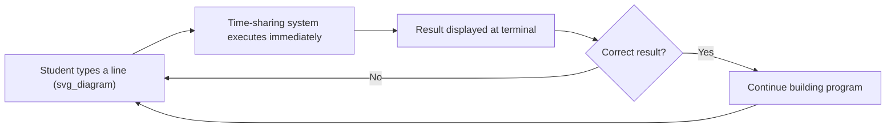

## BASIC and the Democratization of Programming

### Historical Context

BASIC (Beginner's All-purpose Symbolic Instruction Code) was developed in 1964 at Dartmouth College by John Kemeny and Thomas Kurtz, motivated by a specific institutional goal: making programming accessible to undergraduate students across all academic disciplines, not just mathematics and engineering majors who had traditionally been the primary users of computing resources. This goal shaped essentially every design decision in the language.

Kemeny and Kurtz's broader project extended beyond the language itself. They also developed the Dartmouth Time-Sharing System (DTSS), which let dozens of students simultaneously write and run programs from terminals connected to a shared central computer, replacing the batch-processing model where programmers submitted punched-card decks and waited hours (or overnight) for results. BASIC and time-sharing were designed together, and this pairing mattered enormously: a language built for beginners is far more useful pedagogically when a student can type a line of code, run it immediately, see the result, and try again within seconds, rather than waiting for a batch job to complete.

### Design Goals

Kemeny and Kurtz's stated goals for BASIC, drawn from their own writings on the project, differed sharply from the priorities driving FORTRAN, ALGOL, COBOL, or Lisp:

1. **Immediate accessibility for complete beginners** — a student with no prior programming experience should be able to write a working program within their first sitting at a terminal
2. **Interactive, immediate feedback** — errors and results should appear right away, rather than after a batch-processing delay, reinforcing learning through fast iteration
3. **Simplicity over expressive power** — BASIC deliberately omitted many features found in FORTRAN and ALGOL (complex data structures, sophisticated control constructs) in favor of a small, easily memorized set of commands
4. **Universality across academic disciplines** — the language was meant to be useful to a humanities or social-science student solving a simple numerical problem, not exclusively to engineering or physics majors

### Core Language Features

**Key Points**

- **Line-numbered statements**: original BASIC required every statement to carry an explicit numeric line label (`10`, `20`, `30`, and so on), which served both as a way to order execution and as a target for `GOTO` and `GOSUB` jumps
- **Minimal keyword set**: commands like `PRINT`, `INPUT`, `LET`, `IF...THEN`, `FOR...NEXT`, and `GOTO` covered the large majority of what a beginner needed, in contrast to the larger vocabularies of COBOL or the more abstract constructs of ALGOL
- **Simple variable model**: original BASIC used single-letter or letter-plus-digit variable names (`A`, `B1`, `X`) with only a small number of data types (numeric and string), avoiding the more elaborate type systems of contemporaries
- **`GOTO`-and-line-number control flow**: much like early FORTRAN, original BASIC relied heavily on `GOTO` targeting line numbers for anything beyond the simplest sequential logic, since structured control constructs had not yet been incorporated into the earliest dialects
- **Immediate mode execution**: beyond running full programs, many BASIC implementations let a user type a single command directly and see it execute immediately, reinforcing the interactive, exploratory character the language was designed around

### Example: Classic Line-Numbered BASIC

```basic
10 PRINT "ENTER YOUR AGE"
20 INPUT A
30 IF A >= 18 THEN GOTO 60
40 PRINT "YOU ARE A MINOR"
50 GOTO 70
60 PRINT "YOU ARE AN ADULT"
70 END
```

This example illustrates both BASIC's approachability and the control-flow style that later drew criticism: the logic is readable line by line, but following the actual flow of execution requires mentally tracing `GOTO` jumps across non-adjacent line numbers, a pattern that becomes considerably harder to follow as programs grow longer.

### Diagram: BASIC's Interactive Development Loop



### BASIC's Relationship to Time-Sharing

It is difficult to fully separate BASIC's pedagogical success from the Dartmouth Time-Sharing System it was built alongside. Before time-sharing became available, a student's programming experience typically meant submitting a card deck to an operator, waiting — sometimes for hours or until the next day — and then receiving a printout that might simply report a syntax error on the very first line. This turnaround time made iterative experimentation, the natural way most people actually learn to program, essentially impractical.

Time-sharing changed the economics of learning to program: a student could write a few lines, run them, see an immediate result or error, and try again within the same sitting. [Inference] It is likely that BASIC's specific syntax choices mattered less to its pedagogical success than this combination of simple syntax and immediate feedback, since the interactive loop itself is what let beginners learn through rapid trial and error rather than through careful upfront planning demanded by batch processing.

### BASIC's Spread and the Microcomputer Era

BASIC's most consequential period of influence arguably came more than a decade after its creation, during the mid-to-late 1970s microcomputer boom. Early personal computers had extremely limited memory and processing power, which made BASIC's simplicity a practical necessity rather than merely a pedagogical preference — a full BASIC interpreter could fit in the tiny amount of read-only memory available on machines like the Altair 8800, whereas more elaborate languages could not.

Notably, Microsoft's founding product was a BASIC interpreter: Bill Gates and Paul Allen wrote Altair BASIC in 1975 for the MITS Altair 8800, and this product became the commercial foundation on which the company was built. BASIC interpreters subsequently shipped built into the ROM of many of the most popular home computers of the late 1970s and early-to-mid 1980s, including the Apple II, Commodore 64, and various models from Tandy/RadioShack, meaning that for an entire generation of home computer users, BASIC was frequently the very first (and often only) programming language they encountered, typically by simply turning the computer on, since BASIC's interactive prompt was often the machine's default startup environment.

### Structured BASIC and Later Evolution

Criticism of `GOTO`-heavy BASIC code, echoing the broader structured-programming critique of GOTO-based control flow discussed in relation to early FORTRAN, eventually led to substantial revisions of the language:

- **Structured control constructs**: later dialects added `IF...THEN...ELSE` blocks, `WHILE...WEND` and `DO...LOOP` iteration, and named procedures, reducing the need for `GOTO`-based control flow
- **Removal of mandatory line numbers**: modern dialects generally dropped the requirement that every line carry a numeric label
- **Visual Basic** (Microsoft, 1991) represented a substantial evolution, pairing BASIC's approachable syntax with event-driven programming and a graphical form-designer interface, becoming an extremely widely used tool for building Windows desktop applications and, later, for macro automation within Microsoft Office applications
- **Modern educational and hobbyist dialects** — including various open-source BASIC implementations still maintained today — continue to serve the original Dartmouth goal of providing an approachable first language

### BASIC's Practical Limitations and Criticisms

- **The "spaghetti code" problem**: unstructured, line-number-and-GOTO-based BASIC programs became notoriously difficult to read and maintain as they grew beyond trivial size, a criticism raised prominently by figures including Edsger Dijkstra, who was broadly critical of unstructured control flow across multiple languages, not BASIC exclusively
- **Limited data structures and abstraction facilities** in early dialects, which constrained BASIC's suitability for anything beyond simple programs
- **Dialect fragmentation**: nearly every microcomputer manufacturer shipped a slightly different BASIC dialect with incompatible extensions, which meant programs frequently required modification to run on a different machine's BASIC implementation, undermining portability in a manner reminiscent of pre-standardization COBOL
- **A reputation, in some computer science education circles, for teaching habits that were later seen as poor practice** — [Speculation] though the extent to which early BASIC exposure actually harmed students' later programming abilities, as opposed to simply requiring some unlearning of GOTO-based habits, is more a matter of pedagogical opinion than settled empirical fact

### Conclusion

BASIC's historical significance rests less on technical innovation — its early feature set was deliberately minimal rather than novel — and more on its role in making programming accessible to a dramatically larger population than any prior language had reached. Paired with the Dartmouth Time-Sharing System's interactive feedback loop and later carried into millions of homes through 1970s and 1980s microcomputers, BASIC introduced an entire generation to programming concepts, for better or worse, often as their very first exposure to writing code. Its criticized reliance on unstructured `GOTO` control flow reflects the same design tension seen in early FORTRAN, but BASIC's deliberate simplicity, rather than being a limitation to apologize for, was the entire point of the project from its inception.

### Related Topics

- The Dartmouth Time-Sharing System and the shift from batch to interactive computing
- Microsoft's founding and Altair BASIC's role in the microcomputer industry
- Visual Basic and event-driven graphical application development
- The structured programming debate and Dijkstra's critique of GOTO
- BASIC dialects on 1980s home computers (Apple II, Commodore 64, TRS-80)
- Logo and other pedagogically oriented programming languages for beginners
- The evolution from line-numbered BASIC to structured, procedure-based dialects