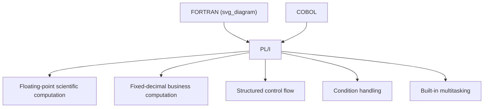

## PL/I and the Attempt at a Unified Language

### Historical Context

PL/I (Programming Language One, originally called NPL for "New Programming Language" until a naming conflict was discovered) was developed by IBM starting in 1964, motivated by a specific strategic problem the company faced: IBM was simultaneously supporting FORTRAN for scientific and engineering customers and COBOL for business customers, and maintaining two separate compiler product lines, two separate customer support paths, and two separate training programs represented significant duplicated overhead. IBM's ambition with PL/I was to create a single language expressive enough to serve both audiences, potentially allowing the company to consolidate its compiler development effort and let customers use one language regardless of whether their workload was scientific or commercial.

The language emerged alongside IBM's System/360 mainframe line, itself a landmark unification effort — System/360 was designed as a single compatible architecture spanning IBM's previously fragmented and incompatible product lines. PL/I was, in a real sense, the software-language counterpart to what System/360 attempted at the hardware level: replacing multiple specialized, incompatible offerings with one comprehensive, general-purpose alternative.

### Design Goals

IBM's design committee for PL/I pursued an unusually ambitious set of goals relative to earlier languages, which had each generally targeted a single well-defined domain:

1. **Unify scientific and business computing in a single language** — supporting FORTRAN-style floating-point numerical computation and COBOL-style fixed-decimal business arithmetic within one language, rather than forcing a choice between them
2. **Comprehensiveness over minimalism** — rather than following ALGOL's or BASIC's preference for a small orthogonal core, PL/I's designers deliberately included a very large set of features, data types, and built-in functions, on the theory that a professional, general-purpose language should provide direct support for whatever a working programmer might need
3. **Structured control flow from the outset** — unlike FORTRAN and early BASIC, PL/I was designed after the structured-programming critique of GOTO-heavy code had already begun circulating, so it included block structure and structured conditionals as native features rather than as later additions
4. **Built-in support for exception handling and concurrency** — PL/I incorporated condition-handling (a precursor to modern exception handling) and multitasking facilities directly into the language specification, both unusual inclusions for a language of its era

### Core Language Features

**Key Points**

- **Dual numeric models**: PL/I supported both `FLOAT` (binary floating-point, suited to scientific computation in the FORTRAN tradition) and `FIXED DECIMAL` (exact decimal arithmetic, suited to financial computation in the COBOL tradition) as native, interchangeable numeric types
- **Block structure with `BEGIN...END`**: PL/I adopted ALGOL-style nested block scoping, letting variables be declared local to a specific block
- **`ON` condition handling**: PL/I included a structured mechanism for intercepting runtime conditions such as arithmetic overflow, end-of-file, or conversion errors, functioning as an early and direct ancestor of the try/catch exception-handling models found in later languages such as C++, Java, and Python
- **Built-in multitasking primitives**: PL/I provided language-level support for starting and coordinating multiple tasks, a capability most contemporary languages left entirely to the operating system rather than the language itself
- **Pointer-based dynamic data structures**: PL/I supported pointers and dynamically allocated, linked data structures, going beyond COBOL's fixed-record model and beyond early FORTRAN's static-array-only approach
- **An enormous built-in feature and function set**: PL/I's specification included a very large number of data types, built-in functions, and attribute options — a design choice that later drew substantial criticism, discussed below

### Example: Mixed Numeric Types and Condition Handling

```pli
UNIFIED: PROCEDURE OPTIONS(MAIN);
    DECLARE SCIENTIFIC_VALUE FLOAT;
    DECLARE ACCOUNT_BALANCE  FIXED DECIMAL(9,2);

    ON ZERODIVIDE
        PUT LIST('DIVISION BY ZERO ENCOUNTERED');

    SCIENTIFIC_VALUE = 3.14159 * 2.0;
    ACCOUNT_BALANCE  = 1250.75 + 99.25;

    PUT LIST(SCIENTIFIC_VALUE, ACCOUNT_BALANCE);
END UNIFIED;
```

This fragment illustrates PL/I's central premise directly: `FLOAT` and `FIXED DECIMAL` variables coexist naturally within a single program, and the `ON ZERODIVIDE` condition handler demonstrates structured exception handling roughly two decades before it became a standard expectation in mainstream languages.

### Diagram: PL/I's Attempted Unification



### Why "Comprehensive" Became a Double-Edged Design Philosophy

PL/I's designers made a deliberate and explicit choice to prioritize completeness over minimalism, reasoning that a professional working programmer should not have to work around a language's gaps by resorting to assembly code or external libraries for common needs. This philosophy stood in direct contrast to ALGOL's preference for a small orthogonal core of primitives from which other behavior could be composed, and to BASIC's preference for the smallest possible feature set a beginner could memorize.

In practice, this comprehensiveness created a genuinely difficult learning burden: the full PL/I language specification was, by a wide margin, larger and more intricate than FORTRAN's, COBOL's, or ALGOL's specifications individually. Compiler implementers faced substantial difficulty building complete, correct implementations of the entire specification, and various early PL/I compilers implemented different subsets of the full language, which [Inference] likely undermined the portability goal that a unifying, comprehensive language was partly intended to deliver in the first place.

### PL/I's Reception and Adoption

PL/I saw genuine adoption, particularly within IBM's own customer base running System/360 hardware, and it was used for a range of production systems from the late 1960s through the 1980s. However, it did not achieve the goal of actually displacing FORTRAN or COBOL as IBM had hoped:

- **FORTRAN's scientific-computing user base largely stayed with FORTRAN**, since PL/I offered relatively little concrete advantage for pure numerical work that FORTRAN did not already provide, while introducing a considerably larger and less familiar language to learn
- **COBOL's business-computing user base largely stayed with COBOL**, for similar reasons, compounded by COBOL's entrenched position in existing production systems and its DoD-backed standardization
- **PL/I found a real but narrower niche**: it saw meaningful use for mixed or general-purpose systems programming on IBM mainframes, and it directly influenced subsequent language design even where it did not displace its intended targets

### PL/I's Influence on Later Languages

Despite falling short of its original unification ambition, PL/I's specific technical contributions propagated into subsequent language design:

- **Structured exception handling**: PL/I's `ON`-condition model is widely regarded as a direct conceptual ancestor of the try/catch/exception mechanisms found in C++, Java, Python, and most modern languages
- **Multi-paradigm language design as a legitimate goal**: PL/I's attempt to serve multiple computing domains within one language, even though it did not fully succeed commercially, established multi-paradigm, general-purpose language design as a recognized and repeatedly attempted goal in later efforts, including Ada (which had similarly broad ambitions for defense-related computing) and, in a different way, C++ and later general-purpose languages
- **Pointer-based dynamic data structures in a high-level language**: PL/I's support for pointers and heap-allocated linked structures anticipated similar facilities in C and later systems languages

### PL/I's Practical Limitations and Criticisms

- **Specification complexity and size**: PL/I's full language definition was substantially larger than its major predecessors, which made both learning the language and implementing a complete, standards-conformant compiler genuinely difficult undertakings
- **Inconsistent compiler support**: because the full specification was so large, different vendors' and even IBM's own PL/I compilers frequently implemented different subsets or variants of the language, undermining the portability that was one of PL/I's original goals
- **Perceived lack of a clear design philosophy**: critics, including prominent computer scientists writing at the time, argued that PL/I's approach of including a large superset of FORTRAN's, COBOL's, and ALGOL's respective features amounted to accumulation rather than genuine unification, [Speculation] a criticism whose fairness is debatable but which was influential enough to shape how the language is remembered in retrospective language-design literature
- **Steeper learning curve than its predecessors**: a programmer coming from FORTRAN or COBOL alone faced a considerably larger set of new concepts and syntax to learn in order to use PL/I effectively, which worked against rapid voluntary adoption by programmers already comfortable with an existing language

### Conclusion

PL/I represents one of the earliest and most ambitious attempts to build a genuinely general-purpose language capable of serving fundamentally different computing domains within a single, unified specification. While it did not succeed in displacing FORTRAN or COBOL as IBM had originally hoped, and its scale made it a difficult language to fully implement or fully learn, several of its specific technical contributions — structured exception handling chief among them — proved durable and influential well beyond PL/I's own commercial trajectory. Its history also serves as an early, well-documented illustration of a design tension that recurs throughout programming language history: the tradeoff between a small, learnable, orthogonal core and a large, comprehensive feature set intended to address every anticipated need directly within the language itself.

### Related Topics

- The IBM System/360 architecture and its influence on PL/I's development
- Structured exception handling: from PL/I's ON-conditions to modern try/catch models
- Ada and the pursuit of a unified language for defense computing
- The minimalism-versus-comprehensiveness tradeoff in language design philosophy
- Pointer-based dynamic memory in PL/I compared to later systems languages like C
- Multitasking and concurrency primitives built directly into early language specifications
- The commercial and technical reasons large "kitchen sink" languages struggle for adoption