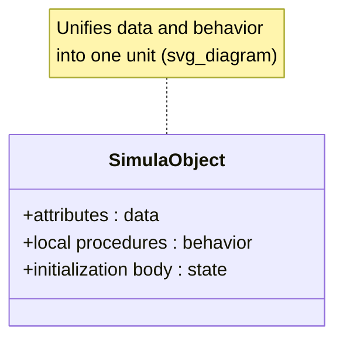
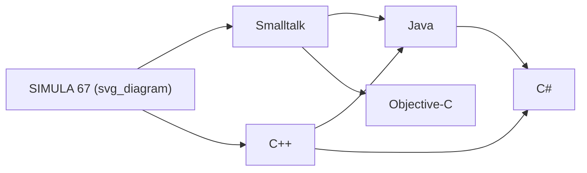

## SIMULA and the Origins of Object Orientation

### Historical Context

SIMULA emerged from work at the Norwegian Computing Center in Oslo, developed primarily by Ole-Johan Dahl and Kristen Nygaard. Two versions matter historically: **SIMULA I** (1962–1965), designed as a language for discrete event simulation, and **SIMULA 67** (1967), a general-purpose programming language that generalized the simulation concepts into what became the class/object model. Both Dahl and Nygaard later received the Turing Award (2001) largely for this contribution.

The core motivation was practical, not theoretical: Nygaard's background was in operations research, and he needed a better way to model systems composed of interacting, stateful entities — queues, processes, resources — evolving over simulated time. Existing languages (ALGOL 60 in particular, which SIMULA was built on top of) had no clean way to represent an entity that bundled its own data and behavior together.

### The Class Concept

SIMULA 67 introduced the **class** as a syntactic and semantic unit combining:

- **Local data** (attributes/instance variables)
- **Procedures** operating on that data (methods)
- **An initialization sequence** (a body of code executed when the object is created)

This was a significant departure from the ALGOL model, where procedures and data were separate, and from records/structs, which held data but no behavior. A SIMULA class instance carried its own execution state — it could suspend, resume, and retain local variables across activations, which was essential for simulating processes that run concurrently in simulated time.



### Objects as Coroutines

A distinctive and often underappreciated feature: SIMULA classes were built on a **coroutine** mechanism. An object was not just a bundle of data and procedures — it was a suspendable execution context. The `detach`, `resume`, and `call` primitives let one object's execution pause mid-procedure and hand control to another object, which could later resume the first exactly where it left off.

This is why SIMULA is described as the origin not just of objects, but of a particular *process-oriented* view of objects — closer to Alan Kay's later description of objects as small independent computers exchanging messages than to the "struct with functions" mental model that later became common in languages like C++.

[Inference] The coroutine-based object model in SIMULA is generally considered a direct conceptual ancestor of generators and cooperative concurrency mechanisms found in later languages (e.g., Python generators, Lua coroutines), though most of those were designed independently and only later recognized as related in spirit.

### Subclasses and Inheritance

SIMULA 67 introduced **subclasses**, declared with the `prefix` mechanism: a subclass began with the name of its superclass as a prefix, textually including the superclass's attributes and procedures before its own body executed. This gave:

- **Code and data reuse** — a subclass automatically had all the superclass's structure.
- **Extension** — a subclass could add new attributes and procedures.
- **Behavioral specialization** — a subclass could override inherited procedures.

```simula
Class Vehicle;
begin
   integer speed;
   procedure move;
   begin
      OutText("Vehicle moving"); OutImage;
   end;
end;

Vehicle Class Car;
begin
   integer numDoors;
   procedure move;
   begin
      OutText("Car driving at speed "); OutInt(speed, 0); OutImage;
   end;
end;
```

This is a direct precursor to the `class X extends Y` or `class X : public Y` syntax found in nearly every later object-oriented language.

### Virtual Procedures and Dynamic Dispatch

SIMULA 67 introduced **virtual procedures**: a procedure declared in a superclass could be marked `virtual`, meaning a subclass's redefinition would be the one actually invoked, even when called through a reference typed as the superclass. This is the mechanism now universally called **dynamic dispatch** or **runtime polymorphism**.

$$
\text{dispatch}(obj, m) = \text{lookup}(\text{runtime\_type}(obj), m)
$$

rather than resolving `m` based on the static/declared type of the reference. This single mechanism — resolving method calls based on actual object type rather than declared variable type — is arguably the single most consequential idea SIMULA contributed to programming language design, since it enables the entire "program to an interface, not an implementation" style of design that later dominated OO practice.

### Reference Semantics and Garbage Collection

SIMULA objects were accessed through **reference variables**, not embedded by value, and the language included automatic garbage collection to reclaim objects no longer reachable. This combination — heap-allocated objects, reference semantics, automatic memory management — became the default model for most later object-oriented languages (Smalltalk, Java, C#, Python), in contrast to C++'s later choice to also support value-semantics objects on the stack.

### Class Hierarchies as Type Hierarchies

SIMULA effectively unified two ideas that earlier languages kept separate: **type** and **module of behavior**. A class was simultaneously:

1. A **data type** (you could declare a reference variable of that class).
2. A **namespace/module** (its procedures and attributes were scoped to it).
3. A **generator/template** (`new ClassName` created an instance).

This three-way unification — type = template = behavioral unit — is essentially the definition of "class" still used today.

### Influence on Later Languages

**Key Points**

- **Smalltalk** (Alan Kay, Xerox PARC, early 1970s) took SIMULA's class/object idea and pushed it toward a purer message-passing model, coining the term "object-oriented programming" itself.
- **C++** (Bjarne Stroustrup, early 1980s) was explicitly designed as "C with Classes," with Stroustrup citing SIMULA directly as the source of the class concept, later adding static typing and performance concerns C lacked.
- **Java, C#** and most mainstream OO languages inherited the reference-based, garbage-collected, single-inheritance-with-interfaces model that traces back through C++ and Smalltalk to SIMULA's original class/subclass/virtual-procedure design.
- **Design patterns and OO methodology** broadly (encapsulation, inheritance, polymorphism as the "three pillars") describe, in modern vocabulary, mechanisms SIMULA implemented concretely in 1967.



### Example: Discrete Event Simulation Idiom

The following sketches the pattern SIMULA was originally built for — a queueing simulation, showing how class instances act as simulated processes:

```simula
Simulation Begin
   Class Customer;
   begin
      procedure Behavior;
      begin
         Hold(ServiceTime);   ! Simulated time passes while served;
      end;
   end;

   ! Main program schedules Customer arrivals over simulated time;
   ! and Hold() suspends the current process/object until that time passes;
End;
```

The `Hold` primitive suspends the object's coroutine for a duration of simulated time, letting other objects/processes execute — illustrating why SIMULA's objects needed to be more than passive data records.

### Conclusion

SIMULA's contribution was not a single feature but a coherent bundle: encapsulated state and behavior, subclassing with inheritance, virtual (dynamically dispatched) procedures, and reference-based heap objects — all arising from the practical need to simulate concurrent, stateful, interacting entities. Nearly every object-oriented language since has adopted some subset of this bundle, which is why Dahl and Nygaard's work is treated as the definitional origin point of object orientation rather than merely an early influence on it.

**Related Topics**

- Smalltalk and the message-passing model of objects
- ALGOL 60 and its influence on block-structured languages
- The development of C++ from "C with Classes"
- Coroutines and cooperative multitasking in modern languages
- Static vs. dynamic dispatch and virtual method tables
- Garbage collection strategies in object-oriented runtimes
- The "three pillars" of OOP: encapsulation, inheritance, polymorphism
- Prototype-based object orientation (Self, JavaScript) as an alternative lineage