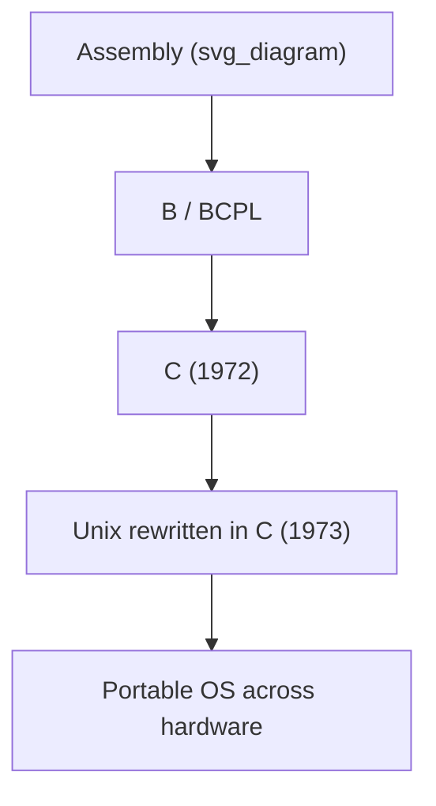
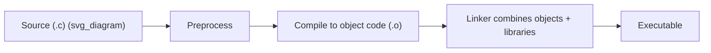
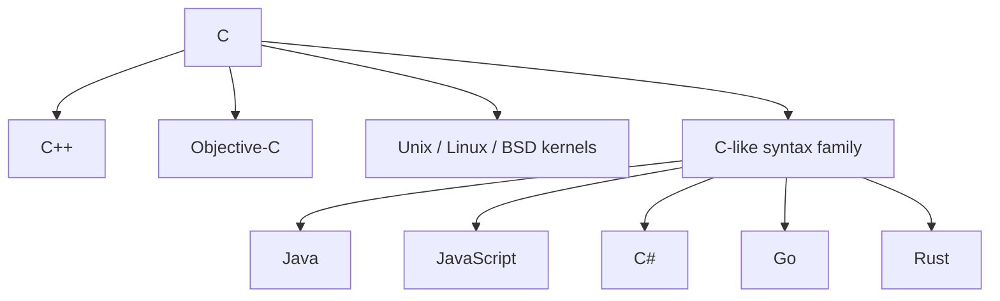

## C and the Rise of Systems Programming

### Historical Context

C was developed by Dennis Ritchie at Bell Labs between 1969 and 1973, growing out of an earlier language called **B** (itself derived from BCPL), which Ken Thompson had used for early Unix development. C's design goal was concrete and unusually consequential: provide a language expressive enough to write an operating system, yet close enough to the hardware to replace assembly language for that purpose. The rewrite of Unix in C (largely completed by 1973) was the proof of concept — Unix went from an assembly-language artifact tied to the PDP-7 to a portable system that could be recompiled for new hardware, which is arguably the single most important consequence of C's design.

### Design Philosophy: A Portable Assembler

C occupies a deliberate middle position often summarized as "high-level assembly." It gave programmers:

- **Direct memory access** via pointers, with pointer arithmetic tied to the underlying machine's addressing.
- **Minimal runtime** — no garbage collector, no mandatory exception handling machinery, no built-in object model.
- **Predictable, mechanical translation** from source constructs to machine instructions, so a programmer could reason about the generated code.
- **A small core language** with functionality (I/O, string handling, memory allocation) pushed into a standard library rather than built into syntax.

This "trust the programmer" philosophy — the language does not stop you from making mistakes it cannot itself verify — is both C's greatest strength (control, performance, transparency) and the direct source of its most persistent criticisms (buffer overflows, undefined behavior, manual memory errors).



### The Type System

C introduced a **static, but weakly enforced**, type system centered on a small set of primitive types (`char`, `int`, `float`, `double`, and their qualified variants) plus user-composable types:

- **Structs** — aggregate data, direct successors of SIMULA/ALGOL-style records, but without any attached behavior.
- **Unions** — overlapping storage for different interpretations of the same memory.
- **Arrays and pointers** — treated as closely related; array indexing `a[i]` is defined in terms of pointer arithmetic `*(a + i)`.
- **Typedefs** — naming mechanisms for readability, not new types in a strict sense.

Unlike languages emphasizing type safety, C permits extensive implicit conversion and explicit casting between unrelated pointer types, which gives low-level flexibility (implementing generic containers, reinterpreting memory) at the cost of compile-time safety guarantees found in stricter languages.

### Memory Model and Manual Management

C exposes the machine's memory directly rather than abstracting it away:

$$
\text{address\_of}(a[i]) = \text{base}(a) + i \times \text{sizeof}(\text{element\_type})
$$

Memory is managed through explicit `malloc`/`free` (heap) and automatic scope-based allocation (stack), with **no automatic garbage collection**. This places correctness burden entirely on the programmer:

- **Key Points**
  - Failing to `free` allocated memory causes leaks.
  - Freeing memory twice, or using memory after freeing it, causes undefined behavior.
  - Writing past the bounds of an array or buffer is not checked by the language.
  - Pointer arithmetic errors can corrupt arbitrary memory.

[Unverified] The specific claim that "most historical security vulnerabilities trace back to memory-unsafe languages like C" is widely repeated in industry reports and security research, but exact proportions vary by study, dataset, and time period, so any single percentage figure should be treated cautiously.

### The Preprocessor

Before compilation proper, C source passes through a **textual preprocessor** driven by directives beginning with `#`:

```c
#define MAX_BUFFER 256
#include <stdio.h>

#ifdef DEBUG
    #define LOG(msg) printf("DEBUG: %s\n", msg)
#else
    #define LOG(msg)
#endif
```

This gives conditional compilation, textual macro substitution, and file inclusion — powerful but syntactically unaware of the language it's embedded in, which is a frequent source of subtle bugs (macros that aren't parenthesized correctly, multiple evaluation of macro arguments with side effects).

### Compilation Model and Separate Compilation

C formalized a compilation pipeline that became the template for most subsequent systems languages:



**Header files** (`.h`) declare interfaces (function prototypes, type definitions) separately from **implementation files** (`.c`), enabling independent compilation of translation units and linking them afterward. This separate-compilation model made large, multi-file, multi-programmer projects practical on hardware with limited memory — compiling one file at a time rather than the whole program.

### Functions, Scope, and Structured Control Flow

C combined structured programming constructs (from the ALGOL lineage — `if`/`else`, `while`, `for`, `switch`, block scoping with `{ }`) with a simple, uniform function-call model based on a runtime stack. Unlike SIMULA's coroutine-capable objects, C functions are strictly call-and-return: no suspension, no built-in concurrency primitives. Concurrency and coroutine-like behavior in C are library or OS-level concerns (threads, signal handlers, `setjmp`/`longjmp`), not language features.

### Portability and the "Write Once, Compile Anywhere" Model

C's abstraction over hardware specifics (via the compiler and standard library) rather than over program logic meant source code could target different CPU architectures without rewriting, as long as compilers existed for those targets. This was a major departure from the prevailing assumption that operating systems and system software were inherently tied to specific hardware. The **C standard library** (I/O, string handling, memory functions) provided just enough abstraction that programs remained portable across Unix variants and, eventually, entirely different operating systems.

[Inference] The practice of defining a language via a standard (rather than a single reference implementation) — later formalized as **ANSI C** in 1989 and **ISO C** afterward — is generally credited with stabilizing C's semantics enough for multiple independent, interoperable compiler implementations (GCC, later Clang, MSVC) to coexist, though the standardization process itself involved contentious debate over which existing compiler behaviors to codify.

### Influence on Later Systems and Application Languages

**Key Points**

- **C++** extended C with SIMULA-derived object orientation while retaining C's low-level model and much of its syntax.
- **Objective-C** layered a Smalltalk-style object/messaging system on top of C.
- **Unix and Unix-like systems** (Linux, BSD) and their core utilities remain substantially written in C to this day.
- **Language syntax influence** — curly-brace block delimiters, C-style `for` loops, and `/* */` and `//` comments propagated into Java, JavaScript, C#, PHP, Go, Rust, and many others, making "C-like syntax" an entire recognizable family independent of semantics.
- **Embedded systems, device drivers, kernels, and language runtimes** (including the CPython interpreter and many other language implementations) continue to use C where direct hardware access and minimal runtime overhead are required.



### Example: Idiomatic Low-Level Control

The following illustrates C's characteristic mix of direct memory manipulation and minimal abstraction:

```c
#include <stdio.h>
#include <stdlib.h>

typedef struct {
    int x;
    int y;
} Point;

int main(void) {
    Point *p = malloc(sizeof(Point));
    if (p == NULL) {
        return 1; /* allocation failed; caller must check explicitly */
    }
    p->x = 3;
    p->y = 4;

    printf("Point: (%d, %d)\n", p->x, p->y);

    free(p); /* manual deallocation is the programmer's responsibility */
    return 0;
}
```

Every resource-management step here — allocation, null-check, deallocation — is explicit in source, in contrast to languages with automatic memory management where these steps are implicit.

### Conclusion

C's lasting contribution to systems programming was demonstrating that an operating system, and by extension nearly any performance-critical software, could be written in a portable high-level language without sacrificing the low-level control assembly provided. Its "trust the programmer" design — direct memory access, minimal runtime, explicit resource management — became the baseline against which nearly all subsequent systems languages (C++, Rust, Go, Zig) are still positioned, either by extending it or by explicitly trying to fix its safety trade-offs.

**Related Topics**

- Unix history and the C rewrite of the kernel
- Pointers, pointer arithmetic, and manual memory management
- The C preprocessor and macro-based metaprogramming
- ANSI C / ISO C standardization process
- C++ as an extension of C with object orientation
- Memory-safety alternatives: Rust's ownership model
- Undefined behavior in C and its implications for compiler optimization
- Cross-compilation and portability across hardware architectures