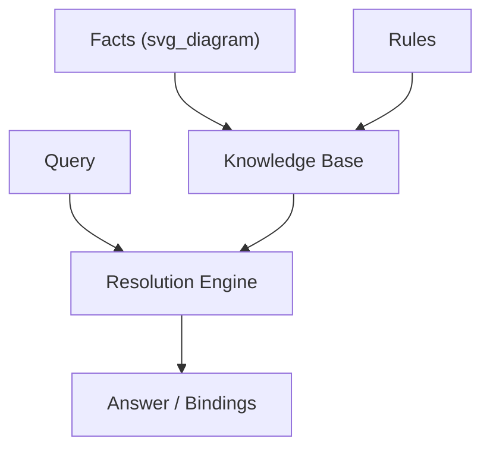
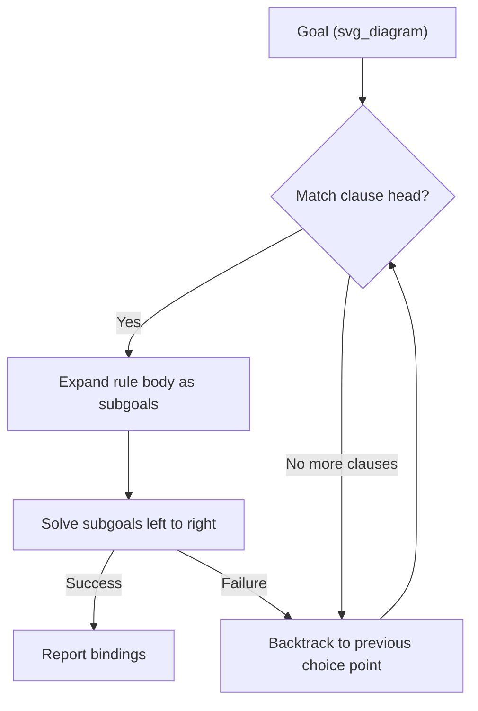
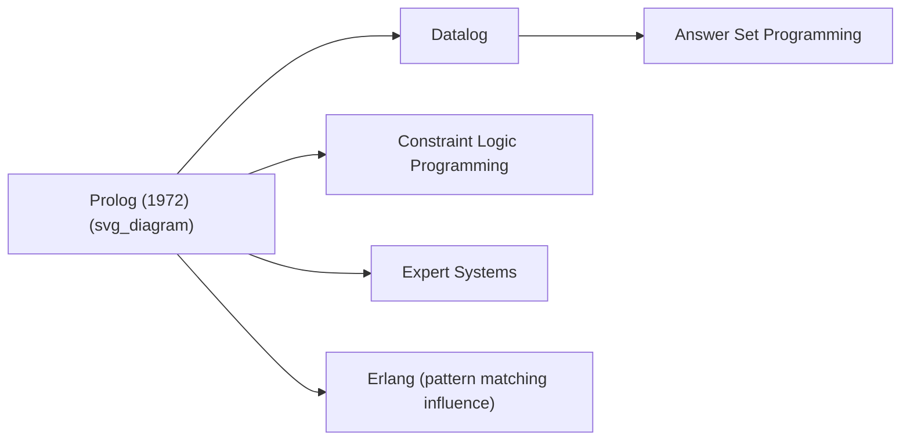

## Prolog and Logic Programming

### Historical Context

Prolog ("Programmation en Logique") was developed in 1972 by Alain Colmerauer and Philippe Roussel at the University of Aix-Marseille, working with Robert Kowalski, who independently developed the procedural interpretation of logic that made Prolog computationally practical. The original motivation was natural language processing — Colmerauer's team wanted a formalism for parsing French — but the underlying mechanism (automated theorem proving via resolution) generalized into a full programming paradigm distinct from the imperative (Fortran, C) and object-oriented (SIMULA) lineages already established by that point.

Prolog is the primary historical representative of **logic programming**, a paradigm where a program is a set of logical statements and computation is a form of automated inference over them, rather than a sequence of state-mutating instructions.

### Declarative vs. Imperative: The Core Shift

Where imperative languages specify **how** to compute a result (step-by-step state changes), Prolog programs specify **what** is true, and the language's inference engine determines how to derive answers. A Prolog program consists of:

- **Facts** — unconditional assertions about the world.
- **Rules** — conditional assertions (if X and Y, then Z).
- **Queries** — questions posed against the accumulated facts and rules.

```prolog
% Facts
parent(tom, bob).
parent(bob, ann).

% Rule
grandparent(X, Z) :- parent(X, Y), parent(Y, Z).

% Query
?- grandparent(tom, ann).
% true.
```

The `:-` symbol reads as "if," and the comma-separated body reads as logical conjunction. Nothing in this program describes a loop or an assignment; the answer emerges from the inference engine searching for a proof.



### Unification

**Unification** is the core matching mechanism underlying Prolog's execution. Given two terms, unification attempts to find a substitution of variables that makes them syntactically identical.

$$
\text{unify}(f(X, b), f(a, Y)) \Rightarrow \{X = a,\ Y = b\}
$$

Unification is more general than simple pattern matching because it can bind variables on **both** sides simultaneously, and it operates recursively over compound terms (lists, nested structures). It's the mechanism that lets a single Prolog predicate be used for multiple directions of computation — for instance, an `append/3` predicate can concatenate two lists, or, run in reverse, split a list into all possible prefix/suffix pairs.

### SLD Resolution and the Execution Model

Prolog's inference procedure is **SLD resolution** (Selective Linear Definite clause resolution), following Kowalski and Kuhn's theoretical work. Practically, this means:

1. The engine takes a query as a **goal**.
2. It searches the knowledge base **top to bottom** for a fact or rule head that unifies with the goal.
3. If a rule matches, its body becomes a new set of subgoals, tried **left to right**.
4. If a subgoal fails, the engine **backtracks** — undoing the most recent variable bindings and trying the next alternative match.



This **depth-first search with backtracking** is Prolog's single most defining execution characteristic, and it's what turns declarative-looking logical statements into an actual, deterministic (if sometimes inefficient) computation strategy.

### Backtracking and Nondeterminism

Because a goal may match multiple facts or rules, Prolog queries can have **multiple solutions**, explored one at a time on demand:

```prolog
likes(mary, wine).
likes(mary, food).
likes(john, wine).

?- likes(mary, X).
X = wine ;
X = food.
```

The `;` prompts the engine to backtrack and search for the next solution. This built-in, language-level nondeterminism — try one path, and if asked, retry with the next — has no direct equivalent in mainstream imperative languages, where similar behavior must be hand-coded via explicit iteration or generator constructs.

**Key Points**

- Backtracking is automatic and applies uniformly to all predicate calls.
- The **cut operator** (`!`) lets a programmer manually prune the search space, committing to choices already made and preventing backtracking past that point — used both for efficiency and to express "if-then-else"-like logic.
- Excessive or careless backtracking is a common source of poor performance in naively written Prolog programs, since the engine may explore large portions of a search tree before failing.

### Lists and Recursion

Prolog's primary compound data structure is the **list**, and since the language has no built-in iteration constructs (no `for`/`while`), all repetitive processing is expressed through **recursion**, mirroring the recursive definitions common in mathematical logic and functional languages.

```prolog
length_of([], 0).
length_of([_|T], N) :- length_of(T, N1), N is N1 + 1.

?- length_of([a, b, c], N).
% N = 3.
```

The `[H|T]` notation destructures a list into its head and tail — a pattern-matching idiom that later appears, in similar form, in functional languages like ML, Haskell, and Erlang.

### The `is/2` Operator and the Declarative/Procedural Tension

Pure logical relations cannot perform arithmetic evaluation directly; Prolog provides `is/2` as an explicit bridge to procedural, evaluated arithmetic:

```prolog
X is 2 + 3.   % X = 5
```

This exposes a well-known tension in Prolog's design: the language is not purely declarative in practice. Constructs like `is/2`, the cut (`!`), and I/O predicates (`write/1`, `nl/0`) introduce procedural, order-dependent behavior into what is nominally a logic-based system. [Inference] This tension is widely discussed in the logic programming literature as a fundamental trade-off between theoretical purity and practical usability, though specific characterizations of how severe the trade-off is vary among researchers and textbooks.

### Negation as Failure

Prolog's default negation, written `\+`, is **negation as failure**: a goal is considered "false" if the engine cannot prove it true from the current knowledge base, not because it corresponds to classical logical negation.

```prolog
?- \+ likes(john, food).
% true.   (because no fact/rule proves likes(john, food))
```

This is a **closed-world assumption** — anything not provable is treated as false — which differs meaningfully from classical logic's negation and is a frequent source of subtle bugs for programmers unfamiliar with the distinction, particularly around unbound variables.

### Influence on Later Languages and Fields

**Key Points**

- **Constraint logic programming** (CLP) languages extend Prolog's unification with constraint solving over domains like finite integers (CLP(FD)) — used in scheduling and combinatorial search.
- **Datalog**, a restricted, purely declarative subset of Prolog without complex terms or cut, became foundational for deductive databases and is now widely used in program analysis and, more recently, some graph/database query engines.
- **Erlang** borrowed Prolog's pattern-matching syntax and some of its team's design instincts (Prolog was used to prototype early Erlang implementations), though Erlang itself is a functional/concurrent language, not a logic language.
- **Expert systems** of the 1980s frequently used Prolog or Prolog-derived engines to encode rule-based domain knowledge, making it historically central to that branch of AI research.
- **Answer Set Programming (ASP)** generalizes logic programming's declarative style with a different (non-Prolog) resolution/solving strategy, used in modern combinatorial optimization.



### Example: A Small Knowledge Base

A short, self-contained example showing facts, rules, and multiple query outcomes together:

```prolog
animal(dog).
animal(cat).
animal(sparrow).

flies(sparrow).
has_fur(dog).
has_fur(cat).

pet(X) :- animal(X), has_fur(X).

?- pet(X).
% X = dog ;
% X = cat.

?- flies(dog).
% false.
```

**Output**

```
X = dog
X = cat
false
```

### Conclusion

Prolog demonstrated that a programming language could be built directly on formal logic — with unification and resolution as the execution mechanism rather than sequential state mutation — making "what is true" and "how to compute it" the same artifact, at least in principle. Its practical compromises (the cut, `is/2`, negation as failure) show that pure declarative logic and efficient computation are in tension, a tension every subsequent logic and constraint-based language has had to navigate in its own way. Its influence persists most directly in database query languages, constraint solvers, and AI rule engines, even in contexts where "Prolog" itself is no longer the tool being used.

**Related Topics**

- Unification algorithms and term rewriting systems
- Constraint Logic Programming (CLP) and finite-domain solvers
- Datalog and deductive database query languages
- The cut operator and controlling backtracking explicitly
- Negation as failure vs. classical logical negation
- Expert systems and rule-based AI of the 1980s
- Answer Set Programming (ASP) as a declarative alternative
- Pattern matching in functional languages (ML, Haskell, Erlang)