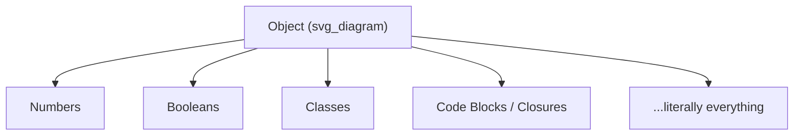
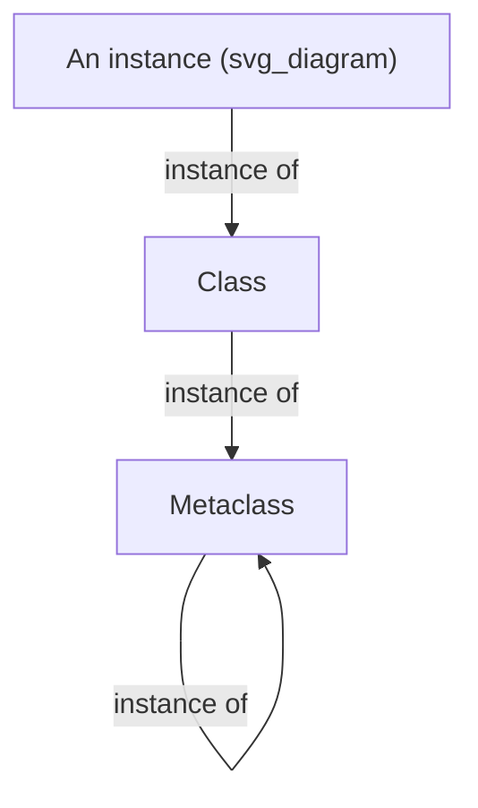
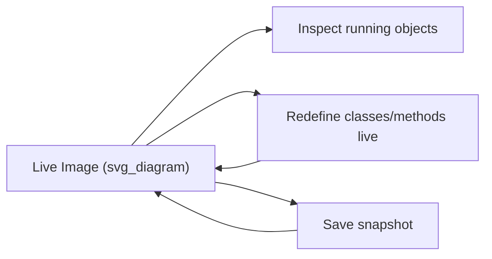
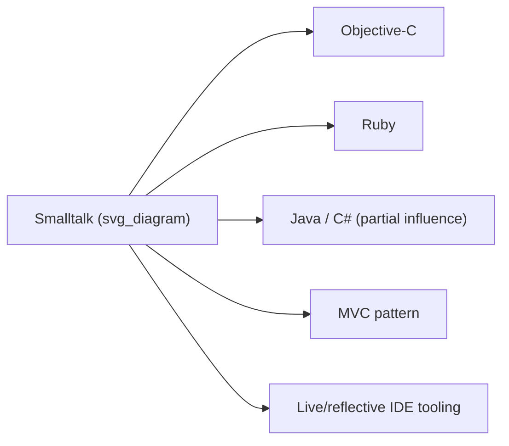

## Smalltalk and Pure Object Orientation

### Historical Context

Smalltalk was developed at Xerox PARC beginning in 1972, led by Alan Kay along with Dan Ingalls, Adele Goldberg, and others, with major versions released as Smalltalk-72, -76, and the widely influential **Smalltalk-80**. Kay's motivation was not primarily "better software engineering" in the abstract but a specific vision: a personal computing environment (the Dynabook concept) where end users, including children, could create and modify software through direct manipulation. Object orientation, in Kay's framing, was a means to that end — a way of structuring systems as communities of independent, communicating entities rather than a set of syntactic conveniences.

Kay is credited with coining the term **"object-oriented programming"** itself, and he later stated that message passing, not classes, was the central idea he intended the term to capture — a point of ongoing distinction from how the term is commonly used today.

### Everything Is an Object

Smalltalk's foundational design commitment, more radical than SIMULA's, is that **every value in the system is an object**, without exception:

- Integers, floats, booleans (`true`/`false`), and characters are objects.
- Classes themselves are objects (instances of **metaclasses**).
- Code blocks (closures) are objects.
- Even control structures like conditionals and loops are implemented as ordinary message sends to objects, not special syntax.



This is the defining contrast with C++ and later "hybrid" OO languages, which retain primitive, non-object types (`int`, `bool`) for performance reasons. Smalltalk's uniformity was philosophically motivated: if the system is a community of objects communicating by messages, there is no principled reason for some values to be exempt.

### Message Passing as the Sole Computational Mechanism

In Smalltalk, **all computation happens by sending messages to objects**. There is no separate syntax for "function calls" versus "operators" versus "control flow" — arithmetic, comparisons, loops, and conditionals are all message sends.

```smalltalk
3 + 4.
"This is NOT built-in arithmetic syntax — it is the message #+ sent to the object 3, with argument 4."

x > 0
    ifTrue: ['positive']
    ifFalse: ['not positive'].
"ifTrue:ifFalse: is a message sent to the Boolean object x > 0."
```

Three message categories exist syntactically:

- **Unary messages** — no arguments (`3 factorial`).
- **Binary messages** — operator-like, one argument (`3 + 4`).
- **Keyword messages** — named arguments, arbitrary arity (`array at: 1 put: 'x'`).

[Inference] The claim that conditionals and loops in Smalltalk are "just" ordinary messages sent to Boolean and Block objects (rather than special-cased by the compiler in practice) is the textbook description of the design; some production implementations apply compiler-level optimizations to common patterns like `ifTrue:ifFalse:` for performance, which is a pragmatic deviation from strict message-send semantics without changing the language's observable behavior.

### Classes, Metaclasses, and the Object Model

Smalltalk formalizes something SIMULA left implicit: since classes are themselves objects, **each class has a class of its own**, called its **metaclass**. This produces a self-consistent, uniform object model:

$$
\text{class}(\text{instance}) = \text{Class},\quad \text{class}(\text{Class}) = \text{Metaclass},\quad \text{class}(\text{Metaclass}) = \text{Metaclass}
```

The chain terminates by having `Metaclass`'s own class be itself, closing the system rather than requiring an infinite regress. This lets class-level behavior (e.g., alternative constructors, class variables shared across all instances) be expressed using the exact same message-sending mechanism as instance-level behavior — there is no separate "static" or "class method" syntax as a special case.



### Encapsulation and the Absence of Public Fields

Smalltalk enforces encapsulation strictly at the language level: an object's instance variables are **never directly accessible from outside the object**, under any circumstances — there is no `public` field mechanism at all. All interaction with an object's state happens through messages the object chooses to respond to.

**Key Points**

- This is stricter than C++/Java, where fields can be declared `public` and accessed directly.
- Accessor methods (getters/setters) must be explicitly written if external access to state is desired — encapsulation is not optional or bypassable by visibility keywords.
- This design reflects Kay's biological-cell metaphor for objects: internals are private by construction, and only messages cross the boundary.

### The Live, Reflective Image-Based Environment

Unlike C or SIMULA, Smalltalk was not a "write source, compile, run" language in the conventional sense. The entire running system — every object, class, and piece of live program state — persists inside an **image**, a serialized snapshot of the live environment that can be saved and resumed. Development happens by directly modifying live objects in a running system through the **browser** (class browser) and inspector tools, rather than editing text files and recompiling from scratch.



This gave Smalltalk strong **reflective** capabilities — a running program can inspect and modify its own classes and objects at runtime — which was highly unusual for its era and directly influenced later reflective and dynamic features in languages like Ruby, Python, and Objective-C.

### Dynamic Typing and Duck Typing

Smalltalk is **dynamically typed**: variables have no declared type, and any object can be sent any message. Whether the message is valid is resolved at runtime by looking up a matching method in the receiver's class (or its superclasses); if no matching method is found, the object receives a `doesNotUnderstand:` message, which by default raises an error but can itself be overridden.

```smalltalk
doesNotUnderstand: aMessage
    "Custom objects can intercept unhandled messages entirely,
     enabling proxies, dynamic method generation, and similar patterns."
```

This runtime-resolved, type-agnostic message dispatch is the origin of what later became known as **duck typing** — "if it responds to the message, it can be used here," regardless of declared type — a philosophy carried forward explicitly into Ruby and, less formally, Python.

### The Class Library as the Language

A distinguishing characteristic of Smalltalk is that a very large portion of what programmers think of as "the language" — collections, control structures, numeric towers, exception handling — is actually implemented in Smalltalk itself, as ordinary classes in the standard library, rather than being compiler built-ins. The compiler and virtual machine implement only a minimal syntactic and message-dispatch core; everything else is class definitions written in the same language available to application programmers.

This blurred the usual line between "language" and "library," a design choice that later influenced how languages like Ruby and, to varying degrees, Python present their standard collection and numeric types as ordinary, inspectable, sometimes even reopenable classes.

### Influence on Later Languages

**Key Points**

- **Objective-C** adopted Smalltalk's message-passing syntax and terminology almost directly (`[object message: argument]`), layered on top of C.
- **Ruby** explicitly drew on Smalltalk's "everything is an object," dynamic typing, and open, reflective class model.
- **Java and C#** adopted garbage collection and single-rooted class hierarchies partly influenced by Smalltalk's uniformity, though both retain primitive non-object types and static typing, making them considerably less "pure" in Kay's sense.
- **The Model-View-Controller (MVC) pattern**, still foundational in UI architecture today, was originated within the Smalltalk-80 environment.
- **Modern IDEs' live inspection, debugging, and "hot" code reload features** trace conceptual lineage to Smalltalk's image-based, live-editing development model.



### Example: Defining and Using a Class

```smalltalk
Object subclass: #Animal
    instanceVariableNames: 'name sound'
    classVariableNames: ''
    package: 'Examples'.

Animal >> name: aName sound: aSound
    name := aName.
    sound := aSound.

Animal >> speak
    Transcript showCr: name, ' says ', sound.

| dog |
dog := Animal new.
dog name: 'Rex' sound: 'Woof'.
dog speak.
```

**Output**

```
Rex says Woof
```

Every part of this — `subclass:instanceVariableNames:classVariableNames:package:`, `new`, `speak` — is a message send; there is no syntactic distinction between "calling a constructor" and "sending any other message" beyond convention.

### Conclusion

Smalltalk pushed the object-oriented ideas SIMULA introduced to their logical extreme: not just classes and inheritance, but a system in which absolutely everything — numbers, classes, code blocks, even the development environment itself — is a message-receiving object, and message passing is the only computational primitive. This uncompromising uniformity is why Smalltalk is treated as the reference point for "pure" object orientation, distinct from the more pragmatic, performance-conscious hybrid model that C++ and its successors adopted instead. Its influence is visible less in syntax and more in the philosophy of dynamic, reflective, message-oriented systems that later languages selectively reintroduced.

**Related Topics**

- SIMULA's class/subclass model as Smalltalk's direct predecessor
- Message passing vs. method calling as computational metaphors
- Metaclasses and reflective object systems
- Duck typing and dynamic dispatch in Ruby and Python
- Image-based development environments and live coding
- The Model-View-Controller (MVC) architectural pattern
- Objective-C's Smalltalk-derived messaging syntax
- doesNotUnderstand: and dynamic proxy/metaprogramming patterns