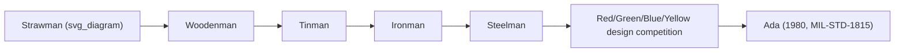
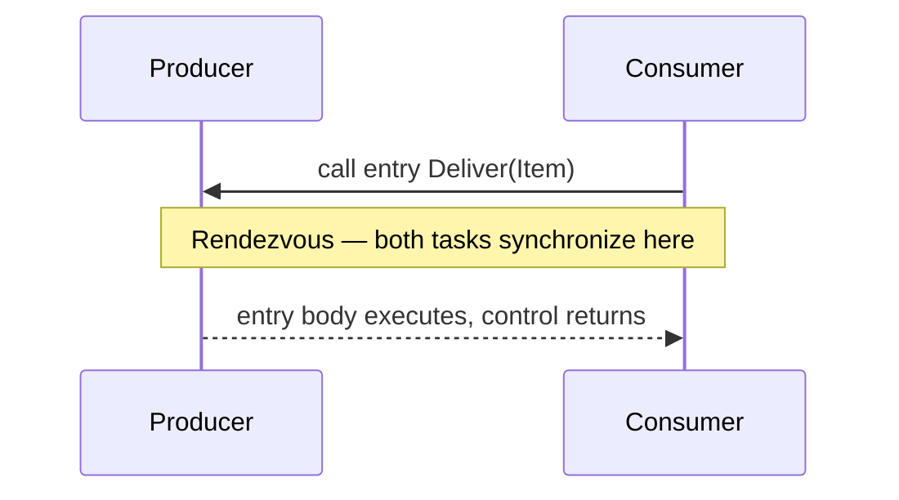
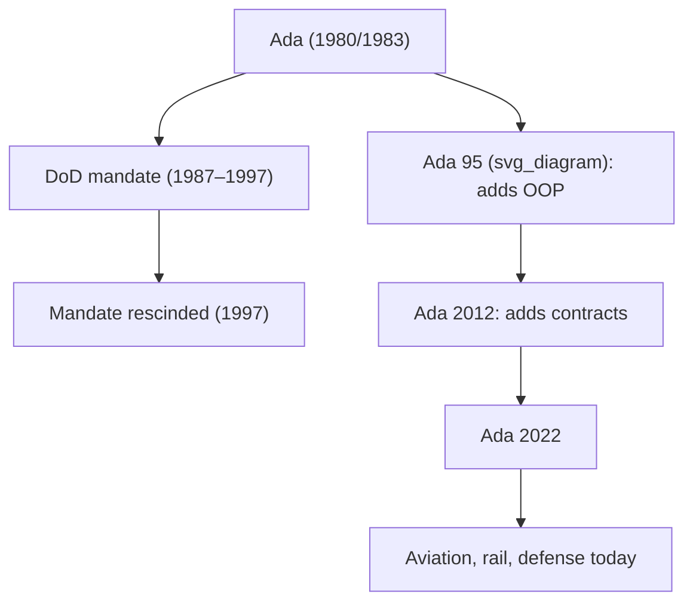

## Ada and Government-Mandated Standardization

### Historical Context

Ada originated from a US Department of Defense (DoD) initiative in the mid-1970s, driven by a specific, well-documented problem: the DoD found itself funding development and maintenance of software written in **hundreds of different programming languages and dialects** across its weapons systems, embedded systems, and mission-critical software, with enormous duplicated cost in tooling, training, and maintenance. Rather than allow this proliferation to continue, the DoD ran a competitive language-design process — the **"Strawman," "Woodenman," "Tinman," "Ironman," and finally "Steelman"** requirements documents — culminating in a design competition among four anonymized submissions (color-coded Red, Green, Blue, Yellow teams). The winning design, submitted by Jean Ichbiah's team at CII Honeywell Bull, became **Ada**, named after Ada Lovelace, standardized as **MIL-STD-1815** in 1980 and later as an ANSI standard in 1983.

This is a fundamentally different origin story from every other language covered so far: Ada was not the product of a research lab or a company's internal need, but a **specification-first, government-mandated** language, designed by committee against an exhaustive, publicly documented requirements process before a single production compiler existed.



### Design Goals Driven by Requirements, Not Convenience

Because Ada's requirements were fixed before design began, its feature set reads as a direct response to specific, named engineering problems the DoD had already experienced with earlier languages:

- **Reliability and maintainability** over decades-long system lifespans (many DoD systems remain in service for 30+ years).
- **Real-time and embedded systems support**, including precise control over timing and hardware-level interaction.
- **Strong static typing**, to catch as many errors as possible at compile time rather than in the field.
- **Built-in concurrency**, rather than treating it as a library or OS-level concern (as C does).
- **Modularity and separate compilation** for very large, multi-team, multi-year programs.
- **Portability** across the many different hardware platforms DoD systems ran on.

**Key Points**

- Ada's design process is often cited as the first large-scale example of language design driven explicitly by a published, competitive requirements specification rather than by a single author's or team's organic preferences.
- The Steelman document itself remains a frequently referenced artifact in programming language design literature as an unusually thorough example of formal language requirements.

### Strong Static Typing and the "No Silent Failure" Philosophy

Ada's type system is deliberately stricter than contemporaries like C or Pascal, aiming to make entire categories of runtime error impossible to compile:

```ada
type Percentage is range 0 .. 100;
type Temperature is delta 0.1 range -50.0 .. 150.0;

Speed : Percentage;
Temp  : Temperature;
```

- **Range-constrained types** — a variable declared as `range 0 .. 100` cannot silently hold an out-of-range value; violations raise a runtime exception (`Constraint_Error`) rather than wrapping or corrupting memory silently.
- **Strong nominal typing** — even two types with identical underlying representation (e.g., two different integer subtypes) are not interchangeable without explicit conversion, preventing accidental mixing of logically distinct quantities (e.g., adding a `Temperature` to a `Percentage`).
- **No implicit narrowing conversions** of the kind common in C, which silently truncate or reinterpret values.

$$
\text{Ada type safety principle: } \quad T_1 \neq T_2 \implies \text{no implicit conversion}(T_1 \to T_2)
$$

This is a direct, deliberate contrast with C's comparatively permissive type coercion — a response to real incidents where unit-mismatch or silent overflow errors had caused expensive or dangerous failures.

### Packages: Modularity as a First-Class Language Feature

Ada introduced **packages** as a dedicated modularity construct, separating a **specification** (public interface) from a **body** (implementation) — formalizing, at the language level, a discipline C achieved only informally through header/source file conventions.

```ada
package Stack is
   procedure Push(Item : Integer);
   function  Pop return Integer;
end Stack;

package body Stack is
   -- implementation details hidden from importers
   procedure Push(Item : Integer) is
   begin
      -- ...
   end Push;

   function Pop return Integer is
   begin
      -- ...
   end Pop;
end Stack;
```

This gives compiler-enforced encapsulation of implementation details and a clean separation of "what a module offers" from "how it does it," predating similar formalized module systems in many later languages.

### Built-In Concurrency: Tasks and Rendezvous

Unlike C, where concurrency is entirely a library/OS concern, Ada made concurrency a **core language feature** via the **task** construct, using a synchronization model called **rendezvous**.

```ada
task Producer is
   entry Deliver(Item : in Integer);
end Producer;

task body Producer is
begin
   -- ... sends data via the Deliver entry
end Producer;
```

A task can define **entries**, and another task communicates with it by calling that entry — execution of both tasks synchronizes (rendezvous) at that point, analogous to a synchronous message exchange. This is a distinctly different concurrency model from thread-plus-lock approaches common in C/C++ or the actor model used elsewhere, built directly into the type and task system rather than layered on afterward.



### Exception Handling as a Structured, Mandatory Discipline

Ada formalized structured exception handling earlier and more rigorously than most contemporaries, tying it directly into the type system's constraint-checking:

```ada
begin
   Speed := 150;  -- exceeds Percentage's range 0..100
exception
   when Constraint_Error =>
      Put_Line("Invalid percentage value");
end;
```

Because range and constraint violations automatically raise exceptions rather than producing silent undefined behavior, Ada's type system and exception system work together as a single reliability mechanism, rather than being two loosely related features.

### Generics: Compile-Time Parameterized Modules

Ada introduced **generics**, allowing packages and subprograms to be parameterized by type, well before templates (C++) or generics (Java, C#) existed in mainstream form:

```ada
generic
   type Element_Type is private;
package Generic_Stack is
   procedure Push(Item : Element_Type);
   function  Pop return Element_Type;
end Generic_Stack;

package Integer_Stack is new Generic_Stack(Element_Type => Integer);
```

[Inference] Ada's generics are frequently cited in language-design literature as an early, influential model for compile-time parametric polymorphism, though the extent of direct technical lineage to C++ templates (versus independent, convergent design driven by similar goals) is debated among historians of the language.

### Standardization as a Governance Model

Ada's most distinctive characteristic, relative to every other language in this series, is that it was legally **mandated** for use: from 1987 to the mid-1990s, DoD directives required Ada for most new mission-critical defense software, and the language name itself was **trademarked by the US government**, with compiler vendors required to pass a formal validation suite to legally call their product "Ada." This is a governance model essentially unique among widely known programming languages.

**Key Points**

- The Ada mandate was gradually relaxed in the 1990s and formally rescinded in 1997, as commercial-off-the-shelf software and other languages became more central to DoD procurement.
- Despite the mandate's end, Ada remains actively used in **aviation, rail, and defense systems** where certification standards (e.g., DO-178C for airborne software) favor its strong static guarantees.
- Ada 95, Ada 2005, Ada 2012, and Ada 2022 represent ongoing standardization revisions, adding object orientation (Ada 95), contracts/pre-post conditions (Ada 2012), and other modern features, while retaining the original reliability-first philosophy.



### Influence on Later Languages and Practice

- **Design by Contract**, formalized more fully in Eiffel shortly after, echoes Ada's constraint-checking and exception philosophy.
- **Java's checked exceptions** and package system reflect, at a distance, similar goals of enforced structure and compile-time error surfacing that Ada pursued more rigorously earlier.
- **Rust's emphasis on eliminating entire classes of runtime error at compile time** is philosophically (though not lineage-wise) aligned with Ada's original "make illegal states unrepresentable" design instinct, arrived at independently decades later for largely similar reliability motivations.
- Ada's **SPARK** subset (a formally verifiable dialect) directly influenced later interest in formally verified systems software.

### Example: Constrained Types Preventing a Class of Bugs

```ada
with Ada.Text_IO; use Ada.Text_IO;

procedure Main is
   type Valve_Position is range 0 .. 100;
   Position : Valve_Position := 50;
begin
   Position := Position + 60;  -- would exceed range 0..100
exception
   when Constraint_Error =>
      Put_Line("Error: valve position out of safe range");
end Main;
```

**Output**

```
Error: valve position out of safe range
```

A comparable C program using a plain `int` would silently allow the invalid value to propagate, with no language-level mechanism to catch it.

### Conclusion

Ada's significance lies less in any single novel language feature and more in demonstrating an alternative model for how a programming language can come into existence: through an exhaustive, public requirements process and formal standardization, rather than organic evolution from an individual designer's or lab's needs. Its strict typing, built-in concurrency, and structured exception handling were direct engineering responses to real, costly failures the DoD had experienced with less disciplined languages — a "reliability first" philosophy that anticipated, by decades, similar concerns now central to languages like Rust in safety-critical and high-assurance domains.

**Related Topics**

- The Steelman requirements document and competitive language design
- Design by Contract (Eiffel) and formal specification techniques
- The SPARK subset and formal verification of Ada programs
- Rendezvous-based concurrency vs. thread-and-lock models
- DO-178C and certification standards for safety-critical software
- Generics and parametric polymorphism across languages
- Strong static typing as an error-prevention strategy
- Rust's ownership model as a modern parallel to Ada's reliability goals