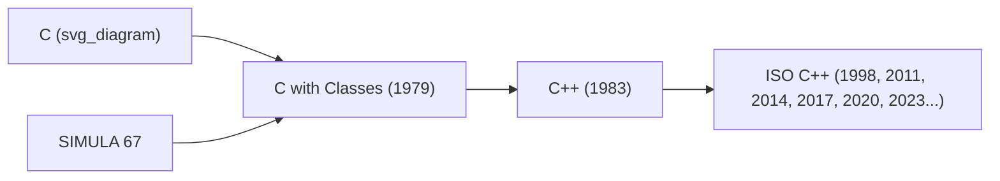
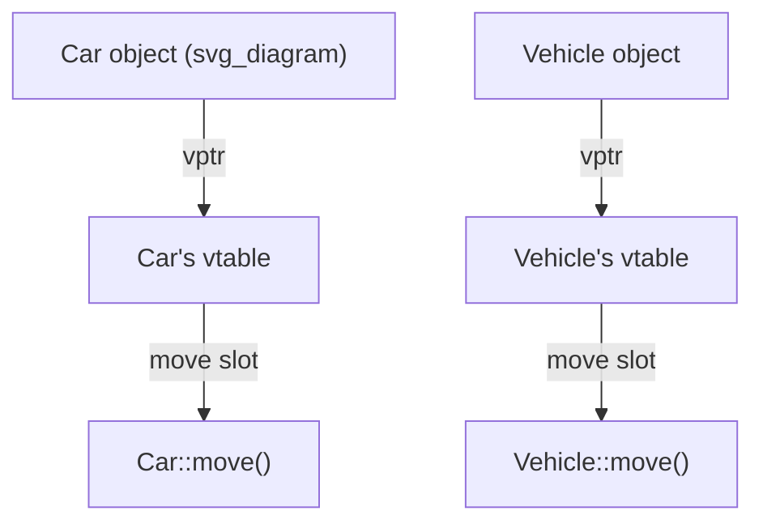
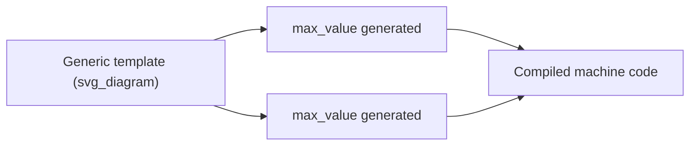
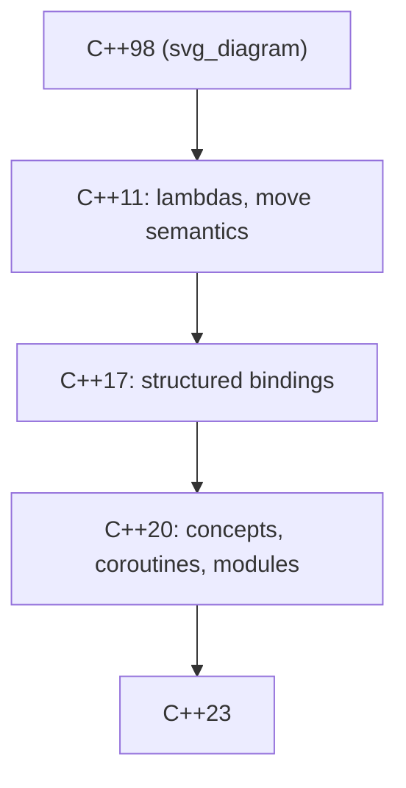

## C++ and Hybrid Object-Oriented Systems Programming

### Historical Context

C++ was created by Bjarne Stroustrup at Bell Labs beginning in 1979, initially as "C with Classes," and formally renamed C++ in 1983. Stroustrup's stated motivation was pragmatic rather than ideological: he wanted the organizational benefits he'd seen in SIMULA's class model — encapsulation, inheritance — combined with C's raw performance and direct hardware access, without accepting the runtime overhead of SIMULA's garbage collection or the abandonment of C's existing codebases and toolchains. This dual lineage is why C++ is best understood not as "C plus objects" in a simple additive sense, but as a deliberate, sometimes uneasy **hybrid** of two philosophically different traditions: C's minimal-runtime, trust-the-programmer systems approach, and SIMULA's structured, class-based object model.



### Zero-Overhead Abstraction as a Governing Principle

C++'s central design constraint, restated by Stroustrup throughout the language's evolution, is the **zero-overhead principle**: a feature should not impose runtime or memory cost on programs that don't use it, and when a feature is used, it should not cost more than a hand-written equivalent in a lower-level language.

**Key Points**

- This is why C++ classes, by default, do not carry the runtime overhead SIMULA-style garbage-collected objects do — object layout is fixed and predictable at compile time.
- Virtual function dispatch (see below) is implemented via a single indirect lookup (a vtable pointer), not a dynamic message-lookup mechanism as in Smalltalk.
- This principle is the throughline explaining nearly every subsequent design decision in C++, including ones (manual memory management, undefined behavior on misuse) that are frequently criticized elsewhere.

### Classes: SIMULA's Model, Reimplemented Without a Runtime

C++ classes closely follow SIMULA's original bundling of data and behavior, but compiled directly to C-like machine code with no interpreter or managed runtime:

```cpp
class Vehicle {
protected:
    int speed;
public:
    Vehicle(int s) : speed(s) {}
    virtual void move() const {
        std::cout << "Vehicle moving at " << speed << "\n";
    }
};

class Car : public Vehicle {
public:
    Car(int s) : Vehicle(s) {}
    void move() const override {
        std::cout << "Car driving at " << speed << "\n";
    }
};
```

Object layout is determined entirely at compile time: the compiler knows exactly where each member variable sits in memory, and (for non-virtual functions) exactly which function address to call, with no runtime lookup at all.

### Virtual Functions and the Vtable Mechanism

C++ implements SIMULA's virtual-procedure idea (dynamic dispatch) through an explicit, inspectable mechanism: each class with virtual functions gets a **virtual table (vtable)** — an array of function pointers — and each object of that class carries a hidden pointer to its class's vtable.

$$
\text{call}(obj, m) = *(\text{vtable}[obj] + \text{offset}(m))
$$



This gives dynamic dispatch at a **fixed, small cost** (one pointer dereference plus one array indexation) — a direct engineering response to SIMULA and Smalltalk's more general but costlier dispatch mechanisms, and a concrete illustration of the zero-overhead principle in practice.

### Multiple Inheritance

C++ permits a class to inherit from more than one base class simultaneously, a feature most later mainstream OO languages (Java, C#) deliberately omitted or restricted:

```cpp
class Flyable { public: virtual void fly() = 0; };
class Swimmable { public: virtual void swim() = 0; };

class Duck : public Flyable, public Swimmable {
public:
    void fly() override { std::cout << "Duck flying\n"; }
    void swim() override { std::cout << "Duck swimming\n"; }
};
```

- **Key Points**
  - Multiple inheritance solves genuine modeling problems (an object legitimately belonging to two independent hierarchies) that single inheritance cannot express directly.
  - It introduces the **diamond problem** — ambiguity when two base classes share a common ancestor — which C++ resolves via **virtual inheritance**, an explicit, non-default mechanism the programmer must opt into.
  - [Inference] The subsequent design choice in Java and C# to disallow multiple inheritance of implementation (permitting only multiple interface inheritance) is broadly understood as a direct reaction to the complexity and diamond-problem pitfalls observed in C++ usage, though both languages' designers cite general simplicity goals as well.

### Templates: Compile-Time Generic Programming

C++ templates provide parametric polymorphism resolved entirely at **compile time**, generating specialized code for each concrete type used, rather than relying on runtime type erasure or dynamic dispatch:

```cpp
template <typename T>
T max_value(T a, T b) {
    return (a > b) ? a : b;
}

int i = max_value(3, 7);
double d = max_value(3.5, 2.1);
```

Templates are **Turing-complete** at compile time — a fact discovered somewhat by accident rather than by original design intent — which gave rise to **template metaprogramming**, a style of computing results entirely during compilation, before the resulting program even runs.



[Unverified] The precise degree to which template metaprogramming's Turing-completeness was anticipated versus discovered after the fact by early users (notably Erwin Unruh's famous prime-number-printing-at-compile-time example) is described consistently across C++ histories, but exact internal design intentions at the time are not something a language specification captures, so this should be read as historical anecdote rather than a formally documented design goal.

### RAII: Resource Management Tied to Object Lifetime

**Resource Acquisition Is Initialization (RAII)** is arguably C++'s most influential original contribution to systems programming practice: a resource (memory, a file handle, a lock) is acquired in a constructor and automatically released in the corresponding destructor, tying resource lifetime directly to object scope.

```cpp
class FileHandle {
    FILE* f;
public:
    FileHandle(const char* path) { f = fopen(path, "r"); }
    ~FileHandle() { if (f) fclose(f); }
};

void process() {
    FileHandle fh("data.txt");
    // file is automatically closed when fh goes out of scope,
    // even if an exception is thrown mid-function
}
```

This solved, at the language level, a class of resource-leak bugs that plague manual C-style `malloc`/`free` or `fopen`/`fclose` discipline, without requiring garbage collection. RAII is widely regarded as C++'s answer to safe resource management that doesn't sacrifice deterministic, predictable destruction timing — a property garbage-collected languages generally cannot offer.

### Operator Overloading

C++ allows nearly all operators to be redefined for user-defined types, letting custom types participate in the same syntax as built-in ones:

```cpp
class Vector2D {
public:
    double x, y;
    Vector2D operator+(const Vector2D& other) const {
        return Vector2D{x + other.x, y + other.y};
    }
};

Vector2D a{1.0, 2.0}, b{3.0, 4.0};
Vector2D c = a + b;  // calls operator+
```

**Key Points**

- This directly extends SIMULA/SmallTalk's idea of uniform object behavior, but resolved statically at compile time rather than via dynamic message lookup.
- Operator overloading is powerful but has been criticized (both inside and outside the C++ community) for enabling code where operators no longer behave predictably, motivating strong idiomatic conventions (e.g., `operator+` should not have side effects) that are convention, not language-enforced rules.

### Manual Memory Management, Smart Pointers, and Ownership Idioms

C++ retains C's manual memory model (`new`/`delete`) by default, but layers ownership-expressing abstractions on top via templates and RAII rather than adding garbage collection:

```cpp
#include <memory>

std::unique_ptr<Car> car = std::make_unique<Car>(100);
// car is automatically destroyed when it goes out of scope;
// ownership cannot be implicitly copied, only explicitly moved
```

- `std::unique_ptr` — exclusive ownership, no runtime overhead beyond a raw pointer.
- `std::shared_ptr` — shared ownership via reference counting, with associated runtime cost.
- These are library features (built from templates and RAII), not new language syntax — consistent with C++'s general preference for solving problems in the standard library rather than growing the core language.

### Standardization and Multi-Paradigm Evolution

C++ has been standardized by ISO since 1998, with major revisions — **C++11, C++14, C++17, C++20, C++23** — progressively adding features (lambdas, move semantics, concepts, coroutines, modules) while maintaining strong backward compatibility with earlier C and C++ code, a commitment Stroustrup has repeatedly emphasized as central to the language's design philosophy.



This standardization process reflects a different governance model again from both C (informally standardized, then ANSI/ISO) and Ada (government-mandated from inception) — a committee-driven, backward-compatibility-obsessed evolution shaped heavily by existing large-scale industrial codebases.

### Influence on Later Languages

**Key Points**

- **Java and C#** adopted C++'s class/inheritance/virtual-dispatch syntax closely, while deliberately removing multiple inheritance of implementation, manual memory management, and operator overloading (C# later reintroduced limited operator overloading).
- **Rust** inherits C++'s zero-overhead philosophy and RAII-style resource management directly, formalizing "ownership" as a compile-time-checked language rule rather than an idiomatic convention.
- **Template metaprogramming** influenced generics implementations and compile-time computation features in many later languages, even where the exact mechanism differs substantially.
- **The STL (Standard Template Library)**, with its iterator-based generic algorithms, influenced generic collection and algorithm design patterns well beyond C++ itself.

### Example: A Small Hybrid Program

```cpp
#include <iostream>
#include <vector>
#include <memory>

class Shape {
public:
    virtual double area() const = 0;
    virtual ~Shape() = default;
};

class Circle : public Shape {
    double radius;
public:
    Circle(double r) : radius(r) {}
    double area() const override { return 3.14159 * radius * radius; }
};

int main() {
    std::vector<std::unique_ptr<Shape>> shapes;
    shapes.push_back(std::make_unique<Circle>(2.0));

    for (const auto& s : shapes) {
        std::cout << "Area: " << s->area() << "\n";
    }
}
```

**Output**

```
Area: 12.566
```

This example combines virtual dispatch (SIMULA-derived), templates (`std::vector`, `std::unique_ptr`), and RAII (automatic cleanup of both the vector and the owned `Circle`) — three distinct C++-original or C++-refined mechanisms working together in a few lines.

### Conclusion

C++'s lasting contribution was proving that object orientation and low-level systems programming were not mutually exclusive — that a language could offer SIMULA-style classes and dynamic dispatch while matching C's performance and memory control, provided the abstractions were designed around a strict zero-overhead principle. Its hybrid, multi-paradigm nature (procedural, object-oriented, generic, and eventually functional-influenced features coexisting in one language) came at the cost of considerable complexity, but established a template — RAII, zero-overhead abstraction, compile-time generics — that later systems languages, most visibly Rust, have continued to refine rather than abandon.

**Related Topics**

- RAII and deterministic resource management without garbage collection
- Virtual tables and the mechanics of dynamic dispatch
- Template metaprogramming and compile-time computation
- The diamond problem and multiple inheritance trade-offs
- Move semantics and value categories introduced in C++11
- Smart pointers and ownership models (unique_ptr, shared_ptr)
- Rust's ownership system as a formalized evolution of C++ idioms
- The STL and generic, iterator-based algorithm design