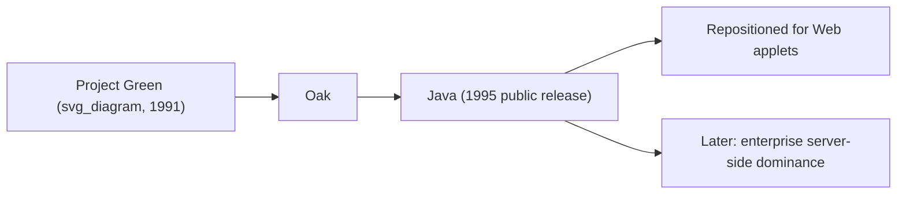
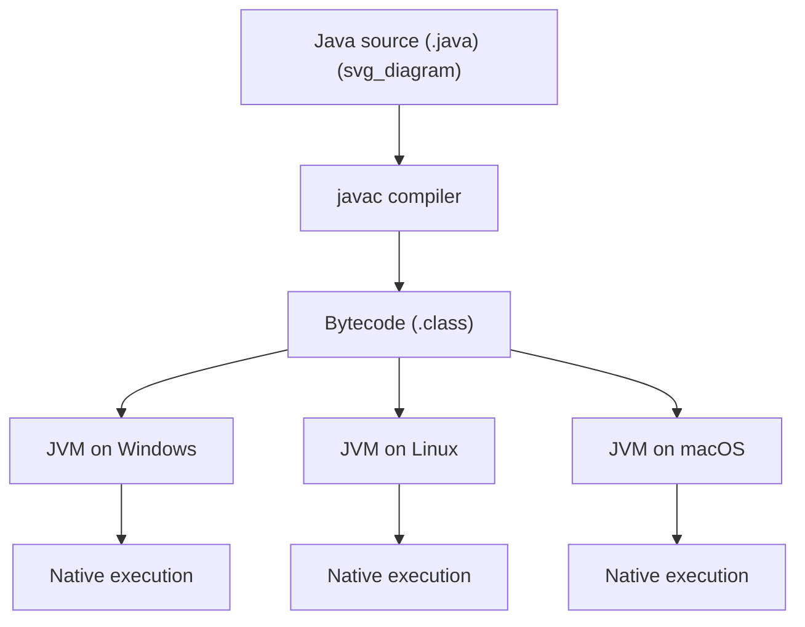
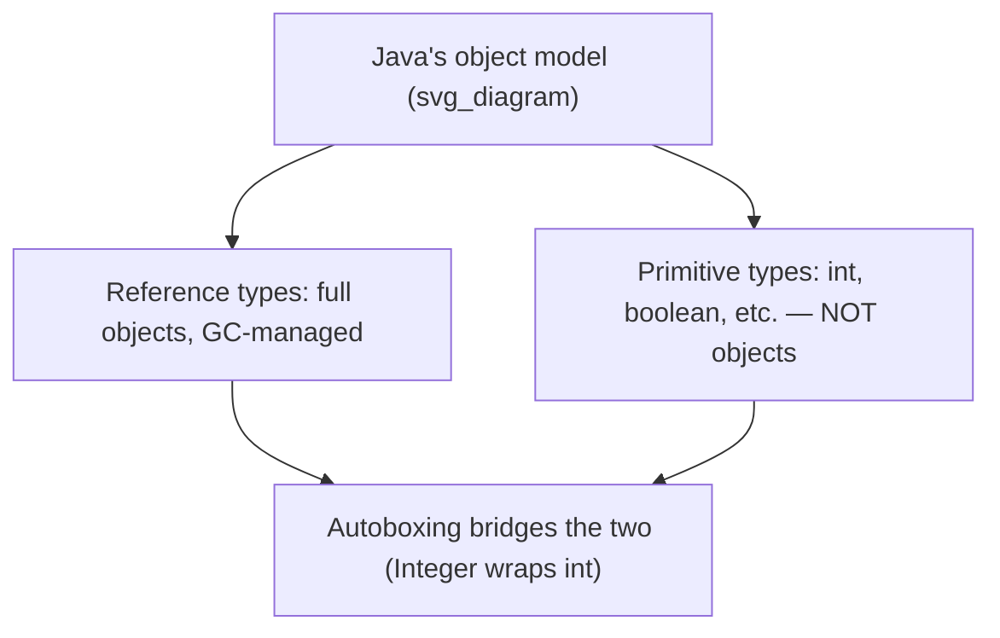
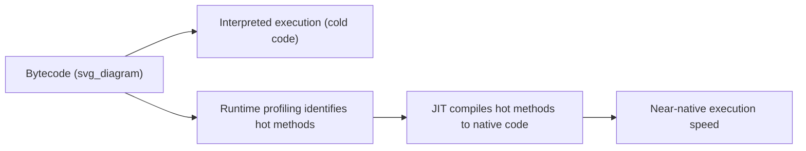
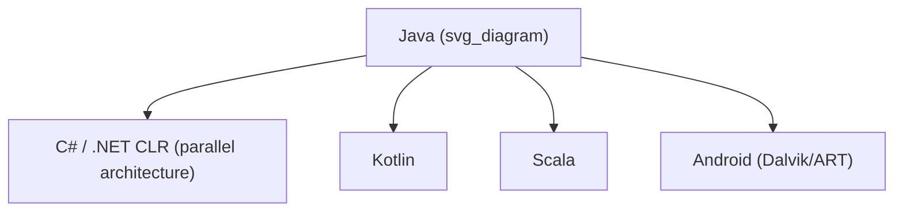

## Java and Platform Independence

### Historical Context

Java was developed at Sun Microsystems beginning in 1991 under James Gosling, Mike Sheridan, and Patrick Naughton, originally as part of a project codenamed **"Green,"** targeting embedded consumer electronics (set-top boxes, interactive television) — a domain characterized by many incompatible processor architectures. The language was initially called **Oak**, renamed Java before its 1995 public release. The embedded-electronics use case never materialized commercially as intended, but its central technical requirement — code that runs correctly across many different, incompatible hardware platforms without recompilation — turned out to map almost perfectly onto the emerging World Wide Web, and Java was repositioned and popularized around 1995 primarily as a language for portable, web-deliverable applets.

The famous slogan **"Write Once, Run Anywhere" (WORA)** captures Java's central design goal directly, in a way few other language mottos do.



### The Bytecode and Virtual Machine Model

Java's platform independence rests on a specific architectural decision: the Java compiler (`javac`) does not compile source code directly to native machine code for a specific CPU. Instead, it compiles to **bytecode** — an intermediate, platform-neutral instruction format — which is then executed by the **Java Virtual Machine (JVM)**, a separate program implemented natively for each target platform.

$$
\text{Source (.java)} \xrightarrow{javac} \text{Bytecode (.class)} \xrightarrow{JVM_{platform}} \text{Native execution}
$$



This differs fundamentally from C/C++'s model, where the compiler produces native machine code directly for one specific target architecture, requiring recompilation (or cross-compilation) for each new platform. In Java, **the same compiled `.class` file runs unmodified on any platform with a compatible JVM** — the portability burden shifts from the application developer to the JVM implementer, who need only build the virtual machine once per platform.

**Key Points**

- This bytecode/VM architecture was not entirely novel — Smalltalk and UCSD Pascal had used comparable bytecode-interpretation approaches earlier — but Java was the first language to popularize the model at mass-market, internet-driven scale.
- The JVM specification is itself an open, published standard, which allowed multiple independent JVM implementations (Sun's/Oracle's HotSpot, IBM's J9, OpenJ9, GraalVM, and others) to coexist while remaining bytecode-compatible.

### Automatic Memory Management

Java adopted automatic **garbage collection** as a mandatory, non-optional part of the language runtime, in contrast to C++'s optional, library-based smart-pointer approach and C's fully manual model. Programmers allocate objects with `new` but never explicitly free them; the JVM's garbage collector reclaims memory for objects no longer reachable.

```java
Car myCar = new Car("Sedan");
myCar = null;  // object becomes eligible for garbage collection
               // — no explicit "delete" or "free" call exists in the language
```

**Key Points**

- This eliminates an entire category of C/C++ bugs (use-after-free, double-free, dangling pointers) by construction, at the cost of relinquishing precise control over when deallocation occurs and some runtime overhead for collection cycles.
- Java's garbage collector has evolved substantially across versions — from simple mark-and-sweep to generational collectors (G1, ZGC, Shenandoah) designed to minimize pause times for large heaps, particularly relevant for long-running server applications.
- [Inference] The choice to make garbage collection mandatory rather than optional is generally understood as a direct simplicity/safety trade-off against C++'s more flexible-but-error-prone manual model, consistent with Java's overall design bias toward safety and developer productivity over maximal runtime control.

### A Deliberately Simplified Object Model

Java's designers explicitly removed or restricted several C++ features they considered sources of complexity and bugs, aiming for what Gosling described as a smaller, easier-to-reason-about language:

- **No multiple inheritance of implementation** — a class extends exactly one superclass; multiple inheritance of type is instead achieved through **interfaces**, which (originally) specified method signatures without implementation.
- **No operator overloading** — arithmetic and comparison operators behave identically for all types, with no user redefinition permitted.
- **No pointer arithmetic** — references exist, but cannot be manipulated as raw addresses or incremented/decremented like C pointers.
- **No header files / no preprocessor** — Java replaced the C/C++ compilation model with **packages** and direct symbol resolution from compiled class files.

```java
interface Flyable {
    void fly();
}

interface Swimmable {
    void swim();
}

class Duck implements Flyable, Swimmable {
    public void fly()  { System.out.println("Duck flying"); }
    public void swim() { System.out.println("Duck swimming"); }
}
```

This directly addresses the C++ diamond-problem complexity discussed in multiple-inheritance designs: Java permits a class to implement many interfaces (multiple inheritance of *type*) while restricting inheritance of *implementation* to a single superclass, sidestepping the ambiguity C++'s virtual inheritance mechanism exists to resolve.

### Everything Runs Inside an Object (Mostly)

Java requires all code to live inside a class — there are no free-standing functions or global variables at the top level, unlike C, C++, or even Smalltalk's looser top-level message sends. However, unlike Smalltalt's "everything is an object" purity, Java retains **primitive types** (`int`, `boolean`, `double`, etc.) that are not objects, for performance reasons — a deliberate, pragmatic compromise between Smalltalk-style uniformity and C-style raw performance.



**Autoboxing/unboxing**, introduced in Java 5, automatically converts between primitives and their object wrapper classes (`int` ↔ `Integer`) where needed, partially papering over this dual-nature type system without eliminating it.

### Checked Exceptions

Java introduced **checked exceptions**, a distinctive and later-controversial feature: certain exception types must be either caught or explicitly declared in a method's signature (`throws`), enforced by the compiler.

```java
void readFile(String path) throws IOException {
    FileReader reader = new FileReader(path);
    // caller MUST catch IOException or declare it themselves —
    // the compiler rejects code that silently ignores this possibility
}
```

**Key Points**

- This was intended to make error handling for foreseeable failure conditions (missing files, network errors) impossible to silently ignore, extending Ada's philosophy of surfacing errors at compile time rather than allowing silent failure.
- Checked exceptions proved controversial in practice: they interact poorly with generic/functional-style code (notably lambdas, introduced later), and most Java-influenced languages designed afterward (C#, Kotlin, Scala) deliberately chose **not** to adopt mandatory checked exceptions, treating this as a lesson learned rather than a model to repeat.

### The Class Library and "Batteries Included" Philosophy

Java shipped with an extensive standard library from the outset — collections, networking, GUI toolkits (AWT, later Swing), I/O — reflecting a "batteries included" philosophy distinct from C's minimal standard library and closer in spirit to Smalltalk's rich, integrated class library, but compiled and statically typed rather than image-based and dynamic.

```java
import java.util.*;

List<String> names = new ArrayList<>();
names.add("Alice");
names.add("Bob");
Collections.sort(names);
```

### JIT Compilation: Bridging Interpretation and Native Speed

A pure bytecode-interpretation model, as used by early JVMs, carries a real performance cost relative to natively compiled C++. Java addressed this with **Just-In-Time (JIT) compilation**: the JVM monitors bytecode execution at runtime and compiles "hot" (frequently executed) methods directly to native machine code on the fly, combining the portability benefits of bytecode distribution with performance approaching that of ahead-of-time-compiled languages for long-running programs.



[Unverified] Specific performance comparisons between JIT-compiled Java and natively compiled C++ vary substantially by workload, JVM version, and benchmark methodology, so general claims that Java "is as fast as" or "is slower than" C++ should be treated as workload-dependent rather than as a fixed, universal ranking.

### Standardization and Ecosystem Governance

Unlike C++ (ISO committee) or Ada (government mandate), Java's evolution was governed by Sun Microsystems and later Oracle (after Sun's 2010 acquisition) through the **Java Community Process (JCP)**, a structured but vendor-influenced standardization process involving Java Specification Requests (JSRs). This produced a hybrid governance model: broader than a single company's unilateral control, but historically more centralized than ISO's multi-vendor committee structure.

### Influence on Later Languages and Platforms

**Key Points**

- **C#** was designed by Microsoft with an extremely similar bytecode/VM architecture (Common Intermediate Language, the .NET CLR), widely understood as a direct, close competitive response to Java.
- **Kotlin and Scala** were built explicitly to run on the JVM, interoperate with existing Java libraries, and address specific Java pain points (null safety, verbosity, checked exceptions) while retaining WORA-style portability.
- **Android's** original application runtime (Dalvik, later ART) used Java as its primary application language, extending Java's platform-independence philosophy to a new, non-Sun-controlled mobile ecosystem.
- The **bytecode/VM architectural pattern** itself influenced numerous later language runtimes (the .NET CLR most directly, but also influencing general acceptance of managed-runtime languages as viable for mainstream application and server development).



### Example: Platform-Independent Execution in Practice

```java
public class Greeting {
    public static void main(String[] args) {
        String name = "World";
        System.out.println("Hello, " + name + "!");
    }
}
```

**Output**

```
Hello, World!
```

Compiled once with `javac Greeting.java`, the resulting `Greeting.class` bytecode file runs identically via `java Greeting` on Windows, Linux, or macOS, provided each has a compatible JVM installed — no recompilation, no platform-specific build step required for this program.

### Conclusion

Java's central contribution was making bytecode/virtual-machine-based platform independence practical and mainstream at internet scale, backed by mandatory garbage collection and a deliberately simplified object model that traded some of C++'s flexibility and raw control for safety and portability. Its "write once, run anywhere" architecture — later closely mirrored by C#/.NET — established managed, VM-based execution as a legitimate, dominant alternative to natively compiled systems languages for application and enterprise server development, even as C++ and, later, Rust retained the domains where direct hardware control and zero-overhead abstraction remained essential.

**Related Topics**

- The JVM specification and its independent implementations (HotSpot, OpenJ9, GraalVM)
- Garbage collection algorithms: generational, G1, ZGC, and Shenandoah
- Checked vs. unchecked exceptions and the design lessons later languages drew from them
- C#/.NET's CLR as a parallel bytecode/VM architecture
- Kotlin and Scala as JVM-targeting languages addressing Java's limitations
- Autoboxing and the primitive/object type duality
- JIT compilation techniques and adaptive optimization
- Android's application runtime evolution (Dalvik to ART)