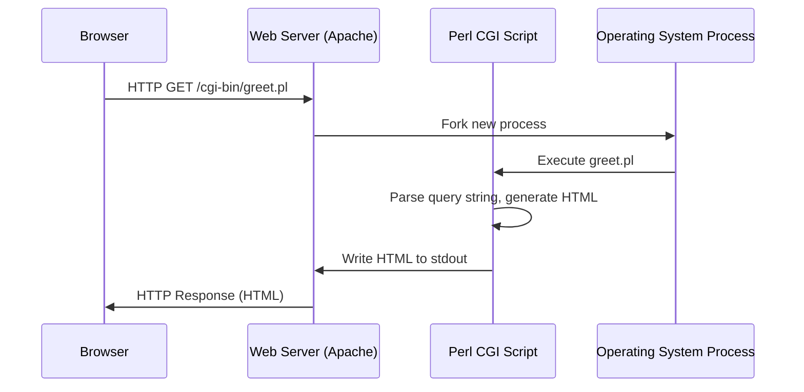
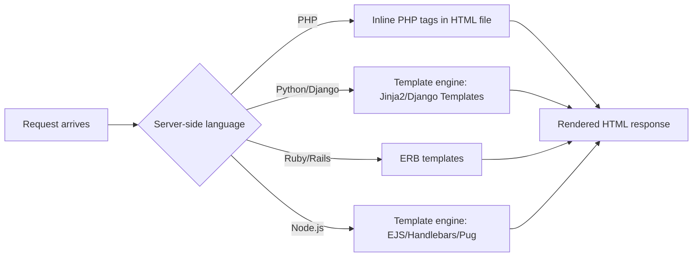

## Scripting Languages and the Web Era

### Overview

The rise of scripting languages from the mid-1990s onward reshaped software development by prioritizing developer productivity, rapid iteration, and "glue code" flexibility over the raw performance and static safety guarantees of compiled systems languages. This era is inseparable from the growth of the World Wide Web, which created massive demand for languages that could generate dynamic content, manipulate text, and integrate disparate systems quickly. Scripting languages are typically interpreted or JIT-compiled, dynamically typed, and designed to minimize the ceremony between writing code and seeing it run.

### Defining Scripting Languages

**Key Points**
- Traditionally interpreted rather than compiled to native machine code ahead of time, though modern implementations often use just-in-time (JIT) compilation internally.
- Dynamic typing is the norm: variable types are checked and can change at runtime rather than being fixed at compile time.
- High-level abstractions over memory management (automatic garbage collection), string handling, and I/O reduce boilerplate.
- Originally designed as "glue languages" to connect existing components, automate repetitive tasks, or extend applications, rather than to build entire systems from scratch.
- The line between "scripting language" and "general-purpose language" has blurred considerably; languages like Python and Ruby are now used for large-scale applications, not just short scripts.

### Historical Roots: Before the Web

Scripting languages predate the web. Understanding their origins clarifies why they were well-positioned for the web era when it arrived.

**Shell Scripting (1970s)**
Unix shells (`sh`, later `csh`, `ksh`, `bash`) allowed users to script sequences of commands, establishing the pattern of using a lightweight interpreted language to orchestrate other programs.

**AWK (1977)**
Created by Aho, Weinberger, and Kernighan, AWK specialized in pattern-matching and text processing over structured data streams, influencing later text-processing idioms found in Perl.

**Perl (1987)**
Larry Wall created Perl as "the duct tape of the internet." It combined the text-processing strengths of AWK and `sed` with a full general-purpose language, C-like syntax, and powerful native regular expression support. Perl's practical, "there's more than one way to do it" (TMTOTWI) philosophy made it enormously popular for system administration and, crucially, early web development.

**Tcl (1988)**
John Ousterhout's Tcl (Tool Command Language) emphasized embeddability, letting applications expose a scripting interface to end users, paired with the Tk GUI toolkit.

### The CGI Era: Scripting Meets the Web

**Key Points**
- The Common Gateway Interface (CGI), standardized in the early 1990s, defined how a web server could invoke an external program and return its output as an HTTP response.
- CGI turned any scripting language capable of reading standard input and writing standard output into a web backend technology.
- Perl became the dominant CGI language of the mid-to-late 1990s due to its text-processing strength and regex engine, giving rise to the term "Perl CGI scripts" as near-synonymous with early dynamic websites.

**Example** (conceptual CGI/Perl flow)



Each request under CGI spawned a new OS process, which was straightforward to implement but had significant per-request overhead — a limitation that later drove the development of persistent-process alternatives like `mod_perl`, FastCGI, and eventually embedded language runtimes.

### PHP: Purpose-Built for the Web

**Key Points**
- Created by Rasmus Lerdorf in 1994 as "Personal Home Page Tools," PHP was retooled into "PHP: Hypertext Preprocessor" and released more broadly by 1995.
- Unlike Perl, which was adapted to the web, PHP was designed from the outset to be embedded directly inside HTML documents.
- PHP code is interspersed with markup using `<?php ... ?>` tags, letting developers mix templating and logic in a single file — a major usability win for the LAMP-era generation of developers.
- PHP 3 (1998) and PHP 4 (2000, with the Zend Engine) professionalized the language considerably, adding a proper compiled-execution model internally while remaining source-interpreted from the developer's perspective.
- PHP 5 (2004) introduced a substantially improved object-oriented programming model.

**Example** (PHP embedded in HTML)

```php
<!DOCTYPE html>
<html>
<body>
  <h1>Welcome, <?php echo htmlspecialchars($username); ?></h1>
  <?php if ($isLoggedIn): ?>
    <p>You have <?php echo $messageCount; ?> new messages.</p>
  <?php else: ?>
    <p>Please log in.</p>
  <?php endif; ?>
</body>
</html>
```

PHP's tight integration with the LAMP stack (Linux, Apache, MySQL, PHP) made it the default choice for a generation of web applications, including early versions of Facebook, and content-management systems like WordPress and Drupal that remain foundational to the web today.

### Python: The General-Purpose Contender

**Key Points**
- Guido van Rossum released Python in 1991, predating the mainstream web but growing alongside it.
- Python emphasized readability via significant whitespace (enforced indentation) and a design philosophy captured in "The Zen of Python" (`import this`), favoring one obvious way to do things — a deliberate contrast to Perl's TMTOTWI ethos.
- Python's standard library ("batteries included") and later its enormous third-party package ecosystem (via PyPI) made it suitable for web development, scientific computing, automation, and eventually data science and machine learning.
- Web frameworks such as Zope (1996), and later Django (2005) and Flask (2010), brought Python into direct competition with PHP and Perl/Ruby for web backends, emphasizing convention, security defaults, and rapid development ("MVC"/"MTV" architecture).
- The Python 2 to Python 3 transition (Python 3 released 2008) was a prolonged, community-wide migration effort due to intentional backward incompatibilities (notably in string/Unicode handling), a widely cited case study in language evolution and ecosystem fragmentation risk. [Inference: characterizing the migration's difficulty and duration as unusually prolonged compared to other major language transitions is a comparative judgment rather than a strictly documented fact, though it is widely discussed in the Python community.]

### Ruby and Ruby on Rails

**Key Points**
- Yukihiro "Matz" Matsumoto designed Ruby (first released 1995) with an explicit goal of programmer happiness and elegance, blending ideas from Perl, Smalltalk, Lisp, and Eiffel.
- Ruby remained relatively niche outside Japan until David Heinemeier Hansson released Ruby on Rails in 2004.
- Rails popularized "convention over configuration" and "don't repeat yourself" (DRY) as first-class framework philosophies, drastically reducing the boilerplate needed to stand up a database-backed web application.
- Rails' scaffolding, ActiveRecord ORM, and opinionated MVC structure heavily influenced the design of subsequent frameworks across other languages (Django in Python, Laravel in PHP, Sails.js in JavaScript).

**Example** (Rails convention-driven routing and model)

```ruby
# config/routes.rb
resources :articles

# app/models/article.rb
class Article < ApplicationRecord
  validates :title, presence: true
end
```

This small amount of code, combined with Rails' conventions, automatically wires up full CRUD (Create, Read, Update, Delete) HTTP routes and database validation without explicit configuration of each endpoint.

### JavaScript: From Toy Language to Web Backbone

**Key Points**
- Brendan Eich created JavaScript in 10 days in 1995 at Netscape, originally named Mocha, then LiveScript, then renamed JavaScript for marketing reasons tied to Sun Microsystems' Java (the two languages are otherwise unrelated in design). [Unverified: the "10 days" figure is widely reported in interviews and retrospectives but is a claim about historical development speed that cannot be independently verified from primary specification documents.]
- JavaScript was standardized as ECMAScript by ECMA International starting in 1997, with the specification (ECMA-262) governing the language independent of any single vendor's implementation.
- Early JavaScript was confined to the browser: form validation, simple DOM manipulation, and visual effects — often dismissed by "serious" programmers as a toy compared to Java applets or server-side languages.
- The "browser wars" between Netscape and Microsoft (which shipped its own JScript variant) led to inconsistent implementations, a persistent headache for web developers through the 2000s.
- The release of the XMLHttpRequest object and its popularization under the term "AJAX" (Asynchronous JavaScript and XML, coined 2005) enabled pages to fetch data without full reloads, catalyzing rich, app-like web interfaces (Gmail, Google Maps) and elevating JavaScript's perceived importance.
- Google's V8 engine (2008), built for Chrome, introduced JIT compilation techniques that dramatically improved JavaScript execution speed, which directly enabled JavaScript's move outside the browser.

**Example** (early DOM manipulation vs. AJAX-era code)

```javascript
// Pre-AJAX: full page reload required to get new data
function submitForm() {
  document.forms[0].submit();
}

// AJAX-era: asynchronous data fetch without reload
function fetchMessages() {
  const xhr = new XMLHttpRequest();
  xhr.open("GET", "/api/messages", true);
  xhr.onreadystatechange = function () {
    if (xhr.readyState === 4 && xhr.status === 200) {
      document.getElementById("inbox").innerHTML = xhr.responseText;
    }
  };
  xhr.send();
}
```

### Node.js: JavaScript Escapes the Browser

**Key Points**
- Ryan Dahl released Node.js in 2009, pairing the V8 engine with an event-driven, non-blocking I/O model to build scalable network applications in JavaScript.
- Node.js's single-threaded event loop, combined with asynchronous callbacks (later Promises, then `async`/`await`), was designed to handle high levels of I/O concurrency without the memory overhead of one OS thread per connection.
- npm (Node Package Manager), bundled with Node.js from 2010 onward, grew into the largest package registry of any programming language ecosystem, reflecting both the productivity and fragmentation concerns of the JavaScript world.
- Node.js enabled "isomorphic" or "universal" JavaScript, where the same language (and sometimes the same code) runs on both client and server, reducing context-switching for full-stack developers.

**Example** (minimal Node.js HTTP server)

```javascript
const http = require("http");

const server = http.createServer((req, res) => {
  res.writeHead(200, { "Content-Type": "text/plain" });
  res.end("Hello from Node.js\n");
});

server.listen(3000, () => {
  console.log("Server running at http://localhost:3000/");
});
```

### Event Loop Concurrency Model (Illustration)

<svg xmlns="http://www.w3.org/2000/svg" viewBox="0 0 760 380">
  <text x="380" y="28" text-anchor="middle" font-size="18" font-weight="bold" fill="#1a1a1a">Node.js Event Loop (svg_diagram)</text>

  <rect x="40" y="60" width="200" height="90" rx="8" fill="#e8f0fe" stroke="#3b6fd6" stroke-width="2" />
  <text x="140" y="95" text-anchor="middle" font-size="14" fill="#1a1a1a">Call Stack</text>
  <text x="140" y="115" text-anchor="middle" font-size="11" fill="#444">Executes JS</text>
  <text x="140" y="132" text-anchor="middle" font-size="11" fill="#444">synchronously</text>

  <rect x="300" y="60" width="200" height="90" rx="8" fill="#fef3e0" stroke="#d68a1e" stroke-width="2" />
  <text x="400" y="95" text-anchor="middle" font-size="14" fill="#1a1a1a">Node APIs / libuv</text>
  <text x="400" y="115" text-anchor="middle" font-size="11" fill="#444">File I/O, Network,</text>
  <text x="400" y="132" text-anchor="middle" font-size="11" fill="#444">Timers (async)</text>

  <rect x="560" y="60" width="160" height="90" rx="8" fill="#e6f7ec" stroke="#2e9e5b" stroke-width="2" />
  <text x="640" y="95" text-anchor="middle" font-size="14" fill="#1a1a1a">Callback Queue</text>
  <text x="640" y="115" text-anchor="middle" font-size="11" fill="#444">Pending</text>
  <text x="640" y="132" text-anchor="middle" font-size="11" fill="#444">callbacks</text>

  <rect x="270" y="220" width="220" height="80" rx="8" fill="#f3e8fe" stroke="#8a3bd6" stroke-width="2" />
  <text x="380" y="255" text-anchor="middle" font-size="14" fill="#1a1a1a">Event Loop</text>
  <text x="380" y="275" text-anchor="middle" font-size="11" fill="#444">Moves ready callbacks to stack</text>

  <line x1="240" y1="105" x2="300" y2="105" stroke="#555" stroke-width="2" marker-end="url(#arrow)" />
  <line x1="500" y1="105" x2="560" y2="105" stroke="#555" stroke-width="2" marker-end="url(#arrow)" />
  <line x1="640" y1="150" x2="450" y2="220" stroke="#555" stroke-width="2" marker-end="url(#arrow)" />
  <line x1="330" y1="220" x2="200" y2="150" stroke="#555" stroke-width="2" marker-end="url(#arrow)" />

  <text x="270" y="180" text-anchor="middle" font-size="10" fill="#666">async call delegated</text>
  <text x="560" y="180" text-anchor="middle" font-size="10" fill="#666">op completes</text>

  <text x="380" y="345" text-anchor="middle" font-size="12" fill="#555">Single-threaded stack; blocking I/O is offloaded, never executed inline</text>
</svg>

### Comparative Design Philosophies

| Language | Core Philosophy | Typing | Primary Web Niche |
|---|---|---|---|
| Perl | "There's more than one way to do it" | Dynamic | CGI scripting, text processing |
| PHP | Embed logic directly in markup | Dynamic | Server-side templating, CMS platforms |
| Python | "There should be one obvious way to do it" | Dynamic (optional static hints later) | General-purpose, backend, data science |
| Ruby | Programmer happiness, convention over configuration | Dynamic | Rails-based web applications |
| JavaScript | Ubiquity — the only language natively in every browser | Dynamic | Client-side interactivity, later full-stack |

### Interpreters, JIT Compilation, and Performance Trade-offs

**Key Points**
- Pure interpretation (reading and executing source line-by-line) is simple to implement but slow; most production scripting-language runtimes moved toward bytecode compilation plus JIT techniques to close the performance gap with compiled languages.
- CPython (the reference Python implementation) compiles source to bytecode executed by a stack-based virtual machine; it has historically lacked a JIT by default, though this has evolved. [Unverified: the presence, maturity, and default status of JIT compilation in CPython has changed across recent releases; specific version behavior should be checked against current CPython release notes rather than assumed.]
- V8 (JavaScript), and similarly the Zend Engine with OPcache (PHP) and YARV with JIT support (Ruby, from Ruby 2.6 onward), all adopted forms of just-in-time compilation or bytecode caching to improve throughput.
- The Global Interpreter Lock (GIL) in CPython and MRI (Ruby's reference implementation) is a mechanism that allows only one thread to execute interpreter bytecode at a time, simplifying memory management at the cost of true parallel multi-threading for CPU-bound work — a well-documented, deliberate design trade-off in both implementations.

### Package Management and Ecosystem Growth

**Key Points**
- The scripting-language era popularized centralized package registries as essential infrastructure: CPAN for Perl (1995), PyPI for Python (2003), RubyGems for Ruby (2004), and npm for JavaScript/Node.js (2010).
- These registries reduced the cost of code reuse dramatically but introduced new categories of risk: dependency sprawl, supply-chain attacks via malicious packages, and version-compatibility ("dependency hell") issues.
- npm's flat/nested `node_modules` resolution strategy and semantic versioning conventions became a widely studied case in balancing ecosystem flexibility against reproducibility.

### Templating and the Server-Side Rendering Pattern

**Example** (comparing templating approaches across languages)



Despite syntactic differences, all these approaches share the same underlying pattern: separating a template (structure) from dynamic data (content), interpolated at request time on the server before the HTML reaches the browser — the dominant model before client-side rendering frameworks became widespread.

### Client-Side Frameworks and the Shift Toward SPA Architecture

**Key Points**
- As JavaScript engines grew faster (post-V8) and AJAX matured, the industry began shifting logic from the server to the browser, giving rise to the Single-Page Application (SPA) pattern.
- Early libraries like jQuery (2006) abstracted away cross-browser DOM inconsistencies, making client-side scripting far more approachable and arguably extending JavaScript's dominance before more structured frameworks emerged.
- This laid groundwork for later-generation frameworks (Angular, React, Vue) that fall slightly beyond the traditional "scripting language era" but are direct descendants of the JavaScript ecosystem this era established.

### Common Threads Across Scripting Languages of This Era

**Key Points**
- Rapid feedback loops: no separate compile step meant developers could iterate by editing and reloading, a significant productivity shift from the edit-compile-link-run cycle of C/C++.
- Text and string manipulation as a first-class concern, reflecting the web's fundamentally text-based protocols (HTTP, HTML, later JSON and XML).
- Duck typing and dynamic dispatch ("if it walks like a duck and quacks like a duck") allowed flexible, loosely coupled code, at the cost of some compile-time error detection compared to statically typed languages.
- Community and ecosystem often mattered as much as language design; frameworks (Rails, Django, Laravel, Express) frequently drove adoption more than core language features.
- Garbage collection was standard across all of these languages, removing manual memory management as a developer concern and reducing an entire class of bugs (though introducing GC-pause performance considerations).

### Conclusion

The scripting-language era demonstrated that developer productivity and ecosystem network effects could rival raw execution speed as drivers of a language's success. Perl proved scripting languages could power the early dynamic web; PHP showed the value of purpose-built web-embedded design; Python and Ruby demonstrated that readability and elegant frameworks could win developer mindshare; and JavaScript, through a combination of browser ubiquity, standardization, and engines like V8, evolved from a "toy" client-side language into the only language natively supported everywhere a browser exists — and, via Node.js, a full-stack contender in its own right. These languages collectively established patterns (package registries, MVC frameworks, asynchronous I/O models) that continue to shape both web development and general-purpose programming language design today.

### Related Topics

- Rise of Single-Page Application frameworks (Angular, React, Vue) and the modern JavaScript frontend ecosystem
- TypeScript and the movement toward optional static typing in dynamic languages
- WebAssembly and the push for near-native performance in the browser
- Asynchronous programming models: callbacks, Promises, `async`/`await` across languages
- Package manager design and supply-chain security (npm, PyPI, RubyGems case studies)
- Microservices and API-first backend design (REST, GraphQL) as a successor pattern to server-rendered templating
- Python's rise in data science and machine learning as a divergence from its web-scripting origins
- Comparative garbage collection strategies across dynamic language runtimes