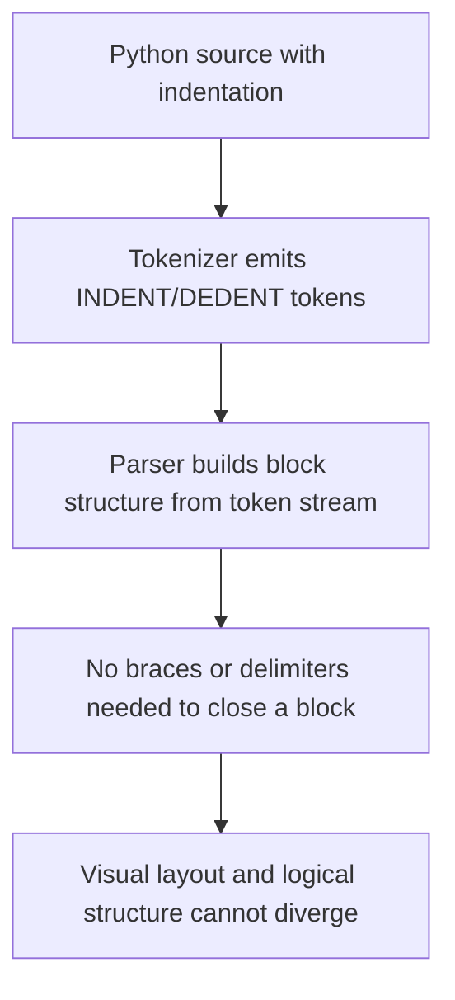
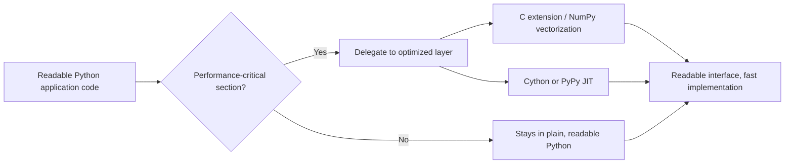

## Python and Readability-Focused Design

### Overview

Python, first released by Guido van Rossum in 1991, is distinguished among major programming languages by treating readability not as a stylistic afterthought but as a core design constraint enforced at the syntactic level. Where most languages leave code formatting to convention or linters, Python makes indentation semantically meaningful, collapses ambiguity by favoring a single idiomatic way to express an idea, and documents its own philosophy explicitly through "The Zen of Python." This document surveys the language features, design principles, and trade-offs that constitute Python's readability-first approach.

### Historical Motivation

**Key Points**
- Van Rossum began Python in December 1989 as a successor to the ABC language, aiming to retain ABC's readability and teachability while fixing its extensibility limitations.
- ABC had already experimented with mandatory indentation-based block structure, an idea Python inherited and refined.
- Python's stated goal was to be a language that read almost like executable pseudocode, lowering the barrier between "thinking about a problem" and "expressing a solution in code."
- The name "Python" was chosen as a reference to the British comedy group Monty Python, reflecting an intentionally informal, approachable tone that extended into the language's documentation and community culture. [Unverified: this origin is widely reported by van Rossum himself in interviews and retrospectives, though it is a biographical/historical claim rather than something verifiable from the language specification.]

### The Zen of Python

**Key Points**
- Written by Tim Peters, "The Zen of Python" (PEP 20) is a collection of 19 aphorisms capturing Python's design philosophy, accessible in any Python interpreter via `import this`.
- Key lines include "Beautiful is better than ugly," "Explicit is better than implicit," "Simple is better than complex," and the most consequential for readability: "There should be one — and preferably only one — obvious way to do it."
- This last principle stands in direct contrast to Perl's "there's more than one way to do it" (TMTOWTDI) philosophy, representing two opposing views on how expressiveness and readability interact.

**Example**

```python
>>> import this
The Zen of Python, by Tim Peters

Beautiful is better than ugly.
Explicit is better than implicit.
Simple is better than complex.
Readability counts.
...
```

### Significant Whitespace and Enforced Indentation

**Key Points**
- Python uses indentation, not braces or keywords like `end`, to delimit code blocks. This is not merely a style convention but a syntax rule enforced by the parser.
- This design eliminates an entire category of bugs found in brace-delimited languages where visual indentation and actual block structure diverge (a mismatch the compiler does not catch).
- Mixing tabs and spaces inconsistently in a way that creates ambiguity raises a `TabError` in Python 3, a deliberate hardening compared to Python 2's more permissive handling. [Inference: describing Python 3's tab/space handling as stricter than Python 2's is a comparative claim about version evolution rather than a single documented fact, though it reflects a well-known change.]

**Example** (indentation as block structure)

```python
def classify_number(n):
    if n > 0:
        return "positive"
    elif n < 0:
        return "negative"
    else:
        return "zero"
```



### One Obvious Way: Reducing Decision Fatigue

**Key Points**
- Python typically offers a single canonical idiom for common tasks, in contrast to languages that provide multiple stylistically equivalent constructs.
- This reduces the cognitive load of reading unfamiliar code, since a reader does not need to reconcile many possible equivalent forms.
- The principle is aspirational rather than absolute — Python does have multiple ways to do many things in practice (e.g., string formatting has evolved through `%`-formatting, `.format()`, and f-strings), but the community and style guides actively converge on one preferred idiom per Python version generation.

**Example** (convergence toward one idiom: string formatting evolution)

```python
name = "Ada"

# Old-style (%-formatting) — still valid, discouraged in new code
greeting1 = "Hello, %s" % name

# str.format() — introduced in Python 2.6/3.0
greeting2 = "Hello, {}".format(name)

# f-strings — introduced in Python 3.6, now the idiomatic default
greeting3 = f"Hello, {name}"
```

### PEP 8: Codifying Readability as Style

**Key Points**
- PEP 8, authored primarily by van Rossum, Barry Warsaw, and Nick Coghlan, is the official style guide for Python code and functions as a readability contract across the ecosystem.
- It specifies conventions including 4-space indentation, `snake_case` for functions and variables, `PascalCase` for classes, a soft line-length limit (79 characters, commonly relaxed to ~88–100 in modern tooling), and consistent whitespace around operators.
- Widespread tooling (`flake8`, `pylint`, `black`, `ruff`) automates PEP 8 enforcement, meaning readability conventions are checked programmatically rather than relying purely on reviewer discipline.
- PEP 8 explicitly states that consistency within a project matters more than blind rule-following, and that readability should override the letter of the guide when the two conflict.

**Example** (PEP 8 naming conventions)

```python
MAX_RETRIES = 5          # module-level constant: UPPER_SNAKE_CASE

class RequestHandler:    # class: PascalCase
    def process_request(self, payload):   # function/method: snake_case
        retry_count = 0                    # variable: snake_case
        return retry_count
```

### List Comprehensions and Declarative Idioms

**Key Points**
- List comprehensions, set comprehensions, dict comprehensions, and generator expressions let developers express "build a collection by transforming/filtering another" declaratively, closer to mathematical set-builder notation than imperative loop-and-append code.
- This is a deliberate readability trade-off: comprehensions are more concise and, once familiar, often faster to read as a single "shape" than an equivalent multi-line loop, though deeply nested comprehensions can reduce readability and are generally discouraged by style guides.

**Example** (imperative loop vs. comprehension)

```python
# Imperative style
squares = []
for n in range(10):
    if n % 2 == 0:
        squares.append(n ** 2)

# Comprehension style — same result, one line
squares = [n ** 2 for n in range(10) if n % 2 == 0]
```

$$
\text{squares} = \{\, n^2 \mid n \in \{0, 1, \ldots, 9\},\ n \bmod 2 = 0 \,\}
$$

### Duck Typing and Readable Polymorphism

**Key Points**
- Python favors duck typing: an object's suitability for an operation is determined by whether it supports the required methods/attributes at runtime, not by an explicit declared type or interface.
- This removes the ceremony of interface declarations found in many statically typed languages, letting code read closer to the intent ("call `.quack()` on whatever this is") rather than the type machinery.
- The trade-off is that type-related errors surface at runtime rather than compile time, which Python has partially addressed later via optional static type hints (PEP 484, Python 3.5+) without abandoning dynamic typing as the default.

**Example** (duck typing vs. optional type hints)

```python
# Pure duck typing — no type declared, works for anything with .quack()
def make_it_quack(duck):
    duck.quack()

# With optional static type hints — readability + tooling support, still dynamic at runtime
from typing import Protocol

class Quacker(Protocol):
    def quack(self) -> None: ...

def make_it_quack_typed(duck: Quacker) -> None:
    duck.quack()
```

### Readability vs. Performance: An Explicit Trade-off

**Key Points**
- Python's readability-first design generally comes at a measurable runtime performance cost relative to statically typed, ahead-of-time compiled languages, because dynamic typing requires runtime type checks and attribute lookups that a compiler cannot fully optimize away in the reference implementation. [Inference: the magnitude of this performance gap varies significantly by workload, implementation (CPython vs. PyPy vs. others), and Python version, so it should be treated as a general tendency rather than a fixed, universally quantifiable cost.]
- The language's design philosophy explicitly accepts this trade-off: developer time and code clarity are treated as more often the bottleneck than CPU time for the majority of Python's target use cases (scripting, glue code, data analysis, web backends).
- For performance-critical sections, the common pattern is to keep the readable Python layer as the interface while delegating hot loops to C extensions, Cython, NumPy's vectorized operations, or alternative runtimes (PyPy), rather than sacrificing readability throughout the codebase.



### Readability-Focused Language Comparison

<svg xmlns="http://www.w3.org/2000/svg" viewBox="0 0 760 320">
  <text x="380" y="28" text-anchor="middle" font-size="18" font-weight="bold" fill="#1a1a1a">Block Delimitation Approaches (svg_diagram)</text>

  <rect x="30" y="60" width="210" height="220" rx="8" fill="#e8f0fe" stroke="#3b6fd6" stroke-width="2" />
  <text x="135" y="90" text-anchor="middle" font-size="14" font-weight="bold" fill="#1a1a1a">Python</text>
  <text x="45" y="120" font-size="12" font-family="monospace" fill="#333">if x &gt; 0:</text>
  <text x="60" y="140" font-size="12" font-family="monospace" fill="#333">print("pos")</text>
  <text x="45" y="165" font-size="11" fill="#555">Block = indentation level</text>
  <text x="45" y="185" font-size="11" fill="#555">Enforced by parser</text>
  <text x="45" y="205" font-size="11" fill="#555">No closing keyword</text>
  <text x="45" y="225" font-size="11" fill="#555">or brace needed</text>

  <rect x="275" y="60" width="210" height="220" rx="8" fill="#fef3e0" stroke="#d68a1e" stroke-width="2" />
  <text x="380" y="90" text-anchor="middle" font-size="14" font-weight="bold" fill="#1a1a1a">C / Java / JS</text>
  <text x="290" y="120" font-size="12" font-family="monospace" fill="#333">if (x &gt; 0) {</text>
  <text x="300" y="140" font-size="12" font-family="monospace" fill="#333">print("pos");</text>
  <text x="290" y="160" font-size="12" font-family="monospace" fill="#333">}</text>
  <text x="290" y="185" font-size="11" fill="#555">Block = braces { }</text>
  <text x="290" y="205" font-size="11" fill="#555">Indentation is cosmetic,</text>
  <text x="290" y="225" font-size="11" fill="#555">not parsed</text>

  <rect x="520" y="60" width="210" height="220" rx="8" fill="#e6f7ec" stroke="#2e9e5b" stroke-width="2" />
  <text x="625" y="90" text-anchor="middle" font-size="14" font-weight="bold" fill="#1a1a1a">Ruby</text>
  <text x="535" y="120" font-size="12" font-family="monospace" fill="#333">if x &gt; 0</text>
  <text x="545" y="140" font-size="12" font-family="monospace" fill="#333">puts "pos"</text>
  <text x="535" y="160" font-size="12" font-family="monospace" fill="#333">end</text>
  <text x="535" y="185" font-size="11" fill="#555">Block = end keyword</text>
  <text x="535" y="205" font-size="11" fill="#555">Indentation is convention,</text>
  <text x="535" y="225" font-size="11" fill="#555">not parsed</text>
</svg>

### Documentation as a First-Class Citizen

**Key Points**
- Docstrings (triple-quoted string literals placed immediately inside a module, class, or function) are a built-in language feature, not a comment convention layered on afterward, and are accessible programmatically via the `__doc__` attribute and the `help()` builtin.
- PEP 257 standardizes docstring conventions, and tools like Sphinx generate formal documentation directly from in-code docstrings, reinforcing the idea that readable code and its documentation should live in the same place.

**Example**

```python
def calculate_area(radius):
    """Calculate the area of a circle.

    Args:
        radius (float): The circle's radius. Must be non-negative.

    Returns:
        float: The area of the circle.
    """
    import math
    return math.pi * radius ** 2

print(calculate_area.__doc__)
```

### Criticisms and Limitations of the Readability Focus

**Key Points**
- Significant whitespace, while eliminating brace-matching bugs, makes Python code sensitive to copy-paste errors across editors with different tab-width settings, and complicates certain code-generation and templating scenarios where indentation must be tracked programmatically.
- "One obvious way to do it" is an ideal Python has not fully achieved in practice; the ecosystem still contains multiple competing idioms for tasks like string formatting, path handling (`os.path` vs. `pathlib`), or packaging, partly as a byproduct of the language's long evolution.
- Dynamic typing, while contributing to readability at the point of writing, can reduce readability at the point of *maintenance* in large codebases, since a reader cannot always determine a variable's type from its declaration alone — a gap optional type hints (PEP 484) were introduced specifically to address.
- Readability is partly subjective and culturally shaped; developers coming from brace-delimited or more symbol-dense languages sometimes report an adjustment period before Python's terseness-versus-explicitness balance feels natural. [Speculation: the existence and duration of such an adjustment period is anecdotal and varies by individual background; no rigorous, generalizable measurement of this effect is being claimed here.]

### Conclusion

Python's readability-focused design is not a single feature but a coherent set of reinforcing decisions: syntactically enforced indentation, an explicitly documented philosophy (the Zen of Python), a community-maintained style guide (PEP 8) backed by automated tooling, a preference for one idiomatic way of expressing common operations, and first-class, introspectable documentation. These choices trade some raw performance and occasional flexibility for a lower cognitive barrier to reading, writing, and maintaining code — a trade-off that has proven especially well-suited to Python's dominant use cases in scripting, data science, education, and rapid application development, and a major factor in its sustained growth across very different technical domains.

### Related Topics

- PEP 484 and the gradual typing system: type hints, `mypy`, and static analysis in a dynamically typed language
- CPython internals: bytecode compilation and the interpreter execution model
- Comparative syntax design: indentation-based vs. brace-based vs. keyword-based block delimitation across languages
- Python packaging and environment management (`pip`, `venv`, `poetry`) as an ecosystem-level readability/consistency challenge
- The Python 2 to Python 3 migration as a case study in balancing language evolution against ecosystem stability
- Alternative Python implementations (PyPy, Jython, MicroPython) and their trade-offs relative to CPython
- Design-by-convention frameworks built on Python (Django) and how they extend the language's readability philosophy to application architecture