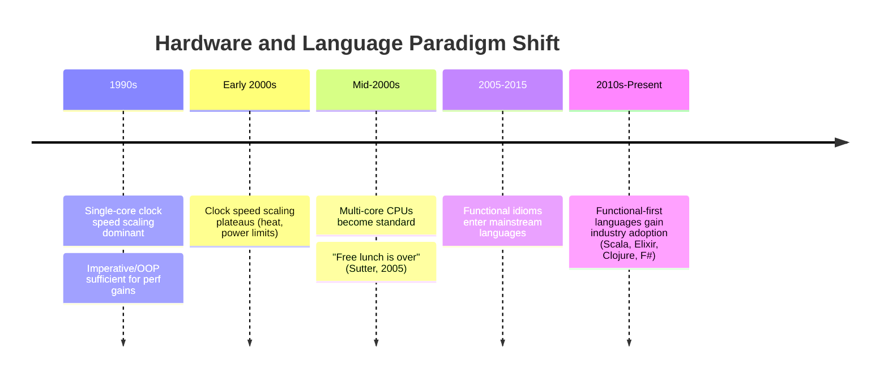

## Functional Language Resurgence in Mainstream Computing

### Overview

Functional programming (FP) originated in the 1950s with Lisp and matured through decades of academic languages like ML, Haskell, and Scheme, largely remaining outside mainstream industry adoption for most of that history. Beginning in the mid-2000s and accelerating through the 2010s, functional concepts and, in some cases, entire functional languages moved from academic and niche use into mainstream software engineering. This resurgence was driven by a convergence of forces: the multi-core hardware shift that made shared mutable state a liability, the rise of big data processing models that mapped naturally onto functional abstractions, and the gradual adoption of functional idioms (immutability, higher-order functions, pattern matching) inside historically imperative and object-oriented languages.

### Defining Functional Programming Concepts

**Key Points**
- **Pure functions**: functions whose output depends only on their input arguments, with no observable side effects (no mutation of external state, no I/O), making them easier to reason about, test, and parallelize.
- **Immutability**: data structures that cannot be modified after creation; instead of mutating in place, operations return new values, eliminating a large class of concurrency bugs caused by shared mutable state.
- **First-class and higher-order functions**: functions that can be passed as arguments, returned from other functions, and stored in variables, enabling composition-based design (`map`, `filter`, `reduce`/`fold`).
- **Referential transparency**: an expression can be replaced with its evaluated value without changing program behavior, a property that pure functions guarantee and that enables aggressive compiler optimization and easier equational reasoning.
- **Pattern matching and algebraic data types**: structured ways to destructure and branch on the shape of data, often paired with exhaustiveness checking at compile time.

$$
f(x) = f(x) \quad \text{for all invocations, given the same } x \quad \text{(referential transparency)}
$$

### Why Functional Ideas Resurged: The Multi-Core Driver

**Key Points**
- Through the early 2000s, CPU manufacturers hit physical and thermal limits on single-core clock speed scaling, shifting the industry toward multi-core processors as the primary path to increased performance.
- This shift, often summarized by the phrase "the free lunch is over" (a reference to Herb Sutter's influential 2005 article on the topic), meant software could no longer rely on automatic single-threaded speed increases and instead had to exploit parallelism explicitly.
- Traditional imperative programming with shared mutable state is notoriously difficult to parallelize correctly — race conditions, deadlocks, and non-deterministic bugs are common failure modes.
- Functional programming's emphasis on immutability and pure functions sidesteps many of these hazards by construction: if data cannot be mutated, there is no need to synchronize concurrent access to it, making functional style a natural fit for multi-core and distributed workloads. [Inference: framing immutability as sidestepping concurrency hazards "by construction" describes a structural property of the paradigm; the degree to which this translates into fewer real-world bugs in practice depends on how consistently immutability is applied across a given codebase.]



### Big Data and the MapReduce Influence

**Key Points**
- Google's 2004 MapReduce paper described a programming model directly borrowed from functional programming's `map` and `reduce` (fold) operations, applied at massive distributed scale.
- Apache Hadoop's open-source MapReduce implementation, and later Apache Spark, popularized this functional-style data processing model industry-wide, training a generation of engineers to think in terms of transformations over immutable datasets rather than in-place mutation.
- Spark's core abstraction, the Resilient Distributed Dataset (RDD), is explicitly immutable — transformations produce new RDDs rather than mutating existing ones, both for fault-tolerance (lineage-based recomputation) and to simplify distributed reasoning.

**Example** (functional-style data transformation, conceptually mirrored across Spark/Scala and plain functional code)

```scala
val wordCounts = textLines
  .flatMap(line => line.split(" "))
  .map(word => (word, 1))
  .reduceByKey(_ + _)
```

This chain of `flatMap`, `map`, and `reduceByKey` composes pure transformations over immutable collections — the same compositional style found in core functional programming, just distributed across a cluster.

### Functional-First Languages Gaining Industry Traction

**Scala (2003–present)**
- Created by Martin Odersky, Scala runs on the JVM and blends object-oriented and functional paradigms, letting teams adopt functional style incrementally within an existing Java-compatible ecosystem.
- Scala became closely associated with big data tooling, as Apache Spark itself is written in Scala, driving adoption in data engineering organizations.

**Clojure (2007–present)**
- Rich Hickey's Clojure is a modern Lisp dialect targeting the JVM (and later JavaScript via ClojureScript), emphasizing immutable persistent data structures and a strong stance against unnecessary mutable state.
- Clojure popularized the concept of "persistent data structures" — immutable structures that share memory efficiently between versions rather than copying entirely on each modification, making immutability practical at scale.

**Erlang and Elixir**
- Erlang (developed at Ericsson in the 1980s) pioneered the actor model for building fault-tolerant, concurrent telecom systems, with immutability and message-passing concurrency as core design features long before the mainstream resurgence.
- Elixir (José Valim, 2012) built a more approachable, Ruby-inspired syntax on top of the Erlang VM (BEAM), bringing Erlang's battle-tested concurrency model to a wider audience and gaining traction for real-time and highly concurrent web systems (notably via the Phoenix framework).

**F# and OCaml**
- F#, developed at Microsoft Research and led by Don Syme, brought ML-family functional programming (strong static typing, type inference, algebraic data types) to the .NET ecosystem.
- OCaml, an older ML-derived language, has seen renewed industry interest, notably as the implementation basis for tools in the blockchain and formal-verification space, and for high-performance financial systems.

**Haskell**
- Haskell remains the most academically influential purely functional language (no side effects outside an explicit `IO` type, lazy evaluation by default), and while its direct industry footprint is smaller than Scala's or Elixir's, its ideas — monads, type classes, strong type inference — have visibly influenced the design of later mainstream language features. [Inference: characterizing Haskell's industry footprint as comparatively smaller is a relative sizing claim based on general industry adoption patterns rather than a precise, universally agreed metric.]

### Functional Idioms Absorbed into Mainstream Imperative/OOP Languages

Rather than wholesale language replacement, the more common pattern of the resurgence has been established languages retrofitting functional features.

| Language | Key Functional Features Added | Approximate Era |
|---|---|---|
| Java | Lambda expressions, `Stream` API, `Optional` | Java 8 (2014) |
| C# | LINQ, lambda expressions, first-class delegates | C# 3.0 (2007) onward |
| JavaScript | Arrow functions, `map`/`filter`/`reduce` array methods, closures (always present, increasingly idiomatic) | ES5/ES6 (2009–2015) |
| Python | `lambda`, `map`/`filter`, list comprehensions, `functools` module | Present since early versions, increasingly emphasized |
| C++ | Lambda expressions, `std::function`, ranges library | C++11 (2011) onward |
| Swift | First-class functions, `map`/`filter`/`reduce`, enums with associated values (algebraic data types), strong immutability via `let` | Since 2014 |
| Rust | Pattern matching, algebraic data types (`enum`), iterators with functional-style chaining, no null (uses `Option`) | Since 2015 |

**Example** (Java before and after functional-style adoption)

```java
// Pre-Java 8: imperative iteration
List<String> names = Arrays.asList("Ana", "Bo", "Cy");
List<String> upper = new ArrayList<>();
for (String name : names) {
    upper.add(name.toUpperCase());
}

// Java 8+: functional-style Stream API
List<String> upperFunctional = names.stream()
    .map(String::toUpperCase)
    .collect(Collectors.toList());
```

### Immutability as a Cross-Cutting Trend

**Key Points**
- Even in languages that remain fundamentally imperative or object-oriented, immutable-by-default or immutable-by-convention data structures became a widely recommended practice, independent of whether the host language is "functional."
- React's introduction (2013) popularized immutable application state as a pattern in mainstream frontend JavaScript development, since predictable UI re-rendering depends on being able to detect state changes cheaply — a property far easier to guarantee when state updates produce new objects rather than mutating existing ones.
- Rust's ownership and borrowing system defaults variables to immutable unless explicitly marked `mut`, embedding a functional-influenced safety default directly into a systems-level, non-garbage-collected language.
- Java's `record` types (Java 16+) and C#'s `record` types (C# 9+) added concise syntax for immutable data-carrying classes, reflecting mainstream language designers explicitly prioritizing immutability as a first-class, ergonomic feature rather than something achieved only through discipline.

### Pattern Matching and Algebraic Data Types Go Mainstream

**Key Points**
- Pattern matching — branching logic based on the structural shape of data rather than sequential conditionals — was historically a hallmark of ML-family and Lisp-family functional languages.
- Rust's `match` expression, Swift's `switch` with pattern binding, Python's `match` statement (PEP 634, Python 3.10+), and Java's pattern matching for `switch` (finalized in Java 21) all represent direct mainstream adoption of this functional-language feature.
- Combined with algebraic data types (sum types/enums that can hold different associated data per variant), pattern matching allows the compiler to enforce exhaustiveness — verifying at compile time that every possible case of a data type has been handled, a safety property historically rare outside functional languages.

**Example** (Rust pattern matching over an algebraic data type)

```rust
enum Shape {
    Circle(f64),
    Rectangle(f64, f64),
    Triangle(f64, f64, f64),
}

fn area(shape: &Shape) -> f64 {
    match shape {
        Shape::Circle(r) => std::f64::consts::PI * r * r,
        Shape::Rectangle(w, h) => w * h,
        Shape::Triangle(a, b, c) => {
            let s = (a + b + c) / 2.0;
            (s * (s - a) * (s - b) * (s - c)).sqrt()
        }
    }
}
```

The Rust compiler enforces that every `Shape` variant is handled in the `match`, refusing to compile otherwise — an exhaustiveness guarantee inherited directly from ML-family pattern matching design.

### Illustration: Functional Concepts Flowing Into Mainstream Languages

<svg xmlns="http://www.w3.org/2000/svg" viewBox="0 0 780 420">
  <text x="390" y="28" text-anchor="middle" font-size="18" font-weight="bold" fill="#1a1a1a">Functional Concepts Entering Mainstream Languages (svg_diagram)</text>

  <rect x="300" y="55" width="180" height="55" rx="8" fill="#f3e8fe" stroke="#8a3bd6" stroke-width="2" />
  <text x="390" y="88" text-anchor="middle" font-size="13" font-weight="bold" fill="#1a1a1a">Academic FP Origins</text>
  <text x="390" y="102" text-anchor="middle" font-size="10" fill="#555">Lisp, ML, Haskell</text>

  <rect x="30" y="160" width="160" height="70" rx="8" fill="#e8f0fe" stroke="#3b6fd6" stroke-width="2" />
  <text x="110" y="185" text-anchor="middle" font-size="12" font-weight="bold" fill="#1a1a1a">Immutability</text>
  <text x="110" y="203" text-anchor="middle" font-size="10" fill="#555">React state, Rust</text>
  <text x="110" y="217" text-anchor="middle" font-size="10" fill="#555">ownership defaults</text>

  <rect x="210" y="160" width="160" height="70" rx="8" fill="#fef3e0" stroke="#d68a1e" stroke-width="2" />
  <text x="290" y="185" text-anchor="middle" font-size="12" font-weight="bold" fill="#1a1a1a">Higher-Order Fns</text>
  <text x="290" y="203" text-anchor="middle" font-size="10" fill="#555">map/filter/reduce in</text>
  <text x="290" y="217" text-anchor="middle" font-size="10" fill="#555">Java, JS, Python, C#</text>

  <rect x="390" y="160" width="160" height="70" rx="8" fill="#e6f7ec" stroke="#2e9e5b" stroke-width="2" />
  <text x="470" y="185" text-anchor="middle" font-size="12" font-weight="bold" fill="#1a1a1a">Pattern Matching</text>
  <text x="470" y="203" text-anchor="middle" font-size="10" fill="#555">Rust match, Swift switch,</text>
  <text x="470" y="217" text-anchor="middle" font-size="10" fill="#555">Python match, Java 21</text>

  <rect x="570" y="160" width="180" height="70" rx="8" fill="#fde8ec" stroke="#d63b6f" stroke-width="2" />
  <text x="660" y="185" text-anchor="middle" font-size="12" font-weight="bold" fill="#1a1a1a">Distributed Compute</text>
  <text x="660" y="203" text-anchor="middle" font-size="10" fill="#555">MapReduce, Spark,</text>
  <text x="660" y="217" text-anchor="middle" font-size="10" fill="#555">immutable RDDs</text>

  <line x1="390" y1="110" x2="110" y2="160" stroke="#555" stroke-width="1.5" marker-end="url(#arrow2)" />
  <line x1="390" y1="110" x2="290" y2="160" stroke="#555" stroke-width="1.5" marker-end="url(#arrow2)" />
  <line x1="390" y1="110" x2="470" y2="160" stroke="#555" stroke-width="1.5" marker-end="url(#arrow2)" />
  <line x1="390" y1="110" x2="660" y2="160" stroke="#555" stroke-width="1.5" marker-end="url(#arrow2)" />

  <rect x="200" y="280" width="380" height="90" rx="8" fill="#eef1f5" stroke="#555" stroke-width="2" />
  <text x="390" y="308" text-anchor="middle" font-size="13" font-weight="bold" fill="#1a1a1a">Mainstream Multi-Paradigm Languages</text>
  <text x="390" y="330" text-anchor="middle" font-size="11" fill="#444">Java, C#, JavaScript, Python, Swift, Rust</text>
  <text x="390" y="348" text-anchor="middle" font-size="11" fill="#444">Retrofit FP concepts onto imperative/OOP core</text>

  <line x1="110" y1="230" x2="300" y2="280" stroke="#555" stroke-width="1.5" marker-end="url(#arrow2)" />
  <line x1="290" y1="230" x2="360" y2="280" stroke="#555" stroke-width="1.5" marker-end="url(#arrow2)" />
  <line x1="470" y1="230" x2="430" y2="280" stroke="#555" stroke-width="1.5" marker-end="url(#arrow2)" />
  <line x1="660" y1="230" x2="480" y2="280" stroke="#555" stroke-width="1.5" marker-end="url(#arrow2)" />

  </svg>

### Concurrency Models Beyond Shared State

**Key Points**
- The actor model (formalized academically in the 1970s, popularized industrially via Erlang) structures concurrent systems as independent actors communicating only via asynchronous message passing, avoiding shared mutable state entirely rather than managing access to it with locks.
- Software Transactional Memory (STM), a concept with strong roots in functional programming research and implemented natively in Clojure and Haskell, offers an alternative to manual locking by composing concurrent memory transactions similarly to database transactions.
- These models gained mainstream visibility as engineers sought alternatives to traditional lock-based concurrency, which is notoriously error-prone (deadlocks, priority inversion, subtle race conditions) even for experienced developers. [Inference: describing lock-based concurrency as "notoriously error-prone" reflects a broad, long-documented industry consensus rather than a single quantifiable metric, and specific error rates vary by codebase and team practice.]

### Trade-offs and Limits of the Functional Resurgence

**Key Points**
- Pure functional style can introduce performance overhead relative to in-place mutation, particularly for workloads involving large, frequently updated data structures, though persistent data structures and compiler optimizations (e.g., Haskell's fusion optimizations) mitigate much of this in practice.
- Purely functional languages with lazy evaluation by default (notably Haskell) introduce their own reasoning challenges, such as unpredictable memory usage from deferred computation ("space leaks"), which the eager-evaluation-by-default mainstream languages generally avoid.
- Adoption of functional idioms in mainstream languages is frequently partial and additive rather than a full paradigm shift: most "multi-paradigm" languages retain mutable state, side effects, and imperative control flow as available (and often still dominant) options, meaning the resurgence is better characterized as functional-influenced mainstream programming than a wholesale industry migration to pure functional programming.
- Learning curve remains a cited adoption barrier for fully functional languages (Haskell in particular), given unfamiliar concepts like monads, type classes, and lazy evaluation relative to imperative programming backgrounds most developers are trained in. [Speculation: the severity of this learning-curve barrier is subjective and varies significantly by individual background and available learning resources; no specific quantified adoption-barrier claim is intended.]

### Conclusion

The functional programming resurgence in mainstream computing was not driven by academic argument alone but by concrete engineering pressures: multi-core hardware made shared mutable state a liability, and distributed big-data systems found functional abstractions a natural fit for fault-tolerant, parallelizable computation. Rather than functional languages broadly displacing imperative and object-oriented ones, the more durable outcome has been convergence — mainstream languages like Java, C#, JavaScript, Python, Swift, and Rust absorbing core functional features (immutability, higher-order functions, pattern matching, algebraic data types) into otherwise multi-paradigm designs, while functional-first languages like Scala, Clojure, Elixir, and F# carved out durable niches, particularly in data engineering, highly concurrent systems, and domains where correctness guarantees are especially valuable. The result is a programming landscape where functional thinking is now a standard part of a working developer's toolkit rather than a specialized academic pursuit.

### Related Topics

- Monads and type classes as organizing abstractions in Haskell and their influence on mainstream API design (e.g., `Optional`/`Maybe`, `Future`/`Promise`)
- The actor model in depth: Erlang/OTP supervision trees and fault-tolerance philosophy ("let it crash")
- Persistent data structures: implementation techniques (structural sharing, hash array mapped tries) behind efficient immutability
- Software Transactional Memory as an alternative concurrency control mechanism
- Lazy evaluation trade-offs: Haskell's default laziness vs. strict evaluation in most mainstream languages
- Category theory's influence on functional language design and its (contested) relevance to working programmers
- Domain-specific adoption patterns: why Elixir/Erlang dominate telecom and real-time messaging, and why Scala dominates big data tooling
- Rust's ownership model as a synthesis of functional immutability defaults with systems-level manual memory control