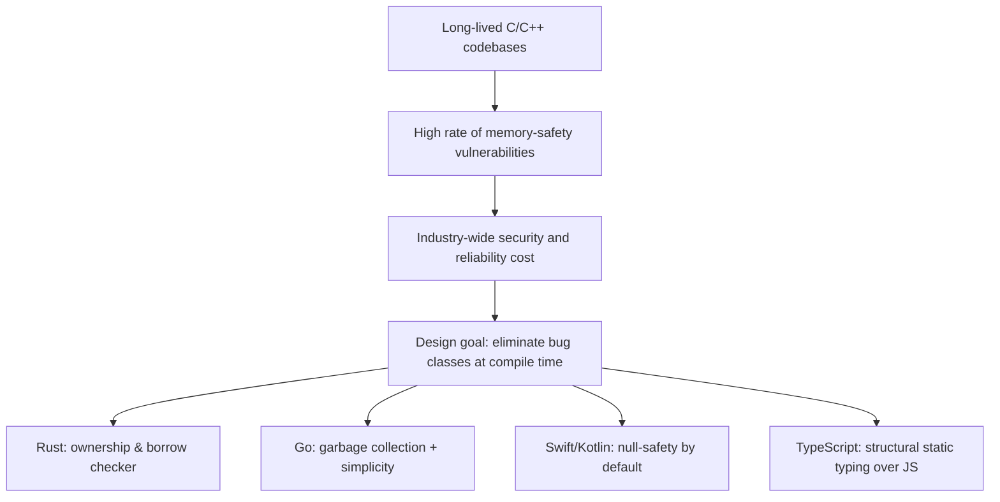

## Modern Multi-Paradigm and Safety-Focused Languages


### Overview

The most recent generation of widely adopted programming languages — Rust, Go, Kotlin, Swift, and TypeScript foremost among them — reflects a shift in industry priorities toward memory safety, type safety, and deliberate multi-paradigm flexibility, rather than allegiance to a single design school (purely object-oriented, purely functional, or purely procedural). These languages emerged largely in the 2009–2015 window, informed by decades of production experience with C, C++, Java, and JavaScript, and they share a common thread: treating entire classes of bugs (memory corruption, null references, data races, type confusion) as problems to be solved at compile time by the language and its tooling, rather than left to runtime discipline, documentation, or testing alone.

### The Motivating Problem: Costs of Unsafety at Scale

**Key Points**

- Memory-safety vulnerabilities (buffer overflows, use-after-free, null pointer dereferences, data races) in C and C++ codebases have been repeatedly identified by major software organizations as accounting for a large majority of serious security vulnerabilities in large, long-lived systems software. [Inference: the precise percentage of vulnerabilities attributable to memory safety varies by organization, codebase, and measurement methodology, though multiple independent industry reports over the 2010s–2020s converge on memory safety being the dominant category; the general trend, not an exact universal figure, is being described.]
- These costs are amplified at scale: operating systems, browsers, and infrastructure software are attack surfaces used by billions of users, so a single class of exploitable bug pattern recurring across a codebase has outsized real-world impact.
- This motivated a design goal shared across the new generation of languages: eliminate or drastically reduce specific bug classes through compiler-enforced guarantees, rather than relying solely on programmer discipline, static analysis add-ons, or runtime sanitizers layered on top of an inherently unsafe language.



### Rust: Memory Safety Without Garbage Collection

**Key Points**

- Originally started as a personal project by Graydon Hoare in 2006, later sponsored by Mozilla starting around 2009, Rust reached its stable 1.0 release in 2015.
- Rust's central innovation is the **ownership and borrowing system**: every value has a single owner; ownership can be transferred ("moved") or temporarily borrowed (immutably or mutably, but not both simultaneously); the compiler statically verifies these rules at compile time.
- This eliminates entire classes of memory bugs (use-after-free, double-free, data races on shared memory) without requiring a garbage collector, meaning Rust achieves memory safety while retaining C/C++-comparable runtime performance and predictable resource usage.
- The trade-off is a steeper learning curve: developers must internalize ownership rules, and the compiler ("the borrow checker") rejects programs that would otherwise compile fine in C++, even when the memory access pattern would have been safe in practice — prioritizing conservative, provably safe rejection over permissive but potentially unsafe acceptance.

**Example** (Rust ownership rules enforced at compile time)

```rust
fn main() {
    let s1 = String::from("hello");
    let s2 = s1; // ownership moves from s1 to s2

    // println!("{}", s1); // Compile error: s1 no longer owns the value
    println!("{}", s2); // OK
}
```

```rust
fn main() {
    let mut data = vec![1, 2, 3];
    let borrow1 = &data;       // immutable borrow
    let borrow2 = &data;       // multiple immutable borrows: OK
    println!("{:?} {:?}", borrow1, borrow2);

    let mut_borrow = &mut data; // Compile error if immutable borrows still in scope
    mut_borrow.push(4);
}
```

- Rust has no `null`; the absence of a value is represented explicitly via the `Option<T>` enum, forcing callers to handle the "no value" case through pattern matching rather than risking an unchecked null dereference.
- Since 2015, Rust has been adopted for systems-level components inside major browsers (Firefox's Servo-derived components), operating system kernels (portions of the Linux kernel and Windows), and has been repeatedly voted the "most admired language" in the annual Stack Overflow Developer Survey. [Unverified: survey rankings change year to year; this reflects a widely reported multi-year pattern rather than a claim about the current year's specific results, which should be checked against the latest survey if precision is needed.]

### Go: Simplicity and Concurrency at Scale

**Key Points**

- Designed at Google by Robert Griesemer, Rob Pike, and Ken Thompson, and released publicly in 2009, Go was created specifically to address pain points Google engineers experienced with large-scale C++ builds: slow compilation, complex dependency management, and the cognitive overhead of C++'s feature surface.
- Go deliberately omits many features common in other modern languages — no generics until Go 1.18 (2022), no traditional class-based inheritance, no exceptions (errors are ordinary return values) — in favor of a small, easy-to-learn core language and fast compilation.
- Concurrency is a first-class, syntactically lightweight feature via **goroutines** (lightweight, runtime-managed concurrent functions) and **channels** (typed conduits for communication between goroutines), directly implementing Tony Hoare's Communicating Sequential Processes (CSP) model.
- Go uses garbage collection rather than Rust's ownership model, trading some raw performance and memory predictability for a substantially simpler mental model and faster onboarding.

**Example** (Go goroutines and channels)

```go
package main

import "fmt"

func worker(id int, results chan<- string) {
    results <- fmt.Sprintf("worker %d done", id)
}

func main() {
    results := make(chan string, 3)
    for i := 1; i <= 3; i++ {
        go worker(i, results)
    }
    for i := 0; i < 3; i++ {
        fmt.Println(<-results)
    }
}
```

- Go's simplicity philosophy is explicit in its design principles: the language specification is intentionally small enough to be learned quickly, and `gofmt` (a standardized, non-configurable code formatter shipped with the toolchain) eliminates formatting debates across teams entirely by enforcing one canonical style automatically.
- Go became particularly dominant in cloud infrastructure tooling — Docker, Kubernetes, Terraform, and Prometheus are all written in Go, reflecting its strengths in networked services, concurrency, and straightforward deployment (statically compiled binaries with no external runtime dependency).

### Swift: Safety-Focused Apple Platform Development

**Key Points**

- Announced by Apple in 2014 as a successor to Objective-C, Swift was designed by a team led by Chris Lattner (also the creator of the LLVM compiler infrastructure that both Swift and Rust build upon).
- Swift's `Optional` type makes the presence or absence of a value explicit in the type system (`Int?` vs. `Int`), and safely unwrapping an optional is required by the compiler before use, directly targeting the historically common "null pointer" class of crashes in Objective-C and similar languages.
- Swift combines protocol-oriented programming (an emphasis on composable protocols/interfaces over deep class inheritance hierarchies), value types (`struct`, `enum`) as first-class citizens alongside reference types (`class`), and functional-influenced features (closures, higher-order functions on collections) into a cohesive multi-paradigm design.
- Automatic Reference Counting (ARC) manages memory without a full tracing garbage collector, offering more predictable performance characteristics than GC-based languages while remaining far less manual than C/C++ memory management.

**Example** (Swift optional handling)

```swift
func findUser(id: Int) -> String? {
    let users = [1: "Ana", 2: "Bo"]
    return users[id]
}

if let name = findUser(id: 1) {
    print("Found: \(name)")
} else {
    print("No user found")
}
```

### Kotlin: Pragmatic Safety on the JVM

**Key Points**

- Developed by JetBrains and first released in 2011, with Google announcing official first-class support for Android development in 2017, Kotlin was designed to be fully interoperable with existing Java code and the JVM ecosystem while fixing several long-standing Java pain points.
- Like Swift, Kotlin makes null-safety part of the type system: types are non-nullable by default, and nullable types must be explicitly marked (`String?`), with the compiler enforcing safe-call (`?.`) or explicit non-null assertion (`!!`) handling before use.
- Kotlin supports both object-oriented and functional programming idioms fluently (lambdas, higher-order functions, data classes for concise immutable value objects), and features like extension functions let developers add methods to existing classes (including Java standard library classes) without inheritance or modifying source.
- Because Kotlin compiles to JVM bytecode (and, via Kotlin/Native and Kotlin Multiplatform, to native and JavaScript targets as well), it allows gradual, file-by-file migration from Java in existing large codebases rather than requiring a full rewrite — a significant practical adoption driver.

**Example** (Kotlin null-safety and data classes)

```kotlin
data class User(val id: Int, val name: String)

fun findUser(id: Int): User? {
    val users = mapOf(1 to User(1, "Ana"), 2 to User(2, "Bo"))
    return users[id]
}

fun main() {
    val user = findUser(1)
    println(user?.name ?: "No user found")
}
```

### TypeScript: Retrofitting Static Typing onto JavaScript

**Key Points**

- Released by Microsoft in 2012 under Anders Hejlsberg (also the original designer of Turbo Pascal, Delphi, and C#), TypeScript is a strict syntactic superset of JavaScript that adds an optional static type system, compiling ("transpiling") down to plain JavaScript for execution.
- TypeScript's type system is **structural** (duck-typed at the type level: two types are compatible if their shapes match, regardless of explicit declared relationship) rather than strictly nominal, which fits naturally with JavaScript's existing dynamic, object-shape-driven idioms.
- Because JavaScript's ecosystem and runtime cannot be changed, TypeScript's safety guarantees exist only at compile/build time — type errors are caught before shipping, but nothing prevents type-incorrect data arriving at runtime from untyped JavaScript sources, external APIs, or `any`-typed escape hatches, making TypeScript's safety net fundamentally different in kind from Rust's or Swift's runtime guarantees. [Inference: characterizing TypeScript's safety as strictly weaker than Rust's or Swift's is a structural comparison based on documented design (erased types vs. enforced runtime/compile-time checks), not a claim about any specific bug-count outcome in practice.]
- TypeScript's rapid, near-ubiquitous adoption across large-scale JavaScript codebases (frontend frameworks like Angular are built in it by default; React and Vue ecosystems widely use it) reflects the same underlying motivation as Rust, Go, Swift, and Kotlin: catching an entire class of errors (type mismatches) at build time rather than discovering them in production.

**Example** (TypeScript structural typing and interfaces)

```typescript
interface User {
  id: number;
  name: string;
}

function greet(user: User): string {
  return `Hello, ${user.name}`;
}

// No explicit "implements User" needed — structural match is sufficient
const anonymousShape = { id: 1, name: "Ada", extra: true };
console.log(greet(anonymousShape)); // Valid: shape satisfies the User interface
```

### Comparative Safety Mechanisms

| Language | Memory Management | Null-Safety Approach | Primary Domain |
| --- | --- | --- | --- |
| Rust | Ownership/borrowing (no GC) | No null; `Option<T>` enum | Systems programming, performance-critical services |
| Go | Garbage collected | No built-in nullable-type enforcement (zero values instead) | Cloud infrastructure, networked services |
| Swift | Automatic Reference Counting | Optional types (`T?`), compiler-enforced unwrapping | Apple platform application development |
| Kotlin | JVM garbage collection | Non-nullable by default, `T?` for nullable | Android and JVM-based application development |
| TypeScript | Inherits JavaScript's GC | Optional strict-null-checks mode (`strictNullChecks`) | Large-scale JavaScript/web application development |

### Multi-Paradigm Flexibility as a Deliberate Design Stance

**Key Points**

- Unlike earlier language generations that often positioned themselves as advocates for a single paradigm (Java for object-orientation, Haskell for pure functional programming), this generation of languages explicitly blends paradigms as a pragmatic default rather than an ideological compromise.
- Rust supports object-oriented-style encapsulation via `struct`/`impl` and traits (interfaces), functional-style iterator chains and closures, and low-level procedural/systems programming, all within one coherent type system.
- Swift and Kotlin both blend object-oriented class hierarchies with value-type structs/data classes and functional collection operations, letting developers choose the right tool per problem rather than forcing every solution through one paradigm's lens.
- This multi-paradigm pragmatism reflects broader industry lessons from prior decades: pure allegiance to one paradigm (e.g., strict object-orientation with deep inheritance hierarchies) had produced its own well-documented maintainability problems, motivating a "use whichever construct fits" philosophy over doctrinal purity. [Inference: this framing draws a connective narrative between historical critiques of deep inheritance and the multi-paradigm design of newer languages; while both are independently well-documented, the causal link as a shared industry "lesson learned" is an interpretive synthesis rather than a directly citable single source.]

### Illustration: Compile-Time Safety Enforcement Points

<svg xmlns="http://www.w3.org/2000/svg" viewBox="0 0 780 340">
<text x="390" y="28" text-anchor="middle" font-size="18" font-weight="bold" fill="#1a1a1a">Where Safety Is Enforced (svg_diagram)</text>
<rect x="20" y="70" width="200" height="60" rx="8" fill="#fde8ec" stroke="#d63b6f" stroke-width="2" />
<text x="120" y="95" text-anchor="middle" font-size="12" font-weight="bold" fill="#1a1a1a">C / C++</text>
<text x="120" y="113" text-anchor="middle" font-size="10" fill="#555">Manual discipline; bugs surface at runtime</text>
<rect x="240" y="70" width="200" height="60" rx="8" fill="#fef3e0" stroke="#d68a1e" stroke-width="2" />
<text x="340" y="95" text-anchor="middle" font-size="12" font-weight="bold" fill="#1a1a1a">Go</text>
<text x="340" y="113" text-anchor="middle" font-size="10" fill="#555">GC removes manual memory mgmt;</text>
<text x="340" y="126" text-anchor="middle" font-size="10" fill="#555">type checks at compile time</text>
<rect x="460" y="70" width="150" height="60" rx="8" fill="#e8f0fe" stroke="#3b6fd6" stroke-width="2" />
<text x="535" y="95" text-anchor="middle" font-size="12" font-weight="bold" fill="#1a1a1a">Swift / Kotlin</text>
<text x="535" y="113" text-anchor="middle" font-size="10" fill="#555">Null-safety enforced</text>
<text x="535" y="126" text-anchor="middle" font-size="10" fill="#555">by type system</text>
<rect x="630" y="70" width="130" height="60" rx="8" fill="#e6f7ec" stroke="#2e9e5b" stroke-width="2" />
<text x="695" y="95" text-anchor="middle" font-size="12" font-weight="bold" fill="#1a1a1a">Rust</text>
<text x="695" y="113" text-anchor="middle" font-size="10" fill="#555">Ownership enforced</text>
<text x="695" y="126" text-anchor="middle" font-size="10" fill="#555">at compile time</text>
<line x1="20" y1="160" x2="760" y2="160" stroke="#333" stroke-width="2" />
<text x="20" y="180" font-size="11" fill="#333">Less compile-time enforcement</text>
<text x="620" y="180" font-size="11" fill="#333">More compile-time enforcement</text>
<circle cx="120" cy="160" r="6" fill="#d63b6f" />
<circle cx="340" cy="160" r="6" fill="#d68a1e" />
<circle cx="535" cy="160" r="6" fill="#3b6fd6" />
<circle cx="695" cy="160" r="6" fill="#2e9e5b" />
<rect x="150" y="230" width="480" height="80" rx="8" fill="#f3e8fe" stroke="#8a3bd6" stroke-width="2" />
<text x="390" y="258" text-anchor="middle" font-size="12" font-weight="bold" fill="#1a1a1a">TypeScript: a special case</text>
<text x="390" y="278" text-anchor="middle" font-size="10" fill="#444">Compile-time checks only; erased at runtime</text>
<text x="390" y="294" text-anchor="middle" font-size="10" fill="#444">Underlying JS execution remains fully dynamic</text>
</svg>

### Tooling as Part of the Safety Story

**Key Points**

- All five languages ship with strongly opinionated, integrated tooling (Rust's `cargo` and `clippy`; Go's `gofmt`, `go vet`, and built-in race detector; Swift's Swift Package Manager; Kotlin's tight IntelliJ/Android Studio integration; TypeScript's compiler-as-linter model), reflecting a design-era consensus that safety and consistency are as much a tooling problem as a syntax problem.
- Go's built-in data race detector (`go run -race`) and Rust's compiler-enforced thread-safety guarantees (the `Send` and `Sync` traits) both target concurrent-programming correctness directly at the tooling/compiler level rather than relying solely on runtime testing or code review to catch race conditions.
- This tooling-first philosophy represents a broader trend across the era: rather than treating the compiler as a minimal syntax checker, these languages treat the compiler and its accompanying toolchain as an active correctness-verification system integrated into everyday development.

### Trade-offs of the Safety-Focused Generation

**Key Points**

- Rust's compile-time guarantees come with the steepest learning curve of this group; the ownership and borrowing model requires a genuinely different mental model from garbage-collected or manually-managed languages, and initial development velocity is often reported as slower during the learning period. [Speculation: "often reported as slower" reflects a commonly cited developer experience in community discussion and surveys rather than a rigorously controlled, universally quantified productivity measurement.]
- Go's deliberate feature minimalism, while easing onboarding, was a source of sustained community debate — the two-decade absence of generics before Go 1.18 (2022) required verbose workarounds (interface{}/type assertions, code generation) for generic-style code that most peer languages handled natively much earlier.
- TypeScript's safety is inherently partial: because it compiles away to plain JavaScript and the underlying runtime remains untyped, `any` types, unsafe type assertions, and boundaries with untyped third-party JavaScript code all represent points where compile-time guarantees can be silently bypassed.
- Swift and Kotlin's null-safety systems, while effective, do not eliminate all runtime crashes related to optionals — force-unwrapping (`!` in Swift, `!!` in Kotlin) remains available as an escape hatch and, when misused, reintroduces the exact class of crash the type system was designed to prevent.

### Conclusion

The current generation of mainstream multi-paradigm, safety-focused languages — Rust, Go, Swift, Kotlin, and TypeScript — represents a maturation point in language design informed directly by decades of production experience with the costs of unsafety: memory corruption bugs in systems languages, null-pointer crashes in application languages, and type-confusion errors in large dynamically typed JavaScript codebases. Rather than adhering to a single paradigm, each blends object-oriented, functional, and procedural constructs pragmatically, while pushing correctness verification as early as possible in the development cycle — ideally to compile time, backed by integrated tooling that treats formatting, concurrency safety, and type checking as first-class parts of the language rather than optional add-ons. This shift reflects an industry-wide lesson: language design choices made at the type-system and compiler level can eliminate entire categories of costly bugs more reliably than after-the-fact discipline, testing, or documentation alone.

### Related Topics

- Rust's ownership and borrowing system in depth: lifetimes, the `Send`/`Sync` traits, and unsafe Rust
- Go's concurrency model: goroutines, channels, and the CSP (Communicating Sequential Processes) theoretical foundation
- Gradual typing systems compared: TypeScript, Python's type hints, and Kotlin's platform types for Java interop
- WebAssembly as a compilation target for Rust and other safety-focused languages in browser environments
- Android's Kotlin-first development shift and its implications for the historical Java ecosystem
- Apple's ARC (Automatic Reference Counting) compared to tracing garbage collection and Rust's ownership model
- Formal verification and safety-critical language subsets (e.g., Ada/SPARK, MISRA C) as an adjacent, stricter tradition
- The role of language-integrated package managers and build tools (Cargo, Go modules, npm/TypeScript tooling) in ecosystem health