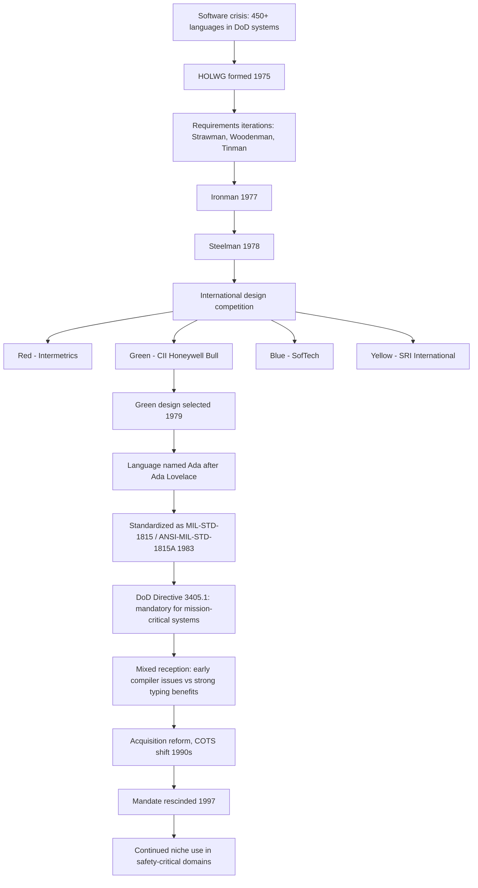

## Historical Context and the US Department of Defense Mandate

### Overview

Ada's origin is unusual among programming languages: it was not born from academic research or grassroots developer needs, but from a top-down procurement crisis inside the world's largest software purchaser, the United States Department of Defense (DoD). Understanding Ada requires understanding the economic and organizational pressures that led the DoD to commission an entirely new language rather than adopt an existing one.

### The Software Crisis of the 1970s

By the early 1970s, the DoD had become the largest single buyer and user of software in the world, running an enormous portfolio of embedded systems: missile guidance, avionics, radar, command-and-control, and shipboard systems.

**Key Points**

- The DoD found itself running over 450 distinct programming languages and dialects across its weapons systems and embedded platforms, most of them proprietary, incompatible, or specific to a single contractor or piece of hardware.
- Software costs were escalating far faster than hardware costs. As hardware became cheaper and more capable, software development, testing, and especially maintenance consumed an increasing share of total program budgets.
- Embedded software for weapons systems had unusually demanding requirements: real-time response guarantees, high reliability (failures could mean loss of life or mission failure), long deployment lifetimes (often decades), and the need for many separate teams and contractors to maintain code originally written by others.
- Existing languages of the era — assembly, FORTRAN, COBOL, JOVIAL, CMS-2, and various vendor-specific dialects — were seen as inadequate for these needs. They lacked strong typing, modularity, concurrency support, or portability across the different processors used in defense hardware.

This fragmentation meant that a technician trained on one weapons platform's software often could not maintain another, and contractors had strong incentives to keep using their own proprietary tools, deepening vendor lock-in.

### The HOLWG and the Language Requirements Process

In 1975, the DoD established the **High Order Language Working Group (HOLWG)**, tasked with determining whether a single standardized high-level language could replace the hundreds in use.

**Key Points**

- The HOLWG's process was unusually deliberate and public for a defense project. Rather than simply commissioning a language from a single vendor, it published a series of requirements documents, each open to public and academic comment, that iteratively refined what the ideal language should look like.
- The requirements documents were nicknamed after colors, reflecting their sequence of revisions: **Strawman** (1975), **Woodenman** (1975), **Tinman** (1976), **Ironman** (1977), and finally **Steelman** (1978).
- The Steelman requirements specified features such as strong typing, modularity via packages, generic programming facilities, exception handling, tasking (concurrency) support, and readability suitable for long-term maintenance by teams other than the original authors.
- The process explicitly favored designing a *new* language over adopting an existing one; a survey of candidate existing languages (including PL/I, ALGOL 68, and Pascal) found none satisfied the full requirement set, particularly around real-time tasking and strong safety guarantees.

### The Design Competition

Rather than developing the language in-house, the DoD ran an international competition, soliciting proposals from language designers around the world.

**Key Points**

- Four finalist teams, referred to by color-coded designations to keep the review anonymous, submitted competing language designs based on the Steelman requirements: **Red** (Intermetrics, led by Benjamin Brosgol), **Green** (CII Honeywell Bull, led by Jean Ichbiah), **Blue** (SofTech), and **Yellow** (SRI International).
- The Green team's design, led by French computer scientist **Jean Ichbiah**, was selected as the winner in 1979. Ichbiah's design drew heavily on Pascal's syntax and structure while adding strong modularity (packages), generics, exception handling, and tasking constructs suited to embedded real-time systems.
- [Unverified] The precise internal deliberation process and scoring criteria used by the DoD review panel to select the Green proposal over the other finalists are not fully documented in generally available public sources, though the broad requirement alignment with Steelman is well established.

### Naming the Language

The chosen language was named **Ada**, in honor of **Ada Lovelace** (Augusta Ada King, Countess of Lovelace), the 19th-century mathematician known for her work on Charles Babbage's proposed Analytical Engine, often regarded as the first person to publish an algorithm intended for execution by a machine.

**Key Points**

- The name was formally adopted in 1979, and the language specification underwent further refinement before being issued as an ANSI/MIL standard.
- The reference manual was published as **MIL-STD-1815**, with the number chosen to correspond to 1815, Ada Lovelace's birth year.
- Ada is a registered trademark of the U.S. Government (specifically, historically managed by the DoD and later the Ada Joint Program Office), reflecting its status as a government-commissioned standard rather than a vendor product.

### The 1983 Mandate

The most consequential and controversial part of Ada's early history was the DoD's decision to make it not merely available, but **mandatory**.

**Key Points**

- Following the language's standardization as **ANSI/MIL-STD-1815A** in 1983, the DoD issued **DoD Directive 3405.1** and subsequent policy requiring that Ada be used for all new mission-critical defense computer systems, with waivers required to use any other language.
- The stated goals of the mandate were to reduce the proliferation of languages, lower long-term maintenance costs across the multi-decade lifespans typical of weapons systems, improve software reliability, and reduce dependency on any single contractor's proprietary tools.
- The mandate applied primarily to *embedded* mission-critical systems (avionics, weapons control, etc.), not to all DoD software; general business and administrative computing was often exempted or handled separately.
- [Inference] Because compliance was tied to contract eligibility rather than purely technical merit, the mandate is generally understood to have driven adoption more through procurement leverage than through organic developer preference, though direct internal DoD documentation quantifying this balance is not something this summary can verify.

### Reception and Challenges

Ada's mandated adoption produced a mixed record that shaped much of the language's public reputation for decades afterward.

**Key Points**

- Early Ada compilers in the 1980s were criticized as slow, memory-hungry, and sometimes non-conforming to the full standard, partly because the language's ambitious feature set (generics, tasking, strong typing, exception handling) was difficult to implement well given the compiler technology and hardware of the era.
- The **Ada Compiler Validation Capability (ACVC)** was established to formally certify that a given compiler correctly implemented the standard, an unusually rigorous conformance-testing regime compared to most contemporary languages.
- Programmers accustomed to C, FORTRAN, or assembly sometimes found Ada verbose or restrictive, and its association with a bureaucratic mandate rather than grassroots enthusiasm contributed to a perception (fair or not) of Ada as a "government language" imposed from above rather than chosen on merit.
- [Inference] Despite this reputation, Ada's strong typing and compile-time checking are widely credited within the safety-critical software community with catching classes of errors that were common and costly in less strict languages of the same era, contributing to its continued use in aviation, rail, and space systems long after the strict mandate was relaxed.

### Decline of the Mandate

The strict mandate did not last indefinitely.

**Key Points**

- Through the 1990s, broader DoD acquisition reform (including initiatives associated with the Clinton-era Federal Acquisition Streamlining Act and related policy shifts) moved toward relying more on commercial-off-the-shelf (COTS) software and commercial standards rather than government-unique mandates.
- The formal Ada mandate was effectively rescinded in **1997**, when the DoD shifted policy to allow programming language selection based on program-specific technical and cost tradeoffs rather than a blanket requirement.
- Despite the mandate's removal, Ada continued to be used in many long-lived systems where it had already been deployed, and it retained a strong niche in safety-critical and high-integrity domains where its verification properties remained valuable independent of any government requirement.

### Timeline Diagram

<svg xmlns="http://www.w3.org/2000/svg" viewBox="0 0 900 460">
\<style\>
.title { font: bold 18px sans-serif; fill: #1a1a1a; }
.year { font: bold 14px sans-serif; fill: #ffffff; }
.label { font: 13px sans-serif; fill: #1a1a1a; }
.sub { font: 11px sans-serif; fill: #444444; }
.line { stroke: #888888; stroke-width: 3; }
\</style\>
<text x="450" y="30" text-anchor="middle" class="title">Ada Timeline: Requirements to Mandate Rescission (svg_diagram)</text>
<line x1="80" y1="80" x2="80" y2="420" class="line" />
<circle cx="80" cy="80" r="10" fill="#2563eb" />
<rect x="30" y="60" width="60" height="24" rx="4" fill="#2563eb" />
<text x="60" y="76" text-anchor="middle" class="year">1975</text>
<text x="100" y="76" class="label">HOLWG formed; Strawman / Woodenman requirements</text>
<circle cx="80" cy="140" r="10" fill="#2563eb" />
<rect x="30" y="120" width="60" height="24" rx="4" fill="#2563eb" />
<text x="60" y="136" text-anchor="middle" class="year">1977</text>
<text x="100" y="136" class="label">Ironman requirements published</text>
<circle cx="80" cy="200" r="10" fill="#7c3aed" />
<rect x="30" y="180" width="60" height="24" rx="4" fill="#7c3aed" />
<text x="60" y="196" text-anchor="middle" class="year">1978</text>
<text x="100" y="196" class="label">Steelman requirements finalized</text>
<circle cx="80" cy="260" r="10" fill="#7c3aed" />
<rect x="30" y="240" width="60" height="24" rx="4" fill="#7c3aed" />
<text x="60" y="256" text-anchor="middle" class="year">1979</text>
<text x="100" y="256" class="label">Green (Ichbiah) design selected; language named Ada</text>
<circle cx="80" cy="320" r="10" fill="#dc2626" />
<rect x="30" y="300" width="60" height="24" rx="4" fill="#dc2626" />
<text x="60" y="316" text-anchor="middle" class="year">1983</text>
<text x="100" y="316" class="label">ANSI/MIL-STD-1815A issued; DoD mandate begins</text>
<circle cx="80" cy="380" r="10" fill="#16a34a" />
<rect x="30" y="360" width="60" height="24" rx="4" fill="#16a34a" />
<text x="60" y="376" text-anchor="middle" class="year">1997</text>
<text x="100" y="376" class="label">DoD mandate formally rescinded</text>

<text x="100" y="410" class="sub">Ada retained in existing safety-critical and long-lifecycle systems after 1997</text>

</svg>

### Process Flow Diagram

### Conclusion

Ada's creation illustrates a rare case of a major programming language emerging from formal government requirements engineering rather than academic research or industry convention. The DoD's scale as a software buyer, combined with the genuine costs of language fragmentation across weapons systems, drove an unusually rigorous, publicly documented design process culminating in Jean Ichbiah's winning submission. The subsequent 1983–1997 mandate period made Ada simultaneously one of the most widely specified and most contested languages of its era: technically ambitious and rigorously validated, but also associated with top-down bureaucratic imposition. Its post-mandate survival in aviation, rail, and space systems suggests the language's technical properties, particularly around type safety and reliability, retained genuine value independent of the procurement pressure that first created its user base.

**Related Topics**

- Ada's core language features: strong typing, packages, and generics
- Tasking and concurrency model in Ada
- Exception handling design in Ada
- Comparison of the Red, Green, Blue, and Yellow competition submissions
- The Ada Compiler Validation Capability (ACVC) and conformance testing
- Ada 95, Ada 2005, Ada 2012: post-mandate language evolution
- Ada's use in aviation (DO-178C), rail, and aerospace safety-critical systems
- SPARK: the formally verifiable subset of Ada