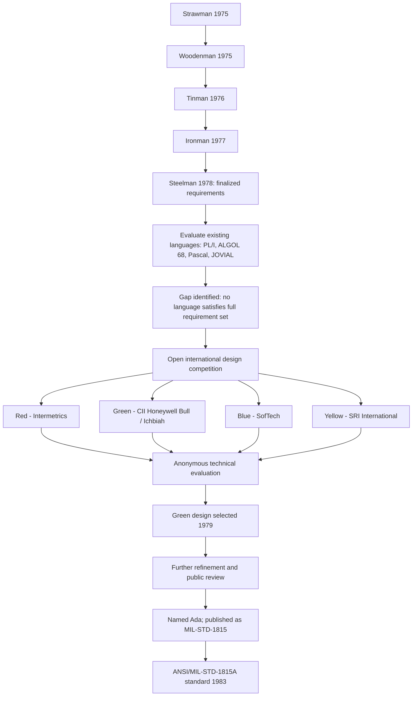

## Design Goals and the Language Competition Process

### Overview

Before Ada existed as a language, it existed as a set of formal requirements documents and a competitive selection process. This phase — running roughly from 1975 to 1979 — determined what the language had to do before anyone decided what it would look like syntactically. The process is notable for its iterative public refinement of requirements and its anonymized, multi-team design competition, both unusual for a defense-originated standard.

### From Requirements to Competition

The DoD did not simply ask vendors to submit language proposals. It first spent several years defining, testing, and revising the requirements a candidate language would need to satisfy, before opening a formal competition based on the final requirement set.

**Key Points**

- The requirements process ran through several named revisions, each incorporating feedback from academic reviewers, industry, and government stakeholders: Strawman (1975), Woodenman (1975), Tinman (1976), Ironman (1977), and Steelman (1978).
- Each revision tightened or clarified requirements based on critique of the previous version, functioning as a form of public peer review rarely seen in defense procurement at the time.
- Only after Steelman was finalized did the DoD formally solicit complete language designs, meaning the competition was a competition to best satisfy an already-fixed requirement specification, not a free-form design contest.

### Core Design Goals

The Steelman requirements and their predecessors articulated a set of goals driven directly by the operational problems the DoD had identified in its existing software portfolio.

**Key Points**

- **Reliability and safety**: the language needed strong compile-time checking (strict typing, range checking) to catch errors before deployment, given that defense software failures could have severe safety or mission consequences.
- **Maintainability across long lifecycles**: weapons systems often remained in service for decades, frequently maintained by teams other than the original developers, so the language needed to prioritize readability and explicitness over terseness.
- **Modularity**: large systems built by multiple contractors needed a way to define clean interfaces between components, which led to the requirement for a strong module/package system with separate specification and implementation.
- **Real-time and concurrent execution**: embedded systems such as radar and avionics needed native support for concurrent tasks with predictable timing behavior, rather than relying on operating-system-specific threading libraries.
- **Portability**: since defense software ran across many different processor architectures from different contractors, the language needed to avoid tying core semantics to any single hardware platform.
- **Generic programming**: to avoid duplicating code for different data types (a common cause of bugs and maintenance burden), the language needed a way to write reusable, type-parameterized components.
- **Exception handling**: mission-critical systems needed structured ways to detect and respond to runtime errors without resorting to ad hoc error codes or crashes.

### Evaluating Existing Languages

Before committing to a new language design, the requirements groups evaluated existing candidates against the evolving requirement set.

**Key Points**

- Languages considered included **PL/I**, **ALGOL 68**, **Pascal**, **COBOL**, **JOVIAL**, and others already in active defense use at the time.
- [Inference] None fully satisfied the combined requirements, particularly the combination of strong typing, native tasking, and modularity with separately compilable specifications; this gap is generally cited as the primary justification for pursuing a new language rather than adopting or extending an existing one, though the detailed internal scoring of each candidate against Steelman is not something this summary can fully verify.
- Pascal, designed by Niklaus Wirth, was influential as a structural and syntactic starting point for several competition entries because of its clarity and block structure, even though it lacked features like tasking and robust modularity on its own.

### The Design Competition Structure

Once Steelman was finalized, the DoD solicited complete language proposals from qualified organizations, evaluated anonymously to reduce bias toward any particular contractor or institution.

**Key Points**

- Submissions were reviewed under color-coded anonymous designations rather than by team or company name, intended to keep evaluation focused on technical merit against the Steelman requirements.
- Four finalist teams reached the final round: **Red** (Intermetrics), **Green** (CII Honeywell Bull, led by Jean Ichbiah), **Blue** (SofTech), and **Yellow** (SRI International).
- Each finalist team produced a full language design document describing syntax, semantics, and how the design satisfied each Steelman requirement, which was then reviewed by DoD-appointed technical evaluators and outside experts.
- The evaluation process included public and academic review periods, allowing the broader programming language community to comment on the finalist designs before a final selection was made.

### Selection of the Green Design

In 1979, the Green proposal, led by **Jean Ichbiah**, was selected as the winning design.

**Key Points**

- Ichbiah's design combined a Pascal-derived block structure and syntax with new constructs for packages (modularity), generics, tasking, and exception handling, directly mapping to the Steelman requirement categories.
- The package construct, separating a public specification from a private implementation, was seen as a strong solution to the multi-contractor maintainability requirement.
- The tasking model provided language-level primitives for concurrent execution and inter-task communication (later formalized around the rendezvous mechanism), addressing the real-time systems requirement without relying on external, platform-specific libraries.
- [Unverified] The specific comparative weaknesses identified by evaluators in the Red, Blue, and Yellow proposals relative to Green are not comprehensively documented in generally available public sources, though Green's closer alignment with the full Steelman requirement set is widely cited as the deciding factor.

### From Winning Design to Standard

Selection of the Green design was not the end of the process; the design underwent further refinement before becoming a formal standard.

**Key Points**

- Following selection, the language was refined through additional public review and revision cycles, incorporating feedback gathered during and after the competition.
- The refined language was named **Ada** in 1979, and the formal reference manual was eventually published as **MIL-STD-1815**, with later revision as **ANSI/MIL-STD-1815A** in 1983.
- This multi-year gap between "design selected" (1979) and "standard adopted and mandated" (1983) reflects the additional specification, review, and validation work needed to move from a competition-winning proposal to a rigorously defined, implementable standard.

### Competition Process Diagram

### Requirement-to-Feature Mapping Diagram

<svg xmlns="http://www.w3.org/2000/svg" viewBox="0 0 900 420">
\<style\>
.title { font: bold 18px sans-serif; fill: #1a1a1a; }
.goal { font: bold 13px sans-serif; fill: #ffffff; }
.feature { font: 13px sans-serif; fill: #1a1a1a; }
.box { stroke: #333333; stroke-width: 1; }
\</style\>
<text x="450" y="28" text-anchor="middle" class="title">Steelman Goals Mapped to Ada Language Features (svg_diagram)</text>
<rect x="30" y="60" width="230" height="40" rx="6" fill="#2563eb" class="box" />
<text x="145" y="85" text-anchor="middle" class="goal">Reliability / Safety</text>
<line x1="260" y1="80" x2="360" y2="80" stroke="#888" stroke-width="2" />
<rect x="360" y="60" width="260" height="40" rx="6" fill="#eef2ff" class="box" />
<text x="490" y="85" text-anchor="middle" class="feature">Strong static typing, range checks</text>
<rect x="30" y="115" width="230" height="40" rx="6" fill="#2563eb" class="box" />
<text x="145" y="140" text-anchor="middle" class="goal">Maintainability</text>
<line x1="260" y1="135" x2="360" y2="135" stroke="#888" stroke-width="2" />
<rect x="360" y="115" width="260" height="40" rx="6" fill="#eef2ff" class="box" />
<text x="490" y="140" text-anchor="middle" class="feature">Readable, explicit syntax</text>
<rect x="30" y="170" width="230" height="40" rx="6" fill="#2563eb" class="box" />
<text x="145" y="195" text-anchor="middle" class="goal">Modularity</text>
<line x1="260" y1="190" x2="360" y2="190" stroke="#888" stroke-width="2" />
<rect x="360" y="170" width="260" height="40" rx="6" fill="#eef2ff" class="box" />
<text x="490" y="195" text-anchor="middle" class="feature">Packages (spec / body separation)</text>
<rect x="30" y="225" width="230" height="40" rx="6" fill="#2563eb" class="box" />
<text x="145" y="250" text-anchor="middle" class="goal">Real-time concurrency</text>
<line x1="260" y1="245" x2="360" y2="245" stroke="#888" stroke-width="2" />
<rect x="360" y="225" width="260" height="40" rx="6" fill="#eef2ff" class="box" />
<text x="490" y="250" text-anchor="middle" class="feature">Tasking, rendezvous model</text>
<rect x="30" y="280" width="230" height="40" rx="6" fill="#2563eb" class="box" />
<text x="145" y="305" text-anchor="middle" class="goal">Portability</text>
<line x1="260" y1="300" x2="360" y2="300" stroke="#888" stroke-width="2" />
<rect x="360" y="280" width="260" height="40" rx="6" fill="#eef2ff" class="box" />
<text x="490" y="305" text-anchor="middle" class="feature">Hardware-independent semantics</text>
<rect x="30" y="335" width="230" height="40" rx="6" fill="#2563eb" class="box" />
<text x="145" y="360" text-anchor="middle" class="goal">Generic reuse</text>
<line x1="260" y1="355" x2="360" y2="355" stroke="#888" stroke-width="2" />
<rect x="360" y="335" width="260" height="40" rx="6" fill="#eef2ff" class="box" />
<text x="490" y="360" text-anchor="middle" class="feature">Generic units / templates</text>
</svg>

### Conclusion

Ada's design goals emerged from a disciplined, multi-year requirements engineering process rather than an individual designer's initial vision, and the subsequent competition selected among fully worked-out language proposals evaluated against those fixed requirements. This sequence — extensive requirements definition, evaluation of existing languages, anonymous competitive design submissions, then further refinement into a standard — produced a language whose major features (packages, tasking, generics, exception handling, strong typing) map directly and traceably back to specific operational problems the DoD had identified in its software portfolio. This traceability between stated goals and resulting language features remains one of the more distinctive aspects of Ada's origin compared to most other widely used programming languages.

**Related Topics**

- Detailed comparison of the Red, Blue, Yellow, and Green competition submissions
- Jean Ichbiah's design philosophy and prior language influences
- The package construct: specification vs. body separation
- Ada's tasking model and the rendezvous mechanism
- Generic units in Ada versus templates/generics in other languages
- MIL-STD-1815 and the path to ANSI standardization
- Steelman requirements compared to modern language design documents (e.g., Rust RFCs)